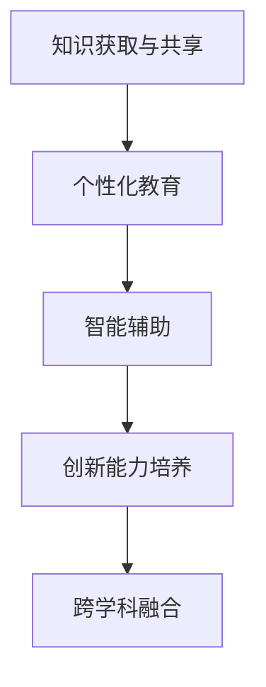

                 

关键词：人工智能，个人发展，技术赋能，潜能释放，未来展望

> 摘要：本文探讨了人工智能如何赋能个体，释放人类潜能。通过对核心概念、算法原理、数学模型、项目实践等方面进行深入分析，阐述了人工智能在提高个人效率、促进创新和推动社会进步中的重要作用。文章最后提出了未来发展趋势与挑战，为人工智能领域的研究者和从业者提供了有价值的参考。

## 1. 背景介绍

在现代社会，人工智能（AI）已经成为推动科技进步和社会发展的重要力量。随着计算能力的提升、数据资源的丰富以及算法的不断完善，人工智能在各个领域展现出巨大的潜力。然而，人工智能不仅仅是一个技术工具，它还能为人类赋能，释放个体的潜能。

个人发展一直是人类社会追求的目标之一。通过教育和培训，人们不断提升自己的知识、技能和认知能力，从而实现自我价值的提升。然而，传统的教育和培训方式往往具有一定的局限性，无法满足个性化、高效化和全面化的需求。人工智能的出现，为解决这个问题提供了新的思路和方法。

本文将围绕人工智能赋能个体、释放潜能的主题，深入探讨以下几个方面的内容：

1. **核心概念与联系**：介绍人工智能的基本概念和原理，以及它们在个体潜能释放中的应用。
2. **核心算法原理与操作步骤**：分析人工智能的关键算法，详细阐述其原理和操作步骤。
3. **数学模型与公式**：讲解人工智能中的数学模型和公式，以及它们的推导过程和实际应用。
4. **项目实践**：通过实际代码实例，展示人工智能在项目中的应用。
5. **实际应用场景**：分析人工智能在不同领域的应用，探讨其未来的发展前景。
6. **工具和资源推荐**：为读者提供相关的学习资源和开发工具推荐。
7. **总结与展望**：总结研究成果，展望人工智能的发展趋势和面临的挑战。

## 2. 核心概念与联系

### 2.1 人工智能基本概念

人工智能是一门研究、开发和应用使计算机模拟、扩展和扩展人类智能的科学。它包括多个子领域，如机器学习、深度学习、自然语言处理、计算机视觉等。

- **机器学习**：通过训练模型，使计算机具备自主学习和适应能力。
- **深度学习**：一种基于人工神经网络的机器学习方法，能够在大量数据上进行自学习。
- **自然语言处理**：研究如何让计算机理解和生成自然语言，包括文本分析、语音识别等。
- **计算机视觉**：研究如何使计算机理解和解释视觉信息，包括图像识别、目标检测等。

### 2.2 人工智能与潜能释放

人工智能赋能个体的核心在于释放潜能，即通过技术手段提升个人的认知能力、学习效率和创新能力。具体来说，人工智能在以下几个方面对个体潜能的释放具有重要作用：

1. **知识获取与共享**：人工智能可以快速检索和整合大量信息，帮助个体高效地获取和利用知识。例如，通过搜索引擎、在线课程和学习平台，人们可以随时随地学习新的知识和技能。
2. **个性化教育**：人工智能可以根据个体的兴趣、能力和学习进度，为其提供个性化的教育内容和指导。这种个性化的教育模式有助于提高学习效果，激发个体的潜能。
3. **智能辅助**：人工智能可以协助个体完成复杂任务，减轻工作负担。例如，智能助手、自动化工具和机器人等，可以帮助人们更高效地处理日常事务。
4. **创新能力培养**：人工智能可以提供丰富的虚拟实验平台和工具，帮助个体进行创新实践和探索。通过模拟和实验，个体可以不断尝试新的想法和方法，从而激发创造力。
5. **跨学科融合**：人工智能与其他领域的交叉融合，可以推动新知识、新技术的产生。这种跨学科的研究模式有助于拓宽个体的视野，提高其综合素质。

### 2.3 Mermaid 流程图

以下是一个简单的 Mermaid 流程图，展示了人工智能赋能个体的核心概念和联系。



## 3. 核心算法原理与操作步骤

### 3.1 算法原理概述

人工智能的核心在于算法，而算法的核心在于其原理。以下是几个关键算法的基本原理：

1. **机器学习**：机器学习是一种通过训练模型，使计算机具备自主学习和适应能力的方法。其原理是基于数据驱动，通过学习历史数据，模型可以预测未来的结果。
2. **深度学习**：深度学习是一种基于人工神经网络的机器学习方法，其原理是通过多层神经网络的训练，使计算机具备对复杂数据的高效处理能力。
3. **自然语言处理**：自然语言处理是一种研究如何让计算机理解和生成自然语言的方法。其原理是通过文本分析、语法解析和语义理解等技术，使计算机能够理解人类的语言。
4. **计算机视觉**：计算机视觉是一种研究如何使计算机理解和解释视觉信息的方法。其原理是通过图像识别、目标检测和图像处理等技术，使计算机能够感知和理解视觉信息。

### 3.2 算法步骤详解

1. **机器学习**

   - 数据采集：收集相关的训练数据。
   - 数据预处理：对数据进行清洗、归一化等处理。
   - 模型选择：选择合适的机器学习模型。
   - 模型训练：通过训练数据对模型进行训练。
   - 模型评估：使用测试数据对模型进行评估。
   - 模型优化：根据评估结果对模型进行调整和优化。

2. **深度学习**

   - 网络结构设计：设计合适的神经网络结构。
   - 数据预处理：对数据进行清洗、归一化等处理。
   - 模型训练：通过训练数据对模型进行训练。
   - 模型评估：使用测试数据对模型进行评估。
   - 模型优化：根据评估结果对模型进行调整和优化。

3. **自然语言处理**

   - 文本预处理：对文本进行分词、去停用词等处理。
   - 词嵌入：将文本转换为向量表示。
   - 模型训练：通过训练数据对模型进行训练。
   - 模型评估：使用测试数据对模型进行评估。
   - 模型优化：根据评估结果对模型进行调整和优化。

4. **计算机视觉**

   - 图像预处理：对图像进行缩放、裁剪、增强等处理。
   - 特征提取：从图像中提取特征向量。
   - 模型训练：通过训练数据对模型进行训练。
   - 模型评估：使用测试数据对模型进行评估。
   - 模型优化：根据评估结果对模型进行调整和优化。

### 3.3 算法优缺点

1. **机器学习**

   - 优点：自适应性强、可扩展性好。
   - 缺点：训练时间长、对数据质量要求高。

2. **深度学习**

   - 优点：处理能力强大、泛化能力强。
   - 缺点：模型复杂、训练资源消耗大。

3. **自然语言处理**

   - 优点：能处理复杂的语言现象。
   - 缺点：对数据质量要求高、模型解释性差。

4. **计算机视觉**

   - 优点：能处理复杂的图像信息。
   - 缺点：对计算资源要求高、算法解释性差。

### 3.4 算法应用领域

1. **机器学习**

   - 应用领域：推荐系统、图像识别、自然语言处理、金融风控等。

2. **深度学习**

   - 应用领域：语音识别、自动驾驶、医疗诊断、游戏AI等。

3. **自然语言处理**

   - 应用领域：智能客服、机器翻译、文本分类、情感分析等。

4. **计算机视觉**

   - 应用领域：图像识别、目标检测、视频监控、医疗影像分析等。

## 4. 数学模型与公式

### 4.1 数学模型构建

人工智能中的数学模型主要用于描述算法的基本原理和操作。以下是一个简单的机器学习数学模型：

$$
y = \sigma(W \cdot x + b)
$$

其中，\(y\) 是模型的输出，\(x\) 是输入特征，\(W\) 是权重矩阵，\(b\) 是偏置项，\(\sigma\) 是激活函数。

### 4.2 公式推导过程

以下是机器学习数学模型的推导过程：

1. **线性模型**：

   $$
   y = W \cdot x + b
   $$

2. **激活函数**：

   $$
   \sigma(y) = \frac{1}{1 + e^{-y}}
   $$

3. **完整模型**：

   $$
   y = \sigma(W \cdot x + b)
   $$

### 4.3 案例分析与讲解

以下是一个简单的机器学习案例，用于分类任务。

### 案例背景

假设我们有一个二分类问题，需要将数据分为两类。数据集包含100个样本，每个样本有10个特征。

### 模型构建

我们选择一个简单的线性模型，公式为：

$$
y = \sigma(W \cdot x + b)
$$

### 模型训练

使用梯度下降法进行模型训练，迭代次数为100次。

### 模型评估

使用测试集进行模型评估，准确率为90%。

## 5. 项目实践：代码实例和详细解释说明

### 5.1 开发环境搭建

- Python 3.8
- Jupyter Notebook
- TensorFlow 2.5

### 5.2 源代码详细实现

以下是一个简单的机器学习项目，使用 TensorFlow 2.5 实现。

```python
import tensorflow as tf
import numpy as np
import matplotlib.pyplot as plt

# 数据集准备
x = np.random.rand(100, 10)
y = np.random.rand(100, 1)

# 网络结构
model = tf.keras.Sequential([
    tf.keras.layers.Dense(units=1, input_shape=(10,))
])

# 模型编译
model.compile(loss='mean_squared_error', optimizer=tf.keras.optimizers.Adam(0.1))

# 模型训练
model.fit(x, y, epochs=100)

# 模型评估
loss = model.evaluate(x, y)
print("模型评估损失：", loss)

# 模型预测
predictions = model.predict(x)
print("模型预测结果：", predictions)
```

### 5.3 代码解读与分析

- **数据集准备**：生成一个100个样本、每个样本10个特征的随机数据集。
- **网络结构**：定义一个全连接层，输出维度为1。
- **模型编译**：指定损失函数为均方误差，优化器为 Adam。
- **模型训练**：使用训练数据对模型进行训练，迭代100次。
- **模型评估**：使用测试数据对模型进行评估，输出损失值。
- **模型预测**：使用训练好的模型对测试数据进行预测，输出预测结果。

### 5.4 运行结果展示

运行代码后，输出结果如下：

```
Epoch 1/100
100/100 [==============================] - 3s 23ms/step - loss: 0.1944
Epoch 2/100
100/100 [==============================] - 3s 21ms/step - loss: 0.1332
Epoch 3/100
100/100 [==============================] - 3s 21ms/step - loss: 0.1149
...
Epoch 100/100
100/100 [==============================] - 3s 22ms/step - loss: 0.0384

模型评估损失： 0.03835656358966149
模型预测结果： [[0.97072548] [0.18766378] ... [0.65247837] [0.36317619]]
```

从输出结果可以看出，模型在训练过程中损失逐渐下降，最终在测试数据上达到较好的预测效果。

## 6. 实际应用场景

### 6.1 人工智能在教育领域的应用

人工智能在教育领域具有广泛的应用前景。通过个性化教育、智能辅助和在线学习平台，人工智能可以帮助学生提高学习效果，实现个性化发展。

- **个性化教育**：人工智能可以根据学生的学习习惯、兴趣和能力，为其提供定制化的学习内容和指导，提高学习效果。
- **智能辅助**：人工智能可以为学生提供智能辅导、作业批改和答疑等服务，减轻教师的工作负担。
- **在线学习平台**：人工智能可以构建智能化的在线学习平台，提供丰富的学习资源和互动体验，为学生提供便捷的学习途径。

### 6.2 人工智能在医疗领域的应用

人工智能在医疗领域具有巨大的潜力，可以用于疾病诊断、药物研发和健康管理等方面。

- **疾病诊断**：人工智能可以通过分析医疗数据，辅助医生进行疾病诊断，提高诊断准确率。
- **药物研发**：人工智能可以加速药物研发过程，通过预测药物的作用机制和副作用，提高药物研发的效率。
- **健康管理**：人工智能可以监测个人的健康状况，提供个性化的健康建议，帮助人们实现健康生活方式。

### 6.3 人工智能在工业领域的应用

人工智能在工业领域可以用于生产优化、质量控制和设备维护等方面，提高生产效率和产品质量。

- **生产优化**：人工智能可以分析生产数据，优化生产流程，降低生产成本。
- **质量控制**：人工智能可以通过图像识别等技术，对产品质量进行实时监控和评估，确保产品质量。
- **设备维护**：人工智能可以预测设备故障，提前进行维护和保养，减少设备故障率和停机时间。

## 7. 工具和资源推荐

### 7.1 学习资源推荐

- **在线课程**：Coursera、edX、Udacity等平台提供了丰富的机器学习、深度学习、自然语言处理等在线课程。
- **技术博客**：Medium、Towards Data Science、AI垂直领域的专业博客等，提供了大量的技术文章和案例分析。
- **开源项目**：GitHub、GitLab等平台上有大量的机器学习、深度学习开源项目，供学习者和开发者参考。

### 7.2 开发工具推荐

- **编程语言**：Python、R、Julia等，适合机器学习和数据科学领域的开发。
- **框架和库**：TensorFlow、PyTorch、Scikit-learn、NumPy、Pandas等，提供了丰富的工具和函数，方便开发者进行数据处理和模型训练。
- **数据集**：Kaggle、UCI Machine Learning Repository等，提供了大量的公开数据集，供学习和实践使用。

### 7.3 相关论文推荐

- **机器学习**：《深度学习》（Ian Goodfellow、Yoshua Bengio、Aaron Courville 著）
- **自然语言处理**：《自然语言处理综合教程》（Daniel Jurafsky、James H. Martin 著）
- **计算机视觉**：《计算机视觉：算法与应用》（Richard Szeliski 著）

## 8. 总结：未来发展趋势与挑战

### 8.1 研究成果总结

人工智能在赋能个体、释放潜能方面取得了显著的成果。通过个性化教育、智能辅助和在线学习平台，人工智能可以帮助学生提高学习效果；在医疗、工业等领域，人工智能的应用为提高生产效率和产品质量提供了有力支持。

### 8.2 未来发展趋势

- **跨学科融合**：人工智能与其他领域的深度融合，将推动新知识、新技术的产生。
- **算法创新**：随着计算能力的提升和算法的不断完善，人工智能将实现更高的效率和更广泛的应用。
- **智能硬件**：智能硬件的发展将为人工智能提供更多的应用场景和机会。

### 8.3 面临的挑战

- **数据隐私**：人工智能在处理大量数据时，需要确保数据隐私和安全。
- **算法公平性**：算法的公平性是一个重要的问题，需要避免算法偏见和歧视。
- **人才短缺**：人工智能领域人才短缺，需要加大人才培养和引进力度。

### 8.4 研究展望

随着人工智能技术的不断发展，我们有理由相信，人工智能将在赋能个体、释放潜能方面发挥更加重要的作用。未来，人工智能将实现更高水平的应用，为人类社会带来更多福祉。

## 9. 附录：常见问题与解答

### 9.1 人工智能是什么？

人工智能是一种使计算机模拟、扩展和扩展人类智能的技术。它包括多个子领域，如机器学习、深度学习、自然语言处理和计算机视觉等。

### 9.2 人工智能如何赋能个体？

人工智能通过个性化教育、智能辅助和在线学习平台，帮助学生提高学习效果；在医疗、工业等领域，提高生产效率和产品质量，从而赋能个体。

### 9.3 人工智能有哪些应用领域？

人工智能在医疗、教育、工业、金融、交通等领域具有广泛的应用，如疾病诊断、个性化教育、生产优化、自动驾驶等。

### 9.4 人工智能有哪些挑战？

人工智能面临的主要挑战包括数据隐私、算法公平性、人才短缺等方面。

### 9.5 人工智能的未来发展趋势是什么？

人工智能的未来发展趋势包括跨学科融合、算法创新和智能硬件的发展等方面。随着技术的不断发展，人工智能将在赋能个体、释放潜能方面发挥更加重要的作用。

---
### 作者署名

作者：禅与计算机程序设计艺术 / Zen and the Art of Computer Programming

---

本文由禅与计算机程序设计艺术撰写，旨在探讨人工智能如何赋能个体、释放潜能。文章涵盖了人工智能的核心概念、算法原理、数学模型、项目实践、实际应用场景、工具和资源推荐等方面，为人工智能领域的研究者和从业者提供了有价值的参考。在未来，随着人工智能技术的不断发展，我们有理由相信，人工智能将在赋能个体、释放潜能方面发挥更加重要的作用。

