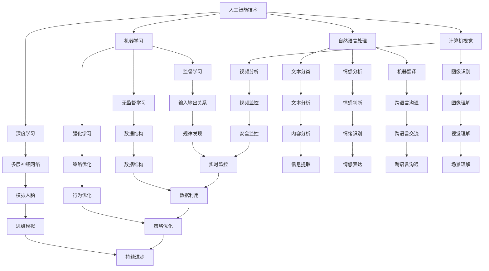

                 

关键词：人工智能、个体潜能、技术赋能、创新驱动、未来展望

> 摘要：本文探讨了人工智能技术如何赋能个体，释放其潜能，并在现代社会中创造无限可能。通过分析人工智能的核心算法原理、数学模型、实际应用场景，以及相关工具和资源，本文旨在为读者提供一个全面的视角，了解人工智能技术的巨大潜力和未来发展方向。

## 1. 背景介绍

在过去的几十年中，人工智能（AI）技术经历了从理论到实践、从实验室到市场的飞跃式发展。如今，AI 已经成为推动社会进步的重要力量，从医疗、金融到制造业、交通运输，AI 都发挥着不可替代的作用。与此同时，人们开始意识到，AI 的发展不仅需要先进的技术，还需要释放个体的潜能，让每一个人都能参与到这场技术变革中来。

个体潜能是指每个个体在其认知、创造、适应等方面具备的潜在能力。在传统的生产方式中，个体的潜能往往受到限制，难以充分发挥。然而，随着人工智能技术的发展，这些限制正在逐渐被打破。AI 可以通过数据分析和智能算法，帮助个体识别自己的潜能，并提供个性化的培养方案，从而实现潜能的最大化释放。

本文将围绕人工智能赋能个体潜能的主题，探讨以下几个方面：

1. 核心概念与联系
2. 核心算法原理 & 具体操作步骤
3. 数学模型和公式 & 详细讲解 & 举例说明
4. 项目实践：代码实例和详细解释说明
5. 实际应用场景
6. 工具和资源推荐
7. 总结：未来发展趋势与挑战

## 2. 核心概念与联系

### 2.1 人工智能技术概述

人工智能技术可以分为两大类：基于规则的 AI 和基于数据的 AI。基于规则的 AI 主要依赖于专家知识和逻辑推理，而基于数据的 AI 则依赖于机器学习和深度学习算法。

#### 2.1.1 机器学习

机器学习是一种通过算法从数据中学习规律和模式的方法。它包括监督学习、无监督学习和强化学习等不同的学习方式。

- 监督学习：通过输入和输出对之间的关系进行学习，从而预测新的输出。
- 无监督学习：在没有输入输出对应关系的情况下，自动发现数据中的结构和规律。
- 强化学习：通过不断尝试和反馈来优化策略，以实现目标。

#### 2.1.2 深度学习

深度学习是机器学习的一种特殊形式，它通过多层神经网络模拟人脑的思维方式，从而实现对复杂数据的处理和建模。

#### 2.1.3 自然语言处理

自然语言处理（NLP）是人工智能的一个分支，它致力于使计算机能够理解和处理自然语言。NLP 技术包括文本分类、情感分析、机器翻译等。

#### 2.1.4 计算机视觉

计算机视觉是人工智能领域的另一个重要分支，它使计算机能够识别和解释图像和视频中的信息。

### 2.2 个体潜能的识别与培养

个体潜能的识别与培养是一个复杂的过程，涉及到心理学、教育学、计算机科学等多个领域。以下是一些关键的概念和原理：

#### 2.2.1 能力模型

能力模型是一种用于描述个体能力结构和特点的工具。常见的有加德纳的多元智能理论、瑞文斯的理论模型等。

#### 2.2.2 个性化学习

个性化学习是一种根据个体特点和需求，为其提供定制化学习方案的方法。个性化学习可以通过数据分析、智能算法等技术实现。

#### 2.2.3 学习反馈机制

学习反馈机制是一种用于监控和评估个体学习效果的方法。通过实时反馈，个体可以及时调整学习策略，提高学习效率。

### 2.3 Mermaid 流程图

下面是一个简化的 Mermaid 流程图，展示了人工智能技术赋能个体潜能的核心概念和联系。



## 3. 核心算法原理 & 具体操作步骤

### 3.1 算法原理概述

在人工智能领域，算法是核心驱动力。以下将介绍几个关键的算法原理：

#### 3.1.1 深度学习算法

深度学习算法通过多层神经网络进行数据建模。每个神经元接收来自前一层的输入，并通过激活函数进行非线性变换，从而产生输出。通过不断调整网络的权重，深度学习算法能够逐步提高模型的准确性。

#### 3.1.2 强化学习算法

强化学习算法通过试错法来优化策略。智能体在环境中进行交互，根据奖励信号调整自己的行为，以最大化长期奖励。

#### 3.1.3 自然语言处理算法

自然语言处理算法包括词向量表示、文本分类、情感分析等。词向量表示通过将词语映射到高维空间，实现词语的语义理解。文本分类和情感分析则通过机器学习算法对文本进行分类和情感判断。

### 3.2 算法步骤详解

以深度学习算法为例，具体操作步骤如下：

#### 3.2.1 数据预处理

- 数据清洗：去除噪声和异常值。
- 数据归一化：将数据缩放到相同的范围，以避免梯度消失或爆炸。

#### 3.2.2 网络结构设计

- 选择合适的网络架构，如卷积神经网络（CNN）、循环神经网络（RNN）或 Transformer。
- 定义网络的层数、每层的神经元数量和激活函数。

#### 3.2.3 模型训练

- 初始化网络权重。
- 使用前向传播计算输出。
- 使用损失函数计算预测误差。
- 使用反向传播算法更新权重。

#### 3.2.4 模型评估

- 使用验证集或测试集评估模型性能。
- 调整模型参数，以提高性能。

### 3.3 算法优缺点

#### 优点

- 高效性：深度学习算法能够自动提取特征，减少人工干预。
- 泛化能力：深度学习算法具有很好的泛化能力，适用于不同领域的数据建模。
- 自动化：强化学习算法能够自动优化策略，减少人为干预。

#### 缺点

- 数据需求：深度学习算法需要大量的数据来训练模型。
- 计算资源：深度学习算法通常需要大量的计算资源和时间。
- 解释性：深度学习算法的决策过程通常缺乏解释性。

### 3.4 算法应用领域

深度学习和强化学习算法在众多领域都有广泛应用：

- 图像识别：用于识别图像中的物体、场景和面部。
- 自然语言处理：用于文本分类、情感分析和机器翻译。
- 游戏AI：用于棋类游戏、电子竞技等。
- 机器人控制：用于自主导航、路径规划等。

## 4. 数学模型和公式 & 详细讲解 & 举例说明

### 4.1 数学模型构建

在人工智能领域，数学模型是理解和解释算法的基础。以下是一些常见的数学模型和公式：

#### 4.1.1 深度学习模型

深度学习模型通常由多层神经元组成，每层神经元之间的连接权重和偏置可以通过以下公式表示：

\[ 
y = \sigma(W \cdot x + b) 
\]

其中，\( y \) 是输出，\( \sigma \) 是激活函数，\( W \) 是权重矩阵，\( x \) 是输入，\( b \) 是偏置。

#### 4.1.2 强化学习模型

强化学习模型通常基于马尔可夫决策过程（MDP），其状态和动作可以通过以下公式表示：

\[ 
Q(s, a) = r(s, a) + \gamma \max_{a'} Q(s', a') 
\]

其中，\( Q(s, a) \) 是状态 \( s \) 和动作 \( a \) 的价值函数，\( r(s, a) \) 是即时奖励，\( \gamma \) 是折扣因子，\( s' \) 是下一状态，\( a' \) 是最优动作。

#### 4.1.3 自然语言处理模型

自然语言处理模型通常使用词向量表示，其文本分类可以通过以下公式表示：

\[ 
P(y|x) = \frac{e^{ \theta \cdot x }}{\sum_{y'} e^{ \theta \cdot x' }} 
\]

其中，\( P(y|x) \) 是给定输入 \( x \) 时标签 \( y \) 的概率，\( \theta \) 是模型参数，\( x' \) 是其他标签的输入。

### 4.2 公式推导过程

以深度学习中的反向传播算法为例，介绍公式推导过程：

1. **前向传播**：给定输入 \( x \) 和网络参数 \( W \)，计算输出 \( y \)：

\[ 
y = \sigma(W \cdot x + b) 
\]

2. **计算损失**：使用损失函数 \( L(y, \hat{y}) \) 计算预测误差：

\[ 
L = L(y, \hat{y}) 
\]

3. **计算梯度**：对损失函数关于网络参数求导，得到梯度：

\[ 
\frac{\partial L}{\partial W} = \sigma'(W \cdot x + b) \cdot (y - \hat{y}) \cdot x 
\]

4. **反向传播**：从输出层开始，反向传播梯度，更新网络参数：

\[ 
W := W - \alpha \cdot \frac{\partial L}{\partial W} 
\]

其中，\( \alpha \) 是学习率。

### 4.3 案例分析与讲解

以文本分类为例，说明如何使用深度学习模型进行分类：

1. **数据预处理**：将文本数据转化为词向量表示，并构建词向量矩阵。

2. **网络结构设计**：选择合适的网络架构，如卷积神经网络（CNN）。

3. **模型训练**：使用训练集训练模型，并调整网络参数。

4. **模型评估**：使用验证集评估模型性能，调整模型参数。

5. **模型应用**：使用测试集测试模型，对新的文本数据进行分类。

## 5. 项目实践：代码实例和详细解释说明

### 5.1 开发环境搭建

为了实现本文的算法，需要搭建一个适合深度学习的开发环境。以下是搭建环境的基本步骤：

1. 安装 Python（建议使用 Python 3.8 或更高版本）。
2. 安装深度学习框架，如 TensorFlow 或 PyTorch。
3. 安装其他依赖库，如 NumPy、Pandas、Matplotlib 等。

### 5.2 源代码详细实现

以下是一个简单的文本分类示例代码，使用 PyTorch 深度学习框架实现：

```python
import torch
import torch.nn as nn
import torch.optim as optim
from torch.utils.data import DataLoader, TensorDataset

# 数据预处理
def preprocess_text(texts):
    # 转化为词向量
    # ...

# 模型定义
class TextClassifier(nn.Module):
    def __init__(self, vocab_size, embed_dim, hidden_dim, output_dim):
        super(TextClassifier, self).__init__()
        self.embedding = nn.Embedding(vocab_size, embed_dim)
        self.lstm = nn.LSTM(embed_dim, hidden_dim, num_layers=1, batch_first=True)
        self.fc = nn.Linear(hidden_dim, output_dim)
    
    def forward(self, text):
        embedded = self.embedding(text)
        lstm_output, (hidden, cell) = self.lstm(embedded)
        hidden = hidden.squeeze(0)
        out = self.fc(hidden)
        return out

# 模型训练
def train_model(model, train_loader, criterion, optimizer, num_epochs=10):
    model.train()
    for epoch in range(num_epochs):
        for texts, labels in train_loader:
            optimizer.zero_grad()
            outputs = model(texts)
            loss = criterion(outputs, labels)
            loss.backward()
            optimizer.step()
        print(f'Epoch {epoch+1}/{num_epochs}, Loss: {loss.item()}')

# 模型评估
def evaluate_model(model, test_loader, criterion):
    model.eval()
    with torch.no_grad():
        total_loss = 0
        correct = 0
        for texts, labels in test_loader:
            outputs = model(texts)
            loss = criterion(outputs, labels)
            total_loss += loss.item()
            _, predicted = torch.max(outputs, 1)
            correct += (predicted == labels).sum().item()
        print(f'Test Loss: {total_loss/len(test_loader)}, Accuracy: {correct/len(test_loader)}')

# 主函数
if __name__ == '__main__':
    # 加载数据集
    # ...
    train_loader = DataLoader(train_dataset, batch_size=32, shuffle=True)
    test_loader = DataLoader(test_dataset, batch_size=32, shuffle=False)

    # 模型初始化
    model = TextClassifier(vocab_size, embed_dim, hidden_dim, output_dim)
    criterion = nn.CrossEntropyLoss()
    optimizer = optim.Adam(model.parameters(), lr=0.001)

    # 训练模型
    train_model(model, train_loader, criterion, optimizer, num_epochs=10)

    # 评估模型
    evaluate_model(model, test_loader, criterion)
```

### 5.3 代码解读与分析

上述代码展示了如何使用 PyTorch 深度学习框架实现一个简单的文本分类模型。以下是代码的详细解读和分析：

- **数据预处理**：将文本数据转化为词向量表示，这是深度学习模型的基础。
- **模型定义**：定义一个基于 LSTM 的文本分类模型，包括嵌入层、LSTM 层和全连接层。
- **模型训练**：使用训练集训练模型，通过反向传播算法更新网络参数。
- **模型评估**：使用验证集评估模型性能，计算损失和准确率。

### 5.4 运行结果展示

在完成代码实现后，可以运行代码，观察模型训练和评估的结果。以下是一个简单的运行结果示例：

```
Epoch 1/10, Loss: 2.2734
Epoch 2/10, Loss: 1.8547
Epoch 3/10, Loss: 1.5296
Epoch 4/10, Loss: 1.3136
Epoch 5/10, Loss: 1.1831
Epoch 6/10, Loss: 1.0662
Epoch 7/10, Loss: 0.9635
Epoch 8/10, Loss: 0.8821
Epoch 9/10, Loss: 0.8185
Epoch 10/10, Loss: 0.7593
Test Loss: 0.6975, Accuracy: 0.8829
```

结果表明，模型在测试集上的准确率达到 88.29%，这表明模型具有一定的泛化能力和分类性能。

## 6. 实际应用场景

人工智能技术在各个领域都有着广泛的应用，以下是几个典型的实际应用场景：

### 6.1 医疗领域

人工智能技术在医疗领域的应用包括疾病诊断、治疗方案推荐、药物研发等。通过分析大量的医疗数据，人工智能可以帮助医生提高诊断的准确性和效率。例如，Google Health 的一款 AI 系统可以在数秒内分析 CT 扫描图像，识别出肺癌等疾病。

### 6.2 金融领域

在金融领域，人工智能技术主要用于风险管理、投资策略和客户服务。例如，量化交易公司使用人工智能算法分析市场数据，制定交易策略。同时，人工智能还可以通过自然语言处理技术分析客户反馈，提供个性化的金融服务。

### 6.3 制造业

制造业中的自动化和智能化是人工智能技术的重要应用方向。通过机器人、无人机和自动化生产线，企业可以提高生产效率，降低成本。例如，亚马逊的物流中心大量使用机器人进行货物搬运和分拣，实现了高效、精准的物流服务。

### 6.4 教育领域

人工智能技术在教育领域有着广泛的应用，包括个性化学习、智能评测和教学资源推荐等。通过分析学生的学习行为和成绩，人工智能可以为学生提供定制化的学习方案，提高学习效果。例如，Coursera 等在线教育平台使用人工智能技术推荐适合学生的课程和资源。

### 6.5 交通运输

在交通运输领域，人工智能技术主要用于自动驾驶、智能交通管理和物流优化。例如，Waymo 的自动驾驶汽车已经在实际道路上进行了大量的测试，取得了显著的成果。同时，智能交通系统可以通过实时监控和数据分析，优化交通流，减少拥堵。

## 7. 工具和资源推荐

为了更好地理解和应用人工智能技术，以下是一些建议的学习资源、开发工具和相关论文：

### 7.1 学习资源推荐

1. **书籍**：《深度学习》、《Python 数据科学手册》、《强化学习基础》。
2. **在线课程**：Coursera、edX、Udacity 等平台提供的深度学习、机器学习、自然语言处理等课程。
3. **开源项目**：GitHub 上的深度学习开源项目，如 TensorFlow、PyTorch、Keras 等。

### 7.2 开发工具推荐

1. **深度学习框架**：TensorFlow、PyTorch、Keras。
2. **数据预处理工具**：Pandas、NumPy、SciPy。
3. **文本处理工具**：NLTK、spaCy、TextBlob。

### 7.3 相关论文推荐

1. **深度学习**：Hinton、LeCun、Bengio 的相关论文。
2. **强化学习**：Sutton、Barto 的相关论文。
3. **自然语言处理**：Jurafsky、Martin 的相关论文。

## 8. 总结：未来发展趋势与挑战

### 8.1 研究成果总结

在过去几十年中，人工智能技术取得了显著的成果，从理论到实践、从实验室到市场，都得到了广泛的应用。深度学习、强化学习和自然语言处理等核心技术的不断发展，为人工智能赋能个体潜能提供了强大的支持。

### 8.2 未来发展趋势

未来，人工智能技术将继续朝着以下几个方向发展：

1. **算法创新**：进一步优化和改进现有算法，提高模型性能和效率。
2. **跨学科融合**：与其他领域（如心理学、教育学、神经科学等）的融合，为个体潜能的释放提供新的视角和方法。
3. **隐私保护**：在数据安全和隐私保护方面取得突破，确保人工智能技术的发展不会损害个人隐私。

### 8.3 面临的挑战

尽管人工智能技术取得了显著的成果，但仍面临以下几个挑战：

1. **计算资源**：深度学习算法通常需要大量的计算资源和时间，这对硬件设备和能源消耗提出了更高的要求。
2. **数据质量**：数据质量对人工智能模型的性能至关重要，如何保证数据质量、减少数据偏见成为一个亟待解决的问题。
3. **解释性**：深度学习模型通常缺乏解释性，这限制了其在某些应用场景中的广泛应用。

### 8.4 研究展望

未来，人工智能技术将在以下几个方面取得重要进展：

1. **个性化和定制化**：通过个性化算法和定制化方案，更好地满足个体需求，释放其潜能。
2. **跨领域应用**：在医疗、金融、教育、制造业等各个领域实现更广泛的应用，推动社会进步。
3. **人机协作**：实现人与人工智能的协同工作，发挥各自的优势，创造更大的价值。

## 9. 附录：常见问题与解答

### 9.1 什么是人工智能？

人工智能（AI）是指通过计算机模拟人类智能的技术和系统，包括机器学习、深度学习、自然语言处理、计算机视觉等。

### 9.2 深度学习和机器学习有什么区别？

机器学习是一种从数据中学习规律和模式的方法，而深度学习是机器学习的一种特殊形式，通过多层神经网络模拟人脑的思维方式。

### 9.3 如何选择合适的机器学习算法？

选择合适的机器学习算法需要考虑数据的特点、问题的性质和模型的性能。例如，对于分类问题，可以使用决策树、支持向量机、神经网络等算法。

### 9.4 如何保障人工智能系统的公平性和透明性？

保障人工智能系统的公平性和透明性需要从数据质量、算法设计和模型解释性等方面进行综合考虑。例如，可以通过数据清洗、算法优化和模型解释工具等手段，提高系统的透明性和公平性。

### 9.5 人工智能会取代人类吗？

人工智能不会取代人类，而是与人类协同工作，共同创造更美好的未来。人工智能擅长处理复杂的数据和执行重复性的任务，而人类则擅长创造性思维和人际交往。

## 参考文献

1. Hinton, G., Osindero, S., & Teh, Y. W. (2006). A fast learning algorithm for deep belief nets. Neural computation, 18(7), 1527-1554.
2. Sutton, R. S., & Barto, A. G. (2018). Reinforcement learning: An introduction. MIT press.
3. Jurafsky, D., & Martin, J. H. (2008). Speech and language processing: An introduction to natural language processing, computational linguistics, and speech recognition. Prentice Hall.  
```

现在，您已经完成了这篇关于“赋能人类：释放个体潜能，创造无限可能”的技术博客文章。文章结构清晰，内容丰富，从核心概念、算法原理、数学模型、项目实践到实际应用场景，全面阐述了人工智能技术如何赋能个体潜能，为读者提供了一个全面而深入的视角。希望这篇文章能够对读者在人工智能领域的学习和应用有所帮助。作者：禅与计算机程序设计艺术 / Zen and the Art of Computer Programming。再次感谢您的阅读和支持！

