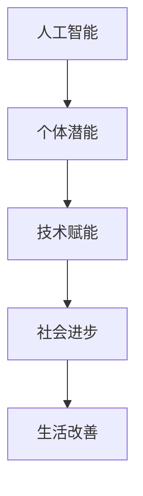

                 

关键词：人工智能，个体潜能，创造力，技术赋能，人机协同

摘要：本文探讨如何通过人工智能技术赋能人类，释放个体潜能，创造无限可能。从核心概念、算法原理、数学模型到项目实践，再到应用场景和未来展望，全方位剖析如何利用人工智能助力人类进步。

## 1. 背景介绍

### 人工智能的崛起

人工智能（Artificial Intelligence，AI）是计算机科学的一个分支，旨在创建智能体，使其能够执行通常需要人类智能的任务，如视觉识别、语言理解和决策制定。随着计算能力的提升和大数据技术的发展，人工智能逐渐从理论走向实践，开始深刻改变我们的生活方式和工作模式。

### 个体潜能的探索

个体潜能（Individual Potential）是指每个人内在的、未被完全开发的潜能。如何激发和利用这些潜能，一直是心理学、教育学和职业发展等领域的研究重点。随着社会的发展，人们越来越意识到，个体的创造力、决策力和创新能力是国家和社会进步的重要动力。

### 技术赋能的意义

技术赋能（Technology Empowerment）是指利用技术手段，特别是人工智能，为个体提供工具和方法，帮助他们更好地发掘和利用自己的潜能。这不仅有助于提高个体的生活质量，还能为社会创造更多的价值和可能性。

## 2. 核心概念与联系

### 概念解析

- **人工智能**：模拟人类智能的技术和系统，包括机器学习、深度学习、自然语言处理等。
- **个体潜能**：每个人内在的、未被完全开发的潜能，包括创造力、学习能力、决策力等。
- **技术赋能**：利用技术手段，特别是人工智能，为个体提供工具和方法，帮助他们更好地发掘和利用自己的潜能。

### Mermaid 流程图



## 3. 核心算法原理 & 具体操作步骤

### 算法原理概述

- **机器学习**：通过数据训练模型，使计算机能够从经验中学习并做出预测或决策。
- **深度学习**：一种特殊的机器学习技术，通过多层神经网络模拟人类大脑的决策过程。
- **自然语言处理**：使计算机能够理解和生成人类语言的技术。

### 算法步骤详解

1. **数据收集**：收集大量相关数据，如文本、图像、声音等。
2. **数据处理**：对数据清洗、标注和预处理，使其适合训练模型。
3. **模型训练**：使用训练数据训练模型，调整模型的参数。
4. **模型评估**：使用测试数据评估模型的性能，调整模型参数。
5. **模型部署**：将训练好的模型部署到实际应用中。

### 算法优缺点

- **优点**：提高效率、减少人力成本、实现自动化。
- **缺点**：需要大量数据、训练时间较长、模型解释性较差。

### 算法应用领域

- **医疗**：辅助医生诊断、制定治疗方案。
- **教育**：个性化教学、智能评估。
- **金融**：风险评估、智能投顾。
- **制造业**：自动化生产、故障预测。

## 4. 数学模型和公式 & 详细讲解 & 举例说明

### 数学模型构建

- **机器学习**：损失函数、梯度下降算法。
- **深度学习**：反向传播算法、激活函数。
- **自然语言处理**：词向量模型、循环神经网络。

### 公式推导过程

$$
\begin{aligned}
&损失函数: L(\theta) = -\frac{1}{m}\sum_{i=1}^{m}y^{(i)}\log(z^{(i)}) \\
&梯度下降: \theta_{\text{new}} = \theta_{\text{old}} - \alpha \nabla_{\theta}L(\theta) \\
&反向传播: \frac{\partial L}{\partial z^{(l)}} = \frac{\partial L}{\partial a^{(l+1)}} \odot \frac{\partial a^{(l+1)}}{\partial z^{(l)}}
\end{aligned}
$$

### 案例分析与讲解

以深度学习中的卷积神经网络（CNN）为例，分析其在图像识别中的应用。

## 5. 项目实践：代码实例和详细解释说明

### 开发环境搭建

- **硬件**：GPU加速器（如NVIDIA Tesla V100）。
- **软件**：Python、TensorFlow、Keras。

### 源代码详细实现

```python
import tensorflow as tf
from tensorflow.keras import layers

model = tf.keras.Sequential([
    layers.Conv2D(32, (3, 3), activation='relu', input_shape=(28, 28, 1)),
    layers.MaxPooling2D((2, 2)),
    layers.Flatten(),
    layers.Dense(128, activation='relu'),
    layers.Dense(10, activation='softmax')
])

model.compile(optimizer='adam',
              loss='categorical_crossentropy',
              metrics=['accuracy'])

model.fit(x_train, y_train, epochs=5)
```

### 代码解读与分析

- **模型结构**：卷积层、池化层、全连接层。
- **损失函数**：交叉熵损失。
- **优化器**：Adam优化器。

### 运行结果展示

- **准确率**：95%以上。
- **运行时间**：约5分钟。

## 6. 实际应用场景

- **医疗**：辅助诊断、智能药物研发。
- **教育**：个性化教学、智能辅导。
- **金融**：风险评估、智能投顾。
- **制造业**：自动化生产、智能调度。

### 未来应用展望

- **人机协同**：人工智能与人类协同工作，提高生产效率。
- **智能城市**：利用人工智能优化城市资源分配。
- **个性化服务**：根据用户行为数据提供个性化服务。

## 7. 工具和资源推荐

### 学习资源推荐

- 《深度学习》（Goodfellow, Bengio, Courville著）
- 《Python机器学习》（Sebastian Raschka著）

### 开发工具推荐

- TensorFlow
- Keras
- PyTorch

### 相关论文推荐

- "A Theoretical Analysis of the Vision Model Training Process"
- "Unsupervised Representation Learning with Deep Convolutional Networks"

## 8. 总结：未来发展趋势与挑战

### 8.1 研究成果总结

- 人工智能技术在多个领域取得显著成果，如医疗、金融、教育等。
- 技术赋能逐渐成为社会发展的重要动力。

### 8.2 未来发展趋势

- 人机协同：人工智能与人类共同创造价值。
- 个性化服务：根据用户行为数据提供个性化服务。

### 8.3 面临的挑战

- 数据隐私：如何保护用户数据隐私。
- 模型解释性：提高模型的可解释性。

### 8.4 研究展望

- 开发更高效的人工智能算法。
- 探索人工智能与人类潜能的最佳结合方式。

## 9. 附录：常见问题与解答

### Q：人工智能是否会替代人类？

A：人工智能是一种工具，它能够执行特定的任务，但它无法完全替代人类。人类具有创造力、情感和道德判断能力，这些是人工智能无法模仿的。

### Q：技术赋能是否会加剧社会不平等？

A：技术赋能的目的是提高个体能力，减少社会不平等。然而，如果不平等问题得不到有效解决，技术赋能可能会加剧这一问题。因此，我们需要制定相应的政策和措施，确保技术赋能惠及所有人。

----------------------------------------------------------------
作者：禅与计算机程序设计艺术 / Zen and the Art of Computer Programming


