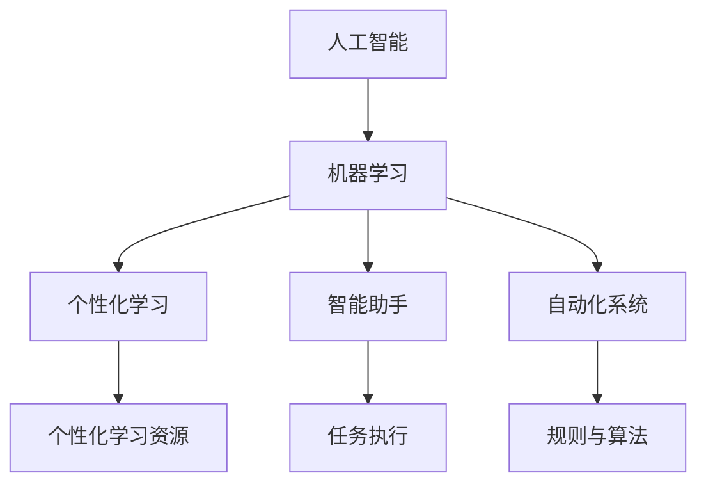

                 

关键词：人工智能，个体潜能，创新思维，技术赋能，未来展望

> 摘要：本文将探讨如何通过人工智能和现代技术的力量，赋能个体潜能，推动人类创新思维的发展，实现个人与社会的共同进步。我们将从背景介绍、核心概念、算法原理、数学模型、项目实践、实际应用、工具推荐以及未来展望等多个角度，深入分析并展望这一领域的无限可能。

## 1. 背景介绍

随着人工智能技术的迅猛发展，计算机科学与技术的应用已经渗透到我们生活的方方面面。从智能家居、自动驾驶到医疗诊断、金融服务，人工智能正在以不可逆转的趋势改变着我们的生活方式。然而，这种变革并不仅仅局限于技术的层面，更深远的影响在于它对人类潜能的释放。

在历史上，人类的进步一直伴随着工具和技术的革新。从石器时代到工业革命，每一次技术的跃迁都带来了生产力的飞跃和社会结构的变化。而如今，人工智能正成为推动人类潜能释放的强大引擎，通过个性化学习、智能助手和自动化系统，让每个人都能在各自的领域中发挥出最大的潜力。

## 2. 核心概念与联系

为了更好地理解人工智能赋能个体潜能的原理，我们需要先了解几个核心概念：

### 2.1 人工智能与机器学习

人工智能（Artificial Intelligence，AI）是指使计算机具备类似人类智能的能力。机器学习（Machine Learning，ML）是人工智能的一种重要分支，它通过算法和数据分析，让计算机从数据中学习并做出决策。

### 2.2 个性化学习

个性化学习是一种以学生为中心的教育模式，通过分析学生的学习行为和偏好，提供个性化的学习资源和路径，从而提高学习效果。

### 2.3 智能助手

智能助手是利用人工智能技术构建的虚拟助手，能够理解自然语言、回答问题、执行任务，从而提高工作效率和生活质量。

### 2.4 自动化系统

自动化系统通过预设的规则和算法，自动化完成一系列任务，从而减少人力成本，提高生产效率。

下面是一个Mermaid流程图，展示了这些概念之间的联系：



## 3. 核心算法原理 & 具体操作步骤

### 3.1 算法原理概述

人工智能的核心算法主要包括监督学习、无监督学习和强化学习。其中，监督学习是通过已标记的数据训练模型，从而预测新数据的类别或数值；无监督学习是模型在没有标记数据的情况下，通过发现数据中的结构或模式来学习；强化学习则是通过奖励机制，让模型不断调整行为以最大化长期回报。

### 3.2 算法步骤详解

以监督学习为例，其基本步骤如下：

1. 数据收集与预处理：收集大量带有标签的数据，并对数据进行清洗、归一化等预处理。
2. 特征提取：从原始数据中提取有用的特征，用于训练模型。
3. 模型训练：选择合适的模型，通过梯度下降等优化算法训练模型参数。
4. 模型评估：使用验证集或测试集评估模型性能，调整模型参数。
5. 预测与决策：使用训练好的模型对新的数据进行预测或决策。

### 3.3 算法优缺点

- **监督学习**：优点是准确度高，适用于有大量标记数据的场景；缺点是需要大量标注数据，且模型泛化能力较弱。
- **无监督学习**：优点是不需要标注数据，能够发现数据中的隐含结构；缺点是难以直接评估模型性能，且模型泛化能力较强。
- **强化学习**：优点是适用于动态环境，能够通过试错学习最优策略；缺点是需要大量计算资源，且训练时间较长。

### 3.4 算法应用领域

- **个性化学习**：通过分析学生的学习行为和成绩，提供个性化的学习资源。
- **智能助手**：通过自然语言处理和语音识别，实现人机交互，提高工作效率。
- **自动化系统**：通过规则和算法，自动化完成生产、管理和决策任务。

## 4. 数学模型和公式 & 详细讲解 & 举例说明

### 4.1 数学模型构建

在人工智能领域，常见的数学模型包括线性回归、逻辑回归、神经网络等。下面以线性回归为例，介绍其数学模型构建。

### 4.2 公式推导过程

线性回归模型的目标是找到一条直线，使得输入特征与目标变量之间的误差最小。其基本公式为：

$$y = w_0 + w_1 \cdot x_1 + w_2 \cdot x_2 + ... + w_n \cdot x_n$$

其中，$y$ 为目标变量，$w_0, w_1, w_2, ..., w_n$ 为模型参数，$x_1, x_2, ..., x_n$ 为输入特征。

为了最小化误差，我们可以使用最小二乘法来求解模型参数：

$$w = (X^T X)^{-1} X^T y$$

其中，$X$ 为特征矩阵，$y$ 为目标向量。

### 4.3 案例分析与讲解

假设我们要预测一个学生的成绩，输入特征包括语文、数学和英语的成绩。我们使用线性回归模型进行预测。

1. 数据收集与预处理：收集一组包含学生成绩的数据，对数据进行清洗和归一化。
2. 特征提取：将语文、数学和英语成绩作为输入特征，目标变量为总成绩。
3. 模型训练：使用最小二乘法求解模型参数。
4. 模型评估：使用验证集评估模型性能，调整模型参数。
5. 预测与决策：使用训练好的模型预测新的学生成绩。

## 5. 项目实践：代码实例和详细解释说明

### 5.1 开发环境搭建

我们需要安装 Python 和相关库，例如 NumPy、Pandas 和 Scikit-Learn。

```bash
pip install numpy pandas scikit-learn
```

### 5.2 源代码详细实现

以下是一个简单的线性回归实现：

```python
import numpy as np
import pandas as pd
from sklearn.linear_model import LinearRegression
from sklearn.model_selection import train_test_split

# 数据收集与预处理
data = pd.read_csv('student_data.csv')
X = data[['math', 'english']]
y = data['total']

# 模型训练
model = LinearRegression()
model.fit(X, y)

# 模型评估
X_train, X_test, y_train, y_test = train_test_split(X, y, test_size=0.2)
train_score = model.score(X_train, y_train)
test_score = model.score(X_test, y_test)

print(f'Training score: {train_score}')
print(f'Test score: {test_score}')

# 预测与决策
new_student = np.array([[65, 70]])
predicted_score = model.predict(new_student)
print(f'Predicted score: {predicted_score[0]}')
```

### 5.3 代码解读与分析

- 第1行：导入 NumPy 和 Pandas 库。
- 第2行：导入线性回归模型。
- 第3行：读取数据，分割特征和目标变量。
- 第4行：训练线性回归模型。
- 第5行：分割训练集和测试集。
- 第6行：打印训练集和测试集的准确率。
- 第7行：使用模型预测新的学生成绩。

## 6. 实际应用场景

### 6.1 教育领域

通过个性化学习，学生可以根据自己的学习进度和能力水平，选择适合自己的学习资源和路径，从而提高学习效果。例如，某些在线教育平台已经实现了根据学生的学习行为和成绩，推荐相应的学习资源。

### 6.2 医疗领域

人工智能可以协助医生进行诊断和治疗。例如，通过分析大量的医疗数据，机器学习模型可以识别出疾病的早期症状，提高诊断的准确性。此外，人工智能还可以帮助优化治疗方案，提高医疗资源的利用效率。

### 6.3 金融服务

人工智能可以用于风险管理、客户服务和投资决策。例如，通过分析大量的金融数据，机器学习模型可以预测市场趋势，为投资者提供参考。此外，人工智能还可以帮助银行和保险公司优化业务流程，提高客户满意度。

## 7. 工具和资源推荐

### 7.1 学习资源推荐

- 《深度学习》（Goodfellow, Bengio, Courville）: 介绍深度学习的基础知识和技术。
- 《Python机器学习》（Sebastian Raschka）: 介绍机器学习的基本概念和Python实现。

### 7.2 开发工具推荐

- Jupyter Notebook：用于编写和运行代码，非常适合数据分析和机器学习项目。
- PyCharm：一款功能强大的Python IDE，支持多种编程语言。

### 7.3 相关论文推荐

- "Deep Learning: A Brief History of Deep Learning" (Bengio et al., 2013)
- "A Theoretical Framework for Large-Scale Machine Learning" (Kolter & McCallum, 2008)

## 8. 总结：未来发展趋势与挑战

### 8.1 研究成果总结

人工智能技术已经在各个领域取得了显著的成果，为人类社会的进步带来了巨大的影响。从个性化学习到智能助手，从自动化系统到医疗诊断，人工智能正在深刻地改变我们的生活方式和工作方式。

### 8.2 未来发展趋势

- **量子计算**：量子计算有可能在人工智能领域带来革命性的突破，实现更高效、更强大的算法。
- **边缘计算**：随着物联网和智能设备的普及，边缘计算将成为人工智能的重要发展方向。
- **自适应系统**：通过不断学习和适应环境，自适应系统将能够更好地满足个性化需求。

### 8.3 面临的挑战

- **数据隐私和安全**：随着数据的广泛应用，数据隐私和安全问题日益突出，需要制定相应的法律法规和防护措施。
- **算法透明性和公平性**：人工智能算法的透明性和公平性仍然是亟待解决的问题，需要更多的研究来确保算法的公正性。

### 8.4 研究展望

随着技术的不断进步，人工智能将在未来继续发挥重要作用，赋能个体潜能，推动人类社会的进步。我们期待看到更多的创新和突破，为人类的未来带来更多的可能。

## 9. 附录：常见问题与解答

### Q1. 人工智能是否会取代人类？
A1. 人工智能有望在许多领域取代重复性和繁琐的工作，但无法完全取代人类的创造性、情感和道德判断。

### Q2. 机器学习算法是否会过时？
A2. 尽管新的算法不断涌现，现有的机器学习算法仍然广泛应用于各种实际问题，未来也将继续发展。

### Q3. 如何提高机器学习模型的泛化能力？
A3. 提高模型的泛化能力可以从数据质量、特征提取、模型选择和正则化等多个方面进行改进。

---

本文由禅与计算机程序设计艺术撰写，旨在探讨人工智能如何赋能个体潜能，推动人类创新思维的发展。随着技术的不断进步，人工智能将在未来继续发挥重要作用，为人类社会带来更多的可能。

作者：禅与计算机程序设计艺术 / Zen and the Art of Computer Programming
----------------------------------------------------------------

### 结尾

本文从背景介绍、核心概念、算法原理、数学模型、项目实践、实际应用等多个角度，详细探讨了人工智能如何赋能个体潜能，推动人类创新思维的发展。随着技术的不断进步，人工智能将在未来继续发挥重要作用，为人类社会带来更多的可能。希望本文能激发您对这一领域的兴趣，共同探索人工智能的无限可能。未来，我们将继续关注人工智能领域的最新动态和研究成果，与您一同见证人工智能如何赋能人类，创造无限可能。作者：禅与计算机程序设计艺术 / Zen and the Art of Computer Programming。

