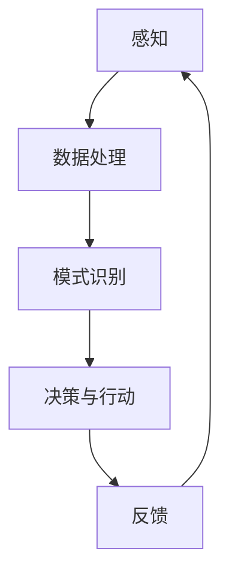

                 

关键词：人工智能、深度学习、机器学习、神经网络、大数据、计算理论、算法优化、应用前景、伦理问题

> 摘要：本文将深入探讨人工智能（AI）的过去、现在与未来，从技术原理、算法发展、数学模型、实际应用等多个角度分析 AI 的现状与潜力，同时探讨 AI 面临的伦理挑战与未来发展趋势。

## 1. 背景介绍

人工智能的概念最早由约翰·麦卡锡（John McCarthy）在1956年提出，旨在研究如何使计算机表现出类似人类智能的行为。随着计算能力的提升和大数据的普及，人工智能从理论走向了实际应用。如今，AI 已经成为了科技领域的热点，广泛应用于医疗、金融、交通、教育等多个行业。

### 1.1 人工智能的发展历程

- **20世纪50年代-70年代**：这个阶段的人工智能以符号推理和规则系统为主，典型的代表是专家系统和逻辑推理机。然而，由于缺乏大规模数据训练和计算能力不足，这些系统在实际应用中效果有限。
- **20世纪80年代-90年代**：随着机器学习和统计模型的兴起，人工智能开始转向基于数据的学习方法。这一时期的代表性算法包括决策树、支持向量机和神经网络。
- **21世纪**：深度学习的崛起标志着人工智能的又一次飞跃。深度神经网络在图像识别、自然语言处理等领域取得了突破性的进展，推动了 AI 产业的快速发展。

### 1.2 人工智能的现状

目前，人工智能已经从理论研究走向了实际应用，成为各行各业的重要技术支撑。例如，在医疗领域，AI 技术被用于疾病诊断、药物研发和医疗影像分析；在金融领域，AI 技术被用于风险评估、信用评分和自动化交易；在交通领域，AI 技术被用于智能交通管理和自动驾驶汽车。

## 2. 核心概念与联系

为了更好地理解人工智能的核心概念，我们可以借助 Mermaid 流程图来展示其原理和架构。



### 2.1 感知

感知是人工智能系统的第一步，通过传感器或数据输入获取外部信息。感知模块需要处理各种类型的数据，包括图像、声音、文本等。

### 2.2 数据处理

数据处理是对感知到的信息进行预处理，以便后续的分析和处理。这一过程可能包括去噪、降维、特征提取等步骤。

### 2.3 模式识别

模式识别是人工智能系统的核心功能，通过学习大量的数据，识别出数据中的模式和规律。这一过程通常依赖于机器学习算法和深度学习模型。

### 2.4 决策与行动

根据模式识别的结果，人工智能系统会做出决策并采取相应的行动。决策与行动模块是人工智能系统与外部环境交互的关键。

### 2.5 反馈

反馈是人工智能系统不断优化自身性能的重要环节。通过收集外部环境的反馈信息，系统可以调整自己的行为，提高决策的准确性。

## 3. 核心算法原理 & 具体操作步骤

### 3.1 算法原理概述

人工智能的核心算法主要包括机器学习、深度学习和强化学习。这些算法的核心原理是让计算机通过学习数据来获取知识，并能够根据新数据做出合理的决策。

### 3.2 算法步骤详解

#### 3.2.1 机器学习

1. **数据收集**：收集大量的训练数据。
2. **数据预处理**：对数据进行清洗、归一化和特征提取。
3. **模型选择**：选择合适的机器学习模型，如线性回归、决策树、神经网络等。
4. **模型训练**：使用训练数据对模型进行训练，调整模型的参数。
5. **模型评估**：使用验证集或测试集评估模型的性能。
6. **模型应用**：将训练好的模型应用于实际问题中。

#### 3.2.2 深度学习

1. **神经网络架构设计**：设计深度神经网络的层数和神经元数量。
2. **权重初始化**：初始化神经网络中的权重。
3. **前向传播**：将输入数据传递到神经网络中，计算出输出结果。
4. **反向传播**：根据输出结果计算损失函数，并反向更新权重。
5. **迭代训练**：重复前向传播和反向传播的过程，直到模型收敛。

#### 3.2.3 强化学习

1. **环境设置**：定义强化学习环境，包括状态空间、动作空间和奖励机制。
2. **策略选择**：选择一个策略来指导智能体（AI 系统）的动作。
3. **智能体学习**：智能体通过与环境交互，学习最优策略。
4. **策略优化**：根据智能体的表现，优化策略参数。

### 3.3 算法优缺点

#### 3.3.1 机器学习

**优点**：能够处理大规模数据，适应性强。

**缺点**：需要大量的训练数据，对数据质量要求高，模型的泛化能力有限。

#### 3.3.2 深度学习

**优点**：强大的表征能力，能够在多种任务中取得优异的性能。

**缺点**：训练时间较长，对计算资源要求高，模型可解释性差。

#### 3.3.3 强化学习

**优点**：能够在复杂环境中找到最优策略。

**缺点**：需要大量的交互数据，学习过程较为耗时。

### 3.4 算法应用领域

机器学习、深度学习和强化学习在各个领域都有广泛的应用。例如，在计算机视觉领域，深度学习被广泛应用于图像识别、目标检测和图像生成；在自然语言处理领域，机器学习和深度学习被用于文本分类、机器翻译和语音识别；在游戏领域，强化学习被用于开发智能游戏角色。

## 4. 数学模型和公式 & 详细讲解 & 举例说明

### 4.1 数学模型构建

人工智能的核心算法通常基于数学模型，其中最常用的模型是神经网络。神经网络的基本构建模块是神经元，每个神经元接收多个输入信号，通过激活函数产生输出。

### 4.2 公式推导过程

神经元的输出可以通过以下公式计算：

$$
\text{output} = \sigma(\sum_{i=1}^{n} w_i \cdot x_i + b)
$$

其中，$\sigma$ 是激活函数，$w_i$ 是输入信号的权重，$x_i$ 是输入信号的值，$b$ 是偏置项。

常见的激活函数包括 sigmoid 函数和 ReLU 函数：

$$
\sigma(x) = \frac{1}{1 + e^{-x}}
$$

$$
\sigma(x) = \max(0, x)
$$

### 4.3 案例分析与讲解

以下是一个简单的神经网络模型，用于对图像进行分类。

#### 4.3.1 模型构建

假设我们有一个包含1000个输入特征的图像，需要将其分类为10个类别。我们可以设计一个三层的神经网络，包括输入层、隐藏层和输出层。

输入层：1000个神经元，对应1000个输入特征。

隐藏层：100个神经元，使用 ReLU 函数作为激活函数。

输出层：10个神经元，对应10个类别，使用 softmax 函数作为激活函数。

#### 4.3.2 模型训练

1. **数据准备**：准备包含图像和标签的数据集，并进行预处理。
2. **模型初始化**：初始化权重和偏置项。
3. **前向传播**：将图像输入到神经网络中，计算输出结果。
4. **反向传播**：计算损失函数，并使用梯度下降法更新权重和偏置项。
5. **迭代训练**：重复前向传播和反向传播的过程，直到模型收敛。

#### 4.3.3 模型评估

使用验证集或测试集评估模型的性能，常用的评价指标包括准确率、召回率和 F1 分数。

## 5. 项目实践：代码实例和详细解释说明

### 5.1 开发环境搭建

为了实现上述神经网络模型，我们需要搭建一个开发环境。这里我们选择使用 Python 语言和 TensorFlow 深度学习框架。

#### 5.1.1 安装 Python

在官方网站下载并安装 Python，推荐使用 Python 3.7 或更高版本。

#### 5.1.2 安装 TensorFlow

在命令行中运行以下命令安装 TensorFlow：

```bash
pip install tensorflow
```

### 5.2 源代码详细实现

以下是一个简单的神经网络模型，用于对图像进行分类。

```python
import tensorflow as tf
from tensorflow.keras import layers

# 定义神经网络模型
model = tf.keras.Sequential([
    layers.Dense(100, activation='relu', input_shape=(1000,)),
    layers.Dense(10, activation='softmax')
])

# 编译模型
model.compile(optimizer='adam',
              loss='categorical_crossentropy',
              metrics=['accuracy'])

# 加载数据
(x_train, y_train), (x_test, y_test) = tf.keras.datasets.mnist.load_data()

# 预处理数据
x_train = x_train.astype('float32') / 255
x_test = x_test.astype('float32') / 255
y_train = tf.keras.utils.to_categorical(y_train, 10)
y_test = tf.keras.utils.to_categorical(y_test, 10)

# 训练模型
model.fit(x_train, y_train, epochs=10, batch_size=64, validation_split=0.2)
```

### 5.3 代码解读与分析

上述代码首先导入了 TensorFlow 深度学习框架，并定义了一个简单的神经网络模型。该模型包含一个输入层、一个隐藏层和一个输出层。输入层有1000个神经元，隐藏层有100个神经元，输出层有10个神经元。

接着，我们编译了模型，并加载了 MNIST 数据集。数据集经过预处理后，被用于训练模型。在训练过程中，我们使用了 Adam 优化器和交叉熵损失函数，并设置了10个训练周期。

### 5.4 运行结果展示

在训练完成后，我们可以使用测试集评估模型的性能：

```python
test_loss, test_accuracy = model.evaluate(x_test, y_test)
print('Test accuracy:', test_accuracy)
```

输出结果为测试集上的准确率，通常可以达到较高的水平。

## 6. 实际应用场景

### 6.1 医疗

人工智能在医疗领域的应用日益广泛，从疾病诊断、药物研发到医疗影像分析，AI 技术都发挥着重要作用。例如，谷歌的 DeepMind 公司开发的 AI 系统可以快速准确地诊断眼疾，使得医生能够更早地发现并治疗疾病。

### 6.2 金融

在金融领域，人工智能被用于风险评估、信用评分、自动化交易等方面。通过分析大量历史数据和实时数据，AI 系统可以预测市场走势、评估信用风险，从而帮助金融机构做出更明智的决策。

### 6.3 交通

人工智能在交通领域的应用主要体现在智能交通管理和自动驾驶汽车上。通过分析交通流量、车辆信息和环境数据，AI 系统可以优化交通信号、预测交通事故，提高道路使用效率。同时，自动驾驶汽车技术也在不断发展，有望在未来实现安全、高效的自动驾驶。

### 6.4 教育

人工智能在教育领域的应用包括个性化学习、智能辅导和在线教育平台等。通过分析学生的学习行为和成绩数据，AI 系统可以为学生提供个性化的学习建议，提高学习效果。同时，在线教育平台利用 AI 技术实现智能题库、自动评分等功能，提高了教育的效率和灵活性。

## 7. 未来应用展望

### 7.1 新兴领域

随着技术的进步，人工智能将在更多新兴领域得到应用。例如，在生物科技领域，AI 可以用于基因编辑、蛋白质结构预测等；在能源领域，AI 可以用于智能电网管理、能源预测等。

### 7.2 伦理问题

人工智能的发展也带来了伦理问题，如隐私保护、算法歧视和失业问题等。在未来，我们需要制定相应的法律法规，确保人工智能的健康发展。

### 7.3 技术挑战

人工智能的发展还面临许多技术挑战，如算法优化、计算资源消耗、数据隐私保护等。未来的研究需要解决这些问题，推动人工智能技术的进一步发展。

## 8. 工具和资源推荐

### 8.1 学习资源推荐

- 《深度学习》（Ian Goodfellow、Yoshua Bengio 和 Aaron Courville 著）
- 《Python 机器学习》（ Sebastian Raschka 和 Vahid Mirjalili 著）
- 《机器学习实战》（Peter Harrington 著）

### 8.2 开发工具推荐

- TensorFlow（https://www.tensorflow.org/）
- PyTorch（https://pytorch.org/）
- Keras（https://keras.io/）

### 8.3 相关论文推荐

- “A Theoretical Framework for Back-Propagation” （Geoffrey Hinton、David E. Rumelhart 和 Robert McClelland 著）
- “Deep Learning” （Ian Goodfellow、Yoshua Bengio 和 Aaron Courville 著）
- “Recurrent Neural Networks for Language Modeling” （Yoshua Bengio、Dimitris P. King 和 Patrick Simard 著）

## 9. 总结：未来发展趋势与挑战

### 9.1 研究成果总结

近年来，人工智能取得了显著的成果，从理论到实践都取得了重要的突破。深度学习、机器学习和强化学习等算法在各个领域都取得了优异的性能。

### 9.2 未来发展趋势

随着技术的不断进步，人工智能将在更多领域得到应用。未来，我们将看到更高效、更智能的人工智能系统，以及更加普及的智能应用。

### 9.3 面临的挑战

人工智能的发展也面临许多挑战，如算法优化、计算资源消耗、数据隐私保护等。同时，人工智能的伦理问题也需要得到充分的关注和解决。

### 9.4 研究展望

未来，人工智能研究将继续深入，推动技术在各个领域的应用。同时，我们需要关注伦理问题，确保人工智能的健康发展，为人类社会带来更多的福祉。

## 10. 附录：常见问题与解答

### 10.1 人工智能的定义是什么？

人工智能是指计算机系统模拟人类智能行为的能力，包括学习、推理、感知、理解、解决问题等方面。

### 10.2 深度学习与机器学习的区别是什么？

深度学习是机器学习的一个分支，主要基于多层神经网络进行学习。而机器学习则包括更广泛的算法，如决策树、支持向量机等。

### 10.3 人工智能的发展前景如何？

人工智能有着广阔的发展前景，将在医疗、金融、交通、教育等多个领域发挥重要作用，推动社会的进步和发展。

---

作者：禅与计算机程序设计艺术 / Zen and the Art of Computer Programming
----------------------------------------------------------------

这篇文章以深入浅出的方式，探讨了人工智能的核心概念、算法原理、数学模型、实际应用以及未来展望。希望这篇文章能够为读者提供有价值的参考和启示。在人工智能的快速发展中，我们期待能够实现技术与伦理的和谐共进，为人类社会创造更多的价值。

