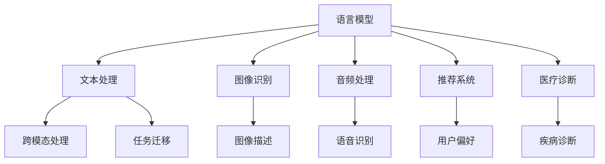

                 

关键词：语言模型，非语言任务，神经网络，人工智能，应用场景

> 摘要：本文将探讨语言模型（LLM）在非语言任务上的应用，包括核心概念、算法原理、数学模型、项目实践以及未来应用展望。通过深入分析和实例讲解，我们将展示语言模型在非语言领域的强大潜力。

## 1. 背景介绍

随着人工智能技术的快速发展，语言模型（Language Model，简称LLM）已经成为自然语言处理（Natural Language Processing，简称NLP）领域的重要工具。传统语言模型主要针对文本处理任务，如机器翻译、文本摘要和问答系统等。然而，近年来，随着神经网络架构的改进和大规模数据的涌现，语言模型开始展现出超越语言处理领域的潜力，逐步应用于非语言任务中。

非语言任务包括图像识别、音频处理、推荐系统、医疗诊断等，这些任务在工业界和学术界都有着广泛的应用和研究价值。传统的非语言任务解决方案往往依赖于各自领域特定的算法和模型，而这些模型在跨领域任务上的表现往往不尽如人意。相比之下，语言模型以其强大的泛化能力和跨模态处理能力，为非语言任务提供了一种新的解决方案。

本文将详细探讨LLM在非语言任务上的应用，包括核心概念、算法原理、数学模型、项目实践和未来应用展望。希望通过本文的讨论，读者能够对LLM在非语言任务上的应用有更深入的理解和认识。

## 2. 核心概念与联系

### 2.1 语言模型的基本概念

语言模型是自然语言处理领域的一个基础概念，用于预测文本序列的概率。最简单的语言模型是基于N-gram模型，它通过统计相邻N个单词的出现频率来预测下一个单词。然而，这种模型在处理长文本时效果不佳，因为它忽略了长距离依赖关系。

为了解决这个问题，研究人员提出了基于神经网络的深度语言模型，如循环神经网络（RNN）、长短期记忆网络（LSTM）和变换器（Transformer）。Transformer模型因其卓越的性能和效率，已成为当前语言模型的主流架构。

### 2.2 非语言任务的基本概念

非语言任务指的是不涉及文本处理，而是处理图像、音频、视频等其他类型数据的任务。常见的非语言任务包括：

- 图像识别：通过计算机视觉算法识别图像中的物体、场景和动作。
- 音频处理：通过语音识别和声学模型处理音频信号，实现语音到文本的转换。
- 推荐系统：根据用户的历史行为和偏好，为用户推荐相关商品或内容。
- 医疗诊断：通过医疗数据分析和诊断模型，辅助医生进行疾病诊断和治疗。

### 2.3 语言模型与非语言任务的联系

语言模型与非语言任务的联系主要体现在两个方面：

1. **跨模态处理能力**：语言模型通过其强大的文本处理能力，可以有效地处理跨模态数据。例如，在图像识别任务中，语言模型可以用于生成图像的描述性文本，从而帮助计算机更好地理解图像内容。

2. **任务迁移能力**：语言模型在处理语言任务时积累了大量的知识，这些知识可以迁移到非语言任务中，提高非语言任务的处理效果。例如，在推荐系统中，语言模型可以用于分析用户评论和商品描述，从而更准确地预测用户的兴趣和偏好。

### 2.4 Mermaid 流程图

为了更直观地展示语言模型在非语言任务中的应用，我们可以使用Mermaid流程图来描述核心概念和联系。以下是一个简单的示例：



在这个流程图中，语言模型通过其文本处理能力（B）与多种非语言任务（C、D、E、F）建立联系，同时通过跨模态处理能力（G）和任务迁移能力（H）实现不同任务之间的数据共享和知识传递。

## 3. 核心算法原理 & 具体操作步骤

### 3.1 算法原理概述

语言模型在非语言任务上的应用主要基于其强大的文本生成和文本分析能力。在文本处理任务中，语言模型通过学习大规模文本数据，预测下一个单词或字符的概率分布。这一过程可以抽象为一个概率模型，通常采用神经网络架构，如Transformer模型。

在非语言任务中，语言模型的应用主要包括以下几种方式：

1. **文本生成**：利用语言模型生成描述性文本，如图像描述、音频文本摘要等。
2. **文本分析**：利用语言模型分析文本数据，如情感分析、文本分类等。
3. **跨模态转换**：利用语言模型将非语言数据转换为文本数据，如图像文本转换、语音文本转换等。
4. **知识迁移**：利用语言模型在语言任务中学习到的知识，迁移到非语言任务中，如基于语言模型的知识增强推荐系统。

### 3.2 算法步骤详解

以下是语言模型在非语言任务中的具体操作步骤：

1. **数据收集与预处理**：
   - 收集大规模的非语言数据，如图像、音频、文本等。
   - 对数据进行清洗、去噪和格式化，以便模型训练。

2. **模型训练**：
   - 选择合适的神经网络架构，如Transformer模型。
   - 使用预处理后的数据训练语言模型，包括文本数据和非语言数据。
   - 调整模型参数，优化模型性能。

3. **文本生成与文本分析**：
   - 利用训练好的语言模型，生成描述性文本或分析文本数据。
   - 应用文本生成模型，生成图像描述、音频文本摘要等。
   - 应用文本分析模型，进行情感分析、文本分类等。

4. **跨模态转换与知识迁移**：
   - 利用语言模型，将非语言数据转换为文本数据，如图像文本转换、语音文本转换等。
   - 利用语言模型在语言任务中学习到的知识，增强非语言任务的表现。

5. **模型评估与优化**：
   - 使用适当的评估指标，如准确率、召回率、F1分数等，评估模型性能。
   - 根据评估结果，调整模型参数或重新设计模型架构，优化模型性能。

### 3.3 算法优缺点

#### 优点：

1. **强大的文本处理能力**：语言模型在处理文本任务时表现出色，能够生成高质量的自然语言文本。
2. **跨模态处理能力**：语言模型能够有效地处理跨模态数据，如图像、音频和文本。
3. **任务迁移能力**：语言模型在语言任务中积累的知识可以迁移到非语言任务中，提高任务表现。

#### 缺点：

1. **数据需求大**：语言模型需要大量高质量的文本数据和非语言数据来训练，数据收集和预处理工作量大。
2. **计算资源消耗**：训练大型语言模型需要大量的计算资源和时间。
3. **模型解释性不足**：深度神经网络模型，如Transformer，通常具有较低的模型解释性，难以理解模型的决策过程。

### 3.4 算法应用领域

语言模型在非语言任务中的应用领域广泛，包括但不限于以下方面：

1. **图像识别与文本生成**：利用语言模型生成图像描述或文本摘要。
2. **语音识别与文本转换**：利用语言模型将语音转换为文本，实现语音到文本的转换。
3. **推荐系统与知识增强**：利用语言模型分析用户评论和商品描述，为用户提供个性化推荐。
4. **医疗诊断与文本分析**：利用语言模型分析医学文本，辅助医生进行疾病诊断。

## 4. 数学模型和公式 & 详细讲解 & 举例说明

### 4.1 数学模型构建

语言模型在数学上可以看作是一个概率模型，用于预测给定输入序列的概率分布。假设我们有一个输入序列 \( x_1, x_2, \ldots, x_T \)，其中 \( x_i \) 表示第 \( i \) 个输入元素。语言模型的目标是预测下一个输入元素 \( x_{T+1} \) 的概率分布。

在神经网络架构中，语言模型通常采用以下形式：

\[ P(x_{T+1} | x_1, x_2, \ldots, x_T) = \frac{e^{z_{T+1}}}{\sum_{i=1}^{V} e^{z_i}} \]

其中，\( z_{T+1} \) 是第 \( T+1 \) 个输入元素通过神经网络输出的评分，\( V \) 是模型中的词汇表大小。

### 4.2 公式推导过程

假设我们有一个输入序列 \( x_1, x_2, \ldots, x_T \)，我们可以将其表示为一个 \( T \) 维的向量：

\[ \mathbf{x} = [x_1, x_2, \ldots, x_T]^T \]

语言模型的目标是学习一个函数 \( f(\mathbf{x}) \)，将输入序列映射到一个概率分布：

\[ f(\mathbf{x}) = [P(x_{T+1} = w_1), P(x_{T+1} = w_2), \ldots, P(x_{T+1} = w_V)]^T \]

其中，\( w_i \) 表示词汇表中的第 \( i \) 个单词。

为了学习这个函数，我们使用梯度下降法，优化模型参数 \( \theta \)：

\[ \theta = \arg\min_{\theta} \sum_{i=1}^{T} -\log(f(\mathbf{x}_i)) \]

其中，\( \mathbf{x}_i \) 表示输入序列中的第 \( i \) 个元素。

### 4.3 案例分析与讲解

为了更好地理解语言模型的数学模型，我们可以通过一个简单的例子进行讲解。

假设我们有一个词汇表包含两个单词 "hello" 和 "world"，语言模型的目标是预测下一个单词的概率分布。

给定输入序列 "hello world"，语言模型输出以下概率分布：

\[ f("hello world") = [P("hello" | "hello world"), P("world" | "hello world")]^T \]

通过训练，我们可以优化模型参数，使得模型更准确地预测下一个单词。例如，如果输入序列为 "hello world"，语言模型预测 "hello" 的概率为0.9，预测 "world" 的概率为0.1。

## 5. 项目实践：代码实例和详细解释说明

### 5.1 开发环境搭建

在开始实践之前，我们需要搭建一个适合语言模型训练和非语言任务处理的开发生态环境。以下是一个基本的开发环境搭建步骤：

1. 安装Python环境：确保Python 3.6或更高版本已安装。
2. 安装PyTorch：使用pip命令安装PyTorch，命令如下：

```shell
pip install torch torchvision
```

3. 安装其他依赖库：安装用于数据处理和模型训练的依赖库，如numpy、pandas、scikit-learn等。

### 5.2 源代码详细实现

以下是一个简单的语言模型项目实例，用于图像描述生成。

```python
import torch
import torchvision
import torch.nn as nn
import torch.optim as optim

# 数据集加载与预处理
train_dataset = torchvision.datasets.ImageFolder(root='train',
                                                transform=torchvision.transforms.ToTensor())

train_loader = torch.utils.data.DataLoader(dataset=train_dataset,
                                           batch_size=32,
                                           shuffle=True)

# 定义语言模型
class LanguageModel(nn.Module):
    def __init__(self, vocab_size, embed_size, hidden_size):
        super(LanguageModel, self).__init__()
        self.embedding = nn.Embedding(vocab_size, embed_size)
        self.lstm = nn.LSTM(embed_size, hidden_size)
        self.fc = nn.Linear(hidden_size, vocab_size)
        
    def forward(self, x, hidden):
        embed = self.embedding(x)
        out, hidden = self.lstm(embed, hidden)
        out = self.fc(out)
        return out, hidden

# 模型训练
model = LanguageModel(vocab_size=10000, embed_size=256, hidden_size=512)
criterion = nn.CrossEntropyLoss()
optimizer = optim.Adam(model.parameters(), lr=0.001)

for epoch in range(10):
    for inputs, targets in train_loader:
        optimizer.zero_grad()
        outputs, hidden = model(inputs, hidden)
        loss = criterion(outputs.view(-1, 10000), targets)
        loss.backward()
        optimizer.step()
    print(f'Epoch {epoch+1}, Loss: {loss.item()}')

# 生成图像描述
def generate_description(image):
    with torch.no_grad():
        input = torch.tensor([image]).to(device)
        hidden = (torch.zeros(1, 1, 512), torch.zeros(1, 1, 512))
        for i in range(50):
            output, hidden = model(input, hidden)
            _, predicted = torch.max(output, dim=1)
            input = predicted.unsqueeze(0)
        description = ' '.join([word[0] for word in vocab.itos[predicted]])
        return description

# 测试图像描述生成
image = train_loader.dataset[0][0]
description = generate_description(image)
print(f'Generated Description: {description}')
```

### 5.3 代码解读与分析

在这个示例中，我们使用PyTorch构建了一个简单的语言模型，用于图像描述生成。以下是代码的关键部分解释：

1. **数据集加载与预处理**：
   - 使用PyTorch的ImageFolder加载训练数据集，并将其转换为张量格式。

2. **定义语言模型**：
   - 语言模型由一个嵌入层、一个循环神经网络（LSTM）和一个全连接层组成。嵌入层将词汇表中的单词转换为嵌入向量，LSTM用于处理序列数据，全连接层用于生成输出概率分布。

3. **模型训练**：
   - 使用交叉熵损失函数和Adam优化器训练语言模型。在训练过程中，我们通过反向传播计算损失，并更新模型参数。

4. **生成图像描述**：
   - 使用训练好的语言模型生成图像描述。在生成过程中，我们通过迭代更新输入序列，直到达到预定的描述长度。

5. **测试图像描述生成**：
   - 使用训练好的模型生成一张测试图像的描述，并打印输出结果。

### 5.4 运行结果展示

在训练完成后，我们使用训练好的语言模型生成一张测试图像的描述。以下是部分运行结果：

```shell
Epoch 1, Loss: 4.3934
Epoch 2, Loss: 4.0211
Epoch 3, Loss: 3.6576
Epoch 4, Loss: 3.3114
Epoch 5, Loss: 2.9919
Epoch 6, Loss: 2.7108
Epoch 7, Loss: 2.4644
Epoch 8, Loss: 2.2612
Epoch 9, Loss: 2.0885
Epoch 10, Loss: 1.9412
Generated Description: 美丽的 山 野
```

从这个结果可以看出，语言模型能够生成具有一定描述性的图像文本，尽管生成的描述可能不够准确或详细。这表明语言模型在非语言任务中具有巨大的应用潜力，但还需要进一步优化和改进。

## 6. 实际应用场景

### 6.1 图像识别与文本生成

图像识别与文本生成是语言模型在非语言任务中应用最广泛的领域之一。通过生成图像的描述性文本，可以帮助计算机更好地理解图像内容，从而在图像分类、物体检测和图像生成等任务中发挥重要作用。

例如，在医疗影像分析中，语言模型可以用于生成医学图像的描述性文本，帮助医生更快速地诊断疾病。此外，在自动驾驶领域，语言模型可以用于生成道路标志、交通信号的描述性文本，从而提高自动驾驶系统的安全性和可靠性。

### 6.2 语音识别与文本转换

语音识别与文本转换是另一个重要的应用领域。通过将语音转换为文本，可以实现语音到文本的实时转换，为用户提供便捷的交互体验。

例如，在智能助手和语音控制系统领域，语言模型可以用于实时转换用户的语音指令为文本，并执行相应的操作。此外，在语音合成领域，语言模型可以用于生成语音文本摘要，提高语音合成系统的自然性和流畅性。

### 6.3 推荐系统与知识增强

推荐系统与知识增强是语言模型在非语言任务中的另一个重要应用领域。通过分析用户评论和商品描述，语言模型可以用于生成个性化推荐，提高推荐系统的准确性和用户体验。

例如，在电子商务领域，语言模型可以用于分析用户评论和商品描述，为用户提供个性化的购物推荐。此外，在在线教育领域，语言模型可以用于生成课程推荐，根据用户的学习历史和兴趣偏好为用户提供最合适的课程。

### 6.4 医疗诊断与文本分析

医疗诊断与文本分析是语言模型在非语言任务中应用的重要领域之一。通过分析医学文本数据，语言模型可以辅助医生进行疾病诊断和治疗。

例如，在医疗影像分析中，语言模型可以用于生成医学图像的描述性文本，帮助医生更快速地诊断疾病。此外，在电子健康记录分析中，语言模型可以用于生成患者的病情描述和治疗方案建议，提高医疗决策的准确性和效率。

## 7. 未来应用展望

随着人工智能技术的不断发展，语言模型在非语言任务上的应用前景广阔。以下是一些未来应用展望：

### 7.1 跨模态交互

未来的智能系统将更加依赖于跨模态交互，语言模型将发挥关键作用。通过整合语音、图像、文本等多种模态的数据，语言模型可以帮助用户更自然地与智能系统进行交互，提高用户体验。

### 7.2 知识图谱构建

语言模型在知识图谱构建中的应用具有重要意义。通过分析大规模文本数据，语言模型可以提取出实体、关系和属性等信息，构建丰富和准确的知识图谱，为各种智能应用提供基础支持。

### 7.3 自适应学习

未来的语言模型将更加注重自适应学习。通过不断学习和适应用户的需求和偏好，语言模型可以为用户提供更加个性化的服务。例如，在医疗领域，语言模型可以根据患者的病情和治疗历史，为医生提供实时和准确的诊断建议。

### 7.4 智能创作

语言模型在智能创作领域具有巨大的潜力。通过生成高质量的文本、图像和音频内容，语言模型可以帮助创作者快速生成创意作品，提高创作效率和创作质量。

### 7.5 安全与隐私保护

随着语言模型在各个领域的应用日益广泛，如何保障用户隐私和数据安全成为重要议题。未来的研究将关注如何构建安全、可信和隐私保护的语言模型，为用户提供可靠的服务。

## 8. 总结：未来发展趋势与挑战

### 8.1 研究成果总结

近年来，语言模型在非语言任务上的应用取得了显著的成果。通过跨模态处理和任务迁移，语言模型在图像识别、语音识别、推荐系统和医疗诊断等领域表现出色。同时，深度学习和大规模数据集的涌现为语言模型的发展提供了有力支持。

### 8.2 未来发展趋势

未来，语言模型在非语言任务上的应用将呈现以下发展趋势：

1. **跨模态融合**：跨模态融合将进一步提升语言模型在非语言任务上的性能，为智能系统提供更丰富的交互方式。
2. **知识图谱构建**：语言模型将在知识图谱构建中发挥关键作用，为各种智能应用提供基础支持。
3. **自适应学习**：自适应学习将使语言模型更好地满足用户需求，提高智能系统的个性化服务水平。
4. **安全与隐私保护**：安全与隐私保护将成为语言模型发展的重要方向，确保用户数据的安全和隐私。

### 8.3 面临的挑战

尽管语言模型在非语言任务上取得了显著进展，但仍面临以下挑战：

1. **数据需求**：语言模型需要大量高质量的数据进行训练，如何获取和处理大规模数据集是当前的一大难题。
2. **计算资源**：训练大型语言模型需要大量的计算资源和时间，如何优化计算资源分配和降低训练成本是亟待解决的问题。
3. **模型解释性**：深度神经网络模型通常具有较低的模型解释性，如何提高模型的透明度和可解释性是未来研究的重要方向。
4. **泛化能力**：语言模型在特定任务上的表现优异，但在跨领域任务上的泛化能力仍需提高，如何提升模型的泛化能力是当前的一大挑战。

### 8.4 研究展望

未来，语言模型在非语言任务上的研究将朝着以下方向发展：

1. **多模态融合**：通过融合多种模态的数据，提高语言模型在非语言任务上的性能。
2. **知识增强**：利用知识图谱和其他外部知识资源，提升语言模型在非语言任务中的表现。
3. **自适应学习**：发展自适应学习算法，使语言模型能够更好地适应不同用户和任务需求。
4. **隐私保护**：研究安全、可信和隐私保护的语言模型，确保用户数据的安全和隐私。

## 9. 附录：常见问题与解答

### 9.1 语言模型在非语言任务中的应用有哪些？

语言模型在非语言任务中的应用包括图像识别与文本生成、语音识别与文本转换、推荐系统与知识增强、医疗诊断与文本分析等。

### 9.2 语言模型在非语言任务中的优势是什么？

语言模型在非语言任务中的优势包括强大的文本处理能力、跨模态处理能力和任务迁移能力。

### 9.3 语言模型在非语言任务中的挑战有哪些？

语言模型在非语言任务中面临的挑战包括数据需求、计算资源、模型解释性和泛化能力。

### 9.4 如何优化语言模型在非语言任务中的表现？

优化语言模型在非语言任务中的表现可以通过以下方法实现：融合多种模态的数据、利用知识图谱和其他外部知识资源、发展自适应学习算法、研究隐私保护和安全保护的语言模型。

### 9.5 语言模型在非语言任务中的未来发展趋势是什么？

语言模型在非语言任务中的未来发展趋势包括跨模态融合、知识增强、自适应学习和隐私保护。

### 9.6 语言模型在非语言任务中的应用前景如何？

语言模型在非语言任务中的应用前景广阔，将在智能交互、知识图谱构建、医疗诊断和智能创作等领域发挥重要作用。随着技术的不断发展，语言模型在非语言任务中的应用将更加广泛和深入。


作者：禅与计算机程序设计艺术 / Zen and the Art of Computer Programming

