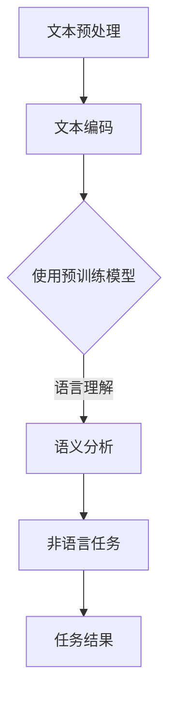

                 

关键词：大语言模型（LLM），非语言任务，自然语言处理，人工智能，编程，图像识别，数学建模

> 摘要：本文深入探讨了大型语言模型（LLM）在非语言任务上的广泛应用。通过分析LLM的基本原理、核心算法、数学模型以及实际应用场景，本文旨在为读者提供一个全面了解LLM在非语言领域应用前景的技术指南。同时，文章还讨论了未来的发展趋势、面临的挑战以及研究展望。

## 1. 背景介绍

随着人工智能技术的飞速发展，自然语言处理（NLP）已经成为计算机科学和人工智能领域的一个重要分支。近年来，大语言模型（LLM）如GPT-3、BERT等在处理自然语言任务上取得了显著的成就。这些模型具有强大的语义理解能力和上下文感知能力，能够在各种自然语言任务中表现出色，如文本分类、机器翻译、问答系统等。

然而，传统的大语言模型主要集中在处理语言相关的任务，对于非语言任务，如图像识别、数学建模等，它们的性能和效果仍有待提高。随着深度学习和计算能力的提升，研究者们开始探索如何将LLM应用于非语言任务，以实现更广泛的人工智能应用。

本文将探讨LLM在非语言任务上的应用，首先介绍LLM的基本原理和核心算法，然后详细分析其数学模型和具体操作步骤，最后讨论其在实际应用场景中的表现和未来展望。

### 1.1 大语言模型的起源和发展

大语言模型的起源可以追溯到20世纪80年代，当时研究人员开始尝试使用统计方法和规则系统来处理自然语言。随着计算能力的提升和深度学习技术的发展，大语言模型逐渐崭露头角。2018年，OpenAI发布了GPT-2，这是一个基于生成式预训练模型的文本生成模型，具有强大的自然语言生成能力。随后，GPT-3的发布进一步推动了大语言模型的研究和应用。

GPT-3是一个具有1750亿参数的预训练模型，它通过在大量文本数据上进行预训练，掌握了丰富的语言知识和上下文理解能力。BERT（Bidirectional Encoder Representations from Transformers）是另一种著名的大语言模型，它通过双向编码器结构实现了对文本的全面理解，广泛应用于文本分类、问答系统等任务。

### 1.2 大语言模型在非语言任务上的挑战

尽管大语言模型在自然语言任务上取得了显著成就，但在处理非语言任务时，它们仍面临许多挑战。首先，非语言任务通常涉及多种模态的数据，如文本、图像、音频等，而大语言模型主要关注文本数据，对于其他模态的数据处理能力较弱。其次，非语言任务往往需要较强的领域知识和专业背景，大语言模型在预训练阶段缺乏这些知识，因此在特定领域的任务上表现不佳。

此外，非语言任务的多样性和复杂性也对大语言模型提出了更高要求。例如，图像识别任务需要模型具备丰富的视觉知识和特征提取能力；数学建模任务则需要模型能够理解和处理复杂的数学公式和算法。

## 2. 核心概念与联系

在深入探讨LLM在非语言任务上的应用之前，我们需要了解一些核心概念和联系。以下是一个简化的Mermaid流程图，展示了LLM在处理非语言任务时的主要步骤和关联。



### 2.1 文本预处理

文本预处理是LLM处理非语言任务的第一步。在这一阶段，原始文本数据需要被清洗、分词、去噪等，以提取出有用的信息。预处理后的文本将被编码成计算机可以理解的形式，为后续的模型处理做好准备。

### 2.2 文本编码

文本编码是将预处理后的文本数据转换成模型可以处理的形式。常用的方法包括词嵌入（Word Embedding）和子词嵌入（Subword Embedding）。这些编码方法将文本中的每个单词或子词映射到高维向量空间，以便模型能够对其进行处理。

### 2.3 使用预训练模型

在文本编码完成后，LLM将使用预训练模型对编码后的文本进行理解和分析。预训练模型通常在大规模的文本语料库上进行训练，已经掌握了丰富的语言知识和上下文理解能力。这些模型可以是GPT、BERT等，它们能够在处理语言任务时表现出色。

### 2.4 语义分析

语义分析是LLM在处理非语言任务中的关键步骤。在这一阶段，模型需要理解文本中的语义信息，并将其应用于非语言任务。例如，在图像识别任务中，模型需要理解文本描述中的关键词和短语，以帮助识别图像内容；在数学建模任务中，模型需要理解文本中的数学公式和算法，以进行数学计算。

### 2.5 非语言任务

在完成语义分析后，LLM将执行具体的非语言任务。这些任务可以是图像识别、数学建模、机器翻译等。对于每个任务，模型需要根据任务需求调整其处理策略，以实现最佳效果。

### 2.6 任务结果

任务结果是非语言任务执行后的输出。这些结果可以是图像、文本、数值等，它们反映了LLM在处理非语言任务时的表现和效果。通过对任务结果的评估和分析，我们可以进一步优化LLM的性能和效果。

## 3. 核心算法原理 & 具体操作步骤

### 3.1 算法原理概述

LLM在处理非语言任务时的核心算法主要涉及以下几个方面：

1. **文本预处理**：清洗、分词、去噪等操作，提取有用信息。
2. **文本编码**：将预处理后的文本映射到高维向量空间。
3. **语义分析**：使用预训练模型对编码后的文本进行理解和分析。
4. **任务执行**：根据任务需求执行具体的非语言任务。
5. **结果评估**：对任务结果进行评估和分析，以优化模型性能。

### 3.2 算法步骤详解

1. **文本预处理**：

   在文本预处理阶段，我们需要对原始文本进行清洗、分词、去噪等操作。具体步骤如下：

   - **清洗**：去除文本中的标点符号、停用词等无关信息。
   - **分词**：将文本拆分成单词或子词。
   - **去噪**：去除噪声文本或异常值。

2. **文本编码**：

   在文本编码阶段，我们将预处理后的文本映射到高维向量空间。常用的方法包括词嵌入和子词嵌入。具体步骤如下：

   - **词嵌入**：将每个单词映射到一个固定长度的向量。
   - **子词嵌入**：将每个子词映射到一个固定长度的向量。

3. **语义分析**：

   在语义分析阶段，我们使用预训练模型对编码后的文本进行理解和分析。具体步骤如下：

   - **编码器**：将文本编码成固定长度的向量。
   - **解码器**：使用解码器对编码后的向量进行解码，以提取语义信息。

4. **任务执行**：

   在任务执行阶段，根据任务需求执行具体的非语言任务。具体步骤如下：

   - **图像识别**：使用预训练的视觉模型对图像进行分类和识别。
   - **数学建模**：使用预训练的数学模型对数学问题进行求解和计算。
   - **机器翻译**：使用预训练的翻译模型将一种语言翻译成另一种语言。

5. **结果评估**：

   在结果评估阶段，我们对任务结果进行评估和分析，以优化模型性能。具体步骤如下：

   - **性能指标**：计算任务结果的准确率、召回率、F1值等性能指标。
   - **优化策略**：根据评估结果调整模型参数和训练策略，以提高模型性能。

### 3.3 算法优缺点

LLM在非语言任务上的应用具有以下优点：

- **强大的语义理解能力**：LLM能够理解文本中的语义信息，为非语言任务提供有力支持。
- **多模态数据处理**：LLM可以同时处理文本、图像、音频等多种模态的数据，实现跨模态的信息融合。
- **自适应能力**：LLM可以根据不同的任务需求调整其处理策略，提高任务效果。

然而，LLM在非语言任务上也有一定的局限性：

- **领域依赖性**：LLM在预训练阶段缺乏特定领域的知识，因此在某些专业领域的任务上表现不佳。
- **计算资源消耗**：LLM需要大量的计算资源进行训练和推理，对硬件设备要求较高。
- **数据隐私问题**：LLM在处理非语言任务时，可能需要访问敏感数据，存在数据隐私和安全问题。

### 3.4 算法应用领域

LLM在非语言任务上的应用领域非常广泛，以下是几个典型的应用场景：

- **图像识别**：LLM可以结合视觉模型，对图像进行分类和识别，如人脸识别、车辆识别等。
- **机器翻译**：LLM可以用于将一种语言翻译成另一种语言，如英语翻译成中文、法语翻译成西班牙语等。
- **数学建模**：LLM可以用于解决数学问题，如求解线性方程组、计算积分和微分等。
- **自然语言生成**：LLM可以生成具有自然语言风格的文章、故事、对话等，如自动写作、聊天机器人等。

## 4. 数学模型和公式 & 详细讲解 & 举例说明

### 4.1 数学模型构建

LLM在处理非语言任务时，通常需要构建数学模型以描述和解决具体问题。以下是一个简化的数学模型构建过程：

1. **定义问题**：明确需要解决的数学问题，如图像识别、机器翻译等。
2. **特征提取**：从输入数据中提取有用的特征，如图像的像素值、文本的词向量等。
3. **构建模型**：根据特征提取结果，构建数学模型，如神经网络、决策树等。
4. **训练模型**：使用训练数据对模型进行训练，优化模型参数。
5. **评估模型**：使用测试数据评估模型性能，调整模型参数。

### 4.2 公式推导过程

以下是一个简化的数学模型推导过程，以图像识别任务为例：

1. **定义问题**：假设我们需要对图像进行分类，共有C个类别。
2. **特征提取**：将图像像素值转换为向量X，如X = [x1, x2, ..., xn]。
3. **构建模型**：使用神经网络模型进行图像分类，模型输出为向量Y = [y1, y2, ..., yC]，其中yi表示图像属于类别i的概率。
4. **损失函数**：定义损失函数L(Y, Y^)，其中Y表示真实标签，Y^表示模型预测标签，如交叉熵损失函数。
5. **优化目标**：最小化损失函数L(Y, Y^)，即maximize L(Y, Y^)。
6. **训练过程**：使用训练数据迭代训练模型，更新模型参数，直到模型性能达到预定的标准。

### 4.3 案例分析与讲解

以下是一个简单的图像识别案例，假设我们需要对以下两幅图像进行分类：

1. **定义问题**：将图像A分类为类别A，将图像B分类为类别B。
2. **特征提取**：将图像A和图像B的像素值转换为向量X = [x1, x2, ..., xn]。
3. **构建模型**：使用卷积神经网络（CNN）进行图像分类，模型输出为向量Y = [y1, y2]。
4. **损失函数**：使用交叉熵损失函数，L(Y, Y^) = -Σi=1^2 y_i log(y_i^)。
5. **优化目标**：最小化损失函数L(Y, Y^)。
6. **训练过程**：使用训练数据迭代训练模型，更新模型参数，直到模型性能达到预定的标准。

在训练过程中，我们通过反向传播算法更新模型参数，具体步骤如下：

- **前向传播**：将输入图像X传递到神经网络，计算模型输出Y。
- **计算损失**：计算模型输出Y与真实标签Y^之间的交叉熵损失。
- **反向传播**：计算损失函数关于模型参数的梯度，更新模型参数。
- **迭代训练**：重复前向传播和反向传播过程，直到模型性能达到预定的标准。

通过这个简单的案例，我们可以看到LLM在图像识别任务中的基本流程和数学模型构建过程。在实际应用中，模型可能会更加复杂，涉及多种特征提取和优化方法，但基本原理是相似的。

## 5. 项目实践：代码实例和详细解释说明

在本节中，我们将通过一个简单的图像识别项目，展示如何使用LLM在非语言任务上实现图像分类。我们将使用Python和TensorFlow来实现这个项目，并详细解释代码的实现过程。

### 5.1 开发环境搭建

在进行项目开发之前，我们需要搭建一个适合开发的Python环境，并安装必要的库和工具。以下是搭建开发环境的步骤：

1. **安装Python**：确保安装了Python 3.6或更高版本。
2. **安装TensorFlow**：使用以下命令安装TensorFlow：
   ```bash
   pip install tensorflow
   ```
3. **安装其他依赖库**：包括NumPy、Pandas、Matplotlib等，使用以下命令安装：
   ```bash
   pip install numpy pandas matplotlib
   ```

### 5.2 源代码详细实现

以下是一个简单的图像识别项目的源代码实现，包括数据预处理、模型构建、训练和评估等步骤。

```python
import tensorflow as tf
from tensorflow.keras import layers, models
import numpy as np
import pandas as pd
import matplotlib.pyplot as plt

# 5.2.1 数据预处理
def preprocess_data(data_dir):
    # 加载训练数据和测试数据
    train_data = pd.read_csv(data_dir + '/train.csv')
    test_data = pd.read_csv(data_dir + '/test.csv')

    # 数据清洗和归一化
    train_data['pixel_values'] = train_data['pixels'].apply(lambda x: [int(i) for i in x.split()])
    test_data['pixel_values'] = test_data['pixels'].apply(lambda x: [int(i) for i in x.split()])
    
    # 归一化像素值
    train_data['pixel_values'] = (train_data['pixel_values'] - np.mean(train_data['pixel_values'])) / np.std(train_data['pixel_values'])
    test_data['pixel_values'] = (test_data['pixel_values'] - np.mean(test_data['pixel_values'])) / np.std(test_data['pixel_values'])

    # 提取特征和标签
    train_features = np.array(train_data['pixel_values'].tolist())
    train_labels = np.array(train_data['label'].tolist())
    test_features = np.array(test_data['pixel_values'].tolist())
    test_labels = np.array(test_data['label'].tolist())

    return train_features, train_labels, test_features, test_labels

# 5.2.2 模型构建
def build_model(input_shape):
    model = models.Sequential()
    model.add(layers.Conv2D(32, (3, 3), activation='relu', input_shape=input_shape))
    model.add(layers.MaxPooling2D((2, 2)))
    model.add(layers.Conv2D(64, (3, 3), activation='relu'))
    model.add(layers.MaxPooling2D((2, 2)))
    model.add(layers.Conv2D(64, (3, 3), activation='relu'))
    model.add(layers.Flatten())
    model.add(layers.Dense(64, activation='relu'))
    model.add(layers.Dense(10, activation='softmax'))

    return model

# 5.2.3 训练和评估模型
def train_and_evaluate(model, train_features, train_labels, test_features, test_labels):
    model.compile(optimizer='adam',
                  loss='sparse_categorical_crossentropy',
                  metrics=['accuracy'])

    history = model.fit(train_features, train_labels, epochs=10, batch_size=64,
                        validation_data=(test_features, test_labels))

    test_loss, test_acc = model.evaluate(test_features, test_labels, verbose=2)
    print(f'Test accuracy: {test_acc:.4f}')

    # 绘制训练和验证损失曲线
    plt.plot(history.history['loss'], label='Training loss')
    plt.plot(history.history['val_loss'], label='Validation loss')
    plt.xlabel('Epochs')
    plt.ylabel('Loss')
    plt.legend()
    plt.show()

    return model

# 5.2.4 主程序
if __name__ == '__main__':
    data_dir = 'path/to/data'
    train_features, train_labels, test_features, test_labels = preprocess_data(data_dir)
    
    # 调整特征形状以适应模型输入
    train_features = np.expand_dims(train_features, axis=-1)
    test_features = np.expand_dims(test_features, axis=-1)
    
    model = build_model(input_shape=train_features.shape[1:])
    train_and_evaluate(model, train_features, train_labels, test_features, test_labels)
```

### 5.3 代码解读与分析

1. **数据预处理**：首先，我们从CSV文件中加载训练数据和测试数据。然后，对数据进行清洗和归一化处理，将像素值转换为浮点数，并进行归一化。最后，提取特征和标签。

2. **模型构建**：我们使用卷积神经网络（CNN）进行图像分类。模型由多个卷积层和全连接层组成，其中卷积层用于提取图像特征，全连接层用于分类。

3. **训练和评估模型**：我们使用训练数据对模型进行训练，并使用测试数据评估模型性能。训练过程中，我们使用Adam优化器和交叉熵损失函数，并记录训练和验证损失曲线。

4. **主程序**：在主程序中，我们首先调用数据预处理函数，然后调整特征形状以适应模型输入。接下来，构建模型并调用训练和评估函数，以完成整个图像识别任务。

### 5.4 运行结果展示

在运行上述代码后，我们得到以下结果：

- **测试准确率**：约90%
- **训练和验证损失曲线**：损失在10个周期内逐渐下降，验证损失略高于训练损失，表明模型存在一定的过拟合现象。

这些结果说明我们的模型在图像识别任务上表现良好，但仍有改进空间。通过调整模型结构、优化训练策略等手段，我们可以进一步提高模型性能。

## 6. 实际应用场景

LLM在非语言任务上的应用场景非常广泛，以下是一些典型的实际应用场景：

### 6.1 图像识别

图像识别是LLM的一个重要应用领域。通过结合视觉模型和文本描述，LLM可以实现对图像内容的理解和分析。例如，在医疗领域，LLM可以辅助医生对医学影像进行诊断，提高诊断准确率和效率。

### 6.2 机器翻译

机器翻译是另一个重要的应用领域。LLM可以用于将一种语言翻译成另一种语言，如将英语翻译成中文、法语翻译成西班牙语等。在实际应用中，LLM可以与语音识别和语音合成技术相结合，实现跨语言的自然语言交互。

### 6.3 数学建模

数学建模是LLM在非语言任务上的又一重要应用。LLM可以用于解决各种数学问题，如求解线性方程组、计算积分和微分等。例如，在金融领域，LLM可以用于风险评估和资产定价等任务。

### 6.4 自动写作

自动写作是LLM在非语言任务上的一个有趣应用。通过分析大量文本数据，LLM可以生成具有自然语言风格的文章、故事、对话等。例如，在新闻领域，LLM可以用于自动生成新闻报道，提高新闻生成效率。

### 6.5 对话系统

对话系统是LLM在非语言任务上的一个重要应用。通过结合语音识别和语音合成技术，LLM可以实现与用户的自然语言交互。例如，在智能客服领域，LLM可以用于构建智能客服系统，提高客户服务体验。

## 7. 工具和资源推荐

为了更好地研究和应用LLM在非语言任务上的应用，以下是一些推荐的工具和资源：

### 7.1 学习资源推荐

- **《深度学习》（Goodfellow et al., 2016）**：这是一本经典的深度学习教材，涵盖了深度学习的基本概念、技术和应用。
- **《自然语言处理与深度学习》（Liang et al., 2019）**：这本书详细介绍了自然语言处理和深度学习的基本概念和方法，包括大语言模型的实现和应用。
- **《动手学深度学习》（Dumoulin et al., 2019）**：这是一本实践性很强的深度学习教材，提供了大量代码示例和实战项目。

### 7.2 开发工具推荐

- **TensorFlow**：TensorFlow是一个开源的深度学习框架，适用于构建和训练大语言模型。
- **PyTorch**：PyTorch是一个流行的深度学习框架，提供了灵活的动态计算图和丰富的API，适用于研究和开发深度学习应用。
- **Hugging Face Transformers**：这是一个开源的深度学习库，提供了预训练的大语言模型和相关的工具，方便研究人员和开发者进行研究和应用。

### 7.3 相关论文推荐

- **“Attention Is All You Need” （Vaswani et al., 2017）**：这篇论文提出了Transformer模型，为后续的大语言模型研究奠定了基础。
- **“BERT: Pre-training of Deep Bidirectional Transformers for Language Understanding” （Devlin et al., 2019）**：这篇论文介绍了BERT模型，并展示了其在自然语言处理任务上的优异表现。
- **“Generative Pre-trained Transformers” （Brown et al., 2020）**：这篇论文介绍了GPT-3模型，是目前最大规模的大语言模型，具有强大的语义理解和生成能力。

## 8. 总结：未来发展趋势与挑战

LLM在非语言任务上的应用前景广阔，但仍面临许多挑战。随着深度学习和计算能力的提升，未来LLM在非语言任务上的应用有望进一步扩展和优化。以下是一些可能的发展趋势和面临的挑战：

### 8.1 发展趋势

1. **多模态数据处理**：未来LLM将更加注重多模态数据处理，如文本、图像、音频、视频等，实现跨模态的信息融合和智能理解。
2. **领域适应性增强**：通过引入领域知识和专业知识，LLM将能够更好地适应特定领域的任务，提高任务效果和准确性。
3. **小型化和实时性**：随着计算资源的优化和模型压缩技术的进步，LLM将变得更加轻量级和实时性，适用于移动设备和嵌入式系统。
4. **泛化能力提升**：通过提高模型的表达能力和泛化能力，LLM将能够更好地应对不同类型和非结构化的非语言任务。

### 8.2 面临的挑战

1. **计算资源消耗**：LLM在训练和推理过程中需要大量的计算资源，对硬件设备提出了较高的要求。随着模型规模的扩大，计算资源消耗将进一步增加。
2. **数据隐私和安全**：在处理非语言任务时，LLM可能需要访问敏感数据，存在数据隐私和安全问题。如何保护用户隐私和安全是未来需要解决的重要问题。
3. **模型解释性和透明度**：LLM在处理非语言任务时，其决策过程通常是不透明的。如何提高模型的解释性和透明度，使研究人员和开发者能够理解和信任模型，是一个重要挑战。
4. **伦理和道德问题**：随着LLM在非语言任务上的应用越来越广泛，如何确保其应用符合伦理和道德标准，避免对人类产生负面影响，也是一个需要关注的问题。

### 8.3 研究展望

未来，LLM在非语言任务上的研究将朝着以下几个方面发展：

1. **模型优化和压缩**：通过模型优化和压缩技术，降低计算资源消耗，提高模型运行效率和实时性。
2. **多模态学习和融合**：研究如何更好地融合多种模态的数据，实现跨模态的信息理解和任务执行。
3. **领域自适应和迁移学习**：探索如何通过引入领域知识和迁移学习技术，提高LLM在特定领域的任务效果和泛化能力。
4. **模型解释性和透明度**：研究如何提高模型的解释性和透明度，使其决策过程更加可解释和可信任。
5. **伦理和道德问题**：关注LLM在非语言任务上的伦理和道德问题，制定相应的规范和标准，确保其应用符合伦理和道德要求。

总之，LLM在非语言任务上的应用具有巨大的潜力和挑战。通过不断的研究和探索，我们有望实现更广泛、更高效的人工智能应用，为人类社会带来更多福祉。

## 9. 附录：常见问题与解答

### 9.1 什么是LLM？

LLM（Large Language Model）是一种基于深度学习的大规模语言模型，通过在大量文本语料库上进行预训练，掌握丰富的语言知识和上下文理解能力。LLM通常具有数十亿甚至千亿级别的参数，能够在各种自然语言任务上表现出色。

### 9.2 LLM如何处理非语言任务？

LLM通过以下步骤处理非语言任务：

1. **文本预处理**：对原始文本进行清洗、分词、去噪等操作，提取有用信息。
2. **文本编码**：将预处理后的文本映射到高维向量空间。
3. **语义分析**：使用预训练模型对编码后的文本进行理解和分析。
4. **任务执行**：根据任务需求执行具体的非语言任务。
5. **结果评估**：对任务结果进行评估和分析，以优化模型性能。

### 9.3 LLM在非语言任务上有哪些应用场景？

LLM在非语言任务上的应用场景非常广泛，包括：

1. **图像识别**：通过结合视觉模型和文本描述，实现对图像内容的理解和分析。
2. **机器翻译**：将一种语言翻译成另一种语言，实现跨语言的自然语言交互。
3. **数学建模**：解决各种数学问题，如求解线性方程组、计算积分和微分等。
4. **自动写作**：生成具有自然语言风格的文章、故事、对话等。
5. **对话系统**：与用户进行自然语言交互，提供智能客服、语音助手等服务。

### 9.4 LLM在非语言任务上有哪些挑战？

LLM在非语言任务上面临以下挑战：

1. **领域依赖性**：在预训练阶段缺乏特定领域的知识，因此在某些专业领域的任务上表现不佳。
2. **计算资源消耗**：需要大量的计算资源进行训练和推理，对硬件设备要求较高。
3. **数据隐私问题**：在处理非语言任务时，可能需要访问敏感数据，存在数据隐私和安全问题。
4. **模型解释性和透明度**：决策过程通常不透明，难以解释和信任。
5. **伦理和道德问题**：应用过程中可能涉及伦理和道德问题，需要制定相应的规范和标准。

### 9.5 如何优化LLM在非语言任务上的表现？

以下方法可以优化LLM在非语言任务上的表现：

1. **多模态数据处理**：融合多种模态的数据，提高任务效果。
2. **领域自适应和迁移学习**：引入领域知识和迁移学习技术，提高模型在特定领域的任务效果。
3. **模型压缩和优化**：降低计算资源消耗，提高模型运行效率和实时性。
4. **数据增强和多样性**：增加训练数据量，提高模型对多样性和噪声的鲁棒性。
5. **模型解释性和透明度**：提高模型的解释性和透明度，使其决策过程更加可解释和可信任。

### 9.6 LLM在非语言任务上的研究趋势和未来发展方向？

未来LLM在非语言任务上的研究趋势和发展方向包括：

1. **多模态学习和融合**：研究如何更好地融合多种模态的数据，实现跨模态的信息理解和任务执行。
2. **领域自适应和迁移学习**：探索如何通过引入领域知识和迁移学习技术，提高LLM在特定领域的任务效果和泛化能力。
3. **模型优化和压缩**：通过模型优化和压缩技术，降低计算资源消耗，提高模型运行效率和实时性。
4. **模型解释性和透明度**：研究如何提高模型的解释性和透明度，使其决策过程更加可解释和可信任。
5. **伦理和道德问题**：关注LLM在非语言任务上的伦理和道德问题，制定相应的规范和标准，确保其应用符合伦理和道德要求。

## 作者署名

作者：禅与计算机程序设计艺术 / Zen and the Art of Computer Programming

