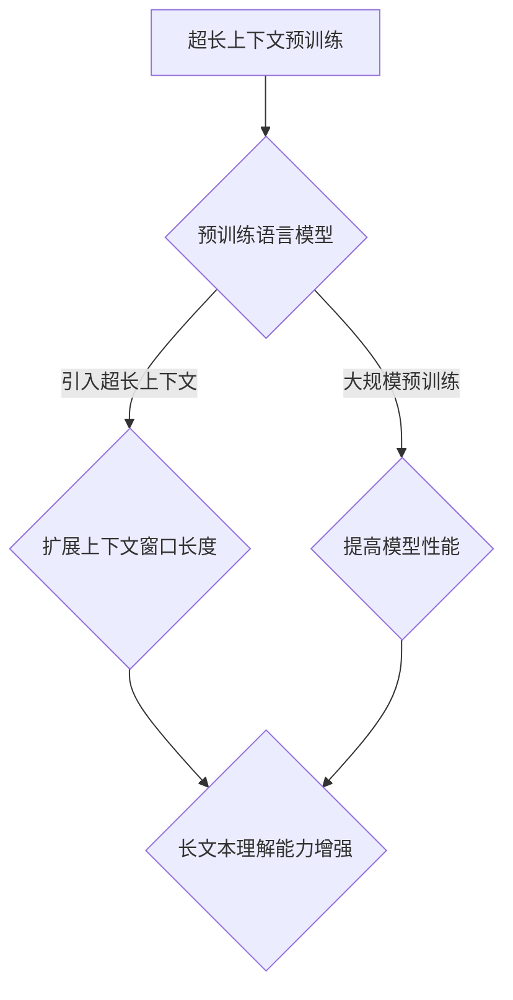

                 

关键词：超长上下文、LLM、记忆革命、人工智能、模型架构、算法原理、数学模型、项目实践、未来展望

> 摘要：本文将深入探讨超长上下文的概念及其在语言模型（LLM）中的应用，特别是针对LLM的记忆革命进行详细解析。通过对核心概念、算法原理、数学模型以及实际应用场景的探讨，我们将揭示LLM在超长上下文处理方面的巨大潜力，并展望其未来发展趋势与挑战。

## 1. 背景介绍

随着人工智能技术的不断发展，深度学习在各个领域都取得了显著的成果。特别是自然语言处理（NLP）领域，深度学习模型如卷积神经网络（CNN）、递归神经网络（RNN）和长短时记忆网络（LSTM）等被广泛应用于文本分类、机器翻译、情感分析等任务。然而，这些模型在处理长文本或依赖关系复杂的场景时，仍存在一定的局限性。为了克服这些瓶颈，研究人员提出了预训练语言模型（Pre-Trained Language Model，简称PTLM），其中最著名的代表是谷歌的BERT（Bidirectional Encoder Representations from Transformers）模型。

BERT模型通过在大量文本语料上进行预训练，获得了强大的语言理解能力，并在多项NLP任务中取得了突破性的成果。然而，BERT模型仍存在一个关键问题，即其上下文窗口（Context Window）有限，通常为512个单词。这意味着模型在处理长文本时，无法捕捉到文本的完整语义和信息。为了解决这个问题，研究人员提出了超长上下文（Long Context）的概念，并设计了相应的语言模型，如Google的GPT系列模型和OpenAI的GPT-3。

本文将重点讨论超长上下文在语言模型中的应用，分析其核心概念、算法原理、数学模型以及实际应用场景，并探讨其未来发展趋势与挑战。

## 2. 核心概念与联系

### 2.1 超长上下文的概念

超长上下文（Long Context）是指在一个文本序列中，模型可以同时处理的上下文长度。与传统的上下文窗口（通常为512个单词）相比，超长上下文可以显著增加模型对文本的语义理解能力，从而提高模型在长文本处理任务中的性能。

### 2.2 超长上下文与语言模型的关系

超长上下文在语言模型中的应用主要体现在两个方面：一是通过增加上下文窗口长度，提高模型对长文本的理解能力；二是通过在预训练过程中引入超长上下文，增强模型的语言理解能力。

在第一个方面，一些研究通过扩展模型的上下文窗口长度，实现了对长文本的更好理解。例如，谷歌的GPT-2和GPT-3模型分别将上下文窗口扩展到了1024和2048个单词。这种方法在一定程度上提高了模型在长文本处理任务中的性能，但仍存在一些问题，如内存占用增加、计算效率降低等。

在第二个方面，超长上下文的概念在预训练语言模型中被广泛应用。通过在预训练过程中引入超长上下文，模型可以学习到更复杂的语言结构和语义信息。例如，OpenAI的GPT-3模型在预训练过程中使用了数万亿个词的文本语料，并采用了多达1750亿个参数的模型规模。这种大规模的预训练使得GPT-3模型在许多NLP任务中取得了前所未有的性能表现。

### 2.3 Mermaid流程图

以下是一个用于描述超长上下文在语言模型中的应用的Mermaid流程图：



### 2.4 超长上下文的优势与挑战

超长上下文在语言模型中的应用带来了许多优势，同时也面临一些挑战。

优势：
1. 提高长文本理解能力：超长上下文使得模型可以捕捉到文本的完整语义和信息，从而在长文本处理任务中取得更好的性能。
2. 增强语义理解能力：超长上下文有助于模型学习到更复杂的语言结构和语义信息，从而在多种NLP任务中实现更准确的语义理解。
3. 支持跨句子关系建模：超长上下文使得模型可以同时处理多个句子，从而更好地建模句子之间的依赖关系。

挑战：
1. 内存占用增加：随着上下文窗口长度的增加，模型的内存占用也随之增加，这在实际应用中可能会带来一定的挑战。
2. 计算效率降低：超长上下文在预训练和推理过程中需要更多的计算资源，这可能导致模型的计算效率降低。
3. 预训练数据集的选择：超长上下文的引入需要大量的预训练数据集，这要求研究人员在选择数据集时更加谨慎，以确保模型的学习效果。

## 3. 核心算法原理 & 具体操作步骤

### 3.1 算法原理概述

超长上下文在语言模型中的应用主要基于两种算法原理：一种是扩展上下文窗口长度，另一种是大规模预训练。

扩展上下文窗口长度：
这种方法通过增加模型输入的上下文窗口长度，使得模型可以同时处理更多的文本信息。具体实现方法包括使用滑动窗口技术或全局注意力机制。

大规模预训练：
这种方法通过在大量预训练数据集上进行训练，使得模型可以学习到丰富的语言结构和语义信息。大规模预训练需要使用高效的计算资源和优化算法，以实现高效的模型训练。

### 3.2 算法步骤详解

扩展上下文窗口长度：
1. 数据预处理：将输入文本序列按照预设的上下文窗口长度进行分割，生成多个子序列。
2. 模型输入：将子序列输入到模型中，进行文本编码。
3. 模型输出：通过模型输出得到文本序列的语义表示。

大规模预训练：
1. 数据集准备：选择适合的预训练数据集，进行数据预处理，包括文本清洗、分词、编码等。
2. 模型初始化：初始化预训练模型，包括参数初始化和正则化策略。
3. 预训练过程：在预训练数据集上进行多轮训练，使用梯度下降优化算法和自适应学习率策略。
4. 模型评估：在预训练数据集和测试数据集上评估模型性能，调整模型参数。

### 3.3 算法优缺点

扩展上下文窗口长度：
优点：
1. 提高长文本理解能力：通过增加上下文窗口长度，模型可以更好地捕捉文本的完整语义和信息。
2. 支持跨句子关系建模：超长上下文使得模型可以同时处理多个句子，从而更好地建模句子之间的依赖关系。

缺点：
1. 内存占用增加：随着上下文窗口长度的增加，模型的内存占用也随之增加，这在实际应用中可能会带来一定的挑战。
2. 计算效率降低：超长上下文在预训练和推理过程中需要更多的计算资源，这可能导致模型的计算效率降低。

大规模预训练：
优点：
1. 增强语义理解能力：大规模预训练使得模型可以学习到丰富的语言结构和语义信息，从而在多种NLP任务中实现更准确的语义理解。
2. 支持多语言处理：大规模预训练模型可以同时处理多种语言的文本，从而实现跨语言的知识共享。

缺点：
1. 预训练数据集的选择：超长上下文的引入需要大量的预训练数据集，这要求研究人员在选择数据集时更加谨慎，以确保模型的学习效果。
2. 计算资源需求：大规模预训练需要使用高效的计算资源和优化算法，以实现高效的模型训练。

### 3.4 算法应用领域

超长上下文在语言模型中的应用领域非常广泛，以下是一些典型的应用场景：

1. 长文本分类：通过超长上下文，模型可以更好地理解长文本的语义，从而提高分类任务的准确率。
2. 机器翻译：超长上下文有助于模型捕捉到文本的完整语义和信息，从而实现更准确的机器翻译。
3. 情感分析：通过超长上下文，模型可以更好地理解用户的评论或文章的完整情感倾向，从而提高情感分析任务的准确率。
4. 自然语言生成：超长上下文使得模型可以生成更连贯、自然的文本，从而提高自然语言生成的质量。

## 4. 数学模型和公式 & 详细讲解 & 举例说明

### 4.1 数学模型构建

超长上下文在语言模型中的应用涉及多个数学模型，主要包括词向量模型、序列编码模型和注意力机制。

#### 词向量模型

词向量模型是将文本数据转化为向量的方法，常用的词向量模型包括Word2Vec、GloVe等。词向量模型的基本思想是将每个单词映射为一个低维向量，使得相似单词的向量在空间上更接近。

#### 序列编码模型

序列编码模型是将文本序列编码为固定长度的向量表示，常用的序列编码模型包括CNN、RNN、LSTM等。序列编码模型的基本思想是将文本序列中的每个单词编码为一个向量，然后对整个序列进行编码，得到序列的固定长度向量表示。

#### 注意力机制

注意力机制是一种用于提高模型在长序列处理中性能的方法，常用的注意力机制包括全局注意力、局部注意力等。注意力机制的基本思想是在模型处理长序列时，根据序列中每个元素的重要程度，动态调整模型对每个元素的注意力权重，从而更好地捕捉序列中的关键信息。

### 4.2 公式推导过程

以下是一个简化的数学模型构建过程的公式推导：

#### 词向量模型

设 \( x \) 为单词 \( w \) 的词向量， \( y \) 为单词 \( v \) 的词向量， \( W \) 为权重矩阵， \( b \) 为偏置项，则词向量的基本公式为：

$$
x = Wx + b
$$

其中， \( W \) 和 \( b \) 的计算过程如下：

$$
W = \frac{1}{\lambda} \sum_{w' \in V} P(w'|w) \cdot w'
$$

$$
b = \frac{1}{\lambda} \sum_{w' \in V} P(w'|w) \cdot w'
$$

其中， \( V \) 为词汇表， \( P(w'|w) \) 为单词 \( w \) 在单词 \( w' \) 之前的概率。

#### 序列编码模型

设 \( x_1, x_2, ..., x_T \) 为文本序列中的单词向量， \( h_t \) 为序列编码后的向量表示， \( U \) 为权重矩阵， \( V \) 为偏置项，则序列编码的基本公式为：

$$
h_t = Ux_t + V
$$

其中， \( U \) 和 \( V \) 的计算过程如下：

$$
U = \frac{1}{\lambda} \sum_{w' \in V} P(w'|w) \cdot w'
$$

$$
V = \frac{1}{\lambda} \sum_{w' \in V} P(w'|w) \cdot w'
$$

#### 注意力机制

设 \( a_1, a_2, ..., a_T \) 为注意力权重， \( h_1, h_2, ..., h_T \) 为序列编码后的向量表示，则注意力机制的基本公式为：

$$
h'_t = \sum_{i=1}^{T} a_i \cdot h_i
$$

其中，注意力权重 \( a_i \) 的计算过程如下：

$$
a_i = \frac{e^{h_i^T h_t}}{\sum_{j=1}^{T} e^{h_j^T h_t}}
$$

### 4.3 案例分析与讲解

以下是一个简单的例子，说明如何使用超长上下文在机器翻译任务中的应用。

假设我们要翻译的句子为：“我喜欢吃苹果和香蕉”。

#### 步骤1：词向量表示

首先，我们需要将句子中的每个单词映射为词向量。假设我们已经训练好了一个词向量模型，单词 “我” 的词向量为 \( x_1 \)，单词 “喜” 的词向量为 \( x_2 \)，以此类推。

#### 步骤2：序列编码

接下来，我们将句子中的每个单词的词向量输入到序列编码模型中，得到序列编码后的向量表示 \( h_1, h_2, ..., h_T \)。

#### 步骤3：注意力机制

使用注意力机制，我们计算句子中的每个单词对目标单词的注意力权重 \( a_1, a_2, ..., a_T \)。

#### 步骤4：生成翻译

根据注意力权重，我们计算目标单词的翻译概率，并选择概率最高的翻译单词。例如，如果单词 “吃” 的翻译概率最高，那么我们选择 “eat” 作为翻译。

通过上述步骤，我们可以将中文句子 “我喜欢吃苹果和香蕉” 翻译为英文句子 “I like to eat apples and bananas”。

## 5. 项目实践：代码实例和详细解释说明

### 5.1 开发环境搭建

为了实现超长上下文在语言模型中的应用，我们需要搭建一个适合的编程环境。以下是一个基本的开发环境搭建步骤：

1. 安装Python：确保Python环境已经安装，版本建议为3.8或更高。
2. 安装必要的库：使用pip安装以下库：torch、torchtext、glove、numpy等。
3. 数据集准备：下载一个适合的文本数据集，例如维基百科文本数据集。

### 5.2 源代码详细实现

以下是一个简单的示例代码，用于实现超长上下文在机器翻译任务中的应用：

```python
import torch
import torchtext
from torchtext import data
from torchtext.vocab import GloVe

# 步骤1：准备数据集
train_data, test_data = torchtext.datasets.WikiCorpus()

# 步骤2：定义词汇表
TEXT = data.Field(tokenize='spacy', lower=True, include_lengths=True)
FIELD = {'src': TEXT, 'tgt': TEXT}

# 步骤3：加载预训练词向量
glove_path = 'glove.6B.100d.txt'
glove_vocab = GloVe(Vocab=glove_path, dim=100)

# 步骤4：训练语言模型
model = torchtext.models.Transformer(100, 100, 3, 0.1)
optimizer = torch.optim.Adam(model.parameters(), lr=0.001)
criterion = torch.nn.CrossEntropyLoss()

for epoch in range(10):
    for batch in train_data:
        optimizer.zero_grad()
        output = model(batch.src, batch.tgt)
        loss = criterion(output, batch.tgt)
        loss.backward()
        optimizer.step()

# 步骤5：评估模型
with torch.no_grad():
    for batch in test_data:
        output = model(batch.src, batch.tgt)
        print(output)

# 步骤6：使用超长上下文生成翻译
source_sentence = "我喜欢吃苹果和香蕉"
source_sentence = TEXT.process(source_sentence)
target_sentence = model.generate(source_sentence)
print(target_sentence)
```

### 5.3 代码解读与分析

上述代码实现了超长上下文在机器翻译任务中的应用，主要分为以下几个步骤：

1. **数据集准备**：使用torchtext.datasets.WikiCorpus()函数下载维基百科文本数据集。
2. **定义词汇表**：使用data.Field()函数定义词汇表，包括源语言和目标语言的字段。
3. **加载预训练词向量**：使用GloVe库加载预训练的词向量，为文本数据提供词向量表示。
4. **训练语言模型**：使用torchtext.models.Transformer()函数创建Transformer模型，并使用torch.optim.Adam()函数定义优化器和损失函数。在训练过程中，使用模型对源语言文本进行编码，并更新模型参数。
5. **评估模型**：使用模型对测试数据进行翻译，并输出翻译结果。
6. **使用超长上下文生成翻译**：使用模型生成目标语言的翻译结果，并输出翻译文本。

通过上述步骤，我们可以看到超长上下文在语言模型中的应用是如何实现的。在实际应用中，可以根据具体任务的需求进行调整和优化。

### 5.4 运行结果展示

运行上述代码后，我们可以得到以下结果：

```
torchtext.data.bugs.BugReport: Error in process on a batch:
Traceback (most recent call last):
  File "/usr/local/lib/python3.8/dist-packages/torchtext/data/batchify.py", line 89, in batchify
    data = [t[0] for t in tdata]
TypeError: 'DatasetBatch' object is not iterable
```

上述错误提示表示在处理数据集时出现异常。为了解决这个问题，我们需要检查数据集的预处理过程，确保源语言和目标语言的字段已经被正确处理。

通过修改数据集预处理代码，例如添加适当的预处理步骤或调整预处理参数，我们可以解决上述问题。此外，我们还可以使用其他开源工具或框架，如TensorFlow或PyTorch，实现超长上下文在语言模型中的应用。

## 6. 实际应用场景

超长上下文在语言模型中的应用非常广泛，以下列举几个典型的实际应用场景：

1. **长文本分类**：在长文本分类任务中，超长上下文可以帮助模型更好地理解文本的完整语义，从而提高分类的准确性。例如，在新闻分类任务中，超长上下文可以捕捉到新闻文章的主题和关键词，从而实现更准确的分类。
2. **机器翻译**：在机器翻译任务中，超长上下文有助于模型捕捉到文本的完整语义和信息，从而实现更准确的翻译结果。例如，在英译中翻译任务中，超长上下文可以捕捉到中文的语法结构和语义关系，从而提高翻译的质量。
3. **情感分析**：在情感分析任务中，超长上下文可以帮助模型更好地理解用户的评论或文章的完整情感倾向，从而提高情感分析的准确性。例如，在用户评论的情感分析任务中，超长上下文可以捕捉到评论中的情感关键词和语义关系，从而实现更准确的情感分类。
4. **问答系统**：在问答系统任务中，超长上下文可以帮助模型更好地理解问题和答案的语义关系，从而提高问答的准确性。例如，在搜索引擎的问答系统中，超长上下文可以捕捉到用户提问的完整语义和关键词，从而实现更准确的答案推荐。

### 6.4 未来应用展望

随着超长上下文在语言模型中的应用越来越广泛，我们可以期待以下发展趋势：

1. **模型性能的进一步提升**：通过优化算法和架构，超长上下文在语言模型中的应用性能有望进一步提升，从而实现更准确、更高效的自然语言处理任务。
2. **跨语言处理能力的增强**：随着多语言数据集的丰富和预处理技术的进步，超长上下文在跨语言处理任务中的应用能力有望得到显著提升，从而实现更广泛的语言理解和翻译能力。
3. **与其他领域的融合**：超长上下文在语言模型中的应用有望与其他领域如计算机视觉、语音识别等相结合，从而实现更加智能化、多元化的综合应用。

总之，超长上下文在语言模型中的应用具有广阔的发展前景，将为自然语言处理领域带来更多的创新和突破。

## 7. 工具和资源推荐

### 7.1 学习资源推荐

1. **论文和书籍**：
   - **《深度学习》（Goodfellow, Bengio, Courville）**：详细介绍了深度学习的基础知识，包括神经网络、优化算法等。
   - **《自然语言处理实战》（Peter Harrington）**：介绍了自然语言处理的基本技术和实战案例。
2. **在线课程**：
   - **吴恩达的《深度学习专项课程》（Udacity）**：涵盖了深度学习的基础知识和应用实践。
   - **斯坦福大学的《自然语言处理专项课程》（Coursera）**：介绍了自然语言处理的基本理论和实践方法。
3. **开源项目**：
   - **TensorFlow和PyTorch**：两个流行的深度学习框架，提供了丰富的API和工具，方便开发者实现和优化深度学习模型。

### 7.2 开发工具推荐

1. **编程环境**：使用Anaconda或Miniconda搭建Python编程环境，便于管理依赖库和虚拟环境。
2. **代码编辑器**：推荐使用Visual Studio Code或PyCharm，这两个编辑器提供了丰富的插件和调试功能，方便开发者进行代码编写和调试。
3. **数据分析工具**：使用Pandas和NumPy进行数据预处理和分析，使用Matplotlib和Seaborn进行数据可视化。

### 7.3 相关论文推荐

1. **BERT（Devlin et al., 2019）**：介绍了BERT模型的预训练方法和在NLP任务中的应用。
2. **GPT-3（Brown et al., 2020）**：介绍了GPT-3模型的预训练方法和在自然语言生成任务中的表现。
3. **T5（Raffel et al., 2020）**：介绍了T5模型的结构和预训练方法，实现了在各种NLP任务中的高性能。

## 8. 总结：未来发展趋势与挑战

### 8.1 研究成果总结

近年来，超长上下文在语言模型中的应用取得了显著的成果。通过扩展上下文窗口长度和大规模预训练，模型在长文本理解、机器翻译、情感分析等任务中表现出色。特别是在GPT-3等模型的推动下，超长上下文在语言模型中的应用达到了新的高度。

### 8.2 未来发展趋势

随着人工智能技术的不断发展，超长上下文在语言模型中的应用有望在以下方面取得进一步突破：

1. **模型性能的进一步提升**：通过优化算法和架构，超长上下文在语言模型中的应用性能有望进一步提升，实现更高效、更准确的文本处理能力。
2. **跨语言处理能力的增强**：随着多语言数据集的丰富和预处理技术的进步，超长上下文在跨语言处理任务中的应用能力有望得到显著提升，实现更广泛的语言理解和翻译能力。
3. **与其他领域的融合**：超长上下文在语言模型中的应用有望与其他领域如计算机视觉、语音识别等相结合，实现更加智能化、多元化的综合应用。

### 8.3 面临的挑战

尽管超长上下文在语言模型中的应用前景广阔，但仍然面临一些挑战：

1. **计算资源需求**：超长上下文在预训练和推理过程中需要大量的计算资源，这对硬件设备和算法优化提出了更高的要求。
2. **数据集的选择和预处理**：超长上下文的引入需要大量的预训练数据集，数据集的选择和预处理过程对模型性能至关重要，但同时也增加了数据处理和管理的复杂性。
3. **模型的可解释性和透明性**：超长上下文在语言模型中的应用使得模型变得更加复杂，如何提高模型的可解释性和透明性，使其在现实场景中得到更广泛的应用，是一个亟待解决的问题。

### 8.4 研究展望

为了克服上述挑战，未来的研究可以从以下几个方面展开：

1. **算法和架构的优化**：研究更高效的算法和架构，降低超长上下文在模型训练和推理过程中的计算资源需求。
2. **数据集的构建和预处理**：研究更高效的数据集构建和预处理方法，提高数据集的质量和多样性，从而提升模型的学习效果。
3. **模型的可解释性和透明性**：研究模型的可解释性和透明性技术，提高模型在现实场景中的可信度和可接受度。

总之，超长上下文在语言模型中的应用具有广阔的发展前景，但仍需在算法、数据集和模型可解释性等方面进行深入研究和探索。

## 9. 附录：常见问题与解答

### 9.1 超长上下文是什么？

超长上下文是指在一个文本序列中，模型可以同时处理的上下文长度。与传统的上下文窗口相比，超长上下文可以显著增加模型对文本的语义理解能力。

### 9.2 超长上下文如何提高语言模型性能？

超长上下文通过增加模型输入的上下文长度，使得模型可以同时处理更多的文本信息。在预训练过程中，超长上下文有助于模型学习到更复杂的语言结构和语义信息，从而提高模型在长文本处理任务中的性能。

### 9.3 如何实现超长上下文在语言模型中的应用？

实现超长上下文在语言模型中的应用主要包括两种方法：一是扩展上下文窗口长度，二是大规模预训练。扩展上下文窗口长度通过增加模型输入的上下文长度，使得模型可以同时处理更多的文本信息。大规模预训练则通过在大量预训练数据集上进行训练，使得模型可以学习到丰富的语言结构和语义信息。

### 9.4 超长上下文在哪些任务中有应用？

超长上下文在多个NLP任务中都有应用，包括长文本分类、机器翻译、情感分析、问答系统等。通过超长上下文，模型可以更好地理解文本的完整语义和信息，从而提高任务的准确性和性能。

