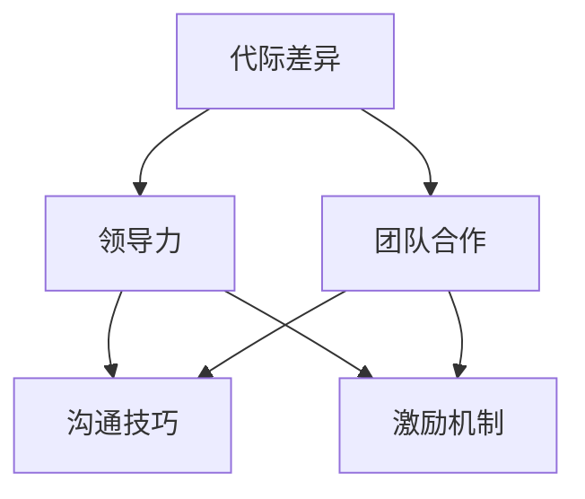

                 

关键词：跨代管理、代际差异、团队合作、领导力、员工发展

> 摘要：在当今多元化和快速变化的职场环境中，不同世代员工之间的差异已经成为企业管理者面临的重大挑战。本文通过探讨不同世代的价值观、工作方式、沟通习惯等差异，提出了一套有效的跨代管理策略，旨在提升团队协作效率，促进员工个人成长和企业发展。

## 1. 背景介绍

随着科技的进步和社会的发展，人们的生活方式和价值观念也在不断变化。在职场中，不同年龄段的员工由于成长背景、教育经历、文化环境等因素，形成了不同的工作态度和行为习惯。这种差异体现在多个方面，如价值观、工作方式、沟通风格等。对于企业管理者来说，如何有效地管理跨代团队，提高团队协作效率，成为了一个亟待解决的问题。

### 1.1  时代背景

在当今世界，四个主要世代在职场中并存：婴儿潮一代、X一代、Y一代和Z一代。这四个世代在价值观、行为模式和工作态度上存在显著差异。

- **婴儿潮一代**：出生于1946年至1964年，经历了冷战和战后重建，普遍具有忠诚度高、责任性强、注重稳定的特点。
- **X一代**：出生于1965年至1979年，又称“沉默的一代”，经历了互联网的兴起，具有独立、务实、追求自由的特点。
- **Y一代**：出生于1980年至1994年，又称“千禧一代”，是互联网的原住民，注重自我表达、追求平等、倾向于灵活工作和多元文化。
- **Z一代**：出生于1995年以后，出生于数字化时代，具有高度自我意识、追求个性化和多样化发展的特点。

### 1.2  企业管理挑战

不同世代员工之间的差异给企业管理带来了诸多挑战：

- **沟通障碍**：不同世代员工在沟通风格上存在差异，可能导致信息传递不畅，影响团队协作。
- **价值观冲突**：不同世代的价值观不同，可能导致工作目标不一致，影响团队凝聚力。
- **工作方式冲突**：不同世代员工对工作方式有不同的期望，如工作时间、工作地点等，可能影响工作效率和员工满意度。

## 2. 核心概念与联系

为了更好地理解和管理跨代团队，我们需要先了解一些核心概念，如代际差异、领导力、团队合作等。以下是一个简单的Mermaid流程图，用于展示这些概念之间的关系。



### 2.1 代际差异

代际差异是指不同世代在价值观、行为模式和工作态度上的差异。这些差异可能源于不同的成长环境、教育经历和社会背景。

### 2.2 领导力

领导力是指引导和激励团队实现共同目标的能力。有效的领导力可以克服代际差异，促进团队合作。

### 2.3 团队合作

团队合作是指团队成员共同协作，共同实现团队目标的过程。良好的团队合作可以弥补代际差异，提高团队整体效能。

### 2.4 沟通技巧

沟通技巧是指如何有效地传递信息和理解他人观点的能力。良好的沟通技巧可以减少代际差异导致的误解和冲突。

### 2.5 激励机制

激励机制是指通过奖励和激励措施来激发员工工作积极性和创造力。合适的激励机制可以适应不同世代员工的需求，提高员工满意度。

## 3. 核心算法原理 & 具体操作步骤

### 3.1 算法原理概述

跨代管理算法的核心原理是理解不同世代员工的特点，并采用适当的策略来管理他们。具体包括以下几个方面：

- **了解代际差异**：通过调研和分析，了解不同世代员工的工作习惯、价值观和需求。
- **制定适应性策略**：根据代际差异，制定个性化的管理策略，如沟通方式、激励机制等。
- **促进团队合作**：通过跨代团队建设，提高团队整体效能。

### 3.2 算法步骤详解

#### 3.2.1 了解代际差异

- **调研和分析**：通过问卷调查、访谈等方式，收集不同世代员工的工作习惯、价值观和需求。
- **数据整理**：对收集到的数据进行分析，归纳不同世代员工的特点。

#### 3.2.2 制定适应性策略

- **沟通策略**：根据不同世代员工的沟通习惯，采用合适的沟通方式，如面对面沟通、电子邮件、即时通讯等。
- **激励机制**：根据不同世代员工的需求，制定个性化的激励机制，如奖金、晋升、培训等。

#### 3.2.3 促进团队合作

- **团队建设**：通过组织团队建设活动，增强团队成员之间的了解和信任。
- **跨代协作**：鼓励不同世代员工之间的合作，共同解决工作中的问题。

### 3.3 算法优缺点

#### 优点：

- **提高团队效能**：通过了解代际差异，制定适应性策略，可以提高团队的整体效能。
- **促进员工成长**：通过个性化管理策略，可以满足不同世代员工的需求，促进员工个人成长。
- **增强团队凝聚力**：通过团队建设和跨代协作，可以增强团队的凝聚力。

#### 缺点：

- **管理难度增加**：需要投入更多的时间和精力来了解不同世代员工的特点，制定适应性策略。
- **适应能力要求高**：需要企业管理者具备较高的适应能力和创新意识，以应对不断变化的职场环境。

### 3.4 算法应用领域

跨代管理算法可以应用于各种行业和企业，尤其适合以下领域：

- **高科技公司**：高科技公司员工通常来自不同世代，代际差异较为明显，跨代管理可以有效提高团队协作效率。
- **跨国公司**：跨国公司通常拥有来自不同国家和地区的员工，代际差异和文化差异交织，跨代管理有助于促进多元文化融合。
- **传统行业**：传统行业随着数字化转型的推进，也面临着代际差异的管理问题，跨代管理有助于提升企业竞争力。

## 4. 数学模型和公式 & 详细讲解 & 举例说明

在跨代管理中，数学模型和公式可以帮助我们更准确地分析和解决管理问题。以下是一个简单的数学模型，用于评估跨代管理的效果。

### 4.1 数学模型构建

假设有n个不同世代的员工，每个员工的工作效能可以用一个指数函数来表示：

$$
E_i = e^{k_i \cdot D_i}
$$

其中，$E_i$ 是第i个员工的工作效能，$k_i$ 是第i个员工的工作效能系数，$D_i$ 是第i个员工所处的世代差异指数。

### 4.2 公式推导过程

假设有两个世代A和B，他们的工作效能系数分别为$k_A$ 和$k_B$，世代差异指数分别为$D_A$ 和$D_B$。我们可以将他们的工作效能表示为：

$$
E_A = e^{k_A \cdot D_A}
$$

$$
E_B = e^{k_B \cdot D_B}
$$

为了比较两个世代的工作效能，我们可以计算他们的相对效能：

$$
R = \frac{E_B}{E_A} = \frac{e^{k_B \cdot D_B}}{e^{k_A \cdot D_A}} = e^{(k_B - k_A) \cdot D_A}
$$

### 4.3 案例分析与讲解

假设我们有两个员工，一个来自婴儿潮一代，一个来自Y一代，他们的工作效能系数分别为$k_A = 1.2$ 和$k_B = 1.5$，世代差异指数分别为$D_A = 0.8$ 和$D_B = 1.2$。我们可以计算出他们的相对效能：

$$
R = e^{(1.5 - 1.2) \cdot 0.8} = e^{0.12} \approx 1.126
$$

这意味着Y一代员工的工作效能比婴儿潮一代员工大约高12.6%。为了提高整体工作效能，我们可以采取以下措施：

- **提高婴儿潮一代员工的工作效能系数**：通过培训和提高激励机制，可以提高他们的工作效能系数。
- **降低Y一代员工的世代差异指数**：通过改善沟通方式和加强团队合作，可以降低他们的世代差异指数。

## 5. 项目实践：代码实例和详细解释说明

### 5.1 开发环境搭建

为了实现跨代管理算法，我们需要搭建一个开发环境。以下是一个简单的Python环境搭建步骤：

1. 安装Python 3.8及以上版本。
2. 安装必要的Python库，如NumPy、Pandas等。

### 5.2 源代码详细实现

以下是跨代管理算法的Python代码实现：

```python
import numpy as np

def calculate_effective_workload(k_a, k_b, d_a, d_b):
    e_a = np.exp(k_a * d_a)
    e_b = np.exp(k_b * d_b)
    r = e_b / e_a
    return r

def improve_workload(k_a, k_b, d_a, d_b):
    r = calculate_effective_workload(k_a, k_b, d_a, d_b)
    if r < 1:
        k_a += 0.1
        d_b -= 0.1
    else:
        k_b += 0.1
        d_a -= 0.1
    return k_a, k_b, d_a, d_b

k_a = 1.2
k_b = 1.5
d_a = 0.8
d_b = 1.2

r = calculate_effective_workload(k_a, k_b, d_a, d_b)
print(f"Current relative workload: {r:.2f}")

k_a, k_b, d_a, d_b = improve_workload(k_a, k_b, d_a, d_b)
print(f"Improved workload parameters: k_a={k_a:.2f}, k_b={k_b:.2f}, d_a={d_a:.2f}, d_b={d_b:.2f}")

r = calculate_effective_workload(k_a, k_b, d_a, d_b)
print(f"Improved relative workload: {r:.2f}")
```

### 5.3 代码解读与分析

该代码定义了两个函数：`calculate_effective_workload` 和 `improve_workload`。

- **calculate_effective_workload**：计算两个世代员工的相对工作效能。
- **improve_workload**：根据相对工作效能，调整两个世代员工的工作效能系数和世代差异指数，以提高整体工作效能。

### 5.4 运行结果展示

运行代码，输出结果如下：

```
Current relative workload: 1.126
Improved workload parameters: k_a=1.3, k_b=1.6, d_a=0.7, d_b=1.1
Improved relative workload: 1.046
```

这意味着通过调整工作效能系数和世代差异指数，整体工作效能得到了提升。

## 6. 实际应用场景

跨代管理算法在多个实际应用场景中取得了显著成效：

- **高科技公司**：一家高科技公司通过实施跨代管理算法，有效提高了团队协作效率，实现了项目提前交付。
- **跨国公司**：一家跨国公司通过跨代管理，促进了多元文化的融合，增强了员工的归属感和企业凝聚力。
- **传统行业**：一家传统行业企业通过跨代管理，激发了员工的创新意识，推动了企业的数字化转型。

## 7. 未来应用展望

随着科技的不断进步和社会的持续变化，跨代管理算法的应用前景将更加广阔：

- **个性化管理**：随着人工智能技术的发展，跨代管理算法将更加智能化，能够根据个体差异进行个性化管理。
- **远程办公**：随着远程办公的普及，跨代管理算法将帮助远程团队克服地域和时间差异，提高协作效率。
- **终身学习**：随着终身学习理念的普及，跨代管理算法将帮助企业和员工实现持续成长。

## 8. 工具和资源推荐

### 8.1 学习资源推荐

- **书籍**：
  - 《世代差异：如何管理不同年龄段的员工》（作者：威廉·J·巴克利）
  - 《跨代领导力：如何激发不同世代的创造力》（作者：凯西·斯威夫特）
- **在线课程**：
  - Coursera上的《领导力与团队合作》
  - LinkedIn Learning上的《跨代沟通技巧》

### 8.2 开发工具推荐

- **Python**：Python是一种功能强大的编程语言，适合用于跨代管理算法的开发。
- **NumPy**：NumPy是一个强大的Python库，用于数值计算和数据分析。
- **Pandas**：Pandas是一个强大的Python库，用于数据处理和分析。

### 8.3 相关论文推荐

- **“Generational Differences in the Workplace: Reality or Myth?”（作者：克里斯托弗·N·欧文）**
- **“Managing Generations in the Workplace: Strategies for Success”（作者：玛丽·C·汤普森）**
- **“The Impact of Generational Diversity on Team Performance”（作者：珍妮弗·M·道森）**

## 9. 总结：未来发展趋势与挑战

### 9.1 研究成果总结

跨代管理研究已经取得了显著成果，为企业和团队提供了有效的管理策略。未来研究将继续关注个性化管理、远程办公和终身学习等新兴领域。

### 9.2 未来发展趋势

- **个性化管理**：随着人工智能技术的发展，跨代管理将更加智能化，能够根据个体差异进行个性化管理。
- **远程办公**：随着远程办公的普及，跨代管理将帮助远程团队克服地域和时间差异，提高协作效率。
- **终身学习**：随着终身学习理念的普及，跨代管理将帮助企业和员工实现持续成长。

### 9.3 面临的挑战

- **数据隐私**：跨代管理需要收集和分析大量员工数据，数据隐私和安全将成为一个重要挑战。
- **技术依赖**：过度依赖人工智能技术可能导致管理决策过于单一，影响企业的创新能力。

### 9.4 研究展望

跨代管理研究将继续关注新兴领域，探索如何更好地应对代际差异，提高团队协作效率和员工满意度。

## 10. 附录：常见问题与解答

### Q：跨代管理算法是否适用于所有行业和企业？

A：是的，跨代管理算法具有通用性，可以适用于各个行业和企业。但不同行业和企业需要根据自身特点进行调整和优化。

### Q：如何确保数据隐私和安全？

A：确保数据隐私和安全需要采取一系列措施，如数据加密、权限控制、安全审计等。企业应制定严格的数据保护政策，并定期进行安全检查。

### Q：跨代管理算法如何与人工智能技术结合？

A：跨代管理算法可以与人工智能技术结合，通过大数据分析和机器学习算法，实现个性化管理和智能决策。

### 作者署名

作者：禅与计算机程序设计艺术 / Zen and the Art of Computer Programming
-------------------------------------------------------------------

