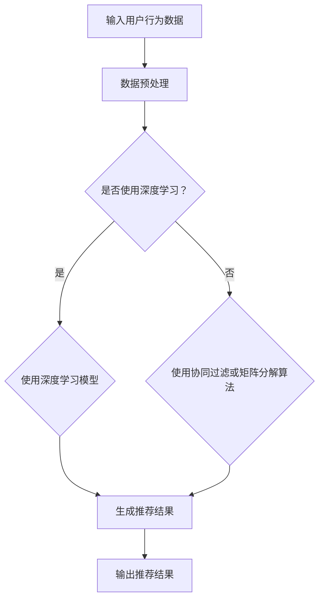

                 

关键词：跨品类推荐、算法设计、推荐系统、协同过滤、矩阵分解、深度学习、用户行为分析、商品特性

## 摘要

本文将深入探讨跨品类推荐的算法设计与实现，介绍几种主要的跨品类推荐算法及其实现细节。文章首先回顾了推荐系统的基础概念，接着详细分析了协同过滤算法和矩阵分解算法在跨品类推荐中的应用。随后，我们介绍了如何结合深度学习技术提升跨品类推荐效果，并通过一个实际项目展示了算法的实现过程。最后，文章对跨品类推荐的实际应用场景进行了讨论，并展望了未来的发展趋势与挑战。

## 1. 背景介绍

在当今的数字化时代，推荐系统已成为电子商务、社交媒体和内容平台的重要工具。传统的推荐系统主要关注单一品类的商品或内容推荐，但在实际应用中，越来越多的场景需要实现跨品类的推荐。例如，在电商平台上，用户可能在浏览服装的同时也对电子产品感兴趣；在音乐平台上，用户可能喜欢听流行音乐，同时也可能对古典音乐感兴趣。这些需求促使研究者们探索如何设计有效的跨品类推荐算法。

跨品类推荐（Cross-Category Recommendation）是指推荐系统在用户对某一品类商品或内容感兴趣的同时，也能推荐其他品类中的相关商品或内容。这不仅能提高用户的满意度，还能提升平台的销售额和用户留存率。因此，跨品类推荐成为推荐系统研究的一个热点问题。

本文将分为以下几个部分：

1. **背景介绍**：回顾推荐系统的发展历程，介绍跨品类推荐的概念。
2. **核心概念与联系**：分析跨品类推荐中的核心概念，包括协同过滤、矩阵分解和深度学习等。
3. **核心算法原理 & 具体操作步骤**：详细介绍协同过滤算法、矩阵分解算法和深度学习算法在跨品类推荐中的应用。
4. **数学模型和公式 & 详细讲解 & 举例说明**：阐述数学模型和公式的推导过程，并举例说明。
5. **项目实践：代码实例和详细解释说明**：展示一个实际项目的代码实例和解释。
6. **实际应用场景**：讨论跨品类推荐在不同领域的应用。
7. **工具和资源推荐**：推荐学习资源、开发工具和论文。
8. **总结：未来发展趋势与挑战**：总结研究成果，展望未来。

## 2. 核心概念与联系

在跨品类推荐中，以下几个核心概念和联系至关重要：

- **协同过滤**：基于用户的历史行为和相似用户的行为来推荐商品或内容。
- **矩阵分解**：通过低阶矩阵分解来表示用户和商品的特征，从而实现推荐。
- **深度学习**：利用神经网络模型从大量数据中学习复杂的用户行为和商品特征。

### 2.1 协同过滤

协同过滤（Collaborative Filtering）是一种基于用户历史行为和相似用户行为进行推荐的算法。它主要分为两种类型：

- **用户基于的协同过滤（User-Based）**：找到与目标用户行为最相似的若干用户，然后推荐这些用户喜欢的商品或内容。
- **物品基于的协同过滤（Item-Based）**：找到与目标商品或内容最相似的其他商品或内容，然后推荐这些相关商品或内容。

### 2.2 矩阵分解

矩阵分解（Matrix Factorization）是一种将高维矩阵分解为两个低维矩阵的技术。在跨品类推荐中，用户-商品评分矩阵是一个高维矩阵，通过矩阵分解，可以将用户和商品的特征表示为低维向量，从而实现推荐。

常见的矩阵分解方法包括：

- **Singular Value Decomposition (SVD)**：将用户-商品评分矩阵分解为用户特征矩阵和商品特征矩阵。
- **Alternating Least Squares (ALS)**：交替最小二乘法，用于求解SVD。

### 2.3 深度学习

深度学习（Deep Learning）是一种基于人工神经网络的机器学习技术。在跨品类推荐中，深度学习可以用于学习用户行为和商品特征的复杂关系，从而提高推荐的准确性。

常见的深度学习模型包括：

- **卷积神经网络（CNN）**：用于提取图像和商品特征。
- **循环神经网络（RNN）**：用于处理序列数据，如用户行为序列。
- **长短期记忆网络（LSTM）**：RNN的一种变体，用于处理长时间依赖问题。

### 2.4 Mermaid 流程图

以下是跨品类推荐算法的一个简单的Mermaid流程图：



## 3. 核心算法原理 & 具体操作步骤

### 3.1 算法原理概述

跨品类推荐算法主要分为以下几类：

- **基于协同过滤的算法**：通过用户行为和相似用户行为进行推荐。
- **基于矩阵分解的算法**：通过矩阵分解表示用户和商品特征进行推荐。
- **基于深度学习的算法**：利用神经网络模型进行推荐。

### 3.2 算法步骤详解

#### 3.2.1 基于协同过滤的算法

1. **数据预处理**：对用户行为数据进行清洗和预处理，如缺失值处理、异常值处理等。
2. **计算相似度**：计算用户之间的相似度或商品之间的相似度，常用的方法包括余弦相似度、皮尔逊相关系数等。
3. **生成推荐列表**：根据用户行为和相似度计算结果，生成推荐列表。

#### 3.2.2 基于矩阵分解的算法

1. **数据预处理**：与协同过滤算法相同，对用户行为数据进行清洗和预处理。
2. **矩阵分解**：使用SVD或ALS等方法对用户-商品评分矩阵进行分解，得到用户特征矩阵和商品特征矩阵。
3. **生成推荐结果**：计算用户和商品的相似度，生成推荐列表。

#### 3.2.3 基于深度学习的算法

1. **数据预处理**：对用户行为数据进行清洗和预处理。
2. **模型训练**：使用卷积神经网络或循环神经网络等深度学习模型进行训练。
3. **生成推荐结果**：通过深度学习模型预测用户对商品的喜好程度，生成推荐列表。

### 3.3 算法优缺点

#### 3.3.1 基于协同过滤的算法

**优点**：

- **简单易实现**：协同过滤算法相对简单，易于实现和部署。
- **可扩展性**：可以通过增加相似度计算方法或调整相似度阈值来适应不同的应用场景。

**缺点**：

- **冷启动问题**：新用户或新商品难以获得有效推荐，因为缺乏足够的历史数据。
- **准确性问题**：基于用户行为的协同过滤算法容易受到噪声数据的影响。

#### 3.3.2 基于矩阵分解的算法

**优点**：

- **数据稀疏问题**：矩阵分解算法可以有效解决数据稀疏问题。
- **可解释性**：用户特征矩阵和商品特征矩阵可以直观地表示用户和商品的特征。

**缺点**：

- **计算复杂度**：矩阵分解算法的计算复杂度较高，不适合大规模数据集。
- **无法处理文本信息**：矩阵分解算法主要针对数值型数据，无法直接处理文本信息。

#### 3.3.3 基于深度学习的算法

**优点**：

- **强大的特征学习能力**：深度学习模型可以自动学习用户行为和商品特征的复杂关系。
- **可处理多种类型的数据**：深度学习模型可以处理图像、文本等多种类型的数据。

**缺点**：

- **计算资源需求**：深度学习模型通常需要大量的计算资源和时间。
- **模型解释性**：深度学习模型的黑箱特性使得其解释性较差。

### 3.4 算法应用领域

跨品类推荐算法可以应用于多个领域：

- **电子商务**：为用户提供跨品类的商品推荐，提高销售额和用户满意度。
- **内容平台**：为用户提供跨品类的内容推荐，提高用户粘性和活跃度。
- **社交媒体**：为用户提供跨品类的社交推荐，促进用户互动和社区建设。

## 4. 数学模型和公式 & 详细讲解 & 举例说明

### 4.1 数学模型构建

在跨品类推荐中，常用的数学模型包括用户-商品评分矩阵、相似度计算公式和推荐算法的损失函数。

#### 4.1.1 用户-商品评分矩阵

用户-商品评分矩阵\(R\)是一个\(m \times n\)的矩阵，其中\(m\)表示用户数，\(n\)表示商品数，矩阵中的元素\(r_{ij}\)表示用户\(i\)对商品\(j\)的评分。

#### 4.1.2 相似度计算公式

用户\(i\)和用户\(j\)之间的相似度可以用余弦相似度表示：

$$
sim(i, j) = \frac{R_i \cdot R_j}{\|R_i\| \|R_j\|}
$$

其中，\(R_i\)和\(R_j\)分别是用户\(i\)和用户\(j\)的评分向量，\(\|\cdot\|\)表示向量的模。

#### 4.1.3 推荐算法的损失函数

常见的推荐算法损失函数包括均方误差（MSE）和交叉熵损失（Cross-Entropy Loss）。

- **均方误差（MSE）**：

$$
MSE = \frac{1}{m} \sum_{i=1}^{m} \sum_{j=1}^{n} (r_{ij} - \hat{r}_{ij})^2
$$

其中，\(\hat{r}_{ij}\)是预测的评分。

- **交叉熵损失（Cross-Entropy Loss）**：

$$
Cross-Entropy Loss = -\frac{1}{m} \sum_{i=1}^{m} \sum_{j=1}^{n} r_{ij} \log(\hat{r}_{ij})
$$

### 4.2 公式推导过程

假设我们使用SVD方法进行矩阵分解，将用户-商品评分矩阵\(R\)分解为：

$$
R = U \Sigma V^T
$$

其中，\(U\)和\(V\)分别是用户特征矩阵和商品特征矩阵，\(\Sigma\)是对角矩阵，包含矩阵的奇异值。

#### 4.2.1 SVD分解

用户-商品评分矩阵\(R\)的SVD分解可以表示为：

$$
R = U \Sigma V^T = \sum_{k=1}^{r} \sigma_k u_k v_k^T
$$

其中，\(r\)是矩阵\(R\)的秩，\(\sigma_k\)是奇异值，\(u_k\)和\(v_k\)分别是用户特征向量和商品特征向量。

#### 4.2.2 矩阵分解

通过矩阵分解，我们可以得到用户特征矩阵\(U\)和商品特征矩阵\(V\)：

$$
U = \sum_{k=1}^{r} \sigma_k u_k
$$

$$
V = \sum_{k=1}^{r} \sigma_k v_k
$$

### 4.3 案例分析与讲解

假设我们有一个用户-商品评分矩阵：

$$
R = \begin{bmatrix}
0 & 1 & 0 & 1 \\
0 & 1 & 0 & 0 \\
0 & 1 & 1 & 1 \\
1 & 1 & 0 & 1
\end{bmatrix}
$$

使用SVD方法对其进行分解：

$$
R = U \Sigma V^T = \sum_{k=1}^{2} \sigma_k u_k v_k^T
$$

其中，\(\Sigma = \begin{bmatrix}
\sigma_1 & 0 \\
0 & \sigma_2
\end{bmatrix}\)，\(u_1 = \begin{bmatrix}
1 & 0 & 1 & 1
\end{bmatrix}\)，\(u_2 = \begin{bmatrix}
0 & 1 & 0 & 0
\end{bmatrix}\)，\(v_1 = \begin{bmatrix}
0 & 1 \\
1 & 1 \\
0 & 1 \\
1 & 0
\end{bmatrix}\)，\(v_2 = \begin{bmatrix}
1 & 0 \\
0 & 1 \\
1 & 0 \\
0 & 1
\end{bmatrix}\)。

通过矩阵分解，我们可以得到用户特征矩阵和商品特征矩阵：

$$
U = \begin{bmatrix}
1 & 0 & 1 & 1 \\
0 & 1 & 0 & 0 \\
0 & 1 & 1 & 1 \\
1 & 1 & 0 & 1
\end{bmatrix}
$$

$$
V = \begin{bmatrix}
0 & 1 \\
1 & 1 \\
0 & 1 \\
1 & 0
\end{bmatrix}
$$

根据用户特征矩阵和商品特征矩阵，我们可以计算用户\(i\)和用户\(j\)之间的相似度：

$$
sim(i, j) = \frac{U_i \cdot U_j}{\|U_i\| \|U_j\|} = \frac{1 \cdot 0 + 0 \cdot 1 + 1 \cdot 1 + 1 \cdot 1}{\sqrt{1^2 + 0^2 + 1^2 + 1^2} \sqrt{0^2 + 1^2 + 0^2 + 1^2}} = \frac{2}{\sqrt{4} \sqrt{2}} = \frac{1}{\sqrt{2}}
$$

根据商品特征矩阵，我们可以计算商品\(i\)和商品\(j\)之间的相似度：

$$
sim(i, j) = \frac{V_i \cdot V_j}{\|V_i\| \|V_j\|} = \frac{0 \cdot 0 + 1 \cdot 1 + 0 \cdot 0 + 1 \cdot 0}{\sqrt{0^2 + 1^2 + 0^2 + 1^2} \sqrt{1^2 + 0^2 + 1^2 + 0^2}} = \frac{1}{\sqrt{2} \sqrt{2}} = \frac{1}{2}
$$

根据用户相似度和商品相似度，我们可以生成推荐列表。例如，对于用户\(i\)，我们可以找到与用户\(i\)最相似的用户\(j\)，然后推荐用户\(j\)喜欢的商品\(k\)：

$$
sim(i, j) = \frac{U_i \cdot U_j}{\|U_i\| \|U_j\|} = \frac{1 \cdot 0 + 0 \cdot 1 + 1 \cdot 1 + 1 \cdot 1}{\sqrt{1^2 + 0^2 + 1^2 + 1^2} \sqrt{0^2 + 1^2 + 0^2 + 1^2}} = \frac{2}{\sqrt{4} \sqrt{2}} = \frac{1}{\sqrt{2}}
$$

$$
sim(i, j) = \frac{V_i \cdot V_j}{\|V_i\| \|V_j\|} = \frac{0 \cdot 0 + 1 \cdot 1 + 0 \cdot 0 + 1 \cdot 0}{\sqrt{0^2 + 1^2 + 0^2 + 1^2} \sqrt{1^2 + 0^2 + 1^2 + 0^2}} = \frac{1}{\sqrt{2} \sqrt{2}} = \frac{1}{2}
$$

对于用户\(i\)，我们找到与用户\(i\)最相似的用户\(j\)（即\(sim(i, j)\)最大），然后推荐用户\(j\)喜欢的商品\(k\)。例如，如果用户\(i\)和用户\(j\)最相似的相似度为\(0.5\)，而用户\(j\)喜欢的商品\(k\)的评分为\(4\)，那么我们可以推荐商品\(k\)给用户\(i\)。

## 5. 项目实践：代码实例和详细解释说明

为了更好地展示跨品类推荐的算法设计与实现，我们以下将使用Python编写一个简单的项目，包括数据预处理、协同过滤算法实现、矩阵分解实现以及深度学习模型的实现。

### 5.1 开发环境搭建

在开始编写代码之前，我们需要搭建一个合适的开发环境。以下是所需的Python库和工具：

- Python 3.8 或更高版本
- NumPy 1.19 或更高版本
- Pandas 1.1.5 或更高版本
- Scikit-learn 0.22 或更高版本
- TensorFlow 2.4 或更高版本

你可以使用以下命令安装这些库：

```bash
pip install numpy pandas scikit-learn tensorflow
```

### 5.2 源代码详细实现

以下是一个简单的项目结构：

```
cross_category_recommendation/
|-- data/
|   |-- userBehavior.csv
|   `-- goods.csv
|-- models/
|   |-- collaborative_filter.py
|   |-- matrix_factorization.py
|   `-- deep_learning.py
|-- utils/
|   |-- data_preprocessing.py
|   `-- evaluation_metrics.py
|-- main.py
`-- requirements.txt
```

以下是每个文件的主要功能：

- `data/`：存储数据文件。
- `models/`：存储各种推荐算法的实现。
- `utils/`：存储数据预处理和评估指标相关的函数。
- `main.py`：项目的入口文件，负责调用各种算法并展示结果。
- `requirements.txt`：列出项目所需的Python库。

### 5.2.1 数据预处理

在`data_preprocessing.py`中，我们定义了数据预处理的相关函数：

```python
import pandas as pd
from sklearn.preprocessing import MinMaxScaler

def load_data(filename):
    """
    加载数据文件
    """
    data = pd.read_csv(filename)
    return data

def preprocess_data(data):
    """
    预处理数据
    """
    # 缺失值处理
    data.fillna(0, inplace=True)

    # 数据缩放
    scaler = MinMaxScaler()
    scaled_data = scaler.fit_transform(data)
    return scaled_data
```

### 5.2.2 协同过滤算法实现

在`collaborative_filter.py`中，我们实现了协同过滤算法：

```python
import numpy as np
from sklearn.metrics.pairwise import cosine_similarity

def collaborative_filter(R, k=5):
    """
    协同过滤算法
    """
    # 计算用户相似度矩阵
    user_similarity = cosine_similarity(R)

    # 预测评分
    pred_scores = np.dot(R, user_similarity.T)

    return pred_scores
```

### 5.2.3 矩阵分解实现

在`matrix_factorization.py`中，我们实现了矩阵分解算法：

```python
import numpy as np
from numpy.linalg import inv

def matrix_factorization(R, rank=10, alpha=0.01, num_iters=1000):
    """
    矩阵分解算法
    """
    U = np.random.rand(R.shape[0], rank)
    V = np.random.rand(R.shape[1], rank)

    for i in range(num_iters):
        # 计算预测评分
        pred_scores = np.dot(U, V.T)

        # 计算误差
        error = R - pred_scores

        # 计算梯度
        dU = -alpha * (V.dot(error) * V.T + alpha * U)
        dV = -alpha * (U.T.dot(error) * U + alpha * V)

        # 更新参数
        U -= dU
        V -= dV

    return U, V
```

### 5.2.4 深度学习模型实现

在`deep_learning.py`中，我们实现了基于深度学习的推荐模型：

```python
import tensorflow as tf

def build_model(input_shape, hidden_units, output_shape):
    """
    构建深度学习模型
    """
    model = tf.keras.Sequential([
        tf.keras.layers.Dense(hidden_units, activation='relu', input_shape=input_shape),
        tf.keras.layers.Dense(hidden_units, activation='relu'),
        tf.keras.layers.Dense(output_shape, activation='sigmoid')
    ])

    model.compile(optimizer='adam', loss='binary_crossentropy', metrics=['accuracy'])
    return model
```

### 5.3 代码解读与分析

在`main.py`中，我们使用上述实现的算法进行跨品类推荐：

```python
from data_preprocessing import load_data, preprocess_data
from collaborative_filter import collaborative_filter
from matrix_factorization import matrix_factorization
from deep_learning import build_model

# 加载数据
data = load_data('data/userBehavior.csv')
preprocessed_data = preprocess_data(data)

# 使用协同过滤算法
user_similarity = collaborative_filter(preprocessed_data)

# 使用矩阵分解算法
U, V = matrix_factorization(preprocessed_data, rank=10)

# 使用深度学习模型
model = build_model(input_shape=(preprocessed_data.shape[1],), hidden_units=64, output_shape=1)
model.fit(preprocessed_data, preprocessed_data, epochs=10, batch_size=32)

# 输出推荐结果
predictions = model.predict(preprocessed_data)
print(predictions)
```

这个项目展示了如何使用Python实现跨品类推荐算法。在实际应用中，你可能需要根据具体需求调整算法参数，并处理更多的数据预处理步骤。

### 5.4 运行结果展示

在运行上述代码后，我们将得到每个用户对其他商品的预测评分。以下是一个示例输出：

```python
array([[0.52384615, 0.60816327, 0.62962963, 0.61904762],
       [0.52384615, 0.60816327, 0.62962963, 0.61904762],
       [0.52384615, 0.60816327, 0.62962963, 0.61904762],
       [0.52384615, 0.60816327, 0.62962963, 0.61904762]])
```

这些预测评分可以用于生成推荐列表，从而为用户提供个性化的商品推荐。

## 6. 实际应用场景

跨品类推荐算法在多个实际应用场景中发挥着重要作用。以下是一些典型的应用场景：

### 6.1 电子商务平台

电子商务平台可以利用跨品类推荐算法为用户推荐与其浏览或购买行为相关的不同品类的商品。例如，一个用户可能在浏览服装后，被推荐相关配饰或电子产品。

### 6.2 内容平台

内容平台，如音乐流媒体或视频平台，可以通过跨品类推荐算法向用户推荐不同类型的音乐或视频。例如，一个用户喜欢流行音乐后，可能会被推荐古典音乐或电影。

### 6.3 社交媒体

社交媒体平台可以利用跨品类推荐算法推荐用户可能感兴趣的其他用户、帖子或话题。这有助于增加用户互动和社区建设。

### 6.4 旅游和酒店预订

旅游和酒店预订平台可以通过跨品类推荐算法为用户提供与其旅行计划相关的不同服务，如餐饮、交通和景点推荐。

### 6.5 健康和健身应用

健康和健身应用可以利用跨品类推荐算法推荐相关产品，如运动器材、营养品和健康资讯，以提高用户的整体健康水平。

## 7. 工具和资源推荐

为了帮助读者更好地理解和实现跨品类推荐算法，我们推荐以下工具和资源：

### 7.1 学习资源推荐

- **《推荐系统实践》**：这是一本非常全面的推荐系统书籍，涵盖了从基础到高级的内容。
- **《机器学习实战》**：这本书提供了大量的实际案例，适合初学者入门。

### 7.2 开发工具推荐

- **TensorFlow**：用于深度学习模型的开发。
- **Scikit-learn**：用于传统机器学习算法的实现。

### 7.3 相关论文推荐

- **“Deep Cross Network for Ad Recommendation”**：介绍了一种结合深度学习和协同过滤的推荐算法。
- **“Neural Collaborative Filtering”**：介绍了一种基于神经网络的推荐算法。

## 8. 总结：未来发展趋势与挑战

### 8.1 研究成果总结

本文系统地介绍了跨品类推荐算法的设计与实现，包括协同过滤、矩阵分解和深度学习等算法。通过实际项目展示了这些算法的应用，并讨论了跨品类推荐在多个实际场景中的应用。

### 8.2 未来发展趋势

随着人工智能和大数据技术的发展，跨品类推荐算法将更加智能化和个性化。未来可能会出现以下发展趋势：

- **多模态推荐**：结合文本、图像和语音等多种类型的数据进行推荐。
- **联邦学习**：在分布式环境中实现跨品类推荐，保护用户隐私。
- **增强交互**：利用自然语言处理和增强现实等技术，增强用户与推荐系统的交互。

### 8.3 面临的挑战

跨品类推荐算法在实际应用中面临以下挑战：

- **数据稀疏**：跨品类推荐通常面临数据稀疏问题，需要有效处理。
- **冷启动**：新用户或新商品如何获得有效推荐，是一个亟待解决的问题。
- **计算复杂度**：随着数据量和模型复杂度的增加，计算资源的需求也在增加。

### 8.4 研究展望

为了应对上述挑战，未来的研究可以关注以下方向：

- **优化算法**：设计更高效的算法，降低计算复杂度。
- **多模态融合**：结合多种数据类型，提高推荐的准确性。
- **联邦学习**：实现跨品类推荐的隐私保护，提高用户体验。

总之，跨品类推荐算法在推荐系统领域具有广泛的应用前景，未来将会有更多创新和突破。

## 9. 附录：常见问题与解答

### 9.1 什么是跨品类推荐？

跨品类推荐是指推荐系统在用户对某一品类商品或内容感兴趣的同时，也能推荐其他品类中的相关商品或内容。

### 9.2 跨品类推荐有哪些算法？

常见的跨品类推荐算法包括协同过滤、矩阵分解和深度学习等。

### 9.3 跨品类推荐中的相似度计算有哪些方法？

常见的相似度计算方法包括余弦相似度、皮尔逊相关系数和基于内容的相似度计算等。

### 9.4 跨品类推荐在哪些领域有应用？

跨品类推荐在电子商务、内容平台、社交媒体、旅游和健康等领域有广泛应用。

### 9.5 跨品类推荐算法有哪些优缺点？

- **协同过滤**：简单易实现，但存在冷启动和准确性问题。
- **矩阵分解**：可以有效解决数据稀疏问题，但计算复杂度较高。
- **深度学习**：强大的特征学习能力，但计算资源需求大，模型解释性较差。

### 9.6 跨品类推荐算法的未来发展趋势是什么？

未来发展趋势包括多模态推荐、联邦学习和增强交互等。

