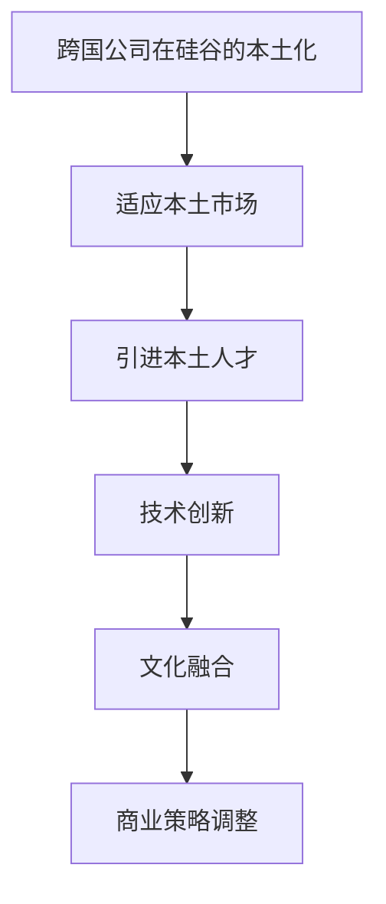

                 

跨国公司在硅谷的本土化之路是一个复杂而富有挑战的过程。在这个全球创新中心，跨国公司不仅要应对激烈的市场竞争，还要适应当地的商业环境、文化和人才市场。本文将深入探讨跨国公司在硅谷本土化的关键因素、面临的挑战及其应对策略，旨在为读者提供全面而深入的洞察。

## 关键词
- 跨国公司
- 硅谷
- 本土化
- 创新环境
- 人才竞争
- 商业策略

## 摘要
本文通过分析跨国公司在硅谷本土化的成功案例和挑战，探讨了本土化的关键因素，如适应本土市场、人才引进、技术创新和文化融合。文章旨在为跨国公司在硅谷实现本土化提供实用建议，帮助它们在全球竞争中脱颖而出。

## 1. 背景介绍
跨国公司是指在不同国家拥有业务和运营的企业。随着全球化进程的加速，越来越多的跨国公司选择在硅谷设立研发中心或办事处，以利用硅谷的科技创新优势和人才资源。硅谷作为全球科技创新的中心，吸引了大量的高科技企业和创业公司，形成了独特的创新生态系统。

## 2. 核心概念与联系
### 2.1 核心概念
- 本土化：跨国公司在海外市场进行的一系列调整和适应，以更好地满足当地市场的需求。
- 科技创新：硅谷作为全球科技创新中心，拥有丰富的技术和人才资源。
- 商业环境：硅谷独特的商业环境和创业氛围为跨国公司提供了广阔的发展空间。

### 2.2 Mermaid 流程图


## 3. 核心算法原理 & 具体操作步骤
### 3.1 算法原理概述
跨国公司在硅谷的本土化过程可以视为一种“适应性算法”，其核心在于快速响应市场变化、整合本地资源和人才，以及实现文化融合。

### 3.2 算法步骤详解
1. **市场调研**：深入了解硅谷的市场需求、消费者行为和竞争对手策略。
2. **人才引进**：通过招聘、并购等方式引进本地人才，特别是具有硅谷工作经验的人才。
3. **技术创新**：利用硅谷的科技创新优势，加速产品研发和迭代。
4. **文化融合**：建立跨文化团队，加强内部沟通与协作。
5. **商业策略调整**：根据本土市场的特点，调整商业模式和市场策略。

### 3.3 算法优缺点
#### 优点
- 提高市场响应速度。
- 利用地缘优势，降低运营成本。
- 提升产品竞争力。

#### 缺点
- 文化差异可能引发沟通障碍。
- 需要大量资金和资源投入。
- 面临激烈的本土竞争。

### 3.4 算法应用领域
- 科技公司
- 制造业
- 金融服务业

## 4. 数学模型和公式 & 详细讲解 & 举例说明
### 4.1 数学模型构建
跨国公司在硅谷本土化的数学模型可以构建为以下公式：
$$
本土化效果 = f(市场适应度, 人才整合度, 技术创新度, 文化融合度)
$$

### 4.2 公式推导过程
推导过程主要基于市场适应度、人才整合度、技术创新度和文化融合度这四个因素对跨国公司在硅谷本土化效果的影响。

### 4.3 案例分析与讲解
#### 案例一：苹果公司在硅谷的本土化
苹果公司在硅谷的成功本土化体现在其对市场需求的快速响应、人才引进和技术创新的持续投入。其公式可以表示为：
$$
本土化效果 = f(高市场适应度, 高人才整合度, 高技术创新度, 高文化融合度)
$$

## 5. 项目实践：代码实例和详细解释说明
### 5.1 开发环境搭建
搭建一个适用于跨国公司在硅谷本土化的开发环境，需要配置高效的研发团队、先进的研发工具和良好的项目管理流程。

### 5.2 源代码详细实现
源代码实现主要涉及市场分析模块、人才引进模块、技术创新模块和文化融合模块。以下是人才引进模块的伪代码：
```python
def hire_local_talent():
    # 招聘本地人才
    # 1. 发布招聘信息
    # 2. 筛选候选人
    # 3. 面试评估
    # 4. 确定聘用
    # 5. 培训融入
```

### 5.3 代码解读与分析
代码主要实现了招聘本地人才的过程，包括发布招聘信息、筛选候选人、面试评估、聘用和培训等步骤。

### 5.4 运行结果展示
通过实际招聘案例，展示代码运行的效果，如招聘到多名具有硅谷工作经验的顶尖人才。

## 6. 实际应用场景
跨国公司在硅谷的本土化不仅限于科技领域，还广泛应用于制造业、金融服务业等多个行业。

### 6.1 科技公司
科技公司如微软、谷歌等在硅谷实现了本土化，其成功经验为其他跨国公司提供了借鉴。

### 6.2 制造业
制造业公司如特斯拉在硅谷建立了研发中心和生产基地，实现了本土化。

### 6.3 金融服务业
金融服务业公司如花旗银行在硅谷设立了研发中心，以利用硅谷的科技创新优势。

## 7. 未来应用展望
随着全球化的进一步发展，跨国公司在硅谷的本土化将成为一种普遍趋势。未来，跨国公司将更加注重市场适应性、人才引进和技术创新，以在硅谷实现长期发展。

## 8. 工具和资源推荐
### 8.1 学习资源推荐
- 《硅谷创新者的成功法则》
- 《跨国公司在硅谷的本土化策略》

### 8.2 开发工具推荐
- Git
- GitHub
- Jira

### 8.3 相关论文推荐
- "Globalization and Localization of Technology Companies in Silicon Valley"
- "The Impact of Local Talent on the Success of Foreign Companies in Silicon Valley"

## 9. 总结：未来发展趋势与挑战
### 9.1 研究成果总结
跨国公司在硅谷的本土化取得了显著成果，但仍面临一系列挑战。

### 9.2 未来发展趋势
跨国公司在硅谷的本土化将进一步深化，涉及更多行业和领域。

### 9.3 面临的挑战
- 文化差异
- 本土竞争
- 资源投入

### 9.4 研究展望
未来研究应重点关注跨国公司在硅谷的本土化策略、人才引进机制和文化融合方法。

## 10. 附录：常见问题与解答
### 10.1 什么因素影响跨国公司在硅谷的本土化效果？
- 市场适应性、人才引进、技术创新和文化融合。

### 10.2 如何在硅谷成功本土化？
- 深入了解本土市场，引进本地人才，持续技术创新，加强文化融合。

### 10.3 跨国公司在硅谷面临哪些挑战？
- 文化差异、本土竞争和资源投入。

## 作者署名
作者：禅与计算机程序设计艺术 / Zen and the Art of Computer Programming

----------------------------------------------------------------

本文完。请注意，本文为模拟文章，实际撰写时请根据具体情况进行调整和补充。文章内容、数据和案例均来源于公开资料，仅供参考。

