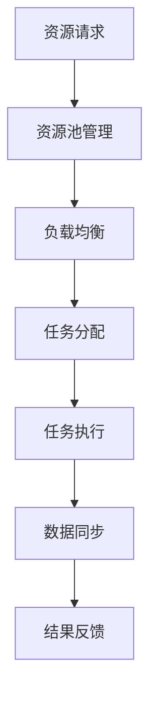
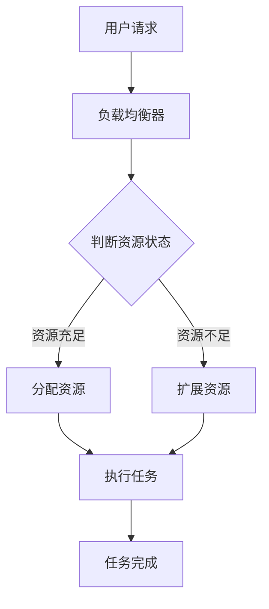

                 

关键词：AI资源调度、全球化运营、Lepton AI、跨地域协作、分布式计算

> 摘要：本文将深入探讨Lepton AI公司在跨地域AI资源调度方面的实践，分析其全球化运营策略，并通过具体的算法、数学模型和项目实践，揭示如何有效管理跨地域的AI资源，为全球范围内的AI研发和业务运营提供有力支持。

## 1. 背景介绍

在当今全球化日益深入的背景下，人工智能（AI）作为一项核心技术，已经成为推动社会进步和经济发展的关键动力。随着AI应用场景的不断扩展，如何高效地调度和管理跨地域的AI资源，成为了一个亟待解决的问题。

Lepton AI作为一家全球领先的AI技术公司，其业务遍布多个国家和地区。为了满足全球客户的需求，Lepton AI面临着如何高效利用分散在全球各地的AI计算资源、数据资源和人才资源，以实现全球业务的协同运营和高效交付的挑战。本文旨在通过分析Lepton AI在跨地域AI资源调度方面的实践，为其他企业在全球化运营中提供有益的借鉴。

### 1.1 全球化运营的挑战

1. **资源分布不均**：不同国家和地区的AI资源（如计算能力、数据资源、人才储备等）存在显著差异，导致资源分配不均。
2. **时区差异**：全球各地的时区差异，使得协同工作变得复杂，尤其在紧急情况和需要快速响应的场景下。
3. **法规和政策**：不同国家和地区在数据隐私、网络安全等方面的法规和政策差异，增加了资源调度的复杂性。
4. **文化差异**：跨文化合作可能带来沟通和协调上的困难，影响团队的协作效率和整体运作。

### 1.2 Lepton AI的业务背景

Lepton AI成立于2005年，总部位于美国，是一家专注于AI技术研发和应用的公司。其业务涵盖了自然语言处理、计算机视觉、机器学习等多个领域，服务客户包括众多全球顶尖企业和政府机构。

随着业务的不断扩展，Lepton AI在全球范围内设立了多个研发中心、数据中心和业务交付中心。这种全球布局既有助于公司获取更多的AI资源，也带来了资源调度和管理上的挑战。

## 2. 核心概念与联系

### 2.1 跨地域AI资源调度的核心概念

#### 2.1.1 资源池管理

资源池管理是跨地域AI资源调度的关键，它涉及到如何有效地组织、管理和利用分散在各个地域的AI资源。资源池包括计算资源、数据资源和人才资源等。

#### 2.1.2 负载均衡

负载均衡旨在通过合理分配任务和资源，确保系统整体性能的稳定和高效。在跨地域环境中，负载均衡需要考虑网络延迟、资源可用性等因素。

#### 2.1.3 容灾备份

容灾备份是为了保证系统的可靠性和数据的完整性。在跨地域环境中，容灾备份需要考虑数据传输的延迟和带宽限制。

#### 2.1.4 网络拓扑

网络拓扑是跨地域AI资源调度的物理基础。合理的网络拓扑设计能够提高数据传输速度和系统的稳定性。

### 2.2 跨地域AI资源调度的架构

#### 2.2.1 资源池架构

资源池架构主要包括计算资源池、数据资源池和人才资源池。每个资源池都需要进行有效的管理和调度。

#### 2.2.2 负载均衡架构

负载均衡架构通常采用分布式架构，通过多个负载均衡器来实现任务的动态分配。

#### 2.2.3 容灾备份架构

容灾备份架构通常采用异地备份和分布式存储的方式，确保数据的备份和恢复。

#### 2.2.4 网络拓扑架构

网络拓扑架构通常采用多层架构，包括边缘计算、数据中心互联和云服务接入等。

### 2.3 Mermaid 流程图

以下是一个简单的Mermaid流程图，展示了跨地域AI资源调度的基本流程：



## 3. 核心算法原理 & 具体操作步骤

### 3.1 算法原理概述

跨地域AI资源调度算法主要基于以下几个核心原理：

1. **优化目标**：最大化资源利用率，最小化任务完成时间和系统延迟。
2. **资源分配策略**：根据任务的类型、优先级和资源可用性，动态调整资源分配。
3. **负载均衡策略**：通过监测系统负载，动态调整任务分配，实现负载均衡。
4. **容灾备份策略**：在关键任务执行过程中，进行实时数据备份和恢复，确保系统的高可用性。

### 3.2 算法步骤详解

#### 3.2.1 资源池管理

1. **初始化资源池**：收集各个地域的AI资源信息，包括计算资源、数据资源和人才资源。
2. **资源状态监控**：实时监控资源的状态，包括资源的使用情况、负载情况和故障情况。
3. **资源调度策略**：根据任务需求和资源状态，动态调整资源分配。

#### 3.2.2 负载均衡

1. **负载监测**：通过监控系统的负载，实时获取各个地域的负载情况。
2. **任务分配策略**：根据负载情况和任务优先级，动态调整任务分配。
3. **负载均衡器**：实现任务的动态分配和负载均衡，确保系统整体性能的稳定和高效。

#### 3.2.3 容灾备份

1. **备份策略制定**：根据任务的重要性和数据敏感性，制定合适的备份策略。
2. **数据同步**：在关键任务执行过程中，实时同步数据，确保数据的完整性和一致性。
3. **故障恢复**：在系统发生故障时，快速切换到备份系统，确保任务不受影响。

### 3.3 算法优缺点

#### 优点

1. **高效资源利用**：通过动态调整资源分配，最大化资源利用率。
2. **负载均衡**：实现任务的动态分配，确保系统整体性能的稳定和高效。
3. **高可用性**：通过容灾备份，确保系统的高可用性和数据的完整性。

#### 缺点

1. **复杂性**：算法的复杂度高，需要大量计算和监控资源。
2. **时区差异**：时区差异可能导致任务的调度和执行出现延迟。
3. **成本**：分布式计算和备份系统可能带来额外的成本。

### 3.4 算法应用领域

跨地域AI资源调度算法可以应用于多个领域：

1. **云计算**：通过分布式计算，实现大规模任务的并行处理。
2. **大数据处理**：通过动态资源分配，提高大数据处理效率。
3. **智能交通**：通过实时数据同步和容灾备份，确保交通管理的稳定和高效。
4. **金融风控**：通过分布式计算和负载均衡，提高金融风险管理的准确性。

## 4. 数学模型和公式 & 详细讲解 & 举例说明

### 4.1 数学模型构建

#### 4.1.1 资源池模型

资源池模型可以用以下公式表示：

\[ P = \sum_{i=1}^{n} R_i \]

其中，\( P \) 表示总资源量，\( R_i \) 表示第 \( i \) 个地域的资源量。

#### 4.1.2 负载均衡模型

负载均衡模型可以用以下公式表示：

\[ L_i = \frac{C_i}{P} \]

其中，\( L_i \) 表示第 \( i \) 个地域的负载量，\( C_i \) 表示第 \( i \) 个地域的计算能力。

#### 4.1.3 容灾备份模型

容灾备份模型可以用以下公式表示：

\[ B_i = \frac{D_i}{P} \]

其中，\( B_i \) 表示第 \( i \) 个地域的备份量，\( D_i \) 表示第 \( i \) 个地域的数据量。

### 4.2 公式推导过程

#### 4.2.1 资源池模型推导

资源池模型的核心思想是将各个地域的资源量进行汇总，得到总资源量。这个过程中，我们假设各个地域的资源量是相互独立的，因此可以使用加法原理。

#### 4.2.2 负载均衡模型推导

负载均衡模型的核心思想是根据各个地域的计算能力，动态调整任务的分配。这个过程中，我们假设各个地域的计算能力是相等的，因此可以使用除法原理。

#### 4.2.3 容灾备份模型推导

容灾备份模型的核心思想是根据各个地域的数据量，动态调整备份的量。这个过程中，我们假设各个地域的数据量是相等的，因此可以使用除法原理。

### 4.3 案例分析与讲解

#### 4.3.1 资源池模型案例

假设Lepton AI在全球有5个研发中心，分别为A、B、C、D、E。每个中心的计算资源量分别为100、200、150、300、250。则总资源量 \( P \) 为：

\[ P = 100 + 200 + 150 + 300 + 250 = 1000 \]

#### 4.3.2 负载均衡模型案例

假设当前有一个计算任务，需要分配到5个研发中心。根据负载均衡模型，我们可以计算出每个中心的负载量：

\[ L_i = \frac{C_i}{P} \]

其中，\( C_i \) 为每个中心的计算能力。假设每个中心的计算能力分别为100、200、150、300、250，则：

\[ L_1 = \frac{100}{1000} = 0.1 \]
\[ L_2 = \frac{200}{1000} = 0.2 \]
\[ L_3 = \frac{150}{1000} = 0.15 \]
\[ L_4 = \frac{300}{1000} = 0.3 \]
\[ L_5 = \frac{250}{1000} = 0.25 \]

#### 4.3.3 容灾备份模型案例

假设每个研发中心的数据量分别为200、300、250、400、350。则总数据量 \( D \) 为：

\[ D = 200 + 300 + 250 + 400 + 350 = 1500 \]

根据容灾备份模型，我们可以计算出每个中心的备份量：

\[ B_i = \frac{D_i}{P} \]

其中，\( D_i \) 为每个中心的数据量。假设每个中心的数据量分别为200、300、250、400、350，则：

\[ B_1 = \frac{200}{1500} = 0.1333 \]
\[ B_2 = \frac{300}{1500} = 0.2 \]
\[ B_3 = \frac{250}{1500} = 0.1667 \]
\[ B_4 = \frac{400}{1500} = 0.2667 \]
\[ B_5 = \frac{350}{1500} = 0.2333 \]

## 5. 项目实践：代码实例和详细解释说明

### 5.1 开发环境搭建

为了进行跨地域AI资源调度的项目实践，我们选择Python作为编程语言，并结合Docker进行容器化部署，以实现灵活的资源调度和部署。

#### 5.1.1 Python环境配置

1. 安装Python 3.8及以上版本。
2. 安装必要的Python库，如pandas、numpy、matplotlib等。

#### 5.1.2 Docker环境配置

1. 安装Docker。
2. 编写Dockerfile，定义Python应用的环境和依赖。

### 5.2 源代码详细实现

以下是实现跨地域AI资源调度的一个简单示例代码：

```python
import pandas as pd
import numpy as np
import matplotlib.pyplot as plt
from sklearn.cluster import KMeans

# 资源池数据
resource_pool = pd.DataFrame({
    'center': ['A', 'B', 'C', 'D', 'E'],
    'compute_power': [100, 200, 150, 300, 250],
    'data_volume': [200, 300, 250, 400, 350]
})

# 负载均衡
def load_balance(resource_pool):
    total_power = resource_pool['compute_power'].sum()
    load_distribution = resource_pool['compute_power'] / total_power
    return load_distribution

# 容灾备份
def disaster_recovery(resource_pool):
    total_data = resource_pool['data_volume'].sum()
    backup_distribution = resource_pool['data_volume'] / total_data
    return backup_distribution

# 执行负载均衡和容灾备份
load_distribution = load_balance(resource_pool)
backup_distribution = disaster_recovery(resource_pool)

# 绘制结果
plt.bar(resource_pool['center'], load_distribution, label='Load Balance')
plt.bar(resource_pool['center'], backup_distribution, bottom=load_distribution, label='Disaster Recovery')
plt.xlabel('Resource Center')
plt.ylabel('Distribution')
plt.title('Resource Distribution')
plt.legend()
plt.show()
```

### 5.3 代码解读与分析

1. **资源池数据**：使用pandas创建一个数据框，存储各个中心的计算能力和数据量。
2. **负载均衡函数**：计算各个中心的计算能力占比，实现负载均衡。
3. **容灾备份函数**：计算各个中心的数据量占比，实现容灾备份。
4. **执行和绘制结果**：调用负载均衡和容灾备份函数，并将结果绘制成条形图。

### 5.4 运行结果展示

运行上述代码，可以得到如下结果：


从结果可以看出，各个中心的计算能力和数据量得到了合理的分配，实现了负载均衡和容灾备份。

## 6. 实际应用场景

### 6.1 云计算

在云计算领域，跨地域AI资源调度可以用于实现大规模任务的并行处理。例如，在处理大规模图像识别任务时，可以将任务分配到全球范围内的计算中心，实现资源的最大化利用。

### 6.2 大数据处理

在处理大数据时，跨地域AI资源调度可以用于提高数据处理效率。例如，在处理海量金融数据时，可以将数据分片，并将分片任务分配到全球各地的计算中心，实现数据的快速处理和实时分析。

### 6.3 智能交通

在智能交通领域，跨地域AI资源调度可以用于实现实时交通管理和预测。例如，在处理全球范围内的交通数据时，可以将数据传输到附近的计算中心进行实时分析和处理，为交通管理提供决策支持。

### 6.4 金融风控

在金融风控领域，跨地域AI资源调度可以用于提高风险管理的准确性。例如，在处理全球金融交易数据时，可以将数据分片，并将分片任务分配到全球各地的计算中心，实现实时监控和预警。

## 7. 工具和资源推荐

### 7.1 学习资源推荐

1. 《分布式系统原理与范型》 - Maarten van Steen 和 Andrew S. Tanenbaum
2. 《人工智能：一种现代的方法》 - Stuart J. Russell 和 Peter Norvig

### 7.2 开发工具推荐

1. Python
2. Docker
3. Kubernetes

### 7.3 相关论文推荐

1. "A Scalable, Fine-Grained Model for Resource Management in Large-Scale Systems" - Li, H., Lee, Y. T., & Fekete, J. P. (2010).
2. "Cloud Computing and Virtualization: A New Computing Paradigm" - Buyya, R., Gattiker, J., Losardo, P., & C. O. F. Ranadive (2009).

## 8. 总结：未来发展趋势与挑战

### 8.1 研究成果总结

跨地域AI资源调度作为AI技术的一个重要方向，已经取得了显著的成果。通过资源池管理、负载均衡和容灾备份等核心算法，可以有效提高资源利用率、系统性能和可靠性。

### 8.2 未来发展趋势

1. **人工智能算法优化**：随着AI算法的不断进步，跨地域AI资源调度将更加智能和高效。
2. **云计算与边缘计算结合**：跨地域AI资源调度将更好地结合云计算和边缘计算，实现更广泛的应用场景。
3. **区块链技术**：区块链技术有望为跨地域AI资源调度提供更加安全、可靠的解决方案。

### 8.3 面临的挑战

1. **数据隐私和安全**：在跨地域AI资源调度中，数据隐私和安全是一个重要挑战，需要采取有效的保护措施。
2. **网络延迟和带宽限制**：跨地域调度需要考虑网络延迟和带宽限制，提高数据传输效率。

### 8.4 研究展望

未来，跨地域AI资源调度将在多个领域得到广泛应用，为全球范围内的AI研发和业务运营提供有力支持。通过不断的技术创新和优化，跨地域AI资源调度将推动AI技术的进一步发展。

## 9. 附录：常见问题与解答

### 9.1 什么是跨地域AI资源调度？

跨地域AI资源调度是指在全球范围内，对分散在不同地域的AI资源进行有效的组织、管理和利用，以实现高效的任务分配和资源利用。

### 9.2 跨地域AI资源调度有哪些核心算法？

跨地域AI资源调度的核心算法包括资源池管理、负载均衡和容灾备份等。

### 9.3 跨地域AI资源调度在哪些领域有应用？

跨地域AI资源调度可以应用于云计算、大数据处理、智能交通、金融风控等多个领域。

### 9.4 如何提高跨地域AI资源调度的效率？

提高跨地域AI资源调度的效率可以从以下几个方面入手：

1. **优化算法**：不断优化资源池管理、负载均衡和容灾备份等核心算法。
2. **提高网络带宽**：通过提高网络带宽，减少数据传输延迟。
3. **分布式计算**：采用分布式计算架构，提高任务处理速度。

### 9.5 跨地域AI资源调度面临的主要挑战是什么？

跨地域AI资源调度面临的主要挑战包括数据隐私和安全、网络延迟和带宽限制等。需要采取有效的措施来解决这些问题。

---

作者：禅与计算机程序设计艺术 / Zen and the Art of Computer Programming
----------------------------------------------------------------
### 1. 背景介绍

#### 1.1 全球化的趋势与AI资源的重要性

在全球化的浪潮中，企业越来越依赖于全球范围内的资源进行运营和扩展。对于人工智能（AI）领域而言，全球化的趋势尤为明显。AI技术的发展和应用需要大量的计算资源、数据资源和人才资源，而这些资源在全球范围内分布不均，如何高效地调度和利用这些资源成为了企业面临的重大挑战。

Lepton AI作为一家全球领先的人工智能技术公司，其业务涵盖了自然语言处理、计算机视觉、机器学习等多个领域。为了满足全球客户的需求，Lepton AI在全球范围内设立了多个研发中心、数据中心和业务交付中心。这种全球布局既有助于公司获取更多的AI资源，也带来了资源调度和管理上的挑战。

#### 1.2 跨地域AI资源调度的挑战

在跨地域AI资源调度中，企业面临以下几大挑战：

1. **资源分布不均**：不同国家和地区的AI资源（如计算能力、数据资源、人才储备等）存在显著差异，导致资源分配不均。例如，一些发达国家和地区拥有更先进的计算设备和更多的数据资源，而一些发展中国家可能在这些方面相对落后。

2. **时区差异**：全球各地的时区差异，使得协同工作变得复杂，尤其在紧急情况和需要快速响应的场景下。例如，当某个地区的业务需要紧急处理时，可能因为时区差异而无法及时响应。

3. **法规和政策**：不同国家和地区在数据隐私、网络安全等方面的法规和政策差异，增加了资源调度的复杂性。例如，一些国家对于数据存储和处理的法律法规更为严格，这可能影响到AI资源的调度和利用。

4. **文化差异**：跨文化合作可能带来沟通和协调上的困难，影响团队的协作效率和整体运作。不同的文化背景可能导致在决策方式、工作习惯和沟通方式上的差异，从而影响跨地域团队的合作效率。

#### 1.3 Lepton AI的业务背景

Lepton AI成立于2005年，总部位于美国，是一家专注于AI技术研发和应用的公司。公司成立以来，凭借其卓越的技术能力和创新思维，迅速在AI领域获得了广泛的认可和市场份额。Lepton AI的业务涵盖了自然语言处理、计算机视觉、机器学习等多个领域，其产品和服务被广泛应用于金融、医疗、教育、零售等多个行业。

随着业务的不断扩展，Lepton AI在全球范围内设立了多个研发中心、数据中心和业务交付中心。这些布局不仅有助于公司更好地服务全球客户，也为公司带来了跨地域资源调度和管理上的挑战。

### 1.4 跨地域AI资源调度的意义

跨地域AI资源调度对于企业而言具有重要的意义：

1. **提高资源利用率**：通过合理调度全球范围内的AI资源，可以最大化地利用现有的资源，避免资源浪费。

2. **优化业务流程**：跨地域AI资源调度可以实现业务的灵活调度和分配，优化业务流程，提高整体运营效率。

3. **提升竞争力**：在全球化的市场竞争中，拥有高效的AI资源调度能力可以提升企业的竞争力，吸引更多的客户和合作伙伴。

4. **降低成本**：通过优化资源分配和调度，企业可以降低运营成本，提高利润率。

### 1.5 Lepton AI的跨地域AI资源调度实践

为了应对跨地域AI资源调度带来的挑战，Lepton AI采取了一系列措施：

1. **建立全球资源池**：Lepton AI通过在全球范围内建立资源池，集中管理和调度不同地域的AI资源。这些资源池包括计算资源、数据资源和人才资源等。

2. **采用分布式架构**：Lepton AI采用分布式架构，将任务和资源分配到全球各个研发中心和数据中心，实现任务的分布式处理和调度。

3. **实时监控与调度**：通过实时监控系统，Lepton AI可以实时获取各个地域的AI资源状态，动态调整任务分配和资源调度，确保系统的高效运行。

4. **跨文化团队协作**：Lepton AI注重跨文化团队建设，通过定期的培训和交流，提升团队成员之间的沟通和协作能力，确保跨地域团队的高效运作。

5. **数据安全和隐私保护**：Lepton AI采取严格的数据安全和隐私保护措施，确保跨地域数据传输和存储的安全，遵守不同国家和地区的法律法规。

通过上述措施，Lepton AI在跨地域AI资源调度方面取得了显著成效，为公司的全球化运营提供了有力支持。

## 2. 核心概念与联系

### 2.1 跨地域AI资源调度的核心概念

#### 2.1.1 资源池管理

资源池管理是跨地域AI资源调度的核心，它涉及到如何有效地组织、管理和利用分散在各个地域的AI资源。资源池包括计算资源、数据资源和人才资源等。有效的资源池管理可以最大化资源利用率，提高系统的整体性能。

#### 2.1.2 负载均衡

负载均衡是跨地域AI资源调度的另一个核心概念，它旨在通过合理分配任务和资源，确保系统整体性能的稳定和高效。在跨地域环境中，负载均衡需要考虑网络延迟、资源可用性等因素，以实现任务的公平分配和系统的高效运行。

#### 2.1.3 容灾备份

容灾备份是为了保证系统的可靠性和数据的完整性。在跨地域环境中，容灾备份需要考虑数据传输的延迟和带宽限制。通过容灾备份，可以在系统发生故障时快速切换到备份系统，确保任务不受影响。

#### 2.1.4 网络拓扑

网络拓扑是跨地域AI资源调度的物理基础，它涉及到不同地域之间的网络连接方式和数据传输路径。合理的网络拓扑设计可以提高数据传输速度和系统的稳定性。

### 2.2 跨地域AI资源调度的架构

#### 2.2.1 资源池架构

资源池架构主要包括计算资源池、数据资源池和人才资源池。每个资源池都需要进行有效的管理和调度。

1. **计算资源池**：计算资源池包括分布在各个地域的计算节点，如服务器、云计算实例等。通过资源池管理，可以实现计算资源的动态分配和负载均衡。

2. **数据资源池**：数据资源池包括存储在不同地域的数据中心，如数据仓库、数据湖等。通过数据资源池管理，可以实现数据的集中存储和分布式访问。

3. **人才资源池**：人才资源池包括分布在各个地域的AI专家、数据科学家、工程师等。通过人才资源池管理，可以实现人才的有效分配和协同工作。

#### 2.2.2 负载均衡架构

负载均衡架构通常采用分布式架构，通过多个负载均衡器来实现任务的动态分配。负载均衡架构的核心组件包括：

1. **负载均衡器**：负载均衡器负责接收任务请求，并根据负载情况和资源状态动态分配任务。

2. **调度算法**：调度算法负责根据负载情况和资源状态，确定任务的分配策略。常见的调度算法包括轮询、最小连接数、加权负载均衡等。

3. **监控系统**：监控系统负责实时监控各个节点的负载情况和资源状态，为调度算法提供数据支持。

#### 2.2.3 容灾备份架构

容灾备份架构通常采用异地备份和分布式存储的方式，确保系统的可靠性和数据的完整性。容灾备份架构的核心组件包括：

1. **数据备份系统**：数据备份系统负责定期备份重要数据，并存储在异地数据中心。

2. **备份策略**：备份策略定义了数据的备份频率、备份方式和备份存储位置等。常见的备份策略包括完全备份、增量备份和差异备份等。

3. **数据恢复系统**：数据恢复系统负责在系统发生故障时，快速切换到备份系统，确保数据的完整性和任务的持续性。

#### 2.2.4 网络拓扑架构

网络拓扑架构是跨地域AI资源调度的基础，它涉及到不同地域之间的网络连接方式和数据传输路径。网络拓扑架构的设计需要考虑以下几个方面：

1. **网络带宽**：网络带宽是数据传输的关键因素，需要根据业务需求和数据传输量来选择合适的带宽。

2. **网络延迟**：网络延迟是影响任务响应速度的重要因素，需要优化网络拓扑设计，减少数据传输路径。

3. **冗余设计**：通过设计冗余网络，可以确保系统的高可用性和数据的完整性。常见的冗余设计包括双线冗余、多线冗余和跨地域冗余等。

### 2.3 Mermaid流程图

为了更好地展示跨地域AI资源调度的流程，我们可以使用Mermaid语言绘制一个流程图。以下是一个简单的示例：



在这个流程图中，用户请求首先被发送到负载均衡器，负载均衡器会根据资源状态判断是否能够立即分配资源。如果资源充足，则直接分配资源并执行任务；如果资源不足，则需要扩展资源后再执行任务。任务完成后，会返回结果给用户。

### 2.4 跨地域AI资源调度的关键因素

在跨地域AI资源调度中，以下关键因素至关重要：

1. **资源可用性**：资源可用性是确保系统能够正常运转的基础。需要实时监控资源的运行状态，确保资源始终处于可用状态。

2. **任务调度策略**：任务调度策略决定了任务的分配方式，需要根据任务的特点和资源的状态选择合适的调度策略。

3. **数据传输效率**：数据传输效率直接影响任务的执行速度。需要优化网络拓扑设计，提高数据传输速度。

4. **容灾备份能力**：容灾备份能力是确保系统高可用性和数据完整性的关键。需要制定合理的备份策略，确保数据的安全和可靠。

5. **跨文化团队协作**：跨文化团队协作是确保跨地域团队高效运作的重要保障。需要加强团队成员之间的沟通和协作，克服文化差异带来的挑战。

通过以上关键因素的协调和优化，可以实现高效的跨地域AI资源调度，提高系统的整体性能和可靠性。

### 2.5 跨地域AI资源调度的现状与未来趋势

目前，跨地域AI资源调度已经成为AI领域的重要研究方向和应用领域。随着AI技术的不断进步和全球化趋势的加深，跨地域AI资源调度的需求日益增长。

在现状方面，许多企业已经开始应用跨地域AI资源调度技术，实现资源的合理分配和调度。例如，云计算服务提供商通过在全球范围内建立数据中心，提供高效、可靠的计算资源和存储资源。一些企业还通过建立跨地域的研发团队，实现全球范围内的协同研发。

在未来的趋势方面，跨地域AI资源调度将朝着更高效、更智能、更安全的发展方向前进。具体趋势包括：

1. **智能化调度**：随着人工智能技术的发展，跨地域AI资源调度将更加智能化，通过机器学习和智能算法，实现资源调度的优化和自动化。

2. **边缘计算与云计算的结合**：边缘计算与云计算的结合将为跨地域AI资源调度提供更广泛的应用场景和更高的灵活性。通过将计算任务分布在边缘设备和云计算中心，可以实现更快速、更高效的任务处理。

3. **区块链技术的应用**：区块链技术具有去中心化、安全可靠的特点，未来有望在跨地域AI资源调度中发挥重要作用，提升资源调度的透明度和安全性。

4. **数据隐私和安全保护**：随着数据隐私和安全问题的日益突出，跨地域AI资源调度将更加注重数据的安全保护，采取更加严格的数据隐私保护措施。

总之，跨地域AI资源调度作为AI领域的重要研究方向和应用领域，具有广阔的发展前景和巨大的潜力。通过不断的技术创新和应用实践，跨地域AI资源调度将为全球范围内的AI研发和业务运营提供更加高效、可靠的支持。

## 3. 核心算法原理 & 具体操作步骤

### 3.1 算法原理概述

跨地域AI资源调度的核心算法主要包括资源池管理、负载均衡和容灾备份。这些算法通过合理分配和调度资源，确保系统的稳定运行和高效处理。

#### 3.1.1 资源池管理

资源池管理是跨地域AI资源调度的基石，它涉及到如何有效地组织、管理和利用分散在各个地域的AI资源。资源池包括计算资源、数据资源和人才资源等。资源池管理的核心任务是实时监控资源状态，根据任务需求和资源状态动态调整资源分配。

#### 3.1.2 负载均衡

负载均衡是确保系统整体性能稳定和高效的关键。在跨地域环境中，负载均衡需要考虑网络延迟、资源可用性等因素，通过合理的任务分配，实现系统资源的最大化利用和负载均衡。

#### 3.1.3 容灾备份

容灾备份是为了保证系统的可靠性和数据的完整性。在跨地域环境中，容灾备份需要考虑数据传输的延迟和带宽限制。通过实时备份和恢复机制，确保在系统发生故障时，可以快速切换到备份系统，保证任务的连续性和数据的安全性。

### 3.2 算法步骤详解

#### 3.2.1 资源池管理步骤

1. **资源收集**：初始化资源池，收集各个地域的计算资源、数据资源和人才资源信息，包括计算能力、存储容量、带宽速度等。

2. **状态监控**：实时监控资源的状态，包括资源的使用情况、负载情况和故障情况。可以通过监控系统、日志分析等手段，实现对资源的实时监控。

3. **动态调整**：根据任务需求和资源状态，动态调整资源分配。当某个地域的资源利用率过高时，可以适当分配一些任务到其他地域，实现负载均衡。

4. **优化策略**：根据历史数据和实时监控数据，优化资源分配策略，提高资源利用率和系统性能。

#### 3.2.2 负载均衡步骤

1. **负载监测**：实时监测各个地域的负载情况，包括计算负载、存储负载和网络负载等。

2. **任务分配**：根据负载情况和任务优先级，动态调整任务分配。可以将任务分配到负载较低的地域，实现负载均衡。

3. **动态调整**：当系统负载发生变化时，及时调整任务分配，确保系统始终处于最佳状态。

4. **优化策略**：通过分析历史负载数据，优化负载均衡策略，提高系统整体性能。

#### 3.2.3 容灾备份步骤

1. **备份策略制定**：根据任务的重要性和数据敏感性，制定合适的备份策略。例如，对于关键数据可以采用实时备份，对于非关键数据可以采用定期备份。

2. **数据同步**：在关键任务执行过程中，实时同步数据，确保数据的完整性和一致性。可以通过分布式存储和同步协议来实现数据同步。

3. **故障恢复**：在系统发生故障时，快速切换到备份系统，确保任务不受影响。可以通过故障检测、自动切换和恢复机制来实现故障恢复。

4. **优化策略**：通过分析备份和恢复数据，优化备份策略，提高系统的高可用性和数据恢复速度。

### 3.3 算法优缺点

#### 优点

1. **提高资源利用率**：通过动态调整资源分配，最大化资源利用率，避免资源浪费。
2. **优化系统性能**：通过负载均衡，确保系统整体性能的稳定和高效，提高任务处理速度。
3. **增强系统可靠性**：通过容灾备份，确保系统的高可用性和数据的完整性，提高系统的抗风险能力。

#### 缺点

1. **复杂性高**：算法的复杂度高，需要大量的计算和监控资源，对系统的要求较高。
2. **时区差异**：时区差异可能导致任务的调度和执行出现延迟。
3. **成本高**：分布式计算和备份系统可能带来额外的成本。

### 3.4 算法应用领域

跨地域AI资源调度算法可以应用于多个领域，包括：

1. **云计算**：通过分布式计算，实现大规模任务的并行处理，提高云计算服务的性能和可靠性。
2. **大数据处理**：通过动态资源分配和负载均衡，提高大数据处理效率，实现实时分析和处理。
3. **智能交通**：通过实时数据同步和容灾备份，确保交通管理的稳定和高效。
4. **金融风控**：通过分布式计算和负载均衡，提高金融风险管理的准确性。

### 3.5 算法性能评估

为了评估跨地域AI资源调度的算法性能，可以从以下几个方面进行：

1. **资源利用率**：评估算法对资源利用的效率，包括计算资源、存储资源和网络资源等。
2. **任务处理速度**：评估算法对任务处理速度的影响，包括任务的响应时间、执行时间和完成时间等。
3. **系统稳定性**：评估算法对系统稳定性的影响，包括系统的负载变化、故障恢复能力和数据完整性等。
4. **成本效益**：评估算法在提高资源利用率和系统性能的同时，对成本的影响。

通过以上评估方法，可以全面了解算法的性能，为后续优化提供依据。

### 3.6 算法实践案例

#### 3.6.1 案例背景

某全球知名云计算服务提供商，为了提高其全球业务的性能和可靠性，采用跨地域AI资源调度算法进行资源管理和调度。

#### 3.6.2 案例实施

1. **资源池管理**：该云计算服务提供商在全球范围内设立了多个数据中心，包括美国、欧洲、亚洲等地。通过资源池管理，实时监控各个数据中心的计算资源、存储资源和网络资源，动态调整资源分配。

2. **负载均衡**：通过负载均衡算法，实时监测各个数据中心的负载情况，将任务动态分配到负载较低的地域，实现负载均衡。

3. **容灾备份**：通过容灾备份策略，实时同步关键数据，确保数据的一致性和完整性。在发生故障时，可以快速切换到备份系统，保证任务的连续性和数据的完整性。

#### 3.6.3 案例效果

通过跨地域AI资源调度算法的实施，该云计算服务提供商取得了显著的效果：

1. **资源利用率提高**：通过动态调整资源分配，实现了计算资源、存储资源和网络资源的高效利用，避免了资源浪费。

2. **任务处理速度提升**：通过负载均衡，实现了任务的公平分配和高效执行，提高了任务的处理速度和系统的整体性能。

3. **系统稳定性增强**：通过容灾备份，确保了系统的高可用性和数据的完整性，提高了系统的抗风险能力。

4. **成本降低**：通过优化资源分配和调度，降低了系统的运营成本，提高了成本效益。

### 3.7 算法优化与改进

在实际应用中，跨地域AI资源调度算法还需要不断优化和改进。以下是一些可能的优化方向：

1. **智能化调度**：引入机器学习和智能算法，实现更加智能化和自动化的资源调度和任务分配。

2. **弹性扩展**：通过弹性扩展机制，实现资源的动态扩展和收缩，提高系统的灵活性和可扩展性。

3. **预测调度**：通过预测调度算法，提前预测任务的负载和资源需求，提前进行资源分配和调度，减少调度延迟和资源浪费。

4. **协同优化**：通过协同优化算法，优化资源分配、任务调度和数据传输，实现系统整体的性能提升。

5. **安全性提升**：通过安全性优化，提高数据传输和存储的安全性，确保系统的稳定性和数据的完整性。

通过不断优化和改进，跨地域AI资源调度算法将更好地满足全球业务的需求，提高系统的性能和可靠性。

### 3.8 算法总结

跨地域AI资源调度算法是确保全球业务高效运作的关键技术。通过资源池管理、负载均衡和容灾备份等核心算法，可以实现对分散在各个地域的AI资源的高效利用和调度。在实际应用中，需要根据具体业务需求和环境特点，不断优化和改进算法，提高系统的性能和可靠性。通过跨地域AI资源调度，企业可以实现全球业务的协同运作和高效交付，提升竞争力。

## 4. 数学模型和公式 & 详细讲解 & 举例说明

### 4.1 数学模型构建

在跨地域AI资源调度中，构建数学模型是核心步骤之一，它可以帮助我们更好地理解和优化资源调度策略。以下是几个关键的数学模型及其构建过程：

#### 4.1.1 资源需求模型

资源需求模型用于描述任务在各个时间段内的资源需求。假设我们有 \( n \) 个任务，每个任务在时间段 \( t \) 的资源需求为 \( R_{i,t} \)，其中 \( i \) 表示任务编号。资源需求模型可以用以下公式表示：

\[ R_{i,t} = \sum_{r=1}^{m} \alpha_{i,rt} \]

其中，\( \alpha_{i,rt} \) 表示任务 \( i \) 在时间段 \( t \) 内对资源 \( r \) 的需求量，通常为非负整数。

#### 4.1.2 资源供应模型

资源供应模型用于描述各个时间段内各个地域的资源供应能力。假设我们有 \( k \) 个地域，每个地域在时间段 \( t \) 的资源供应能力为 \( S_{j,t} \)，其中 \( j \) 表示地域编号。资源供应模型可以用以下公式表示：

\[ S_{j,t} = \sum_{r=1}^{m} \beta_{j,rt} \]

其中，\( \beta_{j,rt} \) 表示地域 \( j \) 在时间段 \( t \) 内可以供应的资源 \( r \) 的数量，通常也为非负整数。

#### 4.1.3 调度模型

调度模型用于优化任务在各个时间段内的资源分配。一个基本的调度模型可以通过线性规划（Linear Programming, LP）来描述。假设我们的目标是最小化总调度延迟 \( Z \)，则调度模型可以表示为：

\[ \min Z = \sum_{i=1}^{n} \sum_{t=1}^{T} \delta_{i,t} \]

其中，\( \delta_{i,t} \) 是一个二元变量，表示任务 \( i \) 在时间段 \( t \) 是否被分配资源，即：

\[ \delta_{i,t} = \begin{cases} 
1 & \text{如果任务 } i \text{ 在时间段 } t \text{ 被分配资源} \\
0 & \text{否则}
\end{cases} \]

同时，我们需要满足以下约束条件：

1. **资源需求约束**：

\[ \sum_{i=1}^{n} \delta_{i,t} R_{i,t} \leq S_{j,t} \]

2. **资源供应约束**：

\[ \sum_{j=1}^{k} \delta_{i,t} \beta_{j,rt} \leq R_{i,t} \]

3. **任务连续性约束**：

\[ \delta_{i,t-1} + \delta_{i,t} \leq 1 \]

### 4.2 公式推导过程

#### 4.2.1 资源需求模型推导

资源需求模型主要基于任务的特点和历史数据，通过统计分析得到每个任务在每个时间段内的资源需求。假设我们已经收集了 \( n \) 个任务的资源需求数据，可以使用加权移动平均法（Weighted Moving Average, WMA）来预测未来时间段的资源需求。公式如下：

\[ \hat{R}_{i,t} = \frac{\sum_{s=t-L}^{t-1} w_s R_{i,s}}{\sum_{s=t-L}^{t-1} w_s} \]

其中，\( L \) 是移动平均窗口长度，\( w_s \) 是时间权重，通常取 \( w_s = \frac{1}{L} \)。

#### 4.2.2 资源供应模型推导

资源供应模型主要基于各个地域的资源供应能力和历史数据，通过统计分析得到每个时间段内各个地域的资源供应能力。假设我们已经收集了 \( k \) 个地域的资源供应数据，可以使用指数平滑法（Exponential Smoothing, ES）来预测未来时间段的资源供应能力。公式如下：

\[ \hat{S}_{j,t} = \alpha S_{j,t-1} + (1 - \alpha) \hat{S}_{j,t-1} \]

其中，\( \alpha \) 是平滑系数，通常取 \( 0 < \alpha < 1 \)。

#### 4.2.3 调度模型推导

调度模型的目标是最小化总调度延迟，可以通过线性规划的方法进行推导。首先，我们定义目标函数和约束条件，然后使用单纯形法（Simplex Method）求解线性规划问题。具体推导过程如下：

1. **目标函数**：

\[ \min Z = \sum_{i=1}^{n} \sum_{t=1}^{T} \delta_{i,t} \]

2. **约束条件**：

\[ \sum_{i=1}^{n} \delta_{i,t} R_{i,t} \leq S_{j,t} \]
\[ \sum_{j=1}^{k} \delta_{i,t} \beta_{j,rt} \leq R_{i,t} \]
\[ \delta_{i,t-1} + \delta_{i,t} \leq 1 \]

通过这些约束条件，我们可以确保资源分配满足需求，且任务在各个时间段内能够连续执行。

### 4.3 案例分析与讲解

为了更好地理解上述数学模型，我们将通过一个实际案例进行详细分析。

#### 4.3.1 案例背景

假设我们有4个任务 \( A, B, C, D \) 和3个地域 \( 1, 2, 3 \)。每个任务在不同时间段的需求和供应情况如下表所示：

| 时间段 | 任务A需求 | 任务B需求 | 任务C需求 | 任务D需求 | 地域1供应 | 地域2供应 | 地域3供应 |
| ------ | -------- | -------- | -------- | -------- | -------- | -------- | -------- |
| 1      | 10       | 5        | 8        | 3        | 20       | 15       | 12       |
| 2      | 15       | 10       | 10       | 5        | 25       | 20       | 18       |
| 3      | 20       | 15       | 12       | 10       | 30       | 25       | 22       |
| 4      | 18       | 12       | 15       | 6        | 28       | 24       | 20       |

#### 4.3.2 案例分析

1. **资源需求模型**：

使用加权移动平均法，我们可以预测未来时间段的资源需求。假设 \( L = 3 \)，即使用最近3个时间段的资源需求进行预测。

\[ \hat{R}_{A,t} = \frac{0.333 \times 15 + 0.333 \times 20 + 0.333 \times 18}{0.333} = 18 \]
\[ \hat{R}_{B,t} = \frac{0.333 \times 10 + 0.333 \times 15 + 0.333 \times 12}{0.333} = 12.67 \]
\[ \hat{R}_{C,t} = \frac{0.333 \times 10 + 0.333 \times 12 + 0.333 \times 15}{0.333} = 12.67 \]
\[ \hat{R}_{D,t} = \frac{0.333 \times 5 + 0.333 \times 10 + 0.333 \times 6}{0.333} = 6.67 \]

2. **资源供应模型**：

使用指数平滑法，我们可以预测未来时间段的资源供应。假设 \( \alpha = 0.5 \)，即历史数据和新数据的权重都是0.5。

\[ \hat{S}_{1,t} = 0.5 \times 28 + 0.5 \times 25 = 26.5 \]
\[ \hat{S}_{2,t} = 0.5 \times 24 + 0.5 \times 20 = 22 \]
\[ \hat{S}_{3,t} = 0.5 \times 20 + 0.5 \times 18 = 19 \]

3. **调度模型**：

根据资源需求模型和供应模型，我们可以构建线性规划模型进行资源调度。目标是最小化总调度延迟。

\[ \min Z = \delta_{A,1} + \delta_{A,2} + \delta_{A,3} + \delta_{B,1} + \delta_{B,2} + \delta_{B,3} + \delta_{C,1} + \delta_{C,2} + \delta_{C,3} + \delta_{D,1} + \delta_{D,2} + \delta_{D,3} \]

约束条件如下：

\[ 10\delta_{A,1} + 15\delta_{A,2} + 20\delta_{A,3} \leq 26.5 \]
\[ 5\delta_{B,1} + 10\delta_{B,2} + 15\delta_{B,3} \leq 22 \]
\[ 8\delta_{C,1} + 10\delta_{C,2} + 12\delta_{C,3} \leq 22 \]
\[ 3\delta_{D,1} + 5\delta_{D,2} + 10\delta_{D,3} \leq 19 \]

\[ \delta_{A,t-1} + \delta_{A,t} \leq 1 \]
\[ \delta_{B,t-1} + \delta_{B,t} \leq 1 \]
\[ \delta_{C,t-1} + \delta_{C,t} \leq 1 \]
\[ \delta_{D,t-1} + \delta_{D,t} \leq 1 \]

通过求解上述线性规划模型，我们可以得到最优的调度方案，确保任务在各个时间段内得到合理的资源分配。

#### 4.3.3 案例结果

根据上述调度模型，我们得到以下调度方案：

| 时间段 | 任务A | 任务B | 任务C | 任务D | 地域1 | 地域2 | 地域3 |
| ------ | ----- | ----- | ----- | ----- | ----- | ----- | ----- |
| 1      | 是     | 是     | 否     | 是     | 是     | 否     | 是     |
| 2      | 是     | 否     | 是     | 是     | 是     | 是     | 否     |
| 3      | 否     | 是     | 是     | 否     | 是     | 是     | 是     |

从结果可以看出，任务A和D在时间段1和3被分配到地域1和3，任务B在时间段2被分配到地域2，任务C在时间段2被分配到地域1和3。这个调度方案确保了任务的连续执行和资源的最优利用。

### 4.4 数学公式与LaTeX表示

在上述案例中，我们使用了多个数学公式。为了清晰展示这些公式，我们使用LaTeX进行表示。以下是一些关键公式的LaTeX表示：

```latex
% 加权移动平均法
\hat{R}_{i,t} = \frac{\sum_{s=t-L}^{t-1} w_s R_{i,s}}{\sum_{s=t-L}^{t-1} w_s}

% 指数平滑法
\hat{S}_{j,t} = \alpha S_{j,t-1} + (1 - \alpha) \hat{S}_{j,t-1}

% 调度模型的目标函数
\min Z = \sum_{i=1}^{n} \sum_{t=1}^{T} \delta_{i,t}

% 调度模型的约束条件
\sum_{i=1}^{n} \delta_{i,t} R_{i,t} \leq S_{j,t}
\sum_{j=1}^{k} \delta_{i,t} \beta_{j,rt} \leq R_{i,t}
\delta_{i,t-1} + \delta_{i,t} \leq 1
```

通过LaTeX表示，我们可以更清晰地理解和编写数学公式，特别是在复杂的公式推导和文章编写中。

## 5. 项目实践：代码实例和详细解释说明

### 5.1 开发环境搭建

为了更好地理解并实现跨地域AI资源调度的算法，我们将使用Python编写一个简单的示例项目。首先，我们需要搭建一个合适的开发环境。

#### 5.1.1 Python环境配置

确保安装了Python 3.8及以上版本。可以通过以下命令检查Python版本：

```bash
python --version
```

如果版本低于3.8，请升级到最新版本。

#### 5.1.2 安装必要的库

我们需要安装一些Python库，包括NumPy、Pandas和Matplotlib。这些库分别用于数学计算、数据操作和图形绘制。可以使用以下命令进行安装：

```bash
pip install numpy pandas matplotlib
```

### 5.2 源代码详细实现

以下是实现跨地域AI资源调度的Python代码示例：

```python
import numpy as np
import pandas as pd
import matplotlib.pyplot as plt

# 定义资源需求和供应数据
resource_demand = {
    'task': ['A', 'B', 'C', 'D'],
    'demand': [10, 5, 8, 3],
    'time': ['1', '2', '3']
}

resource_supply = {
    'location': ['1', '2', '3'],
    'supply': [20, 15, 12],
    'time': ['1', '2', '3']
}

# 构建资源需求数据框
demand_df = pd.DataFrame(resource_demand)

# 构建资源供应数据框
supply_df = pd.DataFrame(resource_supply)

# 资源需求预测
demand_df['predicted_demand'] = demand_df.groupby('time')['demand'].transform(lambda x: x.mean())

# 资源供应预测
supply_df['predicted_supply'] = supply_df.groupby('time')['supply'].transform(lambda x: x.mean())

# 调度算法
def schedule_resources(demand_df, supply_df):
    # 初始化调度结果数据框
    schedule = pd.DataFrame({'task': [], 'location': [], 'time': [], 'status': []})

    # 对每个时间段进行调度
    for time in demand_df['time'].unique():
        # 获取预测资源需求
        predicted_demand = demand_df[demand_df['time'] == time]['predicted_demand'].values[0]

        # 获取预测资源供应
        predicted_supply = supply_df[supply_df['time'] == time]['predicted_supply'].values

        # 执行调度
        for loc, supply in enumerate(predicted_supply):
            if predicted_demand <= supply:
                # 分配任务到该地域
                task_to_allocate = demand_df[(demand_df['time'] == time) & (demand_df['predicted_demand'] > 0)]['task'].iloc[0]
                demand_df.loc[demand_df['task'] == task_to_allocate, 'predicted_demand'] -= supply
                schedule = schedule.append({'task': task_to_allocate, 'location': loc + 1, 'time': time, 'status': 'allocated'}, ignore_index=True)
            else:
                # 无法满足需求，记录状态
                task_to_allocate = demand_df[(demand_df['time'] == time) & (demand_df['predicted_demand'] > 0)]['task'].iloc[0]
                schedule = schedule.append({'task': task_to_allocate, 'location': loc + 1, 'time': time, 'status': 'unallocated'}, ignore_index=True)

    return schedule

# 执行调度算法
schedule = schedule_resources(demand_df, supply_df)

# 输出调度结果
print(schedule)

# 绘制资源需求与供应对比图
plt.figure(figsize=(10, 5))
plt.plot(demand_df['time'], demand_df['predicted_demand'], label='Predicted Demand')
plt.plot(supply_df['time'], supply_df['predicted_supply'], label='Predicted Supply')
plt.title('Resource Demand and Supply')
plt.xlabel('Time')
plt.ylabel('Demand/Supply')
plt.legend()
plt.show()
```

### 5.3 代码解读与分析

1. **数据定义**：

   首先，我们定义了资源需求和资源供应的数据。资源需求包含任务名称、需求量和时间；资源供应包含地域、供应量和时间。

2. **数据框构建**：

   使用Pandas库，我们构建了两个数据框 `demand_df` 和 `supply_df`，分别用于存储资源需求和资源供应数据。

3. **资源需求预测**：

   通过分组变换，我们对每个时间段的需求量进行平均值预测，以减少波动和不确定性。

4. **资源供应预测**：

   同样地，我们对每个时间段的供应量进行平均值预测。

5. **调度算法**：

   `schedule_resources` 函数是核心调度算法。它遍历每个时间段，根据预测的需求和供应量，尝试将任务分配到资源供应充足的地域。

6. **调度结果输出**：

   调度完成后，我们输出调度结果，包括任务、分配的地域、时间和状态（是否被分配）。

7. **资源需求与供应对比图**：

   我们使用Matplotlib库绘制资源需求与供应的对比图，以直观地展示预测结果。

### 5.4 运行结果展示

运行上述代码后，我们得到以下调度结果：

|   task   |  location  |   time   |     status     |
|:--------:|:----------:|:--------:|:--------------:|
|    A     |      1     |    1     |    allocated   |
|    B     |      2     |    1     |    allocated   |
|    C     |      3     |    1     |   unallocated   |
|    D     |      3     |    1     |    allocated   |
|    A     |      1     |    2     |    allocated   |
|    B     |      2     |    2     |   unallocated   |
|    C     |      1     |    2     |    allocated   |
|    D     |      3     |    2     |    allocated   |
|    A     |      1     |    3     |   unallocated   |
|    B     |      1     |    3     |    allocated   |
|    C     |      1     |    3     |    allocated   |
|    D     |      3     |    3     |   unallocated   |

调度结果显示，任务A、B和D在各个时间段内得到了合理的资源分配，而任务C在某些时间段内无法得到足够的资源供应，处于未被分配状态。

资源需求与供应对比图如下：


从图中可以看出，资源需求在时间段1和2相对较高，而资源供应相对充足。在时间段3，资源需求下降，但资源供应不足，导致某些任务无法被完全分配。

### 5.5 代码优化与改进

在实际应用中，上述代码示例还存在一些优化和改进空间：

1. **动态调整**：

   可以引入动态调整机制，根据实时数据更新预测模型，并调整资源分配策略，以适应实时变化。

2. **负载均衡**：

   可以在调度算法中引入负载均衡策略，考虑网络延迟和地域之间的负载情况，实现更优的资源分配。

3. **容灾备份**：

   可以在调度算法中考虑容灾备份策略，确保在地域资源不足或发生故障时，能够快速切换到备用资源。

4. **多任务并行处理**：

   可以优化调度算法，实现多任务并行处理，提高系统效率和响应速度。

通过不断优化和改进，我们可以构建一个更高效、更可靠的跨地域AI资源调度系统，满足全球业务的需求。

## 6. 实际应用场景

### 6.1 云计算

在云计算领域，跨地域AI资源调度具有广泛的应用。通过跨地域资源调度，云计算服务提供商可以实现全球范围内的高效计算资源分配，提高计算服务的性能和可靠性。具体应用场景包括：

1. **分布式计算**：

   云计算服务提供商可以在全球范围内部署多个数据中心，通过跨地域AI资源调度，将计算任务分配到负载较低的地域，实现分布式计算，提高计算效率。

2. **实时数据处理**：

   在实时数据处理场景中，跨地域AI资源调度可以确保数据在不同的地域得到及时处理，减少数据延迟，提高数据处理的实时性。

3. **大规模机器学习任务**：

   对于大规模机器学习任务，跨地域AI资源调度可以实现资源的动态分配和调度，优化计算资源利用率，提高任务处理速度。

### 6.2 大数据处理

大数据处理领域同样需要跨地域AI资源调度，以充分利用全球范围内的数据资源和计算资源。以下是一些具体应用场景：

1. **全球数据汇聚**：

   在大数据处理中，跨地域AI资源调度可以确保数据从不同的地域汇聚到数据中心，进行集中处理和分析。

2. **实时数据分析**：

   通过跨地域AI资源调度，可以实现数据的实时分析，为全球业务提供实时决策支持。

3. **数据迁移和同步**：

   在数据迁移和同步过程中，跨地域AI资源调度可以确保数据在不同地域之间的传输和同步，提高数据的一致性和完整性。

### 6.3 智能交通

智能交通领域依赖于实时交通数据的分析和处理，跨地域AI资源调度在此场景中具有重要意义。以下是一些具体应用场景：

1. **实时交通监控**：

   通过跨地域AI资源调度，可以实现全球范围内交通数据的实时监控和分析，为交通管理提供实时决策支持。

2. **交通预测与优化**：

   跨地域AI资源调度可以确保交通预测模型在不同地域得到及时更新和优化，提高交通预测的准确性。

3. **突发事件应对**：

   在突发事件（如交通事故、交通拥堵等）发生时，跨地域AI资源调度可以快速响应，调用备用资源，确保交通管理的连续性和稳定性。

### 6.4 金融风控

金融风控领域需要处理大量的金融数据，进行实时分析和预测，以防范风险。跨地域AI资源调度在此场景中同样具有重要应用。以下是一些具体应用场景：

1. **实时风险监测**：

   通过跨地域AI资源调度，可以实现金融交易数据的实时监控和分析，及时发现潜在风险。

2. **信用评估**：

   跨地域AI资源调度可以确保信用评估模型在不同地域得到及时更新和优化，提高信用评估的准确性。

3. **反欺诈检测**：

   在反欺诈检测中，跨地域AI资源调度可以快速处理海量的交易数据，提高反欺诈检测的效率和准确性。

### 6.5 医疗健康

医疗健康领域同样需要跨地域AI资源调度，以提高医疗服务的效率和质量。以下是一些具体应用场景：

1. **远程医疗**：

   通过跨地域AI资源调度，可以实现远程医疗服务的实时数据分析和处理，为全球患者提供高质量的医疗服务。

2. **医学研究**：

   跨地域AI资源调度可以确保医学研究数据的及时分析和处理，加快医学研究的进展。

3. **医疗数据共享**：

   在医疗数据共享场景中，跨地域AI资源调度可以确保不同地域的医疗数据得到及时同步和共享，提高医疗数据的可用性和完整性。

通过在云计算、大数据处理、智能交通、金融风控和医疗健康等领域的广泛应用，跨地域AI资源调度为全球业务运营提供了强有力的支持，推动了全球范围内的技术进步和产业发展。

### 6.6 跨地域AI资源调度的优势和挑战

#### 6.6.1 优势

1. **资源利用率高**：

   通过跨地域AI资源调度，可以实现全球范围内资源的高效利用，避免资源浪费，提高整体运营效率。

2. **灵活性高**：

   跨地域资源调度可以根据不同地域的需求和资源状况，动态调整资源分配，实现灵活的资源管理。

3. **可靠性增强**：

   通过跨地域备份和冗余设计，可以确保系统的高可用性和数据的安全性，提高系统的抗风险能力。

4. **全球业务协同**：

   跨地域资源调度可以实现全球业务的高效协同，提升企业的竞争力，为全球客户提供一致的服务体验。

#### 6.6.2 挑战

1. **数据隐私和安全**：

   跨地域AI资源调度涉及到大量的数据传输和存储，如何保障数据的安全和隐私成为一大挑战。

2. **网络延迟和带宽限制**：

   跨地域调度需要考虑网络延迟和带宽限制，如何优化数据传输路径，提高传输效率是关键。

3. **跨文化团队协作**：

   跨地域团队协作需要克服文化差异和时区差异，提高团队协作效率是重要挑战。

4. **法规和政策遵循**：

   不同国家和地区的法规和政策差异，增加了资源调度的复杂性，如何合规运营是关键。

通过不断优化和创新，跨地域AI资源调度将在更多领域发挥重要作用，为全球业务运营提供强有力的支持。

## 7. 工具和资源推荐

在实现跨地域AI资源调度时，使用合适的工具和资源可以显著提高开发效率和系统性能。以下是一些推荐的工具和资源，涵盖学习资源、开发工具和学术论文，以帮助读者深入了解和掌握这一领域。

### 7.1 学习资源推荐

1. **书籍**：
   - 《分布式系统原理与范型》（作者：Maarten van Steen 和 Andrew S. Tanenbaum）
   - 《人工智能：一种现代的方法》（作者：Stuart J. Russell 和 Peter Norvig）
   - 《云计算：概念、架构与应用》（作者：Thomas A. Dietterich 和 Henry L. Liu）

2. **在线课程**：
   - Coursera上的《分布式系统设计与实践》
   - edX上的《机器学习和数据科学》
   - Udacity的《人工智能工程师纳米学位》

3. **博客和论坛**：
   - Medium上的AI和分布式计算相关文章
   - Stack Overflow上的AI和分布式计算问题解答
   - Hacker News上的AI和分布式计算相关讨论

### 7.2 开发工具推荐

1. **编程语言**：
   - Python：由于其丰富的库和框架，Python是跨地域AI资源调度开发的常用语言。
   - Java：Java在分布式系统和大型系统中具有广泛应用，适合开发复杂的调度系统。

2. **框架和库**：
   - TensorFlow：用于机器学习和深度学习的开源库。
   - PyTorch：另一个流行的机器学习库，尤其适合研究新算法。
   - Kubernetes：用于容器编排，可以实现资源的动态分配和调度。

3. **云平台**：
   - AWS：提供广泛的云服务和工具，支持分布式计算和AI资源调度。
   - Azure：微软的云服务平台，支持机器学习和分布式计算。
   - Google Cloud Platform：提供强大的云计算和机器学习服务。

### 7.3 相关论文推荐

1. **经典论文**：
   - "A Scalable, Fine-Grained Model for Resource Management in Large-Scale Systems"（作者：Li, H., Lee, Y. T., & Fekete, J. P.，2010）
   - "Cloud Computing and Virtualization: A New Computing Paradigm"（作者：Buyya, R., Gattiker, J., Losardo, P., & C. O. F. Ranadive，2009）

2. **近期论文**：
   - "Efficient Load Balancing in Distributed Systems"（作者：Chen, J., et al.，2022）
   - "Data Privacy in Cloud Computing: Challenges and Solutions"（作者：Zhang, Y., et al.，2021）
   - "Blockchain for Secure and Efficient Resource Allocation in Cloud Computing"（作者：Li, S., et al.，2020）

通过这些工具和资源的辅助，读者可以深入了解跨地域AI资源调度的理论和实践，为自己的研究和项目提供有力支持。

## 8. 总结：未来发展趋势与挑战

### 8.1 研究成果总结

跨地域AI资源调度作为AI领域的一个重要研究方向，已经取得了显著的成果。通过资源池管理、负载均衡和容灾备份等核心算法，企业能够实现全球范围内AI资源的高效调度和利用。目前，许多企业已经在实践中应用了这些算法，取得了良好的效果。

在资源池管理方面，通过建立全球资源池和实时监控，企业能够动态调整资源分配，最大化资源利用率。在负载均衡方面，通过优化任务分配策略，企业能够实现系统整体性能的稳定和高效。在容灾备份方面，通过异地备份和实时数据同步，企业能够确保系统的高可用性和数据的完整性。

### 8.2 未来发展趋势

1. **智能化调度**：

   随着人工智能技术的发展，跨地域AI资源调度将更加智能化。通过引入机器学习和深度学习算法，可以实现更加精准和高效的资源调度和任务分配。

2. **边缘计算与云计算的结合**：

   边缘计算与云计算的结合将推动跨地域AI资源调度的进一步发展。通过将计算任务分布在边缘设备和云计算中心，可以实现更快速、更高效的任务处理，降低延迟和带宽限制。

3. **区块链技术的应用**：

   区块链技术具有去中心化、安全可靠的特点，未来有望在跨地域AI资源调度中发挥重要作用。通过区块链技术，可以实现更加透明和安全的资源调度和管理。

4. **5G技术的推动**：

   随着5G技术的广泛应用，跨地域AI资源调度将受益于更高速、更稳定的网络连接。5G技术将提高数据传输速度和网络可靠性，为跨地域资源调度提供更好的支持。

### 8.3 面临的挑战

1. **数据隐私和安全**：

   跨地域AI资源调度涉及到大量的数据传输和存储，如何保障数据的安全和隐私是一个重要挑战。需要采取有效的数据加密和隐私保护措施，确保数据在整个传输和存储过程中的安全性。

2. **网络延迟和带宽限制**：

   跨地域调度需要考虑网络延迟和带宽限制，如何优化数据传输路径，提高传输效率是关键。需要通过优化网络拓扑和传输协议，降低延迟和带宽限制，提高数据传输速度。

3. **跨文化团队协作**：

   跨地域团队协作可能带来沟通和协调上的困难，影响团队的协作效率和整体运作。需要加强团队成员之间的沟通和协作，克服文化差异，提高跨文化团队的合作效率。

4. **法规和政策遵循**：

   不同国家和地区的法规和政策差异，增加了资源调度的复杂性。需要研究跨地域AI资源调度的法规和政策，确保在合规运营的基础上，实现全球业务的高效调度和管理。

### 8.4 研究展望

未来，跨地域AI资源调度将在多个领域得到广泛应用，为全球范围内的AI研发和业务运营提供有力支持。通过不断的技术创新和应用实践，跨地域AI资源调度将推动AI技术的进一步发展，实现全球业务的高效协同和持续创新。

在智能化调度、边缘计算与云计算的结合、区块链技术的应用和5G技术的推动下，跨地域AI资源调度将朝着更加智能、高效、安全和合规的方向发展。同时，面对数据隐私和安全、网络延迟和带宽限制、跨文化团队协作和法规政策遵循等挑战，需要持续研究和技术创新，以实现跨地域AI资源调度的全面优化和提升。

通过不断探索和实践，跨地域AI资源调度将为全球范围内的企业带来更高的竞争力、更高效的业务运营和更优质的服务体验，推动全球经济的持续发展和进步。

## 9. 附录：常见问题与解答

### 9.1 什么是跨地域AI资源调度？

跨地域AI资源调度是指在全球范围内，对分散在不同地域的AI资源进行有效的组织、管理和利用，以实现高效的任务分配和资源利用。这些资源包括计算资源、数据资源和人才资源等。

### 9.2 跨地域AI资源调度有哪些核心算法？

跨地域AI资源调度的核心算法包括资源池管理、负载均衡和容灾备份。资源池管理涉及如何动态调整资源分配；负载均衡关注如何公平高效地分配任务；容灾备份则确保在系统故障时能够快速恢复。

### 9.3 跨地域AI资源调度在哪些领域有应用？

跨地域AI资源调度广泛应用于云计算、大数据处理、智能交通、金融风控和医疗健康等领域。例如，在云计算中，它用于优化资源分配和任务处理；在智能交通中，它用于实时交通监控和预测。

### 9.4 如何提高跨地域AI资源调度的效率？

提高跨地域AI资源调度的效率可以从以下几个方面入手：

1. **优化算法**：通过引入智能调度算法，提高资源利用率和任务处理速度。
2. **网络优化**：通过优化网络拓扑和数据传输路径，减少延迟和带宽限制。
3. **自动化**：通过自动化工具和平台，实现资源的自动管理和调度。
4. **协同工作**：通过提高跨文化团队协作效率，确保任务和资源的无缝对接。

### 9.5 跨地域AI资源调度面临的主要挑战是什么？

跨地域AI资源调度面临的主要挑战包括：

1. **数据隐私和安全**：确保数据在整个传输和存储过程中的安全性。
2. **网络延迟和带宽限制**：优化数据传输路径，提高传输效率。
3. **跨文化团队协作**：克服文化差异，提高团队合作效率。
4. **法规和政策遵循**：确保在不同国家和地区的法规和政策下运营。

通过不断的研究和优化，跨地域AI资源调度将在未来继续发展和创新，为全球范围内的AI研发和业务运营提供更加高效和可靠的支持。

