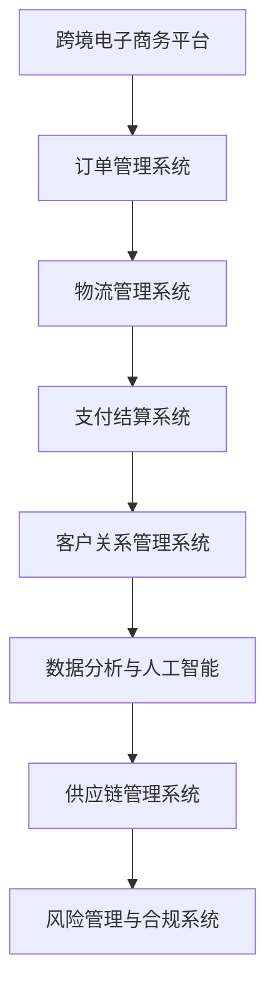

                 

关键词：跨境自动化、创业、机遇、挑战、技术、市场分析、商业模式、风险管理

> 摘要：本文将深入探讨跨境自动化创业的机遇与挑战，从市场需求、技术发展、商业模式、风险管理等多个角度进行分析，旨在为创业者提供有益的参考和指导。

## 1. 背景介绍

随着全球化的不断深入和互联网技术的飞速发展，跨境贸易日益繁荣。跨境自动化创业应运而生，成为当前创业领域的一个热门方向。跨境自动化创业指的是利用先进的互联网、大数据、人工智能等技术，实现跨境贸易流程的自动化、智能化，以提高效率和降低成本。

### 全球贸易现状
- **贸易规模不断扩大**：近年来，全球贸易总额持续增长，跨境电商成为推动贸易增长的重要力量。
- **跨境电商发展迅速**：随着消费者需求的多样化，跨境电商市场规模不断扩大，成为传统贸易的有力补充。

### 技术发展趋势
- **互联网技术普及**：互联网技术的普及为跨境自动化提供了基础条件。
- **大数据和人工智能**：大数据和人工智能技术的应用，使得跨境自动化创业具备了技术保障。

## 2. 核心概念与联系

### 跨境自动化创业核心概念
- **跨境电子商务**：利用互联网和电子支付手段进行的跨国商品和服务交易。
- **自动化技术**：包括人工智能、大数据、云计算等技术，用于优化和简化跨境贸易流程。

### 跨境自动化创业架构



## 3. 核心算法原理 & 具体操作步骤

### 3.1 算法原理概述

跨境自动化创业的核心算法主要包括订单处理、物流跟踪、支付结算、客户服务和风险控制等。

### 3.2 算法步骤详解

#### 3.2.1 订单处理

1. 客户下单：客户在电子商务平台上提交订单。
2. 订单验证：系统验证订单的合法性，包括商品库存、价格、库存等。
3. 订单分配：将订单分配给相应的仓库或供应商。

#### 3.2.2 物流跟踪

1. 发货：根据订单信息，将商品发货至物流公司。
2. 运输跟踪：实时监控商品的运输状态，确保物流的准确性。
3. 退货处理：如果出现退货，系统将自动处理退货流程。

#### 3.2.3 支付结算

1. 支付请求：客户发起支付请求。
2. 支付验证：系统验证支付请求的合法性。
3. 资金结算：完成支付，将资金转入商家账户。

#### 3.2.4 客户服务

1. 客户咨询：系统自动回复客户的常见问题。
2. 投诉处理：对客户的投诉进行分类和处理。
3. 售后服务：提供售后服务，确保客户满意度。

#### 3.2.5 风险控制

1. 风险识别：通过大数据分析，识别潜在的风险。
2. 风险评估：对潜在风险进行评估和分类。
3. 风险应对：采取相应的措施，降低风险。

### 3.3 算法优缺点

#### 优点
- **提高效率**：自动化技术可以大大提高跨境贸易的效率。
- **降低成本**：自动化技术可以降低人力资源的投入，从而降低成本。
- **提升客户满意度**：自动化技术可以提高客户服务的质量和效率。

#### 缺点
- **技术依赖**：自动化技术对技术的依赖性较高，一旦技术出现故障，可能会影响整个业务的运行。
- **数据安全**：跨境自动化涉及大量数据的传输和处理，数据安全问题需要高度重视。

### 3.4 算法应用领域

跨境自动化创业的核心算法可以广泛应用于跨境电商、跨境电商物流、跨境电商支付、跨境电商客户服务等领域。

## 4. 数学模型和公式 & 详细讲解 & 举例说明

### 4.1 数学模型构建

跨境自动化创业的数学模型主要包括订单处理模型、物流跟踪模型、支付结算模型、客户服务模型和风险控制模型。

### 4.2 公式推导过程

以订单处理模型为例，其基本公式为：

\[ P = R \times (1 - D) \]

其中，\( P \) 表示订单处理成功率，\( R \) 表示订单验证通过率，\( D \) 表示订单验证失败率。

### 4.3 案例分析与讲解

假设某跨境电商平台，其订单验证通过率为 \( 90\% \)，订单验证失败率为 \( 10\% \)。根据公式，其订单处理成功率为：

\[ P = 0.9 \times (1 - 0.1) = 0.81 \]

这意味着该平台的订单处理成功率为 \( 81\% \)。

## 5. 项目实践：代码实例和详细解释说明

### 5.1 开发环境搭建

假设使用 Python 进行跨境自动化创业项目的开发，需要安装以下环境：

- Python 3.8+
- Django 框架
- Redis 数据库
- Docker 容器化工具

### 5.2 源代码详细实现

以下是订单处理模块的简单示例代码：

```python
from django.http import HttpResponse
from redis import Redis

# 初始化 Redis 客户端
redis_client = Redis(host='localhost', port=6379, db=0)

def process_order(order_id):
    # 检查订单是否存在
    order_key = f"order:{order_id}"
    order = redis_client.get(order_key)
    
    if order:
        # 订单已处理
        return HttpResponse("Order already processed.")
    
    # 订单验证
    if validate_order(order):
        # 订单验证通过
        redis_client.set(order_key, "processed")
        return HttpResponse("Order processed successfully.")
    else:
        # 订单验证失败
        return HttpResponse("Order validation failed.")

def validate_order(order):
    # 订单验证逻辑
    # 这里只是一个示例，实际中需要根据订单的具体信息进行验证
    return True
```

### 5.3 代码解读与分析

上述代码实现了订单处理的基本逻辑，主要包括以下步骤：

1. 初始化 Redis 客户端。
2. 根据订单 ID 检查订单是否已处理。
3. 如果订单已处理，返回处理成功的响应。
4. 如果订单未处理，进行订单验证。
5. 如果订单验证通过，将订单标记为已处理，并返回处理成功的响应。
6. 如果订单验证失败，返回验证失败的响应。

### 5.4 运行结果展示

当用户访问 `/process_order/1` 接口时，如果订单 1 未处理，系统将返回“Order processed successfully.”；如果订单 1 已处理，系统将返回“Order already processed.”。

## 6. 实际应用场景

### 6.1 跨境电商

跨境自动化创业在跨境电商中的应用最为广泛，包括订单处理、物流跟踪、支付结算、客户服务和风险控制等。

### 6.2 跨境物流

跨境自动化创业在跨境物流中的应用，可以提高物流效率，降低物流成本，包括运输调度、货物跟踪、库存管理等。

### 6.3 跨境支付

跨境自动化创业在跨境支付中的应用，可以提高支付效率，降低支付风险，包括支付请求处理、支付验证、支付结算等。

### 6.4 跨境客户服务

跨境自动化创业在跨境客户服务中的应用，可以提高客户服务效率，提升客户满意度，包括客户咨询、投诉处理、售后服务等。

## 7. 工具和资源推荐

### 7.1 学习资源推荐

- 《Python Web开发实战》
- 《Django实战》
- 《人工智能：一种现代方法》
- 《大数据之路：阿里巴巴大数据实践》

### 7.2 开发工具推荐

- Python 3.8+
- Django 框架
- Redis 数据库
- Docker 容器化工具

### 7.3 相关论文推荐

- "A Survey on Cross-Border E-commerce and Its Impact on Global Trade"
- "The Impact of Artificial Intelligence on Cross-Border E-commerce"
- "Big Data Analytics in Cross-Border E-commerce: Opportunities and Challenges"

## 8. 总结：未来发展趋势与挑战

### 8.1 研究成果总结

跨境自动化创业已经成为当前创业领域的一个热点方向，其在跨境电商、跨境物流、跨境支付、跨境客户服务等领域取得了显著成果。

### 8.2 未来发展趋势

- **技术持续创新**：随着人工智能、大数据、区块链等技术的不断发展，跨境自动化创业将迎来更多的技术突破。
- **应用场景扩大**：跨境自动化创业将在更多领域得到应用，如跨境教育、跨境医疗、跨境金融等。
- **产业链整合**：跨境自动化创业将推动产业链的整合，实现从生产、物流、支付到客户服务的全面自动化。

### 8.3 面临的挑战

- **技术挑战**：跨境自动化创业需要面对技术复杂度高、技术更新快等挑战。
- **数据安全**：跨境自动化创业涉及大量数据的传输和处理，数据安全问题需要高度重视。
- **政策法规**：跨境自动化创业需要遵守各国政策法规，面临政策法规变化的挑战。

### 8.4 研究展望

跨境自动化创业在未来将继续保持快速发展，其在技术、应用、产业等多个层面都将取得新的突破。同时，跨境自动化创业也将面临更多的挑战，需要创业者、研究者和政策制定者共同努力，推动跨境自动化创业的健康发展。

## 9. 附录：常见问题与解答

### 9.1 跨境自动化创业的主要难点是什么？

跨境自动化创业的主要难点包括技术复杂度、数据安全、政策法规等。

### 9.2 跨境自动化创业需要哪些技术支持？

跨境自动化创业需要的技术支持包括人工智能、大数据、云计算、区块链等。

### 9.3 跨境自动化创业的未来发展趋势是什么？

跨境自动化创业的未来发展趋势包括技术持续创新、应用场景扩大、产业链整合等。

---

### 作者署名

> 作者：禅与计算机程序设计艺术 / Zen and the Art of Computer Programming

---

本文通过深入探讨跨境自动化创业的机遇与挑战，旨在为创业者提供有益的参考和指导。跨境自动化创业具有广阔的市场前景和巨大的发展潜力，但同时也面临着技术、数据安全、政策法规等多方面的挑战。未来，随着技术的不断进步和应用场景的扩大，跨境自动化创业将继续保持快速发展。希望本文能够为创业者带来一些启示，助力他们在跨境自动化创业的道路上取得成功。

