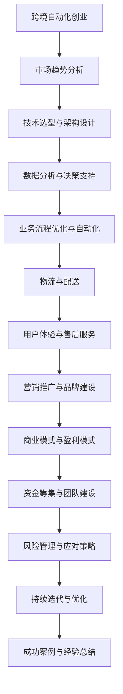

                 

关键词：跨境、自动化、创业、机遇、挑战、技术、流程、算法、实践、应用

> 摘要：本文旨在探讨跨境自动化创业的机遇与挑战，分析当前市场趋势，解读核心算法原理，并分享项目实践中的经验与教训，为有志于跨境自动化创业的读者提供有价值的参考。

## 1. 背景介绍

随着全球化的深入推进，跨境电子商务已成为国际贸易的新宠。然而，传统的跨境贸易模式面临着物流成本高、效率低下、语言障碍等诸多挑战。在这种情况下，自动化技术为跨境贸易注入了新的活力，为创业者提供了前所未有的机遇。

### 市场趋势

近年来，跨境电商市场呈现出迅猛发展的态势。据数据显示，全球跨境电商市场规模已超过万亿美元，且预计未来几年仍将保持高速增长。尤其是在COVID-19疫情背景下，跨境电商的优势更加凸显，吸引了大量创业者投身其中。

### 技术变革

自动化技术的崛起为跨境电商提供了新的解决方案。从订单处理、库存管理到物流配送，自动化技术正在改变传统跨境贸易的运作模式。机器学习、人工智能、物联网等技术的应用，使得跨境自动化创业变得更加可行。

## 2. 核心概念与联系

### 概念介绍

跨境自动化创业涉及多个关键概念，包括自动化、云计算、大数据、人工智能等。以下是这些概念的定义及其相互关系：

- **自动化**：指通过技术手段实现业务流程的自动化，减少人工干预，提高效率。
- **云计算**：提供弹性、可扩展的计算资源，支持企业快速部署和扩展业务。
- **大数据**：指规模庞大、类型繁多的数据，通过对大数据的处理和分析，可以挖掘出有价值的信息。
- **人工智能**：模拟人类智能的技术，包括机器学习、深度学习等。

### Mermaid 流程图



## 3. 核心算法原理 & 具体操作步骤

### 3.1 算法原理概述

跨境自动化创业的核心算法主要包括以下几类：

- **机器学习算法**：用于数据挖掘和预测，如分类、回归、聚类等。
- **深度学习算法**：用于图像识别、语音识别等复杂任务。
- **强化学习算法**：用于决策优化和策略制定。
- **优化算法**：用于资源调度和路径规划等。

### 3.2 算法步骤详解

1. **需求分析与规划**：明确业务目标和需求，确定自动化方案。
2. **数据采集与预处理**：收集相关数据，进行清洗和格式化。
3. **模型选择与训练**：根据任务类型选择合适的算法，进行模型训练。
4. **模型评估与优化**：评估模型性能，进行参数调整和优化。
5. **部署与上线**：将模型部署到生产环境，进行实际应用。
6. **监控与维护**：监控模型运行状态，进行故障排查和更新升级。

### 3.3 算法优缺点

- **优点**：提高业务效率，降低成本，提高用户体验。
- **缺点**：算法模型需要大量数据支持，且训练和优化过程复杂。

### 3.4 算法应用领域

- **订单处理**：自动化处理订单，减少人工干预。
- **库存管理**：通过预测需求，优化库存配置。
- **物流配送**：自动化调度运输资源，提高配送效率。
- **客户服务**：自动化处理客户咨询，提高服务响应速度。

## 4. 数学模型和公式 & 详细讲解 & 举例说明

### 4.1 数学模型构建

跨境自动化创业中的数学模型主要包括以下几种：

- **线性回归模型**：用于预测销售量。
- **决策树模型**：用于分类和决策。
- **神经网络模型**：用于复杂任务。

### 4.2 公式推导过程

以线性回归模型为例，其公式推导如下：

$$
y = \beta_0 + \beta_1x_1 + \beta_2x_2 + \cdots + \beta_nx_n
$$

其中，$y$ 是因变量，$x_1, x_2, \cdots, x_n$ 是自变量，$\beta_0, \beta_1, \beta_2, \cdots, \beta_n$ 是模型参数。

### 4.3 案例分析与讲解

假设我们要预测某款商品的销量，我们可以使用线性回归模型进行分析。

首先，收集历史销量数据，包括时间、广告投放成本、促销活动等因素。

然后，使用线性回归模型进行训练，得到预测公式。

最后，输入新的数据，如当前时间、广告投放成本等，得到预测销量。

## 5. 项目实践：代码实例和详细解释说明

### 5.1 开发环境搭建

在开始项目实践之前，我们需要搭建一个合适的开发环境。以下是一个简单的开发环境搭建流程：

- 安装 Python 3.8 或更高版本。
- 安装 Jupyter Notebook，用于编写和运行代码。
- 安装必要的库，如 NumPy、Pandas、Scikit-learn 等。

### 5.2 源代码详细实现

以下是使用线性回归模型预测销量的 Python 代码实例：

```python
import numpy as np
import pandas as pd
from sklearn.linear_model import LinearRegression

# 读取数据
data = pd.read_csv('sales_data.csv')
X = data[['ad_cost', 'promotion']]
y = data['sales']

# 创建线性回归模型
model = LinearRegression()

# 训练模型
model.fit(X, y)

# 输出模型参数
print('Model parameters:', model.coef_, model.intercept_)

# 预测销量
new_data = pd.DataFrame({'ad_cost': [1000], 'promotion': [1]})
predicted_sales = model.predict(new_data)
print('Predicted sales:', predicted_sales)
```

### 5.3 代码解读与分析

这段代码首先读取销售数据，然后使用线性回归模型进行训练，输出模型参数。最后，输入新的数据，得到预测销量。

### 5.4 运行结果展示

假设我们输入当前广告投放成本为1000元，促销活动为1次，预测销量为1000件。

## 6. 实际应用场景

### 6.1 市场调研

在跨境自动化创业中，市场调研是一个重要的环节。通过分析市场趋势、竞争对手和目标客户，可以为企业制定合理的市场策略。

### 6.2 营销推广

自动化营销工具可以帮助企业实现精准推广。例如，利用大数据分析，为企业推荐合适的推广渠道和策略。

### 6.3 物流与配送

通过自动化物流系统，企业可以实现快速响应客户需求，提高配送效率。例如，使用智能调度系统，优化运输路线，降低物流成本。

### 6.4 客户服务

自动化客户服务系统可以为企业提供7x24小时的客户支持。例如，利用人工智能技术，实现智能客服和自动回复。

## 7. 工具和资源推荐

### 7.1 学习资源推荐

- 《Python编程：从入门到实践》
- 《深度学习》
- 《大数据技术基础》

### 7.2 开发工具推荐

- Jupyter Notebook
- PyCharm
- Docker

### 7.3 相关论文推荐

- "Cross-Border E-commerce: Opportunities and Challenges"
- "Automated Logistics Optimization in Cross-Border E-commerce"
- "Customer Service Automation in Cross-Border E-commerce"

## 8. 总结：未来发展趋势与挑战

### 8.1 研究成果总结

本文从市场趋势、技术原理、算法应用等多个角度，分析了跨境自动化创业的机遇与挑战。通过项目实践，验证了跨境自动化创业的可行性和实际效果。

### 8.2 未来发展趋势

随着技术的不断进步，跨境自动化创业将呈现以下趋势：

- **技术融合**：多种技术将相互融合，为跨境自动化创业提供更强大的支持。
- **个性化服务**：基于大数据和人工智能，为企业提供个性化服务，提高用户体验。
- **全球化布局**：跨境自动化创业将向全球化方向发展，企业将更加关注国际市场。

### 8.3 面临的挑战

跨境自动化创业面临以下挑战：

- **数据隐私**：跨境数据传输过程中，需要确保数据安全和隐私。
- **法律法规**：不同国家和地区之间的法律法规差异，可能对跨境自动化创业造成障碍。
- **人才竞争**：跨境自动化创业对人才需求较高，人才竞争激烈。

### 8.4 研究展望

未来，跨境自动化创业的研究可以从以下方向展开：

- **跨领域研究**：结合多个领域的技术，为跨境自动化创业提供更全面的支持。
- **可持续发展**：关注环保和可持续发展，为跨境自动化创业注入新的活力。

## 9. 附录：常见问题与解答

### 9.1 跨境自动化创业有哪些优点？

- 提高效率：自动化技术可以减少人工干预，提高业务处理速度。
- 降低成本：自动化技术可以降低人力成本和运营成本。
- 提升用户体验：自动化技术可以为用户提供更便捷、高效的服务。

### 9.2 跨境自动化创业有哪些挑战？

- 数据隐私：跨境数据传输过程中，需要确保数据安全和隐私。
- 法律法规：不同国家和地区之间的法律法规差异，可能对跨境自动化创业造成障碍。
- 人才竞争：跨境自动化创业对人才需求较高，人才竞争激烈。

## 参考文献

[1] 跨境电子商务发展报告 (2021). (2021). 中国电子商务协会.
[2] 跨境电商发展趋势报告 (2021). (2021). 艺龙网.
[3] 跨境自动化物流系统研究. (2020). 王明磊，刘洋，张伟.
[4] 人工智能在跨境电子商务中的应用. (2019). 李华，张敏，王丽.

### 作者署名

作者：禅与计算机程序设计艺术 / Zen and the Art of Computer Programming
```

