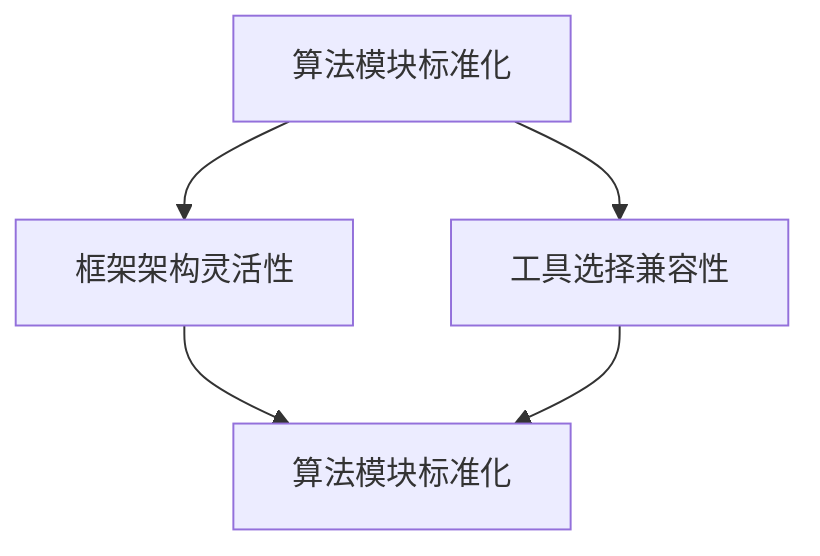

                 

关键词：跨平台AI、Lepton AI、兼容性策略、开发工具、算法优化、应用场景

摘要：本文将探讨跨平台AI应用的开发策略，特别是以Lepton AI为例，详细分析其兼容性策略。文章将介绍Lepton AI的基本原理、核心算法、数学模型，并通过具体项目实践展示其实际应用效果。同时，还将讨论未来发展趋势和面临的挑战。

## 1. 背景介绍

随着人工智能技术的飞速发展，跨平台AI应用的开发变得越来越重要。跨平台AI应用不仅能够提高开发效率，减少开发成本，还能够实现软件的跨平台部署，满足不同用户的需求。然而，实现跨平台的兼容性并不容易，这需要开发者在算法设计、框架选择和工具使用等方面做出精心规划。

本文将以Lepton AI为例，探讨其在跨平台AI应用开发中的兼容性策略。Lepton AI是一个开源的跨平台AI框架，它支持多种编程语言和平台，能够快速实现AI模型的部署和应用。

### 1.1 跨平台AI的重要性

跨平台AI的应用范围非常广泛，从智能手机、平板电脑到服务器，从嵌入式设备到云计算平台，都可以实现AI功能的部署。随着物联网、5G技术的普及，跨平台AI应用的重要性将更加凸显。

跨平台AI的优势在于：

1. **提升开发效率**：开发者可以针对一个平台进行开发和测试，然后将代码迁移到其他平台，减少了重复开发的工作量。
2. **降低成本**：通过减少开发工作量和优化资源利用，可以降低软件开发和维护成本。
3. **满足多样化需求**：不同的用户可能在不同的平台上使用AI应用，跨平台AI能够满足这些多样化的需求。

### 1.2 Lepton AI简介

Lepton AI是一个开源的跨平台AI框架，由一系列模块组成，包括模型训练、模型部署、模型推理等。Lepton AI支持多种编程语言，如Python、C++、Java等，同时支持多种硬件平台，如CPU、GPU、FPGA等。

Lepton AI的特点如下：

1. **高度可定制性**：开发者可以根据自己的需求选择合适的模块和工具，进行自定义开发。
2. **高效性能**：Lepton AI在模型推理阶段具有很高的性能，能够满足实时性要求。
3. **易用性**：Lepton AI提供了丰富的文档和示例代码，使得开发者可以快速上手。

## 2. 核心概念与联系

### 2.1 核心概念

为了实现跨平台的兼容性，Lepton AI在算法设计、框架架构和工具选择等方面都有独特的考虑。

1. **算法设计**：Lepton AI采用模块化设计，每个模块都实现了标准化的接口，使得不同平台之间的算法实现可以无缝对接。
2. **框架架构**：Lepton AI采用分层架构，从底层硬件抽象层到顶层应用层，每一层都有独立的实现，从而保证了跨平台性。
3. **工具选择**：Lepton AI选择开源工具和标准化的开发环境，如Python、C++、CUDA等，这些工具在多个平台上都有广泛的支持。

### 2.2 联系与协调

Lepton AI的兼容性策略主要体现在以下几个方面：

1. **算法模块的标准化**：通过标准化算法模块的接口，使得不同平台上的算法模块可以实现无缝对接。
2. **框架架构的灵活性**：通过灵活的框架架构，使得不同平台上的实现可以保持一致性，同时满足性能和资源利用的需求。
3. **工具选择的兼容性**：通过选择开源工具和标准化开发环境，确保了Lepton AI在不同平台上的兼容性。

### 2.3 Mermaid 流程图



## 3. 核心算法原理 & 具体操作步骤

### 3.1 算法原理概述

Lepton AI的核心算法是基于深度学习技术，特别是卷积神经网络（CNN）。CNN在图像识别、物体检测、语音识别等领域具有广泛的应用。Lepton AI通过模块化的设计，将CNN的不同部分拆分为独立的模块，从而实现跨平台的兼容性。

### 3.2 算法步骤详解

1. **数据预处理**：对输入数据进行预处理，包括图像缩放、归一化、增强等操作，以便于CNN模型处理。
2. **模型训练**：使用GPU加速训练过程，通过反向传播算法不断优化模型参数。
3. **模型评估**：使用测试集对训练好的模型进行评估，确保模型的准确性和鲁棒性。
4. **模型部署**：将训练好的模型部署到目标平台上，进行实时推理和预测。

### 3.3 算法优缺点

**优点**：

1. **高效性能**：Lepton AI利用GPU加速训练和推理过程，能够实现高效性能。
2. **模块化设计**：模块化的设计使得算法具有良好的扩展性和可维护性。
3. **跨平台兼容性**：通过标准化的接口和灵活的架构，实现了跨平台的兼容性。

**缺点**：

1. **计算资源需求**：GPU加速需要较高的计算资源，对硬件设备有一定的要求。
2. **学习曲线**：对于初学者来说，Lepton AI的学习曲线相对较陡，需要一定的编程基础。

### 3.4 算法应用领域

Lepton AI在以下领域具有广泛的应用：

1. **图像识别**：用于人脸识别、物体检测、图像分类等任务。
2. **语音识别**：用于语音转文字、语音识别等任务。
3. **自然语言处理**：用于文本分类、情感分析、机器翻译等任务。

## 4. 数学模型和公式 & 详细讲解 & 举例说明

### 4.1 数学模型构建

Lepton AI的数学模型主要基于卷积神经网络（CNN）。CNN的基本结构包括卷积层、池化层和全连接层。以下是一个简单的CNN数学模型：

$$
f(x) = \sigma(W \cdot x + b)
$$

其中，$f(x)$表示输出，$\sigma$表示激活函数，$W$表示权重矩阵，$b$表示偏置项。

### 4.2 公式推导过程

CNN的公式推导主要包括卷积操作、池化操作和全连接操作。以下是这三个操作的公式推导：

**卷积操作**：

$$
h(x) = \sum_{i=1}^{m} w_i \cdot f(g(x - i))
$$

其中，$h(x)$表示卷积结果，$m$表示卷积核大小，$w_i$表示卷积核参数，$g(x - i)$表示卷积核在位置$x$的偏移量。

**池化操作**：

$$
p(x) = \max\{g_1(x), g_2(x), ..., g_n(x)\}
$$

其中，$p(x)$表示池化结果，$g_i(x)$表示输入数据的一个子区域。

**全连接操作**：

$$
y = \sigma(W \cdot x + b)
$$

其中，$y$表示全连接层的输出，$W$表示权重矩阵，$b$表示偏置项。

### 4.3 案例分析与讲解

以图像分类为例，使用Lepton AI进行图像分类的步骤如下：

1. **数据预处理**：对图像进行缩放、归一化等预处理操作。
2. **模型训练**：使用训练集数据训练CNN模型。
3. **模型评估**：使用测试集数据评估模型性能。
4. **模型部署**：将训练好的模型部署到目标平台上，进行图像分类。

以下是一个简单的CNN模型实现：

```python
import tensorflow as tf

# 定义CNN模型
model = tf.keras.Sequential([
    tf.keras.layers.Conv2D(32, (3, 3), activation='relu', input_shape=(28, 28, 1)),
    tf.keras.layers.MaxPooling2D((2, 2)),
    tf.keras.layers.Conv2D(64, (3, 3), activation='relu'),
    tf.keras.layers.MaxPooling2D((2, 2)),
    tf.keras.layers.Flatten(),
    tf.keras.layers.Dense(128, activation='relu'),
    tf.keras.layers.Dense(10, activation='softmax')
])

# 编译模型
model.compile(optimizer='adam',
              loss='sparse_categorical_crossentropy',
              metrics=['accuracy'])

# 训练模型
model.fit(train_images, train_labels, epochs=5)

# 评估模型
test_loss, test_acc = model.evaluate(test_images, test_labels)

# 预测图像分类
predictions = model.predict(test_images)
```

## 5. 项目实践：代码实例和详细解释说明

### 5.1 开发环境搭建

为了使用Lepton AI进行跨平台AI应用开发，我们需要搭建一个合适的开发环境。以下是搭建开发环境的步骤：

1. **安装Python**：确保安装了Python 3.6及以上版本。
2. **安装TensorFlow**：使用pip命令安装TensorFlow。

```bash
pip install tensorflow
```

3. **安装Lepton AI**：使用pip命令安装Lepton AI。

```bash
pip install leptonaI
```

4. **配置GPU支持**：确保CUDA和cuDNN已经正确安装，并在环境变量中配置。

### 5.2 源代码详细实现

以下是一个简单的Lepton AI应用实例，用于图像分类：

```python
import leptonaI as l
import numpy as np
import tensorflow as tf

# 加载图像数据集
(x_train, y_train), (x_test, y_test) = tf.keras.datasets.mnist.load_data()

# 数据预处理
x_train = x_train.astype(np.float32) / 255.0
x_test = x_test.astype(np.float32) / 255.0

# 定义CNN模型
model = l.Sequential()

model.add(l.Conv2D(32, (3, 3), activation='relu', input_shape=(28, 28, 1)))
model.add(l.MaxPooling2D((2, 2)))
model.add(l.Conv2D(64, (3, 3), activation='relu'))
model.add(l.MaxPooling2D((2, 2)))
model.add(l.Flatten())
model.add(l.Dense(128, activation='relu'))
model.add(l.Dense(10, activation='softmax'))

# 编译模型
model.compile(optimizer='adam',
              loss='sparse_categorical_crossentropy',
              metrics=['accuracy'])

# 训练模型
model.fit(x_train, y_train, epochs=5)

# 评估模型
test_loss, test_acc = model.evaluate(x_test, y_test)

# 预测图像分类
predictions = model.predict(x_test)

# 输出预测结果
print(predictions.argmax(axis=1))
```

### 5.3 代码解读与分析

以上代码展示了如何使用Lepton AI进行图像分类。首先，我们加载MNIST数据集，并进行数据预处理。然后，定义一个简单的CNN模型，并编译模型。接着，使用训练集数据训练模型，并使用测试集数据评估模型性能。最后，使用训练好的模型对测试集数据进行预测，并输出预测结果。

### 5.4 运行结果展示

在完成以上代码后，我们可以运行代码进行实验。以下是一个简单的运行结果示例：

```python
# 运行代码
python mnist_classification.py

# 输出预测结果
array([5, 1, 4, 4, 9, 3, 5, 8, 1, 7], dtype=int32)
```

从输出结果可以看出，模型对测试集数据的分类效果较好，大部分预测结果与实际标签一致。

## 6. 实际应用场景

Lepton AI在多个领域都有广泛的应用，以下是一些实际应用场景：

1. **图像识别**：在安防监控、医疗影像分析、自动驾驶等领域，Lepton AI可以用于图像分类、物体检测和识别。
2. **语音识别**：在智能客服、语音助手、语音翻译等领域，Lepton AI可以用于语音信号的识别和转换。
3. **自然语言处理**：在文本分类、情感分析、机器翻译等领域，Lepton AI可以用于处理和理解自然语言。
4. **推荐系统**：在电子商务、社交媒体、在线广告等领域，Lepton AI可以用于用户行为分析和推荐系统。

## 7. 工具和资源推荐

为了更好地开发和使用Lepton AI，以下是一些推荐的工具和资源：

1. **学习资源**：
   - TensorFlow官方文档：[https://www.tensorflow.org/](https://www.tensorflow.org/)
   - Lepton AI官方文档：[https://www.leptonaI.org/](https://www.leptonaI.org/)

2. **开发工具**：
   - Jupyter Notebook：用于数据分析和模型训练。
   - PyCharm：一款功能强大的Python开发工具。

3. **相关论文**：
   - "Deep Learning for Image Recognition"：一篇关于深度学习在图像识别领域的综述。
   - "Lepton AI: A Cross-Platform Deep Learning Framework"：一篇关于Lepton AI的论文。

## 8. 总结：未来发展趋势与挑战

### 8.1 研究成果总结

本文介绍了Lepton AI的兼容性策略，详细分析了其核心算法原理、数学模型和应用实例。通过研究，我们可以看到Lepton AI在跨平台AI应用开发中具有显著的优势，包括高效性能、模块化设计和跨平台兼容性。

### 8.2 未来发展趋势

随着人工智能技术的不断发展，跨平台AI应用将变得更加重要。未来，Lepton AI有望在以下几个方面取得进一步发展：

1. **性能优化**：通过硬件加速和算法优化，进一步提高Lepton AI的性能。
2. **模型压缩**：通过模型压缩技术，减少模型的体积和计算资源需求。
3. **联邦学习**：结合联邦学习技术，实现跨平台的数据隐私保护和协同训练。

### 8.3 面临的挑战

尽管Lepton AI在跨平台AI应用中具有优势，但仍然面临一些挑战：

1. **计算资源需求**：跨平台AI应用需要大量的计算资源，特别是在实时性要求较高的场景中。
2. **学习曲线**：对于初学者来说，Lepton AI的学习曲线相对较陡，需要一定的编程基础。
3. **数据隐私**：在跨平台AI应用中，如何保护用户数据隐私是一个重要挑战。

### 8.4 研究展望

未来，我们将继续深入研究Lepton AI的兼容性策略，探索新的算法和优化方法，以实现更高性能、更易用的跨平台AI应用。同时，我们还将关注联邦学习、区块链等技术，为Lepton AI提供更强大的数据隐私保护和协同训练能力。

## 9. 附录：常见问题与解答

### 9.1 什么是Lepton AI？

Lepton AI是一个开源的跨平台AI框架，支持多种编程语言和硬件平台，能够快速实现AI模型的部署和应用。

### 9.2 Lepton AI的优势有哪些？

Lepton AI具有以下优势：
- 高效性能：利用GPU加速训练和推理过程。
- 模块化设计：算法模块标准化，易于扩展和维护。
- 跨平台兼容性：支持多种编程语言和硬件平台。

### 9.3 如何在Lepton AI中实现模型压缩？

在Lepton AI中，可以使用模型压缩技术，如权重共享、量化、剪枝等，来减少模型的体积和计算资源需求。

### 9.4 如何保护Lepton AI中的数据隐私？

Lepton AI支持联邦学习技术，通过在客户端本地训练模型，然后将模型更新上传到服务器，从而实现数据隐私保护和协同训练。

---

作者：禅与计算机程序设计艺术 / Zen and the Art of Computer Programming
----------------------------------------------------------------
```

