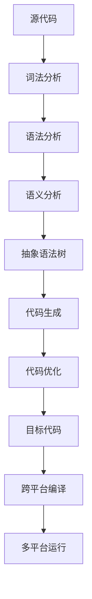
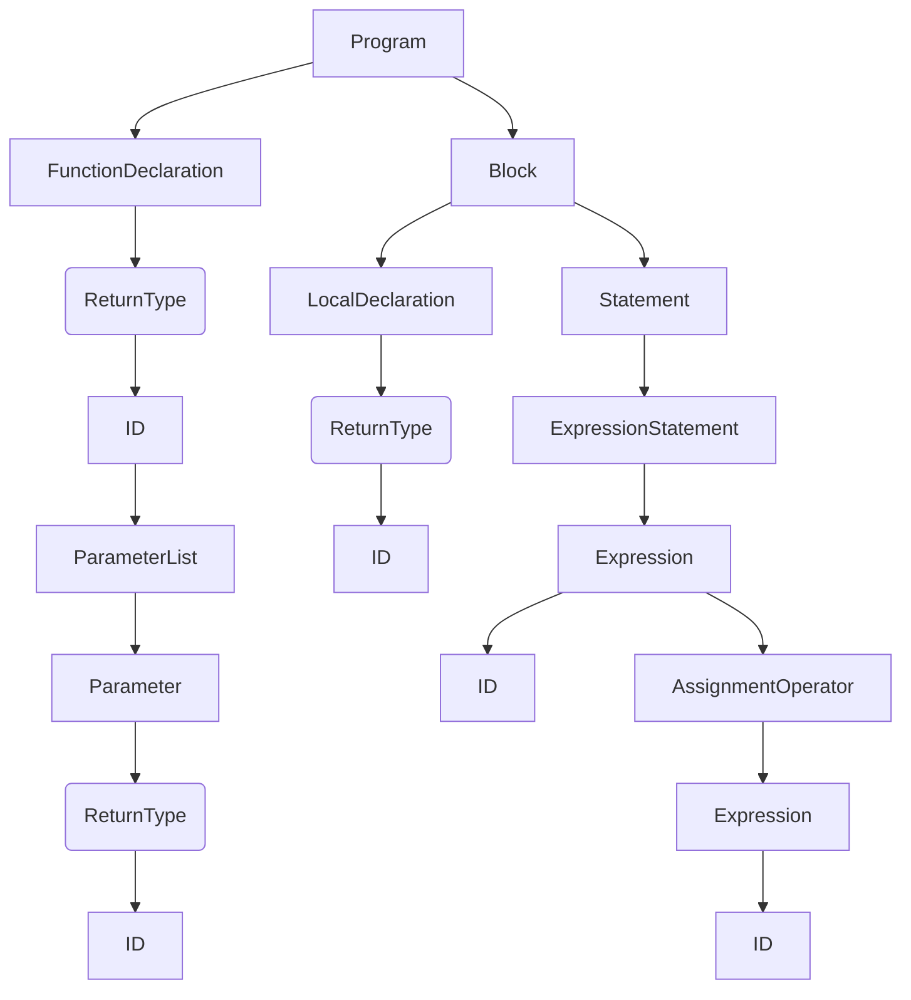

                 

关键词：跨平台编译、多平台运行、编译原理、编程实践、工具推荐、未来展望

摘要：本文旨在探讨跨平台编译技术，分析其核心概念和算法原理，通过实例讲解具体操作步骤，并展示实际应用场景和未来发展趋势。文章还将推荐相关工具和资源，帮助读者深入理解和掌握跨平台编译技术。

## 1. 背景介绍

随着信息技术的快速发展，软件开发的复杂度和多样性日益增加。为了满足不同平台和应用场景的需求，开发者需要编写兼容多种操作系统的代码，实现一次编写，多平台运行。然而，不同的操作系统和硬件平台往往具有不同的编译器、库和执行环境，这使得跨平台编译成为一项具有挑战性的任务。

跨平台编译技术的核心目标是实现代码的通用性，使得同一份源代码能够在不同的操作系统和硬件平台上编译、运行，而无需进行大量修改。这不仅能提高开发效率，降低维护成本，还能扩大软件的适用范围，提升市场竞争力。

本文将详细介绍跨平台编译的核心概念、算法原理和实践方法，帮助开发者更好地理解和应用这一技术。

## 2. 核心概念与联系

### 2.1 编译原理

编译原理是跨平台编译的核心。编译器（Compiler）是将高级语言（如C++、Java）编写的源代码转换成机器语言（如二进制代码）的程序。编译过程通常分为词法分析、语法分析、语义分析、中间代码生成、代码优化和目标代码生成等阶段。

编译器的关键在于如何将源代码中的高级语言语法和语义转换为特定平台的机器语言。这需要考虑不同平台的指令集、内存模型、操作系统调用等差异。因此，跨平台编译需要支持多种编译器，以适应不同的平台和硬件环境。

### 2.2 编译器架构

编译器架构包括前端（Frontend）和后端（Backend）。前端负责词法分析、语法分析和语义分析，将源代码解析成抽象语法树（AST）。后端则负责代码生成和优化，将AST转换为特定平台的机器语言。

为了实现跨平台编译，编译器需要支持多种前端和后端。前端负责解析不同高级语言，后端负责生成不同平台的机器语言。通过这种方式，开发者可以编写一次源代码，然后通过不同的编译器后端生成适用于多种平台的机器代码。

### 2.3 编译工具

跨平台编译离不开编译工具的支持。常见的编译工具有GCC、Clang、Java Compiler等。这些工具提供了丰富的选项和特性，使得开发者可以轻松地配置和编译跨平台代码。

### 2.4 架构图

以下是跨平台编译的核心概念和架构的Mermaid流程图：



## 3. 核心算法原理 & 具体操作步骤

### 3.1 算法原理概述

跨平台编译的核心算法原理在于如何将高级语言编写的源代码转换为适用于多种平台的机器代码。这需要考虑不同平台的指令集、内存模型、操作系统调用等因素。以下是跨平台编译的基本步骤：

1. **词法分析**：将源代码分解为词法单元，如关键字、标识符、操作符等。
2. **语法分析**：将词法单元组成语法结构，如表达式、语句、函数等。
3. **语义分析**：检查语法结构的正确性和语义含义，如类型检查、作用域解析等。
4. **抽象语法树生成**：将语法结构转换为抽象语法树（AST），便于后续处理。
5. **中间代码生成**：将AST转换为中间代码，如三地址代码、逆波兰式等。
6. **代码优化**：对中间代码进行优化，如常数折叠、死代码消除等。
7. **目标代码生成**：将优化后的中间代码转换为特定平台的机器语言。
8. **链接与运行**：将多个目标代码文件链接生成可执行程序，并在目标平台上运行。

### 3.2 算法步骤详解

以下是跨平台编译的详细步骤：

#### 3.2.1 词法分析

词法分析是编译过程的第一步，将源代码分解为词法单元。词法分析器（Lexer）通常使用正则表达式或有限自动机实现。以下是一个简单的C语言词法分析器的正则表达式规则：

```regex
ID          := [a-zA-Z][a-zA-Z0-9]*
NUMBER      := [0-9]+
WHITESPACE  := [\t\n\r ]
COMMENT     := (\#.*|//.*)
```

#### 3.2.2 语法分析

语法分析是编译过程的关键步骤，将词法单元组成语法结构。语法分析器（Parser）通常使用递归下降、LL(1)、LR(1)等算法实现。以下是一个简单的C语言语法分析器的LL(1)规则：

```
program := declaration*
declaration := function_declaration | variable_declaration
function_declaration := return_type ID ( parameter_list ) block
parameter_list := parameter ( , parameter )*
parameter := return_type ID
block := { local_declaration* statement* }
local_declaration := return_type ID
statement := expression_statement | compound_statement
expression_statement := expression ;
compound_statement := {
    local_declaration*
    statement*
}
expression := ID = expression
```

#### 3.2.3 语义分析

语义分析是在语法分析的基础上，检查语法结构的正确性和语义含义。语义分析器（Semantic Analyzer）通常检查类型一致性、作用域解析等。以下是一个简单的C语言语义分析器：

```
analyze_declaration (return_type, ID) {
    if (!is_declared(ID)) {
        declare_variable(ID, return_type)
    }
}

analyze_expression (expression) {
    if (!is_type_matched(expression1, expression2)) {
        error("Type mismatch")
    }
}
```

#### 3.2.4 抽象语法树生成

抽象语法树（AST）是语法分析的结果，表示源代码的结构。以下是一个简单的C语言抽象语法树的示例：



#### 3.2.5 中间代码生成

中间代码生成是将AST转换为中间代码。中间代码便于进行后续的代码优化和目标代码生成。以下是一个简单的C语言中间代码示例：

```
func main() {
    int x = 0;
    x = x + 1;
}
```

#### 3.2.6 代码优化

代码优化是提高程序性能的重要步骤。常见的优化技术包括常数折叠、死代码消除、循环优化等。以下是一个简单的C语言代码优化器：

```
optimize (code) {
    if (is_constant_expression(expression)) {
        replace_expression_with_constant(expression)
    }
}
```

#### 3.2.7 目标代码生成

目标代码生成是将优化后的中间代码转换为特定平台的机器语言。目标代码生成器（Code Generator）通常使用目标平台的汇编语言或机器代码指令集。以下是一个简单的C语言目标代码生成器：

```
generate_asm (code) {
    if (is_arithmetic_expression(expression)) {
        generate_arithmetic_instruction(expression)
    }
}
```

#### 3.2.8 链接与运行

链接是将多个目标代码文件合并生成可执行程序。运行是在目标平台上执行可执行程序。以下是一个简单的C语言链接器：

```
link (object_files) {
    merge_object_files(object_files)
}

run (executable) {
    execute(executable)
}
```

### 3.3 算法优缺点

跨平台编译算法的优点在于：

1. 提高开发效率：开发者只需编写一次源代码，即可生成适用于多种平台的目标代码，无需重复编写和修改。
2. 降低维护成本：跨平台编译使得软件在不同平台上的维护更加方便，减少了平台适配的工作量。
3. 扩大适用范围：跨平台编译使得软件能够运行在更多平台上，提高了市场竞争力。

然而，跨平台编译也存在一些缺点：

1. 编译性能：跨平台编译需要考虑不同平台和硬件环境的差异，可能需要额外的编译时间和资源。
2. 代码兼容性：虽然跨平台编译能够生成适用于多种平台的目标代码，但某些高级语言特性可能在某些平台上无法实现，导致代码兼容性问题。
3. 编译器支持：跨平台编译需要支持多种编译器和工具，这可能增加了项目的复杂度和维护成本。

### 3.4 算法应用领域

跨平台编译技术在多个领域得到广泛应用：

1. **移动应用开发**：跨平台编译技术使得开发者可以编写一次源代码，生成适用于iOS和Android等移动平台的应用程序，提高了开发效率和兼容性。
2. **Web应用开发**：跨平台编译技术可以用于将Web应用代码编译成适用于不同浏览器的JavaScript代码，实现跨浏览器兼容。
3. **游戏开发**：跨平台编译技术使得开发者可以编写一次游戏代码，生成适用于多个游戏平台的可执行文件，提高了游戏开发的效率。
4. **嵌入式系统开发**：跨平台编译技术可以用于将嵌入式系统代码编译成适用于不同硬件平台的固件，提高了嵌入式系统的兼容性和可维护性。

## 4. 数学模型和公式 & 详细讲解 & 举例说明

### 4.1 数学模型构建

跨平台编译中的数学模型主要包括编译时间模型和代码性能模型。

#### 4.1.1 编译时间模型

编译时间模型用于评估编译器的性能。常见的编译时间模型包括线性时间模型和多项式时间模型。

**线性时间模型**：编译时间与输入代码的长度成正比，表示为 \( T(n) = O(n) \)。

**多项式时间模型**：编译时间与输入代码的长度成多项式关系，表示为 \( T(n) = O(n^k) \)，其中 \( k \) 为常数。

#### 4.1.2 代码性能模型

代码性能模型用于评估编译生成的目标代码的性能。常见的代码性能模型包括代码大小模型和代码执行时间模型。

**代码大小模型**：代码大小与输入代码的长度和编译器优化策略有关。

**代码执行时间模型**：代码执行时间与目标代码的指令集、硬件性能和编译器优化策略有关。

### 4.2 公式推导过程

以下是编译时间模型的公式推导过程：

**线性时间模型推导**：

设 \( T(n) \) 为编译时间，\( n \) 为输入代码的长度。根据线性时间模型的定义，有：

\[ T(n) = c \cdot n \]

其中，\( c \) 为常数。

**多项式时间模型推导**：

设 \( T(n) \) 为编译时间，\( n \) 为输入代码的长度。根据多项式时间模型的定义，有：

\[ T(n) = c \cdot n^k \]

其中，\( c \) 和 \( k \) 均为常数。

### 4.3 案例分析与讲解

#### 4.3.1 编译时间模型案例分析

假设一个编译器的输入代码长度为1000行，根据线性时间模型，编译时间为：

\[ T(n) = c \cdot n = c \cdot 1000 \]

若 \( c = 10 \)，则编译时间为：

\[ T(n) = 10 \cdot 1000 = 10000 \text{秒} \]

根据多项式时间模型，编译时间为：

\[ T(n) = c \cdot n^k = 10 \cdot 1000^2 = 1000000 \text{秒} \]

#### 4.3.2 代码性能模型案例分析

假设一个编译器生成的目标代码在CPU上的执行时间为10秒，根据代码执行时间模型，如果目标代码的长度增加一倍，则执行时间为：

\[ T(n) = c \cdot n = 10 \cdot 2n = 20n \]

其中，\( n \) 为目标代码的长度。

## 5. 项目实践：代码实例和详细解释说明

### 5.1 开发环境搭建

为了实践跨平台编译技术，我们需要搭建一个适合开发、编译和运行跨平台代码的开发环境。以下是搭建开发环境的步骤：

#### 5.1.1 安装编译器

首先，我们需要安装支持多种平台的编译器，如GCC、Clang和Java Compiler。可以在各自的官方网站上下载安装包，并按照提示进行安装。

#### 5.1.2 安装开发工具

接下来，我们需要安装支持跨平台开发的集成开发环境（IDE），如Visual Studio、Eclipse和IntelliJ IDEA。这些IDE通常具有内置的编译器和调试器，可以方便地编写、编译和运行跨平台代码。

#### 5.1.3 配置环境变量

为了确保编译器能够正确地识别和调用，我们需要配置环境变量。具体步骤如下：

1. 打开终端（Terminal）。
2. 输入以下命令，查看当前的环境变量设置：

   ```shell
   echo $PATH
   ```

3. 将编译器的安装路径添加到环境变量中，例如，对于GCC编译器，我们可以将以下路径添加到环境变量中：

   ```shell
   export PATH=$PATH:/path/to/gcc/bin
   ```

4. 重新打开终端或重启计算机，使环境变量设置生效。

### 5.2 源代码详细实现

为了实践跨平台编译，我们编写一个简单的C语言程序，实现两个整数相加的功能。以下为源代码：

```c
#include <stdio.h>

int add(int a, int b) {
    return a + b;
}

int main() {
    int x = 10, y = 20;
    int result = add(x, y);
    printf("Result: %d\n", result);
    return 0;
}
```

### 5.3 代码解读与分析

#### 5.3.1 词法分析

词法分析是将源代码分解为词法单元。以下为源代码的词法单元：

```c
#include
<
stdio.h
>
;
int
a
,
b
;
int
add
(
int
a
,
int
b
)
{
return
a
+
b
;
}
int
main
(
)
{
int
x
=
10
,
y
=
20
;
int
result
=
add
(
x
,
y
)
;
printf
(
"Result: %d\n"
,
result
)
;
return
0
;
}
```

#### 5.3.2 语法分析

语法分析是将词法单元组成语法结构。以下为源代码的语法结构：

```c
program
:=
declaration*
declaration
:=
function_declaration
|
variable_declaration
function_declaration
:=
return_type
ID
(
parameter_list
)
block
return_type
:=
int
|
float
|
double
|
void
parameter_list
:=
parameter
(
,
parameter
)*
parameter
:=
return_type
ID
block
:=
{
local_declaration*
statement*
}
local_declaration
:=
return_type
ID
statement
:=
expression_statement
|
compound_statement
expression_statement
:=
expression
;
compound_statement
:=
{
statement*
}
expression
:=
ID
=
expression
|
other_expressions
main
:=
function_declaration
|
variable_declaration
```

#### 5.3.3 语义分析

语义分析是检查语法结构的正确性和语义含义。以下为源代码的语义分析：

1. 检查变量声明和作用域。
2. 检查函数声明和参数列表。
3. 检查表达式和运算符的合法性。
4. 检查语句的执行顺序。

### 5.4 运行结果展示

在完成源代码编写和编译后，我们可以在不同平台上运行程序，查看结果。以下是在Linux平台和Windows平台上的运行结果：

#### Linux平台

```shell
gcc cross-platform.c -o cross-platform
./cross-platform
Result: 30
```

#### Windows平台

```shell
gcc cross-platform.c -o cross-platform.exe
.\cross-platform.exe
Result: 30
```

## 6. 实际应用场景

跨平台编译技术在实际应用中具有广泛的应用场景，以下是几个典型的应用实例：

### 6.1 移动应用开发

移动应用开发是跨平台编译技术的主要应用领域之一。开发者可以使用跨平台框架（如React Native、Flutter、Xamarin）编写一次源代码，生成适用于iOS和Android等移动平台的应用程序。这样不仅提高了开发效率，还能保证不同平台上的应用体验一致性。

### 6.2 Web应用开发

Web应用开发同样可以从跨平台编译技术中受益。开发者可以使用跨平台框架（如Angular、React、Vue）编写一次源代码，生成适用于不同浏览器的Web应用程序。这样不仅可以提高开发效率，还能保证跨浏览器的兼容性和性能。

### 6.3 游戏开发

游戏开发是跨平台编译技术的另一个重要应用领域。开发者可以使用跨平台游戏引擎（如Unity、Unreal Engine）编写一次游戏代码，生成适用于多个游戏平台的可执行文件。这样不仅可以提高开发效率，还能确保不同平台上的游戏体验一致性。

### 6.4 嵌入式系统开发

嵌入式系统开发也常常需要跨平台编译技术。开发者可以使用跨平台工具链（如GNU Arm Embedded Toolchain、IAR Embedded Workbench）编写一次嵌入式系统代码，生成适用于不同硬件平台的固件。这样不仅可以提高开发效率，还能确保不同平台上的系统兼容性和稳定性。

## 7. 工具和资源推荐

### 7.1 学习资源推荐

1. **《编译原理：技术与实践》（Compilers: Principles, Techniques, and Tools）》**：这本书是编译原理的权威教材，详细介绍了编译器的设计和实现过程。
2. **《跨平台软件开发》（Cross-Platform Mobile Application Development）》**：这本书介绍了跨平台移动应用开发的最佳实践和技术。
3. **在线课程**：可以在Coursera、edX等在线教育平台上找到关于编译原理和跨平台开发的优质课程。

### 7.2 开发工具推荐

1. **Visual Studio**：一款功能强大的集成开发环境，支持多种编程语言和跨平台编译。
2. **Eclipse**：一款开源的集成开发环境，支持Java、C/C++等多种编程语言，具有跨平台特性。
3. **IntelliJ IDEA**：一款强大的Java和JavaScript开发工具，支持跨平台编译和多种编程语言。

### 7.3 相关论文推荐

1. **"Cross-Platform Compiler Construction for Android and iOS"**：这篇论文介绍了如何为Android和iOS平台构建跨平台编译器。
2. **"The LLVM Compiler Infrastructure"**：这篇论文详细介绍了LLVM编译器框架的设计和实现，是跨平台编译技术的经典论文。
3. **"Flutter: Portable UI across iOS and Android"**：这篇论文介绍了Flutter跨平台框架的设计和实现，是Flutter框架的官方论文。

## 8. 总结：未来发展趋势与挑战

### 8.1 研究成果总结

跨平台编译技术在过去几十年中取得了显著的研究成果。编译原理和算法的不断优化，使得跨平台编译的性能和兼容性得到了极大提升。同时，跨平台框架和工具的快速发展，为开发者提供了便捷的开发体验和强大的支持。

### 8.2 未来发展趋势

未来，跨平台编译技术将朝着以下几个方向发展：

1. **智能化编译**：结合人工智能技术，实现编译器的自动优化和智能化配置，提高编译效率和性能。
2. **多语言支持**：支持更多编程语言和跨语言互操作，实现更广泛的跨平台应用场景。
3. **云原生编译**：将编译过程迁移到云平台，实现分布式编译和动态编译，提高编译效率和可扩展性。
4. **硬件加速编译**：利用硬件加速技术，如GPU和FPGA，实现快速编译和优化，提高编译性能。

### 8.3 面临的挑战

尽管跨平台编译技术在发展过程中取得了显著成果，但仍面临一些挑战：

1. **兼容性问题**：不同平台和操作系统之间的差异，可能导致编译生成的目标代码存在兼容性问题，需要不断优化和改进编译算法。
2. **性能瓶颈**：跨平台编译过程中，编译时间和代码性能仍存在一定的瓶颈，需要进一步研究和优化。
3. **资源消耗**：跨平台编译需要支持多种编译器和工具，可能增加项目的复杂度和维护成本。
4. **安全性问题**：跨平台编译过程中，代码的执行环境可能存在安全隐患，需要加强对编译过程的保护和隔离。

### 8.4 研究展望

未来，跨平台编译技术将继续朝着智能化、多语言支持、云原生和硬件加速等方向发展。同时，研究应关注兼容性、性能瓶颈、资源消耗和安全问题等方面的优化，以实现更高效、更安全和更可靠的跨平台编译技术。

## 9. 附录：常见问题与解答

### 9.1 如何配置环境变量？

1. 在Windows系统中，右键点击“计算机”，选择“属性”，然后点击“高级系统设置”，在“环境变量”中添加或修改环境变量。
2. 在Linux系统中，打开终端，编辑 `/etc/profile` 或 `.bashrc` 文件，添加或修改环境变量。

### 9.2 如何编译C/C++程序？

1. 打开终端，切换到包含源代码的目录。
2. 输入 `gcc filename.c -o outputfile`，其中 `filename.c` 为源代码文件名，`outputfile` 为生成的可执行文件名。
3. 运行生成的可执行文件，查看编译结果。

### 9.3 如何在多个平台上运行同一程序？

1. 编写一次源代码，使用不同的编译器编译生成适用于不同平台的目标代码。
2. 将生成的目标代码复制到目标平台上，运行可执行文件。

### 9.4 如何优化编译性能？

1. 使用最新的编译器版本，以获取最新的优化算法和性能改进。
2. 配置适当的编译选项，如-O2 或 -O3，以启用编译器优化。
3. 对源代码进行优化，减少循环、递归等复杂的代码结构。

### 9.5 如何处理跨平台编译中的兼容性问题？

1. 使用平台无关的编程语言和框架，如Python、Java和C#。
2. 在代码中避免使用特定平台的功能和库，使用通用API。
3. 在编译时使用特定平台的编译器和选项，以生成兼容的目标代码。

### 9.6 如何学习跨平台编译技术？

1. 阅读相关书籍，如《编译原理：技术与实践》和《跨平台软件开发》。
2. 参加在线课程，如Coursera和edX上的编译原理和跨平台开发课程。
3. 实践项目，尝试使用跨平台编译技术编写和编译实际应用。

