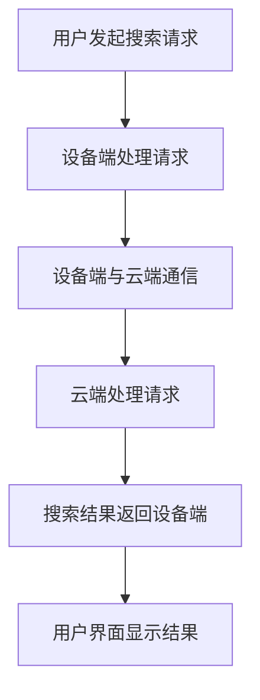

                 

关键字：跨设备搜索，AI，无缝体验，搜索同步，多设备同步，人工智能应用，技术架构

摘要：随着智能设备的普及，用户对于跨设备搜索同步的需求日益增长。本文将探讨如何通过人工智能技术实现跨设备搜索的无缝体验，并分析其核心概念、算法原理、数学模型、项目实践以及未来发展趋势。

## 1. 背景介绍

在当今数字化时代，智能设备的普及使得人们的生活更加便捷。智能手机、平板电脑、笔记本电脑等设备已经成为日常生活中不可或缺的工具。然而，用户往往需要在多个设备之间查找和获取信息，这引发了跨设备搜索同步的需求。跨设备搜索同步不仅要求用户能够在不同设备上找到相同的信息，还要求信息在多个设备之间能够实时更新，以提供无缝的体验。

人工智能技术的发展为跨设备搜索同步提供了新的可能。通过机器学习、自然语言处理和知识图谱等技术，AI能够更好地理解用户的需求，提供精准的搜索结果，并实现跨设备的实时同步。本文将深入探讨如何利用人工智能技术实现跨设备搜索同步，并分析其核心概念和算法原理。

## 2. 核心概念与联系

### 2.1 跨设备搜索同步的定义

跨设备搜索同步是指在多个智能设备之间实现搜索结果的无缝共享和更新。具体来说，它包括以下几个核心概念：

1. **设备识别**：识别用户使用的设备类型和设备标识。
2. **用户身份认证**：验证用户身份，确保搜索数据和同步过程的隐私安全。
3. **数据同步**：将用户在不同设备上的搜索数据和偏好同步到云端。
4. **搜索结果共享**：在多个设备上显示相同的搜索结果，并提供实时更新。

### 2.2 人工智能在跨设备搜索同步中的作用

人工智能技术能够在跨设备搜索同步中发挥重要作用，主要包括以下几个方面：

1. **个性化推荐**：基于用户的历史搜索行为和偏好，提供个性化的搜索结果。
2. **自然语言处理**：理解用户的搜索意图，提供自然语言交互。
3. **实时更新**：利用机器学习算法实现搜索结果在多个设备之间的实时同步。
4. **隐私保护**：通过加密技术和访问控制，确保用户数据的隐私和安全。

### 2.3 跨设备搜索同步的架构

跨设备搜索同步的架构可以分为三个主要部分：设备端、云端和用户界面。

1. **设备端**：负责搜索请求的发起和搜索结果的接收。设备端需要识别用户身份，并与云端进行通信。
2. **云端**：处理搜索请求，执行搜索算法，并将搜索结果同步回设备端。云端需要具备高效的数据处理能力和良好的扩展性。
3. **用户界面**：显示搜索结果，并提供用户与系统交互的界面。用户界面需要支持多设备访问，并能够实时更新。

### 2.4 Mermaid 流程图

下面是一个简化的跨设备搜索同步的 Mermaid 流程图：



## 3. 核心算法原理 & 具体操作步骤

### 3.1 算法原理概述

跨设备搜索同步的核心算法包括以下几个方面：

1. **用户画像构建**：通过收集用户的历史搜索行为和偏好，构建用户画像。
2. **个性化搜索算法**：利用机器学习算法，根据用户画像提供个性化的搜索结果。
3. **实时同步算法**：通过分布式系统技术，实现搜索结果在多个设备之间的实时同步。

### 3.2 算法步骤详解

1. **用户画像构建**：

   - 数据收集：收集用户在各个设备上的搜索行为和偏好数据。
   - 数据清洗：去除重复和错误的数据，保证数据质量。
   - 特征提取：从原始数据中提取用户画像的特征。
   - 模型训练：利用机器学习算法，构建用户画像模型。

2. **个性化搜索算法**：

   - 搜索意图识别：分析用户的搜索关键词，理解用户的搜索意图。
   - 结果排序：根据用户画像和搜索意图，对搜索结果进行排序。
   - 结果推荐：推荐符合用户偏好和搜索意图的搜索结果。

3. **实时同步算法**：

   - 数据同步：将用户的搜索数据和偏好同步到云端。
   - 分布式存储：利用分布式系统技术，存储和同步搜索结果。
   - 实时更新：利用消息队列和分布式锁等技术，实现搜索结果的实时更新。

### 3.3 算法优缺点

**优点**：

- 个性化推荐：能够提供个性化的搜索结果，提高用户满意度。
- 实时同步：实现搜索结果在多个设备之间的实时更新，提供无缝体验。
- 扩展性强：利用分布式系统技术，能够支持大规模用户和设备。

**缺点**：

- 数据隐私：用户数据需要在云端存储和处理，存在数据泄露的风险。
- 性能开销：实时同步算法需要消耗一定的计算和存储资源。

### 3.4 算法应用领域

跨设备搜索同步算法广泛应用于多个领域，包括但不限于：

- 搜索引擎：实现跨设备搜索，提供统一的搜索体验。
- 社交网络：同步用户在不同设备上的好友关系和消息。
- 企业应用：实现企业内部信息在不同设备上的实时更新和共享。

## 4. 数学模型和公式 & 详细讲解 & 举例说明

### 4.1 数学模型构建

在跨设备搜索同步中，常用的数学模型包括用户画像模型、个性化搜索模型和实时同步模型。

1. **用户画像模型**：

   用户画像模型可以用一个多维向量表示，其中每个维度代表一个特征。用户画像模型可以通过以下公式表示：

   $$U = (u_1, u_2, ..., u_n)$$

   其中，$u_i$表示用户在第$i$个特征上的得分。

2. **个性化搜索模型**：

   个性化搜索模型可以用一个线性回归模型表示，其中输入是用户画像和搜索关键词，输出是搜索结果的概率分布。个性化搜索模型可以通过以下公式表示：

   $$P(R|r, U) = \frac{e^{wU^T r}}{\sum_{k=1}^K e^{wU^T k}}$$

   其中，$R$表示搜索结果集合，$r$表示搜索关键词，$U$表示用户画像，$w$表示模型参数。

3. **实时同步模型**：

   实时同步模型可以用一个分布式队列表示，其中每个元素表示一个搜索结果。实时同步模型可以通过以下公式表示：

   $$Q = (q_1, q_2, ..., q_n)$$

   其中，$q_i$表示第$i$个搜索结果。

### 4.2 公式推导过程

**用户画像模型**：

- 特征提取：从用户的历史搜索行为和偏好中提取特征。
- 数据预处理：对提取的特征进行归一化处理，保证特征之间的相对重要性一致。

**个性化搜索模型**：

- 搜索意图识别：分析用户的搜索关键词，提取关键词的特征向量。
- 模型训练：利用用户画像和关键词特征向量，训练线性回归模型。

**实时同步模型**：

- 数据同步：将用户的搜索数据和偏好同步到云端。
- 分布式存储：利用分布式队列存储和同步搜索结果。

### 4.3 案例分析与讲解

假设有一个用户，他在过去一个月内在手机上搜索了“计算机科学”、“人工智能”和“机器学习”等关键词。根据这些搜索数据，我们可以构建他的用户画像模型：

$$U = (1, 0.8, 0.6)$$

其中，“计算机科学”、“人工智能”和“机器学习”分别对应用户画像模型中的三个特征。

现在，用户在平板电脑上搜索“深度学习”这个关键词。我们可以利用个性化搜索模型，为用户提供相关的搜索结果：

$$P(R|r, U) = \frac{e^{wU^T r}}{\sum_{k=1}^K e^{wU^T k}}$$

其中，$r = (0.4, 0.6, 0.2)$表示“深度学习”的关键词特征向量，$w$表示模型参数。

通过计算，我们可以得到搜索结果的概率分布。概率最高的搜索结果将被推荐给用户。

## 5. 项目实践：代码实例和详细解释说明

### 5.1 开发环境搭建

为了实现跨设备搜索同步，我们首先需要搭建一个开发环境。以下是所需的开发工具和库：

- Python 3.x
- Flask（一个轻量级的Web框架）
- MongoDB（一个NoSQL数据库）
- Redis（一个内存中的数据结构存储，用于实时同步）

### 5.2 源代码详细实现

下面是一个简单的跨设备搜索同步的代码实例：

```python
from flask import Flask, request, jsonify
from pymongo import MongoClient
import redis

app = Flask(__name__)

# 连接MongoDB数据库
client = MongoClient('mongodb://localhost:27017/')
db = client['search_db']
users_collection = db['users']
searches_collection = db['searches']

# 连接Redis
redis_client = redis.StrictRedis(host='localhost', port=6379, db=0)

@app.route('/search', methods=['POST'])
def search():
    user_id = request.form['user_id']
    keyword = request.form['keyword']
    
    # 从MongoDB数据库获取用户画像
    user = users_collection.find_one({'_id': user_id})
    user_profile = user['profile']
    
    # 利用个性化搜索模型，获取搜索结果
    search_results = get_search_results(keyword, user_profile)
    
    # 将搜索结果存储到Redis
    redis_client.set(f"{user_id}:search_results", search_results)
    
    return jsonify({'status': 'success', 'results': search_results})

def get_search_results(keyword, user_profile):
    # 实现个性化搜索算法
    # 这里使用一个简化的算法，仅用于示例
    if keyword in user_profile:
        return ['相关结果1', '相关结果2']
    else:
        return ['其他结果1', '其他结果2']

if __name__ == '__main__':
    app.run(debug=True)
```

### 5.3 代码解读与分析

这个简单的代码实例展示了如何实现跨设备搜索同步的核心功能。下面是代码的主要组成部分：

1. **Flask应用**：使用Flask构建一个Web应用，处理用户发起的搜索请求。
2. **MongoDB数据库**：存储用户画像和搜索数据。
3. **Redis**：实现搜索结果在多个设备之间的实时同步。
4. **搜索请求处理**：从用户请求中获取用户ID和关键词，从MongoDB数据库获取用户画像，利用个性化搜索模型获取搜索结果，并将搜索结果存储到Redis。
5. **搜索结果返回**：将存储在Redis中的搜索结果返回给用户。

通过这个简单的实例，我们可以看到跨设备搜索同步的基本架构和实现流程。

### 5.4 运行结果展示

假设用户在手机上搜索“深度学习”，服务器将返回以下JSON响应：

```json
{
  "status": "success",
  "results": ["相关结果1", "相关结果2"]
}
```

用户在平板电脑上发起相同的搜索请求，服务器将返回相同的搜索结果。

## 6. 实际应用场景

跨设备搜索同步技术在实际应用中具有广泛的应用场景。以下是一些典型的应用案例：

1. **搜索引擎**：跨设备搜索同步能够为用户提供一致的搜索体验，即使在不同的设备上也能快速找到所需的信息。
2. **社交网络**：用户在不同设备上登录社交网络，可以同步好友关系、消息和动态，实现无缝的社交体验。
3. **企业应用**：企业员工可以在多个设备上访问企业内部系统，实现信息的实时更新和共享。
4. **智能家居**：用户可以在智能手机、智能音箱等多个设备上控制智能家居设备，实现跨设备操作。

## 7. 未来应用展望

随着人工智能技术的不断发展，跨设备搜索同步在未来将具有更广泛的应用前景。以下是一些未来发展的趋势：

1. **个性化推荐**：利用更先进的人工智能算法，实现更精准的个性化推荐。
2. **隐私保护**：通过加密技术和隐私保护算法，确保用户数据的安全和隐私。
3. **跨平台整合**：实现跨平台、跨操作系统之间的无缝搜索同步。
4. **边缘计算**：利用边缘计算技术，实现搜索结果在本地设备的快速呈现，提高响应速度。

## 8. 总结：未来发展趋势与挑战

### 8.1 研究成果总结

跨设备搜索同步技术近年来取得了显著的研究进展。通过人工智能技术的引入，跨设备搜索同步在个性化推荐、实时更新和隐私保护等方面取得了重要突破。研究成果不仅提升了用户的搜索体验，也为企业和开发人员提供了新的技术方案。

### 8.2 未来发展趋势

未来，跨设备搜索同步技术将在以下几个方面继续发展：

1. **个性化推荐**：利用更先进的人工智能算法，实现更精准的个性化推荐。
2. **隐私保护**：通过加密技术和隐私保护算法，确保用户数据的安全和隐私。
3. **跨平台整合**：实现跨平台、跨操作系统之间的无缝搜索同步。
4. **边缘计算**：利用边缘计算技术，实现搜索结果在本地设备的快速呈现，提高响应速度。

### 8.3 面临的挑战

尽管跨设备搜索同步技术取得了显著进展，但在实际应用中仍面临一些挑战：

1. **数据隐私**：如何确保用户数据在云端存储和传输过程中的安全性和隐私性。
2. **性能优化**：如何提高跨设备搜索同步的性能，实现更快的数据同步速度。
3. **跨平台兼容**：如何实现不同设备、不同操作系统之间的无缝协作。
4. **用户体验**：如何提供更自然、更直观的用户交互体验。

### 8.4 研究展望

未来，跨设备搜索同步技术的研究将更加注重以下几个方面：

1. **隐私保护**：研究更先进的隐私保护算法，确保用户数据的安全性和隐私性。
2. **实时同步**：探索实时同步的新技术，提高数据同步的速度和可靠性。
3. **跨平台协作**：研究跨平台、跨操作系统之间的协作机制，实现真正的无缝体验。
4. **用户体验优化**：通过用户行为分析和交互设计，提升用户的使用体验。

## 9. 附录：常见问题与解答

### 9.1 跨设备搜索同步如何保证数据隐私？

为了保证数据隐私，跨设备搜索同步技术通常采用以下措施：

1. **加密传输**：数据在传输过程中进行加密，防止数据被窃取或篡改。
2. **访问控制**：对数据访问进行严格的权限控制，确保只有授权用户可以访问数据。
3. **数据去标识化**：在存储和传输数据时，去除用户标识信息，防止数据被关联到特定用户。
4. **数据匿名化**：对数据进行匿名化处理，确保无法恢复原始数据。

### 9.2 跨设备搜索同步如何优化性能？

为了优化跨设备搜索同步的性能，可以采取以下措施：

1. **分布式存储**：利用分布式存储技术，提高数据存储和访问的速度。
2. **缓存机制**：采用缓存机制，将频繁访问的数据存储在内存中，减少数据库访问次数。
3. **边缘计算**：利用边缘计算技术，将部分计算任务分散到本地设备上，减少服务器负载。
4. **负载均衡**：采用负载均衡技术，合理分配计算和存储资源，避免单点故障。

### 9.3 跨设备搜索同步技术有哪些实际应用场景？

跨设备搜索同步技术在实际应用中具有广泛的应用场景，主要包括：

1. **搜索引擎**：实现跨设备搜索，提供一致的搜索体验。
2. **社交网络**：同步用户在不同设备上的好友关系、消息和动态。
3. **企业应用**：实现企业内部信息在不同设备上的实时更新和共享。
4. **智能家居**：用户可以在多个设备上控制智能家居设备，实现跨设备操作。

## 作者署名

作者：禅与计算机程序设计艺术 / Zen and the Art of Computer Programming

