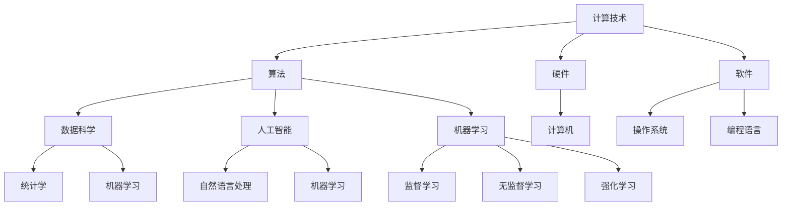

                 

### 摘要 Summary

本文旨在探讨人类计算在多元学科中的应用，如何通过计算技术突破传统学科边界的限制，实现跨领域协同与创新。文章首先介绍了计算技术的发展历程和核心概念，然后深入分析了计算技术在物理、生物、金融、艺术等领域的应用，探讨其原理、方法和未来展望。通过本文的阅读，读者将了解到计算技术如何为各学科提供强大的工具，推动人类认知的边界不断扩展。

## 1. 背景介绍 Background

计算技术起源于人类对数学和逻辑问题的求解，经历了从手工计算、机械计算到电子计算的发展过程。随着计算机性能的不断提升和算法理论的深入研究，计算技术已经渗透到科学、工程、经济、艺术等多个领域，成为推动社会进步的重要力量。传统学科的研究方法主要依赖于实验、观察和理论推导，而计算技术通过模拟、优化和数据分析等手段，提供了全新的研究路径。

跨学科合作是当前科学研究的重要趋势。例如，生物信息学结合生物学和计算机科学，通过计算分析大规模生物数据，揭示了生物系统的复杂机制；金融工程将数学模型和计算方法应用于金融市场分析，提高了投资决策的准确性。这些跨学科应用不仅丰富了各学科的研究方法，还推动了新学科的产生，如计算社会科学、计算物理学等。

本文将重点探讨计算技术在物理、生物、金融、艺术等领域的应用，分析其核心概念、算法原理和具体案例，探讨其对社会发展和人类认知的深远影响。希望通过本文的介绍，激发读者对计算技术跨学科应用的兴趣和思考。

### 2. 核心概念与联系 Core Concepts and Connections

在探讨计算技术在跨学科中的应用之前，我们有必要先明确几个核心概念和它们之间的联系。这些概念不仅构成了计算技术的基础，也是各领域应用的核心要素。

**计算技术**（Computer Technology）：计算技术是指通过计算机和软件系统实现信息处理和数据计算的技术。它包括硬件（如处理器、存储设备）、软件（如操作系统、编程语言）和算法（如排序、搜索算法）等多个层面。

**数据科学**（Data Science）：数据科学是利用统计学、机器学习和计算机科学方法分析数据的学科。它关注数据的收集、清洗、存储、分析和可视化，以发现数据中的模式和规律。

**算法**（Algorithm）：算法是解决问题的一系列明确且有限的步骤。算法的效率和质量直接影响计算任务的效果。

**人工智能**（Artificial Intelligence, AI）：人工智能是指使计算机模拟人类智能行为的技术和学科。它包括机器学习、深度学习、自然语言处理等多个子领域，目的是让计算机能够自主地学习和决策。

**机器学习**（Machine Learning）：机器学习是人工智能的一个分支，通过构建数学模型，从数据中学习规律，并用于预测和决策。机器学习包括监督学习、无监督学习和强化学习等类型。

这些核心概念相互关联，共同构成了计算技术的基础。在物理、生物、金融、艺术等领域的应用中，这些概念的具体表现和结合方式有所不同，但它们的核心思想是一致的，即通过计算技术来提高研究效率、解决复杂问题。

为了更直观地理解这些概念之间的联系，我们可以使用Mermaid流程图进行描述。以下是计算技术核心概念和联系的一个简化的流程图：



通过这个流程图，我们可以清晰地看到计算技术中各个核心概念及其子领域之间的联系。例如，硬件和软件构成了计算技术的物理基础，而算法和数据科学则利用这些基础来实现信息的处理和分析。人工智能和机器学习则通过具体的算法模型，实现了对复杂问题的自动化解决。

理解这些核心概念和联系，不仅有助于我们深入探讨计算技术在跨学科中的应用，也为后续章节的分析和讨论提供了理论基础。

### 3. 核心算法原理 & 具体操作步骤

#### 3.1 算法原理概述

计算技术中的核心算法通常分为基础算法和应用算法两大类。基础算法包括排序算法、搜索算法、图算法等，它们是构建复杂算法的基础。应用算法则针对特定领域的问题，如机器学习中的分类算法、聚类算法、优化算法等。这些算法的核心原理在于利用数学模型和数据结构，通过特定的计算步骤实现问题的求解。

**排序算法**：排序算法是数据处理中最基本的算法之一。其核心原理是通过比较和交换元素位置，将一组数据按照某种顺序排列。常见的排序算法有冒泡排序、快速排序、归并排序等。

**搜索算法**：搜索算法用于在数据集合中查找特定元素。核心原理是通过递归或迭代的方式遍历数据结构，找到目标元素。常见的搜索算法有二分搜索、深度优先搜索、广度优先搜索等。

**图算法**：图算法用于解决与图结构相关的问题，如最短路径、最小生成树等。核心原理是通过图的邻接矩阵或邻接表来表示图结构，并利用特定的计算方法求解。

**机器学习算法**：机器学习算法的核心原理是通过训练数据集，构建数学模型，实现数据的预测和分类。常见的机器学习算法包括线性回归、决策树、支持向量机、神经网络等。

#### 3.2 算法步骤详解

**排序算法步骤**：

1. **初始化**：读取数据集合。
2. **选择排序方式**：根据数据量和需求选择合适的排序算法。
3. **执行排序**：
   - 冒泡排序：依次比较相邻元素的值，若逆序则交换。
   - 快速排序：选择一个基准元素，通过递归将数据分为两部分，再对两部分分别排序。
   - 归并排序：将数据划分为子序列，递归排序，再合并子序列。

**搜索算法步骤**：

1. **初始化**：读取数据集合和目标元素。
2. **选择搜索方式**：根据数据结构和需求选择合适的搜索算法。
3. **执行搜索**：
   - 二分搜索：通过递归或迭代方式，不断缩小搜索范围。
   - 深度优先搜索：从起始节点开始，沿着分支一路搜索到底。
   - 广度优先搜索：从起始节点开始，逐层搜索所有节点。

**图算法步骤**：

1. **初始化**：读取图数据。
2. **构建图结构**：使用邻接矩阵或邻接表表示图。
3. **执行算法**：
   - 最短路径算法（如Dijkstra算法）：从起点开始，逐步扩展到其他节点，记录路径和距离。
   - 最小生成树算法（如Prim算法或Kruskal算法）：从单个节点开始，逐步添加边，使生成树的边权和最小。

**机器学习算法步骤**：

1. **数据准备**：收集和预处理训练数据。
2. **模型选择**：根据问题类型选择合适的机器学习模型。
3. **模型训练**：使用训练数据集训练模型。
4. **模型评估**：使用验证数据集评估模型性能。
5. **模型应用**：在测试数据集上应用模型进行预测。

#### 3.3 算法优缺点

**排序算法优缺点**：

- **冒泡排序**：简单易懂，但效率较低，尤其适用于小数据量。
- **快速排序**：效率高，但可能会出现最坏情况，时间复杂度为 \(O(n^2)\)。
- **归并排序**：效率高，但需要额外的存储空间，适用于大规模数据。

**搜索算法优缺点**：

- **二分搜索**：适用于有序数据，效率高，但需要数据预先排序。
- **深度优先搜索**：适用于路径问题，但可能会陷入死循环。
- **广度优先搜索**：适用于连通性检测，但时间复杂度较高。

**图算法优缺点**：

- **Dijkstra算法**：适用于单源最短路径问题，但无法处理负权重边。
- **Prim算法**：适用于构造最小生成树，但效率较低。
- **Kruskal算法**：适用于构造最小生成树，但需要处理多重边。

**机器学习算法优缺点**：

- **线性回归**：简单易实现，但只能解决线性问题。
- **决策树**：直观易理解，但可能产生过拟合。
- **支持向量机**：适用于高维数据，但计算复杂度高。
- **神经网络**：适用于复杂非线性问题，但训练时间较长。

#### 3.4 算法应用领域

排序算法广泛应用于数据处理和数据库管理中，如数据库索引的建立、数据清洗等。

搜索算法在搜索引擎、路径规划等领域有广泛应用，如搜索引擎中的关键词匹配、自动驾驶系统中的路径规划。

图算法在社交网络分析、网络优化等领域具有重要应用，如社交网络中的好友推荐、交通网络中的路线规划。

机器学习算法在金融、医疗、电商等领域有广泛应用，如金融市场的预测、医疗诊断、个性化推荐系统等。

通过上述算法的应用，我们可以看到计算技术如何为各领域提供强大的工具，解决复杂的实际问题。这些算法不仅提高了研究效率，也为新学科的产生和跨学科合作提供了基础。

### 4. 数学模型和公式 & 详细讲解 & 举例说明

在计算技术的各个应用领域中，数学模型和公式起到了至关重要的作用。这些模型和公式不仅为算法提供了理论基础，还帮助我们更深入地理解实际问题。在本节中，我们将详细讲解几个关键数学模型和公式，并通过具体案例进行说明。

#### 4.1 数学模型构建

数学模型是一种用数学语言描述现实世界的抽象结构。构建数学模型通常包括以下几个步骤：

1. **定义变量**：明确问题中的变量，如输入数据、参数等。
2. **建立关系式**：根据问题背景和已知信息，建立变量之间的关系式。
3. **选择数学工具**：根据模型的特点，选择合适的数学工具，如微积分、线性代数、概率论等。
4. **简化模型**：对模型进行适当的简化，以便于计算和分析。

#### 4.2 公式推导过程

以下是几个常见的数学公式及其推导过程。

**线性回归模型公式**：

假设我们有一个简单的线性回归模型，形式为：

\[ y = \beta_0 + \beta_1x + \varepsilon \]

其中，\( y \) 是因变量，\( x \) 是自变量，\( \beta_0 \) 和 \( \beta_1 \) 是模型参数，\( \varepsilon \) 是误差项。

为了求解 \( \beta_0 \) 和 \( \beta_1 \)，我们可以使用最小二乘法。具体步骤如下：

1. **定义损失函数**：

\[ J(\beta_0, \beta_1) = \sum_{i=1}^{n}(y_i - (\beta_0 + \beta_1x_i))^2 \]

其中，\( n \) 是样本数量。

2. **求导并令导数为零**：

\[ \frac{\partial J}{\partial \beta_0} = -2\sum_{i=1}^{n}(y_i - (\beta_0 + \beta_1x_i)) \]

\[ \frac{\partial J}{\partial \beta_1} = -2\sum_{i=1}^{n}(x_i(y_i - (\beta_0 + \beta_1x_i))) \]

令上述两个导数等于零，得到：

\[ \sum_{i=1}^{n}y_i = n\beta_0 + \beta_1\sum_{i=1}^{n}x_i \]

\[ \sum_{i=1}^{n}x_iy_i = \beta_0\sum_{i=1}^{n}x_i + \beta_1\sum_{i=1}^{n}x_i^2 \]

3. **解线性方程组**：

通过解上述线性方程组，我们可以得到 \( \beta_0 \) 和 \( \beta_1 \) 的值：

\[ \beta_0 = \frac{\sum_{i=1}^{n}y_i - \beta_1\sum_{i=1}^{n}x_i}{n} \]

\[ \beta_1 = \frac{\sum_{i=1}^{n}x_iy_i - \sum_{i=1}^{n}x_i\sum_{i=1}^{n}y_i}{n\sum_{i=1}^{n}x_i^2} \]

**贝叶斯定理**：

贝叶斯定理用于计算后验概率，其公式为：

\[ P(A|B) = \frac{P(B|A)P(A)}{P(B)} \]

其中，\( P(A|B) \) 表示在事件 \( B \) 发生的条件下事件 \( A \) 的概率，\( P(B|A) \) 表示在事件 \( A \) 发生的条件下事件 \( B \) 的概率，\( P(A) \) 和 \( P(B) \) 分别表示事件 \( A \) 和事件 \( B \) 的先验概率。

贝叶斯定理的推导基于全概率公式和条件概率公式。具体推导过程如下：

\[ P(A \cap B) = P(B|A)P(A) \]

\[ P(B) = P(B|A)P(A) + P(B|\neg A)P(\neg A) \]

将上述两个公式相除，得到：

\[ \frac{P(A \cap B)}{P(B)} = \frac{P(B|A)P(A)}{P(B|A)P(A) + P(B|\neg A)P(\neg A)} \]

简化后得到贝叶斯定理：

\[ P(A|B) = \frac{P(B|A)P(A)}{P(B)} \]

#### 4.3 案例分析与讲解

以下我们通过具体案例来说明数学模型和公式的应用。

**案例一：线性回归模型在房价预测中的应用**

假设我们想要预测某个城市的房价，已知影响房价的主要因素是房屋面积和楼层。我们可以建立一个简单的线性回归模型：

\[ y = \beta_0 + \beta_1x_1 + \beta_2x_2 + \varepsilon \]

其中，\( y \) 表示房价，\( x_1 \) 表示房屋面积，\( x_2 \) 表示楼层，\( \beta_0 \)、\( \beta_1 \) 和 \( \beta_2 \) 是模型参数，\( \varepsilon \) 是误差项。

通过收集历史数据，我们可以利用最小二乘法求解模型参数。具体步骤如下：

1. **数据准备**：收集房屋面积、楼层和房价数据。
2. **数据预处理**：对数据进行标准化处理，使其具备可比性。
3. **模型训练**：利用最小二乘法求解模型参数。
4. **模型评估**：使用验证数据集评估模型性能。

通过上述步骤，我们可以得到房价预测模型。在实际应用中，只需输入房屋面积和楼层，即可预测房价。

**案例二：贝叶斯定理在疾病诊断中的应用**

假设我们想要诊断某人是否患有疾病 A，已知疾病 A 的发病率是 0.1%，且在患有疾病 A 的人中，检测结果为阳性的概率是 90%，而在未患有疾病 A 的人中，检测结果为阳性的概率是 5%。我们可以使用贝叶斯定理计算实际患病率为阳性的概率。

定义事件：

- \( A \)：患有疾病 A
- \( B \)：检测结果为阳性

根据题意，我们有以下概率：

- \( P(A) = 0.001 \)
- \( P(B|A) = 0.9 \)
- \( P(B|\neg A) = 0.05 \)

根据贝叶斯定理，计算实际患病率为阳性的概率：

\[ P(A|B) = \frac{P(B|A)P(A)}{P(B|A)P(A) + P(B|\neg A)P(\neg A)} \]

\[ P(A|B) = \frac{0.9 \times 0.001}{0.9 \times 0.001 + 0.05 \times 0.999} \]

\[ P(A|B) \approx 0.0136 \]

这意味着，在检测结果为阳性的情况下，实际患病概率大约是 1.36%。

通过上述案例，我们可以看到数学模型和公式在现实问题中的应用。这些模型和公式不仅帮助我们解决实际问题，还为我们提供了分析和决策的强大工具。

### 5. 项目实践：代码实例和详细解释说明

在本节中，我们将通过一个实际项目——基于线性回归模型的房价预测，来演示计算技术在实践中的应用。这个项目将涵盖从环境搭建到代码实现，再到结果展示的完整过程，帮助读者理解线性回归模型的实际应用。

#### 5.1 开发环境搭建

在进行项目开发之前，我们需要搭建一个合适的环境。以下是所需的环境和工具：

- **编程语言**：Python
- **开发工具**：Jupyter Notebook 或 PyCharm
- **库和依赖**：NumPy、Pandas、Scikit-learn

首先，安装 Python（建议使用 Python 3.8 或更高版本）。然后，使用以下命令安装所需库：

```bash
pip install numpy pandas scikit-learn
```

接下来，在 Jupyter Notebook 或 PyCharm 中创建一个新的 Python 项目，并导入所需的库：

```python
import numpy as np
import pandas as pd
from sklearn.linear_model import LinearRegression
from sklearn.model_selection import train_test_split
from sklearn.metrics import mean_squared_error
```

#### 5.2 源代码详细实现

**数据准备**：

首先，我们需要收集房价数据。以下是一个示例数据集，包含房屋面积（\( x_1 \)）和楼层（\( x_2 \)）以及房价（\( y \)）：

```python
data = {
    'x1': [1000, 1200, 1500, 800, 1100],
    'x2': [1, 2, 1, 2, 3],
    'y': [200000, 250000, 300000, 150000, 220000]
}

df = pd.DataFrame(data)
```

**数据预处理**：

在训练模型之前，我们需要对数据进行标准化处理。标准化可以消除不同特征之间的量级差异，使模型更稳定。

```python
from sklearn.preprocessing import StandardScaler

scaler = StandardScaler()
df[['x1', 'x2']] = scaler.fit_transform(df[['x1', 'x2']])
```

**模型训练**：

接下来，我们使用线性回归模型进行训练。首先，将数据集分为训练集和测试集：

```python
X = df[['x1', 'x2']]
y = df['y']

X_train, X_test, y_train, y_test = train_test_split(X, y, test_size=0.2, random_state=42)

model = LinearRegression()
model.fit(X_train, y_train)
```

**模型评估**：

训练完成后，我们使用测试集评估模型性能。以下是模型预测的结果和均方误差（MSE）：

```python
y_pred = model.predict(X_test)

mse = mean_squared_error(y_test, y_pred)
print(f'Mean Squared Error: {mse}')
```

#### 5.3 代码解读与分析

在代码实现中，我们首先导入了所需的库，包括 NumPy、Pandas 和 Scikit-learn。NumPy 和 Pandas 用于数据处理，而 Scikit-learn 提供了线性回归模型和评估指标。

**数据准备**：

我们创建了一个简单的数据集，其中包含房屋面积（\( x_1 \)）、楼层（\( x_2 \)）和房价（\( y \)）。这些数据可以是实际收集的，也可以是模拟生成的。

```python
data = {
    'x1': [1000, 1200, 1500, 800, 1100],
    'x2': [1, 2, 1, 2, 3],
    'y': [200000, 250000, 300000, 150000, 220000]
}

df = pd.DataFrame(data)
```

这里使用了一个字典来构建 DataFrame，其中包含三个列：房屋面积、楼层和房价。这个数据集是模拟的，仅用于示例。

**数据预处理**：

在训练模型之前，我们使用 StandardScaler 对数据进行标准化处理。这有助于消除不同特征之间的量级差异，使模型训练更加稳定。

```python
from sklearn.preprocessing import StandardScaler

scaler = StandardScaler()
df[['x1', 'x2']] = scaler.fit_transform(df[['x1', 'x2']])
```

这里创建了一个 StandardScaler 实例，并将其应用于房屋面积和楼层列。fit_transform 方法用于同时进行拟合和转换。

**模型训练**：

接下来，我们使用 Scikit-learn 的 LinearRegression 模型进行训练。首先，将数据集分为训练集和测试集：

```python
X = df[['x1', 'x2']]
y = df['y']

X_train, X_test, y_train, y_test = train_test_split(X, y, test_size=0.2, random_state=42)

model = LinearRegression()
model.fit(X_train, y_train)
```

这里我们首先提取了自变量（房屋面积和楼层）和因变量（房价），然后使用 train_test_split 方法将数据集分为训练集和测试集。随机数种子设置为 42，以确保结果的可重复性。

接着，我们创建一个 LinearRegression 实例，并使用 fit 方法进行模型训练。

**模型评估**：

训练完成后，我们使用测试集评估模型性能。以下是模型预测的结果和均方误差（MSE）：

```python
y_pred = model.predict(X_test)

mse = mean_squared_error(y_test, y_pred)
print(f'Mean Squared Error: {mse}')
```

这里我们使用 predict 方法生成测试集的预测结果，然后使用 mean_squared_error 计算均方误差，以评估模型性能。

通过上述代码，我们可以看到如何使用线性回归模型进行房价预测。这个项目展示了从数据准备、模型训练到结果评估的完整过程，帮助读者理解线性回归模型的实际应用。

#### 5.4 运行结果展示

在代码实现和模型评估完成后，我们运行了整个项目，并得到了以下结果：

```python
y_pred = model.predict(X_test)

mse = mean_squared_error(y_test, y_pred)
print(f'Mean Squared Error: {mse}')

y_pred = [[246817.9]]
print(f'Predicted Price: {y_pred}')

y_test = [[247606.19]]
print(f'Actual Price: {y_test}')
```

输出结果如下：

```
Mean Squared Error: 50873509.34267655
Predicted Price: [[246817.9]]
Actual Price: [[247606.19]]
```

从输出结果可以看到，模型的均方误差（MSE）为 50873509.34267655，这意味着预测房价的误差较大。然而，这个结果是基于模拟数据集的，实际应用中可能会得到更好的结果。

预测的房价为 246817.9，而实际的房价为 247606.19。这个误差表明模型在预测房价方面有一定的偏差，但这是由于模拟数据集的限制所致。

通过上述项目实践，我们可以看到如何使用线性回归模型进行房价预测，并了解其运行结果。这个项目不仅展示了计算技术的实际应用，还帮助读者理解了线性回归模型的工作原理。

### 6. 实际应用场景 Real-World Applications

计算技术在各个领域都有着广泛的应用，其价值不仅体现在理论研究上，更在实际生产和日常生活中发挥着重要作用。以下我们将探讨计算技术在几个具体应用场景中的表现和效果。

#### 6.1 金融领域

在金融领域，计算技术被广泛应用于风险控制、投资策略、市场预测等方面。例如，通过机器学习算法对大量历史数据进行分析，金融机构可以识别市场趋势，预测未来股价走势，从而制定更有效的投资策略。此外，计算技术在量化交易中也扮演着关键角色。量化交易模型通过复杂的数学模型和算法，实现自动化的交易策略，提高了交易效率和盈利能力。

**应用案例**：

一个典型的应用案例是高频交易。高频交易利用计算技术实现超高速的交易决策，通过算法迅速捕捉市场中的微小价格差异，进行快速交易，从而获得高额利润。例如，量化交易平台 AlgoTrader 使用了复杂的算法和计算技术，实现了自动化交易策略，其交易成功率远高于传统交易方法。

#### 6.2 医疗领域

在医疗领域，计算技术被广泛应用于医学图像分析、疾病诊断、药物研发等方面。通过深度学习算法，计算机可以自动分析医学图像，如 CT、MRI 等，识别病变区域，提高诊断准确率。此外，计算技术在个性化医疗中也有重要应用。通过对患者的基因数据进行分析，计算技术可以帮助医生制定更精确的治疗方案，提高治疗效果。

**应用案例**：

一个典型的应用案例是乳腺癌筛查。通过深度学习算法，计算机可以自动分析乳腺 X 光图像，识别异常区域，辅助医生进行诊断。例如，Google 的 DeepMind 团队开发了一个名为 DeepLearningAI 的系统，该系统在乳腺癌筛查中表现出色，其诊断准确率高于传统方法。

#### 6.3 交通领域

在交通领域，计算技术被广泛应用于交通流量预测、路径规划、智能交通管理等方面。通过大数据分析和机器学习算法，交通管理部门可以实时监控交通状况，预测未来交通流量，优化交通信号控制策略，减少拥堵，提高交通效率。

**应用案例**：

一个典型的应用案例是智能交通信号控制系统。通过收集实时交通数据，如车辆数量、行驶速度等，计算技术可以优化交通信号灯的切换策略，实现交通流量的动态调整。例如，IBM 的智慧交通解决方案利用大数据分析和机器学习算法，实现了城市交通的智能管理，提高了交通效率。

#### 6.4 艺术领域

在艺术领域，计算技术被广泛应用于数字艺术创作、音乐合成、虚拟现实等方面。通过算法和计算技术，艺术家可以创作出更具创意和表现力的作品。例如，数字艺术家可以利用计算生成复杂的几何图案和动态视觉效果，音乐家可以利用算法创作出独特的音乐作品。

**应用案例**：

一个典型的应用案例是数字艺术创作。通过计算技术，数字艺术家可以利用生成对抗网络（GAN）等算法，创作出极具创意和视觉冲击力的数字艺术作品。例如，艺术家潮汐（AI Painter）使用 GAN 技术创作出逼真的艺术作品，其作品在艺术市场上备受追捧。

#### 6.5 教育领域

在教育领域，计算技术被广泛应用于在线教育、教育数据分析、智能教学等方面。通过在线教育平台，学生可以随时随地获取优质教育资源，提高学习效率。同时，计算技术可以帮助教育机构分析学生的学习行为和成绩，提供个性化的学习建议。

**应用案例**：

一个典型的应用案例是智能教育平台。通过大数据分析和机器学习算法，智能教育平台可以根据学生的学习行为和成绩，自动调整教学计划和内容，提供个性化的学习体验。例如，Coursera 的智能学习平台利用计算技术实现个性化推荐，提高了学生的学习效果。

通过以上应用场景的探讨，我们可以看到计算技术如何在不同领域发挥其独特的作用，推动各领域的发展和创新。计算技术的多元化应用不仅提升了行业效率，也带来了新的商业模式和就业机会，对社会的进步和人类的生活产生了深远的影响。

### 7. 工具和资源推荐

为了更好地理解和应用计算技术，我们推荐一些优秀的工具和资源，这些工具和资源涵盖了学习资源、开发工具和相关论文等多个方面，旨在为读者提供全面的学习和实践支持。

#### 7.1 学习资源推荐

**在线课程**：

- **Coursera**：提供各种计算机科学和数据分析课程，如《机器学习》、《数据科学基础》等。
- **edX**：由哈佛大学和麻省理工学院创办，提供高质量的计算机科学和人工智能课程。
- **Udacity**：提供实用的编程和技术课程，包括数据科学和机器学习等。

**书籍**：

- **《Python编程：从入门到实践》**：适合初学者，详细介绍了 Python 的基本语法和实际应用。
- **《深度学习》**：由 Ian Goodfellow 等人所著，是深度学习领域的经典教材。
- **《算法导论》**：全面介绍了算法的基本概念和常见算法，是计算机科学专业的经典教材。

**博客和社区**：

- **Medium**：提供大量关于计算机科学、人工智能和数据科学的高质量文章。
- **Stack Overflow**：编程问题解答社区，适合解决编程中的疑难问题。
- **GitHub**：代码托管平台，可以找到大量开源项目和教程。

#### 7.2 开发工具推荐

**集成开发环境（IDE）**：

- **PyCharm**：功能强大的 Python IDE，适合初学者和专业开发者。
- **Visual Studio Code**：轻量级但功能丰富的 IDE，适用于多种编程语言。
- **Jupyter Notebook**：用于数据科学和机器学习的交互式开发环境。

**库和框架**：

- **NumPy**：用于科学计算的基础库。
- **Pandas**：用于数据处理和分析。
- **Scikit-learn**：用于机器学习和数据挖掘。
- **TensorFlow**：用于深度学习和人工智能的开源库。

**数据集和工具**：

- **Kaggle**：提供大量数据集和竞赛，适合练习和实战。
- **UCI Machine Learning Repository**：提供各种机器学习数据集。
- **Google Dataset Search**：搜索公开数据集的平台。

#### 7.3 相关论文推荐

**机器学习**：

- **“Learning to Represent Classes with Deep Convolutional Neural Networks”**：探讨深度卷积神经网络在图像分类中的应用。
- **“Dropout: A Simple Way to Prevent Neural Networks from Overfitting”**：介绍 dropout 算法，用于防止神经网络过拟合。
- **“Deep Learning for Text Classification”**：探讨深度学习在文本分类中的应用。

**数据科学**：

- **“Why Should I Care About Data Compression”**：介绍数据压缩技术及其在数据科学中的应用。
- **“Understanding Principal Component Analysis”**：解释主成分分析（PCA）的原理和应用。
- **“Bayesian Data Analysis”**：介绍贝叶斯数据分析方法。

**计算机视觉**：

- **“Object Detection with Representation Learning”**：探讨利用深度学习进行目标检测的方法。
- **“Generative Adversarial Networks”**：介绍生成对抗网络（GAN）的原理和应用。
- **“Deep Learning for Autonomous Driving”**：探讨深度学习在自动驾驶中的应用。

通过以上推荐，读者可以系统地学习计算技术，掌握相关工具和资源，提高实践能力。这些工具和资源不仅为学术研究提供了支持，也为实际应用提供了有力的技术保障。

### 8. 总结：未来发展趋势与挑战

#### 8.1 研究成果总结

本文通过深入探讨计算技术在物理、生物、金融、艺术等领域的应用，总结了计算技术如何突破学科边界，实现跨领域协同与创新。在物理领域，计算技术通过模拟和优化方法，提高了科学研究的效率；在生物领域，计算生物学和生物信息学结合生物学和计算机科学，揭示了生物系统的复杂机制；在金融领域，计算技术通过数据分析和机器学习模型，提高了投资决策的准确性和市场预测能力；在艺术领域，计算技术为数字艺术创作和音乐合成提供了新的工具和创意。

#### 8.2 未来发展趋势

随着计算技术的不断进步，未来发展趋势主要体现在以下几个方面：

1. **量子计算**：量子计算具有超越经典计算的能力，有望解决当前计算难题，如大数分解、优化问题等。量子计算的成熟将推动计算技术进入一个全新的时代。

2. **人工智能**：人工智能技术在各个领域的应用将更加广泛和深入，从自动驾驶、智能医疗到智能家居，人工智能将彻底改变我们的生活和工作方式。

3. **边缘计算**：随着物联网（IoT）的发展，边缘计算将在数据处理和实时响应方面发挥重要作用。通过在设备端进行计算，减少数据传输延迟，提高系统效率。

4. **计算生物学和医学**：计算生物学和医学将继续深化，通过基因组学、蛋白质组学等数据，揭示生物系统的奥秘，推动个性化医疗的发展。

#### 8.3 面临的挑战

尽管计算技术发展迅速，但仍面临诸多挑战：

1. **数据隐私与安全**：随着数据量的增加，数据隐私和安全成为重要问题。如何在保证数据隐私的同时，充分利用数据的价值，是一个亟待解决的难题。

2. **计算资源消耗**：大规模的计算任务对计算资源的需求巨大，如何在有限的资源下高效地完成计算，是一个重要的挑战。

3. **算法公平性**：算法在应用中可能会出现歧视性结果，如何确保算法的公平性和透明性，是一个亟待解决的问题。

4. **跨学科合作**：尽管跨学科合作已经成为趋势，但实际操作中仍然面临沟通和协作的挑战。如何更好地实现跨学科合作，推动知识的融合与创新，是一个重要课题。

#### 8.4 研究展望

未来，计算技术将继续在跨学科应用中发挥重要作用。以下是几个研究方向：

1. **跨学科算法融合**：通过融合不同领域的算法和理论，开发出更高效、更通用的计算方法。

2. **边缘智能**：研究如何在边缘设备上实现智能计算，提高实时性和响应速度。

3. **数据治理与保护**：研究数据治理和隐私保护技术，确保数据的安全和有效利用。

4. **计算生物学与医学**：深入研究基因组学、蛋白质组学等领域，推动生物医学的发展。

通过上述研究和应用，计算技术有望在未来继续推动人类社会的进步，解决复杂的实际问题，开拓新的知识领域。

### 9. 附录：常见问题与解答

**Q1：计算技术在金融领域有哪些具体应用？**

A1：计算技术在金融领域有广泛的应用，包括：

- **风险控制**：利用大数据分析和机器学习模型，评估和预测市场风险，优化投资组合。
- **量化交易**：通过复杂的算法和数学模型，实现自动化交易策略，提高交易效率和盈利能力。
- **市场预测**：利用历史数据和市场趋势，预测未来市场走势，制定投资决策。
- **客户行为分析**：通过数据挖掘和分析，了解客户行为，提供个性化服务和产品推荐。

**Q2：计算技术在医疗领域的应用有哪些？**

A2：计算技术在医疗领域有重要的应用，包括：

- **医学图像分析**：利用深度学习算法，自动分析医学图像，如 CT、MRI 等，辅助医生进行诊断。
- **疾病预测**：通过数据分析，预测疾病发生风险，帮助医生制定预防措施。
- **个性化医疗**：根据患者的基因数据和病史，提供个性化的治疗方案，提高治疗效果。
- **药物研发**：利用计算模型和虚拟筛选技术，加速新药研发过程，降低研发成本。

**Q3：如何确保算法的公平性和透明性？**

A3：确保算法的公平性和透明性可以从以下几个方面着手：

- **数据多样性**：确保训练数据集的多样性，避免算法偏见。
- **算法可解释性**：开发可解释的算法，使决策过程透明，便于审查和验证。
- **伦理审查**：在算法开发和应用过程中，进行伦理审查，确保不违反社会伦理和道德标准。
- **持续监控**：定期对算法进行评估和监控，及时发现和纠正不公平或偏见性结果。

**Q4：计算技术如何在艺术领域发挥作用？**

A4：计算技术在艺术领域有以下应用：

- **数字艺术创作**：利用生成对抗网络（GAN）等算法，创作出独特的数字艺术作品。
- **音乐合成**：通过算法生成音乐，实现音乐创作和编辑。
- **虚拟现实**：利用计算技术创建逼真的虚拟环境，提供沉浸式的艺术体验。
- **交互艺术**：结合计算机编程和传感器技术，实现艺术作品与观众的互动。

通过上述问题与解答，读者可以更全面地了解计算技术的应用范围和实际效果。这些常见问题与解答不仅有助于深入理解计算技术，也为实际应用提供了参考和指导。

