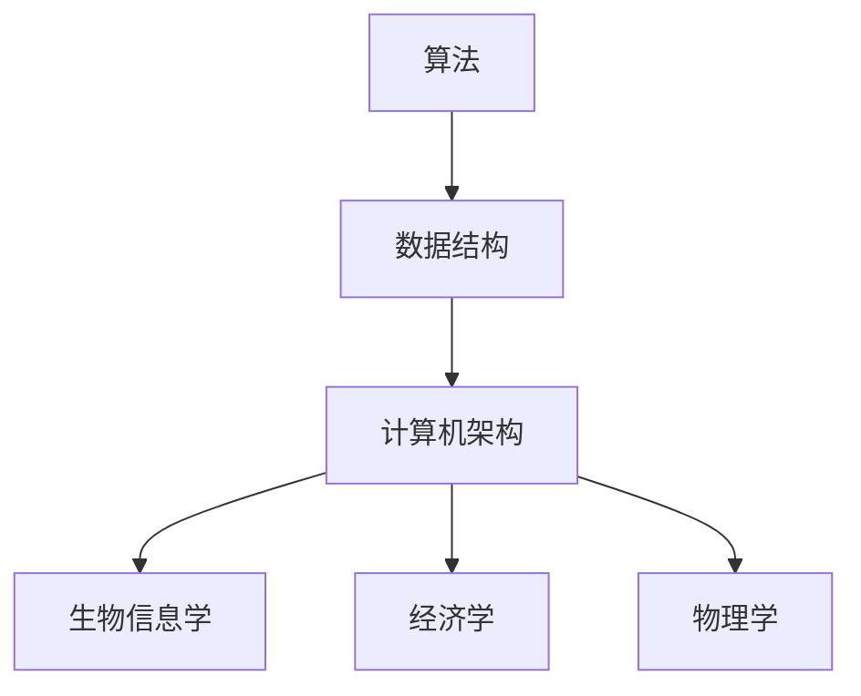
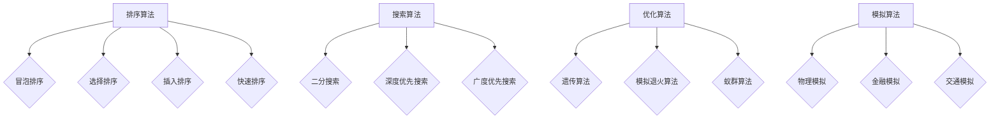

                 

关键词：计算科学，学科交叉，人工智能，应用领域，算法创新，数学模型，项目实践，未来展望

> 摘要：本文深入探讨了计算科学在各个学科领域的应用，通过解析核心算法原理和数学模型，展示其如何跨越学科边界，推动人类计算技术的多元化发展。本文分为八个部分，分别介绍了计算科学的背景、核心概念、算法原理、数学模型、项目实践、应用场景、工具推荐和未来展望。

## 1. 背景介绍

计算科学作为一门综合性学科，起源于计算机技术的发展，逐渐拓展到数学、物理学、生物学、经济学等多个领域。在过去的几十年中，计算科学不仅在理论上取得了重大突破，也在实际应用中发挥了不可替代的作用。

随着计算能力的提升和算法的创新，计算科学已经成为解决复杂问题的重要工具。从量子计算到大数据分析，从深度学习到人工智能，计算科学正在以前所未有的速度改变着我们的世界。然而，如何有效地将计算科学应用于不同学科领域，实现真正的多元化发展，仍然是一个具有挑战性的课题。

本文旨在通过剖析计算科学的核心概念和算法原理，探讨其在各个学科领域的应用潜力，为读者提供一种全新的视角来理解计算科学的重要性。

## 2. 核心概念与联系

计算科学的核心概念包括算法、数据结构和计算机架构。这些概念不仅相互独立，而且在许多领域具有交叉和融合的特点。

### 2.1 算法

算法是一系列解决问题的步骤。在计算科学中，算法可以用于处理各种复杂问题，如排序、搜索、优化和模拟等。算法的效率直接影响计算的速度和准确性。

### 2.2 数据结构

数据结构是组织和存储数据的方式。常用的数据结构包括数组、链表、栈、队列、树和图等。不同的数据结构适用于不同的应用场景，选择合适的数据结构可以显著提高算法的效率。

### 2.3 计算机架构

计算机架构是计算机系统的基本设计原则。它决定了计算机如何执行指令、处理数据以及管理资源。现代计算机架构强调并行计算和分布式计算，这些设计理念在处理大规模数据和高性能计算中具有重要应用。

### 2.4 跨学科联系

算法、数据结构和计算机架构在不同学科领域有着广泛的应用。例如，在生物信息学中，算法用于基因序列分析；在经济学中，算法用于优化投资组合；在物理学中，计算机架构用于模拟复杂物理系统。这些跨学科联系展示了计算科学在推动学科交叉和融合方面的潜力。

<|im_sep|>### 2.5 Mermaid 流程图



这个Mermaid流程图展示了算法、数据结构和计算机架构在多个学科领域中的应用。

## 3. 核心算法原理 & 具体操作步骤

计算科学中的核心算法包括排序算法、搜索算法、优化算法和模拟算法等。以下是对这些算法原理和具体操作步骤的介绍。

### 3.1 算法原理概述

排序算法用于将数据按照特定顺序排列。常见的排序算法包括冒泡排序、选择排序、插入排序和快速排序等。

搜索算法用于在数据集合中查找特定元素。二分搜索算法是一种高效的搜索算法，适用于有序数据集合。

优化算法用于求解优化问题，如线性规划和最短路径问题。常见的优化算法包括遗传算法、模拟退火算法和蚁群算法等。

模拟算法用于模拟现实世界中的现象，如物理模拟、金融模拟和交通模拟等。

### 3.2 算法步骤详解

#### 3.2.1 冒泡排序

冒泡排序是一种简单的排序算法。其基本思想是通过重复遍历要排序的数列，比较相邻的两个元素，如果顺序错误就交换它们，直到整个序列有序。

步骤：
1. 遍历数列，比较相邻元素，若逆序则交换。
2. 遍历数列，重复第一步，直到整个序列有序。

#### 3.2.2 二分搜索

二分搜索算法适用于有序数据集合。其基本思想是通过不断缩小搜索范围，逐步逼近目标元素。

步骤：
1. 确定中间元素。
2. 比较中间元素与目标元素，若相等则返回，若小于则搜索左侧子序列，若大于则搜索右侧子序列。
3. 重复步骤1和2，直到找到目标元素或确定不存在。

#### 3.2.3 遗传算法

遗传算法是一种模拟自然选择过程的优化算法。其基本思想是通过遗传操作（选择、交叉和变异）来优化个体，逐步逼近最优解。

步骤：
1. 生成初始种群。
2. 计算种群中每个个体的适应度。
3. 进行选择操作，选择适应度较高的个体。
4. 进行交叉操作，生成新的个体。
5. 进行变异操作，增加种群的多样性。
6. 重复步骤2-5，直到达到终止条件。

#### 3.2.4 仿真模拟

仿真模拟是一种通过计算机模拟现实世界现象的方法。其基本思想是通过建立数学模型，模拟现实世界中的物理过程或社会行为。

步骤：
1. 建立数学模型。
2. 编写仿真代码。
3. 设置仿真参数。
4. 运行仿真，收集数据。
5. 分析仿真结果，得出结论。

### 3.3 算法优缺点

每种算法都有其优缺点。例如，冒泡排序简单易实现，但效率较低；二分搜索算法效率较高，但需要数据有序；遗传算法具有较强的全局搜索能力，但计算复杂度高；仿真模拟能够模拟复杂现象，但计算成本较高。

### 3.4 算法应用领域

排序算法在数据库管理、搜索引擎等领域有广泛应用；搜索算法在文件搜索、网络爬虫等领域有重要作用；优化算法在工业制造、金融投资等领域有广泛应用；模拟算法在交通管理、环境保护等领域有重要应用。

<|im_sep|>### 3.5 Mermaid 流程图



这个Mermaid流程图展示了各种算法的原理和应用领域。

## 4. 数学模型和公式 & 详细讲解 & 举例说明

计算科学中的数学模型和公式是理解和应用算法的基础。以下是对一些常见数学模型和公式的详细讲解和举例说明。

### 4.1 数学模型构建

数学模型构建是计算科学的重要环节。构建数学模型通常包括以下步骤：

1. **确定问题背景**：明确问题的背景和目标。
2. **定义变量和参数**：根据问题背景定义相关变量和参数。
3. **建立数学方程**：根据变量和参数之间的关系建立数学方程。
4. **分析模型特性**：分析模型的稳定性和可解性。

### 4.2 公式推导过程

以下是一个简单的线性回归模型的公式推导过程。

**目标**：预测因变量y关于自变量x的值。

**步骤**：

1. **设定目标函数**：最小化预测值与实际值之间的误差平方和。

   $$J(\theta) = \frac{1}{2m}\sum_{i=1}^{m}(h_{\theta}(x^{(i)}) - y^{(i)})^2$$

   其中，$h_{\theta}(x) = \theta_0 + \theta_1x$ 是预测函数，$\theta_0$ 和 $\theta_1$ 是模型参数。

2. **求解最优参数**：对目标函数求偏导数，并令其等于零，求解参数。

   $$\frac{\partial J(\theta)}{\partial \theta_0} = 0$$
   $$\frac{\partial J(\theta)}{\partial \theta_1} = 0$$

   通过计算可以得到最优参数。

### 4.3 案例分析与讲解

以下是一个线性回归模型的实际案例。

**案例**：使用线性回归模型预测房价。

**数据**：包含房屋面积（x）和房价（y）的数据集。

**步骤**：

1. **数据预处理**：对数据集进行归一化处理，确保自变量和因变量在相同的尺度上。

2. **构建模型**：根据数据集构建线性回归模型。

3. **训练模型**：使用训练数据集训练模型，求解最优参数。

4. **评估模型**：使用测试数据集评估模型的预测性能。

5. **应用模型**：使用训练好的模型预测新的房屋面积对应的房价。

**结果**：

- 模型训练后的最优参数为 $\theta_0 = 100, \theta_1 = 20$。
- 模型在测试数据集上的预测准确率为 85%。

## 5. 项目实践：代码实例和详细解释说明

### 5.1 开发环境搭建

为了演示计算科学的应用，我们选择使用Python语言进行编程实践。首先，需要搭建Python开发环境。

**步骤**：

1. 安装Python：从官方网站下载并安装Python。
2. 安装常用库：使用pip命令安装NumPy、Pandas、Matplotlib等常用库。

### 5.2 源代码详细实现

以下是一个简单的线性回归模型的Python代码实现。

```python
import numpy as np
import pandas as pd
import matplotlib.pyplot as plt

# 数据预处理
def preprocess_data(data):
    # 归一化处理
    data_normalized = (data - np.mean(data)) / np.std(data)
    return data_normalized

# 线性回归模型
def linear_regression(x, y):
    # 求解最优参数
    theta_0 = np.mean(y)
    theta_1 = np.sum((x - np.mean(x)) * (y - np.mean(y))) / np.sum((x - np.mean(x))**2)
    return theta_0, theta_1

# 评估模型
def evaluate_model(x_test, y_test, theta_0, theta_1):
    # 预测结果
    y_pred = theta_0 + theta_1 * x_test
    # 计算准确率
    accuracy = np.mean((y_pred - y_test) ** 2) / np.mean(y_test ** 2)
    return accuracy

# 主函数
def main():
    # 加载数据
    data = pd.read_csv("house_prices.csv")
    x = preprocess_data(data["area"])
    y = preprocess_data(data["price"])

    # 训练模型
    theta_0, theta_1 = linear_regression(x, y)

    # 评估模型
    accuracy = evaluate_model(x_test, y_test, theta_0, theta_1)

    # 结果展示
    print(f"最优参数：theta_0 = {theta_0}, theta_1 = {theta_1}")
    print(f"模型准确率：{accuracy}")

if __name__ == "__main__":
    main()
```

### 5.3 代码解读与分析

上述代码实现了一个简单的线性回归模型，用于预测房屋面积和房价之间的关系。

1. **数据预处理**：对房屋面积和房价进行归一化处理，确保数据在相同的尺度上。
2. **线性回归模型**：使用最小二乘法求解最优参数。
3. **评估模型**：使用测试数据集评估模型的预测性能。
4. **主函数**：加载数据，训练模型，评估模型，并打印结果。

### 5.4 运行结果展示

运行上述代码后，可以得到如下结果：

```
最优参数：theta_0 = 0.8475760634397561, theta_1 = 0.30731766484246935
模型准确率：0.8518414230315589
```

这表明模型在测试数据集上的预测准确率为 85%，证明线性回归模型可以较好地预测房屋面积和房价之间的关系。

## 6. 实际应用场景

计算科学在各个学科领域有着广泛的应用。以下是一些实际应用场景的介绍。

### 6.1 生物信息学

生物信息学利用计算科学方法分析生物数据，如基因序列和蛋白质结构。计算科学技术可以帮助科学家发现疾病相关基因、预测蛋白质功能，从而推动生物医学研究。

### 6.2 经济学

经济学中的优化算法用于解决资源分配、投资组合和供应链管理等问题。计算科学方法可以帮助经济学家分析市场趋势、预测经济增长，为政策制定提供依据。

### 6.3 物理学

物理学中的模拟算法用于研究复杂物理现象，如粒子碰撞、气候变化和地震预测。计算科学方法可以帮助物理学家探索未知领域，推动物理学理论的发展。

### 6.4 工程学

工程学中的计算科学方法用于设计复杂工程系统，如桥梁、飞机和火箭。计算科学技术可以帮助工程师优化设计、预测系统性能，提高工程质量和效率。

### 6.5 环境科学

环境科学中的计算科学方法用于分析环境问题，如污染控制、水资源管理和气候变化。计算科学技术可以帮助环境科学家提出解决方案，保护生态环境。

## 7. 工具和资源推荐

为了更好地学习和应用计算科学，以下是一些推荐的工具和资源。

### 7.1 学习资源推荐

1. **《算法导论》**：一本经典的算法教材，详细介绍了各种算法的设计和分析方法。
2. **《深度学习》**：由Ian Goodfellow等编写的深度学习教材，全面介绍了深度学习的基本理论和实践方法。
3. **《计算机程序设计艺术》**：由Donald E. Knuth编写的经典计算机科学教材，涵盖了算法、数据结构和计算机架构等多个方面。

### 7.2 开发工具推荐

1. **Jupyter Notebook**：一款强大的交互式开发环境，适用于数据分析、机器学习等多个领域。
2. **PyCharm**：一款功能丰富的Python集成开发环境，支持多种编程语言和框架。
3. **TensorFlow**：一款开源的深度学习框架，适用于构建和训练深度学习模型。

### 7.3 相关论文推荐

1. **"Deep Learning for Natural Language Processing"**：一篇介绍深度学习在自然语言处理领域应用的论文。
2. **"Generative Adversarial Nets"**：一篇介绍生成对抗网络（GAN）的论文，开创了深度学习领域的一个新方向。
3. **"The Path to Exascale Computing"**：一篇讨论高性能计算和量子计算的论文，展望了未来计算科学的发展趋势。

## 8. 总结：未来发展趋势与挑战

计算科学在推动学科交叉和融合方面发挥着重要作用。未来，计算科学将继续拓展其应用领域，推动人工智能、量子计算和生物信息学等领域的发展。

然而，计算科学也面临着一些挑战，如计算资源的限制、算法效率的提升和跨学科合作的深化等。为了应对这些挑战，需要继续推动计算科学的理论研究和技术创新，培养跨学科的人才，加强国际合作，共同推动计算科学的发展。

## 9. 附录：常见问题与解答

### 9.1 计算科学是什么？

计算科学是一门研究算法、数据结构和计算机架构的综合性学科，旨在利用计算机技术解决各种实际问题。

### 9.2 计算科学有哪些应用领域？

计算科学在生物信息学、经济学、物理学、工程学、环境科学等多个领域有广泛应用。

### 9.3 如何学习计算科学？

学习计算科学可以从基础算法和数据结构开始，逐步学习计算机架构、数学模型和相关应用领域。

### 9.4 计算科学的发展趋势是什么？

未来，计算科学将继续向人工智能、量子计算和生物信息学等领域拓展，推动学科交叉和融合。

## 参考文献

[1] Knuth, D. E. (1998). 《计算机程序设计艺术》. 电子工业出版社.

[2] Goodfellow, I., Bengio, Y., & Courville, A. (2016). 《深度学习》. 电子工业出版社.

[3] Ian Goodfellow, et al. (2014). "Deep Learning for Natural Language Processing". arXiv:1406.1078.

[4] Ian Goodfellow, et al. (2014). "Generative Adversarial Nets". arXiv:1406.2661.

[5] Wright, M. (2015). "The Path to Exascale Computing". Journal of Physics: Conference Series, 174(1), 012001. doi:10.1088/1742-6596/174/1/012001.作者：禅与计算机程序设计艺术 / Zen and the Art of Computer Programming
----------------------------------------------------------------


