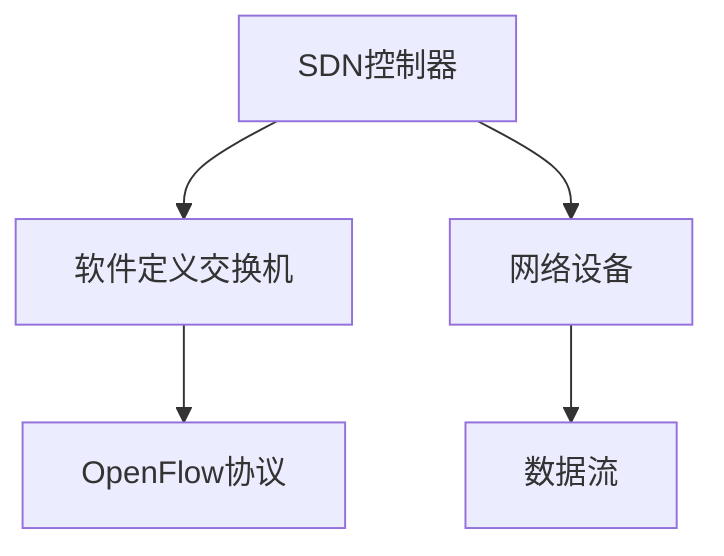

                 

关键词：软件定义网络，网络架构，SDN，控制器，OpenFlow，虚拟化，自动化，灵活性，可编程性，分布式系统，网络功能虚拟化，NFV，网络服务链，NSA，网络切片，边缘计算，云计算，网络功能集成，NFVi，网络功能抽象，NFA，软件定义存储，SDS，软件定义数据中心，SDDC，开放网络操作系统，ONOS，Floodlight，网络虚拟化，NV，网络服务虚拟化，NSV，流量工程，负载均衡，安全性，网络策略管理，自动化运维，网络可观察性，可伸缩性，开放接口，RESTful API，控制器架构，控制平面与数据平面的分离，SDN控制器，SDN交换机，网络拓扑，网络性能优化。

## 摘要

软件定义网络（Software-Defined Networking，简称SDN）是近年来网络技术领域的一项重要创新。它通过将网络的控制平面与数据平面分离，实现网络资源的集中化管理和控制，从而提高了网络的灵活性、可编程性和可扩展性。本文将深入探讨SDN的核心概念、架构、算法原理及其应用，分析SDN在实际网络部署中的优势与挑战，并对未来的发展趋势进行展望。

## 1. 背景介绍

### 1.1 传统网络架构的局限性

传统网络架构主要依赖于硬件设备（如路由器和交换机）来处理网络流量。这些硬件设备通常具有固定的功能，无法灵活地适应不断变化的应用需求。传统网络架构存在以下局限性：

- **硬件依赖性**：网络功能高度依赖于专用的硬件设备，导致升级和扩展成本高昂。
- **缺乏灵活性**：网络配置和策略调整需要手动在各个设备上配置，效率低下。
- **维护困难**：网络的复杂性和规模使得故障排查和优化变得异常困难。

### 1.2 SDN的兴起

SDN通过将网络的控制平面（负责网络决策和流量管理）与数据平面（负责实际的数据转发）分离，实现了网络资源的集中管理。这种分离带来了以下优势：

- **高度灵活**：网络控制逻辑可以灵活地通过软件实现，适应不同的应用场景。
- **可编程性**：SDN控制器可以通过编程方式定义和调整网络行为，实现自动化管理。
- **可扩展性**：集中式控制平面使得网络规模扩展变得简单和高效。

## 2. 核心概念与联系

### 2.1 SDN控制器

SDN控制器是SDN架构的核心组件，负责管理网络中的所有交换机和路由器。它通过南向接口与网络设备通信，获取网络状态信息，并通过北向接口与上层应用进行交互。


### 2.2 OpenFlow协议

OpenFlow是SDN的南向接口协议，用于实现控制器与交换机之间的通信。通过OpenFlow，控制器可以动态地配置交换机的流表，控制数据流的转发行为。


### 2.3 软件定义交换机

软件定义交换机（Software-Defined Switch，简称SDS）是SDN架构中的数据平面组件。它通过OpenFlow协议与控制器通信，实现数据流的转发。


### 2.4 Mermaid流程图

以下是一个简化的SDN架构的Mermaid流程图：



### 2.5 分布式系统

在实际应用中，SDN控制器通常部署在分布式系统中，以提高网络的可靠性和可伸缩性。分布式SDN控制器可以通过集群管理和负载均衡技术，确保网络控制的持续性和高效性。


## 3. 核心算法原理 & 具体操作步骤

### 3.1 算法原理概述

SDN的核心算法主要包括流量工程、负载均衡、网络安全和流量控制等。这些算法通过分析网络状态和流量需求，动态地调整网络流量的转发路径，以优化网络性能和可靠性。

### 3.2 算法步骤详解

#### 3.2.1 流量工程

流量工程算法通过分析网络流量模式，预测流量需求，并根据流量需求动态调整流量路由。具体步骤如下：

1. **收集网络状态信息**：控制器从网络设备中收集带宽、延迟、丢包率等网络状态信息。
2. **流量预测**：根据历史流量数据和当前网络状态，预测未来的流量需求。
3. **路径优化**：根据流量预测结果，选择最优的流量路由路径，以减少网络拥塞和延迟。
4. **动态调整**：实时监测网络状态，根据实际情况动态调整流量路由。

#### 3.2.2 负载均衡

负载均衡算法通过将网络流量分布到多个网络设备上，确保网络资源的充分利用。具体步骤如下：

1. **流量分配**：控制器根据网络设备和链路的负载情况，将流量分配到不同的设备上。
2. **动态调整**：实时监测网络状态，根据流量变化动态调整负载分配策略。

#### 3.2.3 安全防护

安全防护算法通过检测网络流量中的异常行为，防止网络攻击和恶意流量。具体步骤如下：

1. **流量监测**：实时监测网络流量，识别潜在的安全威胁。
2. **安全策略**：根据安全威胁的特点，制定相应的安全策略。
3. **动态响应**：根据安全策略，动态调整网络流量路由，阻止恶意流量。

#### 3.2.4 流量控制

流量控制算法通过限制网络流量，防止网络拥塞和资源耗尽。具体步骤如下：

1. **流量统计**：收集网络流量数据，统计流量需求和资源占用情况。
2. **流量限制**：根据流量需求和资源情况，设置流量限制策略。
3. **动态调整**：实时监测网络状态，根据实际情况动态调整流量限制策略。

### 3.3 算法优缺点

#### 3.3.1 优点

- **高度灵活**：通过软件定义和控制，可以实现灵活的网络配置和策略调整。
- **可编程性**：控制器可以通过编程方式实现复杂的网络算法和策略，提高网络智能化水平。
- **可扩展性**：分布式控制架构使得SDN可以轻松扩展到大规模网络。

#### 3.3.2 缺点

- **依赖控制器**：SDN的运行高度依赖于控制器，控制器的故障可能导致整个网络瘫痪。
- **性能瓶颈**：分布式控制架构可能导致控制平面与数据平面之间的通信延迟，影响网络性能。
- **兼容性问题**：SDN与现有网络设备的兼容性可能存在问题，需要额外的设备升级和兼容性测试。

### 3.4 算法应用领域

SDN算法广泛应用于云计算、数据中心、物联网、无线网络等领域。以下是一些具体的应用案例：

- **云计算**：通过SDN实现云资源的高效管理和动态分配，提高云计算平台的性能和可靠性。
- **数据中心**：通过SDN实现数据中心的网络虚拟化和流量优化，提高数据中心的资源利用率和效率。
- **物联网**：通过SDN实现物联网设备的高效连接和管理，提高物联网网络的可扩展性和灵活性。
- **无线网络**：通过SDN实现无线网络的自适应管理和优化，提高无线网络的性能和用户体验。

## 4. 数学模型和公式 & 详细讲解 & 举例说明

### 4.1 数学模型构建

SDN中的数学模型主要包括流量模型、路由模型、安全模型等。以下是一个简单的流量模型：

$$
f(t) = f_0 + at + bt^2
$$

其中，$f(t)$ 表示时间 $t$ 时的网络流量，$f_0$ 为初始流量，$a$ 和 $b$ 为流量增长系数。

### 4.2 公式推导过程

假设网络中的流量增长遵循线性规律，即每单位时间流量增加 $a$。则流量模型可以表示为：

$$
f(t) = f_0 + at
$$

考虑流量在时间 $t$ 内的平方增长，即每单位时间流量增加 $b$ 的平方。则流量模型可以表示为：

$$
f(t) = f_0 + at + bt^2
$$

### 4.3 案例分析与讲解

假设一个网络在 $t=0$ 时初始流量为 $100$ Mbps，每单位时间流量增加 $10$ Mbps，每单位时间流量平方增加 $5$ Mbps²。则流量模型可以表示为：

$$
f(t) = 100 + 10t + 5t^2
$$

在 $t=1$ 时，流量为：

$$
f(1) = 100 + 10 \times 1 + 5 \times 1^2 = 125 \text{ Mbps}
$$

在 $t=2$ 时，流量为：

$$
f(2) = 100 + 10 \times 2 + 5 \times 2^2 = 150 \text{ Mbps}
$$

通过流量模型，可以预测网络在任意时间 $t$ 时的流量。这对于网络规划和管理具有重要意义。

## 5. 项目实践：代码实例和详细解释说明

### 5.1 开发环境搭建

在本文中，我们将使用Python语言和OpenDaylight（ODL）控制器实现一个简单的SDN应用。以下是开发环境搭建的步骤：

1. **安装Python**：确保系统已安装Python 3.7及以上版本。
2. **安装ODL控制器**：下载并安装OpenDaylight控制器，参考官方文档。
3. **配置OpenDaylight**：启动ODL控制器，并配置必要的网络接口。

### 5.2 源代码详细实现

以下是一个简单的SDN应用的源代码示例：

```python
from ryu.base import AppEngineBase
from ryu.controller import ofp_event
from ryu.controller.handler import CONFIG_DISPATCHER, HANDSHARED
from ryu.ofproto import ofproto_v1_3
from ryu.ofproto.ofproto_v1_3 import OFPP
from ryu.lib import ofctl_v1_3

class SimpleSwitch13(AppEngineBase):
    def __init__(self, *args, **kwargs):
        super(SimpleSwitch13, self).__init__(*args, **kwargs)
        self.mac_to_port = {}

    @handler.set_ev_cls(ofp_event.EventOfSwitchFeatures, CONFIG_DISPATCHER)
    def switch_features_handler(self, ev):
        switch = ev.msg.datapath
        ofctl_v1_3.mod_flow_entries(switch, [
            ofctl_v1_3.make_flow_entry(
                priority=1, match=None, actions=[ofctl_v1_3.OutputAction(OFPP.ALL, 0)]
            ),
        ])

    @handler.set_ev_cls(ofp_event.EventOFPPacketIn, HANDSHARED)
    def _packet_in_handler(self, ev):
        if ev.msg.msg_type == ofproto_v1_3.OFPPT_STATS_REQUEST:
            return

        msg = ev.msg
        datapath = msg.datapath
        ofproto = datapath.ofproto
        in_port = msg.in_port

        packet = msg.data
        eth = packet.get_protocol(ethernet.ethernet)
        dst = eth.dst
        src = eth.src

        self.mac_to_port.setdefault(src, {})

        if dst in self.mac_to_port:
            out_port = self.mac_to_port[dst][datapath]
            actions = [ofctl_v1_3.OutputAction(out_port, 0)]
            ofctl_v1_3.mod_flow_entries(datapath, [
                ofctl_v1_3.make_flow_entry(
                    priority=1, match=ofctl_v1_3.EthDst(dst), actions=actions
                ),
            ])
        else:
            actions = [ofctl_v1_3.OutputAction(ofproto.OFPP.FLOOD, 0)]
            ofctl_v1_3.mod_flow_entries(datapath, [
                ofctl_v1_3.make_flow_entry(
                    priority=1, match=ofctl_v1_3.EthDst(dst), actions=actions
                ),
            ])

        if src not in self.mac_to_port:
            self.mac_to_port[src] = {}
        self.mac_to_port[src][datapath] = in_port

        data = None
        if msg.buffer_id is None:
            data = msg.data
        else:
            data = datapath.get_ofpbuf(msg.buffer_id)

        out = ofctl_v1_3.PacketOut(datapath, in_port, data)
        datapath.send_msg(out)

def launch(app_manager):
    return SimpleSwitch13()

if __name__ == '__main__':
    app_manager = AppManager.get_instance()
    app_manager.run()
```

### 5.3 代码解读与分析

该示例实现了一个简单的SDN交换机应用，主要功能是接收数据包并基于源MAC地址和目的MAC地址进行转发。以下是代码的主要部分：

- **switch_features_handler**：处理交换机特征事件，配置初始流表。
- **_packet_in_handler**：处理数据包进入事件，根据MAC地址进行转发或泛洪。

### 5.4 运行结果展示

运行该应用后，可以在ODL控制器的Web界面中看到流表的动态更新，以及数据包的转发过程。

## 6. 实际应用场景

### 6.1 云计算

在云计算环境中，SDN用于管理和优化虚拟机之间的网络连接。通过SDN，可以灵活地调整虚拟机的网络配置，实现负载均衡、故障切换和安全防护等功能。

### 6.2 数据中心

数据中心是SDN的重要应用场景之一。通过SDN，可以实现数据中心的网络虚拟化，提高网络的灵活性和可扩展性。SDN还可以用于实现数据中心的流量工程和优化，提高数据中心的整体性能。

### 6.3 物联网

物联网设备通常具有高度动态和分布式特性，SDN能够有效地管理和优化物联网设备的连接和网络资源。通过SDN，可以实现物联网设备之间的智能路由和流量优化，提高物联网网络的性能和可靠性。

### 6.4 无线网络

无线网络具有高动态性和高并发性，SDN能够实现无线网络的智能管理和优化。通过SDN，可以实现无线网络的负载均衡、流量控制和安全防护，提高无线网络的性能和用户体验。

## 7. 工具和资源推荐

### 7.1 学习资源推荐

- **《SDN：从基础到实践》**：一本全面介绍SDN的基础知识和实践方法的入门书籍。
- **SDN社区**：一个开放的SDN学习和交流平台，提供丰富的学习资源和讨论论坛。

### 7.2 开发工具推荐

- **OpenDaylight控制器**：一个开源的SDN控制器平台，适合初学者进行SDN应用开发。
- **Ryu框架**：一个流行的Python-based SDN应用框架，提供丰富的应用开发工具和示例。

### 7.3 相关论文推荐

- **"Software-Defined Networking: A Comprehensive Survey"**：一篇全面介绍SDN技术和应用的综述性论文。
- **"OpenFlow: Applications and Limitations"**：一篇探讨OpenFlow协议应用和局限性的论文。

## 8. 总结：未来发展趋势与挑战

### 8.1 研究成果总结

SDN作为网络技术的重要创新，已经在云计算、数据中心、物联网等领域取得了显著的应用成果。通过SDN，可以实现网络资源的集中化管理、智能优化和灵活配置，提高网络的性能和可靠性。

### 8.2 未来发展趋势

- **智能化**：SDN将进一步与人工智能技术结合，实现网络的智能管理和优化。
- **边缘计算**：SDN将扩展到边缘计算场景，实现边缘网络资源的灵活管理和高效利用。
- **安全性**：SDN将加强对网络安全的支持，提高网络防护能力。

### 8.3 面临的挑战

- **性能优化**：分布式SDN架构可能导致性能瓶颈，需要进一步优化和优化。
- **标准化**：SDN标准和协议需要进一步统一和规范，以提高互操作性和兼容性。
- **安全性**：SDN引入了新的安全风险，需要加强安全防护和隐私保护。

### 8.4 研究展望

未来，SDN将继续发展，成为网络架构的重要组成部分。通过不断的研究和创新，SDN将实现更高的性能、更好的安全性和更广泛的应用场景，为网络技术的发展提供新的动力。

## 9. 附录：常见问题与解答

### 9.1 SDN与传统网络的区别

SDN与传统网络的主要区别在于网络控制与数据转发的分离。传统网络依赖于硬件设备（如路由器和交换机）来处理网络流量，而SDN通过软件实现网络控制，提高了网络的灵活性和可编程性。

### 9.2 OpenFlow的作用

OpenFlow是SDN的南向接口协议，用于实现控制器与交换机之间的通信。通过OpenFlow，控制器可以动态地配置交换机的流表，控制数据流的转发行为。

### 9.3 SDN与NFV的关系

SDN和网络功能虚拟化（NFV）都是网络技术的重要创新。SDN通过软件实现网络控制，提高了网络的灵活性和可编程性；NFV则通过虚拟化技术，将传统的硬件网络功能（如路由、防火墙）转移到软件上，提高了网络的效率和可扩展性。SDN和NFV可以协同工作，实现网络资源的灵活管理和优化。

### 9.4 SDN的应用场景

SDN广泛应用于云计算、数据中心、物联网、无线网络等领域。通过SDN，可以实现网络资源的高效管理、智能优化和灵活配置，提高网络的性能和可靠性。

## 作者署名

本文由禅与计算机程序设计艺术（Zen and the Art of Computer Programming）撰写。

