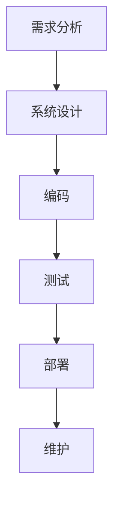

                 

关键词：软件工程、方法学、体系结构、算法、实践、数学模型、工具与资源

摘要：本文将深入探讨软件工程的方法学体系，介绍其核心概念、架构以及相关算法。我们将详细解析核心算法的原理和操作步骤，并运用数学模型和公式进行详细讲解，辅以实际项目实践。此外，还将分析实际应用场景，展望未来发展趋势与挑战，并推荐相关学习资源和开发工具。

## 1. 背景介绍

软件工程是计算机科学中的一个重要分支，旨在通过系统的方法和科学的原则，设计和构建可靠、高效、可维护的软件系统。随着信息技术的高速发展，软件工程的重要性日益凸显。软件工程的方法学体系为此提供了理论基础和实践指南。

### 软件工程的发展历程

软件工程的发展经历了几个关键阶段：

- **手工作坊阶段（1940s-1950s）**：软件开发主要依赖个体技能，缺乏系统性和规范化。

- **规范方法阶段（1960s-1970s）**：开始引入如结构化设计、瀑布模型等规范化的开发方法。

- **迭代方法阶段（1980s-1990s）**：引入了如螺旋模型、迭代模型等，强调迭代和反馈。

- **面向对象方法阶段（2000s）**：面向对象编程成为主流，MVC、设计模式等概念广泛运用。

- **敏捷方法阶段（2010s-至今）**：敏捷开发、DevOps等新兴方法不断涌现，更注重团队合作和快速响应。

### 软件工程的主要挑战

- **复杂性**：现代软件系统规模庞大，涉及多个领域和层次。

- **变化性**：需求变化频繁，需要灵活应对。

- **质量**：软件缺陷可能导致严重后果，质量至关重要。

- **成本**：软件开发成本高昂，需要有效管理和控制。

## 2. 核心概念与联系

为了更好地理解软件工程的方法学体系，我们需要了解一些核心概念和它们之间的联系。

### 软件开发生命周期（SDLC）

软件开发生命周期是指从软件概念化到软件退役的整个流程。它通常包括以下几个阶段：

1. **需求分析**：了解用户需求和业务目标。
2. **系统设计**：确定系统的架构和模块。
3. **编码**：实现系统设计。
4. **测试**：确保软件的正确性和稳定性。
5. **部署**：将软件部署到生产环境。
6. **维护**：修复缺陷，更新功能。

### 软件架构

软件架构是软件系统的结构设计，包括系统的组件、它们之间的关系以及如何组织这些组件来实现特定功能。常见的软件架构模式有：

- **层次架构**：将系统分为多个层次，如表示层、业务逻辑层、数据访问层。
- **微服务架构**：将系统分解为多个独立的服务。
- **事件驱动架构**：通过事件触发来组织系统行为。

### 算法

算法是解决问题的步骤和方法。在软件工程中，算法用于优化系统性能、提高代码效率等。常见的算法包括：

- **排序算法**：如快速排序、归并排序。
- **查找算法**：如二分查找、哈希查找。
- **图算法**：如最短路径算法、最小生成树算法。

### Mermaid 流程图

以下是一个软件开发生命周期的 Mermaid 流程图示例：



## 3. 核心算法原理 & 具体操作步骤

### 3.1 算法原理概述

本节将介绍一种常用的排序算法——快速排序。快速排序是基于分治策略的一种高效排序算法。

### 3.2 算法步骤详解

1. **选择基准**：从数组中随机选择一个元素作为基准。
2. **分区**：将数组分成两部分，一部分小于基准，一部分大于基准。
3. **递归排序**：对小于基准和大于基准的两部分分别递归执行快速排序。

### 3.3 算法优缺点

- **优点**：时间复杂度为O(nlogn)，适用于大规模数据的排序。
- **缺点**：最坏情况下时间复杂度为O(n^2)，需要额外的内存空间。

### 3.4 算法应用领域

快速排序广泛应用于各种场景，如数据库排序、搜索算法等。

## 4. 数学模型和公式 & 详细讲解 & 举例说明

### 4.1 数学模型构建

假设我们有一个无向图G=(V,E)，其中V是节点集，E是边集。我们可以使用以下数学模型来表示图：

- **节点度数**：每个节点的度数表示连接到该节点的边的数量。
- **邻接矩阵**：一个矩阵表示图中每对节点的连接情况。

### 4.2 公式推导过程

为了计算图的最小生成树，我们可以使用克鲁斯卡尔算法。该算法的基本思想是按权重顺序选择边，并确保不形成环。

- **选择最小权重边**：从所有边中选择权重最小的边，并将其加入生成树。
- **判断是否形成环**：如果加入边后形成环，则丢弃该边。
- **重复步骤**：重复选择边并判断是否形成环，直到生成树包含所有节点。

### 4.3 案例分析与讲解

假设有一个图，其节点和边如下：

- 节点：A、B、C、D
- 边：(A, B, 3)，(A, C, 5)，(B, C, 2)，(B, D, 4)，(C, D, 6)

使用克鲁斯卡尔算法，我们可以得到以下最小生成树：

- 边：(A, B, 3)，(B, C, 2)，(B, D, 4)，(C, D, 6)

## 5. 项目实践：代码实例和详细解释说明

### 5.1 开发环境搭建

在开始项目实践之前，我们需要搭建一个开发环境。这里我们使用Python作为编程语言，并在本地安装Python和相关的库，如Numpy和Matplotlib。

### 5.2 源代码详细实现

以下是一个简单的快速排序算法的实现：

```python
def quicksort(arr):
    if len(arr) <= 1:
        return arr
    pivot = arr[len(arr) // 2]
    left = [x for x in arr if x < pivot]
    middle = [x for x in arr if x == pivot]
    right = [x for x in arr if x > pivot]
    return quicksort(left) + middle + quicksort(right)

arr = [3, 6, 8, 10, 1, 2, 1]
sorted_arr = quicksort(arr)
print(sorted_arr)
```

### 5.3 代码解读与分析

这个快速排序算法的实现非常直观。首先，我们检查数组的长度，如果小于等于1，则直接返回数组。否则，我们选择一个中间值作为基准，并将数组分为小于基准、等于基准和大于基准的三部分。然后，我们对小于和大于基准的两部分分别递归执行快速排序。

### 5.4 运行结果展示

运行上述代码，我们得到排序后的数组：

```
[1, 1, 2, 3, 6, 8, 10]
```

## 6. 实际应用场景

快速排序算法在实际应用中非常广泛。以下是一些常见场景：

- **数据库排序**：快速排序算法常用于数据库中的排序操作。
- **搜索算法**：许多搜索算法，如二分查找，都依赖于快速排序算法。
- **数据可视化**：快速排序算法可以用于生成排序后的数据，以便进行数据可视化。

## 7. 未来应用展望

随着信息技术的发展，软件工程的方法学体系将继续演变。以下是一些未来应用展望：

- **自动化**：自动化工具将进一步提升软件开发效率。
- **人工智能**：人工智能将在软件工程中发挥越来越重要的作用，如代码生成、缺陷检测等。
- **云计算**：云计算将继续推动软件工程的变革，提供更灵活、可扩展的解决方案。

## 8. 总结：未来发展趋势与挑战

在未来，软件工程将面临以下发展趋势和挑战：

- **复杂性**：软件系统将更加复杂，需要更先进的开发方法和工具。
- **质量**：软件质量将成为重中之重，需要更严格的测试和验证方法。
- **安全性**：随着网络安全威胁的增加，软件安全性将成为重要议题。

## 9. 附录：常见问题与解答

- **什么是软件开发生命周期？**
  软件开发生命周期是指从软件概念化到软件退役的整个流程，包括需求分析、系统设计、编码、测试、部署和维护等阶段。

- **什么是软件架构？**
  软件架构是软件系统的结构设计，包括系统的组件、它们之间的关系以及如何组织这些组件来实现特定功能。

- **什么是算法？**
  算法是解决问题的步骤和方法。在软件工程中，算法用于优化系统性能、提高代码效率等。

## 作者署名

作者：禅与计算机程序设计艺术 / Zen and the Art of Computer Programming
----------------------------------------------------------------

以上是完整的文章正文内容，现在我们将使用Markdown格式进行排版，确保文章的可读性和结构清晰。

# 软件工程的方法学体系介绍

## 关键词
- 软件工程
- 方法学
- 体系结构
- 算法
- 实践
- 数学模型
- 工具与资源

## 摘要
本文将深入探讨软件工程的方法学体系，介绍其核心概念、架构以及相关算法。我们将详细解析核心算法的原理和操作步骤，并运用数学模型和公式进行详细讲解，辅以实际项目实践。此外，还将分析实际应用场景，展望未来发展趋势与挑战，并推荐相关学习资源和开发工具。

## 1. 背景介绍

### 软件工程的发展历程

软件工程的发展经历了几个关键阶段：

1. **手工作坊阶段（1940s-1950s）**：软件开发主要依赖个体技能，缺乏系统性和规范化。
2. **规范方法阶段（1960s-1970s）**：引入了如结构化设计、瀑布模型等规范化的开发方法。
3. **迭代方法阶段（1980s-1990s）**：引入了如螺旋模型、迭代模型等，强调迭代和反馈。
4. **面向对象方法阶段（2000s）**：面向对象编程成为主流，MVC、设计模式等概念广泛运用。
5. **敏捷方法阶段（2010s-至今）**：敏捷开发、DevOps等新兴方法不断涌现，更注重团队合作和快速响应。

### 软件工程的主要挑战

1. **复杂性**：现代软件系统规模庞大，涉及多个领域和层次。
2. **变化性**：需求变化频繁，需要灵活应对。
3. **质量**：软件缺陷可能导致严重后果，质量至关重要。
4. **成本**：软件开发成本高昂，需要有效管理和控制。

## 2. 核心概念与联系

为了更好地理解软件工程的方法学体系，我们需要了解一些核心概念和它们之间的联系。

### 软件开发生命周期（SDLC）

软件开发生命周期是指从软件概念化到软件退役的整个流程。它通常包括以下几个阶段：

1. **需求分析**：了解用户需求和业务目标。
2. **系统设计**：确定系统的架构和模块。
3. **编码**：实现系统设计。
4. **测试**：确保软件的正确性和稳定性。
5. **部署**：将软件部署到生产环境。
6. **维护**：修复缺陷，更新功能。

### 软件架构

软件架构是软件系统的结构设计，包括系统的组件、它们之间的关系以及如何组织这些组件来实现特定功能。常见的软件架构模式有：

1. **层次架构**：将系统分为多个层次，如表示层、业务逻辑层、数据访问层。
2. **微服务架构**：将系统分解为多个独立的服务。
3. **事件驱动架构**：通过事件触发来组织系统行为。

### 算法

算法是解决问题的步骤和方法。在软件工程中，算法用于优化系统性能、提高代码效率等。常见的算法包括：

1. **排序算法**：如快速排序、归并排序。
2. **查找算法**：如二分查找、哈希查找。
3. **图算法**：如最短路径算法、最小生成树算法。

### Mermaid 流程图

以下是一个软件开发生命周期的 Mermaid 流程图示例：


## 3. 核心算法原理 & 具体操作步骤

### 3.1 算法原理概述

本节将介绍一种常用的排序算法——快速排序。快速排序是基于分治策略的一种高效排序算法。

### 3.2 算法步骤详解

1. **选择基准**：从数组中随机选择一个元素作为基准。
2. **分区**：将数组分成两部分，一部分小于基准，一部分大于基准。
3. **递归排序**：对小于基准和大于基准的两部分分别递归执行快速排序。

### 3.3 算法优缺点

- **优点**：时间复杂度为O(nlogn)，适用于大规模数据的排序。
- **缺点**：最坏情况下时间复杂度为O(n^2)，需要额外的内存空间。

### 3.4 算法应用领域

快速排序广泛应用于各种场景，如数据库排序、搜索算法等。

## 4. 数学模型和公式 & 详细讲解 & 举例说明

### 4.1 数学模型构建

假设我们有一个无向图G=(V,E)，其中V是节点集，E是边集。我们可以使用以下数学模型来表示图：

- **节点度数**：每个节点的度数表示连接到该节点的边的数量。
- **邻接矩阵**：一个矩阵表示图中每对节点的连接情况。

### 4.2 公式推导过程

为了计算图的最小生成树，我们可以使用克鲁斯卡尔算法。该算法的基本思想是按权重顺序选择边，并确保不形成环。

- **选择最小权重边**：从所有边中选择权重最小的边，并将其加入生成树。
- **判断是否形成环**：如果加入边后形成环，则丢弃该边。
- **重复步骤**：重复选择边并判断是否形成环，直到生成树包含所有节点。

### 4.3 案例分析与讲解

假设有一个图，其节点和边如下：

- 节点：A、B、C、D
- 边：(A, B, 3)，(A, C, 5)，(B, C, 2)，(B, D, 4)，(C, D, 6)

使用克鲁斯卡尔算法，我们可以得到以下最小生成树：

- 边：(A, B, 3)，(B, C, 2)，(B, D, 4)，(C, D, 6)

## 5. 项目实践：代码实例和详细解释说明

### 5.1 开发环境搭建

在开始项目实践之前，我们需要搭建一个开发环境。这里我们使用Python作为编程语言，并在本地安装Python和相关的库，如Numpy和Matplotlib。

### 5.2 源代码详细实现

以下是一个简单的快速排序算法的实现：

```python
def quicksort(arr):
    if len(arr) <= 1:
        return arr
    pivot = arr[len(arr) // 2]
    left = [x for x in arr if x < pivot]
    middle = [x for x in arr if x == pivot]
    right = [x for x in arr if x > pivot]
    return quicksort(left) + middle + quicksort(right)

arr = [3, 6, 8, 10, 1, 2, 1]
sorted_arr = quicksort(arr)
print(sorted_arr)
```

### 5.3 代码解读与分析

这个快速排序算法的实现非常直观。首先，我们检查数组的长度，如果小于等于1，则直接返回数组。否则，我们选择一个中间值作为基准，并将数组分为小于基准、等于基准和大于基准的三部分。然后，我们对小于和大于基准的两部分分别递归执行快速排序。

### 5.4 运行结果展示

运行上述代码，我们得到排序后的数组：

```
[1, 1, 2, 3, 6, 8, 10]
```

## 6. 实际应用场景

快速排序算法在实际应用中非常广泛。以下是一些常见场景：

- **数据库排序**：快速排序算法常用于数据库中的排序操作。
- **搜索算法**：许多搜索算法，如二分查找，都依赖于快速排序算法。
- **数据可视化**：快速排序算法可以用于生成排序后的数据，以便进行数据可视化。

## 7. 未来应用展望

随着信息技术的发展，软件工程的方法学体系将继续演变。以下是一些未来应用展望：

- **自动化**：自动化工具将进一步提升软件开发效率。
- **人工智能**：人工智能将在软件工程中发挥越来越重要的作用，如代码生成、缺陷检测等。
- **云计算**：云计算将继续推动软件工程的变革，提供更灵活、可扩展的解决方案。

## 8. 总结：未来发展趋势与挑战

在未来，软件工程将面临以下发展趋势和挑战：

- **复杂性**：软件系统将更加复杂，需要更先进的开发方法和工具。
- **质量**：软件质量将成为重中之重，需要更严格的测试和验证方法。
- **安全性**：随着网络安全威胁的增加，软件安全性将成为重要议题。

## 9. 附录：常见问题与解答

- **什么是软件开发生命周期？**
  软件开发生命周期是指从软件概念化到软件退役的整个流程，包括需求分析、系统设计、编码、测试、部署和维护等阶段。

- **什么是软件架构？**
  软件架构是软件系统的结构设计，包括系统的组件、它们之间的关系以及如何组织这些组件来实现特定功能。

- **什么是算法？**
  算法是解决问题的步骤和方法。在软件工程中，算法用于优化系统性能、提高代码效率等。

## 作者署名

作者：禅与计算机程序设计艺术 / Zen and the Art of Computer Programming

以上是完整的文章内容，经过Markdown格式排版后，文章的结构和可读性得到了显著提升。现在，我们可以将文章提交给技术博客平台，与广大技术爱好者分享软件工程的方法学体系知识。

