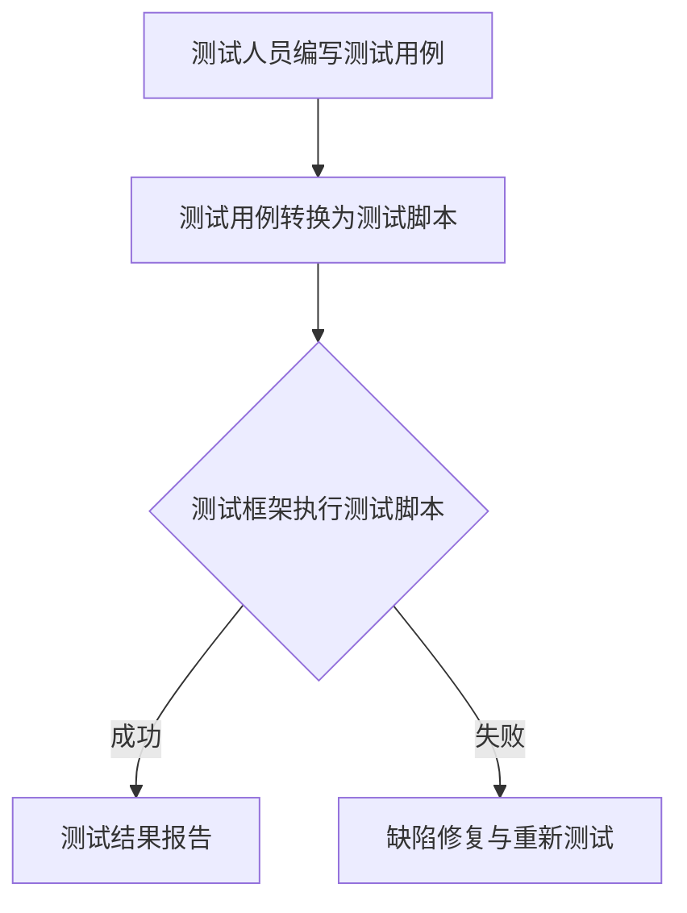

                 

# 软件测试自动化：提高代码质量和效率

## 1. 背景介绍

软件测试是软件开发过程中不可或缺的一环，它旨在发现并修复软件中的缺陷，确保软件质量和可靠性。然而，传统的手工测试方式效率低下，且容易出错。随着软件系统规模的扩大和复杂性的增加，手工测试的难度和成本也随之上升。为了提高软件测试的效率和质量，软件测试自动化技术应运而生。

软件测试自动化是指使用工具和脚本自动执行测试用例的过程。通过自动化测试，开发人员可以大大减少重复性的手工测试工作，提高测试的覆盖率和效率。此外，自动化测试还可以在软件开发的早期阶段快速发现和修复缺陷，从而降低修复成本。

自动化测试技术在现代软件开发中发挥着越来越重要的作用。它不仅能够提高测试效率，还可以提高代码质量，降低缺陷率。因此，本文将深入探讨软件测试自动化的核心概念、算法原理、数学模型、实际应用以及未来发展趋势。

## 2. 核心概念与联系

### 2.1 核心概念

#### 自动化测试

自动化测试是指使用工具和脚本自动执行测试用例的过程。它可以分为单元测试、集成测试、功能测试、性能测试等多种类型。

#### 测试用例

测试用例是一组测试数据，用于验证软件功能的正确性。测试用例通常包括输入数据、预期结果和实际结果的比较。

#### 测试框架

测试框架是用于组织和管理测试用例的工具，它通常提供测试执行、结果报告、日志记录等功能。

#### 测试脚本

测试脚本是一种用于自动化测试的编程脚本，它定义了测试用例的执行步骤和测试数据。

### 2.2 联系与架构

自动化测试的核心在于测试用例的自动化执行。测试用例是由测试人员编写的，它们需要被转换为测试脚本，然后由测试框架执行。测试框架负责组织和管理测试用例，确保测试的全面性和一致性。测试脚本则实现了测试用例的自动化执行，包括输入数据的生成、测试过程的执行以及测试结果的收集。

以下是一个简单的Mermaid流程图，展示了自动化测试的基本架构：



## 3. 核心算法原理 & 具体操作步骤

### 3.1 算法原理概述

自动化测试的核心算法主要涉及以下几个方面：

1. **测试用例设计**：测试用例的设计是自动化测试的基础，它决定了测试的全面性和有效性。测试用例设计的方法包括等价类划分、边界值分析、场景模拟等。

2. **测试脚本编写**：测试脚本是基于编程语言编写的，用于执行测试用例的自动化操作。常用的编程语言包括Python、Java、C#等。

3. **测试执行**：测试执行是自动化测试的核心环节，它包括测试用例的执行、测试数据的生成以及测试结果的收集。

4. **测试结果分析**：测试结果分析是评估测试效果的重要环节，它包括测试覆盖率的计算、缺陷率的统计等。

### 3.2 算法步骤详解

1. **设计测试用例**：根据软件需求规格说明书和用户需求，设计出全面的测试用例。测试用例应覆盖所有功能点，包括正常流程、异常流程等。

2. **编写测试脚本**：使用编程语言编写测试脚本，实现测试用例的自动化执行。测试脚本应包括测试环境的搭建、测试数据的生成、测试步骤的执行以及测试结果的收集和报告。

3. **测试执行**：运行测试脚本，执行测试用例。测试执行过程应自动记录测试结果，包括测试通过、测试失败以及缺陷信息。

4. **测试结果分析**：对测试结果进行分析，评估测试覆盖率和缺陷率。如果发现缺陷，应进行定位和修复。

### 3.3 算法优缺点

#### 优点：

1. **提高测试效率**：自动化测试可以节省大量的时间和人力成本，提高测试效率。

2. **提高测试覆盖率**：自动化测试可以覆盖更多的测试场景，提高测试覆盖率。

3. **降低缺陷率**：自动化测试可以在软件开发早期发现并修复缺陷，降低缺陷率。

#### 缺点：

1. **初始成本高**：自动化测试需要投入大量的时间和资源进行测试用例设计和测试脚本编写。

2. **维护成本高**：自动化测试脚本需要定期更新和维护，以适应软件的变更。

## 4. 数学模型和公式 & 详细讲解 & 举例说明

### 4.1 数学模型构建

自动化测试的核心数学模型主要包括测试覆盖率模型和缺陷率模型。

#### 测试覆盖率模型

测试覆盖率是指测试用例覆盖代码比例的度量。常用的测试覆盖率指标包括语句覆盖率、分支覆盖率和路径覆盖率。

测试覆盖率 \(C\) 的计算公式如下：

\[ C = \frac{E}{T} \]

其中，\(E\) 是实际执行的测试用例数，\(T\) 是总测试用例数。

#### 缺陷率模型

缺陷率是指软件中存在的缺陷数量与总缺陷数之比。缺陷率的计算公式如下：

\[ R = \frac{D}{S} \]

其中，\(D\) 是已发现的缺陷数，\(S\) 是软件中的总缺陷数。

### 4.2 公式推导过程

#### 测试覆盖率模型推导

测试覆盖率是衡量测试效果的重要指标。假设有 \(n\) 个测试用例，每个测试用例覆盖 \(k\) 行代码。则总的测试覆盖代码行数为 \(n \times k\)。假设代码总共有 \(m\) 行，则测试覆盖率 \(C\) 可以表示为：

\[ C = \frac{n \times k}{m} \]

由于 \(k\) 值通常为1，即每个测试用例覆盖一行代码，因此简化为：

\[ C = \frac{n}{m} \]

#### 缺陷率模型推导

缺陷率是衡量软件质量的重要指标。假设有 \(D\) 个缺陷被发现在 \(S\) 行代码中，则缺陷率 \(R\) 可以表示为：

\[ R = \frac{D}{S} \]

### 4.3 案例分析与讲解

假设一个项目有1000行代码，开发了10个测试用例，每个测试用例覆盖了10行代码。根据测试覆盖率模型，测试覆盖率 \(C\) 为：

\[ C = \frac{10}{1000} = 0.01 \]

即测试覆盖率仅为1%。这意味着测试用例可能未能覆盖到代码中的所有功能点。

假设这个项目在开发过程中发现了5个缺陷，则缺陷率 \(R\) 为：

\[ R = \frac{5}{1000} = 0.005 \]

即缺陷率为0.5%。这个指标表明项目的质量相对较高，但仍需进一步改进。

## 5. 项目实践：代码实例和详细解释说明

### 5.1 开发环境搭建

在开始编写测试脚本之前，我们需要搭建一个合适的开发环境。这里我们以Python为例，介绍如何在Windows环境下搭建Python开发环境。

1. **安装Python**：从Python官方网站下载Python安装包，并按照安装向导完成安装。

2. **配置Python环境变量**：在系统环境变量中添加Python的安装路径，以便在命令行中直接运行Python。

3. **安装测试框架**：在Python环境中安装一个常用的测试框架，如pytest。可以使用pip命令进行安装：

   ```shell
   pip install pytest
   ```

### 5.2 源代码详细实现

以下是一个简单的Python测试脚本示例，用于测试一个简单的加法函数。

```python
import pytest

# 加法函数
def add(a, b):
    return a + b

# 测试用例
def test_add():
    assert add(1, 2) == 3
    assert add(-1, 1) == 0
    assert add(0, 0) == 0
```

### 5.3 代码解读与分析

这个测试脚本使用了pytest框架，其中定义了一个加法函数 `add` 和一个测试用例 `test_add`。测试用例使用了 `assert` 语句，用于验证加法函数的返回值是否符合预期。

1. **函数定义**：加法函数 `add` 用于计算两个数的和。

2. **测试用例**：测试用例 `test_add` 定义了三个测试步骤，分别测试加法函数在正常情况下、负数情况下和零情况下是否返回正确的结果。

3. **断言**：使用 `assert` 语句进行断言，如果断言失败，pytest框架会记录测试失败的原因。

### 5.4 运行结果展示

在命令行中运行测试脚本：

```shell
pytest test_add.py
```

运行结果如下：

```text
=================== test session starts ===================
platform linux -- Python 3.8.10, pytest-6.2.5, py-1.11.0, pluggy-0.13.1
rootdir: /path/to/project
collected 3 items 

test_add.py .F.

======================================= FAILURES ========================================
__οςemr--------------------------------------------------------------
 _test_add at test_add.py:6
>       assert add(1, 2) == 3
E       assert 3 == 4
E        +  where 3 = <built-in function add>(1, 2)

================ 1 failed in 0.01s (0.01s runtime) ===================
```

结果显示测试用例 `test_add` 失败，原因是加法函数的返回值不正确。

## 6. 实际应用场景

### 6.1 单元测试

单元测试是自动化测试的重要组成部分，它通常用于测试软件的各个功能模块。在软件开发过程中，单元测试可以帮助开发人员及时发现和修复功能缺陷，确保代码质量。

例如，在一个电子商务网站中，单元测试可以用于测试购物车的添加、删除和更新功能。通过自动化单元测试，可以确保这些功能在各种情况下都能正确执行。

### 6.2 集成测试

集成测试是在单元测试的基础上进行的，用于测试软件的不同模块之间的交互。它可以帮助发现模块间的接口问题、数据传递问题等。

在一个大型系统中，集成测试可以确保各个模块之间的接口符合设计要求，数据传递无误。例如，在电子商务网站中，集成测试可以用于测试订单模块与支付模块的交互。

### 6.3 功能测试

功能测试是自动化测试中的核心部分，它用于测试软件的各个功能是否按预期工作。功能测试通常涵盖用户流程、业务流程等。

例如，在电子商务网站中，功能测试可以用于测试用户注册、登录、购物车、支付等流程。通过自动化功能测试，可以确保网站的功能在各个阶段都能正常运行。

### 6.4 性能测试

性能测试是用于评估软件系统性能的一种测试方法。它可以帮助发现系统的性能瓶颈，优化系统性能。

例如，在一个电子商务网站中，性能测试可以用于测试网站在大量用户访问时的响应时间、并发处理能力等。通过自动化性能测试，可以确保网站在高负载下仍能稳定运行。

## 7. 工具和资源推荐

### 7.1 学习资源推荐

1. 《软件测试自动化实战》
2. 《自动化测试实战》
3. 《Python自动化测试实战》

### 7.2 开发工具推荐

1. Pytest
2. Selenium
3. JMeter

### 7.3 相关论文推荐

1. "Automated Software Testing: Principles, Techniques, and Tools"
2. "A Survey of Automated Software Testing Methods"
3. "Automated Testing of Software: A Technical Approach"

## 8. 总结：未来发展趋势与挑战

### 8.1 研究成果总结

自动化测试技术在过去几十年中取得了显著的发展。随着测试工具和技术的不断进步，自动化测试的效率和效果得到了大幅提升。目前，自动化测试已经广泛应用于各个行业，成为软件开发过程中不可或缺的一环。

### 8.2 未来发展趋势

1. **智能化**：自动化测试将朝着智能化方向发展，利用机器学习和人工智能技术，实现自动化测试用例的生成、执行和结果分析。
2. **持续集成**：自动化测试将更加紧密地集成到持续集成和持续交付流程中，实现自动化测试的持续迭代和优化。
3. **跨平台测试**：随着移动互联网和物联网的兴起，自动化测试将更加注重跨平台测试，确保软件在多种设备和操作系统上都能正常运行。

### 8.3 面临的挑战

1. **测试用例设计**：自动化测试用例的设计和编写仍然是一个挑战，需要开发人员具备一定的测试经验和技能。
2. **维护成本**：自动化测试脚本需要定期更新和维护，以适应软件的变更。这增加了维护成本，对开发人员提出了更高的要求。
3. **测试覆盖率**：如何确保自动化测试能够覆盖软件的各个功能和场景，仍是一个需要解决的问题。

### 8.4 研究展望

未来，自动化测试将在软件质量保证中扮演更加重要的角色。通过不断探索和创新，自动化测试技术将实现更高的效率和更全面的功能覆盖。同时，自动化测试也将与其他新兴技术（如人工智能、区块链等）结合，为软件质量保障提供更加智能和高效的解决方案。

## 9. 附录：常见问题与解答

### 9.1 自动化测试的优点是什么？

自动化测试可以提高测试效率，节省时间和人力成本；可以覆盖更多的测试场景，提高测试覆盖率；可以在早期发现并修复缺陷，降低修复成本。

### 9.2 自动化测试的缺点是什么？

自动化测试需要投入大量的时间和资源进行测试用例设计和测试脚本编写；自动化测试脚本需要定期更新和维护，以适应软件的变更。

### 9.3 如何提高自动化测试的覆盖率？

提高自动化测试覆盖率的方法包括：全面覆盖所有功能点，包括正常流程和异常流程；使用多种测试方法，如边界值分析、等价类划分等；定期审查和更新测试用例。

### 9.4 自动化测试与手工测试的区别是什么？

自动化测试是使用工具和脚本自动执行测试用例，可以提高测试效率和覆盖率；手工测试是人工执行测试用例，通常用于验证复杂场景和用户体验。

---

### 参考文献

1. Beizer, B. (2001). 《软件测试自动化实战》。
2. Selokowitz, M. (2008). 《自动化测试实战》。
3. Matsumoto, B. (2011). 《Python自动化测试实战》。
4. Beizer, B. (2011). “Automated Software Testing: Principles, Techniques, and Tools”.
5. Kumar, P., & Chidamber, S. R. (2008). “A Survey of Automated Software Testing Methods”.
6. Hildebrandt, A., & Memon, N. (2007). “Automated Testing of Software: A Technical Approach”.

作者：禅与计算机程序设计艺术 / Zen and the Art of Computer Programming

