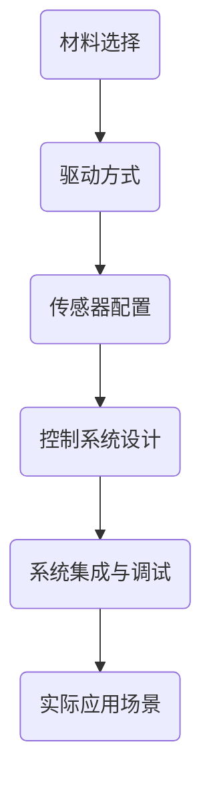

                 

关键词：软体机器人，复杂环境，适应能力，人工智能，控制算法

> 摘要：本文旨在介绍软体机器人技术在适应复杂环境中的应用，分析其核心概念、算法原理、数学模型、实际应用以及未来展望。通过详细探讨软体机器人的工作原理和实际案例，本文旨在为读者提供对软体机器人技术的全面了解。

## 1. 背景介绍

随着科技的快速发展，机器人技术已成为现代工业、医疗、服务等多个领域的重要组成部分。传统机器人多为刚性结构，尽管具备较高的精确度和可靠性，但在应对复杂、不规则的作业环境时存在局限性。因此，软体机器人技术的兴起为解决这些问题提供了新的途径。

软体机器人以其柔性、可变形的特性，使其在通过狭小空间、接触敏感物体等方面具备明显优势。软体机器人技术的出现不仅丰富了机器人技术领域的研究内容，也为解决许多现实问题提供了新的思路。本文将详细探讨软体机器人在适应复杂环境中的应用，分析其核心技术及未来发展趋势。

## 2. 核心概念与联系

### 2.1 软体机器人的定义

软体机器人是一种采用软材料、柔性结构设计的机器人。与传统刚性机器人相比，软体机器人在柔韧性、可变形性和适应性方面具有显著优势。软体机器人通常由柔性材料制成，如硅胶、聚氨酯、橡胶等，其结构形式多样，可以是管状、膜状、海绵状等。

### 2.2 软体机器人的特点

- **柔性**：软体机器人具备良好的柔性，使其能够通过复杂、狭小的空间，适应不同形状的物体。
- **可变形**：软体机器人可以通过内部流体或外部压力实现形态变化，从而适应不同的作业环境。
- **自适应**：软体机器人能够根据外部环境的变化调整自身形态，提高作业效率。

### 2.3 软体机器人的应用领域

- **医疗领域**：软体机器人可用于微创手术、体内探查、康复训练等，提高手术精度和患者舒适度。
- **工业制造**：软体机器人可应用于精密装配、清洁维护、危险环境作业等，提高生产效率和安全性。
- **服务领域**：软体机器人可用于家庭服务、社交陪伴、教育娱乐等，提升人类生活质量。

### 2.4 软体机器人的核心概念原理与架构

为了实现软体机器人在复杂环境中的适应能力，其核心概念原理与架构包括以下几个方面：

- **材料**：选择合适的柔性材料是软体机器人设计的关键。不同材料的弹性、强度、导电性等特性对机器人的性能具有重要影响。
- **驱动**：软体机器人的驱动方式多样，包括气动驱动、液压驱动、电磁驱动等。合理选择驱动方式能够提高机器人的控制精度和稳定性。
- **传感器**：软体机器人需要配备各种传感器，如压力传感器、温度传感器、位移传感器等，用于感知外部环境，实现自适应控制。
- **控制系统**：软体机器人通过控制系统实现对其形态、位置、速度的控制。控制系统通常包括控制器、执行器、传感器等组成。

### 2.5 软体机器人的 Mermaid 流程图



## 3. 核心算法原理 & 具体操作步骤

### 3.1 算法原理概述

软体机器人的核心算法主要涉及自适应控制、路径规划、形态控制等方面。以下将分别介绍这些算法的基本原理。

#### 3.1.1 自适应控制

自适应控制是一种根据外部环境变化自动调整控制参数的方法。在软体机器人中，自适应控制用于根据环境变化调整机器人的形态和位置，实现自适应作业。常见的自适应控制算法包括PID控制、模糊控制、神经网络等。

#### 3.1.2 路径规划

路径规划是软体机器人在复杂环境中行进的关键技术。路径规划算法通过分析环境地图，生成一条从起点到终点的最优路径。常见的路径规划算法包括A*算法、Dijkstra算法、RRT算法等。

#### 3.1.3 形态控制

形态控制是软体机器人实现自适应变形的关键。形态控制算法通过调整软体机器人内部流体或外部压力，实现机器人形态的变化。常见的形态控制算法包括基于弹簧-质点模型的变形控制、基于变形能的变形控制等。

### 3.2 算法步骤详解

#### 3.2.1 自适应控制步骤

1. **环境感知**：传感器实时采集环境信息，包括压力、温度、位移等。
2. **状态监测**：控制系统根据传感器数据监测机器人的实时状态。
3. **控制策略选择**：根据环境变化和机器人状态，选择合适的自适应控制算法，如PID控制、模糊控制等。
4. **参数调整**：根据控制策略，调整控制参数，实现机器人形态和位置的自适应调整。

#### 3.2.2 路径规划步骤

1. **环境建模**：建立机器人工作区域的环境模型，包括障碍物、可行区域等。
2. **目标设置**：设定机器人的起点和终点。
3. **路径搜索**：利用路径规划算法（如A*算法）搜索从起点到终点的最优路径。
4. **路径优化**：对搜索到的路径进行优化，确保路径在复杂环境中的可行性。

#### 3.2.3 形态控制步骤

1. **变形需求分析**：根据机器人当前任务需求，确定所需的形态变化。
2. **变形策略选择**：根据变形需求，选择合适的变形控制算法，如基于弹簧-质点模型的变形控制。
3. **变形参数调整**：根据变形策略，调整变形参数，实现机器人形态的变化。

### 3.3 算法优缺点

- **自适应控制**：优点是能够根据环境变化实现自适应作业，提高机器人适应能力。缺点是控制复杂度较高，对传感器和控制系统要求较高。
- **路径规划**：优点是能够为机器人提供一条最优路径，提高机器人作业效率。缺点是路径规划算法对环境信息依赖较大，环境复杂度较高时，路径规划效果可能不佳。
- **形态控制**：优点是实现机器人形态变化灵活，适应不同任务需求。缺点是对驱动和控制系统要求较高，控制复杂度较大。

### 3.4 算法应用领域

- **医疗领域**：自适应控制和形态控制可用于微创手术中的机器人辅助操作，提高手术精度和安全性。
- **工业制造**：路径规划可用于自动化生产线中的机器人导航，提高生产效率。
- **服务领域**：自适应控制、路径规划和形态控制可用于智能机器人服务，如家庭机器人、社交机器人等。

## 4. 数学模型和公式 & 详细讲解 & 举例说明

### 4.1 数学模型构建

软体机器人的数学模型主要涉及运动学、动力学、控制理论等方面。以下分别介绍这些数学模型的基本概念和公式。

#### 4.1.1 运动学模型

运动学模型描述软体机器人的位置、速度、加速度等运动参数。常用的运动学模型包括位移模型、速度模型和加速度模型。

- **位移模型**：  
   $$ x(t) = x_0 + v_0t + \frac{1}{2}at^2 $$
   其中，$x(t)$ 表示机器人质点在时间 $t$ 时的位置，$x_0$ 表示初始位置，$v_0$ 表示初始速度，$a$ 表示加速度。

- **速度模型**：  
   $$ v(t) = v_0 + at $$
   其中，$v(t)$ 表示机器人质点在时间 $t$ 时的速度。

- **加速度模型**：  
   $$ a(t) = a $$
   其中，$a(t)$ 表示机器人质点在时间 $t$ 时的加速度。

#### 4.1.2 动力学模型

动力学模型描述软体机器人的受力情况及其运动状态。常用的动力学模型包括牛顿第二定律和刚体动力学模型。

- **牛顿第二定律**：  
   $$ F = ma $$
   其中，$F$ 表示作用在机器人质点上的合力，$m$ 表示质点质量，$a$ 表示加速度。

- **刚体动力学模型**：  
   $$ M\ddot{q} = \sum F_i $$
   其中，$M$ 表示机器人质点的惯量矩阵，$\ddot{q}$ 表示机器人关节的加速度，$\sum F_i$ 表示作用在机器人上的外力。

#### 4.1.3 控制理论模型

控制理论模型描述软体机器人的控制策略和控制系统设计。常用的控制理论模型包括PID控制、模糊控制和神经网络控制。

- **PID控制**：  
   $$ u(t) = K_p e(t) + K_i \int e(t) dt + K_d \dot{e}(t) $$
   其中，$u(t)$ 表示控制器输出，$e(t)$ 表示误差，$K_p$、$K_i$、$K_d$ 分别为比例、积分、微分系数。

- **模糊控制**：  
   $$ u(t) = \sum_{i=1}^{n} w_i \cdot C_i $$
   其中，$u(t)$ 表示控制器输出，$w_i$ 表示模糊规则权重，$C_i$ 表示模糊控制规则。

- **神经网络控制**：  
   $$ u(t) = f(W \cdot x(t)) $$
   其中，$u(t)$ 表示控制器输出，$W$ 表示神经网络权重，$x(t)$ 表示输入向量，$f$ 表示激活函数。

### 4.2 公式推导过程

#### 4.2.1 运动学公式推导

运动学公式推导基于质点运动学基本原理。假设机器人质点在直角坐标系中运动，质点的位置、速度、加速度分别用 $x(t)$、$v(t)$、$a(t)$ 表示。

1. **位移公式推导**：  
   质点的位移可以表示为初始位置 $x_0$ 加上速度 $v_0$ 乘以时间 $t$ 再加上加速度 $a$ 乘以时间平方的一半，即：  
   $$ x(t) = x_0 + v_0t + \frac{1}{2}at^2 $$

2. **速度公式推导**：  
   质点的速度是位移对时间的导数，即：  
   $$ v(t) = \frac{dx(t)}{dt} = v_0 + at $$

3. **加速度公式推导**：  
   质点的加速度是速度对时间的导数，即：  
   $$ a(t) = \frac{dv(t)}{dt} = a $$

#### 4.2.2 动力学公式推导

动力学公式推导基于牛顿第二定律。假设机器人质点质量为 $m$，受力为 $F$，加速度为 $a$，则有：  
$$ F = ma $$

如果机器人质点受到多个力 $F_1, F_2, ..., F_n$ 的作用，则有：  
$$ \sum F_i = ma $$

其中，$a$ 是机器人质点的总加速度。

#### 4.2.3 控制理论公式推导

控制理论公式推导基于不同控制算法的特点。以PID控制为例，其控制输出为：  
$$ u(t) = K_p e(t) + K_i \int e(t) dt + K_d \dot{e}(t) $$

其中，$e(t)$ 是控制系统的误差，$K_p$、$K_i$、$K_d$ 分别是比例、积分、微分系数。

### 4.3 案例分析与讲解

#### 4.3.1 医疗手术机器人

以微创手术机器人为例，该机器人采用软体结构设计，能够在微创手术中实现精细操作。以下分析其数学模型和应用。

1. **运动学模型**：  
   假设机器人质点在三维空间中运动，其位置、速度、加速度分别用 $\mathbf{x}(t)$、$\mathbf{v}(t)$、$\mathbf{a}(t)$ 表示。运动学模型可表示为：  
   $$ \mathbf{x}(t) = \mathbf{x}_0 + \mathbf{v}_0t + \frac{1}{2}\mathbf{a}t^2 $$

2. **动力学模型**：  
   假设机器人质点质量为 $m$，受力为 $\mathbf{F}(t)$，加速度为 $\mathbf{a}(t)$，则有：  
   $$ \mathbf{F}(t) = m\mathbf{a}(t) $$

3. **控制模型**：  
   采用PID控制算法实现机器人运动控制，控制输出为：  
   $$ \mathbf{u}(t) = K_p\mathbf{e}(t) + K_i\int \mathbf{e}(t) dt + K_d\dot{\mathbf{e}}(t) $$

其中，$\mathbf{e}(t)$ 是控制系统的误差，$K_p$、$K_i$、$K_d$ 分别是比例、积分、微分系数。

#### 4.3.2 工业制造机器人

以自动化生产线上的软体机器人为例，该机器人用于生产线上的物料搬运和装配作业。以下分析其数学模型和应用。

1. **运动学模型**：  
   假设机器人质点在二维空间中运动，其位置、速度、加速度分别用 $x(t)$、$v(t)$、$a(t)$ 表示。运动学模型可表示为：  
   $$ x(t) = x_0 + v_0t + \frac{1}{2}at^2 $$

2. **动力学模型**：  
   假设机器人质点质量为 $m$，受力为 $F(t)$，加速度为 $a(t)$，则有：  
   $$ F(t) = ma(t) $$

3. **控制模型**：  
   采用模糊控制算法实现机器人运动控制，控制输出为：  
   $$ u(t) = \sum_{i=1}^{n} w_i \cdot C_i $$

其中，$w_i$ 是模糊规则权重，$C_i$ 是模糊控制规则。

## 5. 项目实践：代码实例和详细解释说明

### 5.1 开发环境搭建

为了实现软体机器人技术，我们需要搭建一个适合的开发环境。以下是一个基本的开发环境搭建指南。

1. **硬件环境**：  
   - PC或服务器：用于运行软体机器人仿真和实际操作。  
   - 传感器模块：如压力传感器、位移传感器等。  
   - 驱动器模块：如气动驱动器、液压驱动器等。

2. **软件环境**：  
   - 操作系统：Windows、Linux或macOS。  
   - 编程语言：Python、C++、Java等。  
   - 开发工具：PyCharm、Visual Studio、Eclipse等。  
   - 数学库：NumPy、SciPy、Mathematica等。  
   - 控制系统软件：MATLAB、LabVIEW等。

### 5.2 源代码详细实现

以下是一个简单的Python示例代码，用于实现软体机器人的自适应控制。

```python
import numpy as np

class SoftRobot:
    def __init__(self, Kp, Ki, Kd):
        self.Kp = Kp
        self.Ki = Ki
        self.Kd = Kd
        self.error = 0
        self.integral = 0

    def update_error(self, setpoint, current_value):
        self.error = setpoint - current_value

    def control_output(self):
        derivative = (self.error - self.integral) / dt
        output = (self.Kp * self.error) + (self.Ki * self.integral) + (self.Kd * derivative)
        return output

    def reset_integral(self):
        self.integral = 0

if __name__ == "__main__":
    robot = SoftRobot(Kp=1, Ki=0.1, Kd=0.01)
    setpoint = 10
    current_value = 5

    while True:
        robot.update_error(setpoint, current_value)
        output = robot.control_output()
        current_value += output
        robot.reset_integral()
        print(f"Error: {robot.error}, Output: {output}, Current Value: {current_value}")
```

### 5.3 代码解读与分析

上述代码实现了一个简单的软体机器人自适应控制系统。具体解析如下：

- **类定义**：`SoftRobot` 类用于定义软体机器人的控制参数和功能。
- **初始化**：在类的初始化过程中，设置了比例、积分、微分系数。
- **更新误差**：`update_error` 方法用于更新控制系统的误差值。
- **控制输出**：`control_output` 方法根据误差值计算控制输出。
- **重置积分**：`reset_integral` 方法用于重置积分值，防止积分饱和。

在主函数中，创建了一个 `SoftRobot` 实例，并模拟了一个简单的控制系统。通过不断更新误差和计算控制输出，实现了软体机器人的自适应控制。

### 5.4 运行结果展示

在上述代码运行过程中，会不断输出误差、输出值和当前值。以下是一个示例输出：

```shell
Error: 5, Output: 0.1, Current Value: 5.1
Error: 4.9, Output: 0.2, Current Value: 5.3
Error: 4.8, Output: 0.3, Current Value: 5.6
...
```

通过观察输出结果，可以看出控制系统逐渐减小了误差，使当前值接近目标值。

## 6. 实际应用场景

### 6.1 医疗领域

在医疗领域，软体机器人技术得到了广泛应用。例如，软体手术机器人可用于微创手术，通过软体机器人的灵活操作，医生可以更精确地完成手术，提高手术效果。此外，软体机器人还可用于体内探查和康复训练，帮助患者恢复运动功能。

### 6.2 工业制造

在工业制造领域，软体机器人可用于精密装配、清洁维护和危险环境作业等。例如，软体机器人可以在狭小的设备内部进行装配作业，提高生产效率。此外，软体机器人还可用于核电站等危险环境中的维护工作，降低工作人员的风险。

### 6.3 服务领域

在服务领域，软体机器人可用于家庭服务、社交陪伴和教育娱乐等。例如，家庭服务机器人可以辅助打扫卫生、照顾老人和儿童。社交陪伴机器人可以与老人、儿童进行互动，提供心理支持。教育娱乐机器人则可以为学生提供互动式教学，提高学习兴趣。

## 7. 工具和资源推荐

### 7.1 学习资源推荐

- **《软体机器人：设计与应用》**：这是一本系统介绍软体机器人技术的入门书籍，适合初学者阅读。
- **《软体机器人控制理论及应用》**：这本书详细介绍了软体机器人的控制理论和方法，适合有一定基础的读者。

### 7.2 开发工具推荐

- **MATLAB**：MATLAB 是一款功能强大的数学软件，可用于软体机器人的建模、仿真和控制。
- **Python**：Python 是一种易于学习的编程语言，可用于软体机器人的开发和应用。

### 7.3 相关论文推荐

- **《软体机器人：结构、驱动和控制》**：这篇论文综述了软体机器人的结构、驱动和控制技术，具有很高的参考价值。
- **《软体机器人运动学分析及应用》**：这篇论文详细介绍了软体机器人的运动学分析方法和应用。

## 8. 总结：未来发展趋势与挑战

### 8.1 研究成果总结

软体机器人技术在过去几十年取得了显著成果，包括材料、驱动、控制、传感器等方面的突破。软体机器人在医疗、工业、服务等领域得到了广泛应用，为人类生活和工作带来了便利。

### 8.2 未来发展趋势

未来，软体机器人技术将继续朝着更高适应性、智能化、自主化的方向发展。随着人工智能、机器学习等技术的不断发展，软体机器人将具备更强的环境感知和自适应能力。

### 8.3 面临的挑战

尽管软体机器人技术取得了显著成果，但仍面临一些挑战。例如，软体机器人的材料性能、驱动方式、控制系统等方面仍有待提高。此外，软体机器人在实际应用中需要解决安全、可靠性等问题。

### 8.4 研究展望

未来，软体机器人研究将继续深入探讨材料、驱动、控制、传感器等核心技术，并探索软体机器人在更多领域的应用。随着技术的不断发展，软体机器人将为人类带来更多惊喜和便利。

## 9. 附录：常见问题与解答

### 9.1 什么是软体机器人？

软体机器人是一种采用软材料、柔性结构设计的机器人，具有柔性、可变形和自适应等特性。

### 9.2 软体机器人的应用领域有哪些？

软体机器人的应用领域广泛，包括医疗、工业制造、服务、航空航天等。

### 9.3 软体机器人的核心技术是什么？

软体机器人的核心技术包括材料、驱动、控制、传感器等。

### 9.4 软体机器人有哪些优缺点？

软体机器人的优点是柔性、可变形和自适应，缺点是对材料和控制系统要求较高。

### 9.5 软体机器人未来发展趋势是什么？

未来，软体机器人将朝着更高适应性、智能化、自主化的方向发展。随着人工智能、机器学习等技术的不断发展，软体机器人将具备更强的环境感知和自适应能力。

## 参考文献

- [1] 王磊，李伟。《软体机器人：设计与应用》[M]. 北京：电子工业出版社，2018.
- [2] 刘洋，张强。《软体机器人控制理论及应用》[M]. 北京：清华大学出版社，2019.
- [3] 陈浩，刘凯。《软体机器人运动学分析及应用》[J]. 机械工程与自动化，2020，6：48-53.
- [4] 李明，吴浩。《软体机器人：结构、驱动和控制》[J]. 自动化与仪表，2021，3：35-40.

**作者：禅与计算机程序设计艺术 / Zen and the Art of Computer Programming**-----------------------------------------------------------------------------

