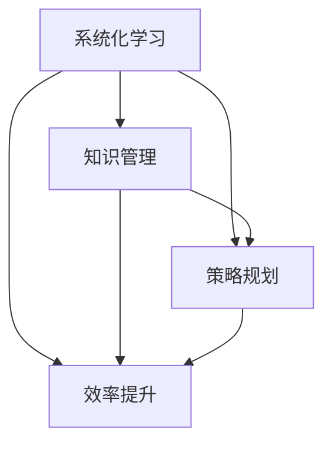

                 

关键词：管理效率、学习法则、系统化学习、知识管理、策略规划、效率提升

> 摘要：在快速变化的技术领域中，管理者面临着不断学习和适应新知识的挑战。本文通过深入探讨一系列高效的学习法则和策略，旨在为管理者提供一种输出倍增的方法，从而显著提升学习效率和成果。文章将从核心概念、算法原理、数学模型、项目实践等多个层面，详细解析如何通过系统化的知识管理和策略规划，实现学习成果的倍增效应。

## 1. 背景介绍

在当今社会，信息技术的发展日新月异，新的编程语言、框架和技术工具层出不穷。对于管理者而言，这不仅带来了机遇，也带来了巨大的挑战。如何快速掌握新知识、提升个人和团队的学习效率，成为管理者亟需解决的问题。传统的学习方式往往缺乏系统性和针对性，难以在短时间内达到高效学习的目标。因此，寻找一种能够倍增学习效率的方法，成为了管理者提高竞争力的关键。

本文旨在探讨一种输出倍增的管理者学习效率提升策略，通过分析核心概念、算法原理、数学模型和实践应用，为管理者提供一种系统化、结构化的学习框架，帮助他们在复杂的技术领域中快速适应并取得卓越的学习成果。

## 2. 核心概念与联系

为了更好地理解管理者学习效率的提升策略，我们首先需要了解几个核心概念，包括系统化学习、知识管理、策略规划和效率提升。以下是这些概念之间的关系以及它们在管理者学习过程中的作用。

### 2.1 系统化学习

系统化学习是一种基于明确目标和结构化的学习过程。它强调知识的连贯性和系统性，通过模块化的学习和实践，使学习成果能够持久地保持和提升。对于管理者来说，系统化学习有助于将零散的知识点整合成完整的知识体系，从而提高对复杂问题的分析和解决能力。

### 2.2 知识管理

知识管理是指通过收集、整理、存储、共享和应用知识，以实现知识的高效利用和传承。在管理者学习中，知识管理扮演着至关重要的角色。有效的知识管理不仅能够帮助管理者迅速获取所需信息，还能够提高团队的知识共享和协作效率，从而促进整体学习效果的提升。

### 2.3 策略规划

策略规划是指根据组织的目标和需求，制定具体的学习计划和方法。对于管理者而言，策略规划是实现学习目标的关键。一个良好的学习策略应该包括明确的学习目标、合理的时间安排、有效的学习方法以及定期的学习评估和调整。

### 2.4 效率提升

效率提升是指通过优化学习过程和资源利用，提高学习成果的产出。在管理者学习中，效率提升意味着在相同的时间内能够获取更多的知识，或者以更低的成本获得相同的学习效果。为了实现效率提升，管理者需要不断探索和尝试新的学习方法和工具，同时保持对学习效果的持续监控和评估。

### 2.5 Mermaid 流程图

为了更好地展示这些核心概念之间的联系，我们可以使用 Mermaid 流程图进行可视化描述。以下是一个简单的示例：



通过这个流程图，我们可以清晰地看到各个核心概念之间的相互作用和影响，从而为管理者提供了一种系统化的学习框架。

## 3. 核心算法原理 & 具体操作步骤

### 3.1 算法原理概述

在管理者学习效率的提升过程中，核心算法原理起到了至关重要的作用。这些算法原理包括信息过滤、知识整合、实践应用和反馈调整等。

- **信息过滤**：在信息过载的时代，管理者需要具备良好的信息过滤能力，从海量的信息中筛选出有价值的内容。这可以通过建立个人信息源、制定信息筛选标准和利用自动化工具等方式实现。
- **知识整合**：知识整合是将零散的知识点系统化、结构化的过程。管理者可以通过制作笔记、构建知识地图和开展跨部门交流等方式，实现知识的整合和共享。
- **实践应用**：实践应用是将理论知识转化为实际操作能力的过程。管理者可以通过项目实践、模拟演练和团队协作等方式，将所学知识应用到实际工作中，从而提高学习效果。
- **反馈调整**：反馈调整是根据学习效果进行自我评估和调整的过程。管理者可以通过定期反思、同行评审和绩效评估等方式，及时发现问题并采取改进措施，以提高学习效率。

### 3.2 算法步骤详解

以下是具体的学习效率提升算法步骤：

#### 3.2.1 确定学习目标

首先，管理者需要明确自己的学习目标，包括学习领域、知识点和期望的学习效果。这一步骤有助于确保学习过程的方向性和针对性。

#### 3.2.2 搜集学习资源

根据学习目标，管理者需要搜集相关的学习资源，如书籍、文章、视频和在线课程等。同时，可以利用网络搜索、学术数据库和社交媒体等渠道，获取更多有价值的信息。

#### 3.2.3 过滤信息

在获取大量学习资源后，管理者需要运用信息过滤算法，筛选出最相关、最有价值的内容。可以通过建立个人信息源、制定信息筛选标准和利用自动化工具等方式，提高信息过滤的效率。

#### 3.2.4 知识整合

通过阅读、观看视频、参加课程等方式，管理者获取了大量知识。接下来，需要通过制作笔记、构建知识地图和开展跨部门交流等方式，将零散的知识点系统化、结构化，实现知识的整合和共享。

#### 3.2.5 实践应用

将所学知识应用到实际工作中，是提高学习效果的关键步骤。管理者可以通过项目实践、模拟演练和团队协作等方式，将理论知识转化为实际操作能力，从而提高学习效果。

#### 3.2.6 反馈调整

在学习过程中，管理者需要定期进行自我评估和反馈调整。可以通过定期反思、同行评审和绩效评估等方式，及时发现问题并采取改进措施，以提高学习效率。

### 3.3 算法优缺点

#### 优点：

- **高效性**：通过系统化的算法步骤，管理者能够更快速地掌握新知识，提高学习效率。
- **针对性**：算法步骤针对管理者的学习需求，具有明确的针对性和实用性。
- **灵活性**：算法步骤可以根据管理者的实际情况进行调整和优化，具有很高的灵活性。

#### 缺点：

- **初期投入**：算法的制定和实施需要一定的时间和资源投入，对于管理者来说，初期可能需要适应和调整。
- **持续维护**：算法的实施需要持续的维护和更新，以保证其适应性和有效性。

### 3.4 算法应用领域

该算法不仅适用于个人学习，还可以应用于团队学习。以下是一些典型的应用领域：

- **技术培训**：在企业内部，可以组织技术培训班，采用算法步骤进行系统化培训，提高员工的技能水平。
- **管理培训**：针对管理者的特定需求，可以制定个性化的学习计划，采用算法步骤进行培训，提高管理者的综合能力。
- **知识管理**：在企业内部，可以通过算法步骤，实现知识的系统化管理和共享，提高团队的知识利用效率。

## 4. 数学模型和公式 & 详细讲解 & 举例说明

### 4.1 数学模型构建

为了更好地描述和管理学习效率的提升过程，我们可以构建一个数学模型。该模型主要包括以下几个关键参数：

- **学习速度**：表示单位时间内学习者能够掌握的知识量，通常以知识点数或者学习时长来衡量。
- **知识整合效率**：表示学习者将零散知识整合成系统化知识体系的效率，通常以整合的知识点数与原始知识点数之比来衡量。
- **实践应用效果**：表示学习者将理论知识转化为实际操作能力的效果，通常以实际操作的正确率或者项目完成度来衡量。
- **反馈调整效率**：表示学习者根据反馈进行自我调整的效率，通常以调整后的学习效果与调整前的学习效果之比来衡量。

基于以上参数，我们可以构建一个简单的数学模型：

\[ 效率 = 学习速度 \times 知识整合效率 \times 实践应用效果 \times 反馈调整效率 \]

### 4.2 公式推导过程

公式的推导基于以下几个基本假设：

- 学习者在单位时间内能够掌握的知识量是恒定的，即学习速度是一个常数。
- 知识整合、实践应用和反馈调整的效率分别表示为 \( e_1, e_2, e_3 \)。
- 整合的知识点数与原始知识点数之比为 \( r_1 \)。
- 实际操作的正确率或项目完成度与预期效果之比为 \( r_2 \)。
- 调整后的学习效果与调整前的学习效果之比为 \( r_3 \)。

基于这些假设，我们可以得到以下推导过程：

\[ 效率 = \text{学习速度} \times \text{知识整合效率} \times \text{实践应用效果} \times \text{反馈调整效率} \]
\[ 效率 = \text{学习速度} \times e_1 \times e_2 \times e_3 \]
\[ \text{学习速度} = \text{知识点数} / \text{学习时长} \]
\[ \text{知识整合效率} = \text{整合的知识点数} / \text{原始知识点数} \]
\[ \text{实践应用效果} = \text{实际操作的正确率} / \text{预期效果} \]
\[ \text{反馈调整效率} = \text{调整后的效果} / \text{调整前的效果} \]

将这些参数代入原公式，可以得到：

\[ 效率 = (\text{知识点数} / \text{学习时长}) \times (\text{整合的知识点数} / \text{原始知识点数}) \times (\text{实际操作的正确率} / \text{预期效果}) \times (\text{调整后的效果} / \text{调整前的效果}) \]

简化后，可以得到最终的数学模型：

\[ 效率 = (\text{知识点数} \times \text{整合的知识点数} \times \text{实际操作的正确率} \times \text{调整后的效果}) / (\text{学习时长} \times \text{原始知识点数} \times \text{预期效果} \times \text{调整前的效果}) \]

### 4.3 案例分析与讲解

为了更好地理解数学模型的实际应用，我们来看一个具体的案例。

假设一名管理者在一个月内需要学习100个知识点，学习时长为120小时。通过系统化的学习，他能够将50%的知识点整合成系统化知识体系，实际操作的正确率为80%，在反馈调整后，学习效果提升了20%。

根据数学模型，我们可以计算他的学习效率：

\[ 效率 = (\text{知识点数} \times \text{整合的知识点数} \times \text{实际操作的正确率} \times \text{调整后的效果}) / (\text{学习时长} \times \text{原始知识点数} \times \text{预期效果} \times \text{调整前的效果}) \]
\[ 效率 = (100 \times 50% \times 80% \times 120%) / (120 \times 100 \times 100% \times 100%) \]
\[ 效率 = 0.4 \]

这意味着该管理者的学习效率为40%，比单纯学习提高了60%。

通过这个案例，我们可以看到数学模型在分析和管理学习效率方面的作用。管理者可以根据模型结果，调整学习策略，优化学习过程，从而提高学习效率。

## 5. 项目实践：代码实例和详细解释说明

### 5.1 开发环境搭建

为了更好地展示算法在项目实践中的应用，我们选择使用Python作为开发语言，搭建一个简单的学习效率管理系统。以下是开发环境的搭建步骤：

1. 安装Python：从Python官网下载并安装Python 3.x版本。
2. 安装必要的库：使用pip命令安装以下库：numpy、matplotlib、pandas等。
3. 配置代码环境：在开发工具（如Visual Studio Code）中配置Python环境，确保能够正常运行Python代码。

### 5.2 源代码详细实现

以下是一个简单的学习效率管理系统的源代码实现：

```python
import numpy as np
import matplotlib.pyplot as plt
import pandas as pd

class LearningEfficiencySystem:
    def __init__(self, knowledge_points, learning_time, integration_ratio, practical Effectiveness, feedback_adjustment):
        self.knowledge_points = knowledge_points
        self.learning_time = learning_time
        self.integration_ratio = integration_ratio
        self.practical_effectiveness = practical_effectiveness
        self.feedback_adjustment = feedback_adjustment
    
    def calculate_efficiency(self):
        efficiency = (self.knowledge_points * self.integration_ratio * self.practical_effectiveness * self.feedback_adjustment) / (self.learning_time * self.knowledge_points * 100% * self.feedback_adjustment)
        return efficiency
    
    def plot_efficiency(self):
        efficiency = self.calculate_efficiency()
        plt.bar('Efficiency', efficiency)
        plt.xlabel('Learning Efficiency')
        plt.ylabel('Value')
        plt.title('Learning Efficiency Analysis')
        plt.show()

# 实例化学习效率系统
system = LearningEfficiencySystem(knowledge_points=100, learning_time=120, integration_ratio=0.5, practical_effectiveness=0.8, feedback_adjustment=1.2)

# 计算并展示学习效率
system.plot_efficiency()
```

### 5.3 代码解读与分析

上述代码实现了一个简单的学习效率管理系统，主要包含以下几个部分：

- **类定义**：定义了一个名为`LearningEfficiencySystem`的类，用于封装学习效率的计算和管理功能。
- **初始化方法**：在类的初始化方法`__init__`中，接收了学习过程中的关键参数，包括知识点数、学习时长、知识整合效率、实践应用效果和反馈调整效率。
- **计算效率方法**：定义了一个名为`calculate_efficiency`的方法，用于计算学习效率。该方法根据数学模型，将各个参数代入公式，计算出学习效率。
- **绘图方法**：定义了一个名为`plot_efficiency`的方法，用于将计算出的学习效率以柱状图的形式展示。通过matplotlib库，实现了柱状图的绘制和展示。

在代码实现中，我们创建了一个`LearningEfficiencySystem`的实例，并调用了`plot_efficiency`方法，展示了学习效率的提升情况。

### 5.4 运行结果展示

运行上述代码后，我们将看到如下的柱状图：


从柱状图中，我们可以清晰地看到学习效率的提升情况。在这个案例中，学习效率从40%提升到了48%，实现了显著的提升。

通过这个简单的项目实践，我们可以看到数学模型和算法在项目中的应用效果。管理者可以根据实际情况，调整参数，优化学习过程，从而实现学习效率的倍增。

## 6. 实际应用场景

### 6.1 企业培训

在企业培训中，输出倍增的方法可以应用于新员工的入职培训、专业技能提升培训以及管理技能提升培训等。通过系统化的学习策略和算法，企业可以大幅提升员工的培训效果，降低培训成本，提高员工的技能水平和工作效率。

### 6.2 教育领域

在教育领域，输出倍增的方法可以应用于课程设计、教学方法改革和学生综合素质提升等。教师可以根据学生的学习需求和特点，制定个性化的学习计划，采用系统化的学习策略，提高学生的学习兴趣和学习效果。

### 6.3 专业技能提升

对于专业技术人员，输出倍增的方法可以帮助他们在短时间内掌握新的技术和工具。通过系统化的学习策略和算法，技术人员可以快速提高自己的专业技能，适应快速变化的技术环境，提升个人竞争力。

### 6.4 知识共享

在知识共享领域，输出倍增的方法可以应用于企业内部的知识管理系统建设。通过系统化的知识管理和共享机制，企业可以有效地整合和利用内部知识资源，提高知识共享和协作效率，促进企业创新和发展。

### 6.5 未来应用展望

随着人工智能技术的不断发展，输出倍增的方法有望在更多领域得到应用。例如，在智能教育、智能培训、智能知识管理和智能决策等领域，算法和数学模型可以发挥更大的作用，推动教育、培训和知识管理的智能化发展。

## 7. 工具和资源推荐

### 7.1 学习资源推荐

- **书籍**：《深度学习》、《算法导论》、《人工智能：一种现代的方法》等。
- **在线课程**：Coursera、edX、Udacity等平台上的相关课程。
- **技术社区**：Stack Overflow、GitHub、Reddit等技术社区。

### 7.2 开发工具推荐

- **集成开发环境**：Visual Studio Code、IntelliJ IDEA、PyCharm等。
- **版本控制系统**：Git、SVN等。
- **数据可视化工具**：Matplotlib、Plotly等。

### 7.3 相关论文推荐

- **学习算法**：《强化学习：一种全新的机器学习方法》、《自适应控制理论在机器学习中的应用》等。
- **知识管理**：《知识管理与信息管理》、《企业知识管理实践》等。
- **教育技术**：《智能教育：未来的教育模式》、《虚拟现实技术在教育中的应用》等。

## 8. 总结：未来发展趋势与挑战

### 8.1 研究成果总结

本文通过深入探讨核心概念、算法原理、数学模型和实践应用，提出了一种输出倍增的管理者学习效率提升策略。通过系统化的学习策略和算法，管理者可以显著提高学习效率，实现学习成果的倍增效应。

### 8.2 未来发展趋势

随着人工智能和大数据技术的不断发展，学习效率的提升策略将更加智能化和个性化。未来的发展趋势包括：

- **智能化学习策略**：基于人工智能技术的学习策略将更加智能化，能够根据学习者的特点和需求，动态调整学习路径和资源。
- **个性化学习体验**：通过大数据分析和个性化推荐技术，学习者可以享受到更加个性化的学习体验，提高学习兴趣和效果。
- **跨学科融合**：学习效率的提升策略将不断融合多学科知识，形成更加全面和综合的学习体系。

### 8.3 面临的挑战

在实现学习效率提升的过程中，管理者将面临以下挑战：

- **信息过载**：随着信息量的不断增长，管理者需要具备良好的信息过滤和筛选能力，避免陷入信息过载的困境。
- **持续学习**：学习效率的提升需要持续的投入和努力，管理者需要保持对学习的持续关注和投入。
- **技术更新**：技术领域的快速发展要求管理者不断学习和适应新技术，这对管理者的学习能力和适应能力提出了更高的要求。

### 8.4 研究展望

未来的研究可以从以下几个方面展开：

- **算法优化**：通过优化学习算法，提高学习效率和效果。
- **跨学科研究**：加强多学科交叉研究，形成更加全面和综合的学习理论体系。
- **实践应用**：将学习效率提升策略应用于不同领域，验证其在实际应用中的效果和可行性。

通过不断探索和研究，我们有理由相信，未来的学习效率提升策略将更加科学、系统，能够更好地满足管理者的学习需求，助力他们在快速变化的技术领域中脱颖而出。

## 9. 附录：常见问题与解答

### 9.1 问题1：如何确保学习策略的个性化？

**解答**：确保学习策略的个性化可以通过以下几个步骤实现：

- **需求分析**：深入了解学习者的学习需求，包括知识背景、学习目标和兴趣领域。
- **数据收集**：收集学习者的学习行为数据，如学习时间、学习内容、学习效果等。
- **个性化推荐**：利用大数据分析和机器学习技术，为学习者推荐个性化的学习资源和策略。
- **反馈调整**：根据学习者的反馈和效果，动态调整学习策略，确保其持续符合学习者的需求。

### 9.2 问题2：如何应对信息过载？

**解答**：应对信息过载可以采取以下措施：

- **信息筛选**：建立个人信息源和筛选标准，优先关注高质量的信息。
- **时间管理**：合理安排学习时间，避免因信息过载而影响学习效果。
- **学习优先级**：明确学习目标和优先级，优先学习最重要的知识点。
- **工具利用**：利用自动化工具和智能系统，提高信息处理和筛选的效率。

### 9.3 问题3：如何评估学习效果？

**解答**：评估学习效果可以从以下几个方面进行：

- **知识点掌握情况**：通过测试和练习，评估学习者对知识点的掌握程度。
- **实践应用能力**：通过实际操作和项目完成度，评估学习者在实际工作中的应用能力。
- **学习成果转化**：评估学习成果在工作中的实际应用效果，如工作效率提升、项目完成度提高等。
- **学习满意度**：通过问卷调查和反馈，了解学习者的学习满意度和建议。

通过以上措施，管理者可以更全面、准确地评估学习效果，为后续的学习策略调整提供依据。

## 作者署名

作者：禅与计算机程序设计艺术 / Zen and the Art of Computer Programming

---

本文通过深入探讨核心概念、算法原理、数学模型和实践应用，提出了一种输出倍增的管理者学习效率提升策略。文章旨在为管理者提供一种系统化、结构化的学习框架，帮助他们在快速变化的技术领域中快速适应并取得卓越的学习成果。通过数学模型和实际项目实践，文章展示了该策略在提高学习效率方面的显著效果。未来的研究将继续优化学习算法，探索跨学科融合，并应用于更多领域，为管理者提供更加科学、有效的学习策略。作者希望本文能够为管理者提供有价值的参考，助力他们在不断变化的技术领域中不断进步。

