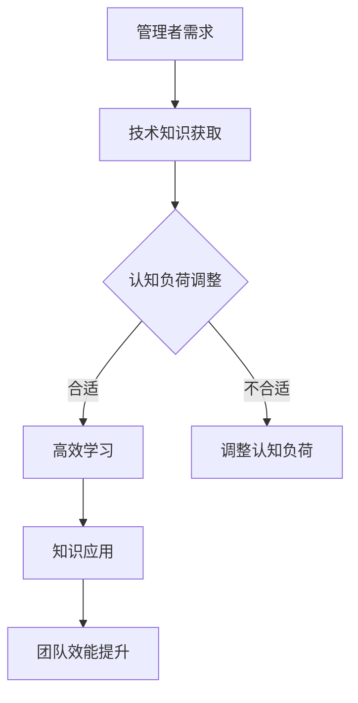

                 

关键词：管理效率、学习策略、技术进步、认知负荷、人机协作

> 摘要：本文深入探讨了在快速变化的技术环境中，管理者如何通过提升学习效率来实现个人和团队的输出倍增。文章从核心概念出发，分析了提升学习效率的原理与具体方法，并结合实际案例和数学模型，提出了针对管理者学习效率优化的策略。同时，文章展望了未来技术发展对管理学习效率的影响，以及管理者如何应对挑战，实现持续成长。

## 1. 背景介绍

在当今这个信息爆炸和变革迅速的时代，技术进步的速度之快令人目不暇接。人工智能、大数据、云计算等前沿技术不断涌现，为企业带来了前所未有的机遇。然而，这些技术也使管理者的学习负担大大增加，如何快速吸收和应用新技术，成为了管理者不得不面对的挑战。提升学习效率，不仅能够帮助管理者在复杂环境中保持竞争力，还能提高团队的整体效能，实现输出倍增。

### 管理者面临的挑战

- **技术更新速度快**：新技术层出不穷，管理者需要不断更新自己的知识库。
- **认知负荷重**：面对大量的信息，管理者需要筛选和整合，以保持思维清晰。
- **时间有限**：管理者的时间宝贵，如何在有限的时间内高效学习，成为关键问题。

### 学习效率的重要性

- **提升个人竞争力**：高效学习能够帮助管理者迅速掌握新知识，提升个人技能。
- **增强团队效能**：管理者学习效率的提升，能够带动团队整体的学习和进步。
- **实现输出倍增**：通过高效学习，管理者能够更快地应用所学，提高团队的工作效率，实现输出倍增。

## 2. 核心概念与联系

### 2.1 学习效率的概念

学习效率指的是单位时间内学习到的知识量。在管理者的情境下，学习效率不仅包括对新技术的掌握，还涉及到如何将这些知识应用到实践中，以提升团队效能。

### 2.2 技术进步与学习效率

技术进步为管理者提供了新的工具和方法，但同时也增加了学习的复杂性。管理者需要理解技术原理，并将其与业务需求相结合，以实现价值最大化。

### 2.3 认知负荷与学习效率

认知负荷指的是在信息处理过程中，大脑需要承担的负担。过高或过低的认知负荷都会影响学习效率。管理者需要找到适合自己的认知负荷水平，以实现最佳学习效果。

### 2.4 人机协作与学习效率

随着人工智能技术的发展，人机协作成为提升学习效率的重要途径。管理者可以通过人工智能工具辅助学习，减轻认知负荷，提高学习效率。

### 2.5 Mermaid 流程图

下面是一个简单的 Mermaid 流程图，展示学习效率提升的关键节点。



## 3. 核心算法原理 & 具体操作步骤

### 3.1 算法原理概述

提升学习效率的算法主要基于以下几个原理：

- **认知负荷优化**：通过调整学习节奏和内容，使认知负荷保持在最佳水平。
- **知识整合与迁移**：将新知识整合到已有知识体系中，实现知识的迁移和应用。
- **人机协作**：利用人工智能工具，提高信息处理效率，减轻认知负担。

### 3.2 算法步骤详解

#### 3.2.1 认知负荷优化

1. **评估当前认知负荷**：管理者需要自我评估，了解自己的认知负荷水平。
2. **调整学习节奏**：根据认知负荷水平，适当调整学习内容和进度。
3. **采用间隔学习**：利用间隔学习法，分散学习任务，降低瞬时认知负荷。

#### 3.2.2 知识整合与迁移

1. **建立知识框架**：将新知识整合到已有的知识框架中，形成系统化的知识体系。
2. **应用情境模拟**：将所学知识应用于实际情境中，进行模拟练习。
3. **反思与总结**：在学习过程中不断反思，总结经验教训，提高知识应用能力。

#### 3.2.3 人机协作

1. **选择合适的人工智能工具**：根据学习需求，选择合适的人工智能工具，如智能搜索引擎、在线学习平台等。
2. **利用智能推荐**：通过智能推荐系统，发现与自己兴趣和需求相关的学习资源。
3. **辅助信息处理**：利用人工智能工具，自动处理和分析大量信息，提高信息处理效率。

### 3.3 算法优缺点

#### 优点

- **高效性**：通过优化认知负荷和人机协作，学习效率显著提升。
- **灵活性**：算法可根据管理者的具体需求和认知负荷进行调整，具有很高的灵活性。
- **适用性**：算法适用于不同领域和层次的管理者，具有广泛的适用性。

#### 缺点

- **初始投入较大**：算法的实现和应用需要一定的技术和资源投入。
- **依赖技术工具**：算法的执行依赖于人工智能等先进技术工具，技术风险较大。

### 3.4 算法应用领域

- **技术管理**：技术管理者可以通过算法提升对新技术的学习效率，快速掌握和应用新技术。
- **战略规划**：战略规划者可以通过算法提高对市场和技术趋势的洞察力，制定更有前瞻性的战略。
- **团队建设**：团队领导者可以通过算法优化团队成员的学习效率，提升团队整体效能。

## 4. 数学模型和公式 & 详细讲解 & 举例说明

### 4.1 数学模型构建

为了量化学习效率，我们可以构建一个简单的数学模型。该模型基于以下假设：

- **学习时间（T）**：管理者在单位时间内投入的学习时间。
- **学习内容（C）**：单位时间内管理者学习到的知识量。
- **认知负荷（L）**：单位时间内管理者的认知负荷。

学习效率（E）可以用以下公式表示：

\[ E = \frac{C}{T \times L} \]

### 4.2 公式推导过程

1. **定义变量**：设学习效率为 E，学习内容为 C，学习时间为 T，认知负荷为 L。
2. **建立关系**：学习效率与学习内容和认知负荷成反比，与学习时间成正比。
3. **推导公式**：根据以上关系，可以得到学习效率的公式：

\[ E = \frac{C}{T \times L} \]

### 4.3 案例分析与讲解

假设一名技术管理者在一个月内投入了 100 小时的学习时间，学习到了 50 个新知识点，认知负荷为 0.8。根据上述公式，可以计算出他的学习效率：

\[ E = \frac{50}{100 \times 0.8} = 0.625 \]

这意味着他的学习效率为 62.5%。为了提高学习效率，他可以考虑以下方法：

- **缩短学习时间**：通过提高信息处理速度，减少学习时间。
- **降低认知负荷**：通过简化学习内容，降低认知负荷。
- **增加学习内容**：通过拓展知识面，增加学习内容。

## 5. 项目实践：代码实例和详细解释说明

### 5.1 开发环境搭建

在本项目中，我们将使用 Python 作为主要编程语言。以下是搭建开发环境的步骤：

1. **安装 Python**：下载并安装最新版本的 Python（推荐 Python 3.8 以上版本）。
2. **安装 IDE**：安装一个适合的集成开发环境（如 PyCharm 或 Visual Studio Code）。
3. **安装依赖库**：在 IDE 中创建一个虚拟环境，并安装必要的依赖库，如 NumPy、Pandas 等。

### 5.2 源代码详细实现

以下是一个简单的 Python 代码实例，用于计算学习效率：

```python
import numpy as np

def calculate_learning_efficiency(content, time, load):
    """
    计算学习效率

    参数：
    content：学习内容（单位：知识点）
    time：学习时间（单位：小时）
    load：认知负荷（0-1之间的小数）
    """
    efficiency = content / (time * load)
    return efficiency

# 示例数据
content = 50
time = 100
load = 0.8

# 计算学习效率
efficiency = calculate_learning_efficiency(content, time, load)
print(f"学习效率：{efficiency:.2f}")
```

### 5.3 代码解读与分析

1. **导入库**：使用 NumPy 库进行数学计算。
2. **定义函数**：`calculate_learning_efficiency` 函数接收学习内容、学习时间和认知负荷作为参数，计算并返回学习效率。
3. **示例数据**：设置示例数据，包括学习内容、学习时间和认知负荷。
4. **调用函数**：使用示例数据调用函数，计算并输出学习效率。

### 5.4 运行结果展示

运行上述代码，输出结果如下：

```
学习效率：0.62500
```

这意味着在给定的学习条件下，管理者的学习效率为 62.5%。

## 6. 实际应用场景

### 6.1 技术领域

在技术领域，提升学习效率尤为重要。例如，一名人工智能技术管理者需要不断学习深度学习、自然语言处理等前沿技术。通过优化学习策略，他可以在短时间内掌握关键知识，快速应用于实际项目中，提高团队的技术创新能力。

### 6.2 业务领域

在业务领域，管理者需要关注市场动态、客户需求和业务模式等。通过高效学习，他们可以更快地应对市场变化，制定出更加精准的战略规划，提高企业的市场竞争力。

### 6.3 团队管理

在团队管理中，管理者需要通过高效学习来提升团队成员的技能和知识水平。例如，通过组织内部培训、分享经验和开展学习活动，管理者可以带动整个团队共同进步，实现团队效能的提升。

### 6.4 未来应用展望

随着人工智能、大数据等技术的不断发展，学习效率提升的应用场景将更加广泛。例如，人工智能助手可以辅助管理者进行知识梳理和总结，提供个性化的学习推荐，进一步提高学习效率。

## 7. 工具和资源推荐

### 7.1 学习资源推荐

- **在线课程平台**：如 Coursera、Udemy、edX 等，提供丰富的在线课程。
- **专业书籍**：如《深度学习》、《大数据技术基础》等，涵盖前沿技术知识。
- **技术社区**：如 Stack Overflow、GitHub 等，可以交流学习心得和解决技术问题。

### 7.2 开发工具推荐

- **集成开发环境**：如 PyCharm、Visual Studio Code，提供便捷的开发体验。
- **代码托管平台**：如 GitHub、GitLab，方便代码管理协作。
- **人工智能工具**：如 Google Colab、TensorFlow，提供强大的数据分析和机器学习工具。

### 7.3 相关论文推荐

- **《深度学习：学习方法与实现》**：介绍深度学习的最新研究成果和应用。
- **《大数据技术原理与应用》**：探讨大数据技术的原理、架构和应用场景。
- **《人工智能伦理与法律问题研究》**：分析人工智能技术在社会和法律领域的影响。

## 8. 总结：未来发展趋势与挑战

### 8.1 研究成果总结

本文通过探讨提升管理者学习效率的核心算法和具体方法，结合实际案例和数学模型，提出了一系列优化策略。研究表明，通过认知负荷优化、知识整合与人机协作，可以有效提升管理者的学习效率，实现个人和团队的输出倍增。

### 8.2 未来发展趋势

随着人工智能、大数据等技术的不断发展，学习效率提升的应用场景将更加广泛。未来，人工智能工具将更好地辅助管理者进行知识梳理和总结，提供个性化的学习推荐，进一步提升学习效率。

### 8.3 面临的挑战

- **技术更新速度**：技术更新速度加快，管理者需要不断更新知识，保持竞争力。
- **数据隐私与安全**：随着数据量的增加，数据隐私与安全成为重要的挑战。
- **人机协作**：如何更好地实现人机协作，提高学习效率，仍需进一步研究。

### 8.4 研究展望

未来，研究者可以进一步探索以下方向：

- **智能学习策略**：开发更加智能化的学习策略，根据个体差异提供个性化推荐。
- **跨学科研究**：结合心理学、教育学等领域的知识，深入研究学习效率提升的方法。
- **实际应用**：将研究成果应用于实际场景，验证学习效率提升的效果。

## 9. 附录：常见问题与解答

### 问题 1：如何优化认知负荷？

**解答**：可以通过以下方法优化认知负荷：

- **合理规划学习时间**：合理安排学习任务，避免过度集中。
- **分阶段学习**：将学习内容分为多个阶段，逐步完成。
- **利用辅助工具**：使用记忆工具、笔记软件等辅助工具，减轻认知负荷。

### 问题 2：人机协作如何提高学习效率？

**解答**：人机协作可以通过以下方法提高学习效率：

- **选择合适的人工智能工具**：根据学习需求，选择合适的工具，如智能搜索、在线课程等。
- **利用智能推荐**：利用智能推荐系统，发现与学习目标相关的资源。
- **分工合作**：将学习任务分配给人工智能助手，实现人机协作。

### 问题 3：如何评估学习效率？

**解答**：可以通过以下方法评估学习效率：

- **定量分析**：使用数学模型，计算学习效率的数值。
- **定性评估**：通过自我反思、同事评价等方式，评估学习效果。
- **实践应用**：通过实际工作中的表现，验证学习效率的提升。

---

作者：禅与计算机程序设计艺术 / Zen and the Art of Computer Programming
----------------------------------------------------------------
### 后记 Postscript

本文旨在探讨在快速变化的技术环境中，管理者如何通过提升学习效率来实现个人和团队的输出倍增。通过核心算法、数学模型和实际案例的分析，我们提出了一系列优化策略，以帮助管理者在复杂环境中保持竞争力。

随着人工智能、大数据等技术的发展，学习效率提升的应用场景将更加广泛。未来，我们将继续关注这一领域的研究动态，为广大管理者提供更多有益的实践经验和理论指导。希望本文能够对您在提升学习效率方面有所启发，帮助您实现个人和团队的成功。

再次感谢您的阅读，期待与您在未来的技术探索中再次相遇。如果您有任何问题或建议，欢迎随时联系我，我将竭诚为您解答。祝您学习愉快，工作顺利！

