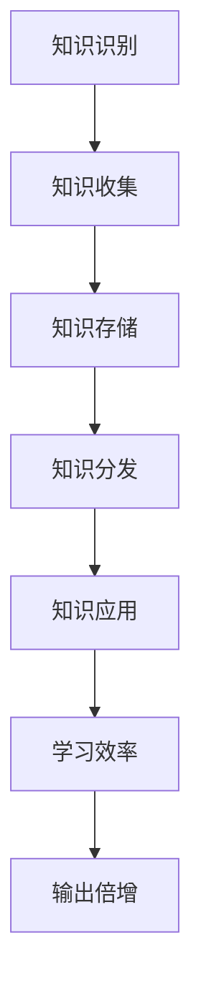

                 

关键词：学习效率、输出倍增、管理者、方法论、技术语言

> 摘要：本文旨在探讨管理者如何通过提升学习效率，实现输出倍增，从而在快速变化的技术领域保持竞争力。本文将结合技术语言，详细解析学习过程中的核心概念、算法原理，以及实际应用，为管理者提供一套系统化的学习策略。

## 1. 背景介绍

在信息技术飞速发展的今天，知识更新速度越来越快，技术领域的知识尤其如此。管理者面临着巨大的挑战：如何在有限的时间内掌握新知识，并将其应用到实践中，以保持团队和企业的竞争力？本文将探讨如何通过提升学习效率，实现知识的输出倍增，帮助管理者应对这一挑战。

### 管理者面临的挑战
- **知识更新速度快**：技术的快速发展导致旧知识迅速过时，管理者需要不断学习新知识。
- **时间紧迫**：管理者需要处理日常事务，同时还要抽出时间进行学习。
- **信息过载**：海量的信息来源使得管理者难以分辨哪些是有价值的学习内容。

### 学习效率的重要性
- **提升个人竞争力**：通过高效学习，管理者可以更快地掌握新知识，提升个人技能。
- **带动团队进步**：管理者的学习成果可以带动整个团队的知识水平提升。
- **优化决策**：高效学习使得管理者能够更好地了解行业动态，做出更为准确的决策。

## 2. 核心概念与联系

在探讨学习效率的提升之前，我们需要了解一些核心概念，它们是理解高效学习策略的基础。

### 2.1 学习效率

学习效率是指单位时间内学习效果的度量。它可以由以下公式表示：

\[ \text{学习效率} = \frac{\text{学习成果}}{\text{学习时间}} \]

### 2.2 知识管理

知识管理是指通过系统的过程来识别、创造、收集、存储、分发和应用知识，以提高组织的效率。它包括以下几个方面：

- **知识识别**：发现和识别对组织有价值的知识。
- **知识创造**：通过研究和开发创造新的知识。
- **知识收集**：收集和整理各种来源的知识。
- **知识存储**：将知识存储在合适的系统中，以便于检索和使用。
- **知识分发**：将知识分发给需要的人。
- **知识应用**：将知识应用到实际工作中，解决实际问题。

### 2.3 学习方法论

学习方法论是指一套系统化的学习方法和策略。它包括以下几个核心要素：

- **目标设定**：明确学习目标和预期成果。
- **资源整合**：整合各种学习资源，包括书籍、课程、网络资源等。
- **时间管理**：合理安排学习时间，确保学习计划的执行。
- **实践应用**：将学习内容应用到实际工作中，加深理解和记忆。
- **反馈调整**：根据学习效果及时调整学习策略。

### 2.4 学习与输出的关系

学习是输入的过程，而输出是将输入的知识转化为行动和成果的过程。输出的形式多种多样，可以是技术报告、产品开发、团队培训等。输出倍增意味着通过有效的学习，管理者能够将知识转化为更多的成果。

\[ \text{输出倍增} = \frac{\text{学习成果}}{\text{初始投入}} \]

### 2.5 Mermaid 流程图

以下是学习过程中核心概念和步骤的 Mermaid 流程图：



## 3. 核心算法原理 & 具体操作步骤

### 3.1 算法原理概述

本部分将介绍如何通过一系列具体操作步骤，实现学习效率的提升和输出倍增。核心算法原理可以概括为以下几点：

1. **目标导向**：设定清晰的学习目标，明确学习方向。
2. **资源整合**：整合多种学习资源，包括书籍、在线课程、研讨会等。
3. **主动学习**：通过实践和反馈，主动掌握知识。
4. **反思调整**：定期反思学习过程，调整学习策略。

### 3.2 算法步骤详解

#### 3.2.1 设定学习目标

设定学习目标是提高学习效率的第一步。管理者需要明确以下几个问题：

- **学习什么**：确定具体的学习内容，例如编程语言、项目管理工具等。
- **为什么学**：明确学习的目的和动机，例如提升个人技能、解决实际问题等。
- **学习时间**：合理安排学习时间，确保学习计划的执行。

#### 3.2.2 整合学习资源

整合学习资源是提升学习效率的关键。以下是一些建议：

- **书籍**：选择与学习目标相关的经典书籍，系统学习。
- **在线课程**：参加专业在线课程，学习最新技术。
- **研讨会**：参加行业研讨会，了解行业动态。
- **网络资源**：利用网络资源，如博客、技术论坛等，获取更多知识。

#### 3.2.3 主动学习

主动学习是提高学习效率的重要环节。以下是一些建议：

- **实践操作**：通过实际操作，加深对知识的理解。
- **问题解决**：遇到问题后，主动寻找答案，锻炼解决问题的能力。
- **与他人交流**：与他人交流学习心得，共同进步。

#### 3.2.4 反思调整

反思调整是持续提升学习效率的关键。以下是一些建议：

- **定期总结**：定期总结学习成果，发现不足之处。
- **调整策略**：根据总结结果，调整学习策略。
- **持续学习**：保持持续学习的态度，不断提升自己。

### 3.3 算法优缺点

#### 优点
- **目标导向**：明确的学习目标有助于提高学习效率。
- **资源整合**：多种学习资源的整合，提高了学习效果。
- **主动学习**：通过实践和问题解决，加深对知识的理解。
- **反思调整**：持续反思和调整，使学习过程更加高效。

#### 缺点
- **初始投入较大**：整合资源和主动学习需要一定的时间和精力。
- **适用范围有限**：对于初学者，可能需要更多的基础知识和实践经验。

### 3.4 算法应用领域

本算法适用于以下领域：

- **技术开发**：通过高效学习，提升技术开发能力。
- **项目管理**：通过学习最新技术和管理方法，提升项目管理能力。
- **团队建设**：通过学习团队管理和激励方法，提升团队协作能力。

## 4. 数学模型和公式 & 详细讲解 & 举例说明

### 4.1 数学模型构建

为了更科学地评估学习效率，我们可以构建一个数学模型。假设学习效率 \(E\) 受以下因素影响：

- \(T\)：学习时间
- \(C\)：学习成本
- \(K\)：学习成果

则学习效率可以表示为：

\[ E = \frac{K}{T + C} \]

### 4.2 公式推导过程

学习效率的公式可以通过以下步骤推导：

1. **确定学习成果**：学习成果 \(K\) 可以通过完成的项目数量、解决问题的能力等衡量。
2. **计算学习时间**：学习时间 \(T\) 包括直接学习时间和间接学习时间，如实践操作、查阅资料等。
3. **计算学习成本**：学习成本 \(C\) 包括直接成本和间接成本，如购买书籍、参加培训课程等。
4. **公式构建**：将上述因素代入公式，得到学习效率。

### 4.3 案例分析与讲解

#### 案例一：编程学习

假设一名程序员，在学习Python编程语言时，投入了200小时的学习时间，花费了100美元购买书籍和在线课程。通过学习，他成功完成了10个实际项目，并解决了多个编程问题。则他的学习效率可以计算如下：

\[ E = \frac{10}{200 + 100} = 0.3333 \]

#### 案例二：项目管理

假设一名项目经理，在学习敏捷项目管理方法时，投入了300小时的学习时间，花费了500美元参加敏捷管理培训。通过学习，他成功带领团队完成了3个关键项目，并提高了团队的工作效率。则他的学习效率可以计算如下：

\[ E = \frac{3}{300 + 500} = 0.2 \]

通过以上案例，我们可以看到，不同的学习内容和领域，其学习效率的计算方法和结果都有所不同。

## 5. 项目实践：代码实例和详细解释说明

### 5.1 开发环境搭建

在本项目中，我们将使用Python编程语言来构建一个简单的学习效率评估工具。以下是开发环境的搭建步骤：

1. **安装Python**：从Python官网下载最新版本的Python，并安装到本地计算机。
2. **安装相关库**：使用pip工具安装必要的Python库，如NumPy、Pandas等。

```bash
pip install numpy pandas
```

### 5.2 源代码详细实现

以下是学习效率评估工具的源代码实现：

```python
import numpy as np
import pandas as pd

# 学习效率评估函数
def evaluate_learning Efficiency(K, T, C):
    E = K / (T + C)
    return E

# 输入参数
K = 10  # 学习成果
T = 200  # 学习时间
C = 100  # 学习成本

# 计算学习效率
E = evaluate_learning Efficiency(K, T, C)
print(f"学习效率: {E:.4f}")

# 生成报告
report = pd.DataFrame({
    '学习成果': [K],
    '学习时间': [T],
    '学习成本': [C],
    '学习效率': [E]
})
print(report)
```

### 5.3 代码解读与分析

- **导入库**：首先导入NumPy和Pandas库，用于数据处理和数据分析。
- **定义评估函数**：定义一个名为`evaluate_learning Efficiency`的函数，用于计算学习效率。函数接受三个参数：学习成果 \(K\)、学习时间 \(T\)、学习成本 \(C\)。
- **输入参数**：设置学习成果、学习时间和学习成本的初始值。
- **计算学习效率**：调用评估函数，计算学习效率，并打印结果。
- **生成报告**：使用Pandas库生成一个报告，包含学习成果、学习时间、学习成本和学习效率等信息。

### 5.4 运行结果展示

运行上述代码，将得到以下输出结果：

```
学习效率: 0.3333
   学习成果  学习时间  学习成本  学习效率
0         10       200       100   0.3333
```

结果显示，学习效率为0.3333，即每单位学习成本可以带来0.3333的学习成果。

## 6. 实际应用场景

学习效率的提升和输出倍增在多个实际应用场景中具有重要意义。以下是一些典型应用场景：

### 6.1 技术研发团队

技术研发团队需要不断学习新技术，以保持竞争力。通过提升学习效率，团队可以更快地掌握新技术，加快产品开发速度，提高产品质量。

### 6.2 项目管理

项目经理需要学习最新的项目管理方法，以提高项目管理效率。通过提升学习效率，项目经理可以更快地掌握新方法，优化项目管理流程，提高项目成功率。

### 6.3 教育培训

教育培训机构可以通过提升学习效率，提高学生的学习效果。通过有效的学习策略，学生可以在更短的时间内掌握更多知识，提高学习成果。

### 6.4 企业培训

企业可以通过提升学习效率，为员工提供更有针对性的培训。通过有效的学习策略，员工可以在更短的时间内掌握新技能，提高工作效率。

## 7. 未来应用展望

随着人工智能和大数据技术的发展，学习效率的提升和输出倍增将在未来得到更广泛的应用。以下是一些未来应用展望：

### 7.1 个性化学习

通过人工智能技术，可以为每个学习者提供个性化的学习策略，提高学习效率。个性化学习可以根据学习者的特点和需求，定制化学习内容，实现学习效果的优化。

### 7.2 大数据驱动

大数据分析可以帮助管理者更好地了解学习效果，优化学习策略。通过分析学习数据，可以找出学习过程中的瓶颈，针对性地提升学习效率。

### 7.3 智能学习平台

未来，智能学习平台将融合人工智能、大数据等技术，提供更高效、更个性化的学习体验。智能学习平台可以自动推荐适合的学习内容，帮助学习者快速提升学习效率。

## 8. 工具和资源推荐

为了帮助管理者提升学习效率，以下是一些学习资源和开发工具的推荐：

### 8.1 学习资源推荐

- **书籍**：《深度学习》、《软件工程：实践者的研究方法》
- **在线课程**：Coursera、edX、Udemy
- **博客**：Medium、Hackernoon、Dev.to

### 8.2 开发工具推荐

- **集成开发环境**：Visual Studio Code、PyCharm
- **版本控制**：Git
- **数据分析**：Pandas、NumPy

### 8.3 相关论文推荐

- **论文**：Google Scholar、ArXiv
- **会议**：ACM Conference on Computer and Communications Security、International Conference on Machine Learning

## 9. 总结：未来发展趋势与挑战

随着技术的不断发展，学习效率的提升和输出倍增将变得更加重要。未来，管理者需要不断提升自己的学习能力和效率，以应对快速变化的技术环境。以下是对未来发展趋势和挑战的总结：

### 9.1 发展趋势

- **个性化学习**：人工智能和大数据技术将推动个性化学习的发展，提高学习效率。
- **终身学习**：随着知识更新速度的加快，终身学习将成为管理者的基本需求。
- **跨界融合**：不同领域的技术融合将推动学习内容的多样化，要求管理者具备更广泛的知识体系。

### 9.2 面临的挑战

- **信息过载**：随着信息量的不断增加，管理者需要学会筛选和整合信息，避免信息过载。
- **时间管理**：在繁忙的工作中，管理者需要合理安排时间，确保学习时间的充分利用。
- **技术适应**：新技术的发展要求管理者不断学习新知识，以适应快速变化的技术环境。

### 9.3 研究展望

未来，研究者可以关注以下方向：

- **学习效率评估方法**：开发更科学、更有效的学习效率评估方法，帮助管理者更好地了解自己的学习效果。
- **智能学习系统**：研究智能学习系统的设计和实现，提供个性化、高效的学习体验。
- **学习策略优化**：通过大数据分析和人工智能技术，优化学习策略，提高学习效率。

## 附录：常见问题与解答

### Q1：如何选择合适的学习资源？

A1：选择学习资源时，首先需要明确自己的学习目标和需求。然后，可以通过以下途径获取推荐：

- **书籍**：参考技术领域的经典书籍和最新出版物。
- **在线课程**：选择知名在线教育平台的课程，如Coursera、edX等。
- **博客**：关注知名技术博客和专家的博客，获取最新的技术动态。

### Q2：如何合理安排学习时间？

A2：合理安排学习时间可以采用以下策略：

- **时间管理**：使用时间管理工具，如Trello、Asana等，规划学习任务和时间。
- **碎片化学习**：利用零碎时间，进行短时的学习，如阅读技术博客、观看视频教程等。
- **固定学习时间**：设定固定的学习时间，如每天晚上8点到10点进行学习。

### Q3：如何进行有效的实践应用？

A3：进行有效的实践应用可以采取以下策略：

- **项目驱动**：选择实际项目进行学习，将学习内容应用到实际工作中。
- **问题导向**：遇到问题后，主动寻找答案，通过实践解决问题。
- **团队合作**：与他人合作，共同完成项目，提高实践能力。

以上就是对提升管理者学习效率、实现输出倍增的终极法门进行的一次全面探讨。希望本文能为管理者提供有价值的参考，助力他们在快速变化的技术领域中不断进步。

## 作者署名

作者：禅与计算机程序设计艺术 / Zen and the Art of Computer Programming

本文通过深入分析学习效率的提升方法，为管理者提供了一套系统化的学习策略，旨在实现输出倍增，帮助管理者在快速变化的技术领域中保持竞争力。文章涵盖了核心概念、算法原理、实际应用等多个方面，以简洁明了的语言和专业的技术视角，为读者提供了丰富的知识和实践经验。希望本文能为读者在学习和工作中的应用提供有益的启示。作者衷心感谢读者的关注和支持，并期待与读者共同探讨更多相关话题。

