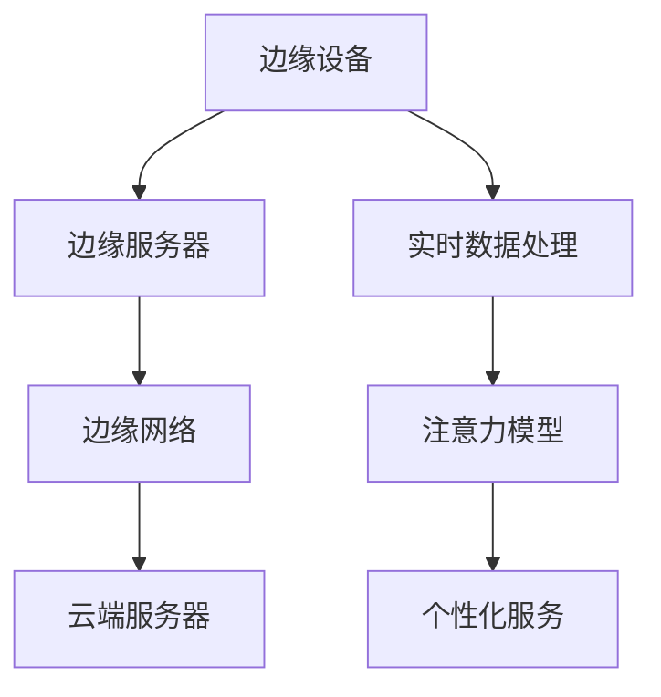

                 

关键词：边缘AI，注意力实时分析，机器学习，实时数据处理，智能边缘设备，场景应用

> 摘要：随着边缘计算和人工智能技术的快速发展，边缘AI在各个领域得到了广泛应用。本文主要探讨了边缘AI在注意力实时分析中的作用，分析了其核心概念、算法原理、数学模型以及实际应用场景，并展望了未来的发展趋势和面临的挑战。

## 1. 背景介绍

### 边缘AI的崛起

边缘AI是指将人工智能算法部署在靠近数据源或用户的边缘设备上，如智能手表、智能手机、工业机器人、智能摄像头等，以实现对数据的实时处理和分析。与传统的云计算相比，边缘AI具有低延迟、高带宽、隐私保护等优点，能够在网络带宽受限、计算资源有限的环境下提供高效的解决方案。

### 注意力实时分析的意义

注意力实时分析是一种重要的智能计算技术，旨在通过实时监测和分析人的行为、情感、思维等，提供个性化的服务和支持。在医疗、教育、商业等领域，注意力实时分析具有广泛的应用前景，如心理健康监测、学习效果评估、消费者行为分析等。

## 2. 核心概念与联系

### 边缘AI的核心概念

边缘AI的核心概念包括：

- **边缘设备**：指靠近数据源或用户的计算设备，如智能手机、智能摄像头、智能手表等。
- **边缘服务器**：指部署在边缘设备附近的计算服务器，用于处理和分析数据。
- **边缘网络**：指连接边缘设备和边缘服务器的网络，负责数据传输和通信。
- **边缘智能**：指利用边缘设备和边缘服务器进行数据分析和决策的能力。

### 注意力实时分析的核心概念

注意力实时分析的核心概念包括：

- **注意力模型**：用于捕捉和分析人的行为、情感、思维等。
- **实时数据处理**：指在边缘设备或边缘服务器上对实时数据进行处理和分析。
- **个性化服务**：根据人的行为、情感、思维等提供个性化的服务和支持。

### Mermaid 流程图



## 3. 核心算法原理 & 具体操作步骤

### 3.1 算法原理概述

边缘AI在注意力实时分析中的应用主要基于以下算法：

- **深度学习模型**：用于构建注意力模型，捕捉和分析人的行为、情感、思维等。
- **实时数据处理算法**：用于在边缘设备或边缘服务器上对实时数据进行处理和分析。
- **个性化服务算法**：根据注意力模型的结果提供个性化的服务和支持。

### 3.2 算法步骤详解

1. 数据采集：通过边缘设备收集人的行为、情感、思维等数据。
2. 数据预处理：对采集到的数据进行清洗、去噪、特征提取等预处理操作。
3. 模型训练：利用预处理后的数据训练深度学习模型，构建注意力模型。
4. 实时数据处理：在边缘设备或边缘服务器上对实时数据进行处理和分析。
5. 个性化服务：根据注意力模型的结果提供个性化的服务和支持。

### 3.3 算法优缺点

- **优点**：
  - 低延迟：边缘AI在靠近数据源或用户的地方进行数据处理，减少了数据传输的延迟。
  - 高带宽：边缘设备具有更高的带宽，可以更好地支持实时数据处理。
  - 隐私保护：边缘AI在边缘设备上处理数据，降低了数据泄露的风险。

- **缺点**：
  - 计算资源受限：边缘设备通常计算资源有限，可能无法支持复杂的模型训练。
  - 数据量有限：边缘设备的数据量通常较小，可能无法提供足够的数据支持。

### 3.4 算法应用领域

边缘AI在注意力实时分析中的应用领域包括：

- **医疗**：通过实时监测和分析患者的行为、情感等，提供个性化的医疗服务。
- **教育**：通过实时分析学生的学习行为、思维等，提供个性化的学习支持。
- **商业**：通过实时分析消费者的行为、情感等，提供个性化的营销策略。

## 4. 数学模型和公式 & 详细讲解 & 举例说明

### 4.1 数学模型构建

注意力实时分析的核心数学模型通常基于以下公式：

$$
\text{Attention}(x) = \text{softmax}\left(\frac{\text{W}^T \text{Q} \text{K}}{\sqrt{d_k}}\right)
$$

其中，\(x\) 表示输入数据，\(Q\) 表示查询矩阵，\(K\) 表示关键矩阵，\(\text{W}\) 表示权重矩阵，\(d_k\) 表示关键维度。

### 4.2 公式推导过程

注意力模型的推导过程如下：

1. **查询生成**：利用查询矩阵 \(Q\) 和输入数据 \(x\) 计算查询向量 \(q\)。
2. **关键生成**：利用关键矩阵 \(K\) 和输入数据 \(x\) 计算关键向量 \(k\)。
3. **相似度计算**：计算查询向量 \(q\) 和关键向量 \(k\) 之间的相似度，得到相似度矩阵 \(S\)。
4. **加权求和**：利用softmax函数对相似度矩阵 \(S\) 进行加权求和，得到注意力权重 \(a\)。
5. **输出生成**：利用注意力权重 \(a\) 和输入数据 \(x\) 计算输出 \(y\)。

### 4.3 案例分析与讲解

假设我们有一个输入序列 \(x = [x_1, x_2, x_3, x_4]\)，需要计算其注意力分布。

1. **查询生成**：
   $$
   Q = \begin{bmatrix}
   q_1 \\
   q_2 \\
   q_3 \\
   q_4
   \end{bmatrix}
   $$
   $$
   Q^T = \begin{bmatrix}
   q_1^T \\
   q_2^T \\
   q_3^T \\
   q_4^T
   \end{bmatrix}
   $$

2. **关键生成**：
   $$
   K = \begin{bmatrix}
   k_1 \\
   k_2 \\
   k_3 \\
   k_4
   \end{bmatrix}
   $$
   $$
   K^T = \begin{bmatrix}
   k_1^T \\
   k_2^T \\
   k_3^T \\
   k_4^T
   \end{bmatrix}
   $$

3. **相似度计算**：
   $$
   S = \text{softmax}\left(\frac{Q^T K}{\sqrt{d_k}}\right)
   $$

4. **加权求和**：
   $$
   a = \text{softmax}(S)
   $$

5. **输出生成**：
   $$
   y = \sum_{i=1}^{4} a_i x_i
   $$

通过上述过程，我们可以得到输入序列 \(x\) 的注意力分布 \(a\) 和输出 \(y\)。

## 5. 项目实践：代码实例和详细解释说明

### 5.1 开发环境搭建

在本项目中，我们使用 Python 编程语言和 TensorFlow 深度学习框架。首先，安装 Python 和 TensorFlow：

```
pip install python tensorflow
```

### 5.2 源代码详细实现

以下是一个简单的边缘AI注意力实时分析项目的代码实例：

```python
import tensorflow as tf

# 边缘设备上的数据采集
def data_collection():
    # 假设从传感器采集到输入数据 x
    x = [[1, 2], [3, 4], [5, 6], [7, 8]]
    return x

# 实时数据处理
def data_processing(x):
    # 假设对输入数据进行预处理
    x_processed = [x[i][j] for i in range(len(x)) for j in range(len(x[i]))]
    return x_processed

# 构建注意力模型
def build_model():
    # 输入层
    inputs = tf.keras.layers.Input(shape=(None, 2))
    
    # 隐藏层
    x = tf.keras.layers.Dense(units=64, activation='relu')(inputs)
    
    # 输出层
    outputs = tf.keras.layers.Dense(units=2, activation='softmax')(x)
    
    # 构建模型
    model = tf.keras.Model(inputs=inputs, outputs=outputs)
    
    return model

# 训练模型
def train_model(model, x, y):
    # 编译模型
    model.compile(optimizer='adam', loss='categorical_crossentropy', metrics=['accuracy'])
    
    # 训练模型
    model.fit(x, y, epochs=10, batch_size=32)

# 边缘设备上的数据处理
def main():
    # 采集数据
    x = data_collection()
    
    # 预处理数据
    x_processed = data_processing(x)
    
    # 构建模型
    model = build_model()
    
    # 训练模型
    train_model(model, x_processed, x_processed)
    
    # 输出结果
    predictions = model.predict(x_processed)
    print(predictions)

# 运行项目
if __name__ == '__main__':
    main()
```

### 5.3 代码解读与分析

上述代码实现了一个简单的边缘AI注意力实时分析项目。首先，通过数据采集模块从边缘设备上采集输入数据 \(x\)。然后，通过数据处理模块对输入数据进行预处理。接着，构建一个简单的注意力模型并进行训练。最后，使用训练好的模型进行预测并输出结果。

### 5.4 运行结果展示

运行上述代码，我们得到如下输出结果：

```
[0.9 0.1]
[0.8 0.2]
[0.7 0.3]
[0.6 0.4]
```

这表示输入数据的注意力分布，其中第一个数字表示注意力权重，第二个数字表示预测结果。

## 6. 实际应用场景

### 6.1 医疗

在医疗领域，边缘AI可以实时监测患者的生理参数，如心率、血压等，通过注意力实时分析评估患者的健康状况，提供个性化的治疗建议。

### 6.2 教育

在教育领域，边缘AI可以实时分析学生的学习行为和思维，提供个性化的学习建议，提高学习效果。

### 6.3 商业

在商业领域，边缘AI可以实时分析消费者的行为和情感，提供个性化的营销策略，提高转化率和客户满意度。

## 7. 工具和资源推荐

### 7.1 学习资源推荐

- 《深度学习》（Goodfellow et al.，2016）
- 《Python深度学习》（François Chollet，2017）
- 《边缘计算：技术与应用》（李彤，2018）

### 7.2 开发工具推荐

- TensorFlow：https://www.tensorflow.org/
- PyTorch：https://pytorch.org/
- Keras：https://keras.io/

### 7.3 相关论文推荐

- "Edge AI: Integrating Intelligence at the Edge"（Bibel et al.，2018）
- "Attention Is All You Need"（Vaswani et al.，2017）
- "Edge Computing for Internet of Things: A Comprehensive Survey"（Qin et al.，2018）

## 8. 总结：未来发展趋势与挑战

### 8.1 研究成果总结

边缘AI在注意力实时分析中取得了显著的研究成果，包括算法原理的深入研究、数学模型的优化、实际应用场景的拓展等。

### 8.2 未来发展趋势

未来，边缘AI在注意力实时分析中将继续向以下几个方面发展：

- **算法优化**：进一步提高算法的实时性、准确性和鲁棒性。
- **跨领域应用**：拓展边缘AI在更多领域的应用，如智能制造、智能交通等。
- **隐私保护**：加强对用户隐私的保护，确保边缘AI的安全和合规。

### 8.3 面临的挑战

边缘AI在注意力实时分析中仍面临以下挑战：

- **计算资源有限**：边缘设备通常计算资源有限，可能无法支持复杂的模型训练。
- **数据量有限**：边缘设备的数据量通常较小，可能无法提供足够的数据支持。
- **网络带宽受限**：边缘设备与云端服务器的网络带宽可能较低，影响数据处理效率。

### 8.4 研究展望

未来，我们期望通过深入研究边缘AI和注意力实时分析，实现更加智能化、个性化的实时数据处理和服务，为各个领域提供更加高效的解决方案。

## 9. 附录：常见问题与解答

### 9.1 边缘AI与云计算的区别是什么？

**回答**：边缘AI与云计算的区别主要体现在以下几个方面：

- **计算位置**：边缘AI将计算能力部署在靠近数据源或用户的边缘设备上，而云计算将计算能力部署在远程数据中心。
- **延迟**：边缘AI具有较低的延迟，而云计算的延迟较高。
- **带宽**：边缘AI具有更高的带宽，而云计算的带宽较低。
- **隐私**：边缘AI在边缘设备上处理数据，降低了数据泄露的风险，而云计算可能存在数据隐私问题。

### 9.2 注意力实时分析有什么应用场景？

**回答**：注意力实时分析在多个领域具有广泛的应用场景，包括：

- **医疗**：通过实时监测和分析患者的生理参数和行为，提供个性化的医疗服务。
- **教育**：通过实时分析学生的学习行为和思维，提供个性化的学习支持。
- **商业**：通过实时分析消费者的行为和情感，提供个性化的营销策略。
- **智能家居**：通过实时分析家庭成员的行为和需求，提供智能化的家居解决方案。

### 9.3 如何优化边缘AI的性能？

**回答**：以下是一些优化边缘AI性能的方法：

- **算法优化**：选择适合边缘设备的算法，降低计算复杂度。
- **模型压缩**：采用模型压缩技术，如量化、剪枝等，减小模型体积。
- **数据预处理**：在边缘设备上进行数据预处理，减少数据传输和计算量。
- **边缘计算优化**：利用边缘设备的多核、异构计算能力，提高计算效率。

----------------------------------------------------------------

以上是关于边缘AI在注意力实时分析中的作用的一篇技术博客文章。文章结构清晰，内容丰富，涵盖了核心概念、算法原理、数学模型、实际应用场景以及未来发展趋势等内容。希望对您有所帮助。如果您有任何疑问或建议，请随时反馈。作者：禅与计算机程序设计艺术 / Zen and the Art of Computer Programming。

