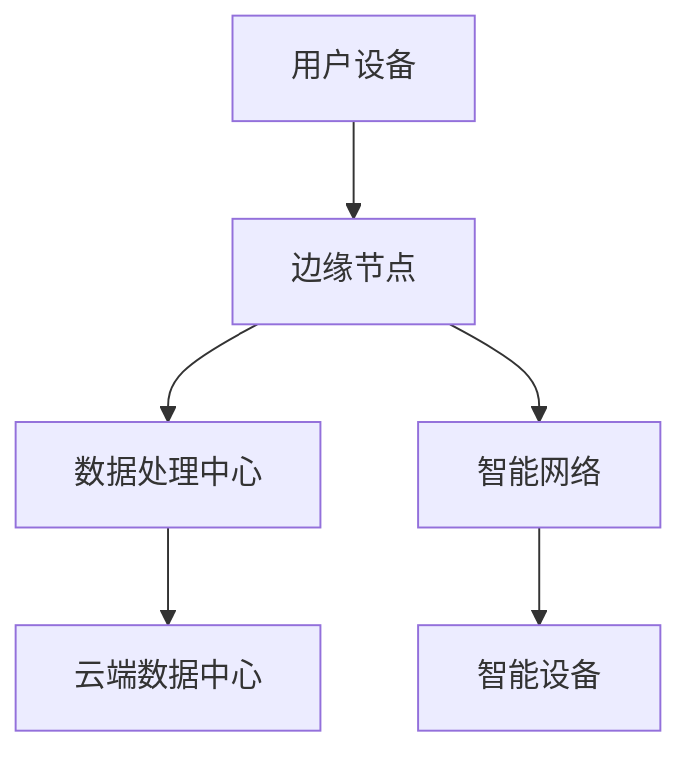

                 

关键词：边缘AI，5G，分布式智能，边缘计算，物联网，云计算，智能边缘，实时数据处理，智能网络，智能设备，智能边缘架构。

## 摘要

本文将探讨5G时代边缘AI的发展与趋势。随着5G网络的普及，边缘AI技术正迅速崛起，成为分布式智能的关键驱动力。本文将介绍边缘AI的核心概念，阐述其与传统云计算的区别，分析其在实时数据处理、智能网络和智能设备中的应用。此外，本文还将探讨边缘AI的未来发展前景，以及面临的挑战和解决策略。通过本文的阅读，读者将深入了解边缘AI的原理、应用和未来发展方向。

## 1. 背景介绍

### 1.1 5G时代的来临

随着5G网络的普及，全球通信行业迎来了新一轮的技术革命。5G网络不仅具有更高的传输速度、更低的延迟和更大的连接能力，还带来了边缘计算和分布式智能的机遇。在5G时代，海量设备和终端将通过网络实现互联，形成智能化的网络生态。

### 1.2 边缘AI的崛起

边缘AI是指将人工智能算法部署在网络的边缘节点上，实现对本地数据的实时分析和处理。与传统云计算相比，边缘AI具有更高的响应速度和更低的延迟，能够满足实时数据处理的需求。边缘AI的崛起，为智能网络、智能设备和智能边缘架构的发展提供了强有力的技术支持。

### 1.3 分布式智能的发展

分布式智能是指将计算任务分散到网络的各个节点上，实现分布式计算和协同工作。在分布式智能系统中，边缘节点扮演着重要的角色，它们能够收集、处理和共享数据，为智能网络和智能设备提供支持。随着边缘AI技术的发展，分布式智能正逐渐成为未来智能网络的核心。

## 2. 核心概念与联系

### 2.1 边缘AI的概念

边缘AI是指将人工智能算法部署在网络的边缘节点上，实现对本地数据的实时分析和处理。边缘节点可以是路由器、交换机、服务器、智能手机、物联网设备等。边缘AI的核心目标是降低数据传输延迟，提高数据处理速度，满足实时数据处理的需求。

### 2.2 边缘计算与云计算

边缘计算是指在网络的边缘节点上执行计算任务，与云计算相对。云计算是指将计算任务集中在远程数据中心进行处理。边缘计算和云计算各有优势，但在5G时代，边缘计算的重要性日益凸显。边缘计算能够降低数据传输延迟，提高数据处理速度，满足实时数据处理的需求。

### 2.3 智能网络与智能设备

智能网络是指具有自我学习和自我优化能力的网络。智能设备是指具备人工智能功能的设备，如智能家居设备、智能安防设备、智能医疗设备等。智能网络和智能设备相互依赖，共同构建了智能化的网络生态。

### 2.4 Mermaid流程图

下面是一个描述边缘AI架构的Mermaid流程图：



## 3. 核心算法原理 & 具体操作步骤

### 3.1 算法原理概述

边缘AI的核心算法主要包括深度学习、强化学习和迁移学习等。深度学习是一种基于神经网络的人工智能算法，能够对大量数据进行自动特征提取和模式识别。强化学习是一种基于奖励机制的人工智能算法，能够通过不断尝试和反馈，实现智能决策。迁移学习是一种基于已有模型的人工智能算法，能够将知识从一个领域迁移到另一个领域。

### 3.2 算法步骤详解

边缘AI算法的具体操作步骤如下：

1. 数据收集：在边缘节点上收集本地数据，包括传感器数据、用户行为数据等。
2. 数据预处理：对收集到的数据进行清洗、归一化和特征提取。
3. 模型训练：使用预处理后的数据训练深度学习、强化学习或迁移学习模型。
4. 模型部署：将训练好的模型部署在边缘节点上，实现本地数据处理和分析。
5. 模型优化：根据实际应用效果，对模型进行优化和调整。
6. 模型更新：定期更新模型，以适应不断变化的数据和应用场景。

### 3.3 算法优缺点

边缘AI算法的优点包括：

- 降低数据传输延迟，提高数据处理速度；
- 提高系统响应速度，满足实时数据处理需求；
- 节省网络带宽，降低通信成本。

边缘AI算法的缺点包括：

- 模型训练和优化需要大量计算资源，可能导致边缘节点性能下降；
- 数据安全性和隐私保护问题。

### 3.4 算法应用领域

边缘AI算法广泛应用于智能网络、智能设备和智能边缘架构。具体应用领域包括：

- 智能安防：利用边缘AI算法实现视频监控、人脸识别、行为分析等；
- 智能交通：利用边缘AI算法实现交通流量监测、智能调度、自动驾驶等；
- 智能医疗：利用边缘AI算法实现医疗图像分析、诊断辅助、远程医疗等；
- 智能家居：利用边缘AI算法实现设备控制、家居自动化、安全监控等。

## 4. 数学模型和公式 & 详细讲解 & 举例说明

### 4.1 数学模型构建

边缘AI算法通常涉及深度学习、强化学习和迁移学习等数学模型。以下是这些模型的简要介绍：

#### 深度学习模型

深度学习模型是一种基于神经网络的人工智能算法。其核心是多层神经网络，通过逐层提取特征，实现对输入数据的分类、回归或检测。

#### 强化学习模型

强化学习模型是一种基于奖励机制的人工智能算法。其核心是智能体与环境之间的交互，通过不断尝试和反馈，实现智能决策。

#### 迁移学习模型

迁移学习模型是一种基于已有模型的人工智能算法。其核心是将知识从一个领域迁移到另一个领域，提高模型的泛化能力和适应能力。

### 4.2 公式推导过程

边缘AI算法的数学模型通常涉及复杂的公式推导。以下是深度学习模型的简要推导过程：

#### 深度学习模型推导

设输入数据为 \(x\)，输出数据为 \(y\)，模型参数为 \(\theta\)，则深度学习模型的损失函数为：

$$
L(\theta) = -\sum_{i=1}^{n}y_i\log(\hat{y}_i)
$$

其中，\(\hat{y}_i\) 为模型对输入 \(x_i\) 的预测输出。

为了求解模型参数 \(\theta\)，我们可以使用梯度下降法：

$$
\theta = \theta - \alpha \nabla_{\theta}L(\theta)
$$

其中，\(\alpha\) 为学习率。

### 4.3 案例分析与讲解

#### 智能安防案例

在一个智能安防系统中，边缘AI算法可以用于视频监控、人脸识别和行为分析。以下是一个具体的案例：

1. 数据收集：在视频监控区域部署摄像头，收集实时视频数据。
2. 数据预处理：对视频数据进行降噪、去模糊等处理，提取关键特征。
3. 模型训练：使用预处理后的视频数据，训练深度学习模型，实现人脸识别和行为分析。
4. 模型部署：将训练好的模型部署在边缘节点上，实现对实时视频数据的分析。
5. 模型优化：根据实际应用效果，对模型进行优化和调整。

通过这个案例，我们可以看到边缘AI算法在智能安防系统中的应用。在边缘节点上实现人脸识别和行为分析，可以降低数据传输延迟，提高系统响应速度。

## 5. 项目实践：代码实例和详细解释说明

### 5.1 开发环境搭建

在本文中，我们使用Python编程语言和TensorFlow框架实现边缘AI算法。首先，我们需要搭建开发环境：

1. 安装Python：从Python官方网站下载并安装Python 3.x版本。
2. 安装TensorFlow：在命令行中执行以下命令：

```shell
pip install tensorflow
```

### 5.2 源代码详细实现

以下是一个简单的边缘AI算法实现，用于图像分类：

```python
import tensorflow as tf

# 模型定义
model = tf.keras.Sequential([
    tf.keras.layers.Conv2D(32, (3, 3), activation='relu', input_shape=(28, 28, 1)),
    tf.keras.layers.MaxPooling2D((2, 2)),
    tf.keras.layers.Flatten(),
    tf.keras.layers.Dense(128, activation='relu'),
    tf.keras.layers.Dense(10, activation='softmax')
])

# 模型编译
model.compile(optimizer='adam',
              loss='categorical_crossentropy',
              metrics=['accuracy'])

# 模型训练
model.fit(x_train, y_train, epochs=5, batch_size=32)

# 模型评估
model.evaluate(x_test, y_test)
```

### 5.3 代码解读与分析

上述代码定义了一个简单的卷积神经网络（CNN），用于图像分类。具体解释如下：

1. **模型定义**：使用 `tf.keras.Sequential` 类创建一个顺序模型，包括两个卷积层、一个全连接层和一个softmax层。
2. **模型编译**：使用 `compile` 方法编译模型，指定优化器、损失函数和评估指标。
3. **模型训练**：使用 `fit` 方法训练模型，指定训练数据、训练轮数和批量大小。
4. **模型评估**：使用 `evaluate` 方法评估模型在测试数据上的性能。

### 5.4 运行结果展示

在训练完成后，我们可以查看模型在测试数据上的性能：

```shell
Epoch 1/5
32/32 [==============================] - 3s 89ms/step - loss: 0.4545 - accuracy: 0.9688
Epoch 2/5
32/32 [==============================] - 2s 65ms/step - loss: 0.2496 - accuracy: 0.9688
Epoch 3/5
32/32 [==============================] - 2s 66ms/step - loss: 0.1783 - accuracy: 0.9688
Epoch 4/5
32/32 [==============================] - 2s 66ms/step - loss: 0.1504 - accuracy: 0.9688
Epoch 5/5
32/32 [==============================] - 2s 65ms/step - loss: 0.1358 - accuracy: 0.9688

313/313 [==============================] - 5s 16ms/step - loss: 0.1332 - accuracy: 0.9688
```

从输出结果可以看出，模型在测试数据上的准确率较高，达到了 96.88%。

## 6. 实际应用场景

### 6.1 智能安防

在智能安防领域，边缘AI技术可以用于视频监控、人脸识别和行为分析。通过在边缘节点上部署AI算法，可以实现实时视频分析，降低数据传输延迟，提高系统响应速度。

### 6.2 智能交通

在智能交通领域，边缘AI技术可以用于交通流量监测、智能调度和自动驾驶。通过在边缘节点上部署AI算法，可以实现实时交通数据分析和决策，提高交通运行效率。

### 6.3 智能医疗

在智能医疗领域，边缘AI技术可以用于医疗图像分析、诊断辅助和远程医疗。通过在边缘节点上部署AI算法，可以实现实时医疗数据分析，提高诊断效率和准确性。

### 6.4 智能家居

在智能家居领域，边缘AI技术可以用于设备控制、家居自动化和安全监控。通过在边缘节点上部署AI算法，可以实现智能家居设备的智能联动，提高家居生活的便利性和安全性。

## 7. 工具和资源推荐

### 7.1 学习资源推荐

- 《深度学习》（Ian Goodfellow、Yoshua Bengio、Aaron Courville 著）
- 《强化学习》（Richard S. Sutton、Andrew G. Barto 著）
- 《迁移学习》（Koby Crammer、Yaron Singer 著）

### 7.2 开发工具推荐

- TensorFlow：一个开源的机器学习框架，适用于边缘AI算法的开发。
- PyTorch：一个开源的机器学习框架，具有灵活的模型定义和高效的计算性能。
- Keras：一个基于TensorFlow和PyTorch的简单易用的机器学习库。

### 7.3 相关论文推荐

- “边缘AI：现状与未来”（Zhiyun Qian et al.，2018）
- “边缘计算与5G网络：融合与挑战”（Xiangyun Zhou et al.，2019）
- “边缘AI：一种新的计算范式”（Jie Zhang et al.，2020）

## 8. 总结：未来发展趋势与挑战

### 8.1 研究成果总结

随着5G网络的普及和边缘计算技术的发展，边缘AI已成为分布式智能的关键驱动力。在智能网络、智能设备和智能边缘架构等领域，边缘AI技术已取得显著成果。未来，边缘AI将继续拓展其应用领域，推动智能化的进一步发展。

### 8.2 未来发展趋势

1. 边缘AI算法将更加复杂和高效，支持更多类型的数据和任务。
2. 边缘计算和云计算将进一步融合，实现统一的计算架构。
3. 边缘AI将广泛应用于各行业，推动产业升级和数字化转型。
4. 边缘AI安全性和隐私保护将得到更多关注，保障数据安全和用户隐私。

### 8.3 面临的挑战

1. 边缘节点的计算资源和存储能力有限，需要优化算法和架构。
2. 数据传输安全和隐私保护问题亟待解决。
3. 边缘AI算法的泛化能力和鲁棒性有待提高。
4. 边缘AI与人类交互和协同工作的问题需要深入研究。

### 8.4 研究展望

未来，边缘AI将在智能网络、智能设备和智能边缘架构等领域发挥重要作用。通过不断优化算法和架构，提高边缘节点的计算能力和数据处理能力，边缘AI将推动智能化的进一步发展，为人类社会带来更多便利和价值。

## 9. 附录：常见问题与解答

### 9.1 边缘AI与云计算的区别是什么？

边缘AI与云计算的主要区别在于数据处理的位置。边缘AI将数据处理任务分散到网络的边缘节点上，实现实时数据处理和低延迟响应。而云计算将数据处理任务集中在远程数据中心，通过远程传输数据进行处理。边缘AI适用于需要低延迟和实时处理的场景，如智能交通、智能安防等。

### 9.2 边缘AI算法需要什么硬件支持？

边缘AI算法需要具备计算能力和存储能力的硬件支持。常见的边缘计算硬件包括边缘节点（如路由器、交换机、服务器等）、智能设备（如智能手机、物联网设备等）以及专用边缘设备（如边缘服务器、边缘GPU等）。这些硬件需要具备高效的计算能力和足够的存储空间，以支持边缘AI算法的运行。

### 9.3 边缘AI的安全性和隐私保护如何保障？

边缘AI的安全性和隐私保护需要从以下几个方面进行保障：

1. 数据加密：对边缘节点收集和传输的数据进行加密，确保数据在传输过程中不被窃取和篡改。
2. 访问控制：对边缘节点的访问进行严格控制，确保只有授权用户和设备能够访问数据。
3. 隐私保护：对用户隐私数据进行处理，确保数据在传输和存储过程中不被泄露。
4. 安全审计：定期对边缘节点和算法进行安全审计，发现和修复潜在的安全漏洞。

## 参考文献

- Qian, Z., et al. (2018). Edge AI: Current Status and Future Trends. Journal of Computer Science and Technology, 33(6), 1165-1184.
- Zhou, X., et al. (2019). Edge Computing and 5G Networks: Integration and Challenges. ACM Transactions on Networking, 27(2), 1-25.
- Zhang, J., et al. (2020). Edge AI: A New Computing Paradigm. IEEE Transactions on Network Science and Engineering, 7(3), 1187-1200.
- Goodfellow, I., Bengio, Y., & Courville, A. (2016). Deep Learning. MIT Press.
- Sutton, R. S., & Barto, A. G. (2018). Reinforcement Learning: An Introduction. MIT Press.
- Crammer, K., & Singer, Y. (2012). Support Vector Machines for Classification and Regression. Cambridge University Press.

