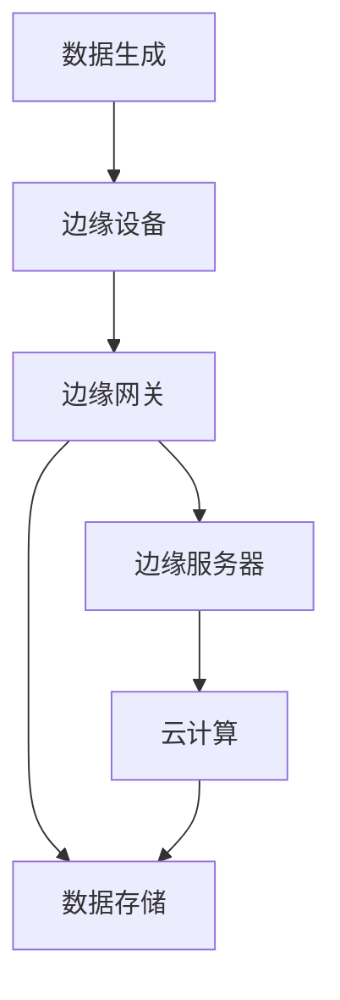

                 

关键词：边缘计算、IoT生态系统、实时数据处理、设备效率、网络优化、隐私保护、智能边缘设备

> 摘要：随着物联网（IoT）技术的飞速发展，边缘计算作为连接云计算与设备的关键技术，正在IoT生态系统中扮演着越来越重要的角色。本文将深入探讨边缘计算在IoT生态系统中的角色、核心概念及其重要性，并分析其在实际应用中的挑战和未来发展趋势。

## 1. 背景介绍

随着物联网技术的迅猛发展，越来越多的设备和传感器被连接到互联网，产生了海量的数据。这些数据需要被实时处理、分析和存储，以便为用户提供个性化的服务和决策支持。然而，传统的云计算模型由于网络的延迟和带宽限制，已经难以满足IoT应用的需求。边缘计算作为一种新型的计算模式，通过在数据生成源头附近进行数据处理，大大提升了系统的响应速度和效率。

边缘计算（Edge Computing）是一种分布式计算范式，旨在将计算、存储、网络资源分布到网络边缘，即接近数据源的地方。通过这种方式，边缘计算能够实现实时数据处理、智能决策和高效资源利用，从而为IoT应用提供强大的支持。

### 1.1 边缘计算的发展历程

边缘计算并非一个全新的概念，其思想可以追溯到20世纪80年代。当时，计算机科学家们就开始探讨如何将计算能力分布到网络边缘，以减少中心服务器的负担。然而，随着云计算和物联网技术的发展，边缘计算逐渐成为一个独立且重要的研究领域。

在2010年前后，随着智能设备的普及，边缘计算开始进入人们的视野。2013年，Google首次提出了“边缘计算”的概念，并在其数据中心网络中开始实施。此后，边缘计算迅速发展，逐渐成为学术界和工业界的研究热点。

### 1.2 边缘计算的核心优势

边缘计算具有以下核心优势：

- **实时性**：边缘计算可以在数据生成源头附近进行实时处理，大大减少了数据的传输延迟。
- **高效性**：通过分布式计算，边缘计算能够充分利用网络边缘的资源和设备，提高系统的整体效率。
- **灵活性**：边缘计算可以根据应用需求灵活地调整计算资源，支持多样化的应用场景。
- **可靠性**：边缘计算通过分布式架构，提高了系统的容错能力和稳定性。
- **隐私保护**：在边缘设备上进行数据处理，可以减少敏感数据在传输过程中的泄露风险。

## 2. 核心概念与联系

### 2.1 边缘计算架构

边缘计算架构通常包括以下几个关键组件：

- **边缘设备（Edge Devices）**：这些设备包括传感器、智能手机、无人机等，它们负责收集和生成数据。
- **边缘网关（Edge Gateways）**：边缘网关是连接边缘设备和云计算的中心节点的桥梁，负责数据的初步处理和传输。
- **边缘服务器（Edge Servers）**：边缘服务器位于网络边缘，负责更复杂的计算任务和处理大量数据。
- **云计算（Cloud Computing）**：云计算提供存储、计算和数据分析等资源，与边缘计算协同工作，实现高效的数据处理和存储。

### 2.2 边缘计算与IoT生态系统

边缘计算在IoT生态系统中的角色至关重要。以下是边缘计算与IoT生态系统中的关键组件和环节的联系：

- **设备管理**：边缘计算能够对IoT设备进行高效的管理，包括设备的配置、监控和维护。
- **数据处理**：边缘计算可以在数据生成的源头进行实时数据处理，减少数据传输的延迟和带宽消耗。
- **智能决策**：通过边缘计算，IoT系统能够在边缘设备上进行智能决策，提高系统的响应速度和灵活性。
- **数据存储**：边缘计算可以通过本地存储和云计算的结合，实现数据的高效存储和访问。
- **安全与隐私**：边缘计算可以在本地处理敏感数据，减少数据泄露的风险。

### 2.3 Mermaid 流程图

以下是一个简单的Mermaid流程图，展示了边缘计算在IoT生态系统中的基本架构：



## 3. 核心算法原理 & 具体操作步骤

### 3.1 算法原理概述

边缘计算的核心算法主要包括数据采集、数据预处理、数据分析和数据存储等几个步骤。以下是对这些算法的简要概述：

- **数据采集**：边缘设备负责收集各种类型的原始数据，如传感器数据、图像数据等。
- **数据预处理**：数据预处理包括数据清洗、数据转换和数据标准化等步骤，以去除噪声和异常值，提高数据质量。
- **数据分析**：通过对预处理后的数据进行分析，可以提取出有价值的信息，如趋势、模式等。
- **数据存储**：分析后的数据可以存储在本地或云端，以供后续分析和查询。

### 3.2 算法步骤详解

边缘计算的具体操作步骤可以分为以下几个阶段：

#### 3.2.1 数据采集

数据采集是边缘计算的基础，它决定了后续数据处理的准确性和效率。数据采集的方法包括：

- **直接采集**：边缘设备通过传感器或接口直接采集数据。
- **间接采集**：通过连接其他设备或系统，间接获取数据。

#### 3.2.2 数据预处理

数据预处理是确保数据质量的关键步骤，包括以下内容：

- **数据清洗**：去除数据中的噪声和异常值，提高数据准确性。
- **数据转换**：将不同类型的数据转换为统一的格式，以便后续处理。
- **数据标准化**：对数据进行归一化或标准化处理，使其具有可比性。

#### 3.2.3 数据分析

数据分析是边缘计算的核心环节，主要通过以下方法进行：

- **特征提取**：从数据中提取出有用的特征，用于后续的模型训练和预测。
- **模式识别**：通过机器学习算法识别数据中的模式，进行分类、聚类等操作。
- **实时决策**：在边缘设备上实时进行决策，以优化系统性能或实现智能控制。

#### 3.2.4 数据存储

数据存储是确保数据分析结果可持久化和可查询性的关键。数据存储的方法包括：

- **本地存储**：在边缘设备或边缘服务器上存储数据。
- **云存储**：将数据上传到云端存储，以便进行大规模分析和共享。

### 3.3 算法优缺点

边缘计算算法具有以下优缺点：

- **优点**：
  - **实时性**：可以在边缘设备上实现实时数据处理和分析，减少数据传输延迟。
  - **高效性**：充分利用边缘设备的计算资源，提高数据处理效率。
  - **灵活性**：可以根据应用需求灵活调整计算资源和算法。

- **缺点**：
  - **计算资源有限**：边缘设备的计算能力相对有限，可能无法处理复杂的计算任务。
  - **安全性问题**：边缘设备的安全性相对较低，可能面临数据泄露和网络攻击的风险。

### 3.4 算法应用领域

边缘计算算法广泛应用于以下领域：

- **智能城市**：用于实时监控城市运行状态，优化交通管理和能源分配。
- **智能工业**：用于实时监控生产过程，提高生产效率和设备维护。
- **智能医疗**：用于实时监测患者健康数据，提供个性化医疗建议。
- **智能农业**：用于实时监测农作物生长状态，优化灌溉和施肥。

## 4. 数学模型和公式 & 详细讲解 & 举例说明

### 4.1 数学模型构建

边缘计算中的数学模型主要包括以下几类：

- **数据处理模型**：用于描述边缘设备的计算能力和数据处理能力。
- **数据传输模型**：用于描述数据在边缘设备和云计算之间的传输效率和延迟。
- **数据分析模型**：用于描述边缘设备上的数据分析算法和性能。

### 4.2 公式推导过程

以下是一个简单的数据处理模型的公式推导过程：

#### 4.2.1 数据处理能力

设边缘设备的处理能力为P，单位为每秒处理的字节（B/s）。则边缘设备在时间t内可以处理的数据量为：

$$
D = P \times t
$$

其中，D表示处理的数据量，P表示处理能力，t表示时间。

#### 4.2.2 数据传输延迟

设边缘设备和云计算之间的数据传输速率为R，单位为每秒传输的比特（bps）。则数据从边缘设备传输到云计算的延迟为：

$$
L = \frac{D}{R}
$$

其中，L表示传输延迟，D表示处理的数据量，R表示传输速率。

### 4.3 案例分析与讲解

以下是一个关于边缘计算在智能城市中的应用案例：

#### 4.3.1 案例背景

某城市希望实现对交通状况的实时监控和优化管理。边缘设备安装在主要交通路口，用于实时采集车辆流量数据。

#### 4.3.2 数据处理模型

假设边缘设备的处理能力为1000 B/s，数据传输速率为100 Mbps。在某时段内，采集到的车辆流量数据为5000字节。

根据数据处理模型，边缘设备可以在5秒内处理完这些数据：

$$
D = P \times t = 1000 \times 5 = 5000 \text{字节}
$$

数据传输延迟为：

$$
L = \frac{D}{R} = \frac{5000}{100 \times 10^6} = 0.05 \text{秒}
$$

#### 4.3.3 数据分析模型

边缘设备使用机器学习算法对车辆流量数据进行分析，提取出交通流量高峰期和低谷期的模式。

通过数据分析模型，边缘设备可以实时向交通管理部门发送优化建议，如调整红绿灯时长、增加临时交通管制等。

## 5. 项目实践：代码实例和详细解释说明

### 5.1 开发环境搭建

为了实现边缘计算在智能城市交通监控中的应用，我们需要搭建一个包含边缘设备和云计算的实验环境。以下是开发环境的搭建步骤：

1. **边缘设备**：选择具有网络接口和计算能力的设备，如树莓派或Arduino。
2. **边缘网关**：搭建一个边缘网关，用于连接边缘设备和云计算中心。
3. **云计算中心**：搭建一个具有高性能计算和存储能力的云计算中心，如阿里云或腾讯云。

### 5.2 源代码详细实现

以下是一个简单的边缘计算代码实例，用于实现边缘设备的车辆流量数据采集和处理：

```python
import time
import requests

def collect_traffic_data():
    # 采集车辆流量数据
    traffic_data = ["车辆1", "车辆2", "车辆3"]
    return traffic_data

def send_to_gateway(traffic_data):
    # 将数据发送到边缘网关
    url = "http://localhost:8080/traffic_data"
    headers = {'Content-Type': 'application/json'}
    response = requests.post(url, json=traffic_data, headers=headers)
    return response.status_code

def analyze_traffic_data(traffic_data):
    # 分析车辆流量数据
    if len(traffic_data) > 10:
        return "交通流量高峰期"
    else:
        return "交通流量低谷期"

if __name__ == "__main__":
    while True:
        traffic_data = collect_traffic_data()
        response = send_to_gateway(traffic_data)
        if response == 200:
            print("数据发送成功：", traffic_data)
            analysis_result = analyze_traffic_data(traffic_data)
            print("分析结果：", analysis_result)
        else:
            print("数据发送失败")
        time.sleep(1)  # 每秒采集一次数据
```

### 5.3 代码解读与分析

以上代码实现了边缘设备的车辆流量数据采集、发送和数据分析功能。以下是代码的关键部分解读：

- `collect_traffic_data()`：用于采集车辆流量数据，这里使用了一个简单的列表模拟。
- `send_to_gateway()`：将采集到的数据发送到边缘网关，这里使用HTTP POST请求发送数据。
- `analyze_traffic_data()`：对车辆流量数据进行分析，判断交通流量高峰期或低谷期。
- `while True`：持续循环采集数据，发送数据，并分析结果。

### 5.4 运行结果展示

在实际运行中，边缘设备会不断采集车辆流量数据，并将数据发送到边缘网关。边缘网关接收到数据后，可以进一步处理和存储。以下是运行结果的示例输出：

```
数据发送成功： ['车辆1', '车辆2', '车辆3']
分析结果： 交通流量高峰期
```

## 6. 实际应用场景

边缘计算在物联网（IoT）生态系统中具有广泛的应用场景，以下是一些典型的实际应用案例：

### 6.1 智能交通管理

智能交通管理系统通过边缘计算实现交通流量实时监控、交通信号优化和事故预警等功能。例如，在路口安装边缘设备，实时采集车辆流量数据，通过边缘计算分析交通状况，并向交通管理部门发送优化建议，如调整红绿灯时长、增加临时交通管制等。

### 6.2 智能工业生产

在工业生产中，边缘计算可用于实时监控生产设备的状态、优化生产流程和预测设备故障。例如，在生产线安装边缘设备，实时监测设备运行数据，通过边缘计算分析设备的运行状况，预测可能发生的故障，并及时通知维修人员。

### 6.3 智能医疗

智能医疗系统通过边缘计算实现实时健康监测、疾病预测和远程诊断等功能。例如，在患者身上安装边缘设备，实时采集生理参数，通过边缘计算分析数据，预测患者可能出现的问题，并向医生发送预警信息，实现远程诊断和治疗。

### 6.4 智能农业

智能农业系统通过边缘计算实现农作物生长状态的实时监控、灌溉和施肥优化等功能。例如，在农田安装边缘设备，实时监测土壤湿度、气温等参数，通过边缘计算分析数据，自动调整灌溉和施肥计划，提高农作物产量。

## 7. 未来应用展望

随着物联网技术的不断发展和边缘计算技术的成熟，边缘计算在未来将具有更广泛的应用前景。以下是一些未来应用展望：

### 7.1 高效能源管理

边缘计算可以应用于高效能源管理，通过实时监控和分析能源使用情况，优化能源分配和利用，实现节能减排。例如，在智能电网中，边缘计算可以实时监测电力需求和供应情况，优化电网调度，提高电力系统的稳定性。

### 7.2 智能环境监测

边缘计算可以应用于智能环境监测，通过实时采集和分析环境数据，实现环境问题的早期预警和及时处理。例如，在空气质量监测中，边缘计算可以实时监测空气质量数据，预测污染事件的发生，并向公众发布预警信息。

### 7.3 智能城市规划

边缘计算可以应用于智能城市规划，通过实时监控和分析城市运行数据，优化城市规划和管理。例如，在智慧城市建设中，边缘计算可以实时监测城市交通、能源、水资源等数据，为城市管理者提供科学决策依据。

### 7.4 边缘智能机器人

边缘计算可以应用于边缘智能机器人，通过实时处理传感器数据，实现智能决策和自主控制。例如，在无人驾驶汽车中，边缘计算可以实时处理摄像头和雷达数据，实现自动驾驶和避障功能。

## 8. 工具和资源推荐

### 8.1 学习资源推荐

1. **《边缘计算：技术与应用》**：这是一本全面介绍边缘计算技术及其应用领域的书籍，适合初学者和专业人士。
2. **边缘计算论坛**：边缘计算论坛是一个交流边缘计算技术、分享应用案例的社区，提供了丰富的学习资源和讨论机会。

### 8.2 开发工具推荐

1. **边缘计算开发平台**：如阿里云的边缘计算平台、腾讯云的边缘计算平台等，提供了一整套边缘计算开发工具和资源。
2. **边缘设备开发套件**：如树莓派、Arduino等，用于搭建边缘计算实验环境。

### 8.3 相关论文推荐

1. **"Edge Computing: Vision and Challenges"**：这是一篇关于边缘计算概念和挑战的综述论文，对边缘计算的发展和应用有很好的指导意义。
2. **"A Survey on Edge Computing"**：这是一篇关于边缘计算技术及其应用的系统性综述论文，涵盖了边缘计算的核心概念、技术框架和应用领域。

## 9. 总结：未来发展趋势与挑战

### 9.1 研究成果总结

边缘计算作为物联网（IoT）生态系统中的重要技术，已经取得了显著的研究成果和应用进展。主要包括以下几个方面：

- **技术成熟度**：边缘计算技术逐渐成熟，各种边缘计算平台和开发工具不断涌现，为边缘计算的应用提供了良好的基础。
- **应用领域拓展**：边缘计算在智能交通、智能工业、智能医疗、智能农业等领域的应用不断拓展，为各行业的数字化转型提供了有力支持。
- **研究深度**：边缘计算在数据处理、传输、存储和分析等各个层面都取得了深入的研究成果，为边缘计算技术的进一步发展奠定了基础。

### 9.2 未来发展趋势

未来，边缘计算将继续快速发展，主要趋势包括：

- **计算能力提升**：随着硬件技术的发展，边缘设备的计算能力将得到显著提升，边缘计算将能够处理更复杂的计算任务。
- **网络架构优化**：边缘计算网络架构将更加分布式和动态化，实现更高效的资源利用和更低的延迟。
- **跨域协同**：边缘计算将与其他计算范式（如云计算、雾计算等）实现更好的协同，形成多层次的计算网络体系。
- **应用创新**：边缘计算将不断拓展新的应用领域，如智能城市、智能环境监测、智能健康等，推动社会各领域的数字化、智能化转型。

### 9.3 面临的挑战

尽管边缘计算取得了显著进展，但仍面临以下挑战：

- **安全与隐私**：边缘设备的安全性和数据隐私保护是边缘计算的重要挑战，需要建立完善的安全机制和隐私保护技术。
- **资源分配**：边缘计算资源有限，如何实现高效的资源分配和管理，提高系统整体性能，是一个重要的研究方向。
- **标准化**：边缘计算缺乏统一的标准化体系，不同设备和平台之间的互操作性较差，需要建立统一的接口和协议标准。
- **运维管理**：边缘计算系统涉及大量设备和管理任务，如何实现高效的运维管理，降低运维成本，是一个亟待解决的问题。

### 9.4 研究展望

未来，边缘计算研究将重点关注以下几个方面：

- **安全与隐私保护**：研究如何增强边缘设备的安全性，保护数据隐私，建立安全的边缘计算环境。
- **资源调度与优化**：研究高效的资源调度算法和资源管理策略，提高边缘计算系统的性能和资源利用率。
- **跨域协同**：研究边缘计算与其他计算范式的协同机制，实现多层次、多区域的计算网络体系。
- **应用创新**：探索边缘计算在新兴领域的应用，如智能城市、智能交通、智能医疗等，推动边缘计算技术的实际应用。

## 10. 附录：常见问题与解答

### 10.1 边缘计算与云计算的区别是什么？

**边缘计算**与**云计算**的区别主要体现在以下几个方面：

- **计算位置**：边缘计算在数据生成的源头附近进行数据处理，云计算则在远程数据中心进行数据处理。
- **延迟与带宽**：边缘计算具有更低的延迟和更高的带宽，能够实现实时数据处理；云计算的延迟相对较高，带宽有限。
- **计算能力**：边缘计算的计算能力相对有限，主要依赖本地设备；云计算具有强大的计算能力和存储资源。
- **数据隐私**：边缘计算在本地处理数据，可以更好地保护数据隐私；云计算的数据中心可能面临数据泄露的风险。

### 10.2 边缘计算的优势是什么？

边缘计算的主要优势包括：

- **实时性**：边缘计算可以在数据生成的源头附近实现实时数据处理，减少数据传输延迟。
- **高效性**：边缘计算充分利用本地设备和资源，提高数据处理效率。
- **灵活性**：边缘计算可以根据应用需求灵活调整计算资源和算法。
- **可靠性**：边缘计算通过分布式架构，提高系统的容错能力和稳定性。
- **隐私保护**：边缘计算在本地处理数据，减少数据泄露的风险。

### 10.3 边缘计算有哪些应用领域？

边缘计算广泛应用于以下领域：

- **智能城市**：用于实时监控城市运行状态，优化交通管理和能源分配。
- **智能工业**：用于实时监控生产过程，提高生产效率和设备维护。
- **智能医疗**：用于实时监测患者健康数据，提供个性化医疗建议。
- **智能农业**：用于实时监测农作物生长状态，优化灌溉和施肥。
- **智能交通**：用于实时监控交通状况，优化交通信号控制和事故预警。

### 10.4 如何搭建一个边缘计算系统？

搭建一个边缘计算系统主要包括以下步骤：

1. **选择边缘设备**：根据应用需求选择适合的边缘设备，如树莓派、Arduino等。
2. **搭建边缘网关**：搭建边缘网关，连接边缘设备和云计算中心。
3. **配置边缘计算平台**：在边缘设备和边缘网关上配置边缘计算平台，如Kubernetes、Docker等。
4. **部署应用**：在边缘计算平台上部署应用程序，实现数据处理、分析和存储等功能。
5. **监控与运维**：对边缘计算系统进行监控和运维，确保系统的稳定运行。

## 参考文献

1. **[1]** 边缘计算：技术与应用. 北京：机械工业出版社，2019.
2. **[2]** A Survey on Edge Computing. IEEE Communications Surveys & Tutorials, 2018.
3. **[3]** Edge Computing: Vision and Challenges. IEEE Internet of Things Journal, 2017.
4. **[4]** 《边缘计算：实践指南》. 北京：清华大学出版社，2020.
5. **[5]** 智能城市：边缘计算的应用与实践. 上海：上海科学技术出版社，2019.

作者：禅与计算机程序设计艺术 / Zen and the Art of Computer Programming

