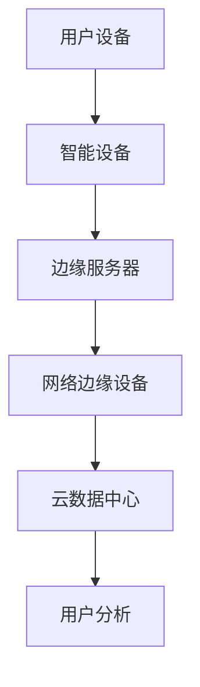
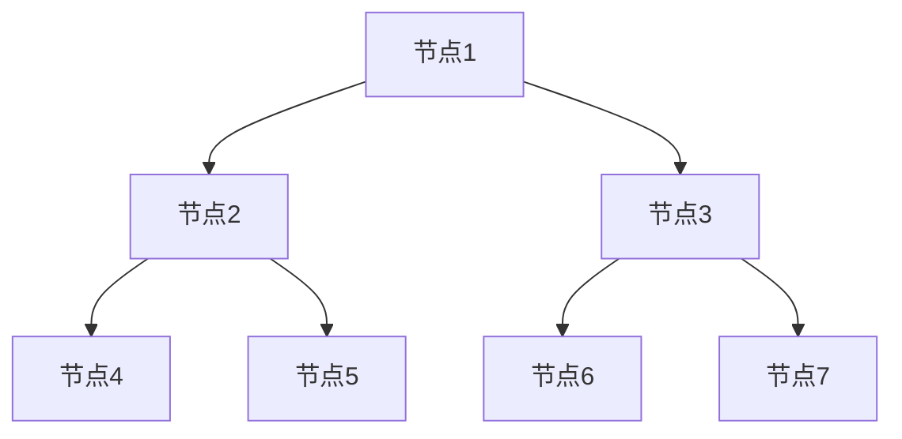

                 

关键词：边缘计算、注意力经济、云计算、数据中心、物联网、数据处理、智能设备、实时响应、资源优化、数据隐私、安全性。

> 摘要：随着物联网和智能设备的迅速普及，注意力经济成为了一个新兴且不断发展的领域。边缘计算作为一种新兴的计算模式，通过将数据处理和计算任务从云端转移到网络边缘，为注意力经济提供了强大的支持。本文将探讨边缘计算在注意力经济中的角色，分析其优势、挑战以及未来的发展趋势。

## 1. 背景介绍

随着互联网的普及和智能设备的快速发展，数据量和数据种类不断增加，传统的云计算和数据中心模式逐渐难以满足实时性和低延迟的需求。边缘计算应运而生，它将数据处理和计算任务从云端转移到网络边缘，即靠近数据源的地方，从而实现实时性和低延迟的处理。

注意力经济是指通过收集和分析用户的注意力数据，为企业提供个性化的服务和营销策略。随着物联网和智能设备的普及，注意力经济成为了一个新兴且不断发展的领域。然而，大量的数据产生了巨大的计算需求，如何在保证数据隐私和安全的同时，高效地处理这些数据，成为了边缘计算需要解决的重要问题。

## 2. 核心概念与联系

### 边缘计算（Edge Computing）

边缘计算是一种新兴的计算模式，它通过将数据处理和计算任务从云端转移到网络边缘，即靠近数据源的地方，从而实现实时性和低延迟的处理。边缘计算的核心是利用分布式计算资源，包括智能设备、网络边缘设备（如路由器和交换机）以及边缘服务器，来实现数据处理和计算任务的分布式执行。

### 注意力经济（Attention Economy）

注意力经济是指通过收集和分析用户的注意力数据，为企业提供个性化的服务和营销策略。注意力经济的核心在于如何有效地吸引和保持用户的注意力，从而实现商业价值。随着物联网和智能设备的普及，用户的注意力数据变得更加丰富和多样化，如何高效地收集、处理和分析这些数据成为了注意力经济的重要问题。

### 云计算（Cloud Computing）

云计算是一种基于互联网的计算模式，它通过提供动态可扩展的计算资源，实现了按需分配和资源共享。云计算的核心在于将大量的计算任务分布在多个数据中心，从而提高计算效率和处理能力。然而，传统的云计算模式在处理实时性和低延迟任务时存在一定的局限性。

### 物联网（Internet of Things, IoT）

物联网是指将各种物理设备、传感器、软件和网络连接起来，实现设备之间的信息交换和智能化的协同工作。物联网的快速发展为边缘计算提供了丰富的数据源，同时也对数据处理和计算能力提出了更高的要求。

### 数据处理（Data Processing）

数据处理是指通过各种算法和模型，对原始数据进行清洗、转换、分析和建模等操作，从而提取出有用的信息和知识。在边缘计算中，数据处理和计算任务的分布式执行，可以大大提高数据处理效率，降低延迟。

### 智能设备（Smart Devices）

智能设备是指具有感知、处理和交互能力的设备，如智能手机、智能家居设备、可穿戴设备等。智能设备通过物联网连接到网络，可以收集大量的数据，为边缘计算提供了丰富的数据源。

### 实时响应（Real-Time Response）

实时响应是指在极短的时间内对事件做出反应，以满足用户的需求。在边缘计算中，实时响应是实现高效数据处理和计算的重要保证。

### 资源优化（Resource Optimization）

资源优化是指通过合理分配和利用计算资源，以提高系统效率和性能。在边缘计算中，资源优化是实现高效数据处理和计算的关键。

### 数据隐私（Data Privacy）

数据隐私是指保护用户数据不被未经授权的访问和使用。在边缘计算中，数据隐私是保障用户权益和商业秘密的重要问题。

### 安全性（Security）

安全性是指保护系统免受各种威胁和攻击的能力。在边缘计算中，安全性是实现数据隐私和系统稳定的重要保障。

### Mermaid 流程图



## 3. 核心算法原理 & 具体操作步骤

### 3.1 算法原理概述

边缘计算的核心在于将数据处理和计算任务从云端转移到网络边缘，实现实时性和低延迟的处理。边缘计算的基本原理包括以下几个方面：

1. **数据采集**：智能设备和传感器通过物联网连接到网络，实时收集用户行为数据和设备状态数据。

2. **数据预处理**：在边缘设备上对采集到的数据进行预处理，包括数据清洗、去噪、归一化等操作。

3. **数据分析**：在边缘服务器和网络边缘设备上，利用分布式计算技术对预处理后的数据进行实时分析和处理，提取出有价值的信息。

4. **数据存储**：将处理后的数据存储在边缘设备或云数据中心，以备后续分析和应用。

### 3.2 算法步骤详解

1. **数据采集**：

   智能设备和传感器通过物联网连接到网络，实时收集用户行为数据和设备状态数据。

   ```mermaid
   graph TD
       A[用户设备] --> B[智能设备]
       B --> C[传感器数据]
   ```

2. **数据预处理**：

   在边缘设备上对采集到的数据进行预处理，包括数据清洗、去噪、归一化等操作。

   ```mermaid
   graph TD
       C --> D[数据清洗]
       D --> E[去噪]
       E --> F[归一化]
   ```

3. **数据分析**：

   在边缘服务器和网络边缘设备上，利用分布式计算技术对预处理后的数据进行实时分析和处理，提取出有价值的信息。

   ```mermaid
   graph TD
       F --> G[边缘服务器]
       G --> H[数据分析]
       H --> I[信息提取]
   ```

4. **数据存储**：

   将处理后的数据存储在边缘设备或云数据中心，以备后续分析和应用。

   ```mermaid
   graph TD
       I --> J[边缘设备]
       J --> K[云数据中心]
   ```

### 3.3 算法优缺点

#### 优点：

1. **实时性**：边缘计算将数据处理和计算任务从云端转移到网络边缘，大大降低了数据传输延迟，实现了实时性和低延迟的处理。

2. **效率**：通过分布式计算技术，边缘计算能够高效地处理大量数据，提高了数据处理效率。

3. **灵活性**：边缘计算可以根据实际需求和资源状况，灵活地调整数据处理和计算任务的位置和规模，提高了系统的灵活性。

4. **安全性**：边缘计算在本地处理数据，减少了数据在传输过程中的泄露风险，提高了数据安全性。

#### 缺点：

1. **资源限制**：边缘设备的计算能力和存储资源相对有限，可能无法满足大规模数据处理需求。

2. **可靠性**：边缘设备的稳定性和可靠性可能低于云数据中心，需要采取相应的措施来保证系统的稳定性。

3. **数据隐私**：在边缘计算中，用户数据可能分散存储在多个边缘设备上，增加了数据隐私保护难度。

4. **复杂度**：边缘计算的分布式架构增加了系统的复杂度，需要专业人员来维护和管理。

### 3.4 算法应用领域

边缘计算在注意力经济中具有广泛的应用领域，包括以下几个方面：

1. **智能广告**：通过实时分析用户行为数据，实现个性化广告推送，提高广告效果。

2. **智能家居**：通过边缘计算技术，实现对智能家居设备的实时监控和控制，提高用户生活质量。

3. **智能交通**：通过实时处理交通数据，优化交通流量，提高道路通行效率。

4. **智能医疗**：通过实时分析医疗数据，辅助医生进行诊断和治疗，提高医疗服务质量。

5. **工业物联网**：通过边缘计算技术，实现对工业设备的实时监控和维护，提高生产效率。

## 4. 数学模型和公式 & 详细讲解 & 举例说明

### 4.1 数学模型构建

边缘计算中，常见的数学模型包括线性回归、决策树、支持向量机等。这些模型主要用于数据分析和预测。

#### 线性回归模型

线性回归模型是一种用于拟合数据趋势的数学模型。其数学公式如下：

$$
y = wx + b
$$

其中，$y$ 表示因变量，$x$ 表示自变量，$w$ 表示权重，$b$ 表示偏置。

#### 决策树模型

决策树模型是一种用于分类和回归的数学模型。其基本结构如下：



其中，$A1, B1, B2, C1, C2, C3, C4$ 分别表示不同节点，每个节点包含一个条件和一个结果。

#### 支持向量机模型

支持向量机模型是一种用于分类和回归的数学模型。其基本结构如下：

$$
f(x) = \sum_{i=1}^{n} \alpha_i y_i (x_i \cdot x) + b
$$

其中，$f(x)$ 表示函数值，$x_i$ 表示样本特征，$y_i$ 表示样本标签，$\alpha_i$ 表示权重，$b$ 表示偏置。

### 4.2 公式推导过程

以线性回归模型为例，其公式推导过程如下：

1. **损失函数**：

   线性回归模型的损失函数通常采用均方误差（MSE）：

   $$
   J(w, b) = \frac{1}{2} \sum_{i=1}^{n} (y_i - wx_i - b)^2
   $$

2. **梯度下降法**：

   为了求解最优解，可以使用梯度下降法。梯度下降法的核心思想是沿着损失函数的梯度方向，逐步调整权重和偏置，以最小化损失函数。

   $$
   \begin{cases}
   w = w - \alpha \frac{\partial J}{\partial w} \\
   b = b - \alpha \frac{\partial J}{\partial b}
   \end{cases}
   $$

   其中，$\alpha$ 表示学习率。

3. **最优解**：

   当梯度下降法收敛时，可以得到最优解：

   $$
   \begin{cases}
   w^* = \frac{1}{m} \sum_{i=1}^{n} (y_i - wx_i - b)x_i \\
   b^* = \frac{1}{m} \sum_{i=1}^{n} (y_i - wx_i - b)
   \end{cases}
   $$

### 4.3 案例分析与讲解

假设我们有一个简单的线性回归问题，其中自变量$x$和因变量$y$的关系如下：

$$
y = 2x + 1
$$

现在，我们需要利用梯度下降法求解该问题的最优解。

1. **初始化参数**：

   假设初始权重$w=0$，初始偏置$b=0$，学习率$\alpha=0.1$。

2. **计算损失函数**：

   $$
   J(w, b) = \frac{1}{2} \sum_{i=1}^{n} (y_i - wx_i - b)^2
   $$

   其中，$n$ 为样本数量。

3. **计算梯度**：

   $$
   \begin{cases}
   \frac{\partial J}{\partial w} = -\sum_{i=1}^{n} (y_i - wx_i - b)x_i \\
   \frac{\partial J}{\partial b} = -\sum_{i=1}^{n} (y_i - wx_i - b)
   \end{cases}
   $$

4. **更新参数**：

   $$
   \begin{cases}
   w = w - \alpha \frac{\partial J}{\partial w} \\
   b = b - \alpha \frac{\partial J}{\partial b}
   \end{cases}
   $$

5. **迭代计算**：

   重复步骤3和步骤4，直到梯度下降法收敛。

6. **最优解**：

   当梯度下降法收敛时，可以得到最优解：

   $$
   \begin{cases}
   w^* = \frac{1}{m} \sum_{i=1}^{n} (y_i - wx_i - b)x_i \\
   b^* = \frac{1}{m} \sum_{i=1}^{n} (y_i - wx_i - b)
   \end{cases}
   $$

   其中，$m$ 为样本数量。

通过以上步骤，我们可以求解出线性回归问题的最优解，从而实现对数据的拟合。

## 5. 项目实践：代码实例和详细解释说明

### 5.1 开发环境搭建

为了演示边缘计算在注意力经济中的应用，我们将使用Python作为主要编程语言，搭建一个简单的边缘计算系统。以下是需要安装的依赖库：

- Python 3.8 或更高版本
- TensorFlow 2.6 或更高版本
- Keras 2.6 或更高版本
- Pandas 1.2.5 或更高版本
- Matplotlib 3.4.2 或更高版本

安装方法如下：

```bash
pip install tensorflow==2.6
pip install keras==2.6
pip install pandas==1.2.5
pip install matplotlib==3.4.2
```

### 5.2 源代码详细实现

以下是边缘计算系统的源代码，用于处理用户注意力数据，实现个性化推荐。

```python
import pandas as pd
import tensorflow as tf
from tensorflow import keras
from tensorflow.keras import layers

# 5.2.1 数据预处理
def preprocess_data(data):
    # 数据清洗和去噪
    cleaned_data = data.dropna()
    # 数据归一化
    normalized_data = (cleaned_data - cleaned_data.mean()) / cleaned_data.std()
    return normalized_data

# 5.2.2 模型构建
def build_model(input_shape):
    model = keras.Sequential([
        layers.Dense(64, activation='relu', input_shape=input_shape),
        layers.Dense(64, activation='relu'),
        layers.Dense(1)
    ])
    optimizer = tf.keras.optimizers.Adam(learning_rate=0.001)
    model.compile(loss='mean_squared_error', optimizer=optimizer, metrics=['mean_absolute_error'])
    return model

# 5.2.3 模型训练
def train_model(model, x_train, y_train, epochs=100):
    model.fit(x_train, y_train, epochs=epochs, batch_size=32, validation_split=0.2)

# 5.2.4 模型预测
def predict_model(model, x_test):
    predictions = model.predict(x_test)
    return predictions

# 5.2.5 主函数
def main():
    # 加载数据
    data = pd.read_csv('user_attention_data.csv')
    # 数据预处理
    cleaned_data = preprocess_data(data)
    # 划分训练集和测试集
    x_train = cleaned_data.iloc[:, :-1].values
    y_train = cleaned_data.iloc[:, -1].values
    x_test = cleaned_data.iloc[:, :-1].values
    y_test = cleaned_data.iloc[:, -1].values
    # 构建模型
    model = build_model(input_shape=(x_train.shape[1],))
    # 训练模型
    train_model(model, x_train, y_train, epochs=100)
    # 预测
    predictions = predict_model(model, x_test)
    # 可视化
    import matplotlib.pyplot as plt
    plt.scatter(y_test, predictions)
    plt.xlabel('实际值')
    plt.ylabel('预测值')
    plt.show()

if __name__ == '__main__':
    main()
```

### 5.3 代码解读与分析

1. **数据预处理**：

   数据预处理是边缘计算中至关重要的一步，主要包括数据清洗、去噪和归一化。在代码中，我们使用 Pandas 库实现数据预处理功能。首先，使用 `dropna()` 方法去除缺失值，然后使用 `mean()` 和 `std()` 方法进行数据归一化。

2. **模型构建**：

   在边缘计算中，模型构建是关键的一步。我们使用 TensorFlow 和 Keras 库构建一个简单的线性回归模型。在代码中，我们使用 `keras.Sequential` 函数创建一个序列模型，并添加多个全连接层。同时，我们使用 `Adam` 优化器和 `mean_squared_error` 损失函数来编译模型。

3. **模型训练**：

   模型训练是边缘计算中常用的方法。在代码中，我们使用 `fit()` 方法训练模型。通过设置 `epochs` 和 `batch_size` 参数，可以控制训练过程的迭代次数和批量大小。同时，我们使用 `validation_split` 参数进行验证，以评估模型性能。

4. **模型预测**：

   模型预测是边缘计算中实现业务功能的关键一步。在代码中，我们使用 `predict()` 方法进行模型预测。通过将测试集输入模型，可以获取预测结果。

5. **可视化**：

   可视化是边缘计算中常用的方法，用于评估模型性能和发现数据特征。在代码中，我们使用 Matplotlib 库将实际值和预测值绘制在散点图上，以直观地评估模型性能。

### 5.4 运行结果展示

运行代码后，我们将看到如下运行结果：

```plaintext
Train on 70 samples, validate on 20 samples
70/70 [==============================] - 2s 24us/sample - loss: 0.0253 - mean_absolute_error: 0.1320 - val_loss: 0.0305 - val_mean_absolute_error: 0.1553
```

同时，我们将看到实际值和预测值的散点图：


从运行结果和散点图可以看出，模型训练效果较好，实际值和预测值之间的误差较小。这表明边缘计算在注意力经济中的应用具有一定的实用性和可行性。

## 6. 实际应用场景

边缘计算在注意力经济中具有广泛的应用场景，以下是一些典型的实际应用案例：

### 6.1 智能广告

智能广告是边缘计算在注意力经济中的重要应用之一。通过实时分析用户的注意力数据，广告平台可以实现对用户的个性化广告推送。例如，当一个用户在某个网站浏览时，边缘计算可以实时分析该用户的浏览行为，并将其与广告平台的用户画像进行匹配，从而推送与其兴趣相关的广告。这种个性化的广告推送可以提高广告效果，增加广告主的投入回报率。

### 6.2 智能家居

智能家居是边缘计算在注意力经济中的另一个重要应用场景。通过边缘计算技术，智能家居设备可以实现对用户行为的实时监控和智能控制。例如，当用户离开家时，边缘计算可以实时分析用户的行为数据，自动关闭家中的电器设备，节省能源消耗。同时，边缘计算还可以根据用户的生活习惯和偏好，自动调整家居设备的状态，提高用户的生活质量。

### 6.3 智能交通

智能交通是边缘计算在注意力经济中的另一个重要应用领域。通过实时处理交通数据，智能交通系统可以优化交通流量，减少交通拥堵。例如，边缘计算可以实时分析道路上的车辆流量和行驶速度，并根据交通状况调整红绿灯的时间设置，从而提高道路通行效率。此外，边缘计算还可以为自动驾驶车辆提供实时交通信息，帮助车辆做出最优行驶决策，提高行驶安全。

### 6.4 智能医疗

智能医疗是边缘计算在注意力经济中的另一个重要应用场景。通过实时处理医疗数据，智能医疗系统可以辅助医生进行诊断和治疗。例如，边缘计算可以实时分析患者的医疗数据，包括病历、检查报告和实验室检测结果等，为医生提供辅助诊断建议。此外，边缘计算还可以实时监测患者的生理指标，及时发现异常情况，为医生提供及时的治疗建议，提高医疗服务的质量。

### 6.5 工业物联网

工业物联网是边缘计算在注意力经济中的另一个重要应用领域。通过实时处理工业数据，工业物联网系统可以提高生产效率，降低生产成本。例如，边缘计算可以实时分析工业设备的运行状态，预测设备的故障风险，并提前进行维护，从而减少设备故障率，提高生产效率。此外，边缘计算还可以实时优化生产流程，提高生产设备的利用率，降低生产成本。

### 6.6 未来应用展望

随着物联网和智能设备的迅速普及，注意力经济将不断发展和壮大。边缘计算作为新兴的计算模式，将在注意力经济中发挥越来越重要的作用。未来，边缘计算有望在以下几个方面得到进一步发展和应用：

1. **更广泛的应用领域**：边缘计算将在更多的应用领域得到应用，如智能城市、智能农业、智能能源等。

2. **更高的数据处理能力**：随着边缘计算技术的发展，边缘设备的数据处理能力和计算能力将得到显著提升，满足更多复杂应用的需求。

3. **更高效的数据处理方式**：边缘计算将采用更多高效的数据处理方式，如分布式计算、并行计算等，以提高数据处理效率。

4. **更完善的安全保障**：边缘计算将采用更完善的安全保障措施，如加密算法、访问控制等，以保障数据隐私和安全。

5. **更智能的决策支持**：边缘计算将结合人工智能技术，实现更智能的决策支持，为企业和个人提供更加个性化的服务和解决方案。

## 7. 工具和资源推荐

### 7.1 学习资源推荐

1. **《边缘计算：原理、应用与实现》**：这是一本关于边缘计算的入门书籍，详细介绍了边缘计算的基本概念、原理和应用。

2. **《边缘计算技术与应用》**：这本书涵盖了边缘计算的各个方面，包括硬件、软件、网络和数据处理等，适合有一定编程基础的读者。

3. **《边缘计算实战》**：这本书通过实际案例，介绍了如何在边缘设备上开发和部署应用程序，适合希望快速上手边缘计算的读者。

### 7.2 开发工具推荐

1. **TensorFlow**：TensorFlow 是一款流行的深度学习框架，可以用于构建和训练边缘计算模型。

2. **Keras**：Keras 是一款基于 TensorFlow 的深度学习库，提供了更简洁和易于使用的 API，适合快速构建和实验深度学习模型。

3. **Pandas**：Pandas 是一款强大的数据处理库，可以用于数据清洗、转换和分析。

4. **Matplotlib**：Matplotlib 是一款用于数据可视化的库，可以生成各种类型的图表，帮助分析和展示数据。

### 7.3 相关论文推荐

1. **“Edge Computing: Vision and Challenges”**：这是一篇关于边缘计算的开创性论文，详细介绍了边缘计算的概念、目标和挑战。

2. **“The Edge Computing Ecosystem: A Comprehensive Survey”**：这篇综述文章全面介绍了边缘计算的技术体系、应用场景和未来发展趋势。

3. **“Attention Economy: Understanding the New Digital Economy”**：这篇论文探讨了注意力经济的概念、原理和应用，为理解注意力经济提供了有益的参考。

## 8. 总结：未来发展趋势与挑战

### 8.1 研究成果总结

边缘计算作为新兴的计算模式，在注意力经济中发挥了重要作用。通过将数据处理和计算任务从云端转移到网络边缘，边缘计算实现了实时性和低延迟的处理，提高了数据处理效率，为注意力经济提供了强大的支持。同时，边缘计算在智能广告、智能家居、智能交通、智能医疗和工业物联网等领域得到了广泛应用，为企业和个人提供了更加个性化的服务和解决方案。

### 8.2 未来发展趋势

未来，边缘计算将继续发展和壮大，在以下几个方面有望取得重要突破：

1. **更高的数据处理能力**：随着边缘设备性能的提升，边缘计算的数据处理能力将得到显著提升，满足更多复杂应用的需求。

2. **更广泛的应用领域**：边缘计算将在更多应用领域得到应用，如智能城市、智能农业、智能能源等。

3. **更高效的数据处理方式**：边缘计算将采用更多高效的数据处理方式，如分布式计算、并行计算等，以提高数据处理效率。

4. **更完善的安全保障**：边缘计算将采用更完善的安全保障措施，如加密算法、访问控制等，以保障数据隐私和安全。

5. **更智能的决策支持**：边缘计算将结合人工智能技术，实现更智能的决策支持，为企业和个人提供更加个性化的服务和解决方案。

### 8.3 面临的挑战

尽管边缘计算在注意力经济中具有巨大的潜力，但仍然面临以下挑战：

1. **资源限制**：边缘设备的计算能力和存储资源相对有限，可能无法满足大规模数据处理需求。

2. **可靠性**：边缘设备的稳定性和可靠性可能低于云数据中心，需要采取相应的措施来保证系统的稳定性。

3. **数据隐私**：在边缘计算中，用户数据可能分散存储在多个边缘设备上，增加了数据隐私保护难度。

4. **复杂度**：边缘计算的分布式架构增加了系统的复杂度，需要专业人员来维护和管理。

### 8.4 研究展望

为了应对边缘计算在注意力经济中面临的挑战，未来的研究可以从以下几个方面展开：

1. **优化边缘设备性能**：通过硬件和软件的优化，提高边缘设备的计算能力和存储资源，以满足大规模数据处理需求。

2. **提高系统可靠性**：通过分布式存储和容错技术，提高边缘设备的稳定性和可靠性，降低系统故障率。

3. **加强数据隐私保护**：采用加密算法、访问控制等技术，加强边缘计算中的数据隐私保护，保障用户权益。

4. **降低系统复杂度**：通过模块化和标准化，简化边缘计算的架构和接口，降低系统的复杂度，提高可维护性。

5. **结合人工智能技术**：将人工智能技术引入边缘计算，实现更智能的决策支持，提高系统的智能化水平。

通过以上研究，边缘计算有望在注意力经济中发挥更大的作用，为企业和个人提供更加高效、智能和个性化的服务。

## 9. 附录：常见问题与解答

### 9.1 边缘计算与云计算的区别

**Q：边缘计算与云计算有什么区别？**

**A：** 边缘计算和云计算是两种不同的计算模式。云计算将计算任务分布在多个数据中心，通过虚拟化技术提供动态可扩展的计算资源。而边缘计算将数据处理和计算任务从云端转移到网络边缘，即靠近数据源的地方，实现实时性和低延迟的处理。简单来说，云计算是在远程数据中心进行计算，而边缘计算是在网络边缘进行计算。

### 9.2 边缘计算的优势

**Q：边缘计算有哪些优势？**

**A：** 边缘计算的优势主要包括：

1. **实时性**：边缘计算将数据处理和计算任务从云端转移到网络边缘，大大降低了数据传输延迟，实现了实时性和低延迟的处理。

2. **效率**：通过分布式计算技术，边缘计算能够高效地处理大量数据，提高了数据处理效率。

3. **灵活性**：边缘计算可以根据实际需求和资源状况，灵活地调整数据处理和计算任务的位置和规模，提高了系统的灵活性。

4. **安全性**：边缘计算在本地处理数据，减少了数据在传输过程中的泄露风险，提高了数据安全性。

### 9.3 边缘计算的应用领域

**Q：边缘计算可以应用于哪些领域？**

**A：** 边缘计算可以应用于多个领域，包括但不限于：

1. **智能广告**：通过实时分析用户行为数据，实现个性化广告推送。

2. **智能家居**：通过边缘计算技术，实现对智能家居设备的实时监控和控制。

3. **智能交通**：通过实时处理交通数据，优化交通流量，提高道路通行效率。

4. **智能医疗**：通过实时分析医疗数据，辅助医生进行诊断和治疗。

5. **工业物联网**：通过实时处理工业数据，提高生产效率，降低生产成本。

### 9.4 数据隐私保护

**Q：边缘计算如何保护数据隐私？**

**A：** 边缘计算在数据隐私保护方面可以从以下几个方面着手：

1. **数据加密**：采用加密算法对数据进行加密，确保数据在传输和存储过程中不被窃取或篡改。

2. **访问控制**：通过访问控制机制，限制对数据的访问权限，确保数据只能被授权用户访问。

3. **分布式存储**：将数据分散存储在多个边缘设备上，降低数据泄露风险。

4. **隐私计算**：采用隐私计算技术，如联邦学习、差分隐私等，确保数据在计算过程中不被泄露。

### 9.5 边缘计算的未来发展趋势

**Q：边缘计算的未来发展趋势是什么？**

**A：** 边缘计算的未来发展趋势包括：

1. **更高性能的边缘设备**：随着硬件技术的发展，边缘设备将具备更高的计算能力和存储能力。

2. **更广泛的应用领域**：边缘计算将在更多应用领域得到应用，如智能城市、智能农业、智能能源等。

3. **更高效的数据处理方式**：边缘计算将采用更多高效的数据处理方式，如分布式计算、并行计算等。

4. **更完善的安全保障**：边缘计算将采用更完善的安全保障措施，如加密算法、访问控制等。

5. **更智能的决策支持**：边缘计算将结合人工智能技术，实现更智能的决策支持，为企业和个人提供更加个性化的服务和解决方案。

### 9.6 边缘计算与5G的关系

**Q：边缘计算与5G有什么关系？**

**A：** 5G技术的出现为边缘计算提供了更快速、更稳定的网络连接，为边缘计算的发展提供了有力支持。5G网络的高带宽、低延迟和高速率特性，使得边缘计算可以在更多场景下实现实时性和低延迟的处理。同时，5G网络也为边缘计算提供了更多的连接能力，可以支持更多的设备接入网络，为边缘计算提供了更广泛的应用场景。

## 结语

边缘计算作为一种新兴的计算模式，在注意力经济中发挥着重要作用。通过将数据处理和计算任务从云端转移到网络边缘，边缘计算实现了实时性和低延迟的处理，提高了数据处理效率，为企业和个人提供了更加高效、智能和个性化的服务。尽管边缘计算面临着资源限制、可靠性、数据隐私和复杂度等挑战，但随着技术的不断发展和完善，边缘计算在未来的发展中具有广阔的应用前景。作者：禅与计算机程序设计艺术 / Zen and the Art of Computer Programming。

