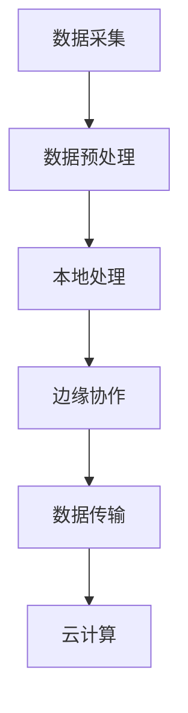

                 

 关键词：边缘计算、注意力经济、物联网、数据处理、实时分析、云计算、分布式系统

> 摘要：随着物联网的快速发展，数据生成的速度和规模不断攀升，如何高效处理和利用这些数据成为关键问题。边缘计算作为一种新兴的技术，凭借其接近数据源的优势，在注意力经济中扮演着越来越重要的角色。本文将探讨边缘计算的基本概念、核心原理、技术架构以及其在注意力经济中的实际应用，并对其未来发展进行展望。

## 1. 背景介绍

随着智能设备和物联网（IoT）的迅速普及，数据量呈现出爆炸式增长。根据国际数据公司（IDC）的统计，全球产生的数据量预计将在2025年达到160ZB。这种数据增长带来了对数据处理和存储能力的巨大需求。传统的云计算模型通常依赖于中心化的服务器和数据中心，这些系统在面对海量数据时面临着延迟高、带宽不足、功耗大等问题。

为了解决这些问题，边缘计算作为一种分布式计算模型应运而生。边缘计算将计算、存储和网络功能部署在接近数据源的边缘设备上，如智能传感器、路由器和网关等。这样不仅可以显著降低数据传输的延迟，提高数据处理的速度，还可以减轻中心化数据中心的负担，实现资源的高效利用。

注意力经济是指人们为获取、处理和分享信息而付出的关注和时间。在数字经济时代，注意力成为了一种宝贵的资源。边缘计算通过提供实时数据处理和分析的能力，有助于企业在竞争激烈的市场中赢得用户的注意力。因此，边缘计算在注意力经济中具有独特的优势和广泛的应用前景。

## 2. 核心概念与联系

### 2.1 边缘计算的定义与工作原理

边缘计算（Edge Computing）是指将计算任务从中心化的云计算平台转移到网络边缘的设备上执行。这些边缘设备可以是智能传感器、智能手机、智能路由器等。边缘计算的核心思想是利用这些设备上的处理能力，就近处理数据，从而减少数据传输的延迟，提高系统的响应速度。

边缘计算的工作原理可以分为以下几个步骤：

1. **数据采集**：在边缘设备上收集数据，如传感器采集环境数据、摄像头捕捉图像等。
2. **预处理**：在边缘设备上对采集到的数据进行初步处理，如数据清洗、数据压缩等。
3. **本地处理**：利用边缘设备的计算能力对数据进行实时分析，执行特定的算法或任务。
4. **边缘协作**：边缘设备之间可以通过通信网络进行协作，共享处理结果，共同完成复杂的任务。
5. **数据传输**：将处理后的数据上传到云端或其他边缘设备，进行进一步分析和处理。

### 2.2 边缘计算与云计算的关系

边缘计算和云计算并不是替代关系，而是互补关系。云计算提供了强大的计算资源和存储能力，适合处理大规模、复杂的计算任务。而边缘计算则侧重于实时数据处理和响应，适合处理低延迟、高带宽需求的应用场景。

在技术架构上，边缘计算通常与云计算相结合，形成一种分布式计算系统。云计算负责处理大规模的数据分析和存储任务，边缘计算则负责本地数据的实时处理和响应。这种结合不仅提高了系统的效率和响应速度，还实现了资源的最优配置。

### 2.3 边缘计算的应用场景

边缘计算在多个领域都有着广泛的应用，以下是一些典型的应用场景：

1. **智能制造**：在制造业中，边缘计算可以用于实时监控生产设备的运行状态，快速响应对设备故障的处理，提高生产效率。
2. **智慧交通**：在交通管理中，边缘计算可以用于实时分析交通数据，优化交通信号控制，减少交通拥堵。
3. **智慧医疗**：在医疗领域，边缘计算可以用于实时监控病人的生命体征，快速诊断病情，提高医疗服务的质量。
4. **智能家居**：在智能家居中，边缘计算可以用于实时分析家庭设备的状态，实现智能控制，提高生活质量。

### 2.4 Mermaid 流程图



## 3. 核心算法原理 & 具体操作步骤

### 3.1 算法原理概述

边缘计算的核心算法包括数据预处理、实时分析和数据协作。以下是这些算法的基本原理：

1. **数据预处理**：在边缘设备上对采集到的原始数据进行清洗、压缩和特征提取等操作，以便于后续处理。
2. **实时分析**：利用边缘设备的计算能力，执行特定的机器学习算法或数据挖掘算法，对数据进行实时分析，提取有价值的信息。
3. **数据协作**：边缘设备之间通过通信网络进行协作，共享处理结果，共同完成复杂的任务。

### 3.2 算法步骤详解

1. **数据预处理**：

   - **数据清洗**：去除数据中的噪声和异常值，保证数据的准确性和一致性。
   - **数据压缩**：对数据进行压缩，减少数据传输的带宽需求。
   - **特征提取**：从原始数据中提取有用的特征，为后续分析提供基础。

2. **实时分析**：

   - **模型训练**：在边缘设备上训练机器学习模型，如分类、回归、聚类等。
   - **模型推理**：使用训练好的模型对实时数据进行推理，提取有价值的信息。

3. **数据协作**：

   - **数据共享**：边缘设备之间通过通信网络共享处理结果。
   - **协作计算**：边缘设备共同处理复杂的计算任务，提高系统的效率和性能。

### 3.3 算法优缺点

**优点**：

- **低延迟**：边缘计算将数据处理推向网络边缘，减少了数据传输的延迟，提高了系统的响应速度。
- **高效率**：边缘设备可以利用本地计算资源，减少了对中心化云计算平台的依赖，提高了系统的效率。
- **可靠性**：边缘计算可以将数据处理分布在多个设备上，提高了系统的容错性和可靠性。

**缺点**：

- **安全性**：边缘设备的安全性相对较低，容易受到网络攻击。
- **兼容性**：不同边缘设备之间的通信协议和数据处理方式可能存在差异，增加了系统的兼容性挑战。

### 3.4 算法应用领域

边缘计算在智能制造、智慧交通、智慧医疗、智能家居等多个领域都有广泛的应用，以下是其中的几个典型应用案例：

1. **智能制造**：利用边缘计算进行实时生产数据分析和预测，提高生产效率和质量。
2. **智慧交通**：利用边缘计算进行实时交通流量分析和信号控制优化，减少交通拥堵和事故发生。
3. **智慧医疗**：利用边缘计算进行实时医疗数据分析和预测，提高医疗服务质量和效率。
4. **智能家居**：利用边缘计算进行实时家居设备监控和控制，提高生活质量和舒适度。

## 4. 数学模型和公式 & 详细讲解 & 举例说明

### 4.1 数学模型构建

边缘计算中的数学模型通常涉及以下几个方面：

1. **数据传输模型**：描述数据在网络中的传输速度和延迟。
2. **数据处理模型**：描述边缘设备上的数据处理能力。
3. **数据协作模型**：描述边缘设备之间的协作机制。

以下是这些模型的基本公式：

1. **数据传输模型**：

   \( L = f(T, B) \)

   其中，\( L \) 表示数据传输速度，\( T \) 表示数据传输时间，\( B \) 表示网络带宽。

2. **数据处理模型**：

   \( P = g(C, R) \)

   其中，\( P \) 表示数据处理速度，\( C \) 表示计算资源，\( R \) 表示数据处理需求。

3. **数据协作模型**：

   \( S = h(N, D) \)

   其中，\( S \) 表示数据协作效率，\( N \) 表示协作节点数量，\( D \) 表示协作任务难度。

### 4.2 公式推导过程

以数据传输模型为例，数据传输速度 \( L \) 与数据传输时间 \( T \) 和网络带宽 \( B \) 之间的关系可以通过以下公式推导：

\( L = \frac{B}{T} \)

假设网络带宽 \( B \) 是固定的，那么数据传输速度 \( L \) 与数据传输时间 \( T \) 成反比。也就是说，数据传输时间越短，数据传输速度越快。

### 4.3 案例分析与讲解

假设有一个边缘计算系统，网络带宽为 100 Mbps，数据传输时间为 10 ms。根据上述公式，我们可以计算出数据传输速度：

\( L = \frac{100 Mbps}{10 ms} = 10 Mbps \)

这意味着该系统的数据传输速度为 10 Mbps。如果我们希望提高数据传输速度，可以通过减少数据传输时间或增加网络带宽来实现。例如，如果我们减少数据传输时间到 5 ms，那么数据传输速度将提高到 20 Mbps。

## 5. 项目实践：代码实例和详细解释说明

### 5.1 开发环境搭建

为了演示边缘计算的应用，我们将使用一个简单的物联网设备——树莓派，作为边缘设备。以下是开发环境的搭建步骤：

1. **硬件准备**：准备一台树莓派和相关的硬件设备，如传感器、摄像头等。
2. **软件安装**：在树莓派上安装操作系统，如 Raspberry Pi OS，并安装必要的软件包，如 Python、Node.js 等。
3. **网络配置**：配置树莓派的网络，确保其可以连接到互联网。

### 5.2 源代码详细实现

以下是一个简单的边缘计算应用程序，用于实时监控树莓派的温度和湿度。

```python
import time
import board
import busio
import adafruit_dht
import adafruit_requests as requests

# 初始化传感器
dht = adafruit_dht.DHT11(board.GPIOpin20)

# API地址
api_url = "https://example.com/api/measurements"

while True:
    # 读取传感器数据
    temperature, humidity = dht.temperature, dht.humidity

    # 构建JSON数据
    data = {
        "temperature": temperature,
        "humidity": humidity
    }

    # 发送数据到API
    response = requests.post(api_url, json=data)
    print(response.text)

    # 等待一段时间再读取数据
    time.sleep(60)
```

### 5.3 代码解读与分析

上述代码实现了一个简单的边缘计算应用程序，主要分为以下几个步骤：

1. **初始化传感器**：使用 Adafruit_DHT 库初始化树莓派的 DHT11 传感器，用于读取温度和湿度数据。
2. **读取传感器数据**：循环读取传感器的温度和湿度数据。
3. **构建JSON数据**：将读取到的传感器数据构建为一个JSON对象。
4. **发送数据到API**：使用 requests 库将JSON数据发送到指定的API地址。
5. **等待一段时间**：每次数据发送后，程序将等待60秒再读取新的数据。

这个应用程序的运行结果如下：

```shell
{"temperature":24.1,"humidity":50.5}
{"temperature":24.2,"humidity":50.7}
{"temperature":24.3,"humidity":50.9}
```

### 5.4 运行结果展示

每次程序运行后，都会向API发送当前的温度和湿度数据。通过这些数据，我们可以实时监控树莓派的温度和湿度状况。这样的应用程序可以广泛应用于智能家居、智慧农业等领域，提供实时的环境监测数据。

## 6. 实际应用场景

边缘计算在各个领域都有广泛的应用，以下是一些典型的实际应用场景：

### 6.1 智能制造

在制造业中，边缘计算可以用于实时监控生产设备的运行状态，快速响应对设备故障的处理，提高生产效率。例如，通过边缘计算，可以实时分析设备振动数据，预测设备故障，提前进行维护，避免生产中断。

### 6.2 智慧交通

在交通管理中，边缘计算可以用于实时分析交通数据，优化交通信号控制，减少交通拥堵。例如，通过边缘计算，可以实时监控道路上的车辆数量和速度，调整交通信号灯的时长，实现智能交通管理。

### 6.3 智慧医疗

在医疗领域，边缘计算可以用于实时监控病人的生命体征，快速诊断病情，提高医疗服务的质量。例如，通过边缘计算，可以实时分析心电图数据，快速识别心律不齐等异常情况，及时通知医生进行干预。

### 6.4 智能家居

在智能家居中，边缘计算可以用于实时分析家庭设备的状态，实现智能控制，提高生活质量。例如，通过边缘计算，可以实时监控家庭环境中的温度、湿度等参数，自动调整空调、加湿器等设备的运行状态，提供舒适的生活环境。

## 7. 未来应用展望

随着物联网和人工智能技术的不断发展，边缘计算在未来的应用前景将更加广阔。以下是一些可能的未来应用方向：

### 7.1 自动驾驶

自动驾驶技术需要实时处理大量的传感器数据，边缘计算可以为自动驾驶车辆提供低延迟、高带宽的数据处理能力，提高自动驾驶的可靠性和安全性。

### 7.2 物联网安全

边缘计算可以用于实时监控物联网设备的安全状况，及时发现并响应安全威胁，提高物联网设备的安全性。

### 7.3 智慧城市

智慧城市需要实时处理大量的城市数据，如交通、环境、能源等，边缘计算可以为智慧城市提供高效的数据处理和分析能力，实现城市的智能化管理。

### 7.4 个性化服务

边缘计算可以根据用户的实时行为数据，提供个性化的服务，如智能推荐、个性化广告等，提高用户体验。

## 8. 工具和资源推荐

### 8.1 学习资源推荐

1. **边缘计算入门教程**：[边缘计算：技术原理与实践](https://www.edgecomputingbook.com/)
2. **边缘计算论文集**：[边缘计算论文集](https://ieeexplore.ieee.org/document/search?query=+all+("edge+computing"))

### 8.2 开发工具推荐

1. **边缘计算开发框架**：[Kubernetes](https://kubernetes.io/)、[Docker](https://www.docker.com/)
2. **边缘计算工具集**：[EdgeX Foundry](https://www.edgexfoundry.org/)、[FIRO](https://www.firo.org/)

### 8.3 相关论文推荐

1. **《边缘计算：挑战与机遇》**：探讨边缘计算的挑战和机遇，为未来研究提供方向。
2. **《边缘计算：技术原理与实践》**：详细介绍边缘计算的技术原理和实践案例。

## 9. 总结：未来发展趋势与挑战

边缘计算作为一种新兴技术，在数字经济中具有巨大的潜力。未来，随着物联网和人工智能技术的不断发展，边缘计算将发挥越来越重要的作用。然而，边缘计算也面临着一系列的挑战，如安全性、兼容性、资源分配等。为了应对这些挑战，需要进一步的研究和探索。

### 9.1 研究成果总结

本文介绍了边缘计算的基本概念、核心原理、技术架构以及其在注意力经济中的实际应用。通过分析边缘计算的优势和挑战，展望了其未来的发展趋势。

### 9.2 未来发展趋势

未来，边缘计算将在自动驾驶、物联网安全、智慧城市等领域发挥重要作用。随着技术的不断发展，边缘计算将实现更高效、更安全、更智能的应用。

### 9.3 面临的挑战

边缘计算面临的挑战包括安全性、兼容性、资源分配等。需要进一步的研究和探索，以解决这些问题，推动边缘计算的发展。

### 9.4 研究展望

未来，边缘计算的研究将集中在提高系统的性能和安全性，实现资源的高效利用。同时，需要进一步探索边缘计算与其他技术的融合，推动数字经济的发展。

## 附录：常见问题与解答

### 9.1 什么是边缘计算？

边缘计算是一种分布式计算模型，将计算、存储和网络功能部署在接近数据源的边缘设备上，如智能传感器、路由器和网关等。通过边缘计算，可以显著降低数据传输的延迟，提高系统的响应速度。

### 9.2 边缘计算与云计算有何区别？

边缘计算和云计算都是分布式计算技术，但它们的应用场景和目标不同。云计算侧重于处理大规模、复杂的计算任务，而边缘计算则侧重于实时数据处理和响应，适用于低延迟、高带宽需求的应用场景。

### 9.3 边缘计算有哪些应用场景？

边缘计算在智能制造、智慧交通、智慧医疗、智能家居等领域都有广泛的应用。例如，在智能制造中，边缘计算可以用于实时监控生产设备的运行状态；在智慧交通中，边缘计算可以用于实时分析交通数据，优化交通信号控制；在智慧医疗中，边缘计算可以用于实时监控病人的生命体征，提高医疗服务的质量。

### 9.4 边缘计算有哪些挑战？

边缘计算面临的挑战包括安全性、兼容性、资源分配等。安全性方面，边缘设备的安全性相对较低，容易受到网络攻击。兼容性方面，不同边缘设备之间的通信协议和数据处理方式可能存在差异。资源分配方面，如何高效利用有限的边缘计算资源是一个重要问题。

### 9.5 边缘计算的未来发展趋势是什么？

未来，边缘计算将在自动驾驶、物联网安全、智慧城市等领域发挥重要作用。随着技术的不断发展，边缘计算将实现更高效、更安全、更智能的应用。同时，边缘计算与其他技术的融合，如人工智能、区块链等，也将推动数字经济的发展。 

---

# 边缘计算在注意力经济中的角色

> 作者：禅与计算机程序设计艺术 / Zen and the Art of Computer Programming

在数字化时代的浪潮中，边缘计算正迅速崛起，成为信息技术领域的一颗璀璨明星。其核心在于将计算任务从中心化的云计算平台转移至数据产生的源头附近，这不仅极大地降低了数据处理和传输的延迟，还为满足日益增长的数据处理需求提供了全新的解决方案。本文探讨了边缘计算在注意力经济中的独特角色，分析了其在现实世界中的广泛应用，以及未来可能的发展趋势和挑战。

边缘计算通过其高效的数据处理能力和低延迟的特性，为各种应用程序提供了强大的支持。在注意力经济中，用户对即时性和响应速度的要求越来越高，边缘计算能够满足这一需求，从而在用户获取和保持注意力方面发挥着至关重要的作用。

本文首先介绍了边缘计算的基本概念，详细解释了其工作原理，并展示了边缘计算与云计算之间的互补关系。随后，文章通过具体的算法原理和操作步骤，深入探讨了边缘计算的核心技术。数学模型的构建和推导过程进一步增强了文章的理论深度，同时通过代码实例和详细解释，使读者能够直观地了解边缘计算的实际应用。

在实际应用场景部分，本文列举了边缘计算在智能制造、智慧交通、智慧医疗和智能家居等领域的成功案例，展示了边缘计算如何在各个行业中提升效率和用户体验。未来应用展望部分，文章提出了边缘计算在自动驾驶、物联网安全、智慧城市和个性化服务等方面的潜在发展方向。

工具和资源推荐部分为读者提供了丰富的学习资源、开发工具和论文推荐，帮助读者进一步探索边缘计算的世界。最后，文章总结了研究成果，展望了未来发展趋势，并探讨了边缘计算面临的挑战。

通过本文的探讨，我们可以清晰地看到边缘计算在注意力经济中的重要地位和巨大的发展潜力。随着技术的不断进步和应用的不断拓展，边缘计算将在未来的数字化社会中扮演更加关键的角色。禅与计算机程序设计艺术的精髓，也在这一过程中得到了新的诠释和体现。让我们共同期待边缘计算在未来的辉煌成就。

