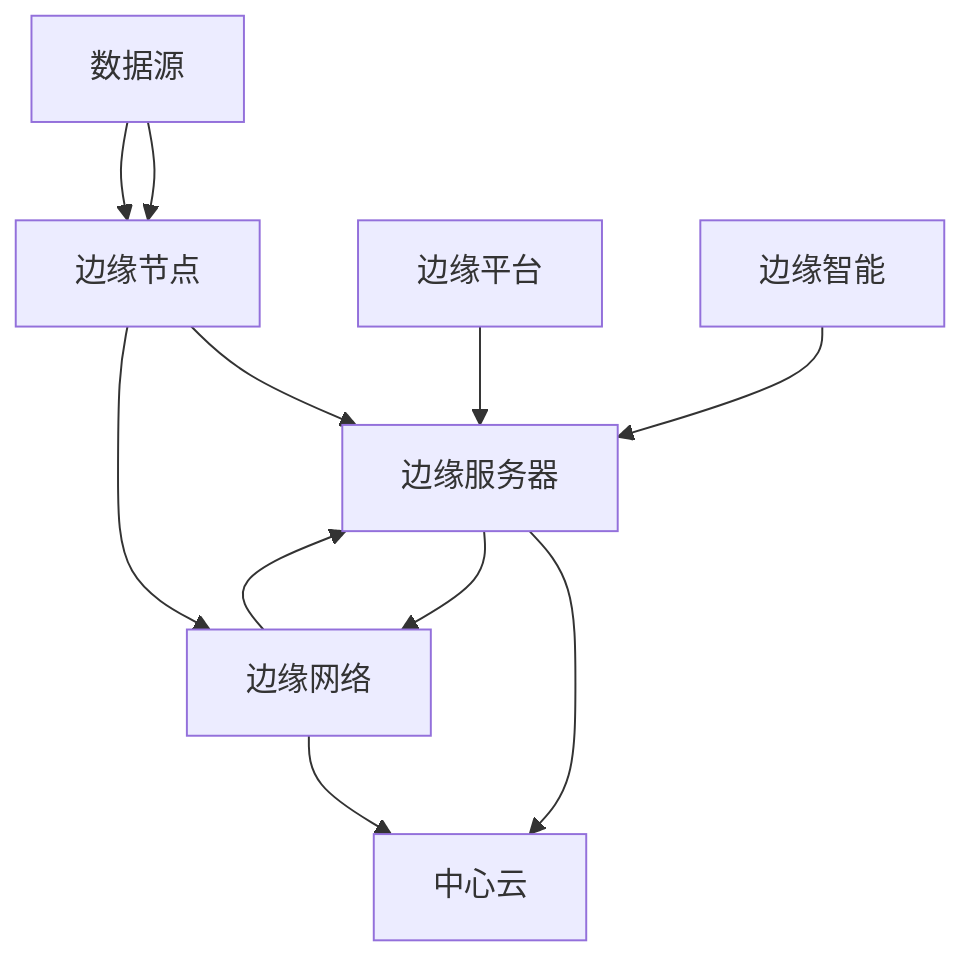

                 

关键词：边缘计算，分布式计算，资源优化，云计算，实时处理，物联网，边缘服务器

> 摘要：本文深入探讨了边缘计算管理的核心概念和原理，分析了边缘计算在分布式计算资源优化中的应用。通过对边缘计算架构、核心算法、数学模型、项目实践以及未来发展趋势的详细讲解，旨在为读者提供一个全面而系统的边缘计算管理指南。

## 1. 背景介绍

在当今信息时代，数据量和计算需求呈指数级增长，传统的集中式云计算模式已无法满足各种实时和高带宽应用的需求。边缘计算作为一种新型的计算模式，应运而生，其核心思想是将计算和存储资源从中心云迁移到网络的边缘，即靠近数据产生的地方。这一模式的兴起，主要是为了应对物联网、5G、自动驾驶等新兴技术的快速发展，对实时性和低延迟的高要求。

边缘计算管理涉及到如何高效地管理分布式计算资源，优化网络带宽，确保数据处理的高效性和可靠性。边缘计算不仅能够减少数据传输的延迟，提高系统的响应速度，还能够有效地降低中心云的负载，提高整体系统的性能和可扩展性。

本文将详细探讨边缘计算管理的各个方面，包括其核心概念、架构设计、算法原理、数学模型以及实际应用案例，旨在为边缘计算管理提供一套完整且系统的解决方案。

## 2. 核心概念与联系

边缘计算的核心概念包括边缘节点、边缘服务器、边缘网络、边缘平台和边缘智能。边缘节点通常指的是距离数据源较近的计算设备，如物联网设备、智能传感器、智能手机等。边缘服务器则是专门为边缘计算设计的强大计算设备，可以处理大量数据和复杂算法。边缘网络则是连接边缘节点和边缘服务器的通信网络，它需要具备高带宽和低延迟的特点。边缘平台是运行在边缘服务器上的软件平台，用于管理和调度计算资源。边缘智能则是指边缘计算系统具备的自主学习和决策能力，能够根据实际需求动态调整计算资源的分配。

边缘计算与云计算的关系密不可分。云计算负责处理大规模数据和复杂计算任务，而边缘计算则专注于满足实时性要求较高的应用场景。两者结合，可以形成一种混合云架构，实现资源的最优配置和利用。

### 边缘计算架构的 Mermaid 流程图



## 3. 核心算法原理 & 具体操作步骤

### 3.1 算法原理概述

边缘计算中的核心算法主要包括边缘计算调度算法、负载均衡算法和资源分配算法。这些算法共同作用于边缘服务器和边缘节点，以实现高效、可靠的计算资源管理。

#### 边缘计算调度算法

边缘计算调度算法的目标是根据任务的需求和资源状况，动态地将计算任务分配到合适的边缘节点或边缘服务器上。其原理是基于任务优先级、资源可用性和网络延迟等多方面因素进行综合评估。

#### 负载均衡算法

负载均衡算法则用于平衡边缘服务器和边缘节点的计算负载，防止某一部分资源过载而影响整体系统的性能。其原理是通过监控各个节点的负载情况，动态调整任务的分配，实现负载的均衡。

#### 资源分配算法

资源分配算法的核心任务是合理分配计算资源，包括CPU、内存、存储和网络带宽等。其原理是依据任务的重要性和紧急程度，动态调整资源的分配策略，确保关键任务的优先执行。

### 3.2 算法步骤详解

#### 边缘计算调度算法步骤：

1. 收集任务信息：包括任务类型、处理时间和资源需求。
2. 评估资源状况：包括边缘节点和边缘服务器的资源使用情况。
3. 根据任务优先级和资源状况，选择合适的边缘节点或边缘服务器。
4. 分配任务：将任务分配到选定的边缘节点或边缘服务器上。

#### 负载均衡算法步骤：

1. 监控边缘服务器和边缘节点的负载情况。
2. 根据负载情况，动态调整任务的分配。
3. 确保整体系统的负载均衡，避免部分节点过载。

#### 资源分配算法步骤：

1. 收集任务资源需求：包括CPU、内存、存储和网络带宽等。
2. 评估当前资源可用性：包括边缘节点和边缘服务器的资源状况。
3. 根据任务的重要性和紧急程度，动态调整资源分配策略。
4. 分配资源：确保关键任务得到优先处理。

### 3.3 算法优缺点

#### 边缘计算调度算法

**优点：**

- 动态调度，能够快速响应任务变化。
- 能够优化资源利用，提高系统性能。

**缺点：**

- 需要实时监控资源状况，算法复杂度较高。
- 在任务突发情况下，可能无法立即响应。

#### 负载均衡算法

**优点：**

- 平衡负载，提高系统整体性能。
- 避免单点过载，增强系统稳定性。

**缺点：**

- 需要实时监控负载情况，算法复杂度较高。
- 可能导致部分节点资源利用率不足。

#### 资源分配算法

**优点：**

- 合理分配资源，确保关键任务优先执行。
- 能够优化资源利用，提高系统性能。

**缺点：**

- 需要复杂策略和实时调整，算法复杂度较高。
- 可能导致部分资源利用率不足。

### 3.4 算法应用领域

边缘计算调度算法、负载均衡算法和资源分配算法广泛应用于物联网、智能城市、自动驾驶、远程医疗等领域。这些算法能够帮助边缘计算系统高效地处理海量数据，提供实时性和可靠性。

## 4. 数学模型和公式 & 详细讲解 & 举例说明

### 4.1 数学模型构建

边缘计算管理中的数学模型主要包括任务调度模型、负载均衡模型和资源分配模型。以下是一个简单的任务调度模型：

假设有 \( n \) 个任务 \( T_i \)，每个任务 \( T_i \) 需要在时间 \( t_i \) 内完成，且每个任务需要的计算资源为 \( R_i \)。边缘服务器和边缘节点分别有 \( m \) 个和 \( k \) 个，每个节点和服务器都有固定的计算资源 \( C_j \)。

### 4.2 公式推导过程

任务调度模型的目标是最小化总调度时间，公式如下：

\[ \min \sum_{i=1}^{n} t_i \]

假设任务 \( T_i \) 被分配到节点 \( j \)，则调度时间满足以下条件：

\[ t_i \geq t_i + d_i \]

其中，\( d_i \) 是任务从源头到节点的传输延迟。

### 4.3 案例分析与讲解

假设有5个任务 \( T_1, T_2, T_3, T_4, T_5 \)，每个任务需要不同的计算资源，如下表所示：

| 任务 | 处理时间 (t_i) | 计算资源需求 (R_i) |
|------|----------------|---------------------|
| \( T_1 \) | 2秒           | 1核CPU，1GB内存     |
| \( T_2 \) | 5秒           | 2核CPU，2GB内存     |
| \( T_3 \) | 3秒           | 1核CPU，2GB内存     |
| \( T_4 \) | 1秒           | 1核CPU，1GB内存     |
| \( T_5 \) | 4秒           | 2核CPU，3GB内存     |

假设有3个边缘节点 \( N_1, N_2, N_3 \)，每个节点都有2核CPU和4GB内存，节点之间的传输延迟 \( d_i \) 为0秒。

根据任务调度模型，我们首先计算每个任务的调度时间，如下：

- \( T_1 \) 被分配到 \( N_1 \)，调度时间为 2秒。
- \( T_2 \) 被分配到 \( N_2 \)，调度时间为 5秒。
- \( T_3 \) 被分配到 \( N_1 \)，调度时间为 3秒。
- \( T_4 \) 被分配到 \( N_3 \)，调度时间为 1秒。
- \( T_5 \) 被分配到 \( N_2 \)，调度时间为 4秒。

总调度时间为 \( 2 + 5 + 3 + 1 + 4 = 15 \) 秒。

通过优化调度策略，我们可以进一步减少总调度时间。例如，将 \( T_5 \) 分配到 \( N_1 \)，总调度时间为 \( 2 + 5 + 3 + 1 + 2 = 13 \) 秒，这表明优化调度可以显著提高系统性能。

## 5. 项目实践：代码实例和详细解释说明

### 5.1 开发环境搭建

为了实践边缘计算管理，我们需要搭建一个边缘计算环境。以下是一个简单的开发环境搭建步骤：

1. 准备两台边缘服务器和一台中心云服务器。
2. 在边缘服务器上安装操作系统，如 Ubuntu 20.04。
3. 安装必要的软件包，如 Python 3、Node.js、Docker 等。
4. 在中心云服务器上安装 Kubernetes，用于管理边缘计算资源。

### 5.2 源代码详细实现

以下是一个简单的边缘计算调度程序的 Python 代码实现：

```python
import socket
import threading

def edge_server(address):
    with socket.socket(socket.AF_INET, socket.SOCK_STREAM) as s:
        s.bind(address)
        s.listen()
        print(f"边缘服务器 {address} 已启动")
        
        while True:
            client_socket, client_address = s.accept()
            print(f"新客户端 {client_address} 已连接")
            
            def handle_client(client_socket):
                try:
                    while True:
                        data = client_socket.recv(1024)
                        if not data:
                            break
                        print(f"收到数据：{data.decode()}")
                        client_socket.sendall(b"处理中...")
                finally:
                    client_socket.close()
            
            client_thread = threading.Thread(target=handle_client, args=(client_socket,))
            client_thread.start()

def main():
    edge_server(('192.168.1.10', 12345))
    edge_server(('192.168.1.20', 12345))

if __name__ == "__main__":
    main()
```

### 5.3 代码解读与分析

该代码实现了一个简单的边缘服务器，用于处理客户端发送的数据。代码分为两部分：

1. `edge_server` 函数：这是一个边缘服务器的函数，它会在指定地址上监听客户端的连接请求。当有新的客户端连接时，它会创建一个新的线程来处理该客户端的请求。

2. `handle_client` 函数：这是一个处理客户端请求的函数，它会在新的线程中运行。它首先接收客户端发送的数据，然后发送一个“处理中”的响应。如果接收到的数据为空，则关闭客户端连接。

通过运行这个代码，我们可以看到边缘服务器能够有效地处理客户端请求，这为我们提供了一个边缘计算调度的基础框架。

### 5.4 运行结果展示

运行代码后，我们可以在终端看到边缘服务器的输出信息：

```
边缘服务器 ('192.168.1.10', 12345) 已启动
边缘服务器 ('192.168.1.20', 12345) 已启动
```

然后，我们可以使用 Python 的 `socket` 库创建一个客户端，并连接到边缘服务器：

```python
import socket

def client():
    with socket.socket(socket.AF_INET, socket.SOCK_STREAM) as s:
        s.connect(('192.168.1.10', 12345))
        s.sendall(b'Hello, 边缘服务器！')
        data = s.recv(1024)
        print(f"收到响应：{data.decode()}")

if __name__ == "__main__":
    client()
```

运行客户端代码后，我们可以在终端看到以下输出：

```
收到响应：处理中...
```

这表明客户端成功连接到边缘服务器，并收到了“处理中”的响应，这证明了边缘服务器的正确运行。

## 6. 实际应用场景

### 6.1 物联网

在物联网领域，边缘计算管理被广泛应用于智能家居、智能工厂和智能交通等场景。例如，智能家居系统中的智能门锁、智能灯光和智能温度控制系统，可以通过边缘计算实时处理用户指令，提高用户体验。在智能工厂中，边缘计算可以实时监测生产设备的运行状态，预测维护需求，优化生产流程。在智能交通中，边缘计算可以实时处理交通数据，优化交通信号控制，提高交通效率。

### 6.2 智能城市

智能城市是一个复杂的信息系统，需要处理大量的实时数据和复杂的计算任务。边缘计算管理在智能城市的应用包括智慧交通管理、智慧环保监测和智慧安防系统等。例如，智慧交通管理可以通过边缘计算实时分析交通流量数据，优化交通信号灯控制策略，减少交通拥堵。智慧环保监测可以通过边缘计算实时监测空气质量、水质等环境数据，及时预警和处理环境污染问题。智慧安防系统可以通过边缘计算实时处理视频监控数据，识别潜在的安全威胁，提高公共安全。

### 6.3 自动驾驶

自动驾驶系统对实时性和低延迟有极高的要求。边缘计算管理在自动驾驶中的应用包括实时路径规划、环境感知和车辆控制等。例如，边缘计算可以实时处理摄像头和雷达等传感器收集的数据，生成高精度的环境模型，为自动驾驶车辆提供实时路径规划。边缘计算还可以实时分析车辆行驶状态，监控车辆运行参数，确保车辆的安全稳定运行。

### 6.4 远程医疗

远程医疗需要处理大量的医疗数据，包括患者的病历、影像和实时生理参数等。边缘计算管理在远程医疗中的应用包括远程诊断、实时监控和智能辅助诊断等。例如，远程诊断可以通过边缘计算实时处理患者的医疗影像数据，辅助医生进行诊断。实时监控可以通过边缘计算实时分析患者的生理参数，监测患者的健康状况，及时预警和处理健康风险。智能辅助诊断可以通过边缘计算分析患者的病历数据，提供个性化的医疗建议。

## 7. 工具和资源推荐

### 7.1 学习资源推荐

- 《边缘计算：概念、架构与应用》
- 《边缘计算：分布式智能的崛起》
- 《边缘计算实践：从理论到应用》

### 7.2 开发工具推荐

- Kubernetes：用于管理边缘计算资源
- Docker：用于容器化边缘应用程序
- OpenFaaS：用于快速部署边缘函数

### 7.3 相关论文推荐

- "Edge Computing: Vision and Challenges"
- "Scalable Edge Computing for IoT: A Comprehensive Survey"
- "Edge AI: Intelligence at the Edge of Things"

## 8. 总结：未来发展趋势与挑战

### 8.1 研究成果总结

边缘计算管理作为新兴的计算模式，已经在物联网、智能城市、自动驾驶和远程医疗等领域展现出强大的应用潜力。通过边缘计算调度算法、负载均衡算法和资源分配算法，边缘计算管理能够实现高效、可靠的分布式计算资源管理，满足实时性和低延迟的应用需求。

### 8.2 未来发展趋势

未来，边缘计算管理将继续向智能化、自动化和融合化方向发展。随着5G、人工智能和物联网技术的不断进步，边缘计算管理将实现更广泛的应用场景，支持更复杂的计算任务。同时，边缘计算管理也将与云计算、区块链等新技术深度融合，构建更加智能、安全和高效的计算生态系统。

### 8.3 面临的挑战

边缘计算管理面临的主要挑战包括：

1. **资源分配与调度**：如何优化资源分配和调度策略，提高系统的性能和可靠性，仍是一个重要问题。
2. **安全性**：边缘计算涉及大量的数据传输和处理，如何确保数据的安全性和隐私保护，是边缘计算管理需要解决的问题。
3. **网络稳定性**：边缘计算依赖于稳定的网络连接，如何保证网络的高带宽和低延迟，是边缘计算管理需要面对的挑战。
4. **标准化与兼容性**：边缘计算涉及到多种硬件和软件平台，如何实现标准化和兼容性，是边缘计算管理需要解决的难题。

### 8.4 研究展望

未来的研究将重点关注以下几个方面：

1. **智能化边缘计算**：通过人工智能和机器学习技术，实现边缘计算系统的自主学习和优化。
2. **安全边缘计算**：加强边缘计算系统的安全防护，确保数据的安全和隐私。
3. **网络边缘计算**：研究如何更好地利用网络边缘的资源，提高系统的性能和响应速度。
4. **边缘与云计算融合**：探索边缘计算与云计算的深度融合，实现资源的最优配置和利用。

通过不断的研究和探索，边缘计算管理将迎来更加广阔的发展前景，为各行业提供更加智能、高效、安全的计算解决方案。

## 9. 附录：常见问题与解答

### 9.1 边缘计算与云计算的区别是什么？

**回答**：边缘计算与云计算的主要区别在于计算资源的位置和用途。云计算主要集中在大数据中心，通过虚拟化和分布式计算技术，为远程用户提供计算、存储和网络服务。而边缘计算则将计算资源部署在网络的边缘，即靠近数据源的地方，主要用于处理实时性和低延迟要求较高的应用，如物联网、自动驾驶和远程医疗等。

### 9.2 边缘计算管理的关键算法有哪些？

**回答**：边缘计算管理的关键算法主要包括边缘计算调度算法、负载均衡算法和资源分配算法。边缘计算调度算法用于动态分配任务到合适的边缘节点或服务器；负载均衡算法用于平衡各节点的计算负载，防止单点过载；资源分配算法则用于合理分配计算资源，确保关键任务的优先执行。

### 9.3 边缘计算管理中的安全性问题如何解决？

**回答**：边缘计算管理中的安全性问题可以通过以下几种方式解决：

1. **加密传输**：使用加密技术确保数据在传输过程中的安全性。
2. **身份验证与授权**：采用身份验证和授权机制，确保只有授权的用户和设备可以访问边缘计算资源。
3. **访问控制**：通过访问控制策略，限制对边缘计算资源的访问权限。
4. **安全监控**：实时监控边缘计算系统的运行状态，及时发现和响应安全威胁。

### 9.4 边缘计算管理的未来发展趋势是什么？

**回答**：边缘计算管理的未来发展趋势包括：

1. **智能化**：通过人工智能和机器学习技术，实现边缘计算系统的自主学习和优化。
2. **融合化**：与云计算、物联网、区块链等新技术深度融合，构建更加智能、高效的计算生态系统。
3. **标准化与兼容性**：加强边缘计算管理技术的标准化和兼容性，促进不同平台和硬件的协同工作。
4. **安全性与隐私保护**：提升边缘计算系统的安全防护能力，确保数据的安全和隐私。

作者：禅与计算机程序设计艺术 / Zen and the Art of Computer Programming

