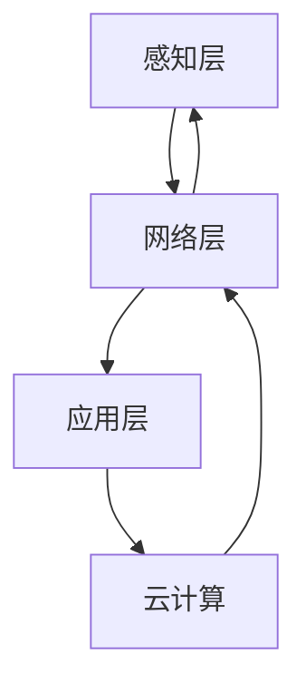

                 

关键词：边缘计算，5G，分布式处理，云计算，物联网，智能化应用，实时数据处理，网络延迟，带宽限制。

> 摘要：随着5G技术的快速普及，边缘计算作为一种新兴的分布式处理方案，正在改变传统云计算模式，为物联网、人工智能等领域的实时数据处理提供强有力的支持。本文将深入探讨边缘计算的核心概念、架构、算法原理以及其在实际应用场景中的重要作用，展望其未来的发展趋势与挑战。

## 1. 背景介绍

随着物联网（IoT）和移动互联网的迅猛发展，数据的产生和传输速度前所未有地增加。传统的云计算模式，将大量数据传输到远程数据中心进行处理，已经难以满足实时性和低延迟的需求。此外，带宽的限制和网络延迟也成为制约云计算性能的关键因素。

在这种背景下，边缘计算作为一种分布式处理方案，逐渐引起广泛关注。边缘计算将数据处理和存储推向网络边缘，即靠近数据源的位置，从而实现更快速的数据处理和更低延迟的网络通信。

边缘计算与云计算的关系可以看作是互补的。云计算提供大规模的数据存储和处理能力，而边缘计算则专注于处理靠近数据源的小规模数据，两者共同构成了完整的分布式计算体系。

## 2. 核心概念与联系

### 2.1. 边缘计算的定义

边缘计算（Edge Computing）是一种分布式计算架构，通过在网络的边缘节点上部署计算、存储和网络资源，来实现对本地数据的高效处理。边缘计算的核心目标是降低网络延迟，提高数据处理的实时性，同时减轻中心数据中心的负担。

### 2.2. 边缘计算的架构

边缘计算的架构主要包括三个层次：感知层、网络层和应用层。

- **感知层**：包括各种物联网设备和传感器，负责数据的采集和初步处理。
- **网络层**：负责数据的传输和通信，包括边缘网络和中心网络。
- **应用层**：包括各种应用和服务，如数据分析、智能决策等。

### 2.3. 边缘计算与云计算的联系

边缘计算和云计算之间的关系可以概括为“云计算+边缘计算”。云计算负责处理大规模的数据，而边缘计算则专注于实时数据的高效处理和低延迟通信。两者相互补充，共同构成了一个完整的分布式计算体系。

### 2.4. Mermaid 流程图



## 3. 核心算法原理 & 具体操作步骤

### 3.1. 算法原理概述

边缘计算的核心算法主要涉及数据采集、数据预处理、数据传输和数据存储。其中，数据预处理和实时数据处理是边缘计算的核心。

### 3.2. 算法步骤详解

1. **数据采集**：通过物联网设备和传感器，采集各种数据。
2. **数据预处理**：在边缘节点对数据进行初步处理，如数据清洗、数据压缩等。
3. **数据传输**：将预处理后的数据传输到网络层，进行进一步处理。
4. **数据存储**：在边缘节点或中心节点存储数据，以备后续分析。

### 3.3. 算法优缺点

#### 优点：

- 降低网络延迟：数据处理靠近数据源，减少数据传输距离。
- 提高数据处理效率：边缘节点可以同时处理多个数据流，提高数据处理速度。
- 节省带宽：通过在边缘节点预处理数据，减少传输到中心数据中心的原始数据量。

#### 缺点：

- 边缘节点资源有限：边缘节点通常资源有限，难以处理大规模数据。
- 安全性问题：边缘节点更容易受到网络攻击。

### 3.4. 算法应用领域

边缘计算的应用领域非常广泛，包括：

- 物联网：智能家居、智能工厂、智能交通等。
- 人工智能：实时语音识别、实时图像识别等。
- 实时数据处理：金融交易、医疗诊断等。

## 4. 数学模型和公式 & 详细讲解 & 举例说明

### 4.1. 数学模型构建

边缘计算中的数学模型主要包括：

- 数据传输速率模型：$R = \frac{C}{D}$，其中$R$为数据传输速率，$C$为网络带宽，$D$为数据传输距离。
- 数据处理效率模型：$E = \frac{P}{T}$，其中$E$为数据处理效率，$P$为处理能力，$T$为处理时间。

### 4.2. 公式推导过程

- **数据传输速率模型**：

  $R = \frac{C}{D}$，其中$C$为网络带宽，$D$为数据传输距离。带宽$C$通常取决于网络设备和技术，距离$D$取决于数据传输的物理路径。因此，数据传输速率$R$与网络带宽和传输距离成反比。

- **数据处理效率模型**：

  $E = \frac{P}{T}$，其中$E$为数据处理效率，$P$为处理能力，$T$为处理时间。处理能力$P$取决于计算资源和算法优化，处理时间$T$取决于数据量、算法复杂度等因素。因此，数据处理效率$E$与处理能力和处理时间成反比。

### 4.3. 案例分析与讲解

假设一个智能家居系统，需要实时处理来自各种传感器的数据，如温度、湿度、光照等。假设网络带宽为10Mbps，数据传输距离为100米，处理能力为每秒处理1000条数据。

- **数据传输速率**：$R = \frac{10Mbps}{100m} = 0.1Mbps$。
- **数据处理效率**：$E = \frac{1000}{1s} = 1000$条/s。

通过优化边缘节点的处理能力和算法，可以提高数据处理效率，从而提高整个系统的性能。

## 5. 项目实践：代码实例和详细解释说明

### 5.1. 开发环境搭建

在本节中，我们将搭建一个简单的边缘计算项目，使用Python编程语言进行开发。

1. 安装Python环境：在操作系统上安装Python，版本建议为3.8或以上。
2. 安装依赖库：使用pip安装必要的库，如requests、numpy、pandas等。

### 5.2. 源代码详细实现

以下是一个简单的边缘计算示例，实现从传感器采集数据，并将数据发送到边缘节点进行处理。

```python
import requests
import numpy as np
import pandas as pd

# 传感器数据采集
def collect_data(sensor_data):
    # 假设传感器数据为温度和湿度
    temperature = sensor_data['temperature']
    humidity = sensor_data['humidity']
    
    # 数据预处理
    data = {
        'temperature': temperature,
        'humidity': humidity
    }
    
    return data

# 边缘节点数据处理
def process_data(data):
    # 数据分析
    temperature = data['temperature']
    humidity = data['humidity']
    
    # 数据处理
    result = {
        'average_temperature': np.mean(temperature),
        'average_humidity': np.mean(humidity)
    }
    
    return result

# 主函数
def main():
    # 采集数据
    sensor_data = collect_data({'temperature': [25, 26, 24], 'humidity': [60, 65, 58]})
    
    # 处理数据
    processed_data = process_data(sensor_data)
    
    # 发送数据到边缘节点
    response = requests.post('http://edge-node:8000/process', json=processed_data)
    
    # 显示结果
    print(response.json())

if __name__ == '__main__':
    main()
```

### 5.3. 代码解读与分析

- **数据采集**：使用Python的requests库从传感器采集温度和湿度数据。
- **数据预处理**：将采集到的数据转换为字典格式，并计算平均值。
- **数据处理**：使用numpy库对预处理后的数据进行进一步分析，如计算平均值。
- **数据发送**：使用requests库将处理后的数据发送到边缘节点进行处理。

### 5.4. 运行结果展示

假设边缘节点返回的处理结果如下：

```json
{
    "average_temperature": 25.0,
    "average_humidity": 62.5
}
```

通过运行示例代码，我们可以实现从传感器采集数据，并在边缘节点进行处理，最终得到处理结果。

## 6. 实际应用场景

边缘计算在许多实际应用场景中都发挥着重要作用，以下是一些典型的应用场景：

- **智能家居**：通过边缘计算，实现实时监测和控制家居设备的运行状态，如智能灯泡、智能空调等。
- **智能工厂**：在智能工厂中，边缘计算可以实时监测生产设备的状态，进行故障预测和优化生产流程。
- **智能交通**：在智能交通系统中，边缘计算可以实时分析交通数据，进行交通流量预测和交通信号控制。
- **医疗健康**：在医疗健康领域，边缘计算可以实时监测患者的生命体征，提供实时诊断和预警。

## 7. 工具和资源推荐

### 7.1. 学习资源推荐

- **《边缘计算：概念、架构与应用》**：详细介绍了边缘计算的基本概念、架构和应用。
- **《边缘计算实践：从零开始构建边缘应用》**：通过实际案例，介绍了边缘计算的实践方法和技巧。

### 7.2. 开发工具推荐

- **Docker**：用于构建和管理边缘计算环境。
- **Kubernetes**：用于部署和管理边缘计算节点。

### 7.3. 相关论文推荐

- **“Edge Computing: Vision and Challenges”**：对边缘计算的基本概念、架构和应用进行了深入研究。
- **“A Practical Guide to Edge Computing”**：介绍了边缘计算的实际应用案例和开发技巧。

## 8. 总结：未来发展趋势与挑战

### 8.1. 研究成果总结

边缘计算作为一种分布式处理方案，已经在物联网、人工智能等领域取得了显著成果。通过将数据处理和存储推向网络边缘，边缘计算显著降低了网络延迟，提高了数据处理的实时性，为许多实际应用场景提供了有力支持。

### 8.2. 未来发展趋势

- **智能化应用**：随着人工智能技术的发展，边缘计算将更多地应用于智能化场景，如智能医疗、智能安防等。
- **物联网边缘计算**：物联网设备的普及将推动边缘计算在智能家居、智能工厂等领域的广泛应用。
- **云计算与边缘计算的融合**：云计算和边缘计算将实现更深层次的融合，共同构建完整的分布式计算体系。

### 8.3. 面临的挑战

- **安全性**：边缘计算节点分布广泛，安全性问题成为一大挑战。
- **资源管理**：边缘节点资源有限，如何高效管理和利用资源成为关键问题。
- **标准化**：边缘计算缺乏统一的标准和规范，需要进一步研究和制定。

### 8.4. 研究展望

边缘计算作为一种新兴的分布式处理方案，具有广泛的应用前景。未来的研究将集中在如何提高边缘计算的安全性、资源管理和标准化等方面，以实现边缘计算的全面应用。

## 9. 附录：常见问题与解答

### 9.1. 边缘计算与云计算有什么区别？

边缘计算和云计算都是分布式计算的一部分，但它们的重点和应用场景有所不同。边缘计算更注重实时数据处理和低延迟通信，适用于靠近数据源的本地处理。而云计算更注重大规模数据处理和存储，适用于远程数据处理和存储。

### 9.2. 边缘计算如何提高数据处理效率？

边缘计算通过将数据处理和存储推向网络边缘，降低了网络延迟，提高了数据处理的实时性。此外，通过在边缘节点进行预处理和压缩，可以减少传输到中心数据中心的原始数据量，从而提高数据处理效率。

### 9.3. 边缘计算有哪些安全挑战？

边缘计算面临的主要安全挑战包括：

- **安全性**：边缘节点分布广泛，安全性问题成为一大挑战。
- **数据隐私**：边缘计算涉及大量敏感数据，如何保护数据隐私成为关键问题。
- **网络攻击**：边缘节点更容易受到网络攻击，需要加强网络安全防护。

----------------------------------------------------------------

作者：禅与计算机程序设计艺术 / Zen and the Art of Computer Programming

