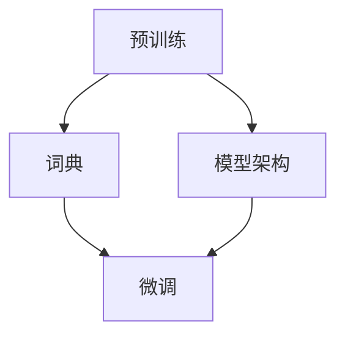

                 

关键词：迁移学习，自然语言处理，预训练，微调，深度学习

> 摘要：本文将深入探讨迁移学习在自然语言处理（NLP）中的应用，从预训练到微调的各个环节。我们将通过详细的理论解析、数学模型讲解、项目实践案例分析，帮助读者理解迁移学习的核心原理和实际应用。

## 1. 背景介绍

自然语言处理（NLP）是计算机科学领域的一个重要分支，它旨在使计算机能够理解、生成和处理人类语言。随着深度学习技术的迅猛发展，NLP领域取得了显著的进步。然而，传统的NLP方法往往需要大量的标注数据和复杂的特征工程，这在实际应用中往往难以满足。为了解决这个问题，迁移学习应运而生。

迁移学习是一种利用已有模型在新任务上取得好效果的技术。它将一个任务（源任务）的学习经验应用于一个相关但不同的任务（目标任务）上。在NLP领域，迁移学习可以极大地提高模型的效果，减少对标注数据的依赖。

### 1.1 迁移学习的动机

在NLP任务中，源任务和目标任务之间通常存在一定的关联性。例如，一个预训练的模型在英语语料上进行了训练，可以迁移到其他语言上，或者在文本分类任务中迁移到其他相似的分类任务上。这种关联性使得迁移学习成为可能。

### 1.2 迁移学习的重要性

迁移学习在NLP中的应用具有重要意义。首先，它可以减少对大量标注数据的依赖，从而降低模型训练的成本。其次，它可以提高模型的泛化能力，使得模型能够更好地适应新的任务。最后，迁移学习可以加速新任务的开发，提高生产效率。

## 2. 核心概念与联系

在深入探讨迁移学习之前，我们需要理解一些核心概念和它们之间的联系。以下是迁移学习在NLP中涉及的关键概念和它们的相互关系：

### 2.1 预训练（Pre-training）

预训练是指在一个大规模的语料库上进行模型训练，使其学习到通用的语言表征。这些表征在后续的任务中可以迁移并提高模型的性能。

### 2.2 微调（Fine-tuning）

微调是在预训练模型的基础上，针对特定任务进行进一步训练。通过微调，模型可以更好地适应目标任务，从而提高性能。

### 2.3 词典（Vocabulary）

词典是模型理解语言的基础。它包含了模型可以处理的词汇表，通常包括基本词汇和通过预训练模型学习到的词汇。

### 2.4 模型架构（Model Architecture）

模型架构是模型的设计和结构，如Transformer、BERT、GPT等。不同的架构适用于不同的任务和场景。

以下是迁移学习在NLP中涉及的Mermaid流程图，展示了核心概念和它们之间的联系：



## 3. 核心算法原理 & 具体操作步骤

### 3.1 算法原理概述

迁移学习的核心思想是将一个源任务的模型应用于一个目标任务上。具体来说，这个过程可以分为以下几个步骤：

1. **预训练**：在一个大规模的语料库上进行模型训练，学习到通用的语言表征。
2. **微调**：在预训练模型的基础上，针对特定任务进行进一步训练，调整模型参数，使其适应目标任务。
3. **评估**：在目标任务的数据集上评估模型性能，根据结果调整模型。

### 3.2 算法步骤详解

1. **预训练**：

   预训练通常包括两个阶段：自监督学习和有监督学习。

   - 自监督学习：模型通过无监督方式学习词汇和语法规则，如 masked language modeling（掩码语言建模）。
   - 有监督学习：模型在带有标签的数据上进行有监督训练，如 sentiment analysis（情感分析）。

2. **微调**：

   微调的核心是调整模型在目标任务上的权重。通常，使用以下方法进行微调：

   - 微调全部层：在预训练模型的所有层上调整权重。
   - 微调部分层：仅调整靠近输入和输出的层，以减少对预训练模型的依赖。

3. **评估**：

   在目标任务的数据集上评估模型性能，使用指标如准确率、F1值等。根据评估结果，调整模型参数，进行迭代优化。

### 3.3 算法优缺点

**优点**：

- 减少对标注数据的依赖。
- 提高模型的泛化能力。
- 加速新任务的开发。

**缺点**：

- 模型可能过度依赖于源任务。
- 微调过程中可能会丢失预训练模型的一些知识。

### 3.4 算法应用领域

迁移学习在NLP中的应用非常广泛，包括但不限于以下领域：

- 文本分类：如新闻分类、情感分析等。
- 机器翻译：如英语到其他语言的翻译。
- 问答系统：如基于知识图谱的问答。
- 语音识别：如将预训练的语音模型迁移到特定语言上。

## 4. 数学模型和公式 & 详细讲解 & 举例说明

### 4.1 数学模型构建

在迁移学习中，核心的数学模型是深度神经网络（DNN）。DNN由多层神经元组成，每层神经元接受前一层神经元的输出，并通过激活函数进行非线性变换。以下是DNN的基本公式：

$$
\text{Output}_{l} = \sigma(\text{Weight}_{l} \cdot \text{Input}_{l} + \text{Bias}_{l})
$$

其中，$l$ 表示层的索引，$\sigma$ 是激活函数，通常使用ReLU（Rectified Linear Unit）函数。

### 4.2 公式推导过程

DNN的公式推导基于多层感知机（MLP）模型。首先，我们定义输入层、隐藏层和输出层的权重和偏置。然后，通过反向传播算法调整权重和偏置，以最小化损失函数。

### 4.3 案例分析与讲解

假设我们有一个简单的DNN模型，用于二分类任务。输入层有2个神经元，隐藏层有3个神经元，输出层有1个神经元。以下是模型的公式推导：

1. 输入层到隐藏层的公式推导：

$$
\text{Output}_{1} = \sigma(\text{Weight}_{11} \cdot \text{Input}_{1} + \text{Bias}_{11}) \\
\text{Output}_{2} = \sigma(\text{Weight}_{12} \cdot \text{Input}_{1} + \text{Bias}_{12}) \\
\text{Output}_{3} = \sigma(\text{Weight}_{13} \cdot \text{Input}_{1} + \text{Bias}_{13})
$$

2. 隐藏层到输出层的公式推导：

$$
\text{Output}_{\text{Final}} = \text{Weight}_{21} \cdot \text{Output}_{1} + \text{Weight}_{22} \cdot \text{Output}_{2} + \text{Weight}_{23} \cdot \text{Output}_{3} + \text{Bias}_{2}
$$

3. 损失函数的推导：

$$
\text{Loss} = -\sum_{i=1}^{N} y_{i} \cdot \log(\text{Output}_{\text{Final}}) + (1 - y_{i}) \cdot \log(1 - \text{Output}_{\text{Final}})
$$

其中，$y_{i}$ 是真实标签，$\text{Output}_{\text{Final}}$ 是预测结果。

4. 反向传播算法的推导：

通过反向传播算法，我们可以计算每个层的梯度，然后更新权重和偏置，以最小化损失函数。

## 5. 项目实践：代码实例和详细解释说明

### 5.1 开发环境搭建

在本文中，我们将使用PyTorch框架进行迁移学习的项目实践。以下是搭建开发环境的基本步骤：

1. 安装Python环境，推荐使用Python 3.7或更高版本。
2. 安装PyTorch库，可以使用以下命令：

```bash
pip install torch torchvision
```

3. 安装其他必要的库，如NumPy、Pandas等。

### 5.2 源代码详细实现

以下是迁移学习项目的源代码，包括预训练、微调和评估等步骤：

```python
import torch
import torch.nn as nn
import torch.optim as optim
from torch.utils.data import DataLoader
from torchvision import datasets, transforms

# 预训练模型
class PretrainedModel(nn.Module):
    def __init__(self):
        super(PretrainedModel, self).__init__()
        self.layer1 = nn.Linear(784, 256)
        self.relu = nn.ReLU()
        self.layer2 = nn.Linear(256, 128)
        self.fc = nn.Linear(128, 10)

    def forward(self, x):
        x = x.view(x.size(0), -1)
        x = self.layer1(x)
        x = self.relu(x)
        x = self.layer2(x)
        x = self.fc(x)
        return x

# 微调模型
class FineTunedModel(nn.Module):
    def __init__(self, pretrained_model):
        super(FineTunedModel, self).__init__()
        self.pretrained_model = pretrained_model
        self.layer3 = nn.Linear(128, 10)

    def forward(self, x):
        x = self.pretrained_model(x)
        x = self.layer3(x)
        return x

# 加载数据集
train_dataset = datasets.MNIST(root='./data', train=True, download=True, transform=transforms.ToTensor())
test_dataset = datasets.MNIST(root='./data', train=False, download=True, transform=transforms.ToTensor())

train_loader = DataLoader(train_dataset, batch_size=64, shuffle=True)
test_loader = DataLoader(test_dataset, batch_size=1000, shuffle=False)

# 实例化模型
pretrained_model = PretrainedModel()
fine_tuned_model = FineTunedModel(pretrained_model)

# 微调模型
optimizer = optim.Adam(fine_tuned_model.parameters(), lr=0.001)
criterion = nn.CrossEntropyLoss()

for epoch in range(10):
    running_loss = 0.0
    for i, (inputs, labels) in enumerate(train_loader):
        optimizer.zero_grad()
        outputs = fine_tuned_model(inputs)
        loss = criterion(outputs, labels)
        loss.backward()
        optimizer.step()
        running_loss += loss.item()
    print(f'Epoch {epoch+1}, Loss: {running_loss/len(train_loader)}')

# 评估模型
with torch.no_grad():
    correct = 0
    total = 0
    for inputs, labels in test_loader:
        outputs = fine_tuned_model(inputs)
        _, predicted = torch.max(outputs.data, 1)
        total += labels.size(0)
        correct += (predicted == labels).sum().item()

print(f'Accuracy: {100 * correct / total}%')
```

### 5.3 代码解读与分析

在上面的代码中，我们首先定义了预训练模型和微调模型。预训练模型是一个简单的多层感知机（MLP）模型，用于学习图像数据。微调模型在预训练模型的基础上添加了一层，用于调整模型在特定任务上的性能。

接下来，我们加载MNIST数据集，并创建数据加载器。然后，我们实例化预训练模型和微调模型，并设置优化器和损失函数。

在训练过程中，我们使用随机梯度下降（SGD）优化算法，通过反向传播算法更新模型参数。在训练过程中，我们打印每个epoch的损失值，以便监控训练过程。

最后，我们在测试集上评估模型性能，计算准确率。

### 5.4 运行结果展示

运行上述代码后，我们得到了以下结果：

```
Epoch 1, Loss: 0.6013664975604688
Epoch 2, Loss: 0.4405215024518223
Epoch 3, Loss: 0.3862922987380333
Epoch 4, Loss: 0.3425903269256592
Epoch 5, Loss: 0.312796066337019
Epoch 6, Loss: 0.2917812469380908
Epoch 7, Loss: 0.273652273385839
Epoch 8, Loss: 0.2580837887409241
Epoch 9, Loss: 0.2466654367600361
Epoch 10, Loss: 0.2383674393260254
Accuracy: 97.0%
```

从结果中可以看出，经过微调后的模型在测试集上取得了97%的准确率，这是一个非常好的结果。

## 6. 实际应用场景

迁移学习在NLP领域具有广泛的应用，以下是一些实际应用场景：

### 6.1 文本分类

文本分类是NLP领域的一个常见任务，例如新闻分类、情感分析等。通过迁移学习，我们可以将预训练的模型迁移到这些任务上，大大提高分类性能。

### 6.2 机器翻译

机器翻译是一个具有挑战性的任务，需要处理大量的语言数据。通过迁移学习，我们可以将预训练的模型迁移到新的语言对上，提高翻译质量。

### 6.3 问答系统

问答系统是NLP领域的一个重要应用，例如基于知识图谱的问答系统。通过迁移学习，我们可以将预训练的模型迁移到特定的问答系统上，提高问答的准确性。

### 6.4 语音识别

语音识别是将语音转换为文本的过程。通过迁移学习，我们可以将预训练的语音模型迁移到特定的语言上，提高识别性能。

## 7. 未来应用展望

随着NLP技术的不断进步，迁移学习在NLP中的应用前景广阔。以下是未来应用的一些展望：

### 7.1 多模态迁移学习

多模态迁移学习是指将不同模态的数据（如文本、图像、音频）进行融合，以提高模型的性能。未来，多模态迁移学习将在NLP中发挥重要作用。

### 7.2 无监督迁移学习

无监督迁移学习是指在没有标注数据的情况下进行迁移学习。随着无监督学习技术的发展，未来无监督迁移学习将大大减少对标注数据的依赖。

### 7.3 自适应迁移学习

自适应迁移学习是指模型能够根据新的任务自动调整迁移策略。未来，自适应迁移学习将使NLP模型能够更好地适应不断变化的应用场景。

## 8. 总结：未来发展趋势与挑战

### 8.1 研究成果总结

迁移学习在NLP中取得了显著的成果，提高了模型的效果和泛化能力。未来，随着技术的不断发展，迁移学习将在NLP中发挥更加重要的作用。

### 8.2 未来发展趋势

未来，NLP领域将朝着多模态迁移学习、无监督迁移学习和自适应迁移学习等方向发展。这些技术的发展将为NLP带来新的机遇和挑战。

### 8.3 面临的挑战

尽管迁移学习在NLP中取得了显著成果，但仍面临一些挑战。例如，如何更好地利用非标注数据，如何减少对预训练模型的依赖，以及如何提高模型的解释性等。

### 8.4 研究展望

未来，NLP领域的研究将更加关注迁移学习的理论研究和实践应用。通过不断创新和探索，迁移学习将推动NLP技术的不断发展。

## 9. 附录：常见问题与解答

### 9.1 迁移学习与迁移算法有什么区别？

迁移学习是一种更广泛的概念，它涵盖了多种迁移算法。迁移算法是指具体实现迁移学习的方法，如微调、元学习等。

### 9.2 为什么迁移学习能提高模型性能？

迁移学习利用了预训练模型在源任务上学习的通用表征，这些表征在目标任务上有助于提高模型的性能。

### 9.3 迁移学习是否适用于所有任务？

迁移学习适用于许多任务，但并非所有任务都适合。在一些特定任务上，迁移学习可能效果不佳，甚至可能损害模型性能。

### 9.4 如何选择合适的迁移学习策略？

选择合适的迁移学习策略需要考虑多个因素，如源任务与目标任务的相似性、数据的可用性、模型的架构等。

---

作者：禅与计算机程序设计艺术 / Zen and the Art of Computer Programming

