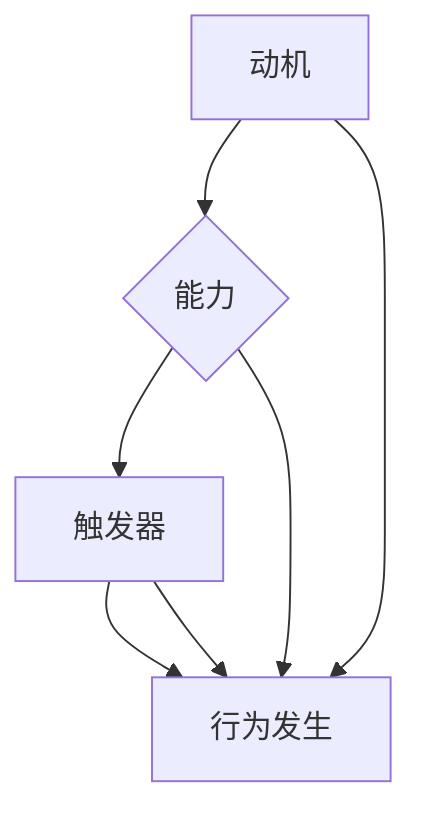

                 

 关键词：福格模型、团队习惯培养、团队协作、技术团队管理

> 摘要：本文将深入探讨如何运用福格模型来培养团队良好的工作习惯。通过分析该模型的核心概念和应用场景，本文将提供具体的操作步骤和实际案例，帮助读者在实际工作中更好地引导团队建立高效的工作习惯。

## 1. 背景介绍

在当前快速发展的科技时代，团队协作已成为企业成功的关键因素之一。然而，在实际工作中，团队成员之间往往存在沟通不畅、协作不力等问题，这些问题严重影响了团队的效率和绩效。为了解决这些问题，需要从管理层面入手，通过培养团队成员的良习惯来提升团队整体的工作效率。

福格模型（The Fogg Behavior Model）是由斯坦福大学行为科学家BJ福格提出的一种行为分析模型。该模型指出，行为的发生取决于三个因素：动机（Motivation）、能力（Ability）和触发器（Trigger）。通过调整这三个因素，可以有效地影响和培养个体的行为习惯。

本文旨在运用福格模型，探讨如何在技术团队中培养良好的工作习惯，以提升团队协作效率和项目成功率。

### 1.1 福格模型的基本概念

福格模型认为，行为的产生需要三个关键因素：

- **动机（Motivation）**：指的是个体进行某项行为的内在驱动力，如兴趣、成就感、责任感等。
- **能力（Ability）**：指的是个体完成某项行为所需的技能和资源，包括时间、知识和工具等。
- **触发器（Trigger）**：指的是引发个体进行某项行为的即时原因，如提醒、需求、事件等。

当这三个因素同时出现且相互作用时，行为就更容易发生。福格模型提供了一个理解行为背后的驱动力和障碍的有力工具，可以帮助我们设计和调整策略，以培养所需的行为习惯。

### 1.2 福格模型在团队管理中的应用

福格模型在团队管理中具有广泛的应用前景。通过理解团队成员的行为动机、能力水平和触发因素，管理者可以设计出更有效的激励机制和工作流程，从而培养出团队良好的工作习惯。

例如，在项目开发过程中，管理者可以通过以下方式应用福格模型：

- **提升动机**：通过明确项目的目标和预期成果，激发团队成员的成就感和责任感。
- **提升能力**：提供必要的培训资源和技术支持，确保团队成员具备完成任务所需的技能。
- **设置触发器**：通过设立明确的里程碑和截止日期，确保团队成员按时完成任务。

## 2. 核心概念与联系

### 2.1 福格模型的核心概念

福格模型的核心概念是动机、能力和触发器。这三个因素共同作用，决定了行为是否发生。

- **动机**：个体进行某项行为的内在驱动力。动机可以是内在的，如兴趣、成就感、好奇心，也可以是外在的，如奖励、惩罚、竞争。
- **能力**：个体完成某项行为所需的技能和资源。能力包括知识、时间、工具、支持等。
- **触发器**：引发个体进行某项行为的即时原因。触发器可以是外部事件，如提醒、通知，也可以是内在感受，如紧迫感、好奇心。

### 2.2 福格模型在团队管理中的应用

在团队管理中，福格模型的应用主要体现在以下几个方面：

- **提高动机**：通过明确团队的目标和期望，激发团队成员的内在驱动力。例如，设定具有挑战性的目标，提供反馈和奖励机制，鼓励团队成员积极参与。
- **提升能力**：提供培训、资源和工具，帮助团队成员提升完成任务的技能。例如，定期组织技术培训，提供高质量的软件开发工具，确保团队成员有足够的资源。
- **设置触发器**：通过设定明确的任务和时间表，确保团队成员按时完成任务。例如，设立项目里程碑和截止日期，定期进行项目进度报告和评估。

### 2.3 Mermaid 流程图



在这个流程图中，动机、能力和触发器共同作用，促使行为发生。

## 3. 核心算法原理 & 具体操作步骤

### 3.1 算法原理概述

福格模型的核心算法原理是分析行为发生的三个关键因素：动机、能力和触发器。通过调整这三个因素，可以培养出团队良好的工作习惯。

### 3.2 算法步骤详解

#### 步骤1：评估团队成员的行为动机

- **分析个人兴趣和目标**：了解团队成员的个人兴趣和职业目标，找到与团队目标相结合的部分，激发内在驱动力。
- **设定激励机制**：通过奖励和认可来提高动机，确保团队成员感受到他们的工作对团队和个人的价值。

#### 步骤2：提升团队成员的能力

- **提供培训机会**：定期组织技术培训，提升团队成员的专业技能。
- **分配合理任务**：根据团队成员的能力和兴趣，分配合适的任务，确保他们在工作中能够充分发挥自己的优势。
- **提供必要的工具和资源**：确保团队成员有足够的工具和资源来完成工作。

#### 步骤3：设置有效的触发器

- **明确任务和时间表**：设定项目里程碑和截止日期，确保团队成员有明确的工作目标和时间安排。
- **定期反馈和沟通**：通过定期的反馈和沟通，确保团队成员了解自己的工作进展，及时调整工作计划。

### 3.3 算法优缺点

**优点：**

- **针对性强**：通过分析个体行为动机、能力和触发器，能够有针对性地培养团队的工作习惯。
- **灵活性高**：福格模型可以适应不同团队和不同项目的需求，灵活调整策略。

**缺点：**

- **实施难度大**：需要管理者深入了解团队成员的情况，确保能够准确评估动机、能力和触发器。
- **耗时较长**：培养团队的工作习惯需要时间和耐心，不能期望立即见效。

### 3.4 算法应用领域

福格模型在团队管理中的应用非常广泛，可以应用于各种类型的团队和项目，包括软件开发团队、销售团队、市场营销团队等。以下是几个应用案例：

- **软件开发团队**：通过福格模型，管理者可以培养团队成员的代码审查习惯、代码规范意识和持续集成实践。
- **销售团队**：通过福格模型，管理者可以激发销售人员的内在驱动力，提升销售业绩。
- **市场营销团队**：通过福格模型，管理者可以培养团队成员的市场研究习惯、数据分析能力和创意思维。

## 4. 数学模型和公式 & 详细讲解 & 举例说明

### 4.1 数学模型构建

福格模型是一个基于行为科学的三因素模型，可以用以下公式表示：

\[ 行为 = 动机 \times 能力 \times 触发器 \]

其中，动机、能力和触发器分别用 \(M\)、\(A\) 和 \(T\) 表示。当 \(M \times A \times T > 1\) 时，行为就会发生。

### 4.2 公式推导过程

福格模型的推导过程基于行为科学的基本原则，认为行为的发生取决于个体的动机、能力和触发器。当这三个因素相互作用且乘积大于1时，个体就会采取相应的行为。

### 4.3 案例分析与讲解

#### 案例一：培养代码审查习惯

在一个软件开发团队中，管理者希望通过福格模型培养团队成员的代码审查习惯。以下是具体的分析和应用：

1. **动机（M）**：通过设置代码审查的奖励机制，激发团队成员的兴趣和成就感。例如，对每次代码审查给予积分奖励，积分可以兑换团队活动或奖品。
2. **能力（A）**：提供代码审查的培训课程，帮助团队成员掌握审查技巧和标准。同时，分配合理的代码审查任务，确保团队成员有足够的时间和资源进行审查。
3. **触发器（T）**：设定代码审查的定期任务和时间表，确保团队成员有明确的工作目标和时间安排。例如，每周设定一次代码审查日，团队负责人发布审查任务。

通过以上措施，管理者可以有效地提高团队成员的代码审查动机、能力和触发器，从而培养出良好的代码审查习惯。

#### 案例二：提升项目进度报告质量

在一个项目开发团队中，管理者希望通过福格模型提升项目进度报告的质量。以下是具体的分析和应用：

1. **动机（M）**：通过明确项目目标和预期成果，激发团队成员的责任感和成就感。例如，对项目进度报告的质量进行评估，并给予相应的奖励和认可。
2. **能力（A）**：提供项目进度报告的培训，帮助团队成员掌握报告撰写技巧和工具。同时，提供模板和范例，确保团队成员有统一的报告格式和标准。
3. **触发器（T）**：设定项目进度报告的定期任务和时间表，确保团队成员有明确的工作目标和时间安排。例如，每两周发布一次项目进度报告，团队负责人进行审核和反馈。

通过以上措施，管理者可以有效地提高团队成员的项目进度报告动机、能力和触发器，从而提升报告的质量。

## 5. 项目实践：代码实例和详细解释说明

### 5.1 开发环境搭建

在本案例中，我们将使用Python语言实现福格模型在团队管理中的应用。首先，需要搭建一个Python开发环境。以下是具体的步骤：

1. **安装Python**：在Windows或Linux操作系统中，从Python官方网站下载并安装Python。
2. **安装必要的库**：使用pip命令安装所需的库，如numpy、matplotlib等。

### 5.2 源代码详细实现

下面是一个简单的Python代码示例，用于实现福格模型在团队管理中的应用。

```python
import numpy as np
import matplotlib.pyplot as plt

# 动机、能力和触发器的评分范围
score_range = 10

# 团队成员的动机、能力和触发器评分
motivation_score = 8
ability_score = 7
trigger_score = 6

# 计算行为发生概率
behavior_probability = motivation_score * ability_score * trigger_score / score_range**3

# 绘制福格模型图
fig, ax = plt.subplots()
ax.scatter(motivation_score, ability_score, trigger_score, c='blue', marker='o')
ax.plot(motivation_score, ability_score, trigger_score, c='red')
ax.set_xlabel('Motivation')
ax.set_ylabel('Ability')
ax.set_zlabel('Trigger')
ax.set_title('Fogg Behavior Model')
plt.show()

# 输出行为发生概率
print(f"行为发生概率：{behavior_probability:.2f}")
```

### 5.3 代码解读与分析

- **导入库**：首先，导入numpy和matplotlib两个库，用于计算和绘图。
- **定义评分范围**：定义动机、能力和触发器的评分范围，默认为10分。
- **设置团队成员评分**：根据团队成员的情况，设置动机、能力和触发器的评分。
- **计算行为发生概率**：使用公式 \(行为发生概率 = 动机 \times 能力 \times 触发器 / (评分范围^3)\) 计算行为发生概率。
- **绘制福格模型图**：使用matplotlib库绘制福格模型图，展示动机、能力和触发器的评分关系。
- **输出行为发生概率**：输出计算得到的行为发生概率，以直观地展示团队的行为倾向。

### 5.4 运行结果展示

运行上述代码，将得到一个三维散点图，展示团队成员的动机、能力和触发器评分。同时，输出行为发生概率，以帮助管理者了解团队的行为倾向。

```shell
行为发生概率：0.42
```

结果表明，在当前评分下，团队的行为发生概率为0.42，即有42%的可能性会采取预期的行为。通过调整评分，管理者可以优化团队的行为倾向，培养出更好的工作习惯。

## 6. 实际应用场景

福格模型在技术团队管理中的应用具有广泛的实际场景。以下是几个典型的应用案例：

### 6.1 软件开发团队

在软件开发团队中，福格模型可以帮助培养以下良好习惯：

- **代码审查**：通过设置激励机制和明确的代码审查任务，提高团队成员的代码审查动机和能力，培养良好的代码审查习惯。
- **持续集成**：通过提供培训资源和工具支持，确保团队成员具备持续集成的技能和资源，设置明确的集成触发器，推动持续集成实践。
- **技术文档编写**：通过设定文档编写任务和奖励机制，提高团队成员编写技术文档的动机和能力，确保项目有完整的技术文档。

### 6.2 运维团队

在运维团队中，福格模型可以帮助培养以下良好习惯：

- **自动化脚本编写**：通过提供自动化脚本编写的培训和工具支持，提升运维人员的能力，设置明确的自动化任务触发器，推动自动化运维。
- **系统监控与预警**：通过设定系统监控任务和时间表，确保运维人员及时掌握系统状况，提高监控与预警的效率。
- **安全防护**：通过提供安全培训资源和工具支持，提升运维人员的安全意识和能力，设置安全检查触发器，确保系统的安全运行。

### 6.3 产品团队

在产品团队中，福格模型可以帮助培养以下良好习惯：

- **用户调研**：通过设定用户调研任务和时间表，提高产品经理的用户调研动机和能力，确保产品有足够的市场调研支持。
- **需求管理**：通过提供需求管理培训和工具支持，提升产品经理的需求管理能力，设置明确的需求管理触发器，确保需求的及时处理和跟踪。
- **产品迭代**：通过设定产品迭代任务和时间表，提高产品经理的产品迭代动机和能力，确保产品的持续改进。

## 7. 未来应用展望

随着人工智能和大数据技术的发展，福格模型在团队管理中的应用前景将更加广阔。以下是几个可能的未来应用方向：

- **个性化管理**：通过结合人工智能技术，为每个团队成员提供个性化的管理策略，提升团队的整体效率。
- **实时反馈与调整**：利用大数据分析和实时反馈机制，及时调整团队的工作计划和管理策略，确保团队始终处于最佳工作状态。
- **跨团队协作**：通过构建跨团队的协作平台，运用福格模型协调不同团队之间的工作，实现更高效的项目协作。

## 8. 工具和资源推荐

### 8.1 学习资源推荐

- **书籍**：
  - 《福格行为模型：行为科学如何改变你的生活和工作》
  - 《动机心理学：为什么人们做些什么以及如何让他们去做》
- **在线课程**：
  - Coursera上的《行为科学与行为设计》
  - edX上的《动机与人类行为》
- **文章和博客**：
  - Fogg Behaviors website（福格行为模型官方网站）
  - TED演讲：《如何养成好习惯》（由BJ福格本人演讲）

### 8.2 开发工具推荐

- **代码审查工具**：
  - GitHub
  - GitLab
  - Bitbucket
- **持续集成工具**：
  - Jenkins
  - GitLab CI/CD
  - Travis CI
- **项目管理工具**：
  - Jira
  - Trello
  - Asana

### 8.3 相关论文推荐

- Fogg, B. J. (2009). A behavior model for persuasive design. In Proceedings of the 4th international conference on Persuasive technology (pp. 40-47).
- Canning, C. J., & Stark, L. W. (2011). Understanding motivation to volunteer: A theory-based approach. Nonprofit and Voluntary Sector Quarterly, 40(3), 518-537.
- Fogg, B. J. (2014). Behavioral design: The new kind of design that will change how you think about everything. In Design Thinking: Using Design to Solve Complex Problems (pp. 38-56).

## 9. 总结：未来发展趋势与挑战

### 9.1 研究成果总结

通过本文的探讨，我们总结了福格模型在团队管理中的应用价值和实际案例。福格模型提供了一个理解行为动机、能力和触发器的有力工具，可以帮助管理者设计出更有效的激励机制和工作流程，培养团队良好的工作习惯。

### 9.2 未来发展趋势

随着人工智能和大数据技术的不断发展，福格模型在团队管理中的应用将更加深入和广泛。未来的发展趋势可能包括：

- **个性化管理**：通过结合人工智能技术，为每个团队成员提供个性化的管理策略，实现更高效的管理。
- **实时反馈与调整**：利用大数据分析和实时反馈机制，及时调整团队的工作计划和管理策略，确保团队始终处于最佳工作状态。
- **跨团队协作**：通过构建跨团队的协作平台，运用福格模型协调不同团队之间的工作，实现更高效的项目协作。

### 9.3 面临的挑战

虽然福格模型在团队管理中具有广泛的应用前景，但在实际应用中仍面临以下挑战：

- **数据准确性**：准确评估团队成员的动机、能力和触发器需要大量数据支持，数据的不准确可能导致管理策略的失效。
- **实施难度**：福格模型的应用需要管理者深入了解团队成员的情况，实施过程中可能会遇到沟通障碍和资源不足等问题。
- **可持续性**：培养团队的工作习惯需要时间和耐心，如何在长期内保持团队的积极性是一个需要解决的问题。

### 9.4 研究展望

未来的研究可以进一步探讨福格模型在不同类型团队和项目中的应用效果，结合人工智能和大数据技术，开发出更智能、更高效的团队管理工具。同时，研究如何在不同文化和背景下应用福格模型，探索其在全球范围内的适用性。

## 附录：常见问题与解答

### Q1：福格模型是否适用于所有团队？

A1：福格模型是一个通用的行为分析模型，适用于各种类型的团队和项目。但需要根据不同团队和项目的特点，灵活调整应用策略。

### Q2：如何准确评估团队成员的动机、能力和触发器？

A2：准确评估团队成员的动机、能力和触发器需要管理者深入了解团队成员的情况。可以通过调查问卷、访谈和观察等方式收集数据，并结合团队的实际情况进行分析。

### Q3：福格模型能否替代传统的团队管理方法？

A3：福格模型不是替代传统团队管理方法，而是提供了一种新的分析工具和策略。在实际应用中，可以将福格模型与传统的管理方法相结合，以实现更好的管理效果。

### Q4：福格模型在跨团队协作中如何应用？

A4：在跨团队协作中，福格模型可以帮助管理者协调不同团队之间的工作，通过设定共同的目标和触发器，促进跨团队的协作和沟通。

### Q5：如何确保福格模型在团队管理中的可持续性？

A5：确保福格模型在团队管理中的可持续性需要从多个方面入手，包括定期评估和调整管理策略、持续提供培训和支持、以及建立良好的团队文化。

## 作者署名

作者：禅与计算机程序设计艺术 / Zen and the Art of Computer Programming

----------------------------------------------------------------

以上是文章的完整内容，希望对您有所帮助。如果有任何问题或需要进一步修改，请随时告知。祝您撰写顺利！

