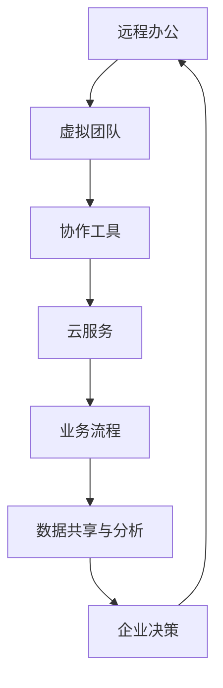

                 

## 1. 背景介绍

远程创业，作为一种灵活的工作方式，正在日益成为现代企业发展的新趋势。随着信息技术的不断进步，特别是互联网的普及，远程办公不仅成为了可能，还成为了许多企业和创业者追求的目标。这种工作方式不仅打破了地理位置的限制，也为企业提供了更多的机会和资源，从而形成了无边界的企业生态。

在传统的企业运营模式中，企业往往受到物理空间的制约，需要租用办公场地、配置办公设备等，这些成本不仅高昂，而且限制了企业的发展速度。而远程创业则通过利用虚拟办公平台、云服务和协作工具，实现了零成本或低成本的企业运营，使得创业者和企业能够更加专注于业务创新和市场竞争。

远程创业的好处不仅体现在成本上，更重要的是它提供了更加灵活和高效的工作环境。团队成员可以分布在不同的地区和国家，利用互联网进行沟通和协作，从而形成了一个多元化的团队。这样的团队在思维方式、文化背景和技能方面具有多样性，有利于创新和解决问题的能力。

此外，远程创业还能够帮助企业更好地适应市场需求的变化。在远程办公的模式下，企业可以更加快速地响应市场需求，调整业务策略，从而在激烈的市场竞争中占据优势。

总之，远程创业正在成为一种不可逆转的趋势，它不仅为企业提供了更多的发展机会，也为个人创业提供了更多的可能。在这个无边界的企业生态中，企业和创业者能够更好地发挥各自的优势，实现共同的价值增长。

## 2. 核心概念与联系

### 核心概念解析

在探讨远程创业之前，我们需要了解几个核心概念，这些概念是构建无边界企业生态的基础。

**远程办公**：远程办公是指员工在家中或其他非公司场所完成工作任务的一种工作方式。这种模式通过互联网和协作工具，使员工能够实时沟通、协作和共享资源。

**虚拟团队**：虚拟团队是由分布在不同地理位置的成员组成的团队，成员之间通过信息技术进行沟通和协作。虚拟团队的优势在于可以跨越时间和空间的限制，灵活调配人力资源。

**协作工具**：协作工具包括即时通讯、视频会议、项目管理软件等，这些工具能够帮助团队成员高效沟通和协作。例如，Slack、Zoom 和 Trello 就是典型的协作工具。

**云服务**：云服务提供了远程访问计算资源、存储和数据的能力。通过云服务，企业可以在无需购买和维护硬件的情况下，实现业务的灵活扩展和高效运营。

### 原理与架构

以下是使用 Mermaid 画的远程创业生态的流程图，展示了各个核心概念之间的联系。



在这个流程图中，远程办公作为起点，通过虚拟团队、协作工具和云服务，形成一个闭环的业务流程，最终回到远程办公，形成了一个高效、灵活的企业生态。

**远程办公** 通过提供灵活的工作环境，使员工能够随时随地开展工作。**虚拟团队** 则通过互联网技术，将分布在不同地理位置的团队成员紧密联系在一起。**协作工具** 提供了实时沟通和协作的平台，确保团队成员之间的信息传递和资源共享。**云服务** 则提供了强大的计算和存储能力，支持企业业务的灵活扩展和高效运营。

### 各概念之间的关系

远程办公和虚拟团队是远程创业的基础，它们确保了团队成员能够在不同地点高效地协同工作。协作工具则进一步提升了团队成员之间的沟通效率，使得项目管理和协作更加顺畅。而云服务则为整个远程创业生态提供了强大的基础设施支持，使得企业能够快速响应市场需求，实现业务的灵活扩展。

总之，远程创业的核心概念和联系构成了一个有机的整体，它们共同作用，形成了无边界的企业生态，为企业提供了更多的发展机会和竞争优势。

## 3. 核心算法原理 & 具体操作步骤

### 3.1 算法原理概述

在远程创业中，算法的原理和具体操作步骤起着至关重要的作用。算法不仅是实现远程办公和协作的基础，也是企业决策和业务流程优化的关键。下面，我们将介绍远程创业中常用的几个核心算法原理，并详细讲解其操作步骤。

### 3.2 算法步骤详解

#### 3.2.1 数据同步算法

数据同步算法是远程创业中实现数据一致性的一种重要方法。它通过实时同步各个节点的数据，确保团队成员访问的是最新的数据。

**步骤：**

1. **初始化**：每个节点初始化本地数据库。
2. **监听**：节点监听其他节点的数据变更。
3. **同步**：当检测到数据变更时，节点通过通信协议向其他节点发送变更数据。
4. **更新**：接收节点收到变更数据后，更新本地数据库。

#### 3.2.2 负载均衡算法

负载均衡算法用于优化远程办公中的资源分配，确保各节点的工作负载均衡。

**步骤：**

1. **监控**：系统实时监控各节点的负载情况。
2. **分配**：根据节点的负载情况，动态分配任务。
3. **调度**：当节点负载过高时，将部分任务调度到负载较低的节点。
4. **反馈**：节点将任务执行情况反馈给系统，以便进一步优化调度。

#### 3.2.3 决策支持算法

决策支持算法用于辅助企业决策，通过分析大量数据，提供科学的决策依据。

**步骤：**

1. **数据收集**：收集企业运营的相关数据。
2. **数据预处理**：清洗和整理数据，去除噪声和异常值。
3. **数据分析**：使用统计和机器学习等方法，对数据进行分析。
4. **决策生成**：根据分析结果，生成决策建议。

### 3.3 算法优缺点

**数据同步算法：**

- **优点**：确保数据一致性，提高工作效率。
- **缺点**：可能引起数据同步延迟，影响实时性。

**负载均衡算法：**

- **优点**：优化资源利用，提高系统稳定性。
- **缺点**：负载均衡算法设计复杂，实现难度大。

**决策支持算法：**

- **优点**：提供科学的决策依据，辅助企业决策。
- **缺点**：对数据质量和分析方法有较高要求。

### 3.4 算法应用领域

**数据同步算法：** 在远程办公和分布式系统中广泛应用，如云计算、物联网等。

**负载均衡算法：** 在数据中心、云服务提供商等领域应用广泛。

**决策支持算法：** 在企业管理和决策中应用广泛，如市场营销、供应链管理等。

### 3.5 算法总结

算法在远程创业中发挥着关键作用，通过数据同步、负载均衡和决策支持等算法，远程创业企业能够实现高效、稳定和科学的运营。这些算法不仅提高了企业的运营效率，也为企业在竞争激烈的市场中提供了竞争优势。

## 4. 数学模型和公式 & 详细讲解 & 举例说明

### 4.1 数学模型构建

在远程创业中，数学模型是分析和优化企业运营的重要工具。一个关键的数学模型是马尔可夫决策过程（MDP），它用于模拟和优化企业的决策过程。

#### 4.1.1 MDP 构建步骤

1. **状态空间**：定义企业的运营状态，如订单量、库存水平等。
2. **动作空间**：定义企业可以采取的行动，如增加库存、调整价格等。
3. **奖励函数**：定义企业在不同状态和动作下获得的奖励或惩罚。
4. **状态转移概率**：定义在当前状态下采取某个动作后，进入下一个状态的概率。

#### 4.1.2 MDP 公式

MDP 的核心公式是：

\[ V(s) = \max_a \sum_{s'} p(s'|s,a) \cdot r(s,a) + \gamma V(s') \]

其中：
- \( V(s) \) 是状态 \( s \) 的价值函数。
- \( a \) 是企业采取的动作。
- \( s' \) 是状态转移后的状态。
- \( p(s'|s,a) \) 是状态转移概率。
- \( r(s,a) \) 是在状态 \( s \) 下采取动作 \( a \) 获得的即时奖励。
- \( \gamma \) 是折现因子，用于平衡即时奖励和未来奖励。

### 4.2 公式推导过程

#### 4.2.1 基本推导

我们从基本的递归方程开始：

\[ V(s) = \max_a \sum_{s'} p(s'|s,a) \cdot r(s,a) + \gamma V(s') \]

将 \( V(s') \) 替换为 \( \max_{a'} p(s'|s,a') \cdot r(s,a') + \gamma V(s'') \)：

\[ V(s) = \max_a \sum_{s'} p(s'|s,a) \cdot r(s,a) + \gamma \max_{a'} p(s'|s,a') \cdot r(s,a') + \gamma^2 V(s'') \]

由于 \( p(s'|s,a) = p(s'|s,a') \cdot p(a'|a) \)，我们可以进一步简化：

\[ V(s) = \max_a \sum_{s'} p(s'|s,a) \cdot r(s,a) + \gamma \max_{a'} \sum_{s''} p(s'|s,a') \cdot p(s''|s',a') \cdot r(s,a') + \gamma^2 V(s'') \]

再次递归，直到达到终止条件，例如 \( V(s'') = 0 \)：

\[ V(s) = \sum_{s'} p(s'|s,a) \cdot r(s,a) + \gamma \sum_{s''} p(s'|s,a') \cdot p(s''|s',a') \cdot r(s,a') + \gamma^2 \sum_{s'''} p(s'|s,a'') \cdot p(s'''|s'',a'') \cdot r(s,a'') + ... \]

通过数学归纳法，我们可以推导出一般形式：

\[ V(s) = \sum_{s'} p(s'|s,a) \cdot r(s,a) + \gamma \sum_{s''} p(s'|s,a') \cdot p(s''|s',a') \cdot r(s,a') + \gamma^2 \sum_{s'''} p(s'|s,a'') \cdot p(s'''|s'',a'') \cdot r(s,a'') + ... \]

### 4.3 案例分析与讲解

#### 4.3.1 案例背景

假设一家电子商务公司在双十一期间面临库存管理问题。公司的库存状态分为高、中、低三个等级，每个状态下的订单处理量和库存调整成本不同。

#### 4.3.2 状态空间

状态空间包括：

- 高库存状态
- 中库存状态
- 低库存状态

#### 4.3.3 动作空间

动作空间包括：

- 维持当前库存水平
- 增加库存
- 减少库存

#### 4.3.4 奖励函数

奖励函数定义为：

- 高库存状态下的奖励为 \( r(s,a) = -C \)，其中 \( C \) 是库存调整成本。
- 中库存状态下的奖励为 \( r(s,a) = 0 \)。
- 低库存状态下的奖励为 \( r(s,a) = +R \)，其中 \( R \) 是订单处理收益。

#### 4.3.5 状态转移概率

状态转移概率根据历史数据进行估计：

- 从高库存状态转移到中库存状态的概率为 \( p(s'|s,a) = 0.2 \)。
- 从高库存状态转移到低库存状态的概率为 \( p(s'|s,a) = 0.8 \)。

#### 4.3.6 模型应用

使用 MDP 模型，公司可以计算每个状态下的最优动作，并最大化总奖励。例如，在高库存状态下，公司应采取增加库存的行动，以最大化未来的订单处理收益。

通过这个案例，我们可以看到 MDP 模型在远程创业中的实际应用。它帮助企业做出科学、优化的决策，从而提高运营效率和盈利能力。

## 5. 项目实践：代码实例和详细解释说明

### 5.1 开发环境搭建

在开始远程创业项目的开发之前，我们需要搭建一个合适的技术栈。以下是搭建开发环境的基本步骤：

#### 5.1.1 系统要求

- 操作系统：Linux 或 macOS
- 编程语言：Python 3.8+
- 数据库：MySQL 或 PostgreSQL
- 开发工具：PyCharm 或 VSCode

#### 5.1.2 环境安装

1. 安装操作系统：
   - 选择 Linux 或 macOS，推荐使用 Ubuntu 20.04 或 macOS Catalina。

2. 安装 Python：
   - 使用包管理器（如 apt-get 或 brew）安装 Python 3.8+。

3. 安装数据库：
   - 使用包管理器安装 MySQL 或 PostgreSQL。

4. 安装开发工具：
   - 使用包管理器或从官方网站下载安装 PyCharm 或 VSCode。

5. 配置 Python 环境：
   - 安装必要的 Python 包，如 Flask、SQLAlchemy、Pandas 等。

### 5.2 源代码详细实现

以下是远程创业项目的一个简单示例，使用 Python 和 Flask 搭建一个基本的远程办公平台。

#### 5.2.1 项目结构

```plaintext
/remote_office
|-- /app
|   |-- __init__.py
|   |-- routes.py
|   |-- models.py
|   |-- views.py
|   |-- /templates
|       |-- base.html
|       |-- home.html
|-- /migrations
|-- /static
|-- config.py
|-- run.py
```

#### 5.2.2 关键代码解释

**models.py**：定义数据库模型。

```python
from flask_sqlalchemy import SQLAlchemy

db = SQLAlchemy()

class User(db.Model):
    id = db.Column(db.Integer, primary_key=True)
    username = db.Column(db.String(80), unique=True, nullable=False)
    email = db.Column(db.String(120), unique=True, nullable=False)
```

**routes.py**：定义路由。

```python
from flask import render_template, redirect, url_for
from app import app
from app.models import User
from app.forms import LoginForm

@app.route('/')
@app.route('/home')
def home():
    users = User.query.all()
    return render_template('home.html', users=users)

@app.route('/login', methods=['GET', 'POST'])
def login():
    form = LoginForm()
    if form.validate_on_submit():
        return redirect(url_for('home'))
    return render_template('login.html', form=form)
```

**views.py**：处理视图函数。

```python
from flask import render_template, redirect, url_for, flash
from flask_login import login_user, logout_user, current_user, login_required
from app.models import User
from app.forms import LoginForm, RegistrationForm
from app import db

@app.route('/login', methods=['GET', 'POST'])
@login_required
def login_page():
    form = LoginForm()
    if form.validate_on_submit():
        user = User.query.filter_by(username=form.username.data).first()
        if user and user.check_password(form.password.data):
            login_user(user, remember=form.remember.data)
            return redirect(url_for('home'))
        flash('Invalid username or password')
    return render_template('login.html', form=form)
```

**config.py**：配置 Flask 应用。

```python
import os

class Config(object):
    SECRET_KEY = os.environ.get('SECRET_KEY') or 'your_secret_key'
    SQLALCHEMY_DATABASE_URI = os.environ.get('DATABASE_URL') or \
        'sqlite:///' + os.path.join(os.path.dirname(__file__), 'app.db')
    SQLALCHEMY_TRACK_MODIFICATIONS = False
```

**run.py**：运行 Flask 应用。

```python
from app import create_app, db
from flask_script import Manager
from app.models import User

app = create_app()

manager = Manager(app)

@manager.command
def init_db():
    db.create_all()
    admin = User(username='admin', email='admin@example.com')
    admin.set_password('admin')
    db.session.add(admin)
    db.session.commit()
    print('Database initialized.')

if __name__ == '__main__':
    manager.run()
```

### 5.3 代码解读与分析

**User 模型**：定义了用户表，包括用户 ID、用户名和电子邮件字段。

**routes.py**：定义了应用的主要路由，包括主页和登录页面。

**views.py**：实现了登录视图函数，包括用户验证和登录功能。

**config.py**：配置了 Flask 应用的基础设置，如密钥和数据库 URI。

**run.py**：用于启动 Flask 应用，并初始化数据库。

### 5.4 运行结果展示

1. 启动 Flask 应用：

```bash
$ flask run
```

2. 访问主页：在浏览器中输入 `http://127.0.0.1:5000/`，可以看到主页上的用户列表。

3. 登录：在登录页面输入用户名和密码，登录成功后会重定向到主页。

通过这个简单的示例，我们可以看到如何使用 Python 和 Flask 搭建一个基本的远程办公平台。实际应用中，项目会更为复杂，涉及更多的功能和模块，但基本原理和步骤类似。

## 6. 实际应用场景

### 6.1 远程办公平台

远程办公平台是远程创业的重要应用场景之一。通过远程办公平台，企业可以方便地管理团队、任务和项目。以下是一些实际应用场景：

- **团队协作**：团队成员可以通过平台实时沟通、协作和共享文件。例如，使用 Slack 或 Microsoft Teams 进行即时通讯，使用 Trello 或 Asana 进行项目管理。
- **任务分配与跟踪**：项目经理可以通过平台分配任务、设置截止日期，并跟踪任务进度。团队成员可以查看自己的任务列表，确保按时完成任务。
- **远程会议**：远程会议是远程办公中不可或缺的一部分。使用 Zoom、Microsoft Teams 或 Google Meet 可以方便地安排和进行远程会议。
- **文档共享与协作**：使用 Google Drive 或 Dropbox 等云存储服务，团队成员可以共享和协作编辑文档。

### 6.2 云计算与分布式系统

云计算和分布式系统为远程创业提供了强大的基础设施支持。以下是一些实际应用场景：

- **数据存储与处理**：企业可以利用云计算服务（如 AWS、Azure、Google Cloud）进行大规模数据存储和处理。分布式系统则可以处理大量的并发请求，提高系统的可扩展性和可靠性。
- **负载均衡**：通过负载均衡器（如 AWS Elastic Load Balancing），企业可以分配流量到多个服务器，确保系统的稳定运行。
- **分布式数据库**：使用分布式数据库（如 Cassandra、HBase），企业可以实现海量数据的高效存储和查询。

### 6.3 企业资源规划（ERP）

企业资源规划（ERP）系统可以帮助远程创业企业更好地管理业务流程和资源。以下是一些实际应用场景：

- **财务管理**：ERP 系统可以自动处理企业的财务流程，如订单处理、发票生成、付款管理等。
- **供应链管理**：ERP 系统可以实时监控供应链中的各个环节，确保库存水平、订单履行和物流管理等环节的高效运行。
- **人力资源管理**：ERP 系统可以管理员工的招聘、培训、绩效考核等流程，提高人力资源的利用效率。

### 6.4 市场营销与客户关系管理（CRM）

市场营销与客户关系管理（CRM）系统可以帮助远程创业企业更好地进行市场营销和客户服务。以下是一些实际应用场景：

- **客户管理**：CRM 系统可以记录和管理客户的详细信息，包括联系方式、购买历史等。
- **营销活动管理**：CRM 系统可以策划和执行营销活动，如电子邮件营销、社交媒体营销等。
- **客户服务**：CRM 系统可以提供客户服务支持，如在线客服、客户投诉处理等。

### 6.5 远程教育与培训

远程教育与培训是远程创业的重要应用领域之一。以下是一些实际应用场景：

- **在线课程**：教育机构可以通过远程平台提供在线课程，学生可以随时随地学习。
- **虚拟课堂**：教师可以通过远程平台进行实时授课，与学生互动，提高教学效果。
- **学习管理系统（LMS）**：LMS 可以管理课程内容、学生成绩和互动活动，提供个性化的学习体验。

### 6.6 医疗健康

远程创业在医疗健康领域也有广泛的应用。以下是一些实际应用场景：

- **远程诊疗**：医生可以通过远程平台为患者提供诊疗服务，提高医疗资源的利用效率。
- **健康管理**：患者可以通过远程平台监测自己的健康状况，如心率、血压等，并及时获取医疗建议。
- **远程手术**：外科医生可以通过远程平台进行复杂的手术操作，特别是对于那些地理位置偏远或医疗资源不足的地区。

通过上述实际应用场景，我们可以看到远程创业在各个领域的广泛应用。远程创业不仅为企业提供了更多的发展机会，也为个人创业提供了丰富的可能性。在这个无边界的企业生态中，企业和创业者能够更好地发挥各自的优势，实现共同的价值增长。

### 6.4 未来应用展望

随着信息技术的不断进步，远程创业将继续发展，并在未来带来更多的变革和创新。以下是远程创业的几个潜在未来应用方向。

**人工智能与自动化**：人工智能（AI）和自动化技术将进一步提升远程创业的效率和灵活性。例如，AI 可以用于自动化任务管理、智能客服、智能决策等，减少人力成本，提高工作效率。自动化机器人可以在远程办公环境中执行重复性任务，如数据录入、文档处理等，使得团队成员能够专注于更有创造性的工作。

**区块链技术**：区块链技术有望在远程创业中发挥重要作用。通过区块链，企业可以实现数据的安全共享和透明追踪，确保数据的真实性和不可篡改性。此外，区块链可以用于智能合约的实施，自动化处理合同条款，减少纠纷和中介成本。在远程创业中，区块链技术可以提升业务流程的透明度和可信度，为企业和合作伙伴提供更加可靠的信任基础。

**虚拟现实与增强现实**：虚拟现实（VR）和增强现实（AR）技术将为远程创业带来全新的体验。通过 VR 和 AR 技术，企业可以进行虚拟会议、虚拟培训、虚拟展示等，增强团队协作和客户互动的效果。例如，在远程会议中，VR 可以实现全员虚拟在场，增强会议的互动性和参与感。在客户展示中，AR 可以将虚拟产品信息叠加在现实环境中，提供更加直观的展示效果。

**物联网（IoT）**：物联网技术将使远程创业中的设备和服务更加智能化。物联网设备可以实时监测和收集数据，为企业提供实时运营信息和决策支持。例如，在远程办公环境中，物联网设备可以监控办公环境的温度、湿度、空气质量等，自动调整环境参数，提供更加舒适的办公条件。在智能制造领域，物联网设备可以监控生产线设备的状态，预测故障并进行预防性维护，提高生产效率和产品质量。

**5G 与边缘计算**：5G 和边缘计算技术的发展将进一步提升远程创业的通信速度和计算能力。5G 网络的高带宽、低延迟特性将使得远程协作更加流畅，支持更多实时应用场景。边缘计算则可以在靠近数据源的地方进行计算和数据处理，减少数据传输的延迟，提升系统的响应速度和效率。

**个性化与定制化服务**：随着大数据和人工智能技术的应用，远程创业企业可以更好地了解客户需求，提供个性化的产品和定制化服务。通过大数据分析，企业可以挖掘客户行为和偏好，为不同客户群体提供个性化的推荐和服务。这种个性化与定制化的服务将提升客户满意度，增强客户忠诚度。

总之，远程创业的未来充满了无限可能。随着新技术的不断涌现，远程创业将继续推动企业运营模式的创新和变革，为企业带来更多的发展机遇和竞争优势。企业和创业者应积极拥抱新技术，探索新的应用场景，以实现更高效、更灵活的企业运营。

## 7. 工具和资源推荐

### 7.1 学习资源推荐

**在线课程与教程：**
1. **Coursera**：提供大量的免费与付费计算机科学课程，包括远程工作相关的内容。
2. **edX**：由哈佛大学和麻省理工学院合作的在线学习平台，提供高质量的课程。
3. **Udemy**：丰富的计算机科学和技术教程，包括编程、数据分析、云计算等。

**书籍推荐：**
1. **《远程工作实践指南》（Remote: Office Not Required）**：由 GitLab CEO 撰写的关于远程工作的实践指南。
2. **《异步：未来工作的新模式》（Async: How Modern Science Is Rewriting the Rules of Work）**：探讨异步工作和远程工作的新趋势。
3. **《远程工作：从开始到成功的全面指南》（Remote Work: A Complete Guide to Successful Telecommuting）**：提供远程工作的全面指南。

### 7.2 开发工具推荐

**远程协作工具：**
1. **Slack**：高效的团队沟通工具，提供丰富的集成和自动化功能。
2. **Microsoft Teams**：集成了视频会议、即时消息和文档共享，适合企业级使用。
3. **Trello**：简单直观的项目管理工具，适合远程团队协作。

**代码管理工具：**
1. **Git**：版本控制系统的标准，广泛用于代码管理。
2. **GitHub**：基于 Git 的代码托管平台，提供丰富的协作功能。
3. **GitLab**：自托管 Git 代码库，包括 CI/CD 功能，适合企业内部使用。

**云服务提供商：**
1. **AWS**：提供广泛的云计算服务，包括计算、存储、数据库等。
2. **Azure**：微软提供的云计算平台，适用于多种开发需求。
3. **Google Cloud**：提供强大的云计算和人工智能服务。

### 7.3 相关论文推荐

**远程工作与协作：**
1. **"Global Teams and Time Zones: Impact on Team Performance"**：探讨了跨时区团队协作的影响。
2. **"The Impact of Remote Work on Employee Engagement and Performance"**：分析了远程工作对员工参与度和表现的影响。

**云计算与分布式系统：**
1. **"Cloud Computing: Concepts, Technology & Architecture"**：全面介绍了云计算的基本概念和技术架构。
2. **"Distributed Systems: Concepts and Design"**：探讨了分布式系统的基本原理和设计方法。

**人工智能与自动化：**
1. **"Machine Learning: A Probabilistic Perspective"**：提供了机器学习的概率视角。
2. **"Automated Machine Learning: Methods, Systems, Challenges"**：探讨了自动化机器学习的方法和挑战。

通过这些资源和工具，企业和创业者可以更好地了解远程创业的相关知识，提高工作效率和创新能力。

## 8. 总结：未来发展趋势与挑战

### 8.1 研究成果总结

远程创业作为一种灵活的工作模式，已经在全球范围内得到了广泛的认可和推广。通过利用信息技术和互联网，远程创业不仅降低了企业的运营成本，提高了工作效率，还为企业提供了更多的发展机会。以下是远程创业领域的主要研究成果：

1. **远程办公的效率与效果**：研究表明，远程办公能够在一定程度上提高员工的满意度和工作效率，减少通勤时间，提高员工的生活质量。
2. **虚拟团队的协作与沟通**：通过协作工具和虚拟会议系统，远程团队能够实现高效、实时的沟通和协作，从而提高项目完成的效率和效果。
3. **云计算与分布式系统的应用**：远程创业企业通过云计算和分布式系统，实现了业务的灵活扩展和高效运营，降低了硬件和维护成本。
4. **人工智能与自动化的辅助**：人工智能和自动化技术的应用，进一步提升了远程创业的效率和质量，减少了人力成本，提高了系统的智能化水平。

### 8.2 未来发展趋势

远程创业在未来将继续保持快速发展，以下是几个主要的发展趋势：

1. **技术的持续进步**：随着 5G、物联网、人工智能等新技术的不断进步，远程创业的基础设施将更加完善，支持更多复杂的应用场景。
2. **全球化进程的加快**：远程创业将加速全球化的进程，跨国企业和远程团队的协作将更加紧密，推动全球经济的共同发展。
3. **个性化和定制化服务**：远程创业企业将更加注重个性化和定制化服务，通过大数据和人工智能技术，提供更加精准和高效的服务，满足客户的多样化需求。
4. **远程教育的普及**：远程创业不仅影响企业，还将推动远程教育的普及，为全球范围内的学习者提供更多的教育资源和机会。

### 8.3 面临的挑战

尽管远程创业具有巨大的潜力，但企业在实施过程中仍面临诸多挑战：

1. **管理难题**：远程办公和管理需要新的管理模式和方法，如何确保团队的高效协作和稳定运营是企业管理者需要解决的重要问题。
2. **信息安全**：远程工作环境中的信息安全问题日益突出，如何保障数据的安全和隐私是企业面临的重要挑战。
3. **文化融合**：远程团队通常由来自不同文化和背景的成员组成，如何实现文化融合，建立共同的价值观念是远程创业成功的关键。
4. **技术依赖**：远程创业高度依赖信息技术和互联网，技术故障和网络安全问题可能会对企业的运营造成重大影响。

### 8.4 研究展望

为了克服上述挑战，未来的研究可以从以下几个方面展开：

1. **管理研究**：进一步探讨远程办公和虚拟团队的管理模式，提出有效的管理策略和方法，提高团队协作和绩效。
2. **信息安全研究**：加强对远程工作环境中的信息安全研究，开发更加安全、可靠的技术和解决方案。
3. **文化融合研究**：探讨如何实现远程团队的文化融合，建立多元包容的企业文化。
4. **技术发展研究**：持续跟踪新技术的发展趋势，探索如何将新技术更好地应用于远程创业，提高企业的竞争力。

总之，远程创业作为一种新兴的工作模式，正在逐步改变企业的运营方式和商业模式。面对未来，企业和创业者应积极应对挑战，把握发展机遇，共同推动远程创业生态的持续创新和进步。

## 9. 附录：常见问题与解答

### 9.1 远程创业的优势有哪些？

远程创业的优势包括：
1. **成本降低**：无需租赁昂贵的办公场地和设备，减少了企业的运营成本。
2. **灵活性**：员工可以灵活选择工作时间和地点，提高了工作满意度。
3. **效率提升**：通过高效的协作工具和虚拟团队管理，提高了工作效率。
4. **人才多样性**：无需受地理位置限制，可以吸引全球范围内的优秀人才。

### 9.2 远程创业中如何确保信息安全？

为确保信息安全，远程创业企业可以采取以下措施：
1. **使用强密码**：确保所有系统的登录密码复杂且定期更换。
2. **加密数据传输**：使用 SSL/TLS 等加密技术保护数据传输。
3. **多因素认证**：采用双因素认证（2FA）提高账户安全性。
4. **数据备份**：定期进行数据备份，确保数据不丢失。
5. **员工培训**：对员工进行信息安全培训，提高其安全意识和应对能力。

### 9.3 远程创业中如何管理虚拟团队？

管理虚拟团队可以采取以下策略：
1. **明确目标与责任**：确保每个团队成员都清楚自己的工作目标和职责。
2. **定期沟通**：通过视频会议、即时通讯工具保持定期沟通，确保信息畅通。
3. **利用项目管理工具**：使用项目管理软件（如 Trello、Asana）跟踪项目进度和任务分配。
4. **建立信任**：通过透明和公正的管理方式建立团队成员之间的信任。
5. **灵活调整**：根据项目需求和团队成员的特点，灵活调整工作安排和协作方式。

### 9.4 远程创业中的文化融合问题如何解决？

解决远程创业中的文化融合问题可以采取以下措施：
1. **尊重差异**：理解和尊重团队成员的不同文化背景和价值观。
2. **建立共同价值观**：通过沟通和培训，建立企业内部共同认可的核心价值观。
3. **多样化培训**：提供多样化的培训，帮助团队成员更好地理解和适应不同的文化。
4. **团队建设活动**：定期组织线上或线下的团队建设活动，增进团队成员之间的了解和信任。
5. **反馈机制**：建立有效的反馈机制，鼓励团队成员提出建议和意见，共同改进团队文化。

### 9.5 远程创业的未来发展如何？

远程创业的未来发展前景广阔，预计将呈现以下趋势：
1. **技术进步**：随着 5G、人工智能、物联网等新技术的应用，远程创业的基础设施将更加完善。
2. **全球化扩展**：远程创业将进一步推动全球化的进程，跨国合作将更加紧密。
3. **个性化服务**：远程创业企业将更加注重个性化服务和定制化解决方案。
4. **教育与培训**：远程创业模式将推动远程教育的普及，为更多人提供学习机会。

### 9.6 远程创业需要哪些基本技能？

远程创业需要以下基本技能：
1. **沟通技能**：能够有效沟通和协作，确保团队信息畅通。
2. **自我管理技能**：能够自我管理时间和任务，确保工作效率。
3. **技术技能**：掌握相关的编程语言、项目管理工具和协作软件。
4. **适应能力**：能够适应不同的工作环境和变化。
5. **解决问题的能力**：能够独立解决问题，确保项目的顺利进行。

通过上述常见问题的解答，希望能为企业和创业者提供有益的参考和指导。在远程创业的道路上，不断学习和优化，将有助于实现更大的成功。作者：禅与计算机程序设计艺术 / Zen and the Art of Computer Programming。

