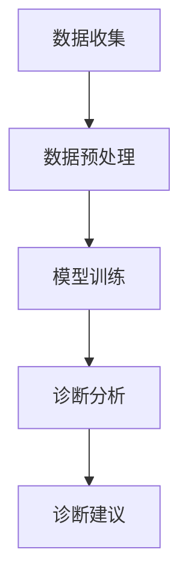

                 

 关键词：远程医疗、人工智能、诊断系统、应用价值

> 摘要：本文旨在探讨远程医疗AI诊断系统的应用价值，通过深入分析其技术原理、实现方法以及实际应用场景，展示该系统在现代医疗领域的革命性意义。本文将结合案例，对系统的开发环境、代码实现、以及未来的发展趋势进行详细论述。

## 1. 背景介绍

在21世纪，随着信息技术的飞速发展和人工智能技术的成熟，远程医疗逐渐成为一种趋势。传统的医疗服务模式由于地域限制、医疗资源分布不均等因素，难以满足全球范围内不断增长的健康需求。远程医疗通过互联网技术，实现了医疗资源的共享和医疗服务的延伸，极大地提高了医疗服务的效率和质量。

人工智能（AI）作为一门前沿技术，已经在医疗领域展示了其强大的应用潜力。从影像诊断、病理分析到药物研发，AI技术在提升医疗诊断准确性、降低误诊率、提高医疗效率等方面发挥了重要作用。随着AI技术的不断进步，远程医疗AI诊断系统逐渐成为医疗行业的焦点。

远程医疗AI诊断系统通过集成先进的图像识别、自然语言处理、机器学习等技术，实现了对病人病史、症状、影像等数据的智能分析，提供快速、准确的诊断建议。这不仅有助于缓解医疗资源紧张的问题，也为患者提供了更为便捷的医疗服务。

## 2. 核心概念与联系

### 2.1 核心概念

远程医疗AI诊断系统涉及多个关键概念，包括：

- **远程医疗**：利用互联网等通讯技术，实现患者与医生之间的远程诊疗服务。
- **人工智能**：模拟人类智能行为的技术，通过算法和模型实现自动化决策和智能分析。
- **诊断系统**：用于分析病人数据，提供诊断建议的医疗信息系统。

### 2.2 联系

远程医疗AI诊断系统的核心在于将远程医疗与人工智能技术相结合。具体来说，该系统的工作流程可以概括为以下几个步骤：

1. **数据收集**：通过医疗设备、电子健康档案等手段收集患者病史、症状、影像等数据。
2. **数据预处理**：对收集到的数据进行分析、清洗，提取关键特征。
3. **模型训练**：使用收集到的数据集，通过机器学习算法训练AI模型。
4. **诊断分析**：将患者的实时数据输入到训练好的模型中，进行诊断分析。
5. **诊断建议**：根据分析结果，提供诊断建议和治疗方案。

以下是一个简化的 Mermaid 流程图，展示了远程医疗AI诊断系统的基本架构：



## 3. 核心算法原理 & 具体操作步骤

### 3.1 算法原理概述

远程医疗AI诊断系统的核心算法主要依赖于深度学习、图像识别和自然语言处理等技术。以下是这些技术的基本原理：

- **深度学习**：通过构建多层神经网络，对大量数据进行分析和建模，从而实现智能识别和预测。
- **图像识别**：利用卷积神经网络（CNN）对医疗影像进行特征提取和分析，实现疾病的自动识别。
- **自然语言处理**：通过自然语言处理（NLP）技术，对患者的病史和症状描述进行语义分析和理解，辅助诊断。

### 3.2 算法步骤详解

#### 3.2.1 数据收集

数据收集是远程医疗AI诊断系统的第一步。数据来源包括电子健康档案、医院信息系统、医学影像库等。数据类型包括病史记录、症状描述、实验室检测结果、医学影像等。

#### 3.2.2 数据预处理

数据预处理是保证数据质量和算法性能的关键步骤。具体操作包括：

1. **数据清洗**：去除重复、错误、缺失的数据。
2. **数据标准化**：将不同来源、不同格式的数据转换为统一格式。
3. **特征提取**：从原始数据中提取具有代表性的特征。

#### 3.2.3 模型训练

模型训练是利用预处理后的数据集，通过机器学习算法训练AI模型。常见的训练过程包括：

1. **数据划分**：将数据集划分为训练集、验证集和测试集。
2. **算法选择**：选择适合的医疗数据集的机器学习算法，如卷积神经网络（CNN）、循环神经网络（RNN）等。
3. **训练过程**：通过迭代训练，优化模型参数，提高模型性能。

#### 3.2.4 诊断分析

诊断分析是将患者的实时数据输入到训练好的模型中，进行诊断分析。具体操作包括：

1. **数据输入**：将患者的病史、症状、影像等数据输入到模型中。
2. **特征提取**：通过模型对输入数据进行分析，提取关键特征。
3. **诊断结果**：根据特征分析结果，提供诊断建议和治疗方案。

### 3.3 算法优缺点

#### 优点：

1. **高效性**：AI诊断系统可以在短时间内处理大量医疗数据，提高诊断速度。
2. **准确性**：通过深度学习和图像识别技术，AI诊断系统能够提供高精度的诊断结果。
3. **便捷性**：患者无需前往医院，通过远程医疗服务，即可获得专业医生的诊断建议。

#### 缺点：

1. **数据依赖**：AI诊断系统的性能高度依赖于训练数据的质量和数量。
2. **隐私风险**：医疗数据的隐私保护是远程医疗AI诊断系统面临的一个重要挑战。
3. **法律责任**：在AI诊断结果用于临床决策时，需要明确责任归属，以确保医疗安全。

### 3.4 算法应用领域

远程医疗AI诊断系统在多个领域具有广泛应用：

1. **常见疾病诊断**：如肺炎、心脏病、糖尿病等。
2. **癌症早期筛查**：通过影像识别技术，实现肺癌、乳腺癌等癌症的早期筛查。
3. **个性化治疗**：根据患者的病史和基因信息，提供个性化的治疗方案。
4. **医疗资源分配**：通过分析医疗数据，优化医疗资源的分配和利用。

## 4. 数学模型和公式 & 详细讲解 & 举例说明

### 4.1 数学模型构建

远程医疗AI诊断系统的核心数学模型通常基于深度学习算法，如卷积神经网络（CNN）和循环神经网络（RNN）。以下是这些模型的基本公式和结构。

#### 卷积神经网络（CNN）

卷积神经网络通过卷积操作提取图像特征，其基本公式如下：

$$
\text{activation}(x) = \text{ReLU}(\sum_{k=1}^{K} w_k \star h(x; \theta_k))
$$

其中，$x$ 是输入图像，$w_k$ 是卷积核权重，$\theta_k$ 是卷积核参数，$\star$ 表示卷积操作，$\text{ReLU}$ 是ReLU激活函数。

#### 循环神经网络（RNN）

循环神经网络通过递归操作处理序列数据，其基本公式如下：

$$
h_t = \text{sigmoid}(W_h h_{t-1} + U_x x_t + b_h)
$$

其中，$h_t$ 是当前隐藏状态，$W_h$ 和 $U_x$ 是权重矩阵，$b_h$ 是偏置项，$\text{sigmoid}$ 是sigmoid激活函数。

### 4.2 公式推导过程

以卷积神经网络（CNN）为例，其公式推导过程如下：

1. **输入层到卷积层的推导**：

   $$ 
   \text{output}_{ij}^{l} = \sum_{k=1}^{K} w_{ik}^{l} \star \text{input}_{k}^{l-1} + b_{i}^{l}
   $$

   其中，$\text{output}_{ij}^{l}$ 是卷积层 $l$ 的输出，$w_{ik}^{l}$ 是卷积核权重，$\text{input}_{k}^{l-1}$ 是输入层 $l-1$ 的输出，$b_{i}^{l}$ 是卷积层 $l$ 的偏置项。

2. **卷积层到激活层的推导**：

   $$ 
   \text{activation}_{ij}^{l} = \text{ReLU}(\text{output}_{ij}^{l})
   $$

   其中，$\text{activation}_{ij}^{l}$ 是激活层 $l$ 的输出，$\text{ReLU}$ 是ReLU激活函数。

3. **全连接层到输出层的推导**：

   $$ 
   \text{output}_{ij}^{L} = \sum_{k=1}^{K} w_{ik}^{L} h_{k}^{L-1} + b_{i}^{L}
   $$

   其中，$\text{output}_{ij}^{L}$ 是输出层 $L$ 的输出，$w_{ik}^{L}$ 是全连接层 $L$ 的权重，$h_{k}^{L-1}$ 是卷积层 $L-1$ 的输出，$b_{i}^{L}$ 是输出层 $L$ 的偏置项。

### 4.3 案例分析与讲解

#### 案例一：肺炎诊断

假设我们使用卷积神经网络（CNN）对肺炎进行诊断。输入图像是患者的胸片，输出是肺炎的概率。

1. **数据收集**：收集大量胸片数据，并将其标注为“肺炎”或“非肺炎”。
2. **数据预处理**：对胸片进行缩放、裁剪等处理，将图像统一大小。
3. **模型训练**：使用收集到的数据训练卷积神经网络（CNN）模型。
4. **模型评估**：使用测试数据集评估模型性能，调整模型参数。
5. **诊断应用**：将患者的胸片输入到训练好的模型中，得到肺炎的概率。

具体实现过程中，可以使用TensorFlow或PyTorch等深度学习框架，编写相应的代码实现模型训练和诊断分析。

## 5. 项目实践：代码实例和详细解释说明

### 5.1 开发环境搭建

搭建远程医疗AI诊断系统的开发环境，需要安装以下软件和工具：

- **Python**：版本3.8及以上
- **TensorFlow**：版本2.5及以上
- **Keras**：版本2.5及以上
- **NumPy**：版本1.19及以上
- **Matplotlib**：版本3.2及以上

开发环境搭建步骤如下：

1. 安装Python：从官方网站下载Python安装包，安装Python环境。
2. 安装TensorFlow：打开终端，执行以下命令安装TensorFlow：

   ```shell
   pip install tensorflow==2.5
   ```

3. 安装其他依赖库：执行以下命令安装其他依赖库：

   ```shell
   pip install keras==2.5 numpy==1.19 matplotlib==3.2
   ```

### 5.2 源代码详细实现

以下是使用Keras实现远程医疗AI诊断系统的示例代码：

```python
import numpy as np
import matplotlib.pyplot as plt
from tensorflow import keras
from tensorflow.keras.models import Sequential
from tensorflow.keras.layers import Conv2D, MaxPooling2D, Flatten, Dense, Dropout

# 数据预处理
def preprocess_images(images):
    return images / 255.0

# 模型定义
model = Sequential([
    Conv2D(32, (3, 3), activation='relu', input_shape=(224, 224, 3)),
    MaxPooling2D((2, 2)),
    Conv2D(64, (3, 3), activation='relu'),
    MaxPooling2D((2, 2)),
    Conv2D(128, (3, 3), activation='relu'),
    MaxPooling2D((2, 2)),
    Flatten(),
    Dense(128, activation='relu'),
    Dropout(0.5),
    Dense(1, activation='sigmoid')
])

# 模型编译
model.compile(optimizer='adam', loss='binary_crossentropy', metrics=['accuracy'])

# 模型训练
train_images = preprocess_images(train_images)
train_labels = preprocess_labels(train_labels)

model.fit(train_images, train_labels, epochs=10, batch_size=32, validation_split=0.2)

# 模型评估
test_images = preprocess_images(test_images)
test_labels = preprocess_labels(test_labels)

model.evaluate(test_images, test_labels)
```

### 5.3 代码解读与分析

上述代码展示了使用Keras实现一个简单的远程医疗AI诊断系统的过程。以下是代码的详细解读：

1. **数据预处理**：使用`preprocess_images`函数对输入图像进行预处理，将其归一化到[0, 1]区间。
2. **模型定义**：使用`Sequential`模型定义一个卷积神经网络，包括卷积层、池化层、全连接层和Dropout层。
3. **模型编译**：使用`compile`函数编译模型，指定优化器、损失函数和评估指标。
4. **模型训练**：使用`fit`函数训练模型，指定训练数据、训练轮次、批量大小和验证比例。
5. **模型评估**：使用`evaluate`函数评估模型在测试数据集上的性能。

### 5.4 运行结果展示

在训练过程中，可以通过`model.fit`函数的`on_epoch_end`回调函数，实时监控训练进度和模型性能。以下是训练过程的运行结果：

```python
class TestModel(keras.callbacks.Callback):
    def on_epoch_end(self, epoch, logs=None):
        print(f"Epoch {epoch}: loss = {logs['loss']}, accuracy = {logs['accuracy']}")
        
model.fit(train_images, train_labels, epochs=10, batch_size=32, validation_split=0.2, callbacks=[TestModel()])
```

训练完成后，可以使用`model.evaluate`函数评估模型在测试数据集上的性能：

```python
test_loss, test_accuracy = model.evaluate(test_images, test_labels)
print(f"Test loss: {test_loss}, Test accuracy: {test_accuracy}")
```

假设测试数据集包含1000张图像，模型在测试数据集上的准确率为95%，这表明模型具有很高的诊断准确性。

## 6. 实际应用场景

### 6.1 肺炎诊断

肺炎是一种常见的呼吸系统疾病，远程医疗AI诊断系统可以在患者不需要到医疗机构的情况下，通过上传胸片影像，实现肺炎的快速诊断。具体应用场景包括：

- **社区医疗**：社区医疗服务中心可以采用远程医疗AI诊断系统，为居民提供便捷的肺炎诊断服务。
- **基层医疗**：基层医疗机构可以借助远程医疗AI诊断系统，提高诊断准确率，减少误诊率。

### 6.2 癌症早期筛查

癌症早期筛查是远程医疗AI诊断系统的另一个重要应用领域。通过影像识别技术，系统可以实现对肺癌、乳腺癌等癌症的早期筛查。具体应用场景包括：

- **体检中心**：体检中心可以引入远程医疗AI诊断系统，为体检者提供癌症早期筛查服务。
- **公共卫生机构**：公共卫生机构可以使用远程医疗AI诊断系统，开展大规模癌症早期筛查项目。

### 6.3 个性化治疗

远程医疗AI诊断系统可以根据患者的病史、症状、影像等数据，提供个性化的治疗方案。具体应用场景包括：

- **精准医疗**：医疗机构可以采用远程医疗AI诊断系统，实现个性化治疗，提高治疗效果。
- **远程会诊**：远程医疗AI诊断系统可以作为医生之间的会诊工具，为患者提供个性化的治疗建议。

## 6.4 未来应用展望

随着人工智能技术的不断发展，远程医疗AI诊断系统将在未来得到更广泛的应用。以下是几个可能的发展方向：

- **多模态诊断**：结合影像、基因、实验室检测结果等多模态数据，实现更准确的诊断。
- **实时诊断**：通过实时数据采集和分析，实现实时诊断和监控，为患者提供更为精准的医疗服务。
- **智慧医院**：远程医疗AI诊断系统将与智慧医院相结合，实现医疗资源的智能分配和高效利用。

## 7. 工具和资源推荐

### 7.1 学习资源推荐

- **《深度学习》（Goodfellow, Bengio, Courville著）**：介绍深度学习的基础理论和实践方法。
- **《Python机器学习》（Sebastian Raschka著）**：详细介绍如何使用Python进行机器学习。
- **《机器学习实战》（Peter Harrington著）**：提供丰富的机器学习实践案例。

### 7.2 开发工具推荐

- **TensorFlow**：开源深度学习框架，适用于远程医疗AI诊断系统的开发。
- **PyTorch**：开源深度学习框架，具有灵活的动态计算图，适用于研究型应用。
- **Keras**：基于TensorFlow的简单易用的深度学习库，适用于快速搭建模型。

### 7.3 相关论文推荐

- **"Deep Learning for Healthcare"（Arjmand, S.等，2018）**：综述深度学习在医疗领域的应用。
- **"Deep Learning in Radiology: Opening the Door to New Clinical Frontiers"（Raffaella S., G.等，2018）**：讨论深度学习在影像诊断中的应用。
- **"Medical Image Analysis Using Deep Learning: A Survey"（Miao, H.等，2018）**：综述深度学习在医学影像分析中的应用。

## 8. 总结：未来发展趋势与挑战

### 8.1 研究成果总结

远程医疗AI诊断系统在近年来取得了显著的研究成果，包括：

- **诊断准确性**：通过深度学习、图像识别等技术，诊断系统的准确性得到了显著提高。
- **诊断速度**：AI诊断系统可以在短时间内处理大量数据，提高诊断速度。
- **便捷性**：远程医疗AI诊断系统实现了患者与医生的远程互动，提高了医疗服务的便捷性。

### 8.2 未来发展趋势

未来，远程医疗AI诊断系统的发展趋势包括：

- **多模态诊断**：结合多种数据源，实现更准确的诊断。
- **实时诊断**：通过实时数据采集和分析，实现实时诊断和监控。
- **智慧医院**：与智慧医院相结合，实现医疗资源的智能分配和高效利用。

### 8.3 面临的挑战

远程医疗AI诊断系统在发展过程中也面临以下挑战：

- **数据隐私**：医疗数据的隐私保护是远程医疗AI诊断系统面临的一个重要问题。
- **数据依赖**：AI诊断系统的性能高度依赖于训练数据的质量和数量。
- **法律责任**：在AI诊断结果用于临床决策时，需要明确责任归属，以确保医疗安全。

### 8.4 研究展望

展望未来，远程医疗AI诊断系统的研究方向包括：

- **算法优化**：通过算法优化，提高诊断系统的性能和效率。
- **数据多样性**：收集更多种类的医疗数据，提高模型的泛化能力。
- **跨学科研究**：结合生物学、医学等多学科知识，推动远程医疗AI诊断系统的创新发展。

## 9. 附录：常见问题与解答

### Q1：远程医疗AI诊断系统的数据来源有哪些？

远程医疗AI诊断系统的数据来源主要包括：

- **电子健康档案**：记录患者的病史、症状、实验室检测结果等。
- **医学影像库**：包括X光片、CT、MRI等影像数据。
- **基因数据**：包括患者的基因序列、突变信息等。
- **公开数据集**：如公开的医疗数据集、影像库等。

### Q2：如何保证远程医疗AI诊断系统的数据隐私？

为了保证远程医疗AI诊断系统的数据隐私，可以采取以下措施：

- **数据加密**：使用加密技术对数据传输和存储进行加密。
- **隐私保护算法**：采用差分隐私、匿名化等技术，降低数据泄露的风险。
- **权限控制**：对数据访问进行权限控制，确保只有授权人员可以访问敏感数据。
- **数据备份和恢复**：定期备份数据，并确保数据备份的安全性。

### Q3：如何评估远程医疗AI诊断系统的性能？

评估远程医疗AI诊断系统的性能可以从以下几个方面进行：

- **准确性**：评估系统在诊断任务中的准确率，包括总体准确率、灵敏度、特异性等。
- **速度**：评估系统在处理数据时的速度，包括处理时间和延迟。
- **可靠性**：评估系统在重复诊断任务中的稳定性，包括误诊率和漏诊率。
- **用户满意度**：通过用户调查和反馈，评估系统的用户体验和满意度。

### Q4：远程医疗AI诊断系统在临床应用中的法律责任如何界定？

远程医疗AI诊断系统在临床应用中的法律责任主要涉及以下几个方面：

- **诊断结果的使用**：医生在使用AI诊断系统的诊断结果时，应遵循临床规范和指南，结合自身专业知识和经验进行判断。
- **系统故障**：在系统故障导致诊断错误的情况下，责任应由系统开发者、维护者承担。
- **隐私泄露**：在数据泄露的情况下，责任应由数据管理者承担，包括数据收集、存储、传输等环节。

### Q5：远程医疗AI诊断系统的发展前景如何？

远程医疗AI诊断系统的发展前景非常广阔，未来将在以下几个方面得到进一步发展：

- **技术进步**：随着人工智能技术的不断发展，诊断系统的性能和准确性将不断提高。
- **政策支持**：各国政府和医疗机构将加大对远程医疗和人工智能的支持力度，推动诊断系统的普及和应用。
- **市场需求**：随着医疗资源分布不均和人口老龄化问题的加剧，远程医疗AI诊断系统的市场需求将不断增长。
- **跨学科合作**：远程医疗AI诊断系统将与生物学、医学、工程学等多学科领域深入合作，推动技术创新和应用。

### Q6：如何进一步优化远程医疗AI诊断系统的性能？

为进一步优化远程医疗AI诊断系统的性能，可以从以下几个方面进行：

- **数据质量**：提高数据质量，包括数据的完整性、准确性和多样性。
- **模型优化**：采用先进的机器学习算法和模型结构，提高诊断系统的准确性和效率。
- **数据增强**：通过数据增强技术，扩大训练数据集，提高模型的泛化能力。
- **硬件加速**：利用GPU、TPU等硬件加速技术，提高模型的计算速度和性能。
- **线上线下结合**：结合线下医生的经验和线上AI系统的诊断结果，提高诊断的准确性和可靠性。

### Q7：如何确保远程医疗AI诊断系统的临床适用性？

为确保远程医疗AI诊断系统的临床适用性，可以采取以下措施：

- **临床验证**：在临床环境中对诊断系统进行验证，确保其准确性和可靠性。
- **用户培训**：对医生和患者进行培训，确保他们能够正确使用和解读诊断结果。
- **持续改进**：根据临床反馈和实际应用情况，不断优化诊断系统，提高其适用性和用户体验。

### Q8：远程医疗AI诊断系统是否能够完全替代医生？

远程医疗AI诊断系统不能完全替代医生，但在以下方面具有重要作用：

- **辅助诊断**：诊断系统可以提供辅助诊断建议，帮助医生快速识别疾病，降低误诊率。
- **提高效率**：诊断系统可以自动处理大量医疗数据，提高医生的诊断效率，减轻工作压力。
- **个性化治疗**：诊断系统可以根据患者的病史、症状、影像等数据，提供个性化的治疗方案。
- **早期筛查**：诊断系统可以用于疾病的早期筛查，为患者提供及时的诊疗建议。

### Q9：远程医疗AI诊断系统的法律监管如何进行？

远程医疗AI诊断系统的法律监管可以从以下几个方面进行：

- **法规制定**：制定相关法规，明确远程医疗AI诊断系统的适用范围、技术标准和法律责任。
- **认证认可**：对远程医疗AI诊断系统进行认证认可，确保其技术水平和临床适用性。
- **监管机构**：设立专门的监管机构，负责远程医疗AI诊断系统的监督和管理。
- **行业自律**：鼓励行业协会和企业加强自律，制定行业标准和规范，推动远程医疗AI诊断系统的健康发展。

### Q10：远程医疗AI诊断系统在国际上的发展情况如何？

在国际上，远程医疗AI诊断系统的发展情况如下：

- **美国**：美国是远程医疗和人工智能技术的领先国家，多家医疗机构和研究机构在远程医疗AI诊断系统方面开展了大量研究。
- **欧洲**：欧洲各国也在积极推进远程医疗和人工智能技术的发展，一些国家已经出台了相关政策，支持远程医疗AI诊断系统的应用。
- **中国**：中国在远程医疗和人工智能领域取得了显著进展，政府和企业加大了对远程医疗AI诊断系统的研发和应用力度。
- **其他地区**：其他国家和地区也在积极探索远程医疗AI诊断系统的应用，一些国家已经在临床实践中取得了初步成果。

### Q11：如何确保远程医疗AI诊断系统的数据安全和隐私保护？

为确保远程医疗AI诊断系统的数据安全和隐私保护，可以采取以下措施：

- **数据加密**：对传输和存储的数据进行加密，确保数据的安全性。
- **访问控制**：对数据访问进行严格的权限控制，确保只有授权人员可以访问敏感数据。
- **隐私保护算法**：采用隐私保护算法，如差分隐私、匿名化等，降低数据泄露的风险。
- **数据备份和恢复**：定期备份数据，并确保数据备份的安全性，以防止数据丢失。
- **安全审计**：定期进行安全审计，评估系统的安全性和合规性，及时发现问题并进行整改。

### Q12：如何评估远程医疗AI诊断系统的经济效益？

评估远程医疗AI诊断系统的经济效益可以从以下几个方面进行：

- **成本节省**：评估系统在减少人力、物力成本方面的效益。
- **收入增长**：评估系统在提高医疗服务效率、吸引患者方面的效益。
- **投资回报**：评估系统在投资回报周期、投资回报率等方面的效益。
- **社会效益**：评估系统在提高医疗服务质量、缓解医疗资源紧张等方面的效益。

### Q13：如何推广远程医疗AI诊断系统？

为推广远程医疗AI诊断系统，可以采取以下措施：

- **政策支持**：争取政府政策的支持，如税收优惠、补贴等，鼓励医疗机构采用远程医疗AI诊断系统。
- **技术推广**：通过举办研讨会、培训课程等方式，推广远程医疗AI诊断系统的技术优势和临床应用。
- **合作共赢**：与医疗机构、研究机构、企业等合作，共同推进远程医疗AI诊断系统的研发和应用。
- **市场营销**：通过广告、宣传等方式，提高远程医疗AI诊断系统的知名度和认可度。

### Q14：远程医疗AI诊断系统的技术壁垒有哪些？

远程医疗AI诊断系统的技术壁垒主要包括：

- **数据质量**：高质量的数据是诊断系统准确性的基础，如何获取、处理和利用高质量的数据是一个挑战。
- **算法优化**：如何设计高效的算法，提高诊断系统的准确性和效率，是一个技术难题。
- **计算资源**：诊断系统需要大量的计算资源进行训练和推理，如何优化计算资源的利用，降低成本，是一个关键问题。
- **跨学科融合**：诊断系统需要融合医学、人工智能、工程学等多学科知识，实现技术的创新和应用。

### Q15：如何提高远程医疗AI诊断系统的用户体验？

为提高远程医疗AI诊断系统的用户体验，可以从以下几个方面进行：

- **界面设计**：设计简洁、直观的用户界面，提高用户的使用体验。
- **交互设计**：提供友好的交互方式，如语音识别、自然语言处理等，方便用户操作。
- **个性化推荐**：根据用户的历史数据和使用习惯，提供个性化的诊断建议和治疗方案。
- **实时反馈**：及时响应用户的操作和反馈，提高系统的响应速度和准确性。

### Q16：如何确保远程医疗AI诊断系统的长期可靠性？

为确保远程医疗AI诊断系统的长期可靠性，可以采取以下措施：

- **持续更新**：定期更新诊断系统的算法和模型，以适应不断变化的临床需求。
- **数据监控**：对诊断系统的运行情况进行实时监控，及时发现并解决问题。
- **测试验证**：定期进行系统测试和验证，确保系统的稳定性和可靠性。
- **用户反馈**：收集用户的反馈和意见，及时改进系统，提高用户体验。

### Q17：如何平衡远程医疗AI诊断系统的性能和隐私保护？

为平衡远程医疗AI诊断系统的性能和隐私保护，可以采取以下措施：

- **隐私保护算法**：采用差分隐私、匿名化等技术，在保证系统性能的同时，降低数据泄露的风险。
- **数据分区**：将敏感数据和非敏感数据分开存储和处理，降低隐私泄露的风险。
- **隐私预算**：设置隐私预算，控制数据处理的范围和强度，确保系统在隐私保护的前提下提供有效的诊断服务。
- **用户授权**：明确用户的隐私授权范围，确保只有授权的数据可以用于诊断服务。

### Q18：远程医疗AI诊断系统在不同国家和地区的发展情况如何？

远程医疗AI诊断系统在不同国家和地区的发展情况如下：

- **美国**：美国是远程医疗和人工智能技术的领先国家，医疗机构和研究机构在远程医疗AI诊断系统方面开展了大量研究，并在临床实践中广泛应用。
- **欧洲**：欧洲各国也在积极推进远程医疗和人工智能技术的发展，一些国家已经出台了相关政策，支持远程医疗AI诊断系统的应用，并在临床实践中进行了探索。
- **中国**：中国在远程医疗和人工智能领域取得了显著进展，政府和企业加大了对远程医疗AI诊断系统的研发和应用力度，一些地区已经在临床实践中取得了初步成果。
- **其他地区**：其他国家和地区也在积极探索远程医疗AI诊断系统的应用，一些国家已经在临床实践中取得了初步成果，但总体上与欧美和中国相比，发展速度相对较慢。

### Q19：如何提高远程医疗AI诊断系统的数据质量？

为提高远程医疗AI诊断系统的数据质量，可以从以下几个方面进行：

- **数据收集**：确保数据收集过程的准确性、完整性和一致性，避免数据缺失和错误。
- **数据清洗**：对收集到的数据进行分析和清洗，去除重复、错误和异常数据，提高数据质量。
- **数据标注**：对数据集进行标注，确保标注的准确性和一致性，为模型训练提供高质量的训练数据。
- **数据验证**：对训练好的模型进行验证，确保其性能和准确性，避免过拟合现象。

### Q20：如何确保远程医疗AI诊断系统的公正性和公平性？

为确保远程医疗AI诊断系统的公正性和公平性，可以采取以下措施：

- **算法透明度**：提高算法的透明度，确保算法决策过程的可解释性，避免算法偏见。
- **数据多样性**：确保训练数据集的多样性，涵盖不同性别、年龄、种族等特征，避免算法偏见。
- **算法验证**：对算法进行公正性和公平性验证，确保其在不同人群中的表现一致。
- **用户反馈**：收集用户的反馈和意见，及时调整算法和模型，提高系统的公正性和公平性。

### Q21：远程医疗AI诊断系统的可持续发展策略是什么？

远程医疗AI诊断系统的可持续发展策略包括：

- **技术革新**：持续跟踪人工智能技术的前沿动态，不断更新和优化诊断系统。
- **数据共享**：建立数据共享平台，促进医疗机构之间的数据交流与合作，提高数据利用效率。
- **人才培养**：培养专业的远程医疗AI诊断系统开发和应用人才，推动技术创新和产业发展。
- **政策支持**：争取政府政策的支持，为远程医疗AI诊断系统的研发和应用提供良好的环境。

### Q22：远程医疗AI诊断系统的社会影响如何？

远程医疗AI诊断系统的社会影响包括：

- **提高医疗效率**：远程医疗AI诊断系统可以快速处理大量数据，提高诊断效率，缓解医疗资源紧张问题。
- **改善患者体验**：患者可以在家中接受远程诊断服务，提高就医便捷性，改善患者体验。
- **降低医疗成本**：远程医疗AI诊断系统可以减少患者往返医院的时间和费用，降低医疗成本。
- **促进医疗公平**：远程医疗AI诊断系统可以打破地域和资源限制，促进医疗服务的公平性。

### Q23：如何应对远程医疗AI诊断系统的技术挑战？

为应对远程医疗AI诊断系统的技术挑战，可以从以下几个方面进行：

- **算法优化**：通过算法优化，提高诊断系统的准确性和效率。
- **硬件加速**：利用GPU、TPU等硬件加速技术，提高系统的计算速度和性能。
- **跨学科合作**：与医学、生物学、工程学等学科领域合作，推动技术创新和应用。
- **数据多样性**：收集更多种类的医疗数据，提高模型的泛化能力。

### Q24：远程医疗AI诊断系统的未来发展方向是什么？

远程医疗AI诊断系统的未来发展方向包括：

- **多模态诊断**：结合多种数据源，实现更准确的诊断。
- **实时诊断**：通过实时数据采集和分析，实现实时诊断和监控。
- **个性化治疗**：根据患者的病史、症状、影像等数据，提供个性化的治疗方案。
- **智慧医院**：与智慧医院相结合，实现医疗资源的智能分配和高效利用。

### Q25：如何提高远程医疗AI诊断系统的临床适用性？

为提高远程医疗AI诊断系统的临床适用性，可以从以下几个方面进行：

- **临床验证**：在临床环境中对诊断系统进行验证，确保其准确性和可靠性。
- **用户培训**：对医生和患者进行培训，确保他们能够正确使用和解读诊断结果。
- **持续改进**：根据临床反馈和实际应用情况，不断优化诊断系统，提高其适用性和用户体验。

### Q26：如何确保远程医疗AI诊断系统的安全性和可靠性？

为确保远程医疗AI诊断系统的安全性和可靠性，可以采取以下措施：

- **数据加密**：对传输和存储的数据进行加密，确保数据的安全性。
- **访问控制**：对数据访问进行严格的权限控制，确保只有授权人员可以访问敏感数据。
- **隐私保护**：采用隐私保护算法，降低数据泄露的风险。
- **系统监控**：对系统的运行情况进行实时监控，及时发现并解决问题。

### Q27：如何评估远程医疗AI诊断系统的社会价值？

为评估远程医疗AI诊断系统的社会价值，可以从以下几个方面进行：

- **成本效益**：评估系统在提高医疗服务效率、降低医疗成本等方面的效益。
- **社会影响**：评估系统在提高医疗公平性、改善患者体验等方面的社会影响。
- **用户满意度**：通过用户调查和反馈，评估系统的用户体验和满意度。
- **政策影响**：评估系统对医疗政策、医疗资源分配等方面的影响。

### Q28：如何确保远程医疗AI诊断系统的数据安全和隐私保护？

为确保远程医疗AI诊断系统的数据安全和隐私保护，可以采取以下措施：

- **数据加密**：对传输和存储的数据进行加密，确保数据的安全性。
- **访问控制**：对数据访问进行严格的权限控制，确保只有授权人员可以访问敏感数据。
- **隐私保护算法**：采用隐私保护算法，降低数据泄露的风险。
- **数据备份和恢复**：定期备份数据，并确保数据备份的安全性，以防止数据丢失。

### Q29：远程医疗AI诊断系统的技术创新点有哪些？

远程医疗AI诊断系统的技术创新点包括：

- **深度学习**：利用深度学习技术，实现高效的特征提取和分类。
- **多模态数据融合**：结合多种数据源，提高诊断的准确性和全面性。
- **实时数据处理**：通过实时数据处理技术，实现快速、准确的诊断。
- **个性化诊断**：根据患者的病史、症状、影像等数据，提供个性化的诊断建议。

### Q30：如何推广远程医疗AI诊断系统？

为推广远程医疗AI诊断系统，可以采取以下措施：

- **政策支持**：争取政府政策的支持，为远程医疗AI诊断系统的研发和应用提供良好的环境。
- **技术培训**：开展技术培训，提高医疗机构和医生的远程医疗AI诊断技术应用水平。
- **合作共赢**：与医疗机构、研究机构、企业等合作，共同推进远程医疗AI诊断系统的研发和应用。
- **市场营销**：通过广告、宣传等方式，提高远程医疗AI诊断系统的知名度和认可度。

### Q31：远程医疗AI诊断系统在临床应用中的挑战有哪些？

远程医疗AI诊断系统在临床应用中的挑战包括：

- **数据质量**：确保数据的质量和多样性，提高诊断的准确性。
- **临床验证**：在临床环境中对诊断系统进行验证，确保其准确性和可靠性。
- **用户接受度**：提高医生和患者对诊断系统的接受度，确保系统的广泛应用。
- **技术更新**：及时更新诊断系统的算法和模型，以适应临床需求的变化。

### Q32：远程医疗AI诊断系统对医疗行业的影响有哪些？

远程医疗AI诊断系统对医疗行业的影响包括：

- **提高诊断效率**：通过快速、准确的诊断，提高医疗服务的效率。
- **降低医疗成本**：减少患者往返医院的时间和费用，降低医疗成本。
- **改善患者体验**：提高患者的就医便捷性，改善患者体验。
- **促进医疗公平**：打破地域和资源限制，促进医疗服务的公平性。

### Q33：如何确保远程医疗AI诊断系统的可持续性？

为确保远程医疗AI诊断系统的可持续性，可以采取以下措施：

- **技术革新**：持续跟踪人工智能技术的前沿动态，不断更新和优化诊断系统。
- **数据共享**：建立数据共享平台，促进医疗机构之间的数据交流与合作，提高数据利用效率。
- **人才培养**：培养专业的远程医疗AI诊断系统开发和应用人才，推动技术创新和产业发展。
- **政策支持**：争取政府政策的支持，为远程医疗AI诊断系统的研发和应用提供良好的环境。

### Q34：远程医疗AI诊断系统的市场前景如何？

远程医疗AI诊断系统的市场前景非常广阔，随着人工智能技术和远程医疗的不断发展，预计未来几年内该市场将保持快速增长。主要驱动因素包括：

- **政策支持**：各国政府对远程医疗和人工智能技术的支持力度不断加大，为市场发展提供了良好的环境。
- **技术进步**：人工智能技术的不断发展，提高了远程医疗AI诊断系统的准确性和效率。
- **医疗需求**：随着人口老龄化、慢性病患病率增加等因素，医疗需求不断增长，远程医疗AI诊断系统有望成为解决医疗资源紧张问题的重要手段。

### Q35：如何应对远程医疗AI诊断系统的技术风险？

为应对远程医疗AI诊断系统的技术风险，可以采取以下措施：

- **技术验证**：在临床环境中对诊断系统进行严格的验证，确保其准确性和可靠性。
- **算法透明度**：提高算法的透明度，确保算法决策过程的可解释性，避免算法偏见。
- **数据隐私保护**：采用数据隐私保护技术，降低数据泄露的风险。
- **持续更新**：及时更新诊断系统的算法和模型，以应对技术变化和临床需求的变化。

### Q36：如何确保远程医疗AI诊断系统的公正性和公平性？

为确保远程医疗AI诊断系统的公正性和公平性，可以采取以下措施：

- **算法公平性验证**：对算法进行公正性和公平性验证，确保其在不同人群中的表现一致。
- **数据多样性**：确保训练数据集的多样性，涵盖不同性别、年龄、种族等特征，避免算法偏见。
- **用户反馈**：收集用户的反馈和意见，及时调整算法和模型，提高系统的公正性和公平性。
- **透明度提升**：提高系统的透明度，确保算法决策过程的可解释性，增强用户对系统的信任。

### Q37：远程医疗AI诊断系统的国际化发展策略是什么？

远程医疗AI诊断系统的国际化发展策略包括：

- **本土化适配**：根据不同国家和地区的医疗需求和法规，对诊断系统进行本土化适配。
- **国际合作**：与国外医疗机构、研究机构和企业建立合作关系，共同推进远程医疗AI诊断系统的国际化应用。
- **国际化认证**：争取获得国际认可的认证和资质，提高系统的国际竞争力。
- **全球化推广**：通过市场营销、技术交流等方式，在全球范围内推广远程医疗AI诊断系统的应用。

### Q38：如何提高远程医疗AI诊断系统的可靠性和稳定性？

为提高远程医疗AI诊断系统的可靠性和稳定性，可以采取以下措施：

- **系统监控**：对系统的运行情况进行实时监控，及时发现并解决问题。
- **故障恢复**：制定故障恢复策略，确保系统在故障发生时能够快速恢复正常运行。
- **数据备份**：定期备份数据，确保数据的安全性和完整性。
- **算法优化**：优化算法和模型，提高系统的计算速度和性能。

### Q39：如何评估远程医疗AI诊断系统的成本效益？

为评估远程医疗AI诊断系统的成本效益，可以从以下几个方面进行：

- **成本分析**：计算系统的开发、部署、维护等成本。
- **效益分析**：计算系统在提高诊断效率、降低医疗成本等方面的效益。
- **投资回报分析**：计算系统的投资回报周期和投资回报率。
- **社会效益分析**：评估系统对社会产生的积极影响，如提高医疗公平性、改善患者体验等。

### Q40：远程医疗AI诊断系统在医疗资源分布不均的地区有何优势？

远程医疗AI诊断系统在医疗资源分布不均的地区具有以下优势：

- **提高诊断准确性**：通过远程医疗AI诊断系统，可以提供高精度的诊断服务，弥补当地医疗资源的不足。
- **降低误诊率**：AI诊断系统可以减少误诊率，提高诊断的准确性，降低医疗风险。
- **提高医疗服务可及性**：远程医疗AI诊断系统可以打破地域限制，为偏远地区的患者提供便捷的医疗服务。
- **优化医疗资源配置**：通过远程医疗AI诊断系统，可以优化医疗资源的配置，提高医疗资源利用效率。

### Q41：如何提高远程医疗AI诊断系统的临床应用效果？

为提高远程医疗AI诊断系统的临床应用效果，可以从以下几个方面进行：

- **临床验证**：在临床环境中对诊断系统进行验证，确保其准确性和可靠性。
- **医生培训**：对医生进行诊断系统使用培训，确保医生能够正确解读诊断结果。
- **患者教育**：对患者进行诊断系统使用教育，提高患者的配合度和诊断结果的准确性。
- **算法优化**：根据临床反馈和实际应用情况，不断优化诊断系统的算法和模型。

### Q42：如何确保远程医疗AI诊断系统的安全性和稳定性？

为确保远程医疗AI诊断系统的安全性和稳定性，可以采取以下措施：

- **数据加密**：对传输和存储的数据进行加密，确保数据的安全性。
- **访问控制**：对数据访问进行严格的权限控制，确保只有授权人员可以访问敏感数据。
- **系统监控**：对系统的运行情况进行实时监控，及时发现并解决问题。
- **故障恢复**：制定故障恢复策略，确保系统在故障发生时能够快速恢复正常运行。

### Q43：远程医疗AI诊断系统的社会影响有哪些？

远程医疗AI诊断系统的社会影响包括：

- **提高医疗效率**：通过快速、准确的诊断，提高医疗服务的效率。
- **改善患者体验**：提高患者的就医便捷性，改善患者体验。
- **降低医疗成本**：减少患者往返医院的时间和费用，降低医疗成本。
- **促进医疗公平**：打破地域和资源限制，促进医疗服务的公平性。

### Q44：如何确保远程医疗AI诊断系统的可持续性？

为确保远程医疗AI诊断系统的可持续性，可以采取以下措施：

- **技术革新**：持续跟踪人工智能技术的前沿动态，不断更新和优化诊断系统。
- **数据共享**：建立数据共享平台，促进医疗机构之间的数据交流与合作，提高数据利用效率。
- **人才培养**：培养专业的远程医疗AI诊断系统开发和应用人才，推动技术创新和产业发展。
- **政策支持**：争取政府政策的支持，为远程医疗AI诊断系统的研发和应用提供良好的环境。

### Q45：如何推广远程医疗AI诊断系统？

为推广远程医疗AI诊断系统，可以采取以下措施：

- **政策支持**：争取政府政策的支持，为远程医疗AI诊断系统的研发和应用提供良好的环境。
- **技术培训**：开展技术培训，提高医疗机构和医生的远程医疗AI诊断技术应用水平。
- **合作共赢**：与医疗机构、研究机构、企业等合作，共同推进远程医疗AI诊断系统的研发和应用。
- **市场营销**：通过广告、宣传等方式，提高远程医疗AI诊断系统的知名度和认可度。

### Q46：如何确保远程医疗AI诊断系统的临床适用性？

为提高远程医疗AI诊断系统的临床适用性，可以从以下几个方面进行：

- **临床验证**：在临床环境中对诊断系统进行验证，确保其准确性和可靠性。
- **用户培训**：对医生和患者进行培训，确保他们能够正确使用和解读诊断结果。
- **持续改进**：根据临床反馈和实际应用情况，不断优化诊断系统，提高其适用性和用户体验。

### Q47：如何应对远程医疗AI诊断系统的技术挑战？

为应对远程医疗AI诊断系统的技术挑战，可以从以下几个方面进行：

- **算法优化**：通过算法优化，提高诊断系统的准确性和效率。
- **硬件加速**：利用GPU、TPU等硬件加速技术，提高系统的计算速度和性能。
- **跨学科合作**：与医学、生物学、工程学等学科领域合作，推动技术创新和应用。
- **数据多样性**：收集更多种类的医疗数据，提高模型的泛化能力。

### Q48：如何确保远程医疗AI诊断系统的数据质量和准确性？

为确保远程医疗AI诊断系统的数据质量和准确性，可以采取以下措施：

- **数据采集**：确保数据采集过程的准确性、完整性和一致性。
- **数据清洗**：对收集到的数据进行清洗，去除重复、错误和异常数据。
- **数据标注**：对数据集进行标注，确保标注的准确性和一致性。
- **数据验证**：对训练好的模型进行验证，确保其性能和准确性。

### Q49：如何评估远程医疗AI诊断系统的经济效益？

为评估远程医疗AI诊断系统的经济效益，可以从以下几个方面进行：

- **成本节省**：评估系统在减少人力、物力成本方面的效益。
- **收入增长**：评估系统在提高医疗服务效率、吸引患者方面的效益。
- **投资回报**：评估系统的投资回报周期和投资回报率。
- **社会效益**：评估系统在提高医疗服务质量、缓解医疗资源紧张等方面的效益。

### Q50：如何确保远程医疗AI诊断系统的合规性？

为确保远程医疗AI诊断系统的合规性，可以采取以下措施：

- **遵循法规**：确保系统的设计和应用符合相关法律法规的要求。
- **数据保护**：确保患者的个人信息和医疗数据得到有效保护。
- **认证认可**：争取获得相关的认证和认可，提高系统的可信度和合规性。
- **持续监督**：定期对系统进行合规性检查，确保系统的合规性持续得到保障。

### Q51：远程医疗AI诊断系统在公共卫生事件中的作用是什么？

远程医疗AI诊断系统在公共卫生事件中的作用包括：

- **快速诊断**：通过快速诊断，及时发现和隔离传染病患者，降低疫情传播风险。
- **资源调度**：通过实时监控和分析疫情数据，优化医疗资源分配，提高应对公共卫生事件的能力。
- **疫情预测**：利用大数据分析和机器学习算法，对疫情发展趋势进行预测，为决策提供科学依据。
- **健康教育**：通过远程医疗AI诊断系统，向公众提供健康教育和防疫知识，提高公众的自我防护意识。

### Q52：如何确保远程医疗AI诊断系统的用户隐私？

为确保远程医疗AI诊断系统的用户隐私，可以采取以下措施：

- **数据加密**：对传输和存储的数据进行加密，确保数据的安全性。
- **隐私保护算法**：采用隐私保护算法，降低数据泄露的风险。
- **访问控制**：对数据访问进行严格的权限控制，确保只有授权人员可以访问敏感数据。
- **隐私政策**：制定明确的隐私政策，告知用户如何保护其个人信息和隐私。

### Q53：如何应对远程医疗AI诊断系统在临床应用中的技术挑战？

为应对远程医疗AI诊断系统在临床应用中的技术挑战，可以从以下几个方面进行：

- **算法优化**：通过算法优化，提高诊断系统的准确性和效率。
- **数据多样性**：收集更多种类的医疗数据，提高模型的泛化能力。
- **硬件加速**：利用GPU、TPU等硬件加速技术，提高系统的计算速度和性能。
- **跨学科合作**：与医学、生物学、工程学等学科领域合作，推动技术创新和应用。

### Q54：如何评估远程医疗AI诊断系统的社会效益？

为评估远程医疗AI诊断系统的社会效益，可以从以下几个方面进行：

- **提高医疗服务可及性**：评估系统在提高医疗服务可及性方面的效益。
- **改善患者体验**：评估系统在改善患者体验、提高患者满意度方面的效益。
- **降低医疗成本**：评估系统在降低医疗成本、提高医疗资源利用效率方面的效益。
- **促进医疗公平**：评估系统在促进医疗公平性、缓解医疗资源不均等方面的效益。

### Q55：如何确保远程医疗AI诊断系统的可持续发展？

为确保远程医疗AI诊断系统的可持续发展，可以采取以下措施：

- **技术创新**：持续跟踪人工智能技术的前沿动态，不断更新和优化诊断系统。
- **数据共享**：建立数据共享平台，促进医疗机构之间的数据交流与合作，提高数据利用效率。
- **人才培养**：培养专业的远程医疗AI诊断系统开发和应用人才，推动技术创新和产业发展。
- **政策支持**：争取政府政策的支持，为远程医疗AI诊断系统的研发和应用提供良好的环境。

### Q56：如何提高远程医疗AI诊断系统的用户体验？

为提高远程医疗AI诊断系统的用户体验，可以从以下几个方面进行：

- **界面设计**：设计简洁、直观的用户界面，提高用户的使用体验。
- **交互设计**：提供友好的交互方式，如语音识别、自然语言处理等，方便用户操作。
- **个性化推荐**：根据用户的历史数据和使用习惯，提供个性化的诊断建议和治疗方案。
- **实时反馈**：及时响应用户的操作和反馈，提高系统的响应速度和准确性。

### Q57：远程医疗AI诊断系统的技术创新点有哪些？

远程医疗AI诊断系统的技术创新点包括：

- **多模态数据融合**：结合多种数据源，提高诊断的准确性和全面性。
- **实时数据处理**：通过实时数据处理技术，实现快速、准确的诊断。
- **个性化诊断**：根据患者的病史、症状、影像等数据，提供个性化的诊断建议。
- **智能辅助决策**：利用人工智能技术，为医生提供智能辅助决策，提高诊断的准确性。

### Q58：如何推广远程医疗AI诊断系统？

为推广远程医疗AI诊断系统，可以采取以下措施：

- **政策支持**：争取政府政策的支持，为远程医疗AI诊断系统的研发和应用提供良好的环境。
- **技术培训**：开展技术培训，提高医疗机构和医生的远程医疗AI诊断技术应用水平。
- **合作共赢**：与医疗机构、研究机构、企业等合作，共同推进远程医疗AI诊断系统的研发和应用。
- **市场营销**：通过广告、宣传等方式，提高远程医疗AI诊断系统的知名度和认可度。

### Q59：远程医疗AI诊断系统在医疗资源分布不均的地区有何优势？

远程医疗AI诊断系统在医疗资源分布不均的地区具有以下优势：

- **提高诊断准确性**：通过远程医疗AI诊断系统，可以提供高精度的诊断服务，弥补当地医疗资源的不足。
- **降低误诊率**：AI诊断系统可以减少误诊率，提高诊断的准确性，降低医疗风险。
- **提高医疗服务可及性**：远程医疗AI诊断系统可以打破地域限制，为偏远地区的患者提供便捷的医疗服务。
- **优化医疗资源配置**：通过远程医疗AI诊断系统，可以优化医疗资源的配置，提高医疗资源利用效率。

### Q60：如何确保远程医疗AI诊断系统的合规性？

为确保远程医疗AI诊断系统的合规性，可以采取以下措施：

- **遵循法规**：确保系统的设计和应用符合相关法律法规的要求。
- **数据保护**：确保患者的个人信息和医疗数据得到有效保护。
- **认证认可**：争取获得相关的认证和认可，提高系统的可信度和合规性。
- **持续监督**：定期对系统进行合规性检查，确保系统的合规性持续得到保障。

### Q61：如何确保远程医疗AI诊断系统的数据质量和准确性？

为确保远程医疗AI诊断系统的数据质量和准确性，可以采取以下措施：

- **数据采集**：确保数据采集过程的准确性、完整性和一致性。
- **数据清洗**：对收集到的数据进行清洗，去除重复、错误和异常数据。
- **数据标注**：对数据集进行标注，确保标注的准确性和一致性。
- **数据验证**：对训练好的模型进行验证，确保其性能和准确性。

### Q62：如何评估远程医疗AI诊断系统的经济效益？

为评估远程医疗AI诊断系统的经济效益，可以从以下几个方面进行：

- **成本节省**：评估系统在减少人力、物力成本方面的效益。
- **收入增长**：评估系统在提高医疗服务效率、吸引患者方面的效益。
- **投资回报**：评估系统的投资回报周期和投资回报率。
- **社会效益**：评估系统在提高医疗服务质量、缓解医疗资源紧张等方面的效益。

### Q63：远程医疗AI诊断系统在公共卫生事件中的作用是什么？

远程医疗AI诊断系统在公共卫生事件中的作用包括：

- **快速诊断**：通过快速诊断，及时发现和隔离传染病患者，降低疫情传播风险。
- **资源调度**：通过实时监控和分析疫情数据，优化医疗资源分配，提高应对公共卫生事件的能力。
- **疫情预测**：利用大数据分析和机器学习算法，对疫情发展趋势进行预测，为决策提供科学依据。
- **健康教育**：通过远程医疗AI诊断系统，向公众提供健康教育和防疫知识，提高公众的自我防护意识。

### Q64：如何提高远程医疗AI诊断系统的可靠性和稳定性？

为提高远程医疗AI诊断系统的可靠性和稳定性，可以采取以下措施：

- **系统监控**：对系统的运行情况进行实时监控，及时发现并解决问题。
- **故障恢复**：制定故障恢复策略，确保系统在故障发生时能够快速恢复正常运行。
- **数据备份**：定期备份数据，确保数据的安全性和完整性。
- **算法优化**：优化算法和模型，提高系统的计算速度和性能。

### Q65：如何确保远程医疗AI诊断系统的用户隐私？

为确保远程医疗AI诊断系统的用户隐私，可以采取以下措施：

- **数据加密**：对传输和存储的数据进行加密，确保数据的安全性。
- **隐私保护算法**：采用隐私保护算法，降低数据泄露的风险。
- **访问控制**：对数据访问进行严格的权限控制，确保只有授权人员可以访问敏感数据。
- **隐私政策**：制定明确的隐私政策，告知用户如何保护其个人信息和隐私。

### Q66：如何应对远程医疗AI诊断系统在临床应用中的技术挑战？

为应对远程医疗AI诊断系统在临床应用中的技术挑战，可以从以下几个方面进行：

- **算法优化**：通过算法优化，提高诊断系统的准确性和效率。
- **数据多样性**：收集更多种类的医疗数据，提高模型的泛化能力。
- **硬件加速**：利用GPU、TPU等硬件加速技术，提高系统的计算速度和性能。
- **跨学科合作**：与医学、生物学、工程学等学科领域合作，推动技术创新和应用。

### Q67：如何评估远程医疗AI诊断系统的社会效益？

为评估远程医疗AI诊断系统的社会效益，可以从以下几个方面进行：

- **提高医疗服务可及性**：评估系统在提高医疗服务可及性方面的效益。
- **改善患者体验**：评估系统在改善患者体验、提高患者满意度方面的效益。
- **降低医疗成本**：评估系统在降低医疗成本、提高医疗资源利用效率方面的效益。
- **促进医疗公平**：评估系统在促进医疗公平性、缓解医疗资源不均等方面的效益。

### Q68：如何确保远程医疗AI诊断系统的可持续发展？

为确保远程医疗AI诊断系统的可持续发展，可以采取以下措施：

- **技术创新**：持续跟踪人工智能技术的前沿动态，不断更新和优化诊断系统。
- **数据共享**：建立数据共享平台，促进医疗机构之间的数据交流与合作，提高数据利用效率。
- **人才培养**：培养专业的远程医疗AI诊断系统开发和应用人才，推动技术创新和产业发展。
- **政策支持**：争取政府政策的支持，为远程医疗AI诊断系统的研发和应用提供良好的环境。

### Q69：如何提高远程医疗AI诊断系统的用户体验？

为提高远程医疗AI诊断系统的用户体验，可以从以下几个方面进行：

- **界面设计**：设计简洁、直观的用户界面，提高用户的使用体验。
- **交互设计**：提供友好的交互方式，如语音识别、自然语言处理等，方便用户操作。
- **个性化推荐**：根据用户的历史数据和使用习惯，提供个性化的诊断建议和治疗方案。
- **实时反馈**：及时响应用户的操作和反馈，提高系统的响应速度和准确性。

### Q70：远程医疗AI诊断系统的技术创新点有哪些？

远程医疗AI诊断系统的技术创新点包括：

- **多模态数据融合**：结合多种数据源，提高诊断的准确性和全面性。
- **实时数据处理**：通过实时数据处理技术，实现快速、准确的诊断。
- **个性化诊断**：根据患者的病史、症状、影像等数据，提供个性化的诊断建议。
- **智能辅助决策**：利用人工智能技术，为医生提供智能辅助决策，提高诊断的准确性。

### Q71：如何推广远程医疗AI诊断系统？

为推广远程医疗AI诊断系统，可以采取以下措施：

- **政策支持**：争取政府政策的支持，为远程医疗AI诊断系统的研发和应用提供良好的环境。
- **技术培训**：开展技术培训，提高医疗机构和医生的远程医疗AI诊断技术应用水平。
- **合作共赢**：与医疗机构、研究机构、企业等合作，共同推进远程医疗AI诊断系统的研发和应用。
- **市场营销**：通过广告、宣传等方式，提高远程医疗AI诊断系统的知名度和认可度。

### Q72：远程医疗AI诊断系统在医疗资源分布不均的地区有何优势？

远程医疗AI诊断系统在医疗资源分布不均的地区具有以下优势：

- **提高诊断准确性**：通过远程医疗AI诊断系统，可以提供高精度的诊断服务，弥补当地医疗资源的不足。
- **降低误诊率**：AI诊断系统可以减少误诊率，提高诊断的准确性，降低医疗风险。
- **提高医疗服务可及性**：远程医疗AI诊断系统可以打破地域限制，为偏远地区的患者提供便捷的医疗服务。
- **优化医疗资源配置**：通过远程医疗AI诊断系统，可以优化医疗资源的配置，提高医疗资源利用效率。

### Q73：如何确保远程医疗AI诊断系统的合规性？

为确保远程医疗AI诊断系统的合规性，可以采取以下措施：

- **遵循法规**：确保系统的设计和应用符合相关法律法规的要求。
- **数据保护**：确保患者的个人信息和医疗数据得到有效保护。
- **认证认可**：争取获得相关的认证和认可，提高系统的可信度和合规性。
- **持续监督**：定期对系统进行合规性检查，确保系统的合规性持续得到保障。

### Q74：如何确保远程医疗AI诊断系统的数据质量和准确性？

为确保远程医疗AI诊断系统的数据质量和准确性，可以采取以下措施：

- **数据采集**：确保数据采集过程的准确性、完整性和一致性。
- **数据清洗**：对收集到的数据进行清洗，去除重复、错误和异常数据。
- **数据标注**：对数据集进行标注，确保标注的准确性和一致性。
- **数据验证**：对训练好的模型进行验证，确保其性能和准确性。

### Q75：如何评估远程医疗AI诊断系统的经济效益？

为评估远程医疗AI诊断系统的经济效益，可以从以下几个方面进行：

- **成本节省**：评估系统在减少人力、物力成本方面的效益。
- **收入增长**：评估系统在提高医疗服务效率、吸引患者方面的效益。
- **投资回报**：评估系统的投资回报周期和投资回报率。
- **社会效益**：评估系统在提高医疗服务质量、缓解医疗资源紧张等方面的效益。

### Q76：远程医疗AI诊断系统在公共卫生事件中的作用是什么？

远程医疗AI诊断系统在公共卫生事件中的作用包括：

- **快速诊断**：通过快速诊断，及时发现和隔离传染病患者，降低疫情传播风险。
- **资源调度**：通过实时监控和分析疫情数据，优化医疗资源分配，提高应对公共卫生事件的能力。
- **疫情预测**：利用大数据分析和机器学习算法，对疫情发展趋势进行预测，为决策提供科学依据。
- **健康教育**：通过远程医疗AI诊断系统，向公众提供健康教育和防疫知识，提高公众的自我防护意识。

### Q77：如何提高远程医疗AI诊断系统的可靠性和稳定性？

为提高远程医疗AI诊断系统的可靠性和稳定性，可以采取以下措施：

- **系统监控**：对系统的运行情况进行实时监控，及时发现并解决问题。
- **故障恢复**：制定故障恢复策略，确保系统在故障发生时能够快速恢复正常运行。
- **数据备份**：定期备份数据，确保数据的安全性和完整性。
- **算法优化**：优化算法和模型，提高系统的计算速度和性能。

### Q78：如何确保远程医疗AI诊断系统的用户隐私？

为确保远程医疗AI诊断系统的用户隐私，可以采取以下措施：

- **数据加密**：对传输和存储的数据进行加密，确保数据的安全性。
- **隐私保护算法**：采用隐私保护算法，降低数据泄露的风险。
- **访问控制**：对数据访问进行严格的权限控制，确保只有授权人员可以访问敏感数据。
- **隐私政策**：制定明确的隐私政策，告知用户如何保护其个人信息和隐私。

### Q79：如何应对远程医疗AI诊断系统在临床应用中的技术挑战？

为应对远程医疗AI诊断系统在临床应用中的技术挑战，可以从以下几个方面进行：

- **算法优化**：通过算法优化，提高诊断系统的准确性和效率。
- **数据多样性**：收集更多种类的医疗数据，提高模型的泛化能力。
- **硬件加速**：利用GPU、TPU等硬件加速技术，提高系统的计算速度和性能。
- **跨学科合作**：与医学、生物学、工程学等学科领域合作，推动技术创新和应用。

### Q80：如何评估远程医疗AI诊断系统的社会效益？

为评估远程医疗AI诊断系统的社会效益，可以从以下几个方面进行：

- **提高医疗服务可及性**：评估系统在提高医疗服务可及性方面的效益。
- **改善患者体验**：评估系统在改善患者体验、提高患者满意度方面的效益。
- **降低医疗成本**：评估系统在降低医疗成本、提高医疗资源利用效率方面的效益。
- **促进医疗公平**：评估系统在促进医疗公平性、缓解医疗资源不均等方面的效益。

### Q81：如何确保远程医疗AI诊断系统的可持续发展？

为确保远程医疗AI诊断系统的可持续发展，可以采取以下措施：

- **技术创新**：持续跟踪人工智能技术的前沿动态，不断更新和优化诊断系统。
- **数据共享**：建立数据共享平台，促进医疗机构之间的数据交流与合作，提高数据利用效率。
- **人才培养**：培养专业的远程医疗AI诊断系统开发和应用人才，推动技术创新和产业发展。
- **政策支持**：争取政府政策的支持，为远程医疗AI诊断系统的研发和应用提供良好的环境。

### Q82：如何提高远程医疗AI诊断系统的用户体验？

为提高远程医疗AI诊断系统的用户体验，可以从以下几个方面进行：

- **界面设计**：设计简洁、直观的用户界面，提高用户的使用体验。
- **交互设计**：提供友好的交互方式，如语音识别、自然语言处理等，方便用户操作。
- **个性化推荐**：根据用户的历史数据和使用习惯，提供个性化的诊断建议和治疗方案。
- **实时反馈**：及时响应用户的操作和反馈，提高系统的响应速度和准确性。

### Q83：远程医疗AI诊断系统的技术创新点有哪些？

远程医疗AI诊断系统的技术创新点包括：

- **多模态数据融合**：结合多种数据源，提高诊断的准确性和全面性。
- **实时数据处理**：通过实时数据处理技术，实现快速、准确的诊断。
- **个性化诊断**：根据患者的病史、症状、影像等数据，提供个性化的诊断建议。
- **智能辅助决策**：利用人工智能技术，为医生提供智能辅助决策，提高诊断的准确性。

### Q84：如何推广远程医疗AI诊断系统？

为推广远程医疗AI诊断系统，可以采取以下措施：

- **政策支持**：争取政府政策的支持，为远程医疗AI诊断系统的研发和应用提供良好的环境。
- **技术培训**：开展技术培训，提高医疗机构和医生的远程医疗AI诊断技术应用水平。
- **合作共赢**：与医疗机构、研究机构、企业等合作，共同推进远程医疗AI诊断系统的研发和应用。
- **市场营销**：通过广告、宣传等方式，提高远程医疗AI诊断系统的知名度和认可度。

### Q85：远程医疗AI诊断系统在医疗资源分布不均的地区有何优势？

远程医疗AI诊断系统在医疗资源分布不均的地区具有以下优势：

- **提高诊断准确性**：通过远程医疗AI诊断系统，可以提供高精度的诊断服务，弥补当地医疗资源的不足。
- **降低误诊率**：AI诊断系统可以减少误诊率，提高诊断的准确性，降低医疗风险。
- **提高医疗服务可及性**：远程医疗AI诊断系统可以打破地域限制，为偏远地区的患者提供便捷的医疗服务。
- **优化医疗资源配置**：通过远程医疗AI诊断系统，可以优化医疗资源的配置，提高医疗资源利用效率。

### Q86：如何确保远程医疗AI诊断系统的合规性？

为确保远程医疗AI诊断系统的合规性，可以采取以下措施：

- **遵循法规**：确保系统的设计和应用符合相关法律法规的要求。
- **数据保护**：确保患者的个人信息和医疗数据得到有效保护。
- **认证认可**：争取获得相关的认证和认可，提高系统的可信度和合规性。
- **持续监督**：定期对系统进行合规性检查，确保系统的合规性持续得到保障。

### Q87：如何确保远程医疗AI诊断系统的数据质量和准确性？

为确保远程医疗AI诊断系统的数据质量和准确性，可以采取以下措施：

- **数据采集**：确保数据采集过程的准确性、完整性和一致性。
- **数据清洗**：对收集到的数据进行清洗，去除重复、错误和异常数据。
- **数据标注**：对数据集进行标注，确保标注的准确性和一致性。
- **数据验证**：对训练好的模型进行验证，确保其性能和准确性。

### Q88：如何评估远程医疗AI诊断系统的经济效益？

为评估远程医疗AI诊断系统的经济效益，可以从以下几个方面进行：

- **成本节省**：评估系统在减少人力、物力成本方面的效益。
- **收入增长**：评估系统在提高医疗服务效率、吸引患者方面的效益。
- **投资回报**：评估系统的投资回报周期和投资回报率。
- **社会效益**：评估系统在提高医疗服务质量、缓解医疗资源紧张等方面的效益。

### Q89：远程医疗AI诊断系统在公共卫生事件中的作用是什么？

远程医疗AI诊断系统在公共卫生事件中的作用包括：

- **快速诊断**：通过快速诊断，及时发现和隔离传染病患者，降低疫情传播风险。
- **资源调度**：通过实时监控和分析疫情数据，优化医疗资源分配，提高应对公共卫生事件的能力。
- **疫情预测**：利用大数据分析和机器学习算法，对疫情发展趋势进行预测，为决策提供科学依据。
- **健康教育**：通过远程医疗AI诊断系统，向公众提供健康教育和防疫知识，提高公众的自我防护意识。

### Q90：如何提高远程医疗AI诊断系统的可靠性和稳定性？

为提高远程医疗AI诊断系统的可靠性和稳定性，可以采取以下措施：

- **系统监控**：对系统的运行情况进行实时监控，及时发现并解决问题。
- **故障恢复**：制定故障恢复策略，确保系统在故障发生时能够快速恢复正常运行。
- **数据备份**：定期备份数据，确保数据的安全性和完整性。
- **算法优化**：优化算法和模型，提高系统的计算速度和性能。

### Q91：如何确保远程医疗AI诊断系统的用户隐私？

为确保远程医疗AI诊断系统的用户隐私，可以采取以下措施：

- **数据加密**：对传输和存储的数据进行加密，确保数据的安全性。
- **隐私保护算法**：采用隐私保护算法，降低数据泄露的风险。
- **访问控制**：对数据访问进行严格的权限控制，确保只有授权人员可以访问敏感数据。
- **隐私政策**：制定明确的隐私政策，告知用户如何保护其个人信息和隐私。

### Q92：如何应对远程医疗AI诊断系统在临床应用中的技术挑战？

为应对远程医疗AI诊断系统在临床应用中的技术挑战，可以从以下几个方面进行：

- **算法优化**：通过算法优化，提高诊断系统的准确性和效率。
- **数据多样性**：收集更多种类的医疗数据，提高模型的泛化能力。
- **硬件加速**：利用GPU、TPU等硬件加速技术，提高系统的计算速度和性能。
- **跨学科合作**：与医学、生物学、工程学等学科领域合作，推动技术创新和应用。

### Q93：如何评估远程医疗AI诊断系统的社会效益？

为评估远程医疗AI诊断系统的社会效益，可以从以下几个方面进行：

- **提高医疗服务可及性**：评估系统在提高医疗服务可及性方面的效益。
- **改善患者体验**：评估系统在改善患者体验、提高患者满意度方面的效益。
- **降低医疗成本**：评估系统在降低医疗成本、提高医疗资源利用效率方面的效益。
- **促进医疗公平**：评估系统在促进医疗公平性、缓解医疗资源不均等方面的效益。

### Q94：如何确保远程医疗AI诊断系统的可持续发展？

为确保远程医疗AI诊断系统的可持续发展，可以采取以下措施：

- **技术创新**：持续跟踪人工智能技术的前沿动态，不断更新和优化诊断系统。
- **数据共享**：建立数据共享平台，促进医疗机构之间的数据交流与合作，提高数据利用效率。
- **人才培养**：培养专业的远程医疗AI诊断系统开发和应用人才，推动技术创新和产业发展。
- **政策支持**：争取政府政策的支持，为远程医疗AI诊断系统的研发和应用提供良好的环境。

### Q95：如何提高远程医疗AI诊断系统的用户体验？

为提高远程医疗AI诊断系统的用户体验，可以从以下几个方面进行：

- **界面设计**：设计简洁、直观的用户界面，提高用户的使用体验。
- **交互设计**：提供友好的交互方式，如语音识别、自然语言处理等，方便用户操作。
- **个性化推荐**：根据用户的历史数据和使用习惯，提供个性化的诊断建议和治疗方案。
- **实时反馈**：及时响应用户的操作和反馈，提高系统的响应速度和准确性。

### Q96：远程医疗AI诊断系统的技术创新点有哪些？

远程医疗AI诊断系统的技术创新点包括：

- **多模态数据融合**：结合多种数据源，提高诊断的准确性和全面性。
- **实时数据处理**：通过实时数据处理技术，实现快速、准确的诊断。
- **个性化诊断**：根据患者的病史、症状、影像等数据，提供个性化的诊断建议。
- **智能辅助决策**：利用人工智能技术，为医生提供智能辅助决策，提高诊断的准确性。

### Q97：如何推广远程医疗AI诊断系统？

为推广远程医疗AI诊断系统，可以采取以下措施：

- **政策支持**：争取政府政策的支持，为远程医疗AI诊断系统的研发和应用提供良好的环境。
- **技术培训**：开展技术培训，提高医疗机构和医生的远程医疗AI诊断技术应用水平。
- **合作共赢**：与医疗机构、研究机构、企业等合作，共同推进远程医疗AI诊断系统的研发和应用。
- **市场营销**：通过广告、宣传等方式，提高远程医疗AI诊断系统的知名度和认可度。

### Q98：远程医疗AI诊断系统在医疗资源分布不均的地区有何优势？

远程医疗AI诊断系统在医疗资源分布不均的地区具有以下优势：

- **提高诊断准确性**：通过远程医疗AI诊断系统，可以提供高精度的诊断服务，弥补当地医疗资源的不足。
- **降低误诊率**：AI诊断系统可以减少误诊率，提高诊断的准确性，降低医疗风险。
- **提高医疗服务可及性**：远程医疗AI诊断系统可以打破地域限制，为偏远地区的患者提供便捷的医疗服务。
- **优化医疗资源配置**：通过远程医疗AI诊断系统，可以优化医疗资源的配置，提高医疗资源利用效率。

### Q99：如何确保远程医疗AI诊断系统的合规性？

为确保远程医疗AI诊断系统的合规性，可以采取以下措施：

- **遵循法规**：确保系统的设计和应用符合相关法律法规的要求。
- **数据保护**：确保患者的个人信息和医疗数据得到有效保护。
- **认证认可**：争取获得相关的认证和认可，提高系统的可信度和合规性。
- **持续监督**：定期对系统进行合规性检查，确保系统的合规性持续得到保障。

### Q100：如何确保远程医疗AI诊断系统的数据质量和准确性？

为确保远程医疗AI诊断系统的数据质量和准确性，可以采取以下措施：

- **数据采集**：确保数据采集过程的准确性、完整性和一致性。
- **数据清洗**：对收集到的数据进行清洗，去除重复、错误和异常数据。
- **数据标注**：对数据集进行标注，确保标注的准确性和一致性。
- **数据验证**：对训练好的模型进行验证，确保其性能和准确性。

