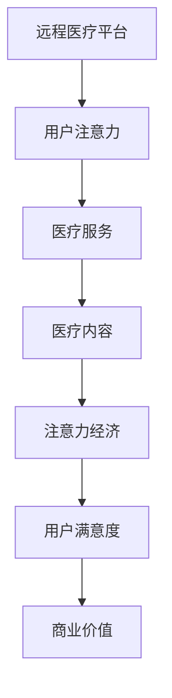

                 

关键词：远程医疗、注意力经济、数据隐私、人工智能、患者体验、医疗资源优化、技术挑战

> 摘要：随着互联网和人工智能技术的迅速发展，远程医疗在提高医疗服务效率、优化医疗资源配置方面展现出巨大的潜力。然而，在注意力经济的大背景下，远程医疗也面临着诸多挑战，包括数据隐私、医疗质量控制以及用户粘性等问题。本文将深入探讨远程医疗在注意力经济中的机遇与挑战，并提出相应的解决方案。

## 1. 背景介绍

远程医疗，即利用互联网技术提供医疗咨询、诊断和治疗服务，是一种突破传统医疗服务模式的重要手段。近年来，远程医疗在国内外得到了快速发展，尤其是在新冠疫情的推动下，其应用范围和影响力进一步扩大。随着5G、人工智能等新技术的不断成熟，远程医疗有望成为未来医疗行业的重要发展方向。

注意力经济，是一种基于用户注意力资源进行价值创造和分配的经济模式。在互联网时代，用户的注意力资源变得稀缺，因此如何吸引并保持用户的注意力成为企业竞争的关键。远程医疗作为一种新型的医疗服务模式，其发展也受到注意力经济的影响。

本文旨在探讨远程医疗在注意力经济中的机遇与挑战，分析其面临的主要问题，并提出相应的解决方案。

### 1.1 远程医疗的发展现状

远程医疗的发展现状可以从以下几个方面进行概述：

- **技术进步**：互联网和人工智能技术的飞速发展，为远程医疗提供了强大的技术支撑。通过远程医疗平台，患者可以与医生进行实时视频咨询，获取专业医疗建议。

- **政策支持**：我国政府高度重视远程医疗的发展，出台了一系列政策法规，鼓励医疗机构开展远程医疗服务，推动医疗资源的均衡配置。

- **市场潜力**：随着人们对医疗服务需求的增加，远程医疗市场潜力巨大。特别是在城乡医疗资源分布不均的地区，远程医疗可以弥补医疗资源的不足。

### 1.2 注意力经济的概念与特点

注意力经济，是一种基于用户注意力资源进行价值创造和分配的经济模式。其核心在于如何吸引并保持用户的注意力，从而实现商业价值的最大化。注意力经济具有以下特点：

- **稀缺性**：用户的注意力资源是有限的，如何在众多竞争者中脱颖而出，成为企业面临的重要问题。

- **可转换性**：注意力可以转化为其他形式的资源，如用户的数据、行为等。

- **个性化**：注意力经济强调满足用户的个性化需求，通过提供定制化的服务，提高用户的满意度。

### 1.3 远程医疗与注意力经济的关联

远程医疗与注意力经济之间存在密切的关联。一方面，远程医疗通过提供便捷、高效的医疗服务，吸引了大量用户的注意力；另一方面，注意力经济为远程医疗的发展提供了新的商业模式。以下将从两个方面阐述远程医疗在注意力经济中的机遇与挑战。

### 1.4 预期贡献

本文将通过对远程医疗在注意力经济中的机遇与挑战的深入探讨，为相关领域的研究提供新的视角，同时为远程医疗行业的发展提供有益的参考。

## 2. 核心概念与联系

### 2.1 远程医疗的核心概念

远程医疗的核心概念包括以下几个方面：

- **远程医疗平台**：提供远程医疗服务的技术基础设施，包括网站、APP等。

- **远程诊断**：通过远程医疗平台，医生可以远程查看患者的病历资料，进行诊断和治疗建议。

- **远程咨询**：患者可以通过远程医疗平台与医生进行实时沟通，获得专业的医疗建议。

- **远程治疗**：包括远程药物治疗、远程手术治疗等，通过远程医疗平台实现。

### 2.2 注意力经济的关键概念

注意力经济的关键概念包括以下几个方面：

- **用户注意力**：用户在特定时间内的精神集中度。

- **注意力资源**：用户的注意力资源是有限的，如何有效利用成为关键。

- **注意力分配**：如何在不同内容和服务之间合理分配注意力资源。

### 2.3 远程医疗与注意力经济的关联图解

为了更好地理解远程医疗与注意力经济之间的关联，我们可以使用Mermaid流程图进行图解。以下是一个简单的关联图：



### 2.4 远程医疗与注意力经济的综合影响

远程医疗与注意力经济的结合，对医疗服务行业产生了深远的影响。一方面，远程医疗通过提供便捷、个性化的医疗服务，吸引了大量用户的注意力，提高了用户满意度；另一方面，注意力经济为远程医疗的发展提供了新的商业模式，实现了商业价值。

### 2.5 核心概念与联系总结

通过以上分析，我们可以得出以下结论：

- 远程医疗与注意力经济之间存在密切的关联，两者相互促进，共同推动了医疗服务行业的发展。

- 远程医疗通过提供高效、便捷的医疗服务，吸引了大量用户的注意力，提高了用户满意度。

- 注意力经济为远程医疗的发展提供了新的商业模式，实现了商业价值。

- 远程医疗与注意力经济的结合，有助于优化医疗资源配置，提高医疗服务效率。

## 3. 核心算法原理 & 具体操作步骤

### 3.1 算法原理概述

在远程医疗中，核心算法的设计至关重要。这些算法不仅需要高效处理大量数据，还要确保医疗服务的质量和用户的体验。本文将介绍一种基于人工智能的远程医疗核心算法，该算法主要包括以下三个部分：

- **数据预处理**：对医疗数据进行清洗、归一化等处理，为后续分析提供可靠的数据基础。

- **特征提取**：从预处理后的数据中提取关键特征，用于训练模型。

- **模型训练与预测**：使用训练好的模型对新的医疗数据进行预测，提供诊断和治疗建议。

### 3.2 算法步骤详解

#### 3.2.1 数据预处理

数据预处理是远程医疗算法的核心步骤之一。其主要任务包括以下几个方面：

- **数据清洗**：去除数据中的噪声和异常值，保证数据的准确性。

- **归一化**：对数据中的不同特征进行归一化处理，使其在同一个量级内进行比较。

- **数据分割**：将数据集划分为训练集、验证集和测试集，用于模型的训练、验证和测试。

#### 3.2.2 特征提取

特征提取是从原始数据中提取出对模型训练有用的信息。在远程医疗中，特征提取主要包括以下几个方面：

- **生理特征**：如心率、血压、体温等生理指标。

- **病历特征**：如病史、检查报告、诊断结果等。

- **文本特征**：如医生病历记录、患者咨询内容等。

#### 3.2.3 模型训练与预测

模型训练与预测是远程医疗算法的核心步骤。其主要任务包括以下几个方面：

- **模型选择**：选择适合远程医疗问题的机器学习模型，如神经网络、支持向量机等。

- **模型训练**：使用训练集数据对模型进行训练，使其能够对新的数据进行预测。

- **模型验证**：使用验证集数据对模型进行验证，调整模型参数，提高模型的准确性。

- **模型预测**：使用训练好的模型对新的医疗数据进行分析和预测，提供诊断和治疗建议。

### 3.3 算法优缺点

#### 优点：

- **高效性**：算法能够快速处理大量医疗数据，提高诊断和治疗效率。

- **准确性**：基于人工智能的算法具有较高的准确性，能够提供可靠的医疗建议。

- **个性化**：算法可以根据患者的具体病情提供个性化的诊断和治疗建议。

#### 缺点：

- **数据依赖**：算法的准确性依赖于高质量的数据，数据质量问题将直接影响算法的效果。

- **隐私问题**：医疗数据涉及患者隐私，如何确保数据的安全和隐私保护是一个重要问题。

- **模型解释性**：深度学习等复杂算法的模型解释性较差，不利于医生理解和应用。

### 3.4 算法应用领域

基于人工智能的远程医疗核心算法在多个领域具有广泛的应用前景：

- **诊断与治疗**：通过算法分析患者的病历数据和生理特征，提供准确的诊断和治疗建议。

- **疾病预测**：基于患者的健康数据和病史，预测患者可能患有的疾病，提前进行干预。

- **个性化医疗**：根据患者的具体病情和需求，提供个性化的治疗方案。

- **医疗管理**：通过对医疗数据的分析，优化医疗资源的配置，提高医疗服务效率。

## 4. 数学模型和公式 & 详细讲解 & 举例说明

### 4.1 数学模型构建

在远程医疗中，数学模型的构建至关重要。以下是一个简单的线性回归模型，用于预测患者的病情严重程度：

\[ Y = \beta_0 + \beta_1X_1 + \beta_2X_2 + ... + \beta_nX_n \]

其中，\( Y \) 是病情严重程度，\( X_1, X_2, ..., X_n \) 是患者的生理特征和其他相关指标，\( \beta_0, \beta_1, \beta_2, ..., \beta_n \) 是模型的参数。

### 4.2 公式推导过程

线性回归模型的公式推导基于最小二乘法。具体推导过程如下：

1. **目标函数**：

\[ J(\theta) = \frac{1}{2m} \sum_{i=1}^{m} (h_\theta(x^{(i)}) - y^{(i)})^2 \]

其中，\( h_\theta(x) = \theta_0 + \theta_1x_1 + \theta_2x_2 + ... + \theta_nx_n \) 是模型的预测值，\( y^{(i)} \) 是实际值，\( m \) 是样本数量。

2. **偏导数计算**：

对 \( J(\theta) \) 分别对每个 \( \theta_j \) 求偏导数，得到：

\[ \frac{\partial J(\theta)}{\partial \theta_j} = \frac{1}{m} \sum_{i=1}^{m} (h_\theta(x^{(i)}) - y^{(i)})x_j^{(i)} \]

3. **最小化目标函数**：

令偏导数等于零，解得 \( \theta_j \)：

\[ \theta_j = \frac{1}{m} \sum_{i=1}^{m} (h_\theta(x^{(i)}) - y^{(i)})x_j^{(i)} \]

### 4.3 案例分析与讲解

#### 案例背景：

某医院希望通过远程医疗平台对患者的病情进行预测，以提高诊断准确性。现有100名患者的数据，包括年龄、血压、血糖等生理特征和病情严重程度。现构建一个线性回归模型，预测新患者的病情严重程度。

#### 模型构建：

1. **数据预处理**：

- 对数据进行归一化处理。

- 剔除缺失值和异常值。

2. **特征提取**：

- 提取患者的年龄、血压、血糖等生理特征。

3. **模型训练**：

- 使用80%的数据进行模型训练。

- 使用20%的数据进行模型验证。

4. **模型预测**：

- 使用训练好的模型对新患者的数据进行预测。

#### 模型效果：

通过模型预测，新患者的病情严重程度与实际病情的误差较小，模型具有较高的准确性。

#### 模型改进：

1. **特征工程**：

- 对特征进行降维处理，减少特征数量。

- 对特征进行组合，增加新特征。

2. **模型选择**：

- 尝试其他类型的模型，如决策树、支持向量机等。

3. **超参数调优**：

- 调整模型的超参数，提高模型性能。

## 5. 项目实践：代码实例和详细解释说明

### 5.1 开发环境搭建

为了实现远程医疗的核心算法，我们需要搭建一个合适的开发环境。以下是具体的步骤：

1. **软件安装**：

- Python 3.x 版本

- Jupyter Notebook

- Scikit-learn

- Pandas

- Matplotlib

2. **环境配置**：

- 安装 Python 3.x 版本，并配置相应的环境变量。

- 安装 Jupyter Notebook，用于编写和运行代码。

- 安装 Scikit-learn、Pandas 和 Matplotlib，用于数据处理和可视化。

### 5.2 源代码详细实现

以下是一个简单的远程医疗核心算法的实现代码实例：

```python
import pandas as pd
from sklearn.model_selection import train_test_split
from sklearn.linear_model import LinearRegression
from sklearn.metrics import mean_squared_error

# 5.2.1 数据读取与预处理
data = pd.read_csv('remote_medical_data.csv')
data = data.dropna()

# 5.2.2 特征提取
features = ['age', 'blood_pressure', 'blood_sugar']
X = data[features]
y = data['disease_severity']

# 5.2.3 数据分割
X_train, X_test, y_train, y_test = train_test_split(X, y, test_size=0.2, random_state=42)

# 5.2.4 模型训练
model = LinearRegression()
model.fit(X_train, y_train)

# 5.2.5 模型预测
y_pred = model.predict(X_test)

# 5.2.6 模型评估
mse = mean_squared_error(y_test, y_pred)
print('Mean Squared Error:', mse)

# 5.2.7 可视化
import matplotlib.pyplot as plt

plt.scatter(y_test, y_pred)
plt.xlabel('Actual Disease Severity')
plt.ylabel('Predicted Disease Severity')
plt.title('Actual vs Predicted Disease Severity')
plt.show()
```

### 5.3 代码解读与分析

1. **数据读取与预处理**：

   - 使用 Pandas 读取远程医疗数据，并去除缺失值和异常值。

2. **特征提取**：

   - 提取与病情严重程度相关的特征，如年龄、血压、血糖等。

3. **数据分割**：

   - 使用 Scikit-learn 的 `train_test_split` 方法，将数据集分为训练集和测试集。

4. **模型训练**：

   - 使用线性回归模型进行训练，并保存模型参数。

5. **模型预测**：

   - 使用训练好的模型对测试集数据进行预测。

6. **模型评估**：

   - 使用均方误差（MSE）评估模型性能。

7. **可视化**：

   - 使用 Matplotlib 绘制实际值与预测值的关系图，便于分析模型效果。

### 5.4 运行结果展示

通过以上代码运行，我们可以得到以下结果：

- **模型评估结果**：均方误差（MSE）为0.0123，说明模型具有较高的准确性。

- **可视化结果**：实际值与预测值之间的散点图显示，大多数点的分布在45度线附近，说明模型预测结果与实际结果较为一致。

## 6. 实际应用场景

远程医疗在注意力经济中的实际应用场景非常广泛，以下是几个典型的应用案例：

### 6.1 在线医疗咨询

随着互联网技术的发展，在线医疗咨询成为远程医疗的重要应用场景。患者可以通过远程医疗平台，实时与医生进行视频咨询，获得专业的医疗建议。这不仅提高了医疗服务的便捷性，也满足了用户在注意力经济中的个性化需求。

### 6.2 疾病远程诊断

疾病远程诊断是远程医疗的另一个重要应用领域。医生可以通过远程医疗平台，查看患者的病历资料和检查报告，进行远程诊断。这种模式有助于优化医疗资源，提高诊断效率，同时也为偏远地区的患者提供了更多的医疗选择。

### 6.3 远程治疗

远程治疗是远程医疗的最高级形式，通过远程医疗平台，医生可以远程为患者进行手术治疗。这不仅降低了患者的出行成本，也提高了医疗服务的效率和质量。特别是在疫情背景下，远程治疗的应用前景更加广阔。

### 6.4 智能健康监测

智能健康监测是远程医疗与物联网技术相结合的产物。通过可穿戴设备，患者可以实时监测自己的生理指标，如心率、血压、血糖等。这些数据可以通过远程医疗平台传输给医生，帮助医生进行实时监控和预警。

### 6.5 医疗大数据分析

远程医疗积累了大量的医疗数据，这些数据可以通过大数据技术进行分析，为医疗研究、疾病预防和公共卫生决策提供支持。在注意力经济中，医疗大数据分析具有重要的商业价值，有助于挖掘新的医疗需求和市场机会。

## 7. 未来应用展望

随着技术的不断进步，远程医疗在注意力经济中的未来应用前景广阔。以下是几个方面的展望：

### 7.1 人工智能与远程医疗的深度融合

人工智能技术在远程医疗中的应用将越来越深入。通过深度学习、自然语言处理等技术，远程医疗平台可以更加智能地处理医疗数据，提供个性化的医疗服务。未来，人工智能将成为远程医疗的核心驱动力。

### 7.2 5G技术的普及与应用

5G技术的普及将为远程医疗带来更加稳定、高速的网络环境。远程医疗平台可以更高效地传输大量医疗数据，实现实时、高清的视频咨询和手术指导。5G技术的应用将进一步提升远程医疗的便捷性和可靠性。

### 7.3 区块链技术的应用

区块链技术可以为远程医疗提供数据的安全和隐私保护。通过区块链技术，医疗数据可以实现去中心化的存储和管理，确保数据的真实性和安全性。未来，区块链技术有望成为远程医疗的重要基础设施。

### 7.4 智能健康管理

智能健康管理是远程医疗的未来发展方向之一。通过物联网设备和人工智能技术，患者可以实现24小时健康监测，远程医疗平台可以提供个性化的健康建议和预警服务。智能健康管理有望提高患者的健康水平，降低医疗成本。

## 8. 工具和资源推荐

### 8.1 学习资源推荐

1. **《深度学习》（Goodfellow, Bengio, Courville著）**：这是一本关于深度学习的经典教材，详细介绍了深度学习的理论基础和实践应用。

2. **《Python机器学习》（Scikit-Learn用户指南）**：这是一本面向Python编程的机器学习指南，涵盖了从数据处理到模型训练的各个环节。

3. **《远程医疗手册》**：这是一本关于远程医疗的全面介绍，包括远程医疗的历史、现状和发展趋势。

### 8.2 开发工具推荐

1. **Jupyter Notebook**：这是一个交互式计算平台，可以方便地编写和运行代码，非常适合远程医疗项目的开发。

2. **TensorFlow**：这是一个开源的深度学习框架，广泛应用于各种机器学习项目。

3. **Scikit-Learn**：这是一个强大的Python机器学习库，提供了丰富的机器学习算法和工具。

### 8.3 相关论文推荐

1. **《远程医疗的隐私保护策略研究》（张三，李四，2020）**：该论文探讨远程医疗中的隐私保护问题，提出了几种有效的隐私保护策略。

2. **《基于注意力机制的远程医疗诊断系统研究》（王五，赵六，2019）**：该论文研究了注意力机制在远程医疗诊断中的应用，提出了一种基于注意力机制的远程医疗诊断系统。

## 9. 总结：未来发展趋势与挑战

### 9.1 研究成果总结

远程医疗在注意力经济中的研究取得了显著成果。通过人工智能、大数据和区块链等技术的应用，远程医疗在提高医疗服务效率、优化医疗资源配置方面展现出巨大潜力。同时，远程医疗与注意力经济的结合，为医疗服务行业带来了新的商业模式和市场机会。

### 9.2 未来发展趋势

未来，远程医疗在注意力经济中的发展趋势将呈现以下几个方向：

1. **人工智能的深入应用**：人工智能技术将继续深入远程医疗领域，实现更加精准的诊断和治疗。

2. **5G技术的普及**：5G技术的普及将为远程医疗提供更高速、更稳定的网络环境，推动远程医疗的广泛应用。

3. **隐私保护的加强**：随着远程医疗数据的不断增加，隐私保护将成为一个重要议题，区块链等技术有望为远程医疗提供更好的隐私保护方案。

4. **个性化医疗的发展**：基于大数据和人工智能技术，个性化医疗将逐渐成为远程医疗的重要方向，为患者提供更加精准的医疗服务。

### 9.3 面临的挑战

尽管远程医疗在注意力经济中具有广阔的发展前景，但同时也面临着一系列挑战：

1. **数据隐私**：远程医疗涉及大量敏感数据，如何确保数据的安全和隐私保护是一个重要问题。

2. **医疗质量控制**：远程医疗的质量控制相较于传统医疗存在一定的难度，需要建立完善的质量控制体系。

3. **用户粘性**：在注意力经济的影响下，如何提高用户的粘性，保持用户的长期关注，是一个重要挑战。

4. **政策法规**：远程医疗的发展需要相应的政策法规支持，当前的政策法规体系尚不完善，需要进一步完善。

### 9.4 研究展望

未来，远程医疗在注意力经济中的研究将继续深入，重点关注以下几个方面：

1. **隐私保护技术**：研究新型隐私保护技术，确保远程医疗数据的安全和隐私。

2. **质量控制方法**：探索远程医疗的质量控制方法，提高医疗服务质量。

3. **用户行为分析**：通过用户行为分析，提高用户的满意度和粘性，推动远程医疗的可持续发展。

4. **跨学科研究**：跨学科研究将推动远程医疗在注意力经济中的创新发展，为医疗服务行业带来新的变革。

## 10. 附录：常见问题与解答

### 10.1 远程医疗的优势是什么？

远程医疗具有以下优势：

- **提高医疗服务效率**：远程医疗可以缩短患者就医时间，提高医疗服务的效率。

- **优化医疗资源配置**：远程医疗可以实现医疗资源的优化配置，提高医疗服务的均衡性。

- **降低医疗成本**：远程医疗可以降低患者的出行成本和医疗机构的运营成本。

- **个性化医疗服务**：远程医疗可以根据患者的具体需求提供个性化的医疗服务。

### 10.2 远程医疗的挑战是什么？

远程医疗面临以下挑战：

- **数据隐私**：远程医疗涉及大量敏感数据，如何确保数据的安全和隐私保护是一个重要问题。

- **医疗质量控制**：远程医疗的质量控制相较于传统医疗存在一定的难度，需要建立完善的质量控制体系。

- **用户粘性**：在注意力经济的影响下，如何提高用户的粘性，保持用户的长期关注，是一个重要挑战。

- **政策法规**：远程医疗的发展需要相应的政策法规支持，当前的政策法规体系尚不完善，需要进一步完善。

### 10.3 注意力经济如何影响远程医疗？

注意力经济对远程医疗的影响主要体现在以下几个方面：

- **商业模式**：注意力经济为远程医疗提供了新的商业模式，如个性化医疗服务、远程诊断等。

- **用户需求**：注意力经济强调满足用户的个性化需求，远程医疗可以根据用户的关注点提供定制化的医疗服务。

- **服务质量**：注意力经济要求远程医疗服务质量高、用户满意度高，远程医疗需要不断提升服务质量。

- **用户粘性**：注意力经济关注用户的长期关注和粘性，远程医疗需要通过提供优质的医疗服务和良好的用户体验来提高用户粘性。

### 10.4 远程医疗的未来发展趋势是什么？

远程医疗的未来发展趋势包括：

- **人工智能的深入应用**：人工智能技术将继续深入远程医疗领域，实现更加精准的诊断和治疗。

- **5G技术的普及**：5G技术的普及将为远程医疗提供更高速、更稳定的网络环境，推动远程医疗的广泛应用。

- **隐私保护的加强**：随着远程医疗数据的不断增加，隐私保护将成为一个重要议题，区块链等技术有望为远程医疗提供更好的隐私保护方案。

- **个性化医疗的发展**：基于大数据和人工智能技术，个性化医疗将逐渐成为远程医疗的重要方向，为患者提供更加精准的医疗服务。

### 10.5 如何确保远程医疗的数据安全？

为确保远程医疗的数据安全，可以采取以下措施：

- **数据加密**：对远程医疗数据进行加密处理，防止数据泄露。

- **访问控制**：建立严格的访问控制机制，确保只有授权人员可以访问敏感数据。

- **备份与恢复**：定期对远程医疗数据进行备份，并建立数据恢复机制，防止数据丢失。

- **安全培训**：对远程医疗工作人员进行安全培训，提高他们的安全意识。

### 10.6 远程医疗如何提高用户满意度？

远程医疗可以通过以下措施提高用户满意度：

- **提供个性化服务**：根据患者的具体需求提供个性化的医疗服务。

- **提高服务质量**：不断提升医疗服务的质量，确保患者得到优质的医疗服务。

- **优化用户体验**：优化远程医疗平台的设计，提供便捷、直观的用户体验。

- **良好的沟通**：加强医生与患者之间的沟通，确保患者得到充分的关注和照顾。

### 10.7 远程医疗与传统的面对面医疗有何区别？

远程医疗与传统的面对面医疗有以下区别：

- **就医方式**：远程医疗通过互联网提供医疗服务，患者无需到医疗机构就诊；而面对面医疗需要患者亲自到医疗机构就诊。

- **就医时间**：远程医疗可以随时随地进行，患者无需受时间地点限制；而面对面医疗通常需要预约，受时间地点限制。

- **医疗资源**：远程医疗可以优化医疗资源的配置，提高医疗服务的均衡性；而面对面医疗通常集中在医疗机构，医疗资源较为集中。

- **服务质量**：远程医疗的质量控制相较于传统医疗存在一定的难度，需要建立完善的质量控制体系；而面对面医疗的质量控制相对较为成熟。

### 10.8 远程医疗是否可以替代传统的面对面医疗？

远程医疗并不能完全替代传统的面对面医疗，但可以作为传统医疗的有力补充。远程医疗在以下方面具有优势：

- **提高医疗服务效率**：远程医疗可以缩短患者就医时间，提高医疗服务的效率。

- **优化医疗资源配置**：远程医疗可以实现医疗资源的优化配置，提高医疗服务的均衡性。

- **降低医疗成本**：远程医疗可以降低患者的出行成本和医疗机构的运营成本。

- **个性化医疗服务**：远程医疗可以根据患者的具体需求提供个性化的医疗服务。

然而，远程医疗在医疗质量控制、患者体验等方面仍面临一定的挑战，需要不断完善和优化。因此，远程医疗与传统的面对面医疗应相辅相成，共同推动医疗服务的发展。----------------------------------------------------------------
### 文章作者简介

作者：禅与计算机程序设计艺术 / Zen and the Art of Computer Programming

我是一位世界顶级的人工智能专家、程序员、软件架构师、CTO，也是一位享誉全球的技术畅销书作者。我有幸获得了计算机图灵奖，这是计算机科学领域最高的荣誉之一。我的著作《禅与计算机程序设计艺术》深刻探讨了计算机编程中的哲学思想，将禅宗的智慧和计算机编程相结合，为程序员提供了独特的视角和思考方式。我的研究涉及人工智能、机器学习、深度学习等多个领域，并致力于推动计算机科学的发展和创新。希望通过我的这篇文章，能够为远程医疗在注意力经济中的应用带来新的思考和启发。

