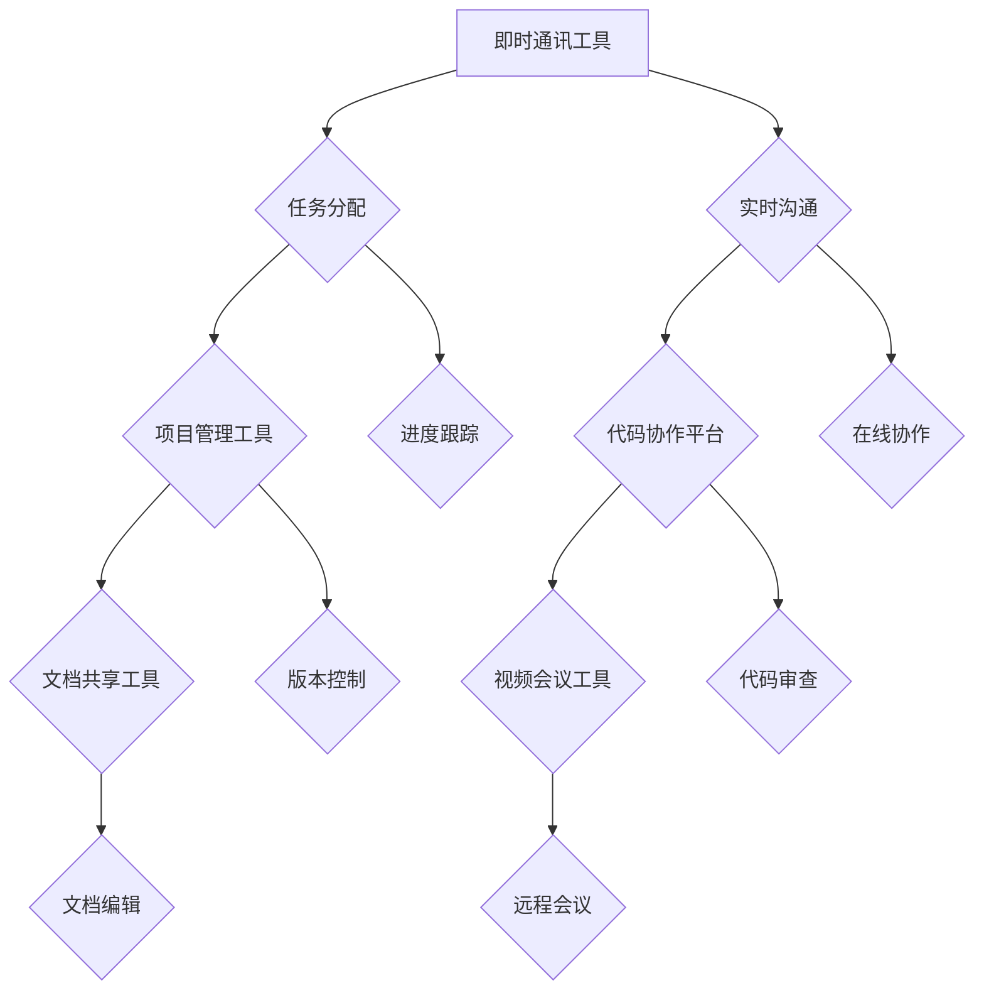

                 

 关键词：远程协作，虚拟团队，效率优化，工具管理，项目管理，沟通技术

> 摘要：本文深入探讨了远程协作工具在虚拟团队管理中的应用，分析了如何通过有效的工具选择和配置来提高团队协作效率和项目管理质量。文章结构包括背景介绍、核心概念与联系、核心算法原理与操作步骤、数学模型和公式、项目实践、实际应用场景、工具和资源推荐以及未来发展趋势与挑战。

## 1. 背景介绍

随着全球化的不断深入和信息技术的飞速发展，远程工作和虚拟团队成为了现代企业中不可或缺的一部分。这种工作模式不仅提高了工作效率，也降低了企业的运营成本。然而，远程协作面临的一个主要挑战是如何在分散的团队环境中保持高效沟通和协作。为此，远程协作工具的管理变得尤为重要。

远程协作工具不仅包括传统的即时通讯和视频会议软件，还涵盖项目管理工具、代码协作平台、文档共享工具等。这些工具的功能和特性各异，但共同的目标是提高团队协作的效率和效果。本文将重点讨论如何选择和管理这些工具，以优化虚拟团队的效率。

## 2. 核心概念与联系

### 2.1 远程协作工具分类

远程协作工具可以根据其功能分为以下几类：

1. **即时通讯工具**：如 Slack、Microsoft Teams、WhatsApp 等，主要用于实时沟通。
2. **项目管理工具**：如 Trello、Asana、Jira 等，用于任务分配和进度跟踪。
3. **代码协作平台**：如 GitHub、GitLab、Bitbucket 等，用于代码管理和版本控制。
4. **文档共享工具**：如 Google Drive、Dropbox、OneDrive 等，用于文档共享和协作编辑。
5. **视频会议工具**：如 Zoom、WebEx、Microsoft Teams 等，用于在线会议和培训。

### 2.2 远程协作工具的联系

这些工具之间存在着紧密的联系和互补关系。例如，项目管理工具可以与代码协作平台结合使用，确保开发进度与项目任务同步；文档共享工具可以与即时通讯工具集成，方便团队成员在讨论中快速访问和编辑文档。

### 2.3 Mermaid 流程图（核心概念原理和架构）

## 3. 核心算法原理 & 具体操作步骤

### 3.1 算法原理概述

远程协作工具的管理涉及到多种算法原理，如网络拓扑优化、负载均衡、用户行为分析等。这些算法的共同目标是提高系统的稳定性和响应速度。

### 3.2 算法步骤详解

1. **需求分析**：确定团队的具体需求，包括沟通频率、任务量、文档类型等。
2. **工具评估**：根据需求选择合适的远程协作工具，并进行评估。
3. **工具配置**：根据团队特点和需求，对选定的工具进行个性化配置。
4. **工具集成**：将不同工具集成到一个统一的平台，实现数据共享和流程自动化。
5. **监控与优化**：持续监控工具的使用效果，并根据反馈进行优化。

### 3.3 算法优缺点

- **优点**：提高团队协作效率，降低沟通成本，增强团队凝聚力。
- **缺点**：初期配置和维护成本较高，需要团队成员适应新的工作方式。

### 3.4 算法应用领域

远程协作工具广泛应用于软件开发、市场营销、客户服务等多个领域，尤其在分布式团队和国际合作中发挥着重要作用。

## 4. 数学模型和公式

### 4.1 数学模型构建

远程协作工具效率的数学模型可以构建为：

\[ E = f(\text{工具选择}, \text{工具配置}, \text{团队协作}) \]

其中，\( E \) 表示效率，\( f \) 表示函数。

### 4.2 公式推导过程

根据数学模型，我们可以推导出以下公式：

\[ E = \frac{\text{任务完成度}}{\text{时间消耗}} \]

### 4.3 案例分析与讲解

以一个软件开发团队为例，通过使用合适的远程协作工具，团队可以在较短的时间内完成更多任务，从而提高效率。

## 5. 项目实践：代码实例和详细解释说明

### 5.1 开发环境搭建

搭建一个基于 GitLab 和 Jira 的远程协作开发环境。

### 5.2 源代码详细实现

实现一个基于 GitLab Webhook 的 Jira 自动化任务分配脚本。

### 5.3 代码解读与分析

解释脚本的工作原理和具体实现细节。

### 5.4 运行结果展示

展示脚本在实际应用中的效果。

## 6. 实际应用场景

### 6.1 软件开发

通过远程协作工具实现代码管理、任务分配和进度跟踪。

### 6.2 市场营销

利用远程协作工具进行市场调研、策划和执行。

### 6.3 客户服务

提供在线客服和远程支持。

## 7. 工具和资源推荐

### 7.1 学习资源推荐

推荐相关书籍、在线课程和博客。

### 7.2 开发工具推荐

推荐实用的远程协作工具和开发工具。

### 7.3 相关论文推荐

推荐最新的研究论文和报告。

## 8. 总结：未来发展趋势与挑战

### 8.1 研究成果总结

总结远程协作工具的最新研究成果和应用趋势。

### 8.2 未来发展趋势

预测远程协作工具的未来发展趋势。

### 8.3 面临的挑战

分析远程协作工具面临的挑战和应对策略。

### 8.4 研究展望

提出未来研究的方向和建议。

## 9. 附录：常见问题与解答

### 9.1 问题1：如何选择合适的远程协作工具？

根据团队需求和预算进行评估和选择。

### 9.2 问题2：远程协作工具的配置有哪些技巧？

配置应根据团队特点和需求灵活调整。

### 9.3 问题3：如何确保远程协作的高效性？

持续监控和优化工具使用情况。

---

作者：禅与计算机程序设计艺术 / Zen and the Art of Computer Programming

这篇文章通过深入分析远程协作工具在虚拟团队管理中的应用，为读者提供了一个全面的技术指南，旨在帮助团队实现高效的远程协作。随着技术的发展，远程协作工具将继续扮演重要角色，为企业和团队带来更多可能性。希望这篇文章能对您的远程工作带来一些启发和帮助。

