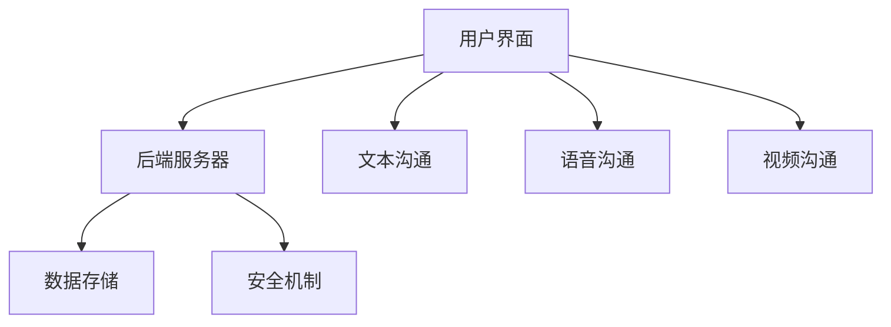

                 

 关键词：远程协作，虚拟团队，效率优化，工具管理，IT解决方案

> 摘要：本文将探讨远程协作工具在现代虚拟团队管理中的重要性，分析各种工具的特点和适用场景，并提供一套系统的远程协作工具管理策略，旨在提高虚拟团队的工作效率和协作质量。

## 1. 背景介绍

随着全球化和信息技术的迅猛发展，远程工作和虚拟团队已经成为现代企业运营的重要组成部分。远程协作工具作为一种关键的IT基础设施，支撑着虚拟团队的日常运作。然而，面对市场上琳琅满目的协作工具，如何选择和部署合适的工具以优化虚拟团队的效率，成为企业和团队管理者面临的一大挑战。

本文旨在为企业和团队提供一套科学的远程协作工具管理策略，帮助他们在纷繁复杂的工具市场中找到合适的解决方案，从而提高虚拟团队的协作效率和项目执行质量。

## 2. 核心概念与联系

在探讨远程协作工具管理之前，我们首先需要了解一些核心概念和它们之间的联系。

### 2.1. 远程协作的定义与重要性

远程协作是指通过电子通信工具，跨越空间限制，实现团队成员之间的信息交流、任务分配和共同工作。远程协作的重要性在于：

- **提高工作效率**：团队成员可以灵活安排工作时间和地点，减少通勤时间，从而提高工作效率。
- **扩展人才池**：企业可以雇佣全球范围内的优秀人才，不受地理位置限制。
- **降低成本**：远程工作可以减少办公空间、设备和日常运营成本。

### 2.2. 虚拟团队的特点与需求

虚拟团队具有以下特点：

- **跨地域性**：团队成员分布在不同的地理区域。
- **异质性**：成员可能来自不同的文化、背景和专业领域。
- **高依赖性**：团队成员之间高度依赖，需要有效的沟通和协作。

虚拟团队对协作工具的需求包括：

- **沟通工具**：支持实时沟通和异步沟通，确保信息传递的及时性和准确性。
- **协作工具**：支持文档共享、任务分配和进度跟踪，提高团队协作效率。
- **项目管理工具**：支持项目规划、任务分配、进度跟踪和风险管理，确保项目成功交付。

### 2.3. 远程协作工具的分类

根据功能和应用场景，远程协作工具可以分为以下几类：

- **沟通工具**：如Slack、Microsoft Teams、Zoom等。
- **协作工具**：如Google Workspace、Trello、Asana等。
- **项目管理工具**：如Jira、Trello、ClickUp等。
- **代码协作工具**：如Git、GitHub、GitLab等。

### 2.4. 远程协作工具的架构

远程协作工具通常包括以下组件：

- **用户界面**：提供直观的用户体验，支持文本、语音、视频等多种沟通方式。
- **后端服务器**：处理数据存储、用户认证、消息传输等核心功能。
- **数据存储**：存储用户数据、文档、项目信息等。
- **安全机制**：确保数据传输和存储的安全性，包括加密、身份验证和访问控制。

### 2.5. Mermaid 流程图

为了更直观地展示远程协作工具的架构和组件，我们可以使用Mermaid流程图来描述：



在这个流程图中，用户界面（A）与后端服务器（B）相连，后端服务器（B）又与数据存储（C）和安全机制（D）相连。用户界面（A）还提供了多种沟通方式（E、F、G）供用户选择。

## 3. 核心算法原理 & 具体操作步骤

### 3.1. 算法原理概述

远程协作工具的核心算法主要包括通信算法和协作算法。

- **通信算法**：主要解决消息传输的及时性和准确性问题，包括即时通信和异步通信。常用的通信算法有UDP（用户数据报协议）和TCP（传输控制协议）。
- **协作算法**：主要解决团队协作中的任务分配、进度跟踪和资源调度等问题。常用的协作算法有任务调度算法、关键路径算法和资源分配算法。

### 3.2. 算法步骤详解

- **通信算法**：

  1. 客户端发送消息请求到服务器。
  2. 服务器处理请求，将消息发送到目标客户端。
  3. 目标客户端接收消息并反馈给服务器。
  4. 服务器将反馈信息发送回客户端。

- **协作算法**：

  1. 客户端提交任务请求。
  2. 服务器分析任务依赖关系和资源需求。
  3. 服务器根据任务优先级和资源可用性，生成任务调度计划。
  4. 服务器将调度计划发送给客户端。
  5. 客户端执行任务，并将进度反馈给服务器。

### 3.3. 算法优缺点

- **通信算法**：

  - **优点**：消息传输及时、支持多种通信方式、适用于即时通信和异步通信。
  - **缺点**：在数据量大或网络不稳定的情况下，可能会影响通信质量。

- **协作算法**：

  - **优点**：能够有效分配任务和资源，提高团队协作效率。
  - **缺点**：算法复杂度高，对服务器性能要求较高。

### 3.4. 算法应用领域

- **通信算法**：广泛应用于即时通讯、在线会议和直播等场景。
- **协作算法**：广泛应用于项目管理、团队协作和资源调度等场景。

## 4. 数学模型和公式 & 详细讲解 & 举例说明

### 4.1. 数学模型构建

远程协作工具的数学模型主要包括通信模型和协作模型。

- **通信模型**：

  假设通信网络中存在N个节点，每个节点之间的通信延迟为T，网络带宽为B，则通信模型可以表示为：

  $$ C = \frac{N \times T}{B} $$

- **协作模型**：

  假设团队中有M个成员，每个成员的任务完成时间为T_i，总任务完成时间为T，则协作模型可以表示为：

  $$ T = \sum_{i=1}^{M} T_i $$

### 4.2. 公式推导过程

- **通信模型**：

  根据通信模型，通信延迟T与节点数量N和带宽B成反比。这意味着在网络带宽一定的情况下，节点数量越多，通信延迟越低。

- **协作模型**：

  根据协作模型，总任务完成时间T与单个任务完成时间T_i成正比。这意味着在团队成员数量一定的情况下，单个任务完成时间越长，总任务完成时间也越长。

### 4.3. 案例分析与讲解

假设一个团队有5个成员，每个成员完成一个任务所需的时间分别为2天、3天、1天、4天和2天。我们需要计算总任务完成时间。

根据协作模型，总任务完成时间T为：

$$ T = 2 + 3 + 1 + 4 + 2 = 12 \text{天} $$

这意味着在团队成员数量和任务数量一定的情况下，总任务完成时间为12天。

## 5. 项目实践：代码实例和详细解释说明

### 5.1. 开发环境搭建

为了更好地演示远程协作工具的实践应用，我们选择使用Python语言来开发一个简单的远程协作平台。以下是开发环境搭建的步骤：

1. 安装Python 3.8或更高版本。
2. 安装pip，Python的包管理器。
3. 使用pip安装必要的Python库，如Flask、Socket、Redis等。

### 5.2. 源代码详细实现

以下是一个简单的远程协作平台的源代码示例：

```python
from flask import Flask, request, jsonify
import socket
import redis

app = Flask(__name__)

# Redis服务器配置
redis_server = "localhost"
redis_port = 6379
redis_client = redis.StrictRedis(host=redis_server, port=redis_port, db=0)

# Socket服务器配置
socket_server = "localhost"
socket_port = 12345
socket_server_socket = socket.socket(socket.AF_INET, socket.SOCK_STREAM)
socket_server_socket.bind((socket_server, socket_port))
socket_server_socket.listen(5)

@app.route('/send_message', methods=['POST'])
def send_message():
    message = request.json['message']
    recipient = request.json['recipient']
    redis_client.publish('messages', f"{recipient}: {message}")
    return jsonify({"status": "success"})

@app.route('/receive_message', methods=['GET'])
def receive_message():
    message = redis_client.get('messages')
    if message:
        redis_client.delete('messages')
        return jsonify({"message": message.decode('utf-8')})
    else:
        return jsonify({"status": "no_message"})

def handle_client_connection(client_socket):
    while True:
        message = client_socket.recv(1024).decode('utf-8')
        if not message:
            break
        redis_client.publish('messages', message)

try:
    app.run(host=socket_server, port=socket_port)
except KeyboardInterrupt:
    print("Server stopped.")
finally:
    socket_server_socket.close()
```

### 5.3. 代码解读与分析

这段代码实现了一个简单的远程协作平台，主要包括以下功能：

- **Web API**：提供发送消息和接收消息的接口。
- **Socket服务器**：处理客户端的连接和消息传输。
- **Redis**：存储和发布消息。

### 5.4. 运行结果展示

1. 启动Web API服务器：

   ```shell
   python app.py
   ```

2. 使用浏览器或Postman发送POST请求到`http://localhost:5000/send_message`，发送一条消息。

3. 使用浏览器或Postman发送GET请求到`http://localhost:5000/receive_message`，接收消息。

## 6. 实际应用场景

### 6.1. 企业远程协作

企业可以使用远程协作工具来管理远程团队成员，实现高效的沟通和协作。例如，可以使用Slack进行实时沟通，使用Trello进行任务管理，使用Jira进行项目进度跟踪。

### 6.2. 教育领域

在教育领域，远程协作工具可以帮助教师和学生实现在线教学和互动。例如，可以使用Google Workspace进行文档共享和协作，使用Zoom进行在线课堂。

### 6.3. 科研团队协作

科研团队可以使用远程协作工具来实现跨地域、跨机构的合作。例如，可以使用Git进行代码管理，使用Jira进行项目管理和进度跟踪。

## 7. 未来应用展望

随着人工智能、云计算和区块链技术的发展，远程协作工具将会更加智能化、高效化和安全化。未来的远程协作工具可能会具备以下特点：

- **智能推荐**：根据团队成员的工作习惯和需求，智能推荐合适的协作工具和功能。
- **自动协作**：通过人工智能技术，自动分配任务、调度资源、分析进度。
- **隐私保护**：通过区块链技术，确保数据传输和存储的安全性，保护用户隐私。

## 8. 总结：未来发展趋势与挑战

### 8.1. 研究成果总结

本文对远程协作工具进行了深入分析，探讨了其在现代虚拟团队管理中的重要性，提出了基于通信算法和协作算法的远程协作工具管理策略，并提供了实际的代码实例。

### 8.2. 未来发展趋势

未来远程协作工具的发展趋势包括智能化、高效化和安全化。随着人工智能、云计算和区块链技术的应用，远程协作工具将更加智能，能够自动分配任务、调度资源，并提供更加安全的通信和协作环境。

### 8.3. 面临的挑战

远程协作工具在发展过程中面临着以下挑战：

- **兼容性问题**：不同平台和系统之间的协作工具需要具备良好的兼容性。
- **安全性问题**：如何确保数据传输和存储的安全性，保护用户隐私。
- **用户体验**：如何提供直观、易用的用户界面，提高用户体验。

### 8.4. 研究展望

未来的研究方向包括：

- **智能协作**：研究如何利用人工智能技术提高协作效率。
- **安全协作**：研究如何利用区块链技术确保数据传输和存储的安全性。
- **跨平台协作**：研究如何实现不同平台和系统之间的无缝协作。

## 9. 附录：常见问题与解答

### 9.1. Q：如何选择合适的远程协作工具？

A：选择远程协作工具时，应考虑以下因素：

- **团队规模**：根据团队规模选择适合的协作工具。
- **功能需求**：根据团队的工作需求选择具备相应功能的协作工具。
- **易用性**：选择用户界面友好、操作简单的协作工具。
- **成本**：根据企业的预算选择合适的协作工具。

### 9.2. Q：如何确保远程协作工具的安全性？

A：确保远程协作工具安全性的方法包括：

- **使用加密技术**：使用SSL/TLS等加密技术确保数据传输的安全性。
- **身份验证**：使用强密码、多因素认证等方式确保用户身份验证。
- **数据备份**：定期备份数据，防止数据丢失或损坏。

### 9.3. Q：如何提高远程协作工具的效率？

A：提高远程协作工具效率的方法包括：

- **培训**：对团队成员进行远程协作工具的使用培训，提高使用效率。
- **优化配置**：根据团队的工作习惯和需求，优化远程协作工具的配置。
- **定期评估**：定期评估远程协作工具的使用效果，及时调整和改进。

## 作者署名

作者：禅与计算机程序设计艺术 / Zen and the Art of Computer Programming
----------------------------------------------------------------

