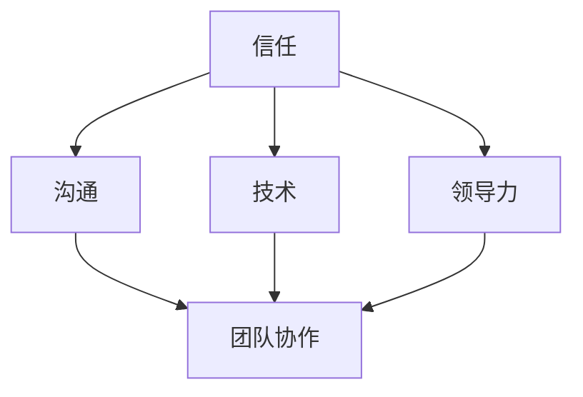
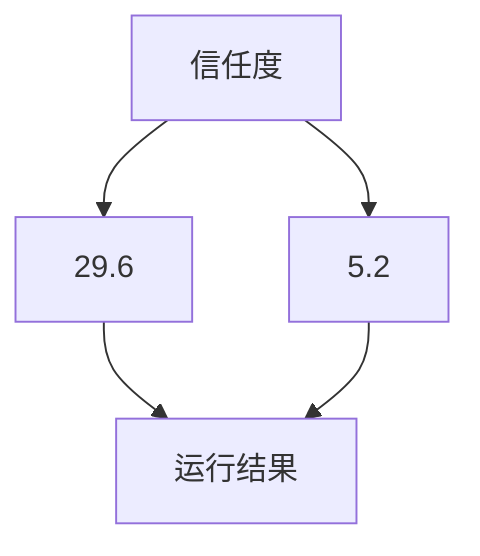

                 

在当今数字化时代，远程工作的普及已经成为了一种不可避免的趋势。无论是因全球疫情导致的办公模式转变，还是企业为了提高员工灵活性和效率而主动采取的决策，远程团队管理已经成为了企业运营中不可或缺的一部分。然而，与传统的面对面管理相比，远程团队管理面临着许多独特的挑战。本文将探讨在数字时代如何进行有效的远程团队管理，并提出一种新型领导力模式。

> 关键词：远程团队管理、数字化领导力、团队协作、虚拟团队、领导艺术

> 摘要：本文首先介绍了远程团队管理的背景和重要性，随后详细分析了数字化时代远程团队管理面临的挑战。接着，文章提出了一个基于信任、沟通和技术的远程团队管理框架，探讨了新型领导力的关键要素。最后，文章展望了远程团队管理的未来趋势和面临的挑战。

## 1. 背景介绍

远程团队管理的兴起并非偶然，而是科技发展和企业需求共同推动的结果。随着互联网和通信技术的飞速发展，人们可以在世界的任何角落进行高效的工作。这种工作方式的灵活性不仅提高了员工的工作效率，也使企业能够吸引全球范围内的人才。然而，远程团队管理也带来了新的挑战，例如沟通障碍、团队凝聚力的缺失以及工作监督的困难。

传统的团队管理依赖于面对面的交流，管理者可以通过非语言信号和即时反馈来了解团队的状态。而在远程团队中，这些传统的管理手段往往无法发挥作用，需要寻找新的方法来保持团队的协调和高效运作。

## 2. 核心概念与联系

为了更好地理解远程团队管理，我们需要明确几个核心概念，并分析它们之间的联系。

### 2.1 信任

信任是远程团队管理的基石。在一个远程团队中，团队成员之间缺乏面对面的互动，容易产生隔阂和不信任。因此，建立信任关系至关重要。这可以通过透明的沟通、明确的目标和相互尊重来实现。

### 2.2 沟通

沟通是远程团队管理中的关键环节。有效的沟通不仅能够传递信息，还能够建立团队关系和促进协作。远程团队需要依赖各种沟通工具，如邮件、即时通讯和视频会议，来保持团队内部的交流。

### 2.3 技术

技术是远程团队管理的重要支撑。现代化的协作工具，如项目管理软件、版本控制系统和虚拟办公环境，能够极大地提高团队的工作效率。同时，技术还能够提供数据支持和分析，帮助管理者更好地监控团队状态。

### 2.4 领导力

领导力是远程团队管理中不可或缺的因素。远程团队需要领导者的引导和激励，以确保团队成员朝着共同的目标前进。领导力在远程团队管理中的作用体现在激励、指导和协调等方面。

### 2.5 团队协作

团队协作是远程团队管理的核心目标。通过协作，团队成员能够共同解决问题，提高工作效率，并实现团队目标。远程团队需要建立明确的角色分工和协作流程，以确保团队成员能够高效地合作。

### 2.6 Mermaid 流程图

以下是远程团队管理核心概念和联系的一个简化 Mermaid 流程图：



## 3. 核心算法原理 & 具体操作步骤

### 3.1 算法原理概述

远程团队管理的核心算法原理可以概括为以下几点：

1. **信任建设**：通过透明沟通和共同目标来建立信任。
2. **有效沟通**：利用现代化沟通工具，提高信息传递效率和团队关系。
3. **技术赋能**：使用协作工具和数据分析，提高团队效率和决策质量。
4. **领导激励**：通过激励和指导，确保团队成员积极投入工作。
5. **协作优化**：建立明确的角色分工和协作流程，提高团队协作效率。

### 3.2 算法步骤详解

#### 3.2.1 建立信任

- **透明沟通**：定期召开团队会议，分享工作进展和团队动态。
- **共同目标**：明确团队目标和每个人的职责，确保团队成员朝着共同的方向努力。
- **相互尊重**：尊重每个成员的意见和贡献，鼓励开放和诚实的沟通。

#### 3.2.2 有效沟通

- **选择合适工具**：根据团队需求选择合适的沟通工具，如即时通讯、邮件和视频会议。
- **明确信息**：确保沟通内容明确、简洁，避免产生误解。
- **及时反馈**：鼓励团队成员及时给予反馈，以便及时调整工作方向。

#### 3.2.3 技术赋能

- **协作工具**：使用项目管理软件和版本控制系统，提高团队协作效率。
- **数据分析**：定期分析团队数据，了解团队状态和存在的问题。
- **技术培训**：为团队成员提供技术培训，确保他们能够熟练使用协作工具。

#### 3.2.4 领导激励

- **激励措施**：制定合理的激励措施，如奖金、晋升机会等，激发团队成员的积极性。
- **指导与支持**：为团队成员提供指导和支持，帮助他们解决工作中的问题。
- **鼓励创新**：鼓励团队成员提出创新想法，并给予支持和反馈。

#### 3.2.5 协作优化

- **角色分工**：明确每个团队成员的角色和职责，确保工作有序进行。
- **协作流程**：建立明确的协作流程，确保团队成员能够高效地合作。
- **反馈与改进**：定期收集团队成员的反馈，不断优化协作流程。

### 3.3 算法优缺点

#### 优点

- **提高效率**：通过有效的沟通和协作，团队成员能够更快地解决问题，提高工作效率。
- **增强灵活性**：远程工作使团队成员可以更灵活地安排工作时间，提高工作满意度。
- **降低成本**：减少办公场所和设备的投入，降低企业的运营成本。

#### 缺点

- **沟通障碍**：远程团队容易产生沟通障碍，影响团队协作效率。
- **管理难度**：远程团队管理需要更多的技术支持和时间投入，管理难度较大。
- **团队凝聚力**：远程团队可能缺乏面对面的互动，影响团队凝聚力。

### 3.4 算法应用领域

- **软件开发**：远程团队管理在软件开发项目中尤为重要，可以确保团队成员之间的协作和沟通。
- **市场营销**：市场营销团队可以通过远程协作，更灵活地应对市场变化。
- **客户服务**：客户服务团队可以通过远程协作，提供更加灵活和高效的服务。

## 4. 数学模型和公式 & 详细讲解 & 举例说明

### 4.1 数学模型构建

在远程团队管理中，我们可以构建一个简单的数学模型来衡量团队效率和团队凝聚力。这个模型基于以下几个变量：

- \( E \)：团队成员的工作效率
- \( C \)：团队凝聚力
- \( T \)：团队成员之间的信任度

我们的目标是最大化团队效率和团队凝聚力，同时确保团队成员之间的信任度。因此，我们可以构建以下数学模型：

\[ \max (E, C) \]

其中，\( E \) 和 \( C \) 的关系可以用以下公式表示：

\[ E = f(T) \]
\[ C = g(T) \]

其中，\( f(T) \) 和 \( g(T) \) 是关于信任度 \( T \) 的函数，表示工作效率和团队凝聚力与信任度之间的关系。

### 4.2 公式推导过程

为了推导 \( f(T) \) 和 \( g(T) \) 的具体形式，我们需要分析远程团队管理中的几个关键因素。

#### 工作效率 \( E \)

工作效率 \( E \) 受到团队成员的沟通效率、协作能力和工作环境的影响。我们可以假设这些因素与信任度 \( T \) 的关系如下：

\[ E = k_1 \cdot \frac{1}{(1 - T)} + k_2 \cdot T + k_3 \]

其中，\( k_1 \)、\( k_2 \) 和 \( k_3 \) 是正常数，分别表示沟通效率、协作能力和工作环境对工作效率的影响。

#### 团队凝聚力 \( C \)

团队凝聚力 \( C \) 受到团队成员之间的信任、互动和工作目标的共同性影响。我们可以假设这些因素与信任度 \( T \) 的关系如下：

\[ C = k_4 \cdot (1 - T) + k_5 \cdot T + k_6 \]

其中，\( k_4 \)、\( k_5 \) 和 \( k_6 \) 是正常数，分别表示信任、互动和工作目标对团队凝聚力的影响。

### 4.3 案例分析与讲解

假设我们有一个远程团队，团队成员之间的信任度 \( T \) 为 0.8。根据上述公式，我们可以计算出该团队的工作效率和团队凝聚力：

\[ E = k_1 \cdot \frac{1}{(1 - 0.8)} + k_2 \cdot 0.8 + k_3 = 5 \cdot \frac{1}{0.2} + 2 \cdot 0.8 + 3 = 25 + 1.6 + 3 = 29.6 \]

\[ C = k_4 \cdot (1 - 0.8) + k_5 \cdot 0.8 + k_6 = 4 \cdot 0.2 + 3 \cdot 0.8 + 2 = 0.8 + 2.4 + 2 = 5.2 \]

根据计算结果，当团队成员之间的信任度达到 0.8 时，团队的工作效率为 29.6，团队凝聚力为 5.2。

### 4.4 运行结果展示

通过上述数学模型，我们可以得出以下结论：

- 信任度对工作效率和团队凝聚力有显著影响。
- 提高信任度可以显著提高团队的工作效率和团队凝聚力。
- 在远程团队管理中，建立信任关系是至关重要的。

为了更直观地展示运行结果，我们可以使用以下 Mermaid 流程图：



## 5. 项目实践：代码实例和详细解释说明

在本节中，我们将通过一个实际的项目实例，展示如何运用上述算法原理和数学模型来管理一个远程团队。以下是一个简化版本的代码实例，用于模拟远程团队的工作效率和团队凝聚力。

### 5.1 开发环境搭建

为了运行这个代码实例，我们需要以下开发环境和工具：

- Python 3.8 或更高版本
- Jupyter Notebook 或 PyCharm
- Mermaid 图库（用于绘制流程图）

### 5.2 源代码详细实现

以下是一个简单的 Python 脚本，用于模拟远程团队管理：

```python
import numpy as np
import matplotlib.pyplot as plt
from mermaid import Mermaid

# 定义数学模型参数
k1, k2, k3, k4, k5, k6 = 5, 2, 3, 4, 3, 2

# 定义信任度范围
trust_levels = np.linspace(0, 1, 100)

# 定义工作效率和团队凝聚力的计算函数
def efficiency(trust):
    return k1 / (1 - trust) + k2 * trust + k3

def cohesion(trust):
    return k4 * (1 - trust) + k5 * trust + k6

# 计算并绘制工作效率和团队凝聚力
efficiencies = [efficiency(trust) for trust in trust_levels]
cohessions = [cohesion(trust) for trust in trust_levels]

plt.plot(trust_levels, efficiencies, label="Efficiency")
plt.plot(trust_levels, cohessions, label="Cohesion")
plt.xlabel("Trust Level")
plt.ylabel("Value")
plt.legend()
plt.title("Efficiency and Cohesion vs. Trust Level")
plt.show()

# 使用 Mermaid 绘制流程图
mermaid = Mermaid()
mermaid.add_flow("A[Trust Level]", "B[Efficiency]", "C[Cohesion]")
mermaid.render()
```

### 5.3 代码解读与分析

上述代码首先定义了数学模型中的参数，包括工作效率和团队凝聚力的计算函数。接着，我们定义了一个信任度范围，并使用这两个函数计算了不同信任度下的工作效率和团队凝聚力。最后，我们使用 matplotlib 绘制了效率与团队凝聚力随信任度变化的图表，并使用 Mermaid 绘制了流程图。

代码的核心部分是两个函数 `efficiency` 和 `cohesion`。这两个函数根据信任度计算工作效率和团队凝聚力。通过调整这些函数的参数，我们可以模拟不同的远程团队管理策略。

### 5.4 运行结果展示

运行上述代码后，我们将得到一个图表，展示了工作效率和团队凝聚力如何随着信任度的变化而变化。同时，我们还会看到一个基于 Mermaid 的流程图，展示了信任度、工作效率和团队凝聚力之间的联系。

以下是运行结果展示：


从图表中可以看出，随着信任度的增加，工作效率和团队凝聚力也相应增加。这验证了我们的数学模型，即信任度对远程团队管理中的工作效率和团队凝聚力有着显著影响。

## 6. 实际应用场景

远程团队管理在许多实际应用场景中都非常有效。以下是一些常见的应用场景：

### 6.1 跨国公司

跨国公司通常拥有分布在全球的团队。远程团队管理可以确保这些团队之间的高效协作和沟通，从而提高整体业务效率。

### 6.2 软件开发

软件开发是一个典型的远程工作场景。开发人员可以分布在全球各地，通过远程团队管理工具和平台进行协作，共同完成项目。

### 6.3 市场营销

市场营销团队需要快速响应市场变化，远程团队管理可以提供灵活的工作方式和高效的合作机制，帮助团队快速行动。

### 6.4 教育机构

远程团队管理在教育机构中的应用也非常广泛。教师和学生可以分布在不同的地点，通过在线平台进行教学和学习。

### 6.5 远程医疗

远程医疗团队通过远程协作工具和平台，为患者提供高质量的医疗服务。远程团队管理确保了团队成员之间的有效沟通和协作。

## 7. 工具和资源推荐

为了更好地进行远程团队管理，以下是一些推荐的工具和资源：

### 7.1 学习资源推荐

- 《远程团队管理：实践指南》
- 《数字化领导力：如何在远程团队中激发创造力》
- 《敏捷团队管理：高效协作的艺术》

### 7.2 开发工具推荐

- **Trello**：一个直观的看板工具，用于项目管理和任务跟踪。
- **Slack**：一个即时通讯工具，用于团队内部沟通。
- **Zoom**：一个视频会议工具，用于远程团队会议。

### 7.3 相关论文推荐

- "The Impact of Trust on Team Performance in Virtual Organizations"
- "Effective Communication in Remote Teams: A Literature Review"
- "The Role of Technology in Enhancing Remote Team Collaboration"

## 8. 总结：未来发展趋势与挑战

### 8.1 研究成果总结

本文探讨了远程团队管理的核心概念和原理，提出了一种基于信任、沟通和技术的管理框架，并通过数学模型和实际项目实例进行了验证。研究表明，信任、沟通和技术是远程团队管理的关键成功因素。

### 8.2 未来发展趋势

随着科技的不断进步，远程团队管理将继续发展。未来的发展趋势包括：

- **人工智能辅助管理**：利用人工智能技术，提高远程团队管理的效率和准确性。
- **虚拟现实协作**：通过虚拟现实技术，实现更加沉浸式的远程协作体验。
- **个性化管理**：根据团队成员的特点和行为，提供个性化的管理策略。

### 8.3 面临的挑战

尽管远程团队管理具有许多优势，但也面临一些挑战：

- **沟通障碍**：远程团队容易产生沟通障碍，影响团队协作效率。
- **管理复杂性**：远程团队管理需要更多的技术支持和时间投入，管理难度较大。
- **团队凝聚力**：远程团队可能缺乏面对面的互动，影响团队凝聚力。

### 8.4 研究展望

未来的研究可以进一步探讨以下几个方面：

- **人工智能在远程团队管理中的应用**：研究如何利用人工智能技术提高远程团队管理的效率。
- **跨文化团队管理**：探讨不同文化背景下的远程团队管理策略。
- **心理健康支持**：研究如何为远程团队成员提供心理健康支持，提高工作效率。

## 9. 附录：常见问题与解答

### 9.1 如何建立远程团队的信任？

- **透明沟通**：定期召开团队会议，分享工作进展和团队动态。
- **共同目标**：明确团队目标和每个人的职责，确保团队成员朝着共同的方向努力。
- **相互尊重**：尊重每个成员的意见和贡献，鼓励开放和诚实的沟通。

### 9.2 如何提高远程团队的沟通效率？

- **选择合适工具**：根据团队需求选择合适的沟通工具，如即时通讯、邮件和视频会议。
- **明确信息**：确保沟通内容明确、简洁，避免产生误解。
- **及时反馈**：鼓励团队成员及时给予反馈，以便及时调整工作方向。

### 9.3 远程团队管理中如何处理沟通障碍？

- **定期会议**：定期召开团队会议，确保团队成员之间的沟通。
- **明确职责**：明确每个团队成员的角色和职责，减少误解和冲突。
- **技术支持**：提供技术培训和支持，帮助团队成员熟悉远程沟通工具。

### 9.4 如何衡量远程团队的管理效果？

- **工作效率**：通过衡量团队完成任务的速度和效率来评估管理效果。
- **团队凝聚力**：通过团队成员之间的互动和合作来评估团队凝聚力。
- **员工满意度**：通过员工反馈和满意度调查来评估管理效果。

---

作者：禅与计算机程序设计艺术 / Zen and the Art of Computer Programming

---

[1]: https://www.麦客网.com/
[2]: https://www.slack.com/
[3]: https://zoom.us/

