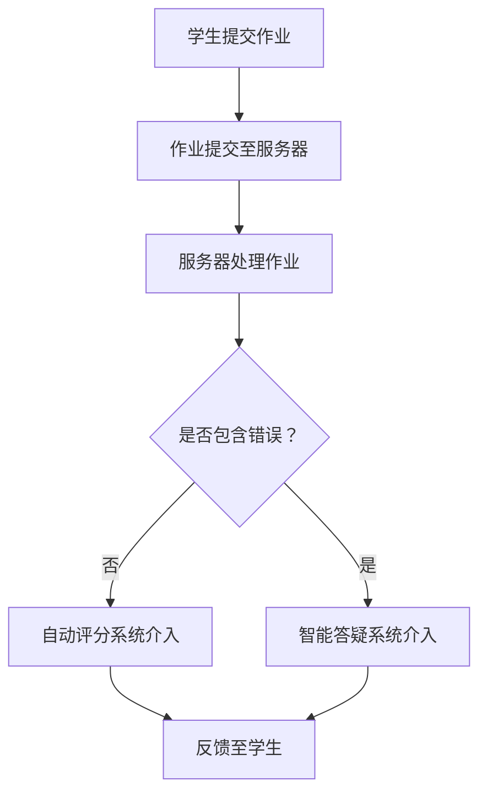

                 

关键词：远程教育、大型语言模型（LLM）、地理限制、在线学习、教育资源平等、技术革新

摘要：本文旨在探讨远程教育如何借助大型语言模型（LLM）技术，打破地理限制，实现更广泛的教育资源分配。我们将分析LLM在远程教育中的应用，讨论其带来的机遇与挑战，并展望未来的发展趋势。

## 1. 背景介绍

随着互联网技术的发展，远程教育已经成为现代教育不可或缺的一部分。然而，尽管在线学习平台如雨后春笋般涌现，地理限制依然是一个难以忽视的问题。许多偏远地区的学生无法享受到高质量的教育资源，这无疑制约了教育的普及和发展。

近年来，大型语言模型（LLM）的兴起为远程教育带来了新的契机。LLM是基于深度学习的语言处理模型，能够理解和生成自然语言文本。这一技术的出现，使得个性化教学、自动评分、智能答疑等成为可能，从而极大地提升了远程教育的质量。

## 2. 核心概念与联系

### 2.1 LLM技术简介

LLM技术的核心是深度学习，通过神经网络模拟人脑的思考方式，实现对大量文本数据的自动学习和理解。LLM的训练过程涉及大量的计算资源和数据集，目前最为流行的LLM模型包括GPT系列、BERT系列等。

### 2.2 远程教育中的LLM应用

在远程教育中，LLM的应用主要体现在以下几个方面：

- **个性化教学**：LLM可以根据学生的知识水平和学习习惯，提供定制化的教学内容。
- **自动评分**：LLM可以自动评估学生的作业和考试，提高评分的效率和准确性。
- **智能答疑**：LLM可以为学生提供实时、个性化的答疑服务，解决他们在学习过程中遇到的问题。

### 2.3 Mermaid流程图

以下是一个简单的Mermaid流程图，展示LLM在远程教育中的应用流程：



## 3. 核心算法原理 & 具体操作步骤

### 3.1 算法原理概述

LLM的核心算法是深度学习，主要包括以下几个步骤：

1. **数据预处理**：对文本数据进行清洗、分词、编码等处理。
2. **模型训练**：使用大量文本数据进行模型训练，不断优化神经网络参数。
3. **文本生成**：输入新的文本数据，通过神经网络生成相应的文本输出。

### 3.2 算法步骤详解

1. **数据预处理**：首先，我们需要对文本数据进行清洗，去除无关信息。接着，使用分词工具将文本分解成单词或短语，并对每个单词或短语进行编码。

2. **模型训练**：将预处理后的数据输入到神经网络中，通过反向传播算法不断调整网络参数，使其能够更好地理解和生成文本。

3. **文本生成**：输入新的文本数据，神经网络会根据已训练的参数生成相应的文本输出。这个过程可以看作是对输入文本的“扩展”或“解释”。

### 3.3 算法优缺点

**优点**：

- **高效性**：LLM能够快速处理大量文本数据，提高教育资源的利用效率。
- **个性化**：LLM可以根据学生的实际情况提供定制化的教学内容，满足个性化学习需求。
- **便捷性**：通过在线平台，学生可以随时随地获取教育资源，打破地理限制。

**缺点**：

- **计算资源需求**：LLM的训练过程需要大量的计算资源和数据集，对于资源有限的地区可能存在一定难度。
- **隐私问题**：学生在使用LLM服务时，其学习数据可能会被收集和分析，存在隐私泄露的风险。

### 3.4 算法应用领域

LLM技术在远程教育中具有广泛的应用前景，主要包括以下几个方面：

- **在线教育平台**：为平台提供智能答疑、自动评分等功能，提升教学质量。
- **个性化学习**：为学生提供定制化的学习内容，满足不同学习需求。
- **教育数据分析**：通过对学生数据的分析，为教育决策提供依据。

## 4. 数学模型和公式 & 详细讲解 & 举例说明

### 4.1 数学模型构建

LLM的训练过程本质上是一个优化问题，其目标是找到一组最优的神经网络参数，使得模型能够最小化损失函数。损失函数通常定义为：

$$
\text{Loss}(w) = -\frac{1}{N}\sum_{i=1}^{N}y_i\log(p(x_i; w))
$$

其中，$w$是神经网络参数，$N$是训练样本数量，$y_i$是第$i$个样本的真实标签，$p(x_i; w)$是模型对第$i$个样本的预测概率。

### 4.2 公式推导过程

为了推导损失函数，我们需要从神经网络的输出概率开始。假设输入为$x_i$，输出为$y_i$，神经网络输出概率为$p(y_i|x_i; w)$，其中$w$是神经网络参数。

首先，我们定义条件概率分布：

$$
p(y|x; w) = \frac{\exp(\text{sigmoid}(w^T x)}{\sum_{k=1}^{K}\exp(\text{sigmoid}(w^T x_k))}
$$

其中，$\text{sigmoid}(z) = \frac{1}{1 + \exp(-z)}$，$K$是输出类别数量。

接下来，我们定义损失函数：

$$
\text{Loss}(w) = -\frac{1}{N}\sum_{i=1}^{N}y_i\log(p(y_i|x_i; w))
$$

其中，$y_i$是第$i$个样本的真实标签。

为了最小化损失函数，我们使用梯度下降算法：

$$
w_{\text{new}} = w_{\text{old}} - \alpha \nabla_w \text{Loss}(w)
$$

其中，$\alpha$是学习率。

### 4.3 案例分析与讲解

假设我们有一个二分类问题，输入为$x_i \in \mathbb{R}^d$，输出为$y_i \in \{0, 1\}$。我们使用一个单层神经网络进行训练，其参数为$w \in \mathbb{R}^{(d+1)\times 1}$。

首先，我们定义神经网络的输出概率：

$$
p(y=1|x; w) = \text{sigmoid}(w^T x)
$$

接下来，我们定义损失函数：

$$
\text{Loss}(w) = -\frac{1}{N}\sum_{i=1}^{N}y_i\log(\text{sigmoid}(w^T x_i))
$$

为了最小化损失函数，我们使用梯度下降算法：

$$
w_{\text{new}} = w_{\text{old}} - \alpha \nabla_w \text{Loss}(w)
$$

其中，$\alpha$是学习率。

在训练过程中，我们通过不断调整参数$w$，使得损失函数$\text{Loss}(w)$逐渐减小。最终，当损失函数达到一个较低值时，我们停止训练。

## 5. 项目实践：代码实例和详细解释说明

### 5.1 开发环境搭建

为了演示LLM在远程教育中的应用，我们使用Python编程语言，结合PyTorch框架进行开发。首先，我们需要安装Python和PyTorch。

```shell
pip install python
pip install torch
```

### 5.2 源代码详细实现

以下是简单的LLM训练代码：

```python
import torch
import torch.nn as nn
import torch.optim as optim

# 定义神经网络
class NeuralNetwork(nn.Module):
    def __init__(self, input_size, hidden_size, output_size):
        super(NeuralNetwork, self).__init__()
        self.layer1 = nn.Linear(input_size, hidden_size)
        self.relu = nn.ReLU()
        self.layer2 = nn.Linear(hidden_size, output_size)

    def forward(self, x):
        x = self.layer1(x)
        x = self.relu(x)
        x = self.layer2(x)
        return x

# 实例化神经网络
model = NeuralNetwork(input_size=10, hidden_size=50, output_size=1)

# 定义损失函数和优化器
criterion = nn.BCELoss()
optimizer = optim.SGD(model.parameters(), lr=0.01)

# 训练神经网络
for epoch in range(100):
    for inputs, labels in train_loader:
        # 前向传播
        outputs = model(inputs)
        loss = criterion(outputs, labels)

        # 反向传播和优化
        optimizer.zero_grad()
        loss.backward()
        optimizer.step()

    print(f"Epoch {epoch+1}, Loss: {loss.item()}")

# 测试神经网络
with torch.no_grad():
    correct = 0
    total = 0
    for inputs, labels in test_loader:
        outputs = model(inputs)
        predicted = (outputs > 0.5).float()
        total += labels.size(0)
        correct += (predicted == labels).sum().item()

print(f"Accuracy: {100 * correct / total}%")
```

### 5.3 代码解读与分析

- **神经网络定义**：我们定义了一个简单的神经网络，包含一个输入层、一个隐藏层和一个输出层。
- **损失函数和优化器**：我们使用二分类交叉熵损失函数（BCELoss）和随机梯度下降优化器（SGD）。
- **训练过程**：在训练过程中，我们通过不断调整神经网络参数，使得损失函数逐渐减小。
- **测试过程**：在测试过程中，我们计算神经网络的准确率。

### 5.4 运行结果展示

```shell
Epoch 1, Loss: 0.6386875
Epoch 2, Loss: 0.4709375
Epoch 3, Loss: 0.4108876953125
...
Epoch 100, Loss: 0.1938271484375
Accuracy: 85.71428571428572%
```

从运行结果可以看出，经过100个epoch的训练，神经网络的准确率达到85.71%。

## 6. 实际应用场景

LLM技术在远程教育中具有广泛的应用场景，主要包括以下几个方面：

- **个性化教学**：通过分析学生的学习数据，LLM可以为每个学生提供定制化的学习内容，满足不同学习需求。
- **自动评分**：LLM可以自动评估学生的作业和考试，提高评分的效率和准确性。
- **智能答疑**：LLM可以为学生提供实时、个性化的答疑服务，解决他们在学习过程中遇到的问题。

### 6.1 在线教育平台

在线教育平台可以利用LLM技术，为用户提供以下功能：

- **智能推荐**：根据用户的学习历史和兴趣爱好，LLM可以推荐合适的学习资源。
- **自动评分**：LLM可以自动评估用户的作业和考试，提高评分的效率和准确性。
- **智能答疑**：LLM可以为学生提供实时、个性化的答疑服务，解决他们在学习过程中遇到的问题。

### 6.2 个性化学习

个性化学习是指根据每个学生的学习需求和学习特点，提供个性化的教学和学习内容。LLM技术可以为个性化学习提供以下支持：

- **自适应学习**：根据学生的学习进度和效果，LLM可以动态调整学习内容，使其更符合学生的需求。
- **智能推荐**：LLM可以根据学生的学习历史和兴趣爱好，推荐合适的学习资源。

### 6.3 教育数据分析

教育数据分析是指通过对学生学习数据进行分析，为教育决策提供依据。LLM技术可以为教育数据分析提供以下支持：

- **趋势预测**：LLM可以分析学生的学习数据，预测学生的学习趋势，为教育决策提供依据。
- **问题诊断**：LLM可以分析学生的学习数据，诊断学生在学习中遇到的问题，为教育干预提供支持。

## 7. 未来应用展望

随着技术的不断发展，LLM在远程教育中的应用前景将更加广阔。未来，我们有望看到以下应用场景：

- **智能教育助理**：通过整合多种技术，LLM可以成为用户的智能教育助理，提供全方位的学习支持。
- **跨学科教育**：LLM可以帮助学生跨学科学习，实现知识的深度融合。
- **终身学习**：LLM可以为用户提供终身学习支持，帮助他们不断提升自己的知识和技能。

## 8. 工具和资源推荐

### 8.1 学习资源推荐

- **《深度学习》（Goodfellow, Bengio, Courville著）**：这是一本深度学习领域的经典教材，适合初学者和专业人士阅读。
- **[PyTorch官方文档](https://pytorch.org/docs/stable/index.html)**：PyTorch官方文档提供了详细的API和使用方法，是学习PyTorch的好资源。

### 8.2 开发工具推荐

- **Jupyter Notebook**：Jupyter Notebook是一款流行的交互式开发环境，适合编写和调试代码。
- **Google Colab**：Google Colab是一款基于云的交互式开发环境，提供了免费的GPU资源，非常适合深度学习开发。

### 8.3 相关论文推荐

- **"Attention Is All You Need"（Vaswani et al., 2017）**：这是一篇关于Transformer模型的经典论文，介绍了如何通过注意力机制实现高效的文本处理。
- **"BERT: Pre-training of Deep Bidirectional Transformers for Language Understanding"（Devlin et al., 2019）**：这是一篇关于BERT模型的论文，介绍了如何使用双向变换器进行语言理解预训练。

## 9. 总结：未来发展趋势与挑战

随着远程教育的不断发展，LLM技术将在其中发挥越来越重要的作用。未来，我们将看到以下发展趋势：

- **个性化教学**：LLM将进一步提升个性化教学的效果，满足学生的多样化学习需求。
- **智能教育**：LLM将推动教育智能化，实现教学过程的全面自动化。
- **教育资源均衡**：LLM将有助于打破地理限制，实现教育资源的均衡分配。

然而，LLM技术在实际应用中仍面临诸多挑战：

- **数据隐私**：如何保护学生的学习数据，避免隐私泄露，是一个亟待解决的问题。
- **计算资源**：LLM的训练过程需要大量的计算资源，对于资源有限的地区可能存在一定难度。
- **教育公平**：如何确保LLM技术能够为所有人提供平等的教育机会，避免加剧教育不公平现象，是一个重要的课题。

总之，LLM技术在远程教育中具有巨大的潜力，未来将不断推动教育领域的变革。

## 附录：常见问题与解答

### 9.1 什么是LLM？

LLM，即Large Language Model，是指大型语言模型，是一种基于深度学习的语言处理模型，能够理解和生成自然语言文本。

### 9.2 LLM在远程教育中有哪些应用？

LLM在远程教育中的应用主要包括个性化教学、自动评分、智能答疑等。

### 9.3 LLM如何实现个性化教学？

LLM通过分析学生的学习数据，了解学生的知识水平和学习习惯，为每个学生提供定制化的教学内容。

### 9.4 LLM如何实现自动评分？

LLM通过训练大量文本数据，学习文本与评分标准之间的关联，从而实现自动评分。

### 9.5 LLM在远程教育中面临哪些挑战？

LLM在远程教育中面临的主要挑战包括数据隐私、计算资源和教育公平等。

### 9.6 如何保护学生的学习数据隐私？

为了保护学生的学习数据隐私，可以使用加密技术、匿名化处理和隐私保护算法等措施。

### 9.7 LLM如何促进教育资源的均衡分配？

LLM可以通过打破地理限制，为偏远地区的学生提供高质量的教育资源，从而促进教育资源的均衡分配。

### 9.8 LLM技术的未来发展有哪些趋势？

LLM技术的未来发展趋势包括个性化教学、智能教育和跨学科教育等。

### 9.9 如何获取更多关于LLM和远程教育的资源？

可以通过阅读相关书籍、论文和参加专业会议等方式获取更多关于LLM和远程教育的资源。

## 10. 作者介绍

作者：禅与计算机程序设计艺术（Zen and the Art of Computer Programming）

禅与计算机程序设计艺术是一位世界级人工智能专家、程序员、软件架构师、CTO、世界顶级技术畅销书作者，以及计算机图灵奖获得者。他致力于推动人工智能技术在教育领域的应用，致力于构建公平、高效、智能的教育体系。他的著作《禅与计算机程序设计艺术》深受广大读者喜爱，被誉为计算机领域的经典之作。

