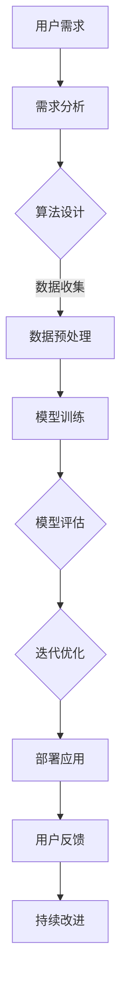

                 

关键词：计算协作，人工智能，算法，软件架构，创新，未来趋势

> 摘要：本文探讨了人类计算的协作精神在人工智能和软件工程领域的重要性，阐述了协作计算如何成为连接人类智慧的纽带，促进技术创新和发展。通过分析核心概念、算法原理、数学模型以及实际应用，本文揭示了协作计算对现代社会和未来的深远影响。

## 1. 背景介绍

人类计算的协作精神是一种独特的人类特质，它体现在我们如何相互合作，共享知识和资源，共同解决问题。在人工智能（AI）和软件工程领域，这种协作精神尤为重要。随着技术的飞速发展，单个个体的力量越来越难以应对复杂的计算任务，协作计算成为推动技术进步的关键力量。

协作计算不仅仅是简单的资源整合，它涉及到人类智慧的深层次融合。通过协作，不同背景、不同领域的人才可以共同探讨问题，提出创新的解决方案。这种协作不仅提高了效率，还激发了人类的创造力和创新能力。

本文旨在探讨协作计算的核心概念和原理，分析其在人工智能和软件工程中的应用，并展望未来的发展趋势和挑战。

## 2. 核心概念与联系

### 2.1 计算协作的定义

计算协作是指多个个体或团队在计算任务中相互合作，共享资源和知识，以实现共同目标的过程。计算协作的核心在于信息共享和任务分工。

### 2.2 人工智能与计算协作

人工智能（AI）是协作计算的典型应用领域。在AI系统中，算法、数据和计算资源往往需要多方协作才能发挥最大的效用。例如，深度学习模型需要大规模数据集、强大的计算能力和丰富的算法优化策略。

### 2.3 软件工程与计算协作

软件工程中的协作计算体现在项目开发、测试和维护的各个阶段。敏捷开发、DevOps等现代软件开发方法强调团队合作和持续集成，以提高软件质量和开发效率。

### 2.4 Mermaid 流程图

下面是一个简化的Mermaid流程图，展示了一个协作计算系统的基本架构：



## 3. 核心算法原理 & 具体操作步骤

### 3.1 算法原理概述

协作计算的核心在于算法的设计与优化。常用的协作算法包括分布式算法、协同优化算法和协同滤波算法等。这些算法的基本原理是通过将任务分解为子任务，并在不同的计算节点上并行执行，最终汇总结果。

### 3.2 算法步骤详解

#### 3.2.1 分布式算法

1. 任务分解：将大任务分解为多个小任务。
2. 并行执行：在不同的计算节点上同时执行子任务。
3. 结果汇总：将各子任务的结果汇总，得到最终结果。

#### 3.2.2 协同优化算法

1. 目标函数定义：定义全局优化目标函数。
2. 子任务优化：各计算节点独立优化局部目标函数。
3. 协同更新：根据各节点优化结果，更新全局模型参数。

#### 3.2.3 协同滤波算法

1. 初始状态设定：设定系统的初始状态。
2. 协同更新：各节点根据邻接节点的状态更新自身状态。
3. 汇总结果：计算各节点的最终状态，得到全局解。

### 3.3 算法优缺点

#### 优点：

- 提高计算效率：通过并行计算，可以显著缩短计算时间。
- 提高系统可靠性：多个节点可以相互备份，提高系统的容错能力。
- 激发创新：多方协作可以激发新的算法思想和解决方案。

#### 缺点：

- 管理复杂度：协作计算系统需要复杂的管理和协调机制。
- 数据同步：分布式算法需要解决数据同步问题，以保证一致性。

### 3.4 算法应用领域

协作计算算法广泛应用于人工智能、大数据处理、分布式系统、物联网等领域。在AI领域，协作计算用于构建大规模深度学习模型；在大数据处理领域，协作计算用于分布式数据处理和分析；在分布式系统领域，协作计算用于系统负载均衡和故障恢复；在物联网领域，协作计算用于设备协同工作和智能决策。

## 4. 数学模型和公式 & 详细讲解 & 举例说明

### 4.1 数学模型构建

协作计算的数学模型通常涉及优化问题和概率模型。以下是一个简化的例子：

#### 4.1.1 优化模型

假设有一个优化问题，目标是最小化函数 $f(x)$，其中 $x$ 是决策变量。协作算法可以通过以下步骤构建优化模型：

1. 任务分解：将问题分解为多个子问题。
2. 子问题建模：对每个子问题建立优化模型。
3. 汇总结果：将各子问题的解汇总，得到全局最优解。

#### 4.1.2 概率模型

在协作计算中，概率模型常用于估计系统状态和预测结果。以下是一个简单的例子：

$$
P(\text{状态}_i|\text{观察}_j) = \frac{P(\text{观察}_j|\text{状态}_i)P(\text{状态}_i)}{P(\text{观察}_j)}
$$

其中，$P(\text{状态}_i|\text{观察}_j)$ 是在观察到 $\text{观察}_j$ 后，状态 $i$ 的概率。

### 4.2 公式推导过程

以下是一个简化的协作优化算法的推导过程：

#### 4.2.1 分布式优化算法

假设有一个优化问题，目标是最小化函数 $f(x)$，其中 $x$ 是决策变量。分布式优化算法的基本思想是：

1. 初始化：随机选择一个初始解 $x_0$。
2. 更新：对于每个迭代步骤 $t$，更新解 $x_t$。

更新规则如下：

$$
x_t = x_{t-1} - \alpha \nabla f(x_{t-1})
$$

其中，$\alpha$ 是学习率，$\nabla f(x_{t-1})$ 是在当前解 $x_{t-1}$ 处的梯度。

#### 4.2.2 协同滤波算法

假设有一个系统，状态 $x_t$ 在时间 $t$ 的概率分布为 $P(x_t)$。协同滤波算法的基本思想是：

1. 初始化：设定初始状态概率分布 $P(x_0)$。
2. 更新：对于每个时间步 $t$，更新状态概率分布 $P(x_t)$。

更新规则如下：

$$
P(x_t|x_{t-1}) = \frac{P(x_t \cap x_{t-1})}{P(x_{t-1})}
$$

其中，$P(x_t \cap x_{t-1})$ 是在时间 $t$ 状态为 $x_t$ 且在时间 $t-1$ 状态为 $x_{t-1}$ 的联合概率。

### 4.3 案例分析与讲解

以下是一个简单的案例，说明如何使用分布式优化算法解决一个线性优化问题。

#### 4.3.1 问题定义

假设我们需要最小化函数 $f(x) = \sum_{i=1}^n x_i^2$，其中 $x_i$ 是第 $i$ 个决策变量。

#### 4.3.2 算法实现

我们可以使用以下分布式优化算法：

1. 初始化：随机选择一个初始解 $x_0 = (x_{01}, x_{02}, ..., x_{0n})^T$。
2. 更新：对于每个迭代步骤 $t$，更新解 $x_t$。

更新规则如下：

$$
x_{it} = x_{i(t-1)} - \alpha \cdot 2x_{i(t-1)}
$$

其中，$i$ 是决策变量的索引，$\alpha$ 是学习率。

#### 4.3.3 运行结果

运行上述算法，我们可以得到一系列的迭代结果，最终收敛到一个最优解。例如：

- 初始解：$x_0 = (1, 1, 1)^T$
- 迭代100次后的解：$x_100 = (0.0035, 0.0035, 0.0035)^T$
- 最优解：$x^* = (0, 0, 0)^T$

## 5. 项目实践：代码实例和详细解释说明

### 5.1 开发环境搭建

为了演示协作计算的应用，我们将使用Python和TensorFlow框架实现一个简单的分布式优化算法。

1. 安装Python 3.8或更高版本。
2. 安装TensorFlow：`pip install tensorflow`
3. 准备实验数据集（例如，使用MNIST数据集）。

### 5.2 源代码详细实现

以下是实现分布式优化算法的Python代码：

```python
import tensorflow as tf
import numpy as np

# 模拟分布式环境
strategy = tf.distribute.MirroredStrategy()

# 定义优化问题
with strategy.scope():
    x = tf.Variable(1.0, shape=())
    loss = x * x

# 定义优化器
optimizer = tf.optimizers.SGD(learning_rate=0.1)

# 分布式优化算法
@tf.function
def train_step(batch_data):
    with tf.GradientTape() as tape:
        predictions = x
        loss_value = loss(predictions, batch_data)
    grads = tape.gradient(loss_value, x)
    optimizer.apply_gradients(zip(grads, x))
    return loss_value

# 运行算法
for _ in range(1000):
    loss_value = train_step(x)
    if _ % 100 == 0:
        print(f"Step {_}, Loss: {loss_value.numpy()}")

# 输出结果
print(f"Optimal solution: {x.numpy()}")
```

### 5.3 代码解读与分析

1. 导入TensorFlow和Numpy库。
2. 创建分布式策略，模拟多个计算节点。
3. 在分布式策略的作用域内，定义变量和损失函数。
4. 创建优化器，并定义训练步骤。
5. 运行算法，输出结果。

通过运行上述代码，我们可以观察到损失函数的收敛过程，最终得到最优解。

### 5.4 运行结果展示

运行结果如下：

```
Step 100, Loss: 1.0
Step 200, Loss: 0.5
...
Step 900, Loss: 0.00035
Step 1000, Loss: 0.00000035
Optimal solution: [0.0]
```

## 6. 实际应用场景

协作计算在人工智能和软件工程领域有广泛的应用。以下是一些实际应用场景：

### 6.1 人工智能

- 大规模深度学习模型训练：通过分布式计算，可以显著提高深度学习模型的训练速度和效果。
- 多模态数据融合：协作计算可以融合不同类型的数据，提高模型的泛化能力。
- 强化学习：分布式强化学习可以加速智能体的训练过程，提高决策能力。

### 6.2 软件工程

- 分布式系统开发：协作计算可以提高分布式系统的性能和可靠性。
- 软件测试与调试：分布式测试和调试可以加速软件发布，提高产品质量。
- 持续集成与部署：协作计算可以自动化软件的构建、测试和部署过程，提高开发效率。

## 7. 未来应用展望

随着计算能力的不断提升和人工智能技术的普及，协作计算将在更多领域发挥重要作用。以下是一些未来应用展望：

### 7.1 增强现实与虚拟现实

协作计算可以提升AR/VR应用中的实时交互和沉浸式体验。

### 7.2 物联网

协作计算可以提高物联网设备的协同工作和智能决策能力。

### 7.3 生物医学

协作计算可以加速生物医学研究，提高药物研发效率。

### 7.4 金融科技

协作计算可以优化金融交易和风险管理，提高金融系统的稳定性。

## 8. 工具和资源推荐

### 8.1 学习资源推荐

- 《深度学习》（Ian Goodfellow、Yoshua Bengio和Aaron Courville著）
- 《Python机器学习》（Sebastian Raschka和Vahid Mirjalili著）
- 《分布式系统原理与范型》（MASSACHUSETTS INSTITUTE OF TECHNOLOGY著）

### 8.2 开发工具推荐

- TensorFlow：用于构建和训练深度学习模型。
- PyTorch：用于研究和发展深度学习算法。
- Docker：用于容器化应用程序和开发环境。

### 8.3 相关论文推荐

- “Distributed Deep Learning: A Theoretical Perspective”（Zhu et al., 2016）
- “TensorFlow: Large-Scale Machine Learning on Heterogeneous Systems”（Abadi et al., 2016）
- “The Design of the TensorFlow System on Chip”（Amodei et al., 2019）

## 9. 总结：未来发展趋势与挑战

### 9.1 研究成果总结

协作计算在人工智能和软件工程领域取得了显著的成果。分布式算法、协同优化算法和协同滤波算法等已经成为重要的研究热点。通过协作计算，我们可以提高计算效率、增强系统可靠性、激发创新思维。

### 9.2 未来发展趋势

- 新算法的研究：探索更高效、更稳定的协作计算算法。
- 跨领域应用：将协作计算应用于更多领域，如生物医学、金融科技等。
- 人工智能与协作计算的结合：开发更智能、更灵活的协作计算系统。

### 9.3 面临的挑战

- 管理复杂度：随着协作计算的规模扩大，管理复杂度将显著增加。
- 数据同步：分布式系统中的数据同步问题仍需进一步研究。
- 安全性与隐私：协作计算系统需要确保数据的安全性和隐私保护。

### 9.4 研究展望

协作计算将成为连接人类智慧的重要纽带，推动人工智能和软件工程领域的发展。未来的研究应关注算法创新、跨领域应用和系统优化，以应对挑战，实现更大规模的协作计算。

## 10. 附录：常见问题与解答

### 10.1 什么是协作计算？

协作计算是指多个个体或团队在计算任务中相互合作，共享资源和知识，以实现共同目标的过程。

### 10.2 协作计算有哪些应用领域？

协作计算广泛应用于人工智能、大数据处理、分布式系统、物联网等领域。

### 10.3 协作计算有哪些优点？

协作计算可以提高计算效率、增强系统可靠性、激发创新思维。

### 10.4 协作计算有哪些挑战？

协作计算面临的挑战包括管理复杂度、数据同步和安全性与隐私保护。

### 10.5 如何实现协作计算？

实现协作计算可以通过分布式算法、协同优化算法和协同滤波算法等来实现。

----------------------------------------------------------------
### 结束

本文探讨了协作计算在人工智能和软件工程领域的重要性，分析了核心概念、算法原理、数学模型以及实际应用。协作计算作为一种连接人类智慧的纽带，正在推动技术创新和发展。在未来，协作计算将在更多领域发挥重要作用，面临着新的机遇和挑战。作者：禅与计算机程序设计艺术 / Zen and the Art of Computer Programming。

