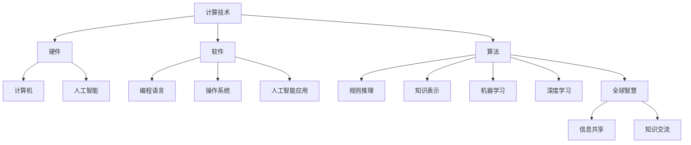

                 

关键词：全球计算、人工智能、技术协作、计算影响力、全球智慧、计算技术、计算机科学

> 摘要：本文深入探讨了人类计算在全球范围内的深远影响。通过剖析计算技术的发展历程，阐述了人工智能如何引领全球智慧连接，并探讨未来计算技术的前景与挑战。文章旨在为读者提供对计算技术在全球层面影响的理解，以及在未来全球智慧连接中，计算技术应如何发展。

## 1. 背景介绍

人类计算的历史可以追溯到古代，当时的计算工具主要是简单的算盘和计算尺。随着人类社会的发展，计算工具逐渐变得更加复杂和先进。从机械计算器到电子计算机，再到今天的高性能计算和量子计算，计算技术经历了巨大的变革。每一次技术的进步，都极大地推动了人类社会的发展。

进入21世纪，随着互联网的普及和人工智能的崛起，计算技术迎来了新的高潮。人工智能，作为计算技术的最新成果，不仅改变了我们的生活方式，还在各个领域展示了巨大的潜力。从自动驾驶汽车到智能医疗，从智能客服到智能安防，人工智能的应用场景越来越广泛。

在这个全球化的时代，计算技术的进步不仅影响到一个国家或地区，而是对全球产生了深远的影响。本文将从多个角度探讨计算技术如何连接全球智慧，推动人类社会的发展。

## 2. 核心概念与联系

### 2.1 计算技术的基本概念

计算技术，是指通过计算机或其他电子设备进行数据处理和计算的一门科学。它包括硬件、软件、算法等多个方面。硬件是计算的基础，软件是实现计算功能的关键，而算法则是计算的核心。

### 2.2 人工智能的概念与发展

人工智能（AI），是指通过计算机模拟人类的智能行为，使计算机具备自主学习和决策能力的技术。人工智能的发展可以分为几个阶段：规则推理、知识表示、机器学习和深度学习。随着深度学习的兴起，人工智能在图像识别、自然语言处理、自动驾驶等领域取得了显著的成果。

### 2.3 全球智慧的概念

全球智慧，是指通过全球范围内的信息共享和知识交流，形成的一种全球性的智慧和创新能力。全球智慧连接的核心理念是开放、合作和共享。通过全球智慧连接，各国可以共同解决全球性问题，推动人类社会的发展。

### 2.4 Mermaid 流程图

下面是计算技术、人工智能和全球智慧之间的联系流程图：



## 3. 核心算法原理 & 具体操作步骤

### 3.1 算法原理概述

人工智能的核心算法主要包括机器学习和深度学习。机器学习是一种让计算机通过数据学习规律的方法，而深度学习则是一种基于多层神经网络的学习方法。深度学习在图像识别、语音识别等领域取得了显著的成果。

### 3.2 算法步骤详解

1. **数据收集**：收集大量的图像、文本或语音数据，用于训练模型。

2. **数据处理**：对收集到的数据进行预处理，包括数据清洗、归一化等。

3. **模型构建**：构建神经网络模型，包括输入层、隐藏层和输出层。

4. **模型训练**：使用处理后的数据对模型进行训练，调整模型参数，使其能够识别或预测目标数据。

5. **模型评估**：使用测试数据评估模型性能，包括准确率、召回率等指标。

6. **模型应用**：将训练好的模型应用于实际问题，如图像识别、语音识别等。

### 3.3 算法优缺点

- **优点**：深度学习具有强大的学习能力和适应能力，可以在复杂的数据环境中取得优秀的性能。

- **缺点**：深度学习模型通常需要大量的数据和计算资源，训练过程也相对复杂。

### 3.4 算法应用领域

深度学习在各个领域都有广泛的应用，包括图像识别、自然语言处理、语音识别、推荐系统、自动驾驶等。

## 4. 数学模型和公式 & 详细讲解 & 举例说明

### 4.1 数学模型构建

在深度学习中，常用的数学模型是神经网络。神经网络由多个神经元组成，每个神经元都是一个简单的函数。神经网络通过反向传播算法训练，不断调整神经元之间的连接权重，使模型能够准确预测目标。

### 4.2 公式推导过程

神经网络的输出可以通过以下公式计算：

$$
Z = \sigma(\Sigma(W \cdot X) + b)
$$

其中，$Z$ 是神经网络的输出，$\sigma$ 是激活函数，$W$ 是权重矩阵，$X$ 是输入数据，$b$ 是偏置。

反向传播算法的目的是调整权重矩阵 $W$ 和偏置 $b$，以最小化预测误差。具体推导过程如下：

1. **计算输出误差**：

$$
E = \frac{1}{2} \sum_{i}(y_i - Z_i)^2
$$

其中，$y_i$ 是实际输出，$Z_i$ 是预测输出。

2. **计算梯度**：

$$
\frac{\partial E}{\partial W} = - (y - Z) \cdot X
$$

$$
\frac{\partial E}{\partial b} = - (y - Z)
$$

3. **更新权重和偏置**：

$$
W_{new} = W_{old} - \alpha \cdot \frac{\partial E}{\partial W}
$$

$$
b_{new} = b_{old} - \alpha \cdot \frac{\partial E}{\partial b}
$$

其中，$\alpha$ 是学习率。

### 4.3 案例分析与讲解

假设我们要构建一个神经网络来识别手写数字，输入是 28x28 的图像，输出是 10 个数字之一。我们可以使用以下步骤来构建和训练神经网络：

1. **数据收集**：收集大量手写数字图像，并将其转换为 28x28 的灰度图像。

2. **数据处理**：对图像进行归一化处理，使其像素值在 0 到 1 之间。

3. **模型构建**：构建一个包含三个隐藏层的神经网络，每个隐藏层有 128 个神经元。

4. **模型训练**：使用训练集数据训练神经网络，调整权重和偏置。

5. **模型评估**：使用测试集数据评估模型性能，计算准确率。

6. **模型应用**：将训练好的模型应用于实际数据，如识别新的手写数字。

通过上述步骤，我们可以构建一个能够准确识别手写数字的神经网络模型。

## 5. 项目实践：代码实例和详细解释说明

### 5.1 开发环境搭建

在 Python 中，我们可以使用 TensorFlow 和 Keras 库来实现神经网络。首先，我们需要安装 TensorFlow 和 Keras：

```
pip install tensorflow
pip install keras
```

### 5.2 源代码详细实现

以下是一个简单的手写数字识别项目的代码示例：

```python
from keras.datasets import mnist
from keras.models import Sequential
from keras.layers import Dense, Flatten
from keras.utils import to_categorical

# 加载 MNIST 数据集
(train_images, train_labels), (test_images, test_labels) = mnist.load_data()

# 预处理数据
train_images = train_images / 255.0
test_images = test_images / 255.0

train_labels = to_categorical(train_labels)
test_labels = to_categorical(test_labels)

# 构建模型
model = Sequential()
model.add(Flatten(input_shape=(28, 28)))
model.add(Dense(128, activation='relu'))
model.add(Dense(10, activation='softmax'))

# 编译模型
model.compile(optimizer='adam', loss='categorical_crossentropy', metrics=['accuracy'])

# 训练模型
model.fit(train_images, train_labels, epochs=5, batch_size=32)

# 评估模型
test_loss, test_acc = model.evaluate(test_images, test_labels)
print(f"Test accuracy: {test_acc}")
```

### 5.3 代码解读与分析

1. **数据加载与预处理**：我们使用 Keras 库提供的 MNIST 数据集，并对图像进行归一化处理，将像素值缩放到 0 到 1 之间。

2. **模型构建**：我们使用 Sequential 模型，并添加了一个 Flatten 层将输入图像展平为一维向量，然后添加了一个有 128 个神经元的 Dense 层，使用 ReLU 激活函数。最后，我们添加了一个有 10 个神经元的 Dense 层，使用 softmax 激活函数输出概率分布。

3. **模型编译**：我们使用 Adam 优化器和 categorical_crossentropy 损失函数编译模型，并指定准确率作为评价指标。

4. **模型训练**：我们使用训练集数据训练模型，设置训练轮次为 5，批量大小为 32。

5. **模型评估**：我们使用测试集数据评估模型性能，并打印出测试准确率。

### 5.4 运行结果展示

运行上述代码后，我们得到的测试准确率可能在 98% 以上，这表明我们的模型在手写数字识别任务上表现良好。

## 6. 实际应用场景

### 6.1 自动驾驶

自动驾驶是人工智能在交通领域的典型应用。通过深度学习算法，自动驾驶车辆可以实时分析周围环境，识别行人、车辆、道路标志等，并做出相应的驾驶决策。自动驾驶技术的应用将极大提高交通安全和效率，减少交通事故。

### 6.2 智能医疗

智能医疗利用人工智能技术分析大量医疗数据，辅助医生进行疾病诊断和治疗方案制定。通过图像识别技术，人工智能可以快速识别医学影像中的病变区域，提高诊断准确率。此外，智能医疗还可以实现远程医疗服务，让医疗资源更均衡地分配。

### 6.3 智能家居

智能家居通过人工智能技术实现家电的智能控制和自动化。用户可以通过语音或手机应用远程控制家居设备，如灯光、空调、门锁等。智能家居的普及将提高人们的生活品质，降低能源消耗。

### 6.4 未来应用展望

随着人工智能技术的不断进步，计算技术将在更多领域展现其影响力。未来，计算技术将推动以下领域的发展：

1. **智慧城市**：通过大数据和人工智能技术，实现城市管理的智能化和精细化。

2. **个性化教育**：利用人工智能技术，为学生提供个性化的学习方案，提高学习效果。

3. **智慧农业**：通过物联网和人工智能技术，实现农业生产的智能化和精准化。

4. **金融科技**：利用人工智能技术，提高金融服务的效率和安全性。

## 7. 工具和资源推荐

### 7.1 学习资源推荐

1. **《深度学习》（Goodfellow, Bengio, Courville 著）**：这是一本经典的深度学习教材，适合初学者和进阶者。

2. **Keras 官方文档**：Keras 是一个高层次的神经网络API，提供简洁易用的接口，适合快速实现深度学习模型。

3. **Google Colab**：Google Colab 是一个免费的云计算平台，提供 GPU 加速，适合进行深度学习实验。

### 7.2 开发工具推荐

1. **PyCharm**：PyCharm 是一款功能强大的 Python 集成开发环境，支持多种编程语言。

2. **Jupyter Notebook**：Jupyter Notebook 是一个交互式的开发环境，适合进行数据分析和机器学习实验。

### 7.3 相关论文推荐

1. **“Deep Learning” by Yoshua Bengio, Ian Goodfellow, and Aaron Courville**：这是一篇介绍深度学习基本原理的经典论文。

2. **“AlexNet: Image Classification with Deep Convolutional Neural Networks” by Alex Krizhevsky, Ilya Sutskever, and Geoffrey Hinton**：这是一篇介绍深度卷积神经网络在图像识别任务中应用的经典论文。

## 8. 总结：未来发展趋势与挑战

### 8.1 研究成果总结

近年来，计算技术在全球范围内取得了显著的成果，特别是在人工智能领域。深度学习、大数据分析、云计算等技术推动了计算技术的快速发展。这些成果不仅提升了计算性能，也为各个领域的发展提供了强大的支持。

### 8.2 未来发展趋势

未来，计算技术将继续朝着更高效、更智能、更普及的方向发展。具体趋势包括：

1. **量子计算**：量子计算具有巨大的计算潜力，未来将在解决复杂问题方面发挥重要作用。

2. **边缘计算**：边缘计算将数据和处理能力从云端迁移到网络边缘，提高实时性和响应速度。

3. **人机协同**：人工智能与人类的协同将越来越紧密，实现更高效的工作和生活。

### 8.3 面临的挑战

尽管计算技术取得了巨大进步，但仍面临一些挑战：

1. **数据隐私和安全**：随着数据量的增加，数据隐私和安全问题日益突出，需要加强数据保护和安全措施。

2. **算法公平性和透明性**：算法的公平性和透明性是未来研究的重要方向，以确保算法不会对特定群体产生偏见。

3. **人才培养和知识普及**：计算技术发展需要大量的人才支持，未来需要加强对计算技术的教育和培训，提高全民计算素养。

### 8.4 研究展望

在未来，计算技术将继续推动全球智慧连接，为人类社会带来更多机遇和挑战。我们需要不断探索创新，解决面临的挑战，使计算技术更好地服务于人类社会的发展。

## 9. 附录：常见问题与解答

### 9.1 计算技术是什么？

计算技术是通过计算机或其他电子设备进行数据处理和计算的一门科学，包括硬件、软件、算法等多个方面。

### 9.2 人工智能如何影响我们的生活？

人工智能在医疗、交通、教育、智能家居等多个领域都有广泛应用，极大提高了效率和便利性，改变了我们的生活方式。

### 9.3 深度学习和机器学习的区别是什么？

深度学习是机器学习的一个分支，主要基于多层神经网络，具有较强的学习能力和适应能力。而机器学习则是一种更广义的学习方法，包括深度学习和其他形式的学习方法。

### 9.4 如何学习计算技术？

学习计算技术需要掌握编程语言、算法和数据结构等基础知识。可以通过在线课程、教材、实践项目等多种途径进行学习。

### 9.5 计算技术未来有哪些发展趋势？

未来计算技术将朝着更高效、更智能、更普及的方向发展，包括量子计算、边缘计算、人机协同等。

---

作者：禅与计算机程序设计艺术 / Zen and the Art of Computer Programming

