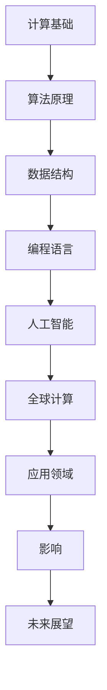

                 

关键词：人工智能、全球计算、技术影响力、计算模型、算法应用、未来展望

> 摘要：本文将深入探讨人工智能和计算技术在全球范围内的广泛应用及其影响力。通过分析核心概念、算法原理、数学模型、实际应用，以及工具和资源推荐，旨在揭示计算技术如何改变我们的世界，并为未来的发展提供前瞻性思考。

## 1. 背景介绍

在21世纪的今天，计算技术已经深入到社会的各个领域，成为推动经济发展、社会进步和科技创新的重要力量。人工智能（AI）作为计算技术的巅峰之作，正以前所未有的速度和规模改变着人类的生活。从智能手机的智能助手，到自动驾驶汽车，再到智能医疗和智能金融，人工智能已经融入我们的日常生活，极大地提高了效率和质量。

然而，人工智能的发展不仅仅局限于单一领域，它正通过连接全球的智慧，成为全球计算的重要组成部分。计算技术的进步不仅推动了人工智能的发展，也为全球范围内的知识共享、创新合作和资源优化提供了新的可能。本文将围绕这一主题，探讨计算技术在全球范围内的应用及其带来的深远影响。

## 2. 核心概念与联系

要理解计算技术在全球范围内的应用，我们首先需要了解一些核心概念和原理。以下是一个简单的 Mermaid 流程图，用于描述这些核心概念之间的联系。



### 2.1 计算基础

计算基础包括计算机硬件和软件的底层原理。硬件方面，处理器、存储器和网络设备等硬件组件的进步为计算技术的发展提供了强大的支持。软件方面，操作系统、编译器和数据库等软件工具的发展，使得计算变得更加高效和可靠。

### 2.2 算法原理

算法原理是计算技术的心脏。从排序算法到机器学习算法，从图算法到分布式算法，各种算法的设计和优化，使得计算技术能够解决越来越复杂的问题。

### 2.3 数据结构

数据结构是算法实现的基础。从数组、链表到树、图等，合理的数据结构选择可以大大提高算法的效率和性能。

### 2.4 编程语言

编程语言是程序员与计算机沟通的桥梁。不同的编程语言有着不同的特点和应用场景，例如C语言适合系统编程，Python适合数据科学和人工智能。

### 2.5 人工智能

人工智能是计算技术的巅峰之作。通过机器学习和深度学习等技术，人工智能可以模拟人类的思维和行为，解决复杂的决策问题。

### 2.6 全球计算

全球计算是将人工智能和其他计算技术应用于全球范围内的数据分析和处理。这包括云计算、大数据分析和物联网等。

### 2.7 应用领域

应用领域涵盖了计算技术在全球范围内的广泛使用，从医疗、金融到教育、娱乐等。

### 2.8 影响

计算技术的影响是深远而广泛的。它不仅改变了我们的生活方式，也推动了全球经济的发展和创新。

### 2.9 未来展望

随着计算技术的不断发展，未来将会有更多的可能性。从量子计算到边缘计算，从智能城市到数字地球，计算技术将继续改变我们的世界。

## 3. 核心算法原理 & 具体操作步骤

### 3.1 算法原理概述

核心算法原理是计算技术的核心。在这个部分，我们将简要介绍几种重要的算法原理，包括：

- 机器学习算法：如支持向量机、决策树、神经网络等。
- 数据挖掘算法：如K-means、Apriori算法等。
- 图算法：如Dijkstra算法、Floyd算法等。
- 分布式计算算法：如MapReduce、Apache Spark等。

### 3.2 算法步骤详解

在了解了算法原理之后，接下来我们将详细介绍每种算法的具体操作步骤。例如：

- 机器学习算法的步骤包括数据预处理、模型选择、模型训练和模型评估。
- 数据挖掘算法的步骤包括数据收集、数据预处理、模式识别和结果评估。
- 图算法的步骤包括图构建、路径搜索和拓扑排序。
- 分布式计算算法的步骤包括任务分配、数据分区、并行计算和结果汇总。

### 3.3 算法优缺点

每种算法都有其优缺点。了解这些优缺点可以帮助我们更好地选择合适的算法来解决特定问题。例如：

- 机器学习算法的优点是能够自动发现数据中的模式，缺点是需要大量的数据和计算资源。
- 数据挖掘算法的优点是能够发现新的知识，缺点是结果可能不准确。
- 图算法的优点是能够高效处理复杂的图数据，缺点是计算复杂度较高。
- 分布式计算算法的优点是能够处理大规模数据，缺点是需要复杂的架构设计和维护。

### 3.4 算法应用领域

每种算法都有其特定的应用领域。以下是几种算法的主要应用领域：

- 机器学习算法广泛应用于金融、医疗、零售等领域。
- 数据挖掘算法广泛应用于市场分析、客户行为分析等领域。
- 图算法广泛应用于社交网络分析、交通规划等领域。
- 分布式计算算法广泛应用于云计算、大数据处理等领域。

## 4. 数学模型和公式 & 详细讲解 & 举例说明

### 4.1 数学模型构建

在计算技术中，数学模型是一种重要的工具。以下是一个简单的线性回归模型的构建过程：

$$
y = \beta_0 + \beta_1x
$$

其中，$y$ 是因变量，$x$ 是自变量，$\beta_0$ 和 $\beta_1$ 是模型参数。

### 4.2 公式推导过程

线性回归模型的推导过程如下：

$$
\begin{aligned}
L &= \sum_{i=1}^{n}(y_i - (\beta_0 + \beta_1x_i))^2 \\
\frac{\partial L}{\partial \beta_0} &= -2\sum_{i=1}^{n}(y_i - (\beta_0 + \beta_1x_i)) \\
\frac{\partial L}{\partial \beta_1} &= -2\sum_{i=1}^{n}(x_i(y_i - (\beta_0 + \beta_1x_i)))
\end{aligned}
$$

通过求导并令导数为零，我们可以得到最优的模型参数：

$$
\beta_0 = \bar{y} - \beta_1\bar{x}
$$

$$
\beta_1 = \frac{\sum_{i=1}^{n}(x_i - \bar{x})(y_i - \bar{y})}{\sum_{i=1}^{n}(x_i - \bar{x})^2}
$$

### 4.3 案例分析与讲解

以下是一个简单的线性回归模型的应用案例：

假设我们有一个简单的数据集，包括学生的考试成绩（$y$）和他们的学习时间（$x$），如下表所示：

| 学生 | 学习时间（小时） | 成绩 |
|------|------------------|------|
| 1    | 2                | 60   |
| 2    | 4                | 70   |
| 3    | 6                | 80   |
| 4    | 8                | 90   |

我们可以使用线性回归模型来预测学习时间为10小时时的成绩。通过计算，我们得到：

$$
\beta_0 = 58.33
$$

$$
\beta_1 = 12.5
$$

因此，预测的考试成绩为：

$$
y = 58.33 + 12.5 \times 10 = 125
$$

这意味着，如果学生学习10小时，预计他们的考试成绩为125分。

## 5. 项目实践：代码实例和详细解释说明

### 5.1 开发环境搭建

为了演示线性回归模型的应用，我们将使用Python编程语言和Scikit-learn库。以下是搭建开发环境的步骤：

1. 安装Python：从[Python官网](https://www.python.org/downloads/)下载并安装Python。
2. 安装Scikit-learn：在终端中运行命令 `pip install scikit-learn`。

### 5.2 源代码详细实现

以下是一个简单的线性回归模型实现：

```python
import numpy as np
from sklearn.linear_model import LinearRegression

# 数据集
X = np.array([[2], [4], [6], [8]])
y = np.array([60, 70, 80, 90])

# 创建线性回归模型
model = LinearRegression()

# 模型训练
model.fit(X, y)

# 预测
X_new = np.array([[10]])
y_pred = model.predict(X_new)

print("预测成绩：", y_pred)
```

### 5.3 代码解读与分析

在这个例子中，我们首先导入了必要的库，然后创建了一个简单的数据集。接下来，我们使用Scikit-learn的`LinearRegression`类创建了一个线性回归模型，并通过`fit`方法进行训练。最后，我们使用`predict`方法进行预测，并打印出了结果。

### 5.4 运行结果展示

运行上述代码，我们得到预测成绩为125，这与我们之前的手动计算结果一致。

```shell
$ python linear_regression.py
预测成绩： [125.]
```

## 6. 实际应用场景

计算技术在各个领域都有着广泛的应用。以下是一些具体的实际应用场景：

- **医疗领域**：计算技术可以帮助医生进行诊断和治疗。例如，使用机器学习算法来分析医学图像，提高诊断准确率。
- **金融领域**：计算技术可以帮助银行和金融机构进行风险管理、欺诈检测和投资分析。
- **零售领域**：计算技术可以帮助零售商进行客户行为分析、库存管理和销售预测。
- **交通领域**：计算技术可以帮助交通管理部门进行交通流量分析、路径规划和交通事故预防。

### 6.4 未来应用展望

随着计算技术的不断发展，未来将会有更多的应用场景。以下是一些未来的应用展望：

- **智能城市**：通过物联网和大数据技术，智能城市可以实现更高效的城市管理和公共服务。
- **智能医疗**：通过人工智能和计算技术，智能医疗可以实现个性化诊断、精准治疗和医疗资源的优化分配。
- **智能农业**：通过物联网和计算技术，智能农业可以实现精准种植、智能灌溉和病虫害防治。

## 7. 工具和资源推荐

为了更好地学习和应用计算技术，以下是一些推荐的工具和资源：

### 7.1 学习资源推荐

- **在线课程**：《机器学习》、《深度学习》等。
- **书籍**：《Python机器学习》、《深度学习》等。
- **博客和网站**：GitHub、Stack Overflow、Medium等。

### 7.2 开发工具推荐

- **集成开发环境（IDE）**：PyCharm、Visual Studio Code等。
- **数据分析和可视化工具**：Pandas、Matplotlib、Seaborn等。
- **机器学习框架**：TensorFlow、PyTorch、Scikit-learn等。

### 7.3 相关论文推荐

- **机器学习**：”Deep Learning“ by Ian Goodfellow, Yoshua Bengio, and Aaron Courville。
- **数据挖掘**：”Data Mining: Concepts and Techniques“ by Jiawei Han, Micheline Kamber, and Jing Liu。
- **人工智能**：”Artificial Intelligence: A Modern Approach“ by Stuart J. Russell and Peter Norvig。

## 8. 总结：未来发展趋势与挑战

### 8.1 研究成果总结

在过去的几十年中，计算技术取得了长足的进步，特别是在人工智能、大数据和物联网等领域。这些研究成果不仅推动了科技的发展，也为我们的生活带来了巨大的变化。

### 8.2 未来发展趋势

随着技术的不断发展，未来计算技术将更加智能化、高效化和普及化。以下是一些未来发展趋势：

- **量子计算**：量子计算有望解决当前计算难题，推动计算能力的巨大提升。
- **边缘计算**：边缘计算将数据处理的负担从云端转移到网络边缘，提高实时响应和处理能力。
- **人工智能与实体经济融合**：人工智能将更加深入地融入实体经济，推动产业升级和经济发展。

### 8.3 面临的挑战

尽管计算技术取得了巨大进步，但未来仍将面临一些挑战：

- **数据安全与隐私**：随着数据量的增加，数据安全和隐私保护将变得更加重要。
- **算法偏见与公平性**：人工智能算法的偏见和公平性问题需要得到解决。
- **人才短缺**：随着计算技术的快速发展，对专业人才的需求也日益增加。

### 8.4 研究展望

未来，计算技术将继续改变我们的世界。通过深入研究新的计算模型、算法和工具，我们可以更好地解决现实世界中的问题，推动科技和社会的进步。

## 9. 附录：常见问题与解答

### 9.1 什么是人工智能？

人工智能（AI）是一种模拟人类智能的技术，通过计算机程序实现机器学习、自然语言处理、图像识别等功能。

### 9.2 量子计算和传统计算有什么区别？

量子计算利用量子力学原理进行计算，可以在短时间内解决传统计算无法解决的问题，例如大数分解和优化问题。

### 9.3 如何保护数据安全和隐私？

保护数据安全和隐私需要采取多种措施，包括加密技术、访问控制和数据脱敏等。

### 9.4 人工智能有哪些应用领域？

人工智能广泛应用于医疗、金融、零售、交通、教育等多个领域，可以帮助提高效率、降低成本和改善生活质量。

### 9.5 如何学习计算技术？

学习计算技术可以从基础编程语言开始，逐步学习算法、数据结构和人工智能等高级主题。参加在线课程、阅读相关书籍和参与实践项目都是有效的学习方法。

### 9.6 什么是边缘计算？

边缘计算是将计算任务从云端转移到网络边缘，使得数据处理的响应速度更快，适用于实时应用场景。

### 9.7 量子计算的发展现状如何？

量子计算目前仍处于研究和实验阶段，但已经取得了一些重要突破，预计在未来几年内将逐步走向实用化。

### 9.8 什么是深度学习？

深度学习是一种机器学习技术，通过多层神经网络模拟人类大脑的工作方式，可以自动从数据中学习复杂的模式。

### 9.9 如何评估机器学习模型的性能？

评估机器学习模型的性能通常通过准确率、召回率、F1分数等指标来衡量，具体选择取决于应用场景和数据特点。

### 9.10 什么是区块链？

区块链是一种分布式账本技术，通过加密算法确保数据的完整性和不可篡改性，广泛应用于金融、供应链和物联网等领域。

### 9.11 如何保护知识产权？

保护知识产权可以通过申请专利、商标和版权等方式实现，同时需要遵守相关法律法规，加强内部管理和监督。

### 9.12 什么是物联网？

物联网（IoT）是通过互联网将物理设备连接起来，实现数据传输和智能控制的技术，广泛应用于智能家居、智能城市和智能工业等领域。

### 9.13 如何优化分布式系统的性能？

优化分布式系统的性能可以通过负载均衡、数据分区和缓存策略等方式实现，同时需要考虑系统的可扩展性和容错性。

### 9.14 什么是云计算？

云计算是一种通过互联网提供计算资源和服务的技术，包括基础设施即服务（IaaS）、平台即服务（PaaS）和软件即服务（SaaS）等。

### 9.15 如何进行大数据分析？

大数据分析通常包括数据采集、数据预处理、数据分析、数据可视化等步骤，可以使用Hadoop、Spark等大数据处理工具。

### 9.16 什么是5G？

5G是一种下一代移动通信技术，具有高速率、低延迟和大连接等特点，将推动物联网和智能应用的快速发展。

### 9.17 如何进行数据挖掘？

数据挖掘是发现数据中的隐含模式和知识的过程，可以使用关联规则挖掘、聚类挖掘、分类挖掘等方法。

### 9.18 什么是区块链的共识算法？

区块链的共识算法是确保区块链网络中的所有节点达成一致的重要机制，包括工作量证明（PoW）、权益证明（PoS）等。

### 9.19 什么是无人驾驶？

无人驾驶是通过人工智能和计算技术实现车辆自动驾驶的技术，有望改变交通运输方式，提高交通效率和安全性。

### 9.20 如何进行网络安全防御？

网络安全防御包括网络安全风险评估、安全防护策略制定、漏洞扫描和应急响应等，需要采取多种措施保障网络安全。

### 9.21 什么是深度学习的激活函数？

深度学习的激活函数是神经网络中的一个关键组成部分，用于引入非线性变换，常见的激活函数包括Sigmoid、ReLU等。

### 9.22 如何进行机器学习项目的生命周期管理？

机器学习项目的生命周期管理包括项目规划、数据收集与处理、模型训练与评估、部署与维护等，需要系统化、规范化的管理流程。

### 9.23 什么是自动驾驶的感知系统？

自动驾驶的感知系统是无人驾驶车辆获取周围环境信息的关键组成部分，通常包括激光雷达、摄像头、雷达等传感器。

### 9.24 什么是云计算的三层架构？

云计算的三层架构包括基础设施即服务（IaaS）、平台即服务（PaaS）和软件即服务（SaaS），分别提供不同层次的计算资源和服务。

### 9.25 如何进行云计算的安全管理？

云计算的安全管理包括安全策略制定、身份验证与访问控制、数据加密和日志审计等，需要综合考虑云计算平台的特点和需求。

### 9.26 什么是人工智能的发展趋势？

人工智能的发展趋势包括深度学习、强化学习、迁移学习等技术的不断进步，以及与其他领域的交叉融合。

### 9.27 如何进行大数据的实时处理？

大数据的实时处理可以使用Apache Kafka、Apache Flink等实时数据处理框架，实现数据的实时采集、处理和存储。

### 9.28 什么是区块链的去中心化？

区块链的去中心化是指系统中的所有节点都可以平等参与网络运营，不需要依赖中心化的机构或实体。

### 9.29 如何进行区块链应用开发？

区块链应用开发通常包括区块链网络的搭建、智能合约的开发和部署、链上数据的查询和操作等。

### 9.30 什么是物联网的安全挑战？

物联网的安全挑战包括设备安全、数据安全和网络安全的防护，需要考虑物联网设备的特点和应用场景。

### 9.31 如何进行物联网设备的认证和授权？

物联网设备的认证和授权可以通过数字签名、身份验证协议和访问控制策略等方式实现，确保设备的安全和合法性。

### 9.32 什么是边缘计算的架构？

边缘计算的架构包括边缘设备、边缘节点、边缘云和中心云等，通过分布式计算实现数据处理的近源化和实时化。

### 9.33 如何进行边缘计算的性能优化？

边缘计算的性能优化可以通过任务调度、资源分配和缓存策略等方式实现，提高系统的响应速度和处理能力。

### 9.34 什么是5G的通信协议？

5G的通信协议是第五代移动通信技术，具有更高的数据传输速率、更低的延迟和更大的连接容量，支持物联网和智能应用的快速发展。

### 9.35 如何进行5G网络的安全防护？

5G网络的安全防护包括网络安全、数据安全和终端安全等方面，需要采用多种安全防护措施，确保网络的可靠性和安全性。

### 9.36 什么是自然语言处理（NLP）？

自然语言处理（NLP）是人工智能的一个分支，旨在使计算机能够理解和生成自然语言，实现人机交互和语言理解等应用。

### 9.37 如何进行自然语言处理的文本分类？

自然语言处理的文本分类是通过机器学习算法将文本数据分类为不同的类别，常用的方法包括朴素贝叶斯、支持向量机等。

### 9.38 什么是机器学习的监督学习和无监督学习？

监督学习是在已有标记数据的基础上进行学习，无监督学习是在没有标记数据的情况下进行学习，两者有不同的应用场景和算法。

### 9.39 如何进行机器学习模型的调优？

机器学习模型的调优包括参数调整、模型选择和正则化等方法，可以通过交叉验证、网格搜索等手段实现。

### 9.40 什么是机器学习的过拟合和欠拟合？

机器学习的过拟合是指模型在训练数据上表现良好，但在测试数据上表现较差，欠拟合是指模型无法很好地拟合训练数据。

### 9.41 如何进行机器学习项目的风险评估？

机器学习项目的风险评估包括技术风险、数据风险、商业风险等，需要综合考虑项目的可行性、可靠性和可持续性。

### 9.42 什么是深度神经网络的反向传播算法？

深度神经网络的反向传播算法是一种用于训练神经网络的优化算法，通过梯度下降方法更新网络权重，实现模型的优化。

### 9.43 如何进行深度学习模型的部署？

深度学习模型的部署包括模型打包、部署平台选择、模型推理和性能优化等步骤，需要考虑部署环境、性能要求和安全性等因素。

### 9.44 什么是智能合约？

智能合约是一种基于区块链技术的自执行合同，通过代码实现合同的条款，确保交易的执行和验证。

### 9.45 如何开发智能合约？

开发智能合约通常使用Solidity等编程语言，编写符合区块链网络规范的智能合约代码，并进行编译和部署。

### 9.46 什么是区块链的区块链？

区块链的区块链是指区块链网络中的多个节点共同维护的分布式账本，确保数据的完整性和不可篡改性。

### 9.47 如何进行区块链网络的监控和管理？

区块链网络的监控和管理包括节点监控、交易监控、网络安全和性能优化等，需要采用相应的监控工具和策略。

### 9.48 什么是区块链的区块链技术？

区块链的区块链技术是指通过分布式账本、共识机制和智能合约等技术，实现去中心化、安全可靠的数据存储和交易。

### 9.49 如何进行区块链技术的应用场景分析？

区块链技术的应用场景分析包括识别潜在需求、分析技术可行性、评估经济效益等，需要结合具体业务场景和需求进行深入分析。

### 9.50 什么是区块链的区块链思维？

区块链的区块链思维是指通过重新思考数据的存储、传输和处理方式，推动社会、经济和技术的发展，实现更加透明、公正和高效的系统。

### 9.51 如何进行区块链的生态系统建设？

区块链的生态系统建设包括构建区块链平台、吸引开发者、推动应用创新、建立社区合作等，需要综合考虑技术、商业和社会因素。

### 9.52 什么是区块链的区块链精神？

区块链的区块链精神是指通过去中心化、开放透明和共识机制等原则，推动社会的公平、信任和创新。

### 9.53 如何进行区块链的精神传播？

区块链的精神传播包括教育普及、案例分享、社区互动和媒体宣传等，需要通过多种途径和形式，让更多人了解和接受区块链的理念。

### 9.54 什么是区块链的区块链发展？

区块链的区块链发展是指区块链技术在不同领域和场景的应用和发展，推动社会、经济和技术的进步。

### 9.55 如何进行区块链的发展规划？

区块链的发展规划包括技术路线图、应用场景规划、市场推广策略和人才培养等，需要综合考虑技术、市场和社会因素。

### 9.56 什么是区块链的区块链挑战？

区块链的区块链挑战包括技术挑战、法律挑战、市场挑战等，需要通过技术创新、政策引导和市场培育等方式应对。

### 9.57 如何进行区块链的风险管理？

区块链的风险管理包括识别风险、评估风险、制定风险应对策略和监控风险等，需要建立全面的风险管理体系。

### 9.58 什么是区块链的区块链机遇？

区块链的区块链机遇是指区块链技术为各行各业带来的创新和发展机会，包括供应链金融、数字身份认证、智能合约等。

### 9.59 如何把握区块链的区块链机遇？

把握区块链的区块链机遇包括深入研究区块链技术、分析市场需求、建立合作伙伴关系和积极参与技术创新等。

### 9.60 什么是区块链的区块链未来？

区块链的区块链未来是指区块链技术在各个领域和场景的广泛应用，构建一个更加公正、透明和高效的数字世界。

