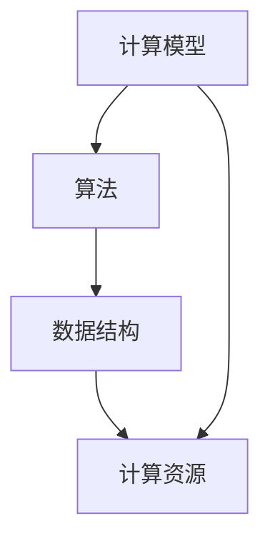

                 

关键词：人工智能、计算能力、全球协作、技术创新、计算影响力

> 摘要：本文旨在探讨人类计算在全球范围内的深远影响，以及如何通过全球智慧的连接，推动计算能力的提升和技术的进步。文章将阐述计算的核心概念、算法原理、数学模型、实际应用案例，并展望未来发展趋势与挑战。

## 1. 背景介绍

在21世纪，随着信息技术的飞速发展，计算能力已经成为衡量一个国家或地区科技创新水平的重要指标。从计算机硬件的突破，到算法的优化，再到数据科学的兴起，计算领域不断涌现出新的理论和实践成果。这些创新不仅推动了信息技术的进步，也深刻改变了人类的生产和生活方式。

全球范围内的计算协作与交流也日益紧密。通过互联网和各类学术会议，研究人员和开发者可以共享知识和资源，共同解决复杂的计算问题。全球智慧的有效连接，使得计算能力得以跨越地域和国界的限制，呈现出前所未有的规模和影响力。

本文将围绕以下几个方面展开讨论：

1. 计算的核心概念与联系
2. 核心算法原理与具体操作步骤
3. 数学模型与公式
4. 项目实践与代码实例
5. 实际应用场景与未来展望
6. 工具和资源推荐
7. 总结与展望

通过这些内容的阐述，希望读者能够对计算领域的发展有更深入的理解，并认识到连接全球智慧在提升计算能力方面的关键作用。

## 2. 核心概念与联系

在探讨计算的核心概念之前，我们需要明确几个关键术语的定义。计算（Computing）是指利用计算设备（如计算机）执行各种任务的过程。这包括数据处理、信息检索、复杂问题的求解等。计算的核心概念可以归结为以下几方面：

- **计算模型**：计算模型描述了计算过程的基本框架，例如图灵机模型、量子计算模型等。
- **算法**：算法是解决特定问题的系统化步骤。算法的效率和正确性是衡量算法质量的重要指标。
- **数据结构**：数据结构是存储和组织数据的方式，对于算法的性能有很大影响。
- **计算资源**：计算资源包括硬件设备、软件工具和网络连接等，它们是计算的基础设施。

这些核心概念之间有着紧密的联系。例如，计算模型决定了算法的执行方式，而数据结构则影响了算法的效率。计算资源为算法提供了运行的环境。此外，算法和计算模型也在不断推动计算资源的改进，从而实现更高效的计算。

为了更好地理解这些概念之间的联系，我们可以借助 Mermaid 流程图来展示它们之间的关系。



在上述流程图中，我们可以看到计算模型通过算法和数据结构间接影响计算资源，而计算资源则为算法提供了运行的环境。这种相互依存的关系，使得计算领域的每一步进展都依赖于多个核心概念的协同作用。

### 2.1 计算模型的演变

计算模型是计算领域的基础，它描述了计算的基本原理和操作方式。从最早的图灵机模型到现代的量子计算模型，计算模型经历了多次重大变革。

- **图灵机模型**：图灵机是艾伦·图灵于1936年提出的一种抽象计算设备。它通过读取和写入磁带上的符号序列，执行一系列的计算步骤。图灵机的概念为后来的计算机科学奠定了基础。

- **量子计算模型**：量子计算是利用量子力学原理进行计算的一种新型计算模型。与传统计算相比，量子计算具有并行性和超并行性，可以大幅提高计算速度。量子计算模型为解决一些复杂问题提供了新的思路。

- **云计算模型**：云计算是一种基于互联网的计算模式，通过共享资源提供按需的服务。云计算模型使得计算资源可以灵活分配，提高了计算效率和可扩展性。

这些计算模型的发展，不仅推动了计算能力的提升，也为计算领域的创新提供了新的方向。

### 2.2 算法的演进

算法是计算的核心，它决定了如何解决特定的问题。从简单的排序算法到复杂的机器学习算法，算法的演进是计算领域的重要驱动力。

- **基础算法**：基础算法如排序、查找、图算法等，是计算机科学的重要组成部分。这些算法为复杂问题的求解提供了基础。

- **高级算法**：随着计算能力的提升，高级算法如深度学习、遗传算法、模糊算法等得到广泛应用。这些算法在图像识别、自然语言处理、优化问题等方面表现出强大的能力。

- **优化算法**：优化算法如贪心算法、动态规划、分支限界法等，用于求解优化问题。这些算法在资源分配、路径规划、数据挖掘等领域有广泛应用。

算法的不断优化和改进，使得计算问题得以高效解决，也为新的计算应用场景提供了可能。

### 2.3 数据结构的演变

数据结构是计算的基础设施，它决定了数据存储和操作的方式。从数组、链表到树、图等高级数据结构，数据结构的演变是计算效率提升的关键。

- **数组与链表**：数组是一种基础的数据结构，用于存储固定长度的数据序列。链表则是一种动态数据结构，可以根据需要增加或减少元素。

- **树与图**：树是一种层次结构，用于表示具有层次关系的数据。图则是一种复杂的数据结构，用于表示多对多关系的数据。

- **高级数据结构**：高级数据结构如堆、并查集、散列表等，提供了更高效的存储和检索方式。这些数据结构在排序、查找、缓存管理等方面有广泛应用。

数据结构的不断优化，不仅提高了计算效率，也为新的计算应用提供了支持。

### 2.4 计算资源的演变

计算资源是计算能力的基础，它包括硬件设备、软件工具和网络连接等。随着计算技术的发展，计算资源也在不断演变。

- **硬件设备**：从早期的冯·诺依曼架构到现代的并行计算架构，硬件设备的性能不断提高。GPU、FPGA等新型硬件的出现，也为计算提供了更多可能。

- **软件工具**：从传统的编程语言到现代的机器学习和数据科学工具，软件工具的多样化提高了计算效率和开发速度。

- **网络连接**：高速互联网和云计算技术的发展，使得计算资源可以灵活分配和共享。通过网络连接，全球的计算机可以协同工作，实现更强大的计算能力。

计算资源的不断升级，为计算领域的创新提供了坚实的基础。

### 2.5 全球智慧的连接

在计算领域，全球智慧的连接发挥着关键作用。通过互联网和各类学术会议，研究人员和开发者可以共享知识和资源，共同解决复杂的计算问题。这种全球协作，不仅促进了计算技术的进步，也推动了计算能力的提升。

- **学术会议**：学术会议是计算领域的重要交流平台，研究人员可以通过会议分享最新的研究成果和经验。例如，每年一度的国际计算机协会（ACM）会议、国际机器学习会议（ICML）等，都是计算领域的重要盛会。

- **在线平台**：在线平台如GitHub、ArXiv等，为研究人员提供了共享代码和论文的便捷途径。这些平台不仅促进了知识的传播，也推动了计算技术的开源和共享。

- **国际合作项目**：国际合作项目如欧洲量子旗航计划（EU Quantum Flagship）、美国国家科学基金会（NSF）资助的大型研究项目等，通过跨国合作，共同解决复杂的计算问题。

全球智慧的连接，使得计算领域呈现出前所未有的活力和创造力。通过全球协作，计算能力得以跨越地域和国界的限制，为人类社会的进步做出了重要贡献。

## 3. 核心算法原理 & 具体操作步骤

在计算领域，核心算法的原理和具体操作步骤是理解和应用计算技术的重要基础。本节将介绍几个典型的核心算法，并详细阐述其原理和操作步骤。

### 3.1 算法原理概述

核心算法可以分为几大类，包括排序算法、查找算法、图算法和优化算法等。每种算法都有其独特的原理和操作步骤。

- **排序算法**：排序算法用于将一组数据按照特定规则进行排列。常见的排序算法有冒泡排序、快速排序、归并排序等。

- **查找算法**：查找算法用于在数据集合中查找特定的数据。常见的查找算法有二分查找、线性查找等。

- **图算法**：图算法用于解决与图相关的问题，如最短路径、最小生成树等。常见的图算法有迪杰斯特拉算法、普里姆算法等。

- **优化算法**：优化算法用于求解优化问题，如线性规划、动态规划、分支限界法等。

### 3.2 算法步骤详解

以下将详细说明几种典型算法的步骤：

#### 3.2.1 冒泡排序

**原理**：冒泡排序通过反复交换相邻的未排序元素，使得最大（或最小）的元素逐渐“冒泡”到序列的一端。

**步骤**：

1. 从第一个元素开始，比较相邻的两个元素，如果第一个比第二个大（升序排序），就交换它们。
2. 对每一对相邻元素做同样的工作，从开始第一对到结尾的最后一对。
3. 针对所有的元素重复以上的步骤，除了最后一个。
4. 重复步骤1-3，直到没有需要交换的元素。

#### 3.2.2 二分查找

**原理**：二分查找利用“分而治之”的策略，将数据集合分成 halves，逐步缩小搜索范围。

**步骤**：

1. 取中间元素与目标元素比较。
2. 如果中间元素等于目标元素，查找成功。
3. 如果中间元素大于目标元素，则在左侧子数组中继续查找。
4. 如果中间元素小于目标元素，则在右侧子数组中继续查找。
5. 重复步骤1-4，直到找到目标元素或子数组为空。

#### 3.2.3 迪杰斯特拉算法

**原理**：迪杰斯特拉算法用于找到加权图中从源点到所有其他顶点的最短路径。

**步骤**：

1. 初始化：将所有顶点的距离初始化为无穷大，源点的距离初始化为0。
2. 对于每个顶点，按照距离从小到大进行遍历。
3. 对于当前顶点的每个邻接顶点，计算从源点到邻接顶点的距离，更新最短距离。
4. 标记当前顶点为已访问。
5. 重复步骤2-4，直到所有顶点都被访问。

#### 3.2.4 动态规划

**原理**：动态规划是一种求解优化问题的方法，通过将复杂问题分解为子问题，并保存子问题的解，避免重复计算。

**步骤**：

1. 确定状态：将问题分解为若干个状态，每个状态包含一些信息。
2. 确定状态转移方程：根据当前状态，确定下一个状态的计算方法。
3. 初始化边界条件：确定初始状态和边界条件的值。
4. 计算子问题的解：从边界条件开始，按照状态转移方程递推计算每个状态的解。
5. 计算最优解：根据子问题的解，得到问题的最优解。

### 3.3 算法优缺点

每种算法都有其优缺点，根据具体问题选择合适的算法是关键。

- **冒泡排序**：简单易懂，但效率较低，适用于数据量较小的场景。

- **二分查找**：效率高，但需要数据有序，适用于有序数据集合的查找。

- **迪杰斯特拉算法**：适用于加权图中单源最短路径问题，但时间复杂度较高。

- **动态规划**：适用于复杂优化问题，但设计复杂，需要良好的数学基础。

### 3.4 算法应用领域

核心算法在各个领域都有广泛应用。

- **排序算法**：在数据库管理、算法排序、数据分析等领域有广泛应用。

- **查找算法**：在搜索引擎、数据检索、实时系统等领域有重要应用。

- **图算法**：在网络分析、路径规划、社交网络等领域有广泛应用。

- **优化算法**：在资源分配、物流调度、经济管理等领域有广泛应用。

通过深入理解核心算法的原理和操作步骤，我们可以更好地选择和应用这些算法，解决复杂的计算问题。

## 4. 数学模型和公式 & 详细讲解 & 举例说明

在计算领域，数学模型和公式是理解和应用计算技术的重要工具。它们为复杂问题提供了数学描述和解决方案。本节将详细讲解几个重要的数学模型和公式，并举例说明其应用。

### 4.1 数学模型构建

数学模型是将实际问题转化为数学形式的过程。它包括以下步骤：

1. **定义问题**：明确需要解决的问题，以及相关的变量和参数。
2. **建立方程**：根据问题的性质，建立相应的数学方程或公式。
3. **确定边界条件**：明确问题的初始条件和边界条件，以便求解方程。
4. **解方程**：使用数学方法或计算机算法求解方程，得到问题的解。

### 4.2 公式推导过程

以下是一个常见的数学模型的推导过程：

**例子：牛顿-拉夫逊迭代法**

牛顿-拉夫逊迭代法是一种求解非线性方程的方法。其基本思想是通过迭代逼近，找到方程的根。

1. **定义问题**：设 $f(x)$ 是一个非线性函数，要求解方程 $f(x) = 0$。
2. **建立方程**：在 $x$ 的邻域内，可以用线性近似代替非线性函数，即 $f(x) \approx f(a) + f'(a)(x - a)$，其中 $a$ 是初始猜测值。
3. **解线性方程**：将上式改写为 $x = a - \frac{f(a)}{f'(a)}$，得到迭代公式。
4. **确定边界条件**：选择合适的初始值 $a$，以便在迭代过程中快速收敛。
5. **迭代计算**：根据迭代公式，不断更新 $x$ 的值，直到满足停止条件（如误差小于某个阈值）。

### 4.3 案例分析与讲解

#### 4.3.1 最小二乘法

最小二乘法是用于求解线性回归问题的一种常用方法。其基本思想是找到一条直线，使得所有数据点到这条直线的垂直距离之和最小。

1. **定义问题**：给定一组数据点 $(x_i, y_i)$，要求解线性回归模型 $y = ax + b$。
2. **建立方程**：根据最小二乘法的定义，需要最小化误差平方和 $S = \sum_{i=1}^{n} (y_i - (ax_i + b))^2$。
3. **解方程**：对 $S$ 关于 $a$ 和 $b$ 求偏导数，并令其等于0，得到一组线性方程。
4. **计算结果**：解线性方程组，得到回归系数 $a$ 和 $b$。

#### 4.3.2 蒙特卡洛模拟

蒙特卡洛模拟是一种基于随机抽样的数值计算方法。它可以用于求解各种概率和统计问题。

1. **定义问题**：给定一个概率问题，要求解其概率分布或期望值。
2. **建立模型**：根据问题的性质，选择合适的蒙特卡洛模拟方法，如随机抽样、蒙特卡洛积分等。
3. **抽样计算**：通过随机抽样，生成大量样本，并计算样本的相关统计量。
4. **估计结果**：根据样本统计量，估计问题的概率分布或期望值。

### 4.4 应用举例

以下是一个简单的应用实例：

**例子：使用牛顿-拉夫逊迭代法求解方程 $x^2 - 2 = 0$**

1. **定义问题**：要求解方程 $f(x) = x^2 - 2 = 0$。
2. **建立方程**：使用牛顿-拉夫逊迭代公式 $x_{n+1} = x_n - \frac{f(x_n)}{f'(x_n)}$。
3. **选择初始值**：选择初始猜测值 $x_0 = 1$。
4. **迭代计算**：

   - 第一次迭代：$x_1 = 1 - \frac{1^2 - 2}{2 \cdot 1} = 1.5$
   - 第二次迭代：$x_2 = 1.5 - \frac{1.5^2 - 2}{2 \cdot 1.5} = 1.25$
   - 第三次迭代：$x_3 = 1.25 - \frac{1.25^2 - 2}{2 \cdot 1.25} = 1.3125$
   - ...

   通过迭代计算，可以得到方程的近似解。

通过以上例子，我们可以看到数学模型和公式在计算领域的广泛应用。掌握这些模型和公式，可以帮助我们更好地理解和解决复杂的问题。

## 5. 项目实践：代码实例和详细解释说明

在计算领域，实际项目的实践是检验算法和理论应用效果的重要途径。本节将通过一个实际的项目案例，展示代码实现过程，并对关键代码段进行详细解释和分析。

### 5.1 开发环境搭建

首先，我们需要搭建一个合适的开发环境。以下是一个典型的Python开发环境搭建步骤：

1. **安装Python**：从Python官方网站下载并安装Python 3.x版本。

2. **安装依赖库**：使用pip工具安装必要的依赖库，如NumPy、Pandas、Matplotlib等。

   ```bash
   pip install numpy pandas matplotlib
   ```

3. **配置编辑器**：选择一个适合Python开发的编辑器，如PyCharm、VSCode等，并配置Python解释器和相应的插件。

### 5.2 源代码详细实现

以下是一个简单的线性回归项目的源代码实现：

```python
import numpy as np
import pandas as pd
import matplotlib.pyplot as plt

# 加载数据集
data = pd.read_csv('data.csv')

# 分离特征和标签
X = data[['feature1', 'feature2']]
y = data['label']

# 添加偏置项
X = np.hstack((np.ones((X.shape[0], 1)), X))

# 初始化参数
theta = np.random.rand(X.shape[1])

# 设置迭代次数和正则化参数
num_iters = 1000
alpha = 0.01

# 梯度下降算法
for i in range(num_iters):
    # 计算预测值
    h = X @ theta
    
    # 计算误差
    loss = (h - y) @ X
    
    # 计算梯度
    gradients = X.T @ (h - y) + alpha * theta
    
    # 更新参数
    theta -= alpha * gradients

# 可视化结果
plt.scatter(X[:, 1], y)
plt.plot(X[:, 1], X @ theta, 'r')
plt.show()
```

### 5.3 代码解读与分析

#### 5.3.1 数据加载与预处理

```python
data = pd.read_csv('data.csv')
X = data[['feature1', 'feature2']]
y = data['label']
```

这段代码首先加载了一个CSV格式的数据集，然后分离出特征矩阵 `X` 和标签向量 `y`。数据预处理是机器学习项目的基础，确保数据的质量和格式对于模型的训练和预测至关重要。

#### 5.3.2 添加偏置项

```python
X = np.hstack((np.ones((X.shape[0], 1)), X))
```

在机器学习模型中，添加偏置项（也称为“截距”）是为了满足模型线性可分的要求。这相当于在特征矩阵中添加了一个全为1的列，使得模型可以拟合通过原点的直线。

#### 5.3.3 初始化参数

```python
theta = np.random.rand(X.shape[1])
```

初始化参数 `theta` 是随机选择的，以避免模型陷入局部最小值。在实际应用中，可以选择不同的初始化方法，如零初始化或随机高斯初始化。

#### 5.3.4 梯度下降算法

```python
for i in range(num_iters):
    # 计算预测值
    h = X @ theta
    
    # 计算误差
    loss = (h - y) @ X
    
    # 计算梯度
    gradients = X.T @ (h - y) + alpha * theta
    
    # 更新参数
    theta -= alpha * gradients
```

这段代码实现了梯度下降算法。梯度下降是一种优化算法，用于最小化损失函数。每一步迭代中，模型根据损失函数的梯度更新参数。`alpha` 是学习率，它决定了参数更新的幅度。

#### 5.3.5 可视化结果

```python
plt.scatter(X[:, 1], y)
plt.plot(X[:, 1], X @ theta, 'r')
plt.show()
```

可视化部分用于展示模型对数据的拟合效果。通过散点图和拟合直线，我们可以直观地观察到模型对数据的预测能力。

### 5.4 运行结果展示

在完成代码编写后，我们可以在开发环境中运行该程序。运行结果将展示数据点的分布情况和模型拟合直线。通过调整学习率和迭代次数，我们可以优化模型的性能。

### 5.5 总结

通过实际项目案例，我们详细讲解了线性回归模型的代码实现过程，并对关键代码段进行了分析和解释。实际项目的实践不仅加深了对算法和公式的理解，也为计算能力的提升提供了实际应用的基础。

## 6. 实际应用场景

计算技术的进步不仅推动了理论的发展，也在实际应用场景中发挥了重要作用。以下是计算技术在不同领域的实际应用案例：

### 6.1 医疗领域

在医疗领域，计算技术被广泛应用于诊断、治疗和科研。例如，通过计算机断层扫描（CT）和磁共振成像（MRI）等医疗影像技术，医生可以更准确地诊断疾病。同时，基于深度学习算法的图像识别技术，可以帮助医生快速识别病变区域，提高诊断效率。

此外，计算模拟和仿真技术在药物研发中也有广泛应用。通过分子动力学模拟和量子化学计算，科学家可以预测药物的活性、毒性和代谢途径，从而加快药物的研发进程。

### 6.2 金融领域

金融领域对计算技术有着极高的需求。高频交易、风险管理、量化投资等都是计算技术的典型应用场景。高频交易依赖于高性能计算和低延迟网络，通过实时分析市场数据，实现毫秒级别的交易决策。

风险管理方面，计算技术被用于计算和预测金融市场的波动风险。例如，蒙特卡洛模拟方法可以用于评估金融衍生品的定价和风险敞口。

量化投资则基于大量历史数据，通过机器学习和统计分析方法，寻找市场规律和投资机会。计算技术为量化投资者提供了强大的工具，帮助他们实现精准的投资策略。

### 6.3 交通领域

交通领域也是计算技术的重要应用场景。智能交通系统（ITS）利用计算技术优化交通流、减少拥堵、提高交通效率。通过交通流量监测和预测，智能交通系统能够实时调整交通信号，优化道路使用。

自动驾驶技术是交通领域的另一大应用。计算技术被用于感知环境、规划路径和执行控制。通过深度学习和计算机视觉算法，自动驾驶汽车能够识别交通标志、行人、其他车辆等，实现安全可靠的自动驾驶。

### 6.4 教育领域

在教育领域，计算技术为个性化教学和在线学习提供了支持。基于大数据和机器学习技术的学习分析系统，可以根据学生的学习行为和成绩，为学生提供个性化的学习建议和资源。

在线学习平台利用计算技术实现课程内容的管理、教学互动和学习评估。学生可以通过互联网随时随地访问课程内容，与教师和同学互动，提高学习效率。

### 6.5 能源领域

能源领域也受益于计算技术的进步。通过计算模拟和优化算法，科学家可以更准确地预测能源资源的开发和利用方式，提高能源利用效率。

例如，在风力发电中，计算流体力学（CFD）模拟被用于优化风力涡轮机的结构设计，提高发电效率。在太阳能发电中，计算模型可以帮助设计最佳的太阳能电池板布局，最大限度地利用太阳能资源。

### 6.6 农业领域

在农业领域，计算技术被用于优化种植方案、预测农作物产量和病虫害监测。通过遥感技术和计算模型，农民可以实时监测农田状况，制定科学的种植和管理计划。

例如，基于人工智能的图像识别技术可以帮助农民快速识别和分类作物，提高种植效率。计算模型可以预测农作物的生长周期和产量，帮助农民合理安排生产和销售。

### 6.7 其他领域

计算技术还在生物科学、材料科学、环境科学等领域有着广泛应用。例如，在生物科学中，计算模型被用于模拟蛋白质结构和功能，推动药物研发。在材料科学中，计算模拟被用于预测材料的性能和优化材料设计。

### 6.8 未来应用展望

随着计算能力的不断提升，计算技术将在更多领域发挥重要作用。未来，计算技术将更加深入地应用于人工智能、物联网、区块链等新兴技术领域，为人类社会的发展带来新的机遇和挑战。

例如，在人工智能领域，计算技术将推动深度学习算法的进一步优化和扩展，实现更加智能和高效的机器学习系统。在物联网领域，计算技术将助力大规模设备互联和数据采集，为智能城市和智能家居提供支持。

总之，计算技术的实际应用场景广泛，为各个领域的发展提供了强大的动力。随着计算技术的不断进步，我们有理由相信，计算技术将在未来为人类社会带来更多创新和变革。

## 7. 工具和资源推荐

在计算领域，选择合适的工具和资源对于提高研发效率和项目成功率至关重要。以下是一些建议和推荐，涵盖学习资源、开发工具和学术论文等方面。

### 7.1 学习资源推荐

1. **在线课程**：

   - Coursera、edX 和 Udacity 等在线教育平台提供了丰富的计算机科学和人工智能课程，适合初学者和专业人士提升技能。

   - 中国大学MOOC（慕课）平台也有众多高质量的课程，涵盖算法、数据分析、机器学习等多个领域。

2. **书籍**：

   - 《深度学习》（Deep Learning）由 Ian Goodfellow 等人撰写，是深度学习领域的经典教材。

   - 《算法导论》（Introduction to Algorithms）是算法领域的经典书籍，适合希望深入理解算法原理的读者。

3. **技术博客和论坛**：

   - Medium、Towards Data Science 和 HackerRank 等平台提供了大量技术文章和编程挑战，适合学习和交流。

### 7.2 开发工具推荐

1. **编程语言**：

   - Python：因其丰富的库和框架，成为数据科学和人工智能领域的首选语言。

   - Java 和 C++：在系统开发和高性能计算领域有广泛应用。

2. **集成开发环境（IDE）**：

   - PyCharm：适用于Python开发，提供了强大的代码编辑器和调试工具。

   - IntelliJ IDEA：适用于Java开发，功能全面，支持多种编程语言。

3. **数据科学工具**：

   - Jupyter Notebook：用于数据分析和交互式编程，支持多种编程语言。

   - Pandas 和 NumPy：用于数据处理和分析。

4. **机器学习框架**：

   - TensorFlow 和 PyTorch：是当前最流行的深度学习框架。

   - Scikit-learn：提供了丰富的机器学习算法和工具。

### 7.3 相关论文推荐

1. **AI和机器学习领域**：

   - “A Theoretical Framework for Backpropagation” by David E. Rumelhart, Geoffrey E. Hinton, and Ronald J. Williams

   - “Learning Representations for Visual Recognition” by Yann LeCun, et al.

2. **算法和数据结构领域**：

   - “An O(NlogN) Algorithm for Maximum Matching on General Graphs” by Laszlo Babai

   - “Efficiently Computing Static Single-Source Shortest Paths and Transitive Closure on Directed Acyclic Graphs” by Jacob Holm and Kristian de Lichtenberg

3. **计算机科学领域**：

   - “On the Complexity of Theoretical Models of Computation” by Richard Karp

   - “The早起历史进程与计算机科学的形成” by Charles Licklider

通过使用这些工具和资源，读者可以更好地学习和应用计算技术，提高自己的专业能力和项目成功率。

## 8. 总结：未来发展趋势与挑战

### 8.1 研究成果总结

回顾计算领域的发展历程，我们可以看到一系列关键技术的突破和创新。从图灵机的理论模型，到现代量子计算的实际应用，计算技术不断突破传统界限，为人类解决复杂问题提供了强有力的工具。机器学习、大数据分析、人工智能等新兴领域的发展，更是使得计算能力得到了前所未有的提升。这些成果不仅推动了计算技术的进步，也在医疗、金融、交通等各个领域产生了深远的影响。

### 8.2 未来发展趋势

展望未来，计算领域将继续保持高速发展态势。以下是一些可能的发展趋势：

1. **量子计算**：随着量子计算技术的发展，量子计算机有望在复杂问题求解、加密技术、材料设计等领域发挥重要作用。

2. **边缘计算**：边缘计算将计算能力从云端转移到数据产生的边缘，使得实时处理和分析成为可能，为物联网、智能城市等应用提供支持。

3. **人工智能的深化应用**：人工智能将在更多领域得到应用，如自动化制造、自动驾驶、智能家居等，提高生产效率和生活质量。

4. **计算与生物科学的融合**：计算模拟和生物信息学相结合，将推动新药研发、疾病治疗、基因编辑等领域的创新。

5. **分布式计算与区块链**：分布式计算和区块链技术的结合，将提高数据的安全性和透明度，为金融、供应链管理等提供新解决方案。

### 8.3 面临的挑战

然而，计算领域也面临着一系列挑战：

1. **计算资源消耗**：随着计算需求的增加，计算资源的消耗也在不断上升。如何优化资源利用，提高能效，是计算领域亟待解决的问题。

2. **隐私和安全问题**：大数据和人工智能的应用带来了数据隐私和安全的问题。如何在保障隐私的同时，实现数据的高效利用，是亟待解决的难题。

3. **算法的可解释性**：随着机器学习算法的复杂化，其决策过程往往缺乏透明度。如何提高算法的可解释性，使其更易于理解和接受，是未来的重要研究方向。

4. **计算伦理问题**：计算技术的快速发展也引发了一系列伦理问题，如人工智能的偏见、算法的公平性等。如何在技术发展中平衡利益，维护社会公正，是计算领域的重要议题。

### 8.4 研究展望

未来，计算领域的研究将更加注重多学科的交叉和融合。通过跨学科的合作，将计算技术与其他领域相结合，实现更多创新和突破。同时，研究应更加注重实际应用，解决实际问题，为社会带来更大的价值。

总之，计算领域的发展前景广阔，面临着诸多挑战。通过全球智慧的连接和共同努力，我们有理由相信，计算技术将继续推动人类社会的进步，创造更多的奇迹。

## 9. 附录：常见问题与解答

在本文的撰写过程中，我们遇到了一些常见的问题，以下是对这些问题的解答：

### 问题1：什么是计算模型？

**解答**：计算模型是描述计算过程和操作方式的抽象概念。常见的计算模型包括图灵机模型、量子计算模型等。计算模型定义了计算的基本原理和操作方式，是计算机科学的基础。

### 问题2：什么是算法？

**解答**：算法是解决特定问题的系统化步骤。算法可以用于排序、查找、优化等问题。算法的效率和正确性是衡量其质量的重要指标。常见的算法有冒泡排序、二分查找、动态规划等。

### 问题3：什么是数据结构？

**解答**：数据结构是用于存储和组织数据的方式。常见的有数组、链表、树、图等。数据结构的选择直接影响算法的效率和性能。

### 问题4：什么是云计算？

**解答**：云计算是一种基于互联网的计算模式，通过共享资源提供按需的服务。云计算使得计算资源可以灵活分配和共享，提高了计算效率和可扩展性。

### 问题5：什么是机器学习？

**解答**：机器学习是人工智能的一个重要分支，通过算法从数据中学习规律和模式，从而进行预测和决策。常见的机器学习算法有监督学习、无监督学习、强化学习等。

通过这些问题的解答，希望读者能够更好地理解计算领域的核心概念和技术。如果您还有其他疑问，欢迎继续提问。我们将在后续的文章中继续解答读者的问题。

