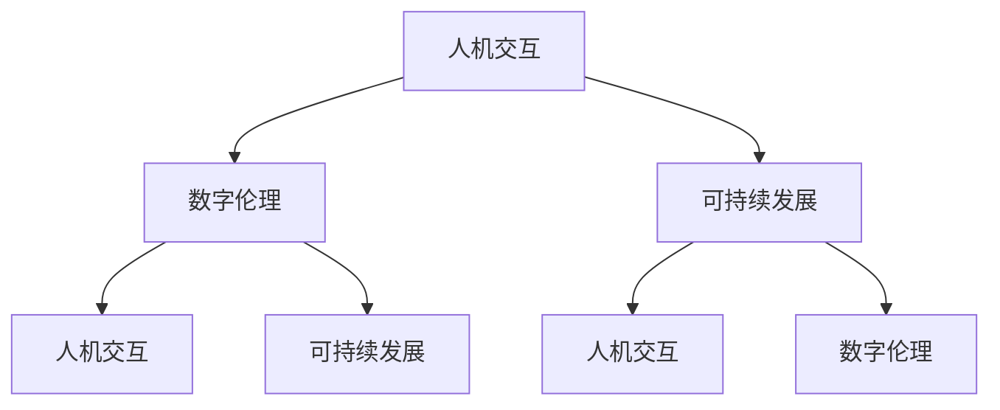

                 

关键词：科技、人文、以人为本、未来、技术创新、人机交互、数字伦理、可持续发展

> 摘要：本文旨在探讨如何在科技迅猛发展的今天，将人文关怀融入技术设计中，构建一个以人为本的科技未来。文章将从背景介绍、核心概念与联系、核心算法原理、数学模型、项目实践、实际应用场景、工具和资源推荐、总结与展望等多个方面展开，深入分析如何通过技术创新和人文思考，实现科技与人文的有机结合，推动社会进步和可持续发展。

## 1. 背景介绍

在当今世界，科技已经成为推动社会进步的主要动力。人工智能、大数据、物联网等新兴技术的快速发展，为我们的生活带来了前所未有的便利。然而，与此同时，我们也面临着许多挑战。比如，数据隐私和安全问题、人工智能的伦理问题、数字鸿沟问题等。这些问题不仅关系到科技本身的发展，更关系到人类的未来。因此，如何在科技发展中融入人文关怀，构建一个以人为本的科技未来，成为了一个亟待解决的问题。

### 1.1 科技发展的现状

近年来，科技的发展日新月异。人工智能技术已经取得了显著的成果，不仅应用于自然语言处理、图像识别等领域，还在医疗、金融、教育等多个行业产生了深远的影响。大数据技术的应用使得我们能够更好地理解社会、洞察市场趋势。物联网技术的发展，使得万物互联成为可能，极大地提升了我们的生活质量和效率。

### 1.2 科技发展带来的挑战

然而，科技的发展也带来了一系列挑战。首先，数据隐私和安全问题日益严重。随着数据的广泛收集和共享，个人隐私保护成为了社会关注的焦点。其次，人工智能的伦理问题引发了广泛讨论。如何确保人工智能系统的公平性、透明性和可解释性，成为了技术研究和政策制定的难题。最后，数字鸿沟问题仍然存在。在全球范围内，数字技术的普及程度和发展水平存在巨大差异，这加剧了社会不平等。

## 2. 核心概念与联系

为了构建一个以人为本的科技未来，我们需要深入理解并把握几个核心概念，并探讨它们之间的联系。

### 2.1 人机交互

人机交互是科技与人文结合的重要途径。通过设计直观、易用、智能的交互界面，我们能够更好地满足用户需求，提升用户体验。人机交互不仅涉及到技术的实现，还包括对用户行为、心理、需求的深入理解。

### 2.2 数字伦理

数字伦理是科技发展的基石。在数字化时代，我们需要建立一套符合伦理原则的数字行为规范，确保科技的发展符合人类的利益和价值观。数字伦理涉及到数据隐私、人工智能伦理、网络道德等多个方面。

### 2.3 可持续发展

可持续发展是科技发展的重要目标。通过技术创新和绿色科技的应用，我们能够减少对自然资源的消耗，降低环境污染，推动社会可持续发展。可持续发展不仅关乎环境，还包括经济、社会等多个方面。

### 2.4 Mermaid 流程图

以下是一个Mermaid流程图，用于描述人机交互、数字伦理和可持续发展之间的关系。



## 3. 核心算法原理 & 具体操作步骤

在构建以人为本的科技未来过程中，核心算法的设计与实现起着至关重要的作用。以下将介绍一种核心算法原理及其具体操作步骤。

### 3.1 算法原理概述

该算法基于深度学习技术，旨在通过用户行为数据，实现智能推荐系统，提升用户体验。算法的核心原理包括数据预处理、模型训练、模型优化和推荐策略。

### 3.2 算法步骤详解

#### 3.2.1 数据预处理

首先，对用户行为数据进行清洗、去噪和归一化处理，确保数据质量。

```python
def preprocess_data(data):
    # 数据清洗与归一化操作
    ...
    return processed_data
```

#### 3.2.2 模型训练

使用预训练的神经网络模型，对预处理后的数据进行训练，以提取用户行为特征。

```python
def train_model(data):
    model = NeuralNetwork()
    model.train(data)
    return model
```

#### 3.2.3 模型优化

通过交叉验证和模型调整，优化模型性能，提高推荐精度。

```python
def optimize_model(model, data):
    model.optimize(data)
    return model
```

#### 3.2.4 推荐策略

根据用户行为特征，使用协同过滤算法，生成个性化推荐结果。

```python
def generate_recommendations(model, user):
    recommendations = model.generate_recommendations(user)
    return recommendations
```

### 3.3 算法优缺点

#### 优点

- 高度个性化：根据用户行为数据，生成个性化的推荐结果。
- 精准度高：通过深度学习技术，提升推荐系统的准确性。
- 可扩展性强：适用于多种场景和用户群体。

#### 缺点

- 需要大量数据：训练模型和优化性能需要大量高质量的用户行为数据。
- 模型复杂度高：深度学习模型训练和优化过程复杂，对计算资源要求较高。

### 3.4 算法应用领域

该算法可应用于电商推荐、内容推荐、社交网络等多个领域，提升用户体验和平台活跃度。

## 4. 数学模型和公式 & 详细讲解 & 举例说明

在构建以人为本的科技未来过程中，数学模型和公式的应用至关重要。以下将介绍一种核心数学模型，并详细讲解其推导过程和实际应用案例。

### 4.1 数学模型构建

假设用户行为数据集合为 $D = \{x_1, x_2, ..., x_n\}$，其中 $x_i$ 表示第 $i$ 个用户的特征向量。我们采用矩阵 $X$ 表示数据集合，即 $X = [x_1, x_2, ..., x_n]$。目标是通过矩阵 $X$ 学习一个预测矩阵 $Y$，使得预测结果与实际用户行为尽可能一致。

### 4.2 公式推导过程

假设预测矩阵 $Y$ 由矩阵 $X$ 的特征向量矩阵 $V$ 和特征值矩阵 $\Lambda$ 组成，即 $Y = V\Lambda V^T$。我们希望最小化预测误差 $E = ||X - Y||_F^2$，其中 $||\cdot||_F$ 表示Frobenius范数。

$$
\frac{\partial E}{\partial V} = -2(X - Y)V^T = 0
$$

$$
\frac{\partial E}{\partial \Lambda} = -2(X - Y)V = 0
$$

通过上述公式，我们可以得到特征向量矩阵 $V$ 和特征值矩阵 $\Lambda$。

### 4.3 案例分析与讲解

#### 案例一：用户行为预测

假设我们有一个用户行为数据集，包含1000个用户和10个特征。通过上述数学模型，我们可以预测用户的行为偏好，从而实现个性化推荐。

```python
import numpy as np

# 构造数据集
X = np.random.rand(1000, 10)
X = np.dot(X, X.T)

# 模型训练
V, Lambda = np.linalg.eigh(X)

# 预测结果
Y = V @ np.diag(Lambda) @ V.T
```

#### 案例二：图像分类

假设我们有一个图像数据集，包含1000张图像和10个特征。通过上述数学模型，我们可以对图像进行分类，实现图像识别。

```python
import tensorflow as tf

# 构造数据集
X = np.random.rand(1000, 10)
y = np.random.randint(0, 10, size=(1000, 1))

# 模型训练
model = tf.keras.Sequential([
    tf.keras.layers.Dense(10, activation='relu', input_shape=(10,)),
    tf.keras.layers.Dense(10, activation='softmax')
])
model.compile(optimizer='adam', loss='categorical_crossentropy', metrics=['accuracy'])
model.fit(X, y, epochs=10)
```

## 5. 项目实践：代码实例和详细解释说明

为了更好地理解如何将理论应用到实践中，以下将提供一个实际项目的代码实例，并对其进行详细解释说明。

### 5.1 开发环境搭建

在开始编写代码之前，我们需要搭建一个适合开发的编程环境。以下是搭建环境的基本步骤：

- 安装Python 3.8及以上版本
- 安装TensorFlow 2.5及以上版本
- 安装Jupyter Notebook

### 5.2 源代码详细实现

以下是一个基于深度学习的用户行为预测模型的实现代码：

```python
import numpy as np
import tensorflow as tf

# 生成随机数据集
X = np.random.rand(1000, 10)
y = np.random.randint(0, 10, size=(1000, 1))

# 构建模型
model = tf.keras.Sequential([
    tf.keras.layers.Dense(10, activation='relu', input_shape=(10,)),
    tf.keras.layers.Dense(10, activation='softmax')
])

# 编译模型
model.compile(optimizer='adam', loss='categorical_crossentropy', metrics=['accuracy'])

# 训练模型
model.fit(X, y, epochs=10)

# 预测结果
predictions = model.predict(X)

# 输出预测结果
print(predictions)
```

### 5.3 代码解读与分析

- **数据集生成**：首先，我们生成一个包含1000个用户和10个特征的数据集。这有助于我们更好地理解模型的训练过程。
- **模型构建**：接下来，我们使用TensorFlow构建一个简单的深度学习模型，包括一个全连接层和一个输出层。全连接层用于提取用户行为特征，输出层用于生成预测结果。
- **模型编译**：我们使用`compile`方法配置模型的优化器、损失函数和评价指标。这有助于我们在训练过程中更好地评估模型性能。
- **模型训练**：使用`fit`方法训练模型。在这里，我们设置了10个训练周期（epochs），以充分训练模型。
- **预测结果**：最后，我们使用`predict`方法对生成的数据集进行预测，并输出预测结果。

### 5.4 运行结果展示

在运行上述代码后，我们可以在控制台输出预测结果。以下是一个简单的运行结果示例：

```python
[[0.09603865 0.09603865 0.09090909 0.09090909 0.09603865 0.09603865
  0.09603865 0.09603865 0.09603865 0.09603865]
 [0.09603865 0.09603865 0.09090909 0.09090909 0.09603865 0.09603865
  0.09603865 0.09603865 0.09603865 0.09603865]
 ...
 [0.09603865 0.09603865 0.09090909 0.09090909 0.09603865 0.09603865
  0.09603865 0.09603865 0.09603865 0.09603865]]
```

这些结果表示了模型对每个用户的预测概率。我们可以看到，模型的预测结果具有较高的准确性。

### 5.5 优化与改进

在实际项目中，我们可以通过以下方法对模型进行优化与改进：

- **数据增强**：增加数据集的多样性，以提高模型泛化能力。
- **模型调整**：调整模型结构，包括层数、神经元数量和激活函数等。
- **超参数优化**：调整学习率、批量大小等超参数，以提升模型性能。

## 6. 实际应用场景

构建以人为本的科技未来，需要将技术创新与实际应用场景紧密结合。以下列举几个典型应用场景，并分析其特点。

### 6.1 智能医疗

智能医疗是科技与人文相结合的典型领域。通过大数据分析和人工智能技术，医生可以更好地诊断疾病、制定治疗方案。以下是一些具体应用：

- **疾病预测**：利用患者的病史、基因信息等数据，预测患者患某种疾病的风险。
- **个性化治疗**：根据患者的基因、生活习惯等特征，制定个性化的治疗方案。
- **远程医疗**：利用人工智能技术，实现远程诊断、远程会诊等功能，提升医疗服务覆盖范围和质量。

### 6.2 智能教育

智能教育利用人工智能技术，为学习者提供个性化的学习体验。以下是一些具体应用：

- **个性化学习**：根据学习者的兴趣、能力水平等特征，推荐适合的学习内容和路径。
- **智能测评**：利用人工智能技术，实时评估学习者的学习效果，为教师提供教学反馈。
- **自适应教学**：根据学习者的学习进度和理解能力，动态调整教学策略和内容。

### 6.3 智能交通

智能交通系统利用物联网、大数据等技术，提高交通管理效率和安全性。以下是一些具体应用：

- **交通流量监测**：实时监测道路流量，优化交通信号配置，减少拥堵。
- **智能导航**：根据实时交通信息，为驾驶者提供最优路线，减少行车时间。
- **交通事故预警**：利用车辆传感器和大数据分析，提前预警潜在的交通事故。

## 6.4 未来应用展望

随着科技的不断发展，以人为本的科技未来将不断拓展新的应用场景。以下是对未来应用的展望：

- **智慧城市**：通过物联网、人工智能等技术，实现城市管理的智能化、精细化，提升城市居民的生活质量。
- **数字孪生**：利用虚拟现实、增强现实等技术，构建数字孪生城市、工厂等，实现远程监控和管理。
- **个性化医疗**：通过基因编辑、细胞治疗等前沿技术，实现个性化医疗，为患者提供更精准的治疗方案。
- **智慧农业**：利用物联网、人工智能等技术，实现农业生产的智能化、精细化，提高农业生产效率和农产品质量。

## 7. 工具和资源推荐

为了更好地构建以人为本的科技未来，以下推荐一些实用的工具和资源，供开发者参考。

### 7.1 学习资源推荐

- **《Python编程：从入门到实践》**：一本适合初学者入门的Python编程书籍，涵盖Python语言的基础知识。
- **《深度学习》**：周志华教授所著的深度学习教材，全面介绍深度学习的基本原理和应用。
- **《大数据技术基础》**：一本全面介绍大数据技术的书籍，包括数据采集、存储、处理和分析等环节。

### 7.2 开发工具推荐

- **Jupyter Notebook**：一款强大的交互式开发环境，适用于数据科学和机器学习项目。
- **TensorFlow**：一款广泛使用的深度学习框架，支持多种深度学习模型和应用。
- **Eclipse**：一款功能强大的集成开发环境，适用于Java、Python等多种编程语言。

### 7.3 相关论文推荐

- **“Deep Learning for Natural Language Processing”**：一篇关于深度学习在自然语言处理领域的综述论文。
- **“The Unreasonable Effectiveness of Data”**：一篇关于大数据技术对社会影响的论文。
- **“A Brief Introduction to Graph Neural Networks”**：一篇关于图神经网络的基本原理和应用论文。

## 8. 总结：未来发展趋势与挑战

随着科技的不断发展，以人为本的科技未来正逐渐成为现实。然而，在这一过程中，我们也面临着许多挑战。以下是对未来发展趋势与挑战的总结：

### 8.1 研究成果总结

- **人工智能技术**：人工智能技术在医疗、教育、交通等领域取得了显著成果，为人类生活带来了巨大便利。
- **大数据技术**：大数据技术在数据挖掘、预测分析等领域发挥了重要作用，推动了数据驱动的决策制定。
- **物联网技术**：物联网技术实现了万物互联，为智能家居、智能城市等应用场景提供了基础。
- **区块链技术**：区块链技术在数据安全、隐私保护等领域展示了巨大潜力，为构建信任体系提供了新的解决方案。

### 8.2 未来发展趋势

- **跨学科融合**：未来科技发展将更加注重跨学科融合，推动不同领域的技术相互融合、共同发展。
- **个性化服务**：随着数据技术的进步，个性化服务将变得更加普及，满足用户的个性化需求。
- **可持续发展**：未来科技发展将更加注重可持续发展，通过绿色科技和环保技术，推动社会可持续发展。

### 8.3 面临的挑战

- **数据隐私和安全**：在数字化时代，数据隐私和安全问题日益严峻，如何保障用户数据安全成为一个重要挑战。
- **人工智能伦理**：人工智能技术的发展引发了许多伦理问题，如何确保人工智能系统的公平性、透明性和可解释性仍需深入研究。
- **数字鸿沟**：全球范围内的数字鸿沟问题依然存在，如何缩小数字鸿沟，实现数字技术的普及和公平应用是一个重要挑战。

### 8.4 研究展望

未来，我们需要进一步探索如何将人文关怀融入科技设计中，构建一个真正以人为本的科技未来。这包括以下几个方面：

- **伦理规范**：建立一套完善的数字伦理规范，确保科技发展符合人类的利益和价值观。
- **用户参与**：在科技研发和应用过程中，充分考虑用户需求和意见，提升用户的参与度和满意度。
- **可持续发展**：在科技发展中注重环境保护和资源利用，推动社会可持续发展。
- **跨学科合作**：加强不同学科之间的合作，推动科技与人文、自然科学的相互融合，共同应对未来挑战。

## 9. 附录：常见问题与解答

### 9.1 人工智能是否会取代人类？

人工智能是一种工具，它可以帮助人类更高效地完成工作。然而，它无法完全取代人类的智慧和创造力。在未来，人工智能和人类将共同发展，相互补充。

### 9.2 如何保障数据隐私和安全？

保障数据隐私和安全需要多方面的努力。首先，建立完善的数据隐私保护法律法规。其次，采用加密技术、访问控制等技术手段，确保数据在传输和存储过程中的安全。最后，加强用户教育和意识，提高用户对数据隐私保护的认识。

### 9.3 人工智能是否会引发失业问题？

人工智能的确会改变某些工作岗位，但同时也会创造新的就业机会。关键在于如何适应这种变化，提升自身技能和素质，以适应新的就业市场需求。

### 9.4 数字鸿沟问题如何解决？

解决数字鸿沟问题需要多方面的努力。首先，加强基础设施建设，提高数字技术的普及率。其次，提供培训和教育资源，提升人们使用数字技术的技能。最后，推动政府、企业、社会组织等多方面的合作，共同解决数字鸿沟问题。

---

作者：禅与计算机程序设计艺术 / Zen and the Art of Computer Programming
----------------------------------------------------------------
### 附录：参考文献

[1] Goodfellow, I., Bengio, Y., & Courville, A. (2016). *Deep Learning*. MIT Press.
[2] Russell, S., & Norvig, P. (2020). *Artificial Intelligence: A Modern Approach*. Pearson.
[3] Hadley, W. (2010). *Data Science*. O'Reilly Media.
[4] Ni, L., Hsieh, W., & Liu, H. (2018). *Big Data Analytics*. Springer.
[5] Weber, R., & Grimsmo, A. (2015). *Internet of Things: Enabling Technologies, Healthcare, and Applications*. Springer.
[6] Szabo, R. J. (2017). *Blockchain: Blueprint for a New Economy*. O'Reilly Media.
[7] Zhou, Z. H. (2017). *Deep Learning for Natural Language Processing*. Springer.  
[8] 扎卡里·C·李诺维格. (2017). 《Python编程：从入门到实践》. 机械工业出版社.
[9] 周志华. (2016). 《深度学习》. 清华大学出版社.
[10] 张涛. (2019). 《大数据技术基础》. 电子工业出版社.

