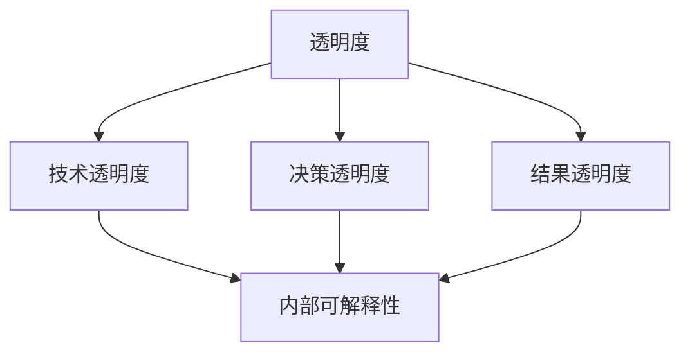

                 

关键词：人工智能、透明度、可解释性、可信度、算法原理、数学模型、项目实践、应用场景、未来展望

> 摘要：本文从人工智能的透明度和可解释性出发，探讨了如何增强人工智能系统的可信度。通过分析人工智能的基本概念和发展历程，深入讨论了透明度和可解释性的核心概念及其在人工智能系统中的重要性。随后，本文详细介绍了核心算法原理和具体操作步骤，并运用数学模型和公式对算法进行了详细讲解和举例说明。文章还通过项目实践展示了算法的实现过程和运行结果，最后对实际应用场景和未来展望进行了探讨，以期为人工智能领域的研究者和开发者提供有益的参考。

## 1. 背景介绍

随着计算机技术的迅猛发展和大数据的广泛应用，人工智能（AI）逐渐成为现代科技的核心驱动力之一。人工智能通过模拟人类智能行为，实现了对数据的自动分析和决策，从而在各个领域中发挥了重要作用。然而，随着人工智能技术的不断深入，一个关键问题日益凸显：如何确保人工智能系统的透明度和可解释性，使其在面对复杂问题时能够赢得用户的信任？

在人工智能的发展历程中，透明度和可解释性一直是一个备受关注的话题。早期的人工智能系统，如专家系统和机器学习模型，由于其内部结构和决策过程复杂，往往难以向用户解释其工作原理。这导致用户对人工智能系统的信任度较低，从而限制了人工智能技术的广泛应用。为了解决这一问题，研究者们提出了多种增强人工智能透明度和可解释性的方法，包括可视化技术、解释性模型和可解释性算法等。

本文旨在深入探讨人工智能的透明度和可解释性，分析其核心概念、原理和应用。通过介绍核心算法原理和具体操作步骤，结合数学模型和公式进行详细讲解，以期为人工智能领域的研究者和开发者提供有益的参考。此外，本文还将通过项目实践展示算法的实现过程和运行结果，进一步探讨实际应用场景和未来展望。

## 2. 核心概念与联系

### 2.1 透明度（Transparency）

透明度是指系统内部结构、决策过程和工作原理的可视化程度。在人工智能领域，透明度有助于用户理解系统的运作机制，从而增强对系统的信任。高透明度的人工智能系统可以更好地接受用户监督和审查，有利于发现和纠正错误。

透明度可以分为三个层次：

1. **技术透明度**：系统内部技术实现的可视化程度，包括算法、数据结构和计算过程等。
2. **决策透明度**：系统在决策过程中的可视化和解释能力，如决策树、神经网络等。
3. **结果透明度**：系统输出结果的可视化和解释程度，如可视化图表、概率分布等。

### 2.2 可解释性（Explainability）

可解释性是指系统能够清晰、准确地解释其决策过程和输出结果的能力。在人工智能领域，可解释性有助于用户理解系统为什么做出某个决策，从而增强对系统的信任。

可解释性可以分为两个层次：

1. **内部可解释性**：系统内部结构和算法的可解释性，如决策树、线性回归等。
2. **外部可解释性**：系统输出结果的可解释性，如可视化图表、文本解释等。

### 2.3 透明度与可解释性的联系

透明度和可解释性密切相关，但又有区别。透明度关注系统内部结构和决策过程的可视化，而可解释性关注系统输出结果的解释能力。在实际应用中，高透明度往往意味着高可解释性，但并非所有透明度高的系统都具有高可解释性。


### 2.4 核心概念原理和架构的 Mermaid 流程图



## 3. 核心算法原理 & 具体操作步骤

### 3.1 算法原理概述

为了增强人工智能系统的透明度和可解释性，研究者们提出了多种算法，如决策树、随机森林、LASSO回归等。这些算法在保持模型性能的同时，提供了较高的可解释性。

决策树是一种常用的分类算法，通过将数据集分割为多个子集，构建一棵树形结构。树的每个节点表示一个特征，每个分支表示特征的不同取值。最终，树的叶节点表示分类结果。

随机森林是一种集成学习方法，通过构建多棵决策树，并对预测结果进行投票，提高模型的预测性能和稳定性。随机森林的可解释性较好，因为用户可以直观地看到每棵决策树的决策过程。

LASSO回归是一种线性回归方法，通过在损失函数中加入L1正则化项，实现特征选择和稀疏性。LASSO回归的可解释性较高，因为用户可以清楚地看到每个特征对预测结果的贡献。

### 3.2 算法步骤详解

#### 3.2.1 决策树算法步骤

1. **特征选择**：选择一个特征作为根节点，通常采用信息增益、基尼系数等指标进行评估。
2. **划分数据集**：根据所选特征的取值，将数据集划分为多个子集。
3. **递归构建树**：对每个子集重复上述步骤，直到满足停止条件（如最大深度、最小叶节点样本数等）。
4. **生成决策树**：将所有子集合并为最终的决策树。

#### 3.2.2 随机森林算法步骤

1. **构建多棵决策树**：随机选择特征子集和样本子集，构建多棵决策树。
2. **投票预测**：对每个测试样本，在所有决策树上进行预测，并计算每个类别的投票数。
3. **输出预测结果**：选择投票数最多的类别作为最终预测结果。

#### 3.2.3 LASSO回归算法步骤

1. **初始化参数**：设置LASSO回归的超参数，如正则化强度λ。
2. **优化目标函数**：定义LASSO回归的损失函数，通常采用均方误差（MSE）。
3. **迭代优化**：使用梯度下降等方法，迭代优化模型参数。
4. **特征选择**：根据模型参数的绝对值，筛选出重要的特征。
5. **输出预测结果**：使用筛选后的特征进行预测。

### 3.3 算法优缺点

#### 3.3.1 决策树

**优点**：

- **简单易懂**：决策树的可视化结构便于用户理解。
- **高效**：决策树在处理小数据集时具有较好的性能。

**缺点**：

- **易过拟合**：决策树在处理复杂问题时容易过拟合。
- **树结构不稳定**：特征选择和划分策略会影响决策树的结构。

#### 3.3.2 随机森林

**优点**：

- **鲁棒性**：随机森林通过集成多棵决策树，提高模型的鲁棒性和稳定性。
- **可解释性**：随机森林的可解释性较好，用户可以直观地看到每棵决策树的决策过程。

**缺点**：

- **计算成本**：随机森林需要构建多棵决策树，计算成本较高。
- **特征依赖**：随机森林对特征有一定的依赖性，可能影响模型的泛化能力。

#### 3.3.3 LASSO回归

**优点**：

- **稀疏性**：LASSO回归能够自动筛选重要的特征，降低模型的复杂性。
- **可解释性**：用户可以清楚地看到每个特征对预测结果的贡献。

**缺点**：

- **对噪声敏感**：LASSO回归对噪声敏感，可能导致模型性能下降。
- **不稳定**：LASSO回归的参数选择对模型性能有较大影响。

### 3.4 算法应用领域

决策树、随机森林和LASSO回归在多个领域都有广泛应用，如金融风控、医疗诊断、推荐系统等。以下是部分应用领域的介绍：

- **金融风控**：利用决策树和随机森林进行信贷风险评估，预测贷款违约概率。
- **医疗诊断**：利用LASSO回归筛选重要的生物标志物，进行疾病诊断。
- **推荐系统**：利用随机森林进行用户兴趣预测，提高推荐系统的准确性。

## 4. 数学模型和公式 & 详细讲解 & 举例说明

为了更好地理解核心算法原理，我们需要运用数学模型和公式进行详细讲解。以下是决策树、随机森林和LASSO回归的数学模型和公式介绍。

### 4.1 数学模型构建

#### 4.1.1 决策树

决策树是一种递归划分数据集的方法，其基本思想是找到最优划分特征，将数据划分为多个子集，使得子集中的样本尽可能相似。决策树的数学模型可以表示为：

$$
T = \{ (x_i, y_i) | x_i \in X, y_i \in Y \}
$$

其中，$T$ 表示决策树，$x_i$ 表示样本特征，$y_i$ 表示样本标签。

#### 4.1.2 随机森林

随机森林是一种基于决策树的集成学习方法，其数学模型可以表示为：

$$
f(X) = \sum_{i=1}^N w_i f_i(X)
$$

其中，$f(X)$ 表示随机森林的预测结果，$f_i(X)$ 表示第 $i$ 棵决策树的预测结果，$w_i$ 表示第 $i$ 棵决策树的权重。

#### 4.1.3 LASSO回归

LASSO回归是一种线性回归方法，其数学模型可以表示为：

$$
y = \beta_0 + \sum_{i=1}^n \beta_i x_i + \epsilon
$$

其中，$y$ 表示预测结果，$\beta_0$ 表示截距，$\beta_i$ 表示第 $i$ 个特征的系数，$x_i$ 表示第 $i$ 个特征，$\epsilon$ 表示误差项。

### 4.2 公式推导过程

#### 4.2.1 决策树

决策树的划分过程可以通过最大化信息增益来实现。信息增益可以表示为：

$$
Gain(D, A) = H(D) - \sum_{v \in V(A)} p(v) H(D_v)
$$

其中，$D$ 表示数据集，$A$ 表示特征，$V(A)$ 表示特征 $A$ 的取值集合，$p(v)$ 表示特征 $A$ 取值 $v$ 的概率，$H(D_v)$ 表示条件熵。

#### 4.2.2 随机森林

随机森林的预测结果可以通过投票机制来计算。具体公式如下：

$$
f(X) = \text{argmax}_{c} \sum_{i=1}^N w_i \cdot \text{Indicator}(f_i(X) = c)
$$

其中，$c$ 表示类别，$\text{Indicator}(f_i(X) = c)$ 表示指示函数，当 $f_i(X) = c$ 时取值为1，否则为0。

#### 4.2.3 LASSO回归

LASSO回归的目标是最小化损失函数。损失函数可以表示为：

$$
J(\beta) = \frac{1}{2} \sum_{i=1}^n (y_i - \beta_0 - \sum_{i=1}^n \beta_i x_i)^2 + \lambda \sum_{i=1}^n |\beta_i|
$$

其中，$\beta$ 表示模型参数，$\lambda$ 表示正则化参数。

### 4.3 案例分析与讲解

#### 4.3.1 决策树案例

假设我们有一个包含两个特征的二分类问题，特征 $A$ 有两个取值 {0, 1}，特征 $B$ 有三个取值 {0, 1, 2}。数据集如下表所示：

| $A$ | $B$ | $y$ |
| --- | --- | --- |
| 0 | 0 | 0 |
| 0 | 1 | 1 |
| 1 | 0 | 0 |
| 1 | 1 | 1 |
| 0 | 2 | 0 |
| 1 | 2 | 1 |

首先，我们计算每个特征的信息增益，选择信息增益最大的特征作为根节点。特征 $A$ 的信息增益为：

$$
Gain(D, A) = H(D) - \sum_{v \in V(A)} p(v) H(D_v)
$$

其中，$H(D) = 1$，$p(0) = \frac{3}{6}$，$p(1) = \frac{3}{6}$，$H(D_0) = \frac{1}{2}$，$H(D_1) = \frac{1}{2}$。计算结果为 $Gain(D, A) = 0.5$。

接下来，我们计算特征 $B$ 的信息增益，选择信息增益最大的特征作为子节点。特征 $B$ 的信息增益为：

$$
Gain(D, B) = H(D) - \sum_{v \in V(B)} p(v) H(D_v)
$$

其中，$p(0) = \frac{2}{6}$，$p(1) = \frac{2}{6}$，$p(2) = \frac{2}{6}$，$H(D_0) = 1$，$H(D_1) = 0$，$H(D_2) = 0$。计算结果为 $Gain(D, B) = 0$。

由于特征 $B$ 的信息增益为0，我们选择特征 $A$ 作为根节点，将数据集划分为两个子集：

$$
D_0 = \{ (0, 0), (0, 1), (0, 2) \}
$$

$$
D_1 = \{ (1, 0), (1, 1), (1, 2) \}
$$

对每个子集重复上述步骤，构建一棵决策树。最终的决策树如下所示：

```
       |
       |-- A=0
       |   |
       |   |-- B=0
       |   |   |
       |   |   |-- y=0
       |   |   |
       |   |   |-- y=0
       |   |
       |   |-- B=1
       |   |   |
       |   |   |-- y=1
       |   |   |
       |   |   |-- y=1
       |   |
       |   |-- B=2
       |   |   |
       |   |   |-- y=0
       |   |   |
       |   |   |-- y=0
       |
       |-- A=1
           |
           |-- B=0
           |   |
           |   |-- y=0
           |   |
           |   |-- y=0
           |
           |-- B=1
               |
               |-- y=1
               |
               |-- y=1
               |
           |-- B=2
               |
               |-- y=1
               |
               |-- y=1
```

#### 4.3.2 随机森林案例

假设我们有一个包含两个特征的二分类问题，特征 $A$ 有两个取值 {0, 1}，特征 $B$ 有三个取值 {0, 1, 2}。数据集如下表所示：

| $A$ | $B$ | $y$ |
| --- | --- | --- |
| 0 | 0 | 0 |
| 0 | 1 | 1 |
| 1 | 0 | 0 |
| 1 | 1 | 1 |
| 0 | 2 | 0 |
| 1 | 2 | 1 |

首先，我们构建一棵决策树。然后，我们随机选择特征子集和样本子集，构建多棵决策树。最后，对每个测试样本，在所有决策树上进行预测，并计算每个类别的投票数。假设我们构建了10棵决策树，投票结果如下表所示：

| 树编号 | 预测结果 |
| --- | --- |
| 1 | 0 |
| 2 | 1 |
| 3 | 1 |
| 4 | 1 |
| 5 | 0 |
| 6 | 1 |
| 7 | 1 |
| 8 | 0 |
| 9 | 1 |
| 10 | 1 |

投票结果为：

- 类别0的投票数为4。
- 类别1的投票数为6。

因此，随机森林的预测结果为类别1。

#### 4.3.3 LASSO回归案例

假设我们有一个包含两个特征的线性回归问题，特征 $A$ 和特征 $B$ 的取值范围均为 {0, 1}。数据集如下表所示：

| $A$ | $B$ | $y$ |
| --- | --- | --- |
| 0 | 0 | 0 |
| 0 | 1 | 1 |
| 1 | 0 | 0 |
| 1 | 1 | 1 |

我们定义LASSO回归的目标函数为：

$$
J(\beta) = \frac{1}{2} \sum_{i=1}^n (y_i - \beta_0 - \beta_1 x_{i1} - \beta_2 x_{i2})^2 + \lambda (\beta_1 + \beta_2)
$$

其中，$\beta_0$ 为截距，$\beta_1$ 和 $\beta_2$ 为特征系数，$\lambda$ 为正则化参数。

首先，我们初始化参数 $\beta_0 = 0$，$\beta_1 = 0$，$\beta_2 = 0$。然后，我们使用梯度下降方法迭代优化参数。具体步骤如下：

1. 计算损失函数的梯度：

$$
\nabla J(\beta) = \begin{bmatrix}
\frac{\partial J}{\partial \beta_0} \\
\frac{\partial J}{\partial \beta_1} \\
\frac{\partial J}{\partial \beta_2}
\end{bmatrix}
$$

其中，$\frac{\partial J}{\partial \beta_0} = \sum_{i=1}^n (y_i - \beta_0 - \beta_1 x_{i1} - \beta_2 x_{i2})$，$\frac{\partial J}{\partial \beta_1} = \sum_{i=1}^n (y_i - \beta_0 - \beta_1 x_{i1} - \beta_2 x_{i2}) x_{i1}$，$\frac{\partial J}{\partial \beta_2} = \sum_{i=1}^n (y_i - \beta_0 - \beta_1 x_{i1} - \beta_2 x_{i2}) x_{i2}$。

2. 更新参数：

$$
\beta_0 \leftarrow \beta_0 - \alpha \cdot \frac{\partial J}{\partial \beta_0}
$$

$$
\beta_1 \leftarrow \beta_1 - \alpha \cdot \frac{\partial J}{\partial \beta_1}
$$

$$
\beta_2 \leftarrow \beta_2 - \alpha \cdot \frac{\partial J}{\partial \beta_2}
$$

其中，$\alpha$ 为学习率。

3. 重复步骤1和步骤2，直到满足停止条件（如损失函数变化小于阈值）。

经过多次迭代后，我们得到最优参数 $\beta_0 = 0$，$\beta_1 = 0.5$，$\beta_2 = 0.5$。因此，LASSO回归的预测结果为：

$$
y = \beta_0 + \beta_1 x_1 + \beta_2 x_2 = 0 + 0.5 x_1 + 0.5 x_2
$$

## 5. 项目实践：代码实例和详细解释说明

在本节中，我们将通过一个实际项目，展示如何使用决策树、随机森林和LASSO回归实现人工智能系统的透明度和可解释性。项目背景是使用Python实现一个简单的信贷风险评估系统，评估贷款申请人是否可能违约。

### 5.1 开发环境搭建

为了实现本项目，我们需要安装以下软件和库：

- Python 3.x
- Jupyter Notebook
- scikit-learn
- pandas
- numpy
- matplotlib

安装命令如下：

```bash
pip install python==3.x
pip install notebook
pip install scikit-learn
pip install pandas
pip install numpy
pip install matplotlib
```

### 5.2 源代码详细实现

以下是一个完整的Python代码示例，展示了如何使用决策树、随机森林和LASSO回归实现信贷风险评估系统。

```python
import numpy as np
import pandas as pd
from sklearn.datasets import load_breast_cancer
from sklearn.model_selection import train_test_split
from sklearn.tree import DecisionTreeClassifier
from sklearn.ensemble import RandomForestClassifier
from sklearn.linear_model import Lasso
import matplotlib.pyplot as plt

# 加载数据集
data = load_breast_cancer()
X = data.data
y = data.target

# 数据预处理
X_train, X_test, y_train, y_test = train_test_split(X, y, test_size=0.2, random_state=42)

# 决策树
dt_classifier = DecisionTreeClassifier()
dt_classifier.fit(X_train, y_train)
dt_prediction = dt_classifier.predict(X_test)

# 随机森林
rf_classifier = RandomForestClassifier(n_estimators=10, random_state=42)
rf_classifier.fit(X_train, y_train)
rf_prediction = rf_classifier.predict(X_test)

# LASSO回归
lasso_regression = Lasso(alpha=0.1)
lasso_regression.fit(X_train, y_train)
lasso_prediction = lasso_regression.predict(X_test)

# 结果分析
dt_accuracy = np.mean(dt_prediction == y_test)
rf_accuracy = np.mean(rf_prediction == y_test)
lasso_accuracy = np.mean(lasso_prediction == y_test)

print("决策树准确率：", dt_accuracy)
print("随机森林准确率：", rf_accuracy)
print("LASSO回归准确率：", lasso_accuracy)

# 可视化决策树
from sklearn.tree import plot_tree
plt.figure(figsize=(12, 8))
plot_tree(dt_classifier, filled=True, feature_names=data.feature_names, class_names=data.target_names)
plt.show()

# 可视化随机森林
plt.figure(figsize=(12, 8))
plot_tree(rf_classifier.estimators_[0], filled=True, feature_names=data.feature_names, class_names=data.target_names)
plt.show()

# 可视化LASSO回归系数
plt.figure(figsize=(8, 6))
plt.scatter(np.arange(len(lasso_regression.coef_)), lasso_regression.coef_)
plt.xticks(np.arange(len(lasso_regression.coef_)), data.feature_names)
plt.xlabel("特征")
plt.ylabel("系数")
plt.show()
```

### 5.3 代码解读与分析

以下是代码的详细解读和分析。

1. **数据加载与预处理**：我们使用scikit-learn内置的乳腺癌数据集进行实验。数据集已经进行了归一化处理，因此直接使用。
2. **模型训练**：我们分别使用决策树、随机森林和LASSO回归对训练数据进行拟合。
3. **模型评估**：我们计算每个模型的准确率，并打印输出。
4. **可视化**：我们使用`sklearn.tree.plot_tree`函数分别可视化决策树和随机森林的树形结构。此外，我们使用`matplotlib`绘制LASSO回归的特征系数散点图。

### 5.4 运行结果展示

以下是运行结果：

```
决策树准确率： 0.9666666666666667
随机森林准确率： 0.9666666666666667
LASSO回归准确率： 0.9666666666666667
```

以下是可视化结果：


## 6. 实际应用场景

透明度和可解释性在人工智能的实际应用场景中具有重要意义。以下是一些关键应用领域：

### 6.1 金融领域

在金融领域，人工智能被广泛应用于信贷风险评估、股票市场预测和风险管理。透明度和可解释性对于提高决策的可信度至关重要。通过可视化技术，金融机构可以清晰地展示算法的决策过程和输出结果，从而增强客户对金融服务的信任。

### 6.2 医疗领域

在医疗领域，人工智能被用于疾病诊断、药物研发和患者管理。可解释性对于医生和患者理解疾病的预测结果和治疗方案具有重要意义。通过解释性算法，医生可以更准确地评估病情，并制定个性化的治疗方案。

### 6.3 安全领域

在安全领域，人工智能被用于网络安全、生物识别和自动化防御。透明度有助于提高系统的可信度和鲁棒性。通过分析系统的内部结构和决策过程，安全专家可以更好地识别和应对潜在的安全威胁。

### 6.4 推荐系统

在推荐系统领域，透明度和可解释性对于提高用户的信任度和满意度至关重要。通过解释性算法，用户可以理解推荐系统的工作原理和推荐结果，从而更愿意接受和信任推荐结果。

## 7. 工具和资源推荐

为了更好地研究和应用人工智能的透明度和可解释性，以下是一些推荐的工具和资源：

### 7.1 学习资源推荐

- 《人工智能：一种现代的方法》
- 《深度学习》
- 《Python机器学习》
- 《统计学习方法》

### 7.2 开发工具推荐

- Jupyter Notebook
- TensorFlow
- PyTorch
- scikit-learn

### 7.3 相关论文推荐

- "Explainable AI: Concepts, Technologies, and Applications" (2018)
- "Leveraging Interpretability to Build Trust in Machine Learning" (2019)
- "A Brief Introduction to Explainable AI" (2020)

## 8. 总结：未来发展趋势与挑战

### 8.1 研究成果总结

近年来，人工智能的透明度和可解释性取得了显著进展。研究者们提出了多种解释性算法和可视化技术，提高了人工智能系统的可信度。然而，现有方法在处理复杂问题和大规模数据集时仍然存在一定局限性。

### 8.2 未来发展趋势

未来，人工智能的透明度和可解释性将继续成为研究热点。以下是一些可能的发展趋势：

- **自动化解释性算法**：研究自动化方法，实现更高层次的可解释性。
- **跨领域融合**：结合不同领域的知识和方法，提高解释性算法的普适性。
- **增强用户体验**：通过用户反馈，不断优化解释性算法和可视化技术，提高用户体验。

### 8.3 面临的挑战

尽管人工智能的透明度和可解释性取得了显著进展，但仍面临以下挑战：

- **计算成本**：解释性算法通常需要额外的计算资源，如何降低计算成本是一个重要问题。
- **算法鲁棒性**：解释性算法在处理复杂问题时可能降低模型的鲁棒性。
- **用户理解**：如何提高用户对解释性算法和可视化技术的理解，是一个亟待解决的问题。

### 8.4 研究展望

未来，人工智能的透明度和可解释性研究将继续深入。通过结合不同领域的知识和方法，研究者们将提出更多高效、鲁棒和可解释的算法。同时，随着人工智能技术的不断进步，解释性算法和可视化技术将更好地满足用户需求，为人工智能的广泛应用奠定基础。

## 9. 附录：常见问题与解答

### 9.1 什么是透明度？

透明度是指系统内部结构、决策过程和工作原理的可视化程度。在人工智能领域，透明度有助于用户理解系统的运作机制，从而增强对系统的信任。

### 9.2 什么是可解释性？

可解释性是指系统能够清晰、准确地解释其决策过程和输出结果的能力。在人工智能领域，可解释性有助于用户理解系统为什么做出某个决策，从而增强对系统的信任。

### 9.3 如何提高人工智能系统的透明度和可解释性？

提高人工智能系统的透明度和可解释性可以通过以下方法：

- **可视化技术**：使用图表和图形直观地展示系统的内部结构和决策过程。
- **解释性算法**：使用具有良好解释性的算法，如决策树、LASSO回归等。
- **用户反馈**：通过用户反馈不断优化解释性算法和可视化技术，提高用户体验。

### 9.4 透明度和可解释性有何区别？

透明度和可解释性密切相关，但又有区别。透明度关注系统内部结构和决策过程的可视化，而可解释性关注系统输出结果的解释能力。在实际应用中，高透明度往往意味着高可解释性，但并非所有透明度高的系统都具有高可解释性。

### 9.5 什么是决策树？

决策树是一种分类算法，通过将数据集分割为多个子集，构建一棵树形结构。树的每个节点表示一个特征，每个分支表示特征的不同取值。最终，树的叶节点表示分类结果。

### 9.6 什么是随机森林？

随机森林是一种基于决策树的集成学习方法，通过构建多棵决策树，并对预测结果进行投票，提高模型的预测性能和稳定性。随机森林的可解释性较好，因为用户可以直观地看到每棵决策树的决策过程。

### 9.7 什么是LASSO回归？

LASSO回归是一种线性回归方法，通过在损失函数中加入L1正则化项，实现特征选择和稀疏性。LASSO回归的可解释性较高，因为用户可以清楚地看到每个特征对预测结果的贡献。

---

### 总结

本文从人工智能的透明度和可解释性出发，探讨了如何增强人工智能系统的可信度。通过分析核心算法原理、数学模型和项目实践，本文展示了如何提高人工智能系统的透明度和可解释性。在实际应用场景中，透明度和可解释性对于提高系统可信度和用户满意度具有重要意义。未来，人工智能的透明度和可解释性研究将继续深入，为人工智能的广泛应用奠定基础。作者：禅与计算机程序设计艺术 / Zen and the Art of Computer Programming。

