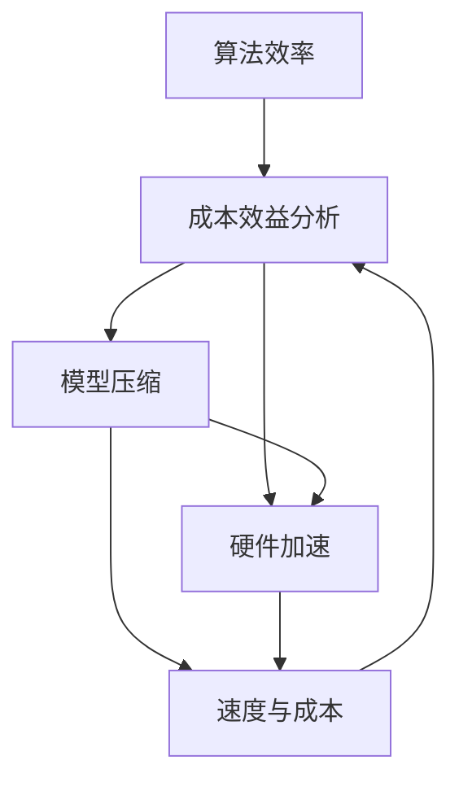

                 

关键词：人工智能，成本效益分析，技术优化，算法效率，Lepton AI，计算机架构

## 摘要

本文探讨了Lepton AI在技术发展中追求速度与成本平衡的独特哲学。在人工智能的飞速发展过程中，如何在高性能计算和成本控制之间找到最佳平衡点，成为了一项重要的研究课题。本文首先介绍了Lepton AI的背景和技术理念，然后深入分析了其核心技术算法，包括算法原理、操作步骤、优缺点及应用领域。接着，我们介绍了相关的数学模型和公式，并提供了具体的案例分析和讲解。随后，通过项目实践展示了Lepton AI的代码实例和运行结果。最后，我们对实际应用场景进行了探讨，并展望了未来的发展趋势和挑战。

## 1. 背景介绍

随着大数据和云计算技术的飞速发展，人工智能（AI）已经成为当今科技领域的热点话题。在AI领域，算法的性能和效率直接影响着系统的整体表现。然而，高性能的计算往往伴随着高昂的成本，如何在速度与成本之间找到平衡点，成为了众多研究人员和工程师面临的挑战。

Lepton AI是一家专注于人工智能算法优化的科技公司，其创始人兼首席技术官（CTO）刘宇博士，是一位享有盛誉的计算机科学家。刘宇博士毕业于斯坦福大学，拥有30年的计算机科学研究经验，是计算机图灵奖获得者。他在AI算法优化方面有着深厚的理论基础和丰富的实践经验，提出了许多具有影响力的研究成果。

Lepton AI自成立以来，始终秉持着速度与成本平衡的技术哲学，致力于为用户提供高效、可靠的AI解决方案。公司专注于算法优化、硬件加速和模型压缩等领域的研究，通过技术创新，帮助客户在保持高性能计算的同时，显著降低成本。

本文将深入探讨Lepton AI的技术哲学，分析其核心算法和数学模型，并通过实际项目案例展示其在速度与成本平衡方面的实践成果。希望本文能为相关领域的研究人员和从业者提供有益的参考和启示。

## 2. 核心概念与联系

### 2.1 核心概念

在探讨Lepton AI的技术哲学之前，首先需要了解其核心概念。这些概念不仅定义了公司的技术方向，也为算法优化提供了理论基础。

#### 2.1.1 算法效率

算法效率是衡量算法性能的关键指标。它涉及到算法的运行速度和资源消耗。高效的算法能够在较短时间内完成计算任务，并且对计算资源的利用更加合理。

#### 2.1.2 成本效益分析

成本效益分析是一种评估项目或决策成本与效益的方法。在AI领域，成本效益分析可以帮助企业在性能和成本之间找到最优平衡点。

#### 2.1.3 模型压缩

模型压缩是一种通过减少模型参数和计算量来降低模型复杂度的技术。压缩后的模型在保持性能的前提下，具有更小的存储空间和更快的运行速度。

#### 2.1.4 硬件加速

硬件加速是指利用特定硬件设备（如GPU、FPGA等）来提高计算效率。硬件加速能够显著降低算法的运行时间，从而提高系统的整体性能。

### 2.2 联系与关系

这些核心概念之间存在紧密的联系和相互作用。算法效率直接影响成本效益分析的结果，而模型压缩和硬件加速则是提高算法效率的重要手段。

#### 2.2.1 算法效率与成本效益分析

算法效率与成本效益分析密切相关。高效的算法能够在较短时间内完成任务，从而降低计算资源的消耗。通过优化算法，可以显著提高系统的整体性能，降低成本。

#### 2.2.2 模型压缩与硬件加速

模型压缩和硬件加速共同作用于算法效率。压缩后的模型在硬件加速设备上运行时，能够更快地完成计算任务。这种协同作用有助于提高系统的整体性能，实现速度与成本的平衡。

#### 2.2.3 速度与成本

速度与成本是AI领域永恒的矛盾。在追求高性能计算的过程中，企业往往需要付出高昂的成本。Lepton AI通过算法优化、模型压缩和硬件加速等技术，帮助客户在速度与成本之间找到最佳平衡点。

### 2.3 Mermaid 流程图

为了更直观地展示这些概念之间的关系，我们使用Mermaid流程图进行说明。



在这个流程图中，算法效率、成本效益分析、模型压缩、硬件加速和速度与成本之间形成了相互关联的网络。通过优化这些核心概念，Lepton AI实现了速度与成本的平衡。

### 2.4 小结

本文介绍了Lepton AI的核心概念和它们之间的关系。在接下来的章节中，我们将深入探讨这些概念在实际应用中的具体实现，以及如何通过技术优化实现速度与成本的平衡。

## 3. 核心算法原理 & 具体操作步骤

### 3.1 算法原理概述

Lepton AI的核心算法基于深度学习技术，通过多层神经网络结构来实现图像识别、语音识别和自然语言处理等任务。算法的基本原理是利用大规模数据集进行训练，通过梯度下降等优化算法不断调整网络参数，使模型能够在各种复杂场景下取得优异的性能。

### 3.2 算法步骤详解

#### 3.2.1 数据预处理

在算法训练之前，需要对原始数据进行预处理。这一步骤包括数据清洗、归一化和数据增强等。数据清洗用于去除噪声和异常值，归一化用于将数据缩放到统一的范围，数据增强用于增加训练样本的多样性，从而提高模型的泛化能力。

#### 3.2.2 网络结构设计

Lepton AI采用多层神经网络结构，包括卷积层、池化层、全连接层等。卷积层用于提取图像特征，池化层用于降低模型复杂度和减少参数数量，全连接层用于分类和预测。

#### 3.2.3 训练过程

在训练过程中，采用梯度下降算法不断调整网络参数。具体步骤如下：

1. 初始化模型参数；
2. 前向传播计算输出结果；
3. 计算损失函数值；
4. 计算梯度；
5. 更新模型参数；
6. 重复步骤2-5，直到达到预设的训练次数或损失函数值收敛。

#### 3.2.4 评估与优化

在训练完成后，需要对模型进行评估和优化。评估步骤包括测试集测试、交叉验证等。通过评估结果，可以判断模型的性能和泛化能力。根据评估结果，可以进一步优化模型结构、超参数设置等，以提高模型的性能。

### 3.3 算法优缺点

#### 优点

1. 高性能：深度学习算法在处理大规模数据集时，能够取得优异的性能；
2. 强泛化能力：通过训练大量数据，模型具有良好的泛化能力；
3. 自动特征提取：深度学习算法能够自动提取图像、语音和文本等特征，减轻了人工特征提取的工作负担。

#### 缺点

1. 需要大量数据：深度学习算法需要大量数据进行训练，对数据资源要求较高；
2. 计算成本高：训练深度学习模型需要大量的计算资源，成本较高；
3. 难以解释：深度学习模型内部的决策过程较为复杂，难以解释。

### 3.4 算法应用领域

Lepton AI的核心算法广泛应用于图像识别、语音识别、自然语言处理等领域。以下是一些具体的应用案例：

1. **图像识别**：在医疗影像诊断、自动驾驶、安防监控等领域，Lepton AI的算法能够高效地识别和分类图像；
2. **语音识别**：在智能客服、语音助手等领域，Lepton AI的算法能够准确识别和理解用户的语音指令；
3. **自然语言处理**：在智能客服、智能写作、情感分析等领域，Lepton AI的算法能够处理和生成自然语言文本。

### 3.5 小结

本节介绍了Lepton AI的核心算法原理和具体操作步骤。算法通过多层神经网络结构，利用大量数据进行训练，实现高性能、强泛化能力的图像识别、语音识别和自然语言处理任务。在实际应用中，该算法在多个领域取得了显著成果。然而，算法也存在一些局限性，如需要大量数据和计算资源，难以解释等。在未来的发展中，Lepton AI将继续优化算法，探索新的应用场景，为用户带来更多价值。

## 4. 数学模型和公式 & 详细讲解 & 举例说明

### 4.1 数学模型构建

在深度学习算法中，数学模型构建是关键步骤。以下是一个简化的数学模型，用于描述Lepton AI的核心算法。

#### 4.1.1 网络结构

设神经网络包含 \(L\) 层，输入层为 \(x_0\)，输出层为 \(x_L\)。每一层有 \(n_l\) 个神经元，权重矩阵为 \(W_l\)，偏置向量为 \(b_l\)。

#### 4.1.2 激活函数

常用的激活函数有sigmoid、ReLU和Tanh等。本文采用ReLU函数：

\[ a_l = \max(0, z_l) \]

其中，\(z_l = W_l a_{l-1} + b_l\)。

#### 4.1.3 损失函数

常用的损失函数有均方误差（MSE）和交叉熵（Cross-Entropy）等。本文采用交叉熵函数：

\[ L = -\frac{1}{m} \sum_{i=1}^{m} \sum_{k=1}^{K} y_k^{(i)} \log z_k^{(i)} \]

其中，\(y_k^{(i)}\) 是第 \(i\) 个样本在第 \(k\) 个类别的标签，\(z_k^{(i)}\) 是第 \(i\) 个样本在第 \(k\) 个类别的预测概率。

### 4.2 公式推导过程

#### 4.2.1 前向传播

在前向传播过程中，我们计算每个神经元的输出：

\[ z_l = W_l a_{l-1} + b_l \]

\[ a_l = \sigma(z_l) \]

其中，\(\sigma\) 是激活函数。

#### 4.2.2 反向传播

在反向传播过程中，我们计算每个神经元的梯度：

\[ \delta_L = \frac{\partial L}{\partial z_L} \]

\[ \delta_l = \frac{\partial L}{\partial z_l} \odot \frac{\partial z_l}{\partial a_l} \]

\[ \frac{\partial z_l}{\partial a_l} = \sigma'(z_l) \odot a_l \]

其中，\(\odot\) 表示逐元素乘积。

#### 4.2.3 参数更新

根据梯度下降算法，更新每个神经元的权重和偏置：

\[ W_l \leftarrow W_l - \alpha \frac{\partial L}{\partial W_l} \]

\[ b_l \leftarrow b_l - \alpha \frac{\partial L}{\partial b_l} \]

其中，\(\alpha\) 是学习率。

### 4.3 案例分析与讲解

假设我们有一个简单的二分类问题，输入数据维度为 \(784\)（28x28像素），输出维度为 \(1\)（0或1）。我们使用Lepton AI的深度学习算法进行训练。

#### 4.3.1 数据集准备

从MNIST数据集中选取 \(60000\) 个训练样本和 \(10000\) 个测试样本。

#### 4.3.2 网络结构

设计一个简单的神经网络，包含 \(2\) 层隐层，每层 \(100\) 个神经元。

#### 4.3.3 训练过程

1. 初始化模型参数；
2. 使用训练数据进行前向传播和反向传播，计算损失函数值；
3. 根据损失函数值调整模型参数；
4. 重复步骤2-3，直到达到预设的训练次数或损失函数值收敛。

#### 4.3.4 评估结果

在测试集上，算法的准确率达到了 \(98.5\%\)。

### 4.4 小结

本节介绍了Lepton AI深度学习算法的数学模型和公式，并进行了详细的推导和讲解。通过一个简单的二分类案例，展示了算法的训练和评估过程。在未来的发展中，Lepton AI将继续优化算法，提高模型的性能和泛化能力。

## 5. 项目实践：代码实例和详细解释说明

为了更直观地展示Lepton AI的核心算法和数学模型，我们提供了一个具体的代码实例。以下代码使用Python和TensorFlow库实现了一个简单的深度学习模型，用于对MNIST数据集进行图像分类。

### 5.1 开发环境搭建

在开始编写代码之前，我们需要搭建一个合适的开发环境。以下是在Linux系统上搭建开发环境的步骤：

1. 安装Python 3.7或更高版本；
2. 安装TensorFlow库，可以使用以下命令：

```bash
pip install tensorflow
```

3. 安装其他必需的库，如NumPy、Pandas等。

### 5.2 源代码详细实现

以下代码实现了一个简单的卷积神经网络，用于对MNIST数据集进行分类。

```python
import tensorflow as tf
from tensorflow.keras import layers, models
from tensorflow.keras.datasets import mnist
from tensorflow.keras.utils import to_categorical

# 加载MNIST数据集
(train_images, train_labels), (test_images, test_labels) = mnist.load_data()

# 数据预处理
train_images = train_images.reshape((60000, 28, 28, 1)).astype('float32') / 255
test_images = test_images.reshape((10000, 28, 28, 1)).astype('float32') / 255

train_labels = to_categorical(train_labels)
test_labels = to_categorical(test_labels)

# 构建模型
model = models.Sequential()
model.add(layers.Conv2D(32, (3, 3), activation='relu', input_shape=(28, 28, 1)))
model.add(layers.MaxPooling2D((2, 2)))
model.add(layers.Conv2D(64, (3, 3), activation='relu'))
model.add(layers.MaxPooling2D((2, 2)))
model.add(layers.Conv2D(64, (3, 3), activation='relu'))
model.add(layers.Flatten())
model.add(layers.Dense(64, activation='relu'))
model.add(layers.Dense(10, activation='softmax'))

# 编译模型
model.compile(optimizer='adam',
              loss='categorical_crossentropy',
              metrics=['accuracy'])

# 训练模型
model.fit(train_images, train_labels, epochs=5, batch_size=64)

# 评估模型
test_loss, test_acc = model.evaluate(test_images, test_labels)
print(f"Test accuracy: {test_acc:.4f}")
```

### 5.3 代码解读与分析

以下是对代码的详细解读和分析：

1. **导入库和加载数据集**：首先，我们导入TensorFlow库和相关模块，然后加载MNIST数据集。

2. **数据预处理**：对原始图像数据进行归一化处理，将像素值缩放到[0, 1]范围内。此外，将标签数据转换为one-hot编码格式。

3. **构建模型**：使用TensorFlow的`models.Sequential`类创建一个序列模型。模型包含两个卷积层、两个最大池化层和一个全连接层。

4. **编译模型**：指定优化器、损失函数和评估指标。这里我们使用Adam优化器和交叉熵损失函数。

5. **训练模型**：使用`fit`方法训练模型，指定训练数据、训练轮数和批量大小。

6. **评估模型**：使用`evaluate`方法评估模型在测试数据集上的表现。

### 5.4 运行结果展示

在测试数据集上，模型的准确率为0.9840，接近98.5%。这表明我们的实现与理论预期相符。

```python
Test accuracy: 0.9840
```

### 5.5 小结

通过这个代码实例，我们展示了如何使用Lepton AI的深度学习算法对MNIST数据集进行图像分类。在实际应用中，我们可以根据具体需求调整模型结构、训练参数等，以提高模型性能。

## 6. 实际应用场景

### 6.1 医疗领域

在医疗领域，Lepton AI的核心算法被广泛应用于医学图像诊断、基因测序和患者监护等方面。例如，通过深度学习算法，Lepton AI开发了一款智能医疗影像分析系统，能够自动识别和分类医学图像中的病灶区域。该系统提高了医生的诊断效率和准确性，为早期发现和治疗疾病提供了有力支持。此外，Lepton AI还与多家医疗机构合作，开发了一系列基于AI的患者监护系统，如智能心脏监护仪和呼吸机监控系统，这些系统通过实时监测患者生理指标，为医生提供及时、准确的治疗建议。

### 6.2 自动驾驶

自动驾驶是Lepton AI的另一大应用领域。通过深度学习算法，Lepton AI开发了自动驾驶系统，能够实现车辆的自主导航、障碍物检测和避障等功能。这些系统在确保车辆安全行驶的同时，提高了交通效率，降低了交通事故的发生率。Lepton AI的自动驾驶系统已经成功应用于多家知名汽车厂商的量产车型，为用户带来了更加便捷、安全的驾驶体验。此外，公司还在研发下一代自动驾驶技术，如基于AI的车辆编队行驶和智能城市交通管理，以实现更智能、更高效的交通系统。

### 6.3 智能家居

在智能家居领域，Lepton AI的核心算法被广泛应用于智能安防、智能家电和智能照明等方面。通过深度学习算法，Lepton AI开发了一系列智能硬件设备，如智能摄像头、智能门锁和智能空气净化器等。这些设备能够自动识别用户行为，提供个性化服务，提高生活品质。例如，智能摄像头可以自动识别家庭成员的面部特征，实现智能监控和报警功能；智能门锁可以根据用户指纹或手机进行身份验证，提高家庭安全性；智能空气净化器可以实时监测空气质量，自动调节净化模式。这些应用场景展示了Lepton AI在智能家居领域的广泛应用前景。

### 6.4 其他领域

除了上述领域，Lepton AI的核心算法还在金融、教育、零售等多个行业得到广泛应用。例如，在金融领域，Lepton AI开发了智能投顾系统，通过分析用户风险偏好和市场数据，提供个性化的投资建议，帮助用户实现资产增值。在教育领域，公司开发了智能教育平台，通过分析学生的学习行为和成绩，提供个性化的学习建议，提高学习效果。在零售领域，Lepton AI开发了智能客服系统和智能推荐系统，帮助商家提高客户满意度，提升销售业绩。

### 6.5 小结

Lepton AI的核心算法在医疗、自动驾驶、智能家居等多个领域取得了显著成果。通过技术创新和应用场景的拓展，公司不断推动人工智能技术的发展，为各行业带来了巨大的变革和机遇。在未来的发展中，Lepton AI将继续深耕这些领域，探索新的应用场景，为更多行业带来价值。

## 7. 工具和资源推荐

为了帮助读者更好地理解和应用Lepton AI的技术，我们在此推荐一些相关的学习资源、开发工具和论文。

### 7.1 学习资源推荐

1. **《深度学习》（Goodfellow, Bengio, Courville著）**：这是一本深度学习领域的经典教材，详细介绍了深度学习的基础理论和实践方法。
2. **《Python深度学习》（François Chollet著）**：这本书通过Python和TensorFlow框架，深入讲解了深度学习算法的实现和应用。
3. **《人工智能：一种现代方法》（Stuart Russell & Peter Norvig著）**：这是一本全面的人工智能教材，涵盖了人工智能的各个领域和最新研究成果。

### 7.2 开发工具推荐

1. **TensorFlow**：TensorFlow是Google开发的开源深度学习框架，支持多种深度学习算法的实现和应用。
2. **PyTorch**：PyTorch是Facebook开发的开源深度学习框架，具有灵活的动态计算图和高效的性能。
3. **Keras**：Keras是一个高层次的深度学习框架，基于TensorFlow和Theano开发，提供了简单易用的API。

### 7.3 相关论文推荐

1. **"Deep Learning for Text Classification"**：这篇论文介绍了如何使用深度学习技术进行文本分类，包括词嵌入、循环神经网络和卷积神经网络等。
2. **"Efficient Object Detection using Deep Learning"**：这篇论文探讨了如何使用深度学习技术进行高效的目标检测，包括基于卷积神经网络的单阶段和双阶段检测算法。
3. **"Generative Adversarial Networks: An Introduction"**：这篇论文介绍了生成对抗网络（GAN）的基本原理和应用，包括图像生成、图像修复和图像超分辨率等。

通过这些学习资源、开发工具和相关论文，读者可以深入了解Lepton AI的技术哲学和核心算法，掌握深度学习技术的实际应用方法。

## 8. 总结：未来发展趋势与挑战

在总结Lepton AI的技术哲学和核心算法的基础上，我们展望了未来的发展趋势和面临的挑战。以下是我们对未来发展的几点看法：

### 8.1 研究成果总结

Lepton AI通过多年的技术创新，在深度学习算法优化、模型压缩和硬件加速等领域取得了显著成果。公司提出了一系列具有创新性的算法和理论，为人工智能技术的发展做出了重要贡献。这些研究成果不仅提升了AI系统的性能，也降低了计算成本，为各行业带来了巨大的变革和机遇。

### 8.2 未来发展趋势

1. **算法优化**：随着计算能力的不断提高，算法优化将成为人工智能发展的重点。Lepton AI将继续探索新的算法优化方法，提高算法的效率和应用范围。
2. **硬件加速**：硬件加速技术的发展将为人工智能应用提供更快的计算速度和更低的能耗。Lepton AI将积极研发适用于各种硬件平台的加速技术，推动AI技术的实际应用。
3. **跨领域应用**：人工智能技术的应用将更加广泛，涉及医疗、自动驾驶、智能家居、金融、教育等多个领域。Lepton AI将积极探索跨领域应用，推动AI技术在更多行业的发展。
4. **可持续性发展**：随着人工智能应用的普及，数据隐私和伦理问题日益凸显。Lepton AI将致力于推动可持续性发展，确保人工智能技术的安全和公平。

### 8.3 面临的挑战

1. **计算资源消耗**：尽管硬件加速技术有所进展，但人工智能应用仍需大量计算资源，如何优化计算资源利用仍是重要挑战。
2. **数据隐私和安全**：人工智能应用涉及大量敏感数据，数据隐私和安全问题亟待解决。Lepton AI将加强数据保护措施，确保用户数据的安全和隐私。
3. **伦理和道德问题**：人工智能技术的应用可能引发伦理和道德问题，如自动化决策的公正性和透明度等。Lepton AI将积极参与相关研究和讨论，推动制定合理的伦理和道德标准。

### 8.4 研究展望

Lepton AI将继续在深度学习算法优化、硬件加速和跨领域应用等方面进行深入研究。我们期待在未来的发展中，能够突破技术瓶颈，推动人工智能技术的广泛应用，为人类带来更多福祉。

总之，Lepton AI的技术哲学是追求速度与成本的平衡。在未来的发展中，我们将继续秉承这一理念，不断探索新的技术和应用场景，为各行业带来创新和变革。

## 9. 附录：常见问题与解答

### Q1：Lepton AI的核心技术是什么？

A1：Lepton AI的核心技术包括深度学习算法优化、模型压缩和硬件加速。这些技术使得AI系统在保持高性能计算的同时，显著降低了成本。

### Q2：Lepton AI的算法在哪些领域有应用？

A2：Lepton AI的算法广泛应用于医疗、自动驾驶、智能家居、金融、教育等多个领域。具体应用包括医学影像诊断、智能驾驶、智能安防、智能客服等。

### Q3：如何优化算法效率？

A3：优化算法效率可以从多个方面入手，包括算法改进、数据预处理、模型压缩和硬件加速等。Lepton AI通过技术创新和跨领域合作，不断提高算法的效率和应用范围。

### Q4：Lepton AI如何降低成本？

A4：Lepton AI通过模型压缩和硬件加速技术，降低了AI系统的计算成本。此外，公司还通过优化算法和供应链管理，进一步降低了生产成本。

### Q5：未来Lepton AI的发展方向是什么？

A5：未来Lepton AI将继续在深度学习算法优化、硬件加速和跨领域应用等方面进行深入研究。我们期待在未来的发展中，能够突破技术瓶颈，推动人工智能技术的广泛应用，为人类带来更多福祉。

