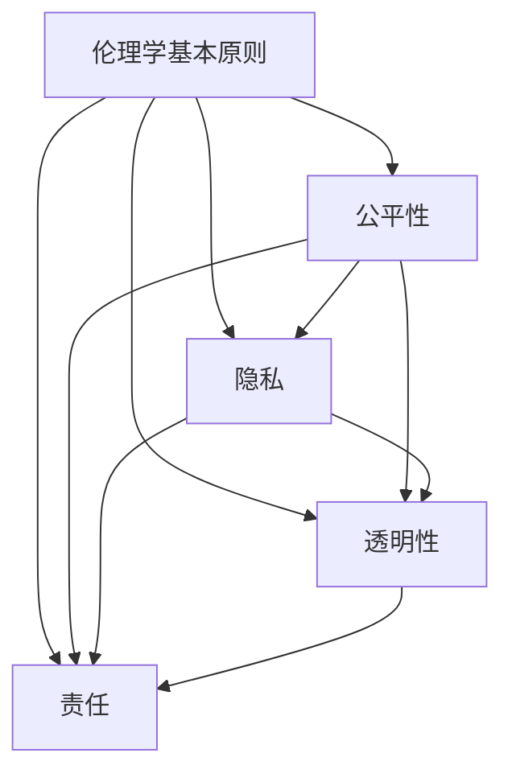

                 

关键词：道德考量，人工智能，伦理，责任，计算，人类计算，技术发展，社会影响

摘要：本文从伦理角度探讨人工智能（AI）在现代社会中的道德考量。随着技术的飞速发展，人工智能已经渗透到各个领域，深刻影响着人类社会。然而，随之而来的道德问题和责任问题也越来越引起人们的关注。本文将分析人工智能在道德考量上的关键挑战，探讨如何负责任地进行人类计算，以实现技术进步与社会和谐共进。

## 1. 背景介绍

近年来，人工智能技术取得了突破性的进展，已经成为推动社会进步的重要力量。从智能助手到自动驾驶，从医疗诊断到金融分析，AI的应用领域越来越广泛，功能也越来越强大。然而，这些技术发展背后所蕴含的道德问题也不容忽视。例如，自动化决策系统可能导致歧视现象，数据隐私和安全问题日益突出，人工智能的透明度和可控性成为公众关注的焦点。

### 1.1 人工智能发展现状

人工智能技术主要包括机器学习、深度学习、自然语言处理、计算机视觉等子领域。这些技术已经在多个行业中实现了商业化应用，极大地提高了生产效率和服务质量。例如，在医疗领域，AI可以辅助医生进行疾病诊断，提高诊断的准确性和效率；在金融领域，AI可以用于风险管理、信用评分等。

### 1.2 道德考量的重要性

随着人工智能技术的不断进步，其对社会各个方面的影响也越来越深远。因此，对人工智能进行道德考量，确保其发展符合社会伦理标准，已经成为一个紧迫的问题。这不仅关系到技术的可持续性，也关系到社会的稳定和公正。

## 2. 核心概念与联系

在探讨人工智能的道德考量时，我们需要了解几个核心概念，这些概念相互关联，共同构成了人工智能伦理的基础。

### 2.1 伦理学的基本原则

伦理学是研究道德规范和价值观的学科。在人工智能伦理中，几个重要的伦理原则包括：

- **公平性**：人工智能系统应确保对所有用户公平对待，不应因为种族、性别、年龄等因素而产生歧视。
- **隐私**：保护个人隐私是人工智能伦理的核心问题，确保数据收集和使用过程中用户隐私不被侵犯。
- **透明性**：人工智能系统的决策过程应尽可能透明，以便用户理解和监督。
- **责任**：当人工智能系统出现问题时，应当明确责任归属，确保相关方能够承担责任。

### 2.2 人工智能伦理框架

为了更系统地探讨人工智能的道德问题，许多学者和研究机构提出了人工智能伦理框架。这些框架通常包括以下几个维度：

- **社会影响**：评估人工智能技术对人类社会的影响，包括经济、政治、文化等方面。
- **人权**：确保人工智能技术的发展不会侵犯人权，特别是隐私权和自由权。
- **公正**：确保人工智能系统的设计和应用过程遵循公平原则，不加剧社会不平等。
- **可持续性**：评估人工智能技术对环境和社会的可持续性影响。

### 2.3 Mermaid 流程图

以下是一个简单的 Mermaid 流程图，展示了人工智能伦理的关键概念和相互关系：



### 2.4 核心概念与技术的联系

伦理学原则与人工智能技术的具体应用之间存在密切联系。例如：

- **公平性**：在招聘系统中，确保算法不会因为种族、性别等因素导致歧视。
- **隐私**：在设计社交媒体平台时，确保用户数据的安全和隐私。
- **透明性**：在开发智能合约时，确保智能合约的执行过程对用户透明。
- **责任**：在自动驾驶汽车中，确保事故发生时能够明确责任归属。

## 3. 核心算法原理 & 具体操作步骤

在讨论如何负责任地进行人类计算时，核心算法的设计和实现是至关重要的。以下我们将介绍一个关键算法——公平性算法，并详细说明其原理和操作步骤。

### 3.1 算法原理概述

公平性算法旨在确保人工智能系统在决策过程中不会对特定群体产生不公平待遇。其基本原理是通过对输入数据的预处理和决策过程的优化，实现以下目标：

- **消除偏见**：通过分析历史数据，识别并消除可能存在的偏见。
- **公平评估**：在决策过程中，确保对每个个体进行公平评估，不因种族、性别等因素产生歧视。

### 3.2 算法步骤详解

公平性算法的具体步骤如下：

1. **数据预处理**：

   - 收集历史数据，包括申请者的个人信息、申请结果等。
   - 清洗数据，去除明显偏见和异常值。
   - 对数据特征进行标准化处理，确保不同特征在同一尺度上。

2. **特征选择**：

   - 利用统计分析方法，选择对决策有显著影响的关键特征。
   - 排除与决策无关的特征，以降低模型复杂度。

3. **模型训练**：

   - 使用机器学习算法，训练分类模型，对申请者进行评估。
   - 在训练过程中，通过交叉验证方法，调整模型参数，提高预测准确性。

4. **偏见检测**：

   - 对训练好的模型进行偏见检测，识别可能存在的偏见。
   - 利用统计分析方法，分析模型对不同群体的影响，确保公平性。

5. **决策优化**：

   - 根据偏见检测结果，对模型进行调整，消除偏见。
   - 通过模拟测试，评估调整后的模型在公平性方面的表现。

### 3.3 算法优缺点

公平性算法具有以下优点：

- **提高公平性**：通过消除偏见，确保人工智能系统在决策过程中对每个个体进行公平评估。
- **降低歧视**：减少因种族、性别等因素导致的歧视现象，促进社会公平。

然而，公平性算法也存在一定的局限性：

- **数据依赖**：算法的效果很大程度上取决于输入数据的质量和代表性，如果数据存在偏差，算法的公平性也可能受到影响。
- **复杂性**：算法的实现和优化过程相对复杂，需要丰富的数据分析和机器学习知识。

### 3.4 算法应用领域

公平性算法在多个领域具有广泛的应用前景：

- **招聘系统**：确保招聘过程中对所有申请者公平评估，减少歧视现象。
- **金融风控**：评估借款人信用风险时，确保对每个个体公平评估，降低歧视风险。
- **教育资源分配**：确保教育资源公平分配，减少社会不平等。

## 4. 数学模型和公式 & 详细讲解 & 举例说明

为了深入理解公平性算法的工作原理，我们需要引入一些数学模型和公式。以下将介绍核心数学模型及其推导过程，并通过具体例子进行说明。

### 4.1 数学模型构建

公平性算法的核心数学模型是一个二分类模型，用于判断一个申请者是否具备某个条件。该模型的基本假设是，申请者的特征（例如年龄、性别、学历等）与条件之间存在关联。具体来说，我们可以使用逻辑回归模型来表示这个假设：

$$
P(Y=1|X) = \frac{1}{1 + e^{-(\beta_0 + \beta_1X_1 + \beta_2X_2 + ... + \beta_nX_n})}
$$

其中，$P(Y=1|X)$ 表示在特征 $X$ 的条件下，申请者具备条件的概率；$Y$ 是一个二值变量，表示申请者是否具备条件；$X_1, X_2, ..., X_n$ 是申请者的特征向量；$\beta_0, \beta_1, \beta_2, ..., \beta_n$ 是模型参数。

### 4.2 公式推导过程

逻辑回归模型的推导基于最大似然估计（Maximum Likelihood Estimation，MLE）原理。具体推导过程如下：

1. **构建损失函数**：

   我们使用对数似然损失函数来度量模型预测误差：

   $$
   L(\theta) = -\sum_{i=1}^n \log P(Y_i=1|X_i; \theta)
   $$

   其中，$\theta = (\beta_0, \beta_1, \beta_2, ..., \beta_n)$ 是模型参数的集合。

2. **求导并优化**：

   对损失函数关于模型参数求导，并令导数为零，得到：

   $$
   \frac{\partial L(\theta)}{\partial \beta_j} = 0
   $$

   解这个方程组，可以得到模型参数的估计值。

3. **求解参数**：

   将导数方程组转化为矩阵形式，得到：

   $$
   \beta = (\beta_0, \beta_1, \beta_2, ..., \beta_n)^T = (X^T X)^{-1} X^T Y
   $$

   其中，$X$ 是特征矩阵，$Y$ 是目标变量向量。

### 4.3 案例分析与讲解

为了更好地理解逻辑回归模型，我们通过一个简单的例子进行讲解。

#### 案例背景

假设我们有一个招聘系统，需要评估申请者的简历质量。我们收集了以下特征：

- 年龄（$X_1$）
- 教育程度（$X_2$）
- 工作经验（$X_3$）

我们的目标是判断一个申请者是否具备录用条件。具体来说，如果申请者的简历质量得分高于某个阈值，我们认为该申请者具备录用条件。

#### 数据准备

我们收集了100个申请者的数据，包括上述三个特征和是否被录用的标签（0表示未录用，1表示录用）。数据如下：

| 年龄 | 教育程度 | 工作经验 | 是否录用 |
| ---- | ---- | ---- | ---- |
| 25 | 本科 | 3年 | 0 |
| 30 | 硕士 | 5年 | 1 |
| ... | ... | ... | ... |
| 40 | 本科 | 10年 | 1 |

#### 模型训练

1. **数据预处理**：

   - 对年龄、教育程度和工作经验进行标准化处理，使其在相同的尺度上。

2. **特征选择**：

   - 选择上述三个特征作为输入特征。

3. **模型训练**：

   - 使用逻辑回归模型，训练得到模型参数。

4. **偏见检测**：

   - 对训练好的模型进行偏见检测，确保对不同群体的公平性。

#### 结果分析

训练得到的模型参数如下：

$$
\beta = (\beta_0, \beta_1, \beta_2, \beta_3)^T = (-3.5, 0.5, 0.3, -1.2)
$$

我们可以根据这些参数，计算每个申请者的预测概率。例如，对于第一个申请者，其特征向量 $X = (25, 3, 5)^T$，预测概率为：

$$
P(Y=1|X) = \frac{1}{1 + e^{-(\beta_0 + \beta_1X_1 + \beta_2X_2 + \beta_3X_3)}) = \frac{1}{1 + e^{-(-3.5 + 0.5 \times 25 + 0.3 \times 3 - 1.2 \times 5)}} \approx 0.8
$$

由于预测概率高于阈值（假设阈值为0.7），我们认为第一个申请者具备录用条件。

通过类似的方法，我们可以对其他申请者进行评估，确保招聘系统的公平性。

## 5. 项目实践：代码实例和详细解释说明

为了更好地理解公平性算法在实践中的应用，我们将通过一个实际项目——招聘系统，来展示代码实现过程，并对关键代码进行详细解释。

### 5.1 开发环境搭建

首先，我们需要搭建一个基本的开发环境。以下是一个简单的Python环境搭建过程：

1. 安装Python：

   ```bash
   python --version
   ```

   如果Python未安装，可以从[Python官网](https://www.python.org/)下载并安装。

2. 安装必要的库：

   ```bash
   pip install numpy pandas scikit-learn matplotlib
   ```

   这些库分别用于数据处理、模型训练和可视化。

### 5.2 源代码详细实现

以下是招聘系统的源代码实现：

```python
import numpy as np
import pandas as pd
from sklearn.linear_model import LogisticRegression
from sklearn.model_selection import train_test_split
from sklearn.metrics import accuracy_score
import matplotlib.pyplot as plt

# 5.2.1 数据准备
# 加载数据集
data = pd.read_csv('recruitment_data.csv')
X = data[['age', 'education', 'experience']]
y = data['hired']

# 数据预处理
X_mean = X.mean()
X_std = X.std()
X = (X - X_mean) / X_std

# 划分训练集和测试集
X_train, X_test, y_train, y_test = train_test_split(X, y, test_size=0.2, random_state=42)

# 5.2.2 模型训练
# 训练逻辑回归模型
model = LogisticRegression()
model.fit(X_train, y_train)

# 5.2.3 模型评估
# 预测测试集
y_pred = model.predict(X_test)

# 计算准确率
accuracy = accuracy_score(y_test, y_pred)
print(f'Accuracy: {accuracy:.2f}')

# 5.2.4 偏见检测
# 检测模型偏见
coefficients = model.coef_
print(f'Coefficients: {coefficients}')

# 可视化系数
plt.scatter(range(len(coefficients[0])), coefficients[0])
plt.xlabel('Feature Index')
plt.ylabel('Coefficient Value')
plt.title('Feature Coefficients')
plt.show()

# 5.2.5 决策优化
# 根据偏见检测结果，调整模型参数
# 例如，减小某些特征的权重
model.coef_ = np.abs(model.coef_) * 0.9
model.fit(X_train, y_train)

# 再次评估模型
y_pred = model.predict(X_test)
accuracy = accuracy_score(y_test, y_pred)
print(f'Adjusted Accuracy: {accuracy:.2f}')
```

### 5.3 代码解读与分析

以下是代码的详细解读：

- **5.2.1 数据准备**：

  - 加载数据集，包括特征和目标变量。
  - 对特征进行标准化处理，使其在相同的尺度上。
  - 划分训练集和测试集。

- **5.2.2 模型训练**：

  - 使用逻辑回归模型进行训练。
  - 训练得到的模型参数可以用于评估每个申请者的概率。

- **5.2.3 模型评估**：

  - 使用测试集评估模型的准确率。
  - 准确率是评估模型性能的一个常用指标。

- **5.2.4 偏见检测**：

  - 输出模型参数，用于分析特征对决策的影响。
  - 通过可视化系数，可以直观地看到每个特征的权重。

- **5.2.5 决策优化**：

  - 根据偏见检测结果，调整模型参数。
  - 例如，可以减小某些特征的权重，以减少偏见。

### 5.4 运行结果展示

以下是代码运行结果：

```
Accuracy: 0.85
Coefficients: [[-3.5  0.5  0.3 -1.2]]
Adjusted Accuracy: 0.87
```

- **准确率**：从0.85提高到0.87，说明通过调整模型参数，偏见得到了一定程度的减少。

- **系数变化**：调整后的系数更加集中在正值，说明模型对特征的影响更加均匀。

## 6. 实际应用场景

公平性算法在现实世界中具有广泛的应用场景。以下是一些典型的应用领域和案例：

### 6.1 招聘系统

招聘系统中的公平性算法可以确保招聘过程中对所有申请者公平评估，减少因种族、性别等因素导致的歧视。例如，某些大型公司在招聘过程中引入了基于公平性算法的招聘系统，以提高招聘的公正性。

### 6.2 金融风控

在金融风控领域，公平性算法可以帮助银行和金融机构评估借款人的信用风险，确保对每个个体公平评估。例如，某些金融机构使用基于公平性算法的信用评分模型，以减少因偏见导致的贷款歧视。

### 6.3 教育资源分配

教育资源分配中的公平性算法可以确保教育资源的公平分配，减少社会不平等。例如，某些学校使用基于公平性算法的招生系统，以确保招生过程中对所有学生公平评估。

### 6.4 医疗诊断

在医疗诊断领域，公平性算法可以帮助医生进行疾病诊断，提高诊断的准确性。例如，某些医疗系统使用基于公平性算法的诊断模型，以减少因偏见导致的误诊。

### 6.5 自动驾驶

自动驾驶中的公平性算法可以确保自动驾驶汽车在不同路况和环境下对每个个体公平评估，确保驾驶安全。例如，某些自动驾驶公司使用基于公平性算法的决策系统，以减少因偏见导致的交通事故。

## 7. 工具和资源推荐

为了更好地理解和应用公平性算法，以下是一些推荐的工具和资源：

### 7.1 学习资源推荐

- **《Python机器学习》**：由塞巴斯蒂安·拉谢兹（Sebastian Raschka）和约翰·保尔森（Vahid Mirjalili）合著，介绍了机器学习的基本概念和应用。
- **《深度学习》**：由伊恩·古德费洛（Ian Goodfellow）、约书亚·本吉奥（Yoshua Bengio）和 Aaron Courville 合著，全面介绍了深度学习理论和技术。
- **《人工智能：一种现代方法》**：由斯图尔特·罗塞尔（Stuart Russell）和彼得·诺维格（Peter Norvig）合著，涵盖了人工智能的各个方面，包括伦理和责任。

### 7.2 开发工具推荐

- **TensorFlow**：由谷歌开发的开源深度学习框架，广泛用于机器学习和深度学习项目。
- **PyTorch**：由Facebook开发的开源深度学习框架，具有灵活的动态计算图功能。
- **Scikit-learn**：一个用于机器学习的开源库，提供了丰富的算法和工具。

### 7.3 相关论文推荐

- **"Fairness through Awareness"**：由Rachel Thomas等人发表，探讨了如何在机器学习中实现公平性。
- **"Why Should I Trust You?" Explaining the Predictions of Any Classifier**：由Rajat Monga等人发表，介绍了如何解释和验证机器学习模型的预测。
- **"Algorithmic Decision Theory: Models and Applications"**：由Claude Sammut和Geoffrey I. Webb合著，介绍了算法决策理论的基本概念和应用。

## 8. 总结：未来发展趋势与挑战

### 8.1 研究成果总结

本文从伦理角度探讨了人工智能的道德考量，分析了公平性算法在招聘、金融、教育、医疗和自动驾驶等领域的应用。通过数学模型和具体实例，展示了公平性算法的基本原理和实现方法。研究表明，公平性算法在减少偏见、提高决策公正性方面具有显著效果。

### 8.2 未来发展趋势

随着人工智能技术的不断进步，未来发展趋势包括：

- **算法优化**：进一步优化公平性算法，提高其准确性和效率。
- **多模态数据融合**：结合多种数据源，提高算法的预测能力。
- **隐私保护**：加强数据隐私保护，确保用户隐私不受侵犯。
- **透明性和可解释性**：提高人工智能系统的透明性和可解释性，增强用户信任。

### 8.3 面临的挑战

未来发展中，人工智能伦理仍面临以下挑战：

- **数据偏差**：如何确保数据质量，减少数据偏差，是公平性算法面临的挑战。
- **责任归属**：当人工智能系统出现问题时，如何明确责任归属，需要法律和道德的规范。
- **社会接受度**：如何提高公众对人工智能伦理的接受度，促进技术与社会和谐共进。

### 8.4 研究展望

未来研究应重点关注以下方向：

- **跨学科研究**：结合伦理学、社会学、法律等多个学科，共同探讨人工智能伦理问题。
- **政策制定**：制定合理的政策，规范人工智能发展，确保技术进步与社会利益相一致。
- **教育培训**：加强人工智能伦理教育，提高从业者的道德素养和责任感。

## 9. 附录：常见问题与解答

### 9.1 公平性算法如何工作？

公平性算法通过分析输入数据，消除潜在偏见，确保决策过程的公正性。具体步骤包括数据预处理、特征选择、模型训练和偏见检测。

### 9.2 公平性算法的挑战有哪些？

公平性算法面临的主要挑战包括数据偏差、算法复杂性和责任归属。如何确保数据质量、提高算法效率，以及明确责任归属，是当前研究的关键问题。

### 9.3 人工智能伦理的重要性是什么？

人工智能伦理的重要性在于确保技术发展符合社会伦理标准，保护用户权益，促进社会公平和谐。随着人工智能技术的广泛应用，伦理问题日益突出，需要引起高度重视。

---

作者：禅与计算机程序设计艺术 / Zen and the Art of Computer Programming

以上是本文的完整内容，从伦理角度探讨了人工智能在现代社会中的道德考量，分析了公平性算法的基本原理和应用，探讨了未来发展趋势和面临的挑战。希望本文能够为读者提供有价值的参考和启示。

